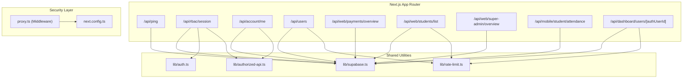
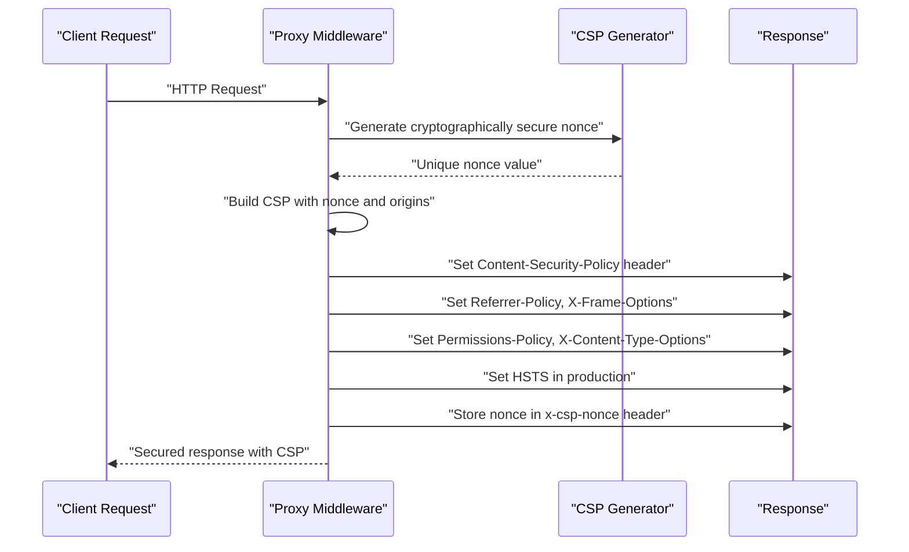
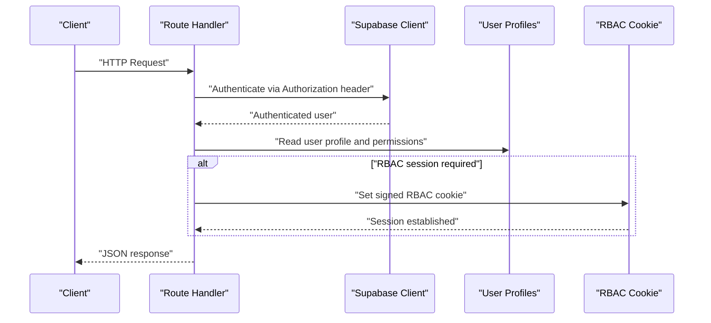
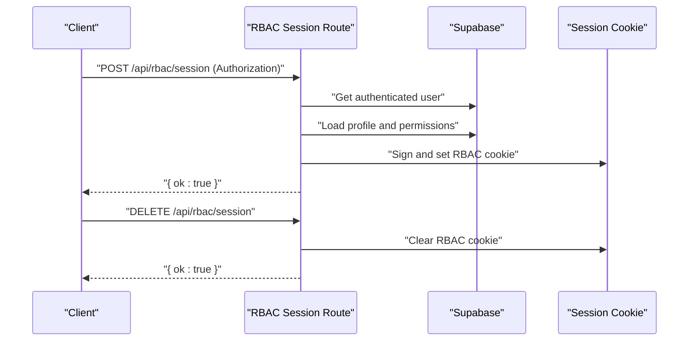
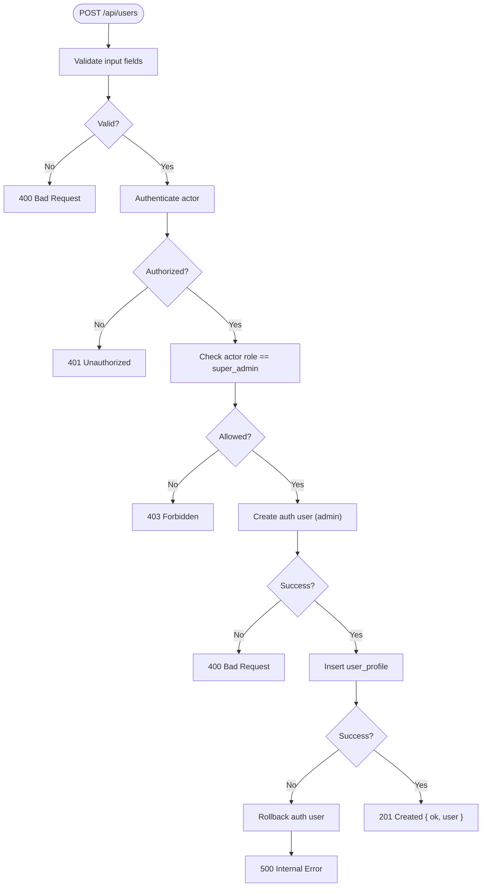
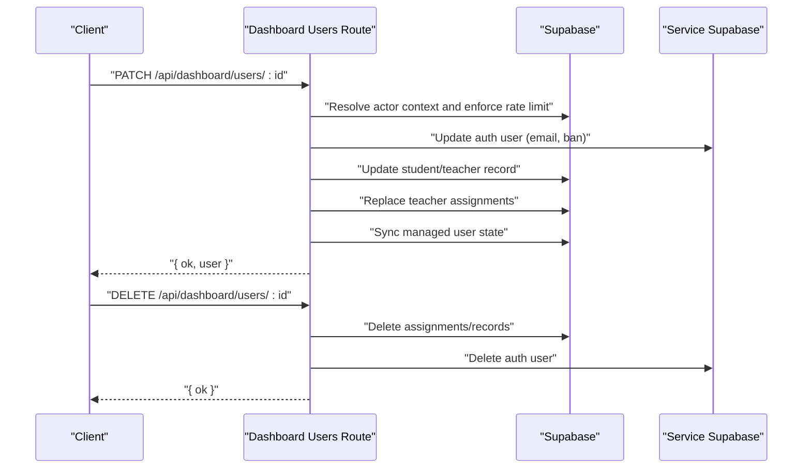
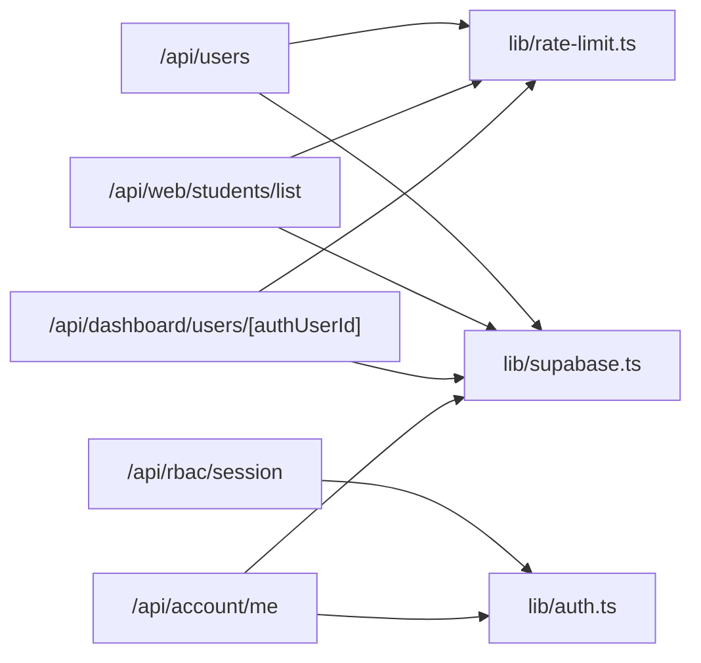

# API Reference

<cite>
**Referenced Files in This Document**
- [next.config.ts](file://next.config.ts)
- [proxy.ts](file://proxy.ts)
- [app/api/ping/route.ts](file://app/api/ping/route.ts)
- [app/api/rbac/session/route.ts](file://app/api/rbac/session/route.ts)
- [app/api/account/me/route.ts](file://app/api/account/me/route.ts)
- [app/api/users/route.ts](file://app/api/users/route.ts)
- [app/api/web/payments/overview/route.ts](file://app/api/web/payments/overview/route.ts)
- [app/api/web/students/list/route.ts](file://app/api/web/students/list/route.ts)
- [app/api/web/super-admin/overview/route.ts](file://app/api/web/super-admin/overview/route.ts)
- [app/api/mobile/student/attendance/route.ts](file://app/api/mobile/student/attendance/route.ts)
- [app/api/dashboard/users/[authUserId]/route.ts](file://app/api/dashboard/users/[authUserId]/route.ts)
- [lib/auth.ts](file://lib/auth.ts)
- [lib/rate-limit.ts](file://lib/rate-limit.ts)
- [lib/authorized-api.ts](file://lib/authorized-api.ts)
- [lib/supabase.ts](file://lib/supabase.ts)
</cite>

## Update Summary
**Changes Made**
- Updated to reflect current REST API architecture with experimental GraphQL API implementation and temporary logging enhancements removed
- Removed references to GraphQL endpoints and logging middleware from documentation
- Streamlined security configuration to focus on current REST API security measures
- Updated API endpoint organization to reflect current Next.js App Router structure
- Enhanced proxy middleware documentation to emphasize CSP implementation

## Table of Contents
1. [Introduction](#introduction)
2. [Project Structure](#project-structure)
3. [Security Configuration](#security-configuration)
4. [Core Components](#core-components)
5. [Architecture Overview](#architecture-overview)
6. [Detailed Component Analysis](#detailed-component-analysis)
7. [Dependency Analysis](#dependency-analysis)
8. [Performance Considerations](#performance-considerations)
9. [Troubleshooting Guide](#troubleshooting-guide)
10. [Conclusion](#conclusion)
11. [Appendices](#appendices)

## Introduction
This document provides a comprehensive API reference for the school management system's RESTful endpoints. It covers authentication, user management, student records, financial operations, and administrative functions. The API follows a clean REST architecture implemented using Next.js App Router, with robust security measures including RBAC session management, rate limiting, and dynamic CSP headers.

## Project Structure
The API surface is implemented using Next.js App Router under the app/api directory. Each route file exports HTTP handlers (GET, POST, PATCH, DELETE) and is organized by functional domain (web, mobile, dashboard, super-admin). The architecture emphasizes clean separation of concerns with shared utilities handling authentication, rate limiting, and Supabase integration.

**Diagram sources**
- [app/api/ping/route.ts:1-51](file://app/api/ping/route.ts#L1-L51)
- [app/api/rbac/session/route.ts:1-155](file://app/api/rbac/session/route.ts#L1-L155)
- [app/api/account/me/route.ts:1-60](file://app/api/account/me/route.ts#L1-L60)
- [app/api/users/route.ts:1-201](file://app/api/users/route.ts#L1-L201)
- [app/api/web/payments/overview/route.ts:1-44](file://app/api/web/payments/overview/route.ts#L1-L44)
- [app/api/web/students/list/route.ts:1-55](file://app/api/web/students/list/route.ts#L1-L55)
- [app/api/web/super-admin/overview/route.ts:1-28](file://app/api/web/super-admin/overview/route.ts#L1-L28)
- [app/api/mobile/student/attendance/route.ts:1-22](file://app/api/mobile/student/attendance/route.ts#L1-L22)
- [app/api/dashboard/users/[authUserId]/route.ts](file://app/api/dashboard/users/[authUserId]/route.ts#L1-L464)
- [lib/auth.ts:1-341](file://lib/auth.ts#L1-L341)
- [lib/rate-limit.ts:1-102](file://lib/rate-limit.ts#L1-L102)
- [lib/authorized-api.ts:1-49](file://lib/authorized-api.ts#L1-L49)
- [lib/supabase.ts:1-22](file://lib/supabase.ts#L1-L22)
- [next.config.ts:1-50](file://next.config.ts#L1-L50)
- [proxy.ts:1-139](file://proxy.ts#L1-L139)

**Section sources**
- [app/api/ping/route.ts:1-51](file://app/api/ping/route.ts#L1-L51)
- [app/api/rbac/session/route.ts:1-155](file://app/api/rbac/session/route.ts#L1-L155)
- [app/api/account/me/route.ts:1-60](file://app/api/account/me/route.ts#L1-L60)
- [app/api/users/route.ts:1-201](file://app/api/users/route.ts#L1-L201)
- [app/api/web/payments/overview/route.ts:1-44](file://app/api/web/payments/overview/route.ts#L1-L44)
- [app/api/web/students/list/route.ts:1-55](file://app/api/web/students/list/route.ts#L1-L55)
- [app/api/web/super-admin/overview/route.ts:1-28](file://app/api/web/super-admin/overview/route.ts#L1-L28)
- [app/api/mobile/student/attendance/route.ts:1-22](file://app/api/mobile/student/attendance/route.ts#L1-L22)
- [app/api/dashboard/users/[authUserId]/route.ts](file://app/api/dashboard/users/[authUserId]/route.ts#L1-L464)
- [lib/auth.ts:1-341](file://lib/auth.ts#L1-L341)
- [lib/rate-limit.ts:1-102](file://lib/rate-limit.ts#L1-L102)
- [lib/authorized-api.ts:1-49](file://lib/authorized-api.ts#L1-L49)
- [lib/supabase.ts:1-22](file://lib/supabase.ts#L1-L22)

## Security Configuration

**Updated** The security configuration has been streamlined to focus on the current REST API architecture with emphasis on dynamic security headers and CSP implementation.

### Next.js Build Configuration
The Next.js configuration focuses on static asset optimization and minimal security headers for static resources only:

- **Static Asset Security**: Basic security headers applied only to static assets via `next.config.ts`
- **Dynamic Security Headers**: Advanced CSP with per-request nonces moved to proxy middleware
- **Output Tracing**: Optimized for deployment efficiency with `outputFileTracingRoot`

### Proxy Middleware Security Implementation
The proxy middleware (`proxy.ts`) handles comprehensive security headers dynamically:

- **Content Security Policy (CSP)**: Generated with unique nonces for each request
- **Dynamic Origins**: Automatically resolves Supabase origins for secure connections
- **Per-Request Nonces**: Cryptographically secure nonces for script tag validation
- **Environment-Specific Settings**: Different configurations for development vs production

**Diagram sources**
- [proxy.ts:7-17](file://proxy.ts#L7-L17)
- [proxy.ts:44-85](file://proxy.ts#L44-L85)
- [proxy.ts:91-123](file://proxy.ts#L91-L123)

**Section sources**
- [next.config.ts:1-50](file://next.config.ts#L1-L50)
- [proxy.ts:1-139](file://proxy.ts#L1-L139)

## Core Components
- Authentication and Authorization
  - Supabase-based authentication and session retrieval.
  - RBAC session cookie initialization and clearing.
  - Role-based access checks and permission enforcement.
- Rate Limiting
  - In-memory sliding window with per-user and per-endpoint namespaces.
- Request Utilities
  - Helpers to attach Authorization headers and fetch JSON payloads.

**Section sources**
- [lib/auth.ts:1-341](file://lib/auth.ts#L1-L341)
- [lib/rate-limit.ts:1-102](file://lib/rate-limit.ts#L1-L102)
- [lib/authorized-api.ts:1-49](file://lib/authorized-api.ts#L1-L49)
- [lib/supabase.ts:1-22](file://lib/supabase.ts#L1-L22)

## Architecture Overview
The API follows a layered architecture:
- Route handlers in app/api implement HTTP endpoints.
- Supabase clients are created per-request to enforce Row Level Security (RLS).
- RBAC session cookies are used to authorize server-side access to admin features.
- Shared utilities encapsulate cross-cutting concerns like rate limiting and authentication.

**Diagram sources**
- [app/api/rbac/session/route.ts:14-133](file://app/api/rbac/session/route.ts#L14-L133)
- [app/api/account/me/route.ts:28-59](file://app/api/account/me/route.ts#L28-L59)
- [lib/auth.ts:106-149](file://lib/auth.ts#L106-L149)

## Detailed Component Analysis

### Health Check
- Method: GET
- Path: /api/ping
- Purpose: Lightweight server health and Supabase connectivity probe.
- Authentication: Not required
- Response fields:
  - ok: boolean
  - pong: number (timestamp)
  - timestamp: string (ISO)
  - supabase: "ok" | "error" | "unconfigured"
- Notes: Response is not cached.

**Section sources**
- [app/api/ping/route.ts:1-51](file://app/api/ping/route.ts#L1-L51)

### RBAC Session Management
- Methods: POST, DELETE
- Path: /api/rbac/session
- Purpose: Initialize or clear an RBAC session cookie for admin features.
- Authentication:
  - POST requires a valid Authorization header.
  - DELETE is rate-limited.
- Behavior:
  - POST validates user role, loads permissions, checks school and subscription status, signs a session payload, and sets a cookie.
  - DELETE clears the RBAC cookie.
- Response fields:
  - POST: { ok: true }
  - DELETE: { ok: true }
- Rate limits:
  - POST: 30 hits/minute per user ID.
  - DELETE: 60 hits/minute.

**Diagram sources**
- [app/api/rbac/session/route.ts:14-154](file://app/api/rbac/session/route.ts#L14-L154)

**Section sources**
- [app/api/rbac/session/route.ts:1-155](file://app/api/rbac/session/route.ts#L1-L155)
- [lib/rate-limit.ts:65-101](file://lib/rate-limit.ts#L65-L101)

### Current Account Context
- Method: GET
- Path: /api/account/me
- Purpose: Load managed account context for the authenticated user.
- Authentication: Required
- Response fields:
  - ok: boolean
  - account: object containing role, permissions, and access decision
- Error responses:
  - 401: Unauthorized
  - 403: Forbidden or insufficient access
  - 500: Internal error

**Section sources**
- [app/api/account/me/route.ts:1-60](file://app/api/account/me/route.ts#L1-L60)
- [lib/authorized-api.ts:14-25](file://lib/authorized-api.ts#L14-L25)

### Users (Administrative)
- Method: POST
- Path: /api/users
- Purpose: Create a new user via Supabase Auth Admin and insert a user profile.
- Authentication: Required
- Permissions:
  - Only super_admin can create users.
- Request body fields:
  - email: string (required)
  - password: string (8–72 chars)
  - full_name: string
  - role: string (normalized)
  - school_id: string (required for non-super_admin)
  - phone: string
  - is_active: boolean (default true)
  - custom_permissions: array of permission strings
- Validation:
  - Email pattern validated.
  - Password length validated.
  - Role normalization enforced.
  - School ID required for non-super_admin.
- Response fields:
  - ok: boolean
  - user: { id, email }
- Error responses:
  - 400: Invalid input or auth user creation failure
  - 401: Unauthorized
  - 403: Forbidden
  - 500: Internal error (with rollback on profile insert failure)
- Rate limit: 10 per 10 minutes per actor user ID.

**Diagram sources**
- [app/api/users/route.ts:77-200](file://app/api/users/route.ts#L77-L200)

**Section sources**
- [app/api/users/route.ts:1-201](file://app/api/users/route.ts#L1-L201)
- [lib/rate-limit.ts:65-101](file://lib/rate-limit.ts#L65-L101)

### Web: Payments Overview
- Method: GET
- Path: /api/web/payments/overview
- Purpose: Retrieve payments overview scoped to the authenticated user's school.
- Authentication: Required
- Query parameters:
  - schoolId: optional; if omitted, inferred from actor context
- Allowed roles: super_admin, admin, employee
- Response fields:
  - ok: boolean
  - Additional metrics returned by resolver
  - students: [] (placeholder)
  - paymentCountsByStudent: {}
  - archiveNotice: string (migration notice)
- Error responses:
  - 403: Insufficient permissions
  - 500: Internal error

**Section sources**
- [app/api/web/payments/overview/route.ts:1-44](file://app/api/web/payments/overview/route.ts#L1-L44)

### Web: Students List
- Method: GET
- Path: /api/web/students/list
- Purpose: Paginated and filtered list of students scoped to the authenticated user's school.
- Authentication: Required
- Query parameters:
  - schoolId: optional; inferred from actor context if absent
- Allowed roles: super_admin, admin, employee
- Response fields:
  - ok: boolean
  - items: array of student records
  - pagination: metadata
- Rate limit: 120 hits/minute per user ID.
- Cache policy: no-store.

**Section sources**
- [app/api/web/students/list/route.ts:1-55](file://app/api/web/students/list/route.ts#L1-L55)
- [lib/rate-limit.ts:65-101](file://lib/rate-limit.ts#L65-L101)

### Super Admin: Overview
- Method: GET
- Path: /api/web/super-admin/overview
- Purpose: Load super admin dashboard overview data.
- Authentication: Required
- Allowed roles: super_admin
- Response fields:
  - ok: boolean
  - Metrics and summaries
- Error responses:
  - 403: Insufficient permissions
  - 500: Internal error

**Section sources**
- [app/api/web/super-admin/overview/route.ts:1-28](file://app/api/web/super-admin/overview/route.ts#L1-L28)

### Mobile: Student Attendance
- Method: GET
- Path: /api/mobile/student/attendance
- Purpose: Fetch recent attendance records for the authenticated mobile user.
- Authentication: Required (mobile context)
- Query parameters:
  - Page and limit (default 31, max 120)
- Response fields:
  - ok: boolean
  - gate: object
  - items: array
  - page: number
  - limit: number
- Error responses:
  - 401: Unauthorized
  - 500: Internal error

**Section sources**
- [app/api/mobile/student/attendance/route.ts:1-22](file://app/api/mobile/student/attendance/route.ts#L1-L22)

### Dashboard: Managed User (Patch/Delete)
- Methods: PATCH, DELETE
- Path: /api/dashboard/users/[authUserId]
- Purpose: Update or delete a managed user (student/teacher) within the actor's school scope.
- Authentication: Required
- Path parameter:
  - authUserId: target user ID
- Rate limits:
  - PATCH: 30 per 10 minutes per actor user ID
  - DELETE: 12 per 10 minutes per actor user ID
- PATCH behavior:
  - Validates and merges updates for role-specific fields.
  - Updates auth user (ban duration, email if changed).
  - Updates related student/teacher records and assignments.
  - Syncs managed user state and login identifier.
- DELETE behavior:
  - Deletes teacher assignments and teacher/student records if present.
  - Removes managed profiles and deletes auth user.
- Response fields:
  - PATCH: { ok: boolean, user: updated record }
  - DELETE: { ok: boolean }
- Error responses:
  - 400: Validation or constraint errors
  - 401: Unauthorized
  - 403: Forbidden
  - 404: Not found
  - 409: Conflict (e.g., email already exists)
  - 500: Internal error

**Diagram sources**
- [app/api/dashboard/users/[authUserId]/route.ts](file://app/api/dashboard/users/[authUserId]/route.ts#L125-L352)
- [app/api/dashboard/users/[authUserId]/route.ts](file://app/api/dashboard/users/[authUserId]/route.ts#L354-L463)

**Section sources**
- [app/api/dashboard/users/[authUserId]/route.ts](file://app/api/dashboard/users/[authUserId]/route.ts#L1-L464)
- [lib/rate-limit.ts:65-101](file://lib/rate-limit.ts#L65-L101)

## Dependency Analysis
- Route handlers depend on:
  - Supabase clients for authentication and data access.
  - RBAC utilities for session cookie management.
  - Rate limiting utilities for throttling.
  - Shared libraries for role resolution and access decisions.

**Diagram sources**
- [app/api/users/route.ts:1-201](file://app/api/users/route.ts#L1-L201)
- [app/api/web/students/list/route.ts:1-55](file://app/api/web/students/list/route.ts#L1-L55)
- [app/api/dashboard/users/[authUserId]/route.ts](file://app/api/dashboard/users/[authUserId]/route.ts#L1-L464)
- [app/api/rbac/session/route.ts:1-155](file://app/api/rbac/session/route.ts#L1-L155)
- [app/api/account/me/route.ts:1-60](file://app/api/account/me/route.ts#L1-L60)
- [lib/rate-limit.ts:1-102](file://lib/rate-limit.ts#L1-L102)
- [lib/supabase.ts:1-22](file://lib/supabase.ts#L1-L22)
- [lib/auth.ts:1-341](file://lib/auth.ts#L1-L341)

**Section sources**
- [app/api/users/route.ts:1-201](file://app/api/users/route.ts#L1-L201)
- [app/api/web/students/list/route.ts:1-55](file://app/api/web/students/list/route.ts#L1-L55)
- [app/api/dashboard/users/[authUserId]/route.ts](file://app/api/dashboard/users/[authUserId]/route.ts#L1-L464)
- [app/api/rbac/session/route.ts:1-155](file://app/api/rbac/session/route.ts#L1-L155)
- [app/api/account/me/route.ts:1-60](file://app/api/account/me/route.ts#L1-L60)
- [lib/rate-limit.ts:1-102](file://lib/rate-limit.ts#L1-L102)
- [lib/supabase.ts:1-22](file://lib/supabase.ts#L1-L22)
- [lib/auth.ts:1-341](file://lib/auth.ts#L1-L341)

## Performance Considerations
- Rate limiting:
  - Enforced per endpoint and per user ID to prevent abuse.
  - Headers include Retry-After and X-RateLimit-* for client guidance.
- Caching:
  - Health check responses are not cached.
  - Students list explicitly disables caching.
- Network:
  - Supabase connectivity probe uses short timeouts to avoid blocking health checks.
- Security Headers:
  - Dynamic CSP generation with per-request nonces adds minimal overhead.
  - Proxy middleware processes only non-static routes for security headers.

**Section sources**
- [lib/rate-limit.ts:53-63](file://lib/rate-limit.ts#L53-L63)
- [app/api/ping/route.ts:44-49](file://app/api/ping/route.ts#L44-L49)
- [app/api/web/students/list/route.ts:46-49](file://app/api/web/students/list/route.ts#L46-L49)
- [proxy.ts:91-123](file://proxy.ts#L91-L123)

## Troubleshooting Guide
- Authentication failures:
  - Ensure Authorization header is present and valid for protected endpoints.
  - For RBAC sessions, confirm the user has a valid role and permissions.
- RBAC session issues:
  - Verify RBAC secret configuration and that the session cookie is set.
  - Clear the cookie and reinitialize if stale or mismatched.
- Rate limiting:
  - Respect Retry-After and reduce request frequency.
  - Review X-RateLimit-* headers to understand remaining quota.
- Supabase connectivity:
  - Use /api/ping to verify environment variables and network reachability.
- Managed user operations:
  - Validate role transitions are not attempted; updates are constrained by existing role.
  - Handle rollback scenarios when partial updates succeed.
- Security Headers:
  - Verify CSP nonce is being generated correctly in proxy middleware.
  - Check that Supabase origins are properly resolved for CSP configuration.

**Section sources**
- [app/api/rbac/session/route.ts:14-133](file://app/api/rbac/session/route.ts#L14-L133)
- [lib/rate-limit.ts:86-101](file://lib/rate-limit.ts#L86-L101)
- [app/api/ping/route.ts:10-50](file://app/api/ping/route.ts#L10-L50)
- [app/api/dashboard/users/[authUserId]/route.ts](file://app/api/dashboard/users/[authUserId]/route.ts#L169-L173)
- [proxy.ts:44-85](file://proxy.ts#L44-L85)

## Conclusion
The API provides a secure, rate-limited, and role-scoped interface for managing users, students, payments, and administrative data. RBAC session cookies enable privileged operations, while Supabase enforces row-level security. The streamlined security configuration with dynamic CSP implementation through proxy middleware ensures robust protection. Clients should attach Authorization headers, honor rate-limiting headers, and use the documented endpoints to integrate effectively.

## Appendices

### Authentication and Session Management
- Authorization header:
  - Use "Bearer <access_token>" for protected endpoints.
- RBAC session:
  - POST /api/rbac/session initializes a signed session cookie.
  - DELETE /api/rbac/session clears the cookie.
- Managed account context:
  - GET /api/account/me returns role, permissions, and access decision.

**Section sources**
- [lib/authorized-api.ts:14-25](file://lib/authorized-api.ts#L14-L25)
- [app/api/rbac/session/route.ts:14-133](file://app/api/rbac/session/route.ts#L14-L133)
- [app/api/account/me/route.ts:28-59](file://app/api/account/me/route.ts#L28-L59)

### Request Parameter Validation and Response Formatting
- Validation patterns:
  - Email regex and password length constraints for user creation.
  - Role normalization and permission filtering for custom permissions.
- Response format:
  - All endpoints return JSON with an ok boolean and payload.
  - Errors include an error object with message and optional fieldErrors.

**Section sources**
- [app/api/users/route.ts:26-75](file://app/api/users/route.ts#L26-L75)
- [app/api/dashboard/users/[authUserId]/route.ts](file://app/api/dashboard/users/[authUserId]/route.ts#L175-L182)

### Rate Limiting Reference
- Namespaces and limits:
  - rbac-session: 30/minute per user ID
  - rbac-session-delete: 60/minute
  - users-create: 10 per 10 minutes per user ID
  - students-list: 120/minute per user ID
  - managed-user-patch: 30 per 10 minutes per user ID
  - managed-user-delete: 12 per 10 minutes per user ID
- Headers:
  - Retry-After, X-RateLimit-Limit, X-RateLimit-Remaining, X-RateLimit-Reset

**Section sources**
- [lib/rate-limit.ts:65-101](file://lib/rate-limit.ts#L65-L101)
- [app/api/rbac/session/route.ts:32-40](file://app/api/rbac/session/route.ts#L32-L40)
- [app/api/users/route.ts:103-111](file://app/api/users/route.ts#L103-L111)
- [app/api/web/students/list/route.ts:30-38](file://app/api/web/students/list/route.ts#L30-L38)
- [app/api/dashboard/users/[authUserId]/route.ts](file://app/api/dashboard/users/[authUserId]/route.ts#L142-L150)

### Supabase Environment Configuration
- Required environment variables:
  - NEXT_PUBLIC_SUPABASE_URL
  - NEXT_PUBLIC_SUPABASE_ANON_KEY or NEXT_PUBLIC_SUPABASE_PUBLISHABLE_KEY
- Misconfiguration throws an error during client creation.

**Section sources**
- [lib/supabase.ts:8-19](file://lib/supabase.ts#L8-L19)

### Security Headers and CSP Implementation
- Dynamic CSP Generation:
  - Per-request nonces generated using Web Crypto API
  - Automatic Supabase origin resolution for secure connections
  - Environment-specific script-src policies (unsafe-eval in development)
- Header Configuration:
  - Content-Security-Policy with nonce for script validation
  - Referrer-Policy: strict-origin-when-cross-origin
  - X-Content-Type-Options: nosniff
  - X-Frame-Options: DENY
  - Permissions-Policy: camera=(), microphone=(), geolocation=()
  - Strict-Transport-Security: 31536000 seconds in production

**Section sources**
- [proxy.ts:7-17](file://proxy.ts#L7-L17)
- [proxy.ts:44-85](file://proxy.ts#L44-L85)
- [proxy.ts:91-123](file://proxy.ts#L91-L123)
- [next.config.ts:10-44](file://next.config.ts#L10-L44)