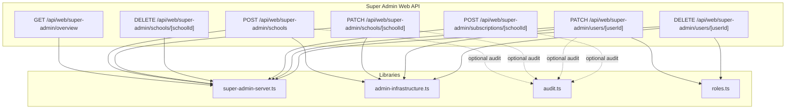
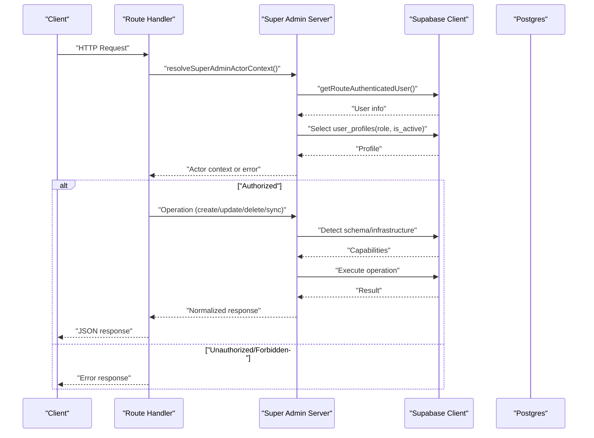
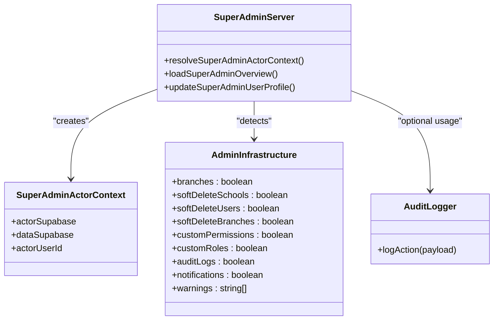
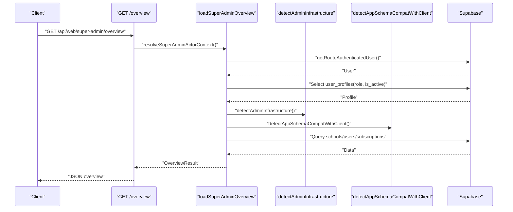
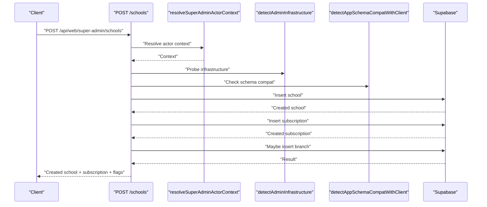
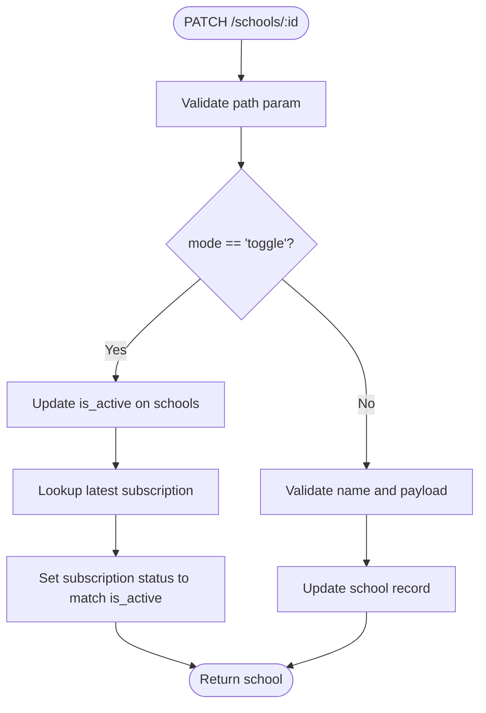
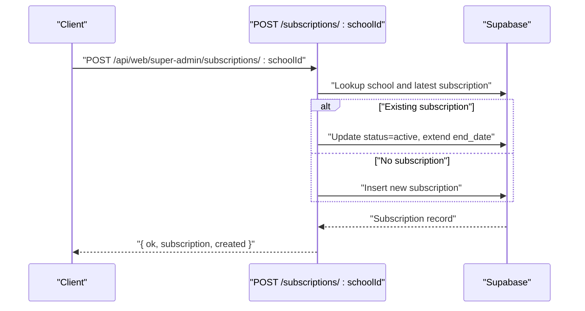
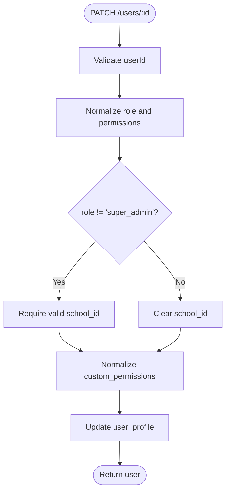
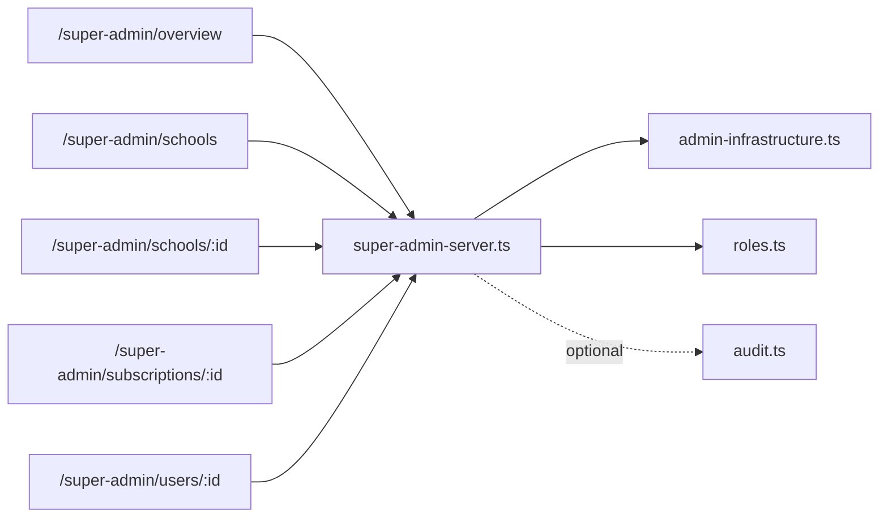

# Administrative API

<cite>
**Referenced Files in This Document**
- [route.ts](file://app/api/web/super-admin/overview/route.ts)
- [route.ts](file://app/api/web/super-admin/schools/route.ts)
- [route.ts](file://app/api/web/super-admin/schools/[schoolId]/route.ts)
- [route.ts](file://app/api/web/super-admin/subscriptions/[schoolId]/route.ts)
- [route.ts](file://app/api/web/super-admin/users/[userId]/route.ts)
- [super-admin-server.ts](file://lib/super-admin-server.ts)
- [admin-infrastructure.ts](file://lib/admin-infrastructure.ts)
- [audit.ts](file://lib/audit.ts)
- [roles.ts](file://types/roles.ts)
</cite>

## Table of Contents
1. [Introduction](#introduction)
2. [Project Structure](#project-structure)
3. [Core Components](#core-components)
4. [Architecture Overview](#architecture-overview)
5. [Detailed Component Analysis](#detailed-component-analysis)
6. [Dependency Analysis](#dependency-analysis)
7. [Performance Considerations](#performance-considerations)
8. [Troubleshooting Guide](#troubleshooting-guide)
9. [Conclusion](#conclusion)

## Introduction
This document describes the administrative management API surface for the Super Admin dashboard. It covers endpoints for:
- Super Admin overview dashboard
- Multi-school creation and management
- Subscription control per school
- User administration including role assignments and activation/deactivation
- Administrative security controls, schema compatibility detection, and audit logging

It also documents request/response schemas, operational flows, and recommended workflows for system-wide operations.

## Project Structure
The administrative API is implemented as Next.js routes under the web API namespace. Supporting logic resides in dedicated libraries for authentication context resolution, infrastructure probing, schema compatibility, and audit logging.

**Diagram sources**
- [route.ts:1-28](file://app/api/web/super-admin/overview/route.ts#L1-L28)
- [route.ts:1-147](file://app/api/web/super-admin/schools/route.ts#L1-L147)
- [route.ts:1-190](file://app/api/web/super-admin/schools/[schoolId]/route.ts#L1-L190)
- [route.ts:1-84](file://app/api/web/super-admin/subscriptions/[schoolId]/route.ts#L1-L84)
- [route.ts:1-139](file://app/api/web/super-admin/users/[userId]/route.ts#L1-L139)
- [super-admin-server.ts:122-168](file://lib/super-admin-server.ts#L122-L168)
- [admin-infrastructure.ts:131-208](file://lib/admin-infrastructure.ts#L131-L208)
- [audit.ts:40-62](file://lib/audit.ts#L40-L62)
- [roles.ts:1-432](file://types/roles.ts#L1-L432)

**Section sources**
- [route.ts:1-28](file://app/api/web/super-admin/overview/route.ts#L1-L28)
- [route.ts:1-147](file://app/api/web/super-admin/schools/route.ts#L1-L147)
- [route.ts:1-190](file://app/api/web/super-admin/schools/[schoolId]/route.ts#L1-L190)
- [route.ts:1-84](file://app/api/web/super-admin/subscriptions/[schoolId]/route.ts#L1-L84)
- [route.ts:1-139](file://app/api/web/super-admin/users/[userId]/route.ts#L1-L139)
- [super-admin-server.ts:122-168](file://lib/super-admin-server.ts#L122-L168)
- [admin-infrastructure.ts:131-208](file://lib/admin-infrastructure.ts#L131-L208)
- [audit.ts:40-62](file://lib/audit.ts#L40-L62)
- [roles.ts:1-432](file://types/roles.ts#L1-L432)

## Core Components
- Super Admin actor context resolver: validates authentication, checks active super admin role, and provides a privileged data client.
- Infrastructure detector: probes database schema capabilities (soft deletes, branches, custom permissions, audit logs, notifications).
- Schema compatibility detector: adapts returned fields based on available columns.
- Audit logging utility: writes audit entries when audit logs table exists.

Key responsibilities:
- Enforce super admin-only access
- Normalize and validate inputs
- Apply schema-aware projections
- Manage cascading updates (e.g., school toggle also syncs subscription status)
- Soft-delete enforcement via infrastructure flags

**Section sources**
- [super-admin-server.ts:122-168](file://lib/super-admin-server.ts#L122-L168)
- [admin-infrastructure.ts:131-208](file://lib/admin-infrastructure.ts#L131-L208)
- [audit.ts:40-62](file://lib/audit.ts#L40-L62)

## Architecture Overview
The administrative API follows a layered pattern:
- Routes: parse auth header, resolve actor context, delegate to server library functions
- Server libraries: perform schema compatibility checks, enforce infrastructure constraints, and interact with the database
- Audit: optional logging when audit logs table is present

**Diagram sources**
- [route.ts:46-95](file://app/api/web/super-admin/schools/route.ts#L46-L95)
- [super-admin-server.ts:122-168](file://lib/super-admin-server.ts#L122-L168)
- [admin-infrastructure.ts:131-208](file://lib/admin-infrastructure.ts#L131-L208)

## Detailed Component Analysis

### Super Admin Overview
- Endpoint: GET /api/web/super-admin/overview
- Purpose: Load dashboard overview data for the Super Admin, including schools, users, and subscriptions with diagnostics and infrastructure notices.
- Authentication: Requires a valid authenticated user with active super admin role.
- Response shape:
  - infrastructureNotice: string
  - infrastructure: detected admin infrastructure capabilities
  - schemaCompat: schema compatibility flags
  - schools: array of school records
  - users: array of user records with optional custom permissions and school relations
  - subscriptions: array of subscription records with status and dates
  - diagnostics: timestamps and dataset statuses

Operational notes:
- Uses schema compatibility to conditionally include color fields and relations.
- Applies fallbacks when relations are missing and attaches school names by ID.
- Returns warnings for missing infrastructure components.

**Section sources**
- [route.ts:9-27](file://app/api/web/super-admin/overview/route.ts#L9-L27)
- [super-admin-server.ts:170-354](file://lib/super-admin-server.ts#L170-L354)

### School Management
Endpoints:
- POST /api/web/super-admin/schools
  - Creates a new school with plan and initial subscription.
  - Optional color fields included if schema supports them.
  - Creates a default branch if supported by infrastructure.
  - Returns created school, subscription, and compatibility flags.
- PATCH /api/web/super-admin/schools/[schoolId]
  - Update mode:
    - Normal update: validates name, applies optional colors, and updates school.
    - Toggle mode: flips is_active and synchronizes latest subscription status accordingly.
- DELETE /api/web/super-admin/schools/[schoolId]
  - Soft-deletes school if infrastructure allows; otherwise returns an error.

Request parameters:
- POST body:
  - name (required)
  - address, phone, owner_email, city, logo_url (optional)
  - primary_color, secondary_color (optional, schema-dependent)
  - plan: basic, premium, enterprise (defaults to basic if invalid)
- PATCH body:
  - mode: "update" or "toggle"
  - For toggle: is_active (boolean)
  - For update: same as POST plus plan
- DELETE: none

Response schemas:
- School record includes id, name, address, contact fields, plan, is_active, timestamps, and optional colors.
- Subscription record includes id, school_id, plan, status, start_date, end_date, created_at.

Behavioral notes:
- Toggle mode ensures subscription status mirrors school activation.
- Branch creation is skipped or handled gracefully depending on infrastructure flags.

**Section sources**
- [route.ts:46-146](file://app/api/web/super-admin/schools/route.ts#L46-L146)
- [route.ts:31-142](file://app/api/web/super-admin/schools/[schoolId]/route.ts#L31-L142)
- [route.ts:144-189](file://app/api/web/super-admin/schools/[schoolId]/route.ts#L144-L189)
- [super-admin-server.ts:24-63](file://lib/super-admin-server.ts#L24-L63)

### Subscription Control
Endpoint:
- POST /api/web/super-admin/subscriptions/[schoolId]
  - Renew or activate a subscription for a school.
  - If a previous subscription exists, reactivates and extends end_date.
  - Otherwise creates a new subscription with current dates and plan.

Request parameters:
- None (uses schoolId from path)

Response schema:
- subscription: subscription record with id, school_id, plan, status, start_date, end_date, created_at
- created: boolean indicating whether a new subscription was created

Operational notes:
- Uses latest subscription to decide renewal vs. creation.
- Sets status to active and sets 1-year period.

**Section sources**
- [route.ts:11-83](file://app/api/web/super-admin/subscriptions/[schoolId]/route.ts#L11-L83)

### User Administration
Endpoints:
- PATCH /api/web/super-admin/users/[userId]
  - Updates user profile with role, school association, phone, is_active, and optional custom permissions.
  - Validates role and school association; normalizes permissions against role templates.
- DELETE /api/web/super-admin/users/[userId]
  - Soft-deletes user if infrastructure allows; prevents self-deletion.

Request parameters:
- PATCH body:
  - full_name, email, role, school_id, phone, is_active, custom_permissions (array of permission keys)
- DELETE: none

Response schema:
- User record includes id, full_name, email, role, school_id, phone, is_active, created_at, optional custom_permissions, and optional school relation.

Behavioral notes:
- Role normalization ensures only known roles are accepted.
- Custom permissions are validated and normalized against the role’s template.
- Soft-delete enforcement requires appropriate infrastructure columns.

**Section sources**
- [route.ts:21-86](file://app/api/web/super-admin/users/[userId]/route.ts#L21-L86)
- [route.ts:88-139](file://app/api/web/super-admin/users/[userId]/route.ts#L88-L139)
- [roles.ts:38-151](file://types/roles.ts#L38-L151)

### Administrative Security Controls and RBAC
- Super Admin-only access enforced by resolving actor context and checking role.
- Route-level access rules define which paths require super admin and whether an active school is required.
- Permission rules define granular permissions for specific paths (e.g., manage schools, manage subscriptions).
- Role normalization and permission normalization ensure consistent enforcement.

**Section sources**
- [super-admin-server.ts:122-160](file://lib/super-admin-server.ts#L122-L160)
- [roles.ts:196-268](file://types/roles.ts#L196-L268)

### Audit Logging
- Audit actions include create, update, delete, restore, login, logout, role_change, subscription_renew, export, import.
- Entity types include school, user, subscription, student, payment, expense, branch, role.
- The logAction function inserts into audit_logs when available, with actor metadata derived from the current session.
- Non-fatal errors are suppressed when audit logs table is missing.

**Section sources**
- [audit.ts:4-32](file://lib/audit.ts#L4-L32)
- [audit.ts:40-62](file://lib/audit.ts#L40-L62)

## Architecture Overview

**Diagram sources**
- [super-admin-server.ts:18-22](file://lib/super-admin-server.ts#L18-L22)
- [admin-infrastructure.ts:7-17](file://lib/admin-infrastructure.ts#L7-L17)
- [audit.ts:40-62](file://lib/audit.ts#L40-L62)

## Detailed Component Analysis

### Super Admin Overview Flow

**Diagram sources**
- [route.ts:9-27](file://app/api/web/super-admin/overview/route.ts#L9-L27)
- [super-admin-server.ts:170-354](file://lib/super-admin-server.ts#L170-L354)

### School Creation Workflow

**Diagram sources**
- [route.ts:46-146](file://app/api/web/super-admin/schools/route.ts#L46-L146)
- [admin-infrastructure.ts:131-208](file://lib/admin-infrastructure.ts#L131-L208)

### School Toggle and Subscription Sync

**Diagram sources**
- [route.ts:31-142](file://app/api/web/super-admin/schools/[schoolId]/route.ts#L31-L142)

### Subscription Renewal

**Diagram sources**
- [route.ts:27-83](file://app/api/web/super-admin/subscriptions/[schoolId]/route.ts#L27-L83)

### User Update and Role Assignment

**Diagram sources**
- [route.ts:21-86](file://app/api/web/super-admin/users/[userId]/route.ts#L21-L86)
- [roles.ts:38-151](file://types/roles.ts#L38-L151)

## Dependency Analysis
- Routes depend on:
  - Super Admin server for actor context resolution and data operations
  - Admin infrastructure for capability detection
  - Schema compatibility for field selection
  - Roles for permission normalization
- Audit logging is optional and depends on presence of audit logs table.

**Diagram sources**
- [route.ts:1-28](file://app/api/web/super-admin/overview/route.ts#L1-L28)
- [route.ts:1-147](file://app/api/web/super-admin/schools/route.ts#L1-L147)
- [route.ts:1-190](file://app/api/web/super-admin/schools/[schoolId]/route.ts#L1-L190)
- [route.ts:1-84](file://app/api/web/super-admin/subscriptions/[schoolId]/route.ts#L1-L84)
- [route.ts:1-139](file://app/api/web/super-admin/users/[userId]/route.ts#L1-L139)
- [super-admin-server.ts:122-168](file://lib/super-admin-server.ts#L122-L168)
- [admin-infrastructure.ts:131-208](file://lib/admin-infrastructure.ts#L131-L208)
- [audit.ts:40-62](file://lib/audit.ts#L40-L62)
- [roles.ts:1-432](file://types/roles.ts#L1-L432)

**Section sources**
- [super-admin-server.ts:122-168](file://lib/super-admin-server.ts#L122-L168)
- [admin-infrastructure.ts:131-208](file://lib/admin-infrastructure.ts#L131-L208)
- [audit.ts:40-62](file://lib/audit.ts#L40-L62)
- [roles.ts:1-432](file://types/roles.ts#L1-L432)

## Performance Considerations
- Batched capability detection: Infrastructure and schema compatibility checks are performed concurrently with database operations to minimize latency.
- Conditional field selection: Responses include optional fields only when schema supports them, reducing payload size.
- Relation fallbacks: When relations are missing, the server attaches names by ID to avoid repeated joins.
- Caching of capability probes: Repeated checks for table/column existence are short-cached to reduce repeated round-trips.

[No sources needed since this section provides general guidance]

## Troubleshooting Guide
Common issues and resolutions:
- Unauthorized or insufficient privileges:
  - Ensure the caller is authenticated and has an active super admin role.
- Schema/table/column missing:
  - Run the admin infrastructure SQL to add required columns/tables.
  - The system detects missing components and may fall back to compatible views.
- Soft delete constraints:
  - Some operations require soft-delete columns; enable them via infrastructure provisioning.
- Subscription sync failures:
  - Verify latest subscription lookup succeeds; ensure school exists and plan is valid.
- Audit logging disabled:
  - The audit table may be missing; enabling it will allow full audit coverage.

**Section sources**
- [admin-infrastructure.ts:131-208](file://lib/admin-infrastructure.ts#L131-L208)
- [super-admin-server.ts:170-354](file://lib/super-admin-server.ts#L170-L354)
- [audit.ts:40-62](file://lib/audit.ts#L40-L62)

## Conclusion
The administrative API provides a robust, schema-aware interface for Super Admins to manage schools, subscriptions, and users. It enforces strict security boundaries, adapts to varying database schemas, and optionally logs administrative actions. By leveraging infrastructure detection and compatibility checks, it remains operable across diverse deployment states while guiding administrators toward full feature activation.