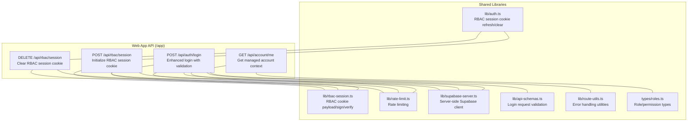
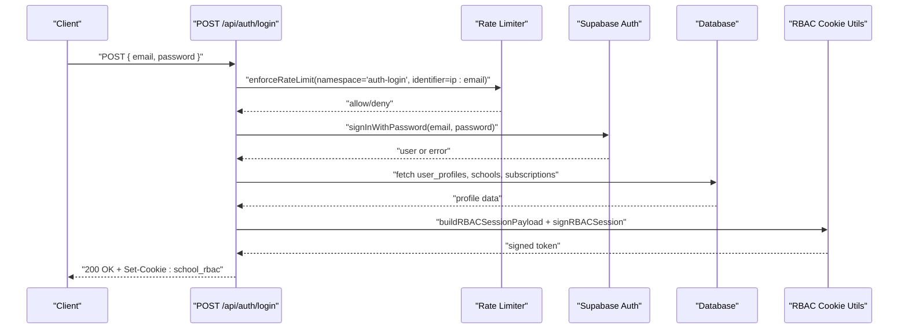
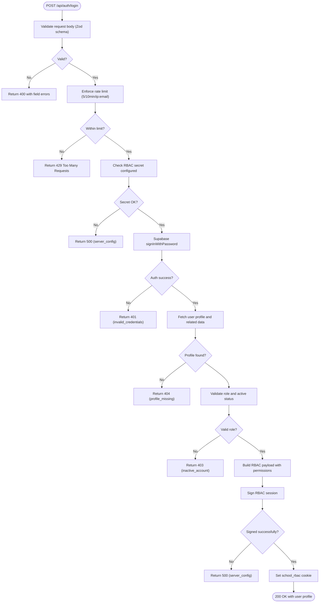
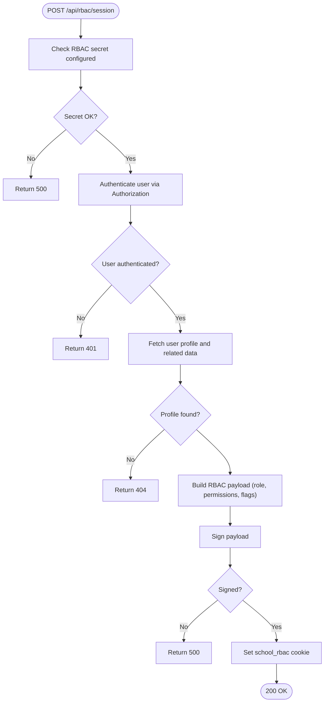
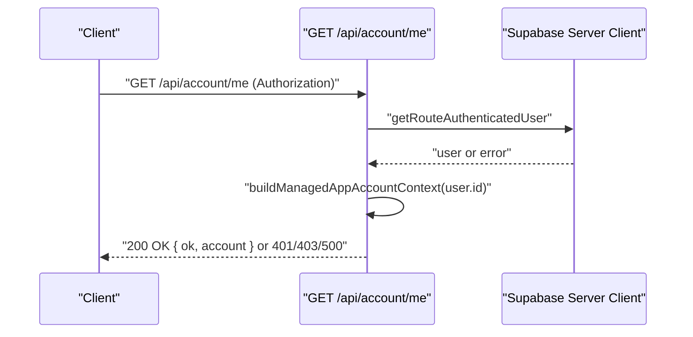
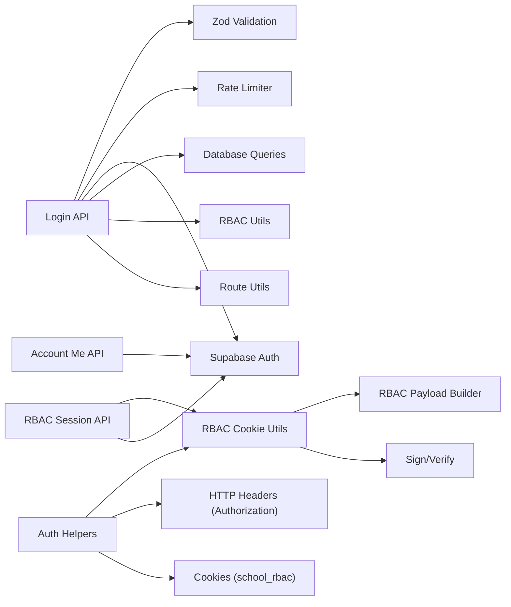

# Authentication API

<cite>
**Referenced Files in This Document**
- [app/api/auth/login/route.ts](file://app/api/auth/login/route.ts)
- [app/api/rbac/session/route.ts](file://app/api/rbac/session/route.ts)
- [lib/rbac-session.ts](file://lib/rbac-session.ts)
- [lib/auth.ts](file://lib/auth.ts)
- [app/api/account/me/route.ts](file://app/api/account/me/route.ts)
- [lib/api-schemas.ts](file://lib/api-schemas.ts)
- [lib/rate-limit.ts](file://lib/rate-limit.ts)
- [lib/supabase-server.ts](file://lib/supabase-server.ts)
- [lib/route-utils.ts](file://lib/route-utils.ts)
- [types/roles.ts](file://types/roles.ts)
</cite>

## Update Summary
**Changes Made**
- Added comprehensive documentation for the new `/api/auth/login` endpoint
- Enhanced authentication flow documentation with improved validation and error handling
- Updated RBAC session management documentation to reflect new integration points
- Added detailed login request/response schemas and validation rules
- Expanded rate limiting documentation for authentication endpoints
- Updated security considerations for the new login API

## Table of Contents
1. [Introduction](#introduction)
2. [Project Structure](#project-structure)
3. [Core Components](#core-components)
4. [Architecture Overview](#architecture-overview)
5. [Detailed Component Analysis](#detailed-component-analysis)
6. [Dependency Analysis](#dependency-analysis)
7. [Performance Considerations](#performance-considerations)
8. [Troubleshooting Guide](#troubleshooting-guide)
9. [Conclusion](#conclusion)

## Introduction
This document provides comprehensive API documentation for the authentication and RBAC session management endpoints. It covers:
- Comprehensive login API with enhanced user validation, role-based access control, and session management
- RBAC session management: login-like initialization, logout, session validation, and token refresh via cookies
- Account management: user profile retrieval and updates
- Request/response schemas, authentication headers, session persistence, and security considerations
- Practical authentication flows, error responses, session timeout handling, rate limiting, and security best practices

## Project Structure
The authentication surface spans multiple API endpoints with enhanced login capabilities:
- Web application API under app/api with Supabase-based authentication and RBAC cookie management
- Comprehensive login endpoint with validation and rate limiting
- Account management and session endpoints



**Diagram sources**
- [app/api/auth/login/route.ts:1-191](file://app/api/auth/login/route.ts#L1-L191)
- [app/api/rbac/session/route.ts:1-144](file://app/api/rbac/session/route.ts#L1-L144)
- [lib/rbac-session.ts:1-159](file://lib/rbac-session.ts#L1-L159)
- [lib/auth.ts:273-340](file://lib/auth.ts#L273-L340)
- [app/api/account/me/route.ts:1-60](file://app/api/account/me/route.ts#L1-L60)
- [lib/api-schemas.ts:97-105](file://lib/api-schemas.ts#L97-L105)
- [lib/rate-limit.ts:1-106](file://lib/rate-limit.ts#L1-L106)
- [lib/supabase-server.ts:1-68](file://lib/supabase-server.ts#L1-L68)
- [lib/route-utils.ts:1-48](file://lib/route-utils.ts#L1-L48)
- [types/roles.ts:1-432](file://types/roles.ts#L1-L432)

**Section sources**
- [app/api/auth/login/route.ts:1-191](file://app/api/auth/login/route.ts#L1-L191)
- [app/api/rbac/session/route.ts:1-144](file://app/api/rbac/session/route.ts#L1-L144)
- [lib/rbac-session.ts:1-159](file://lib/rbac-session.ts#L1-L159)
- [lib/auth.ts:273-340](file://lib/auth.ts#L273-L340)
- [app/api/account/me/route.ts:1-60](file://app/api/account/me/route.ts#L1-L60)
- [lib/api-schemas.ts:97-105](file://lib/api-schemas.ts#L97-L105)
- [lib/rate-limit.ts:1-106](file://lib/rate-limit.ts#L1-L106)
- [lib/supabase-server.ts:1-68](file://lib/supabase-server.ts#L1-L68)
- [lib/route-utils.ts:1-48](file://lib/route-utils.ts#L1-L48)
- [types/roles.ts:1-432](file://types/roles.ts#L1-L432)

## Core Components
- Comprehensive login API with enhanced validation and security
  - Email/password validation with Zod schema
  - Rate limiting per IP and email combination
  - Supabase authentication integration
  - Role-based access control and permission validation
  - RBAC session cookie creation
- RBAC session cookie management
  - Cookie name, signing, verification, and expiration
  - Server-side initialization and clearing
  - Client-side refresh and clear helpers
- Managed account context endpoint
  - Returns account identity, permissions, and access decision
- Enhanced error handling and logging
  - Structured error responses with failure reasons
  - Comprehensive logging for debugging and monitoring

**Section sources**
- [app/api/auth/login/route.ts:18-37](file://app/api/auth/login/route.ts#L18-L37)
- [app/api/auth/login/route.ts:43-190](file://app/api/auth/login/route.ts#L43-L190)
- [lib/rbac-session.ts:3-17](file://lib/rbac-session.ts#L3-L17)
- [lib/rbac-session.ts:112-152](file://lib/rbac-session.ts#L112-L152)
- [app/api/rbac/session/route.ts:14-133](file://app/api/rbac/session/route.ts#L14-L133)
- [app/api/rbac/session/route.ts:135-154](file://app/api/rbac/session/route.ts#L135-L154)
- [lib/auth.ts:273-340](file://lib/auth.ts#L273-L340)
- [app/api/account/me/route.ts:28-59](file://app/api/account/me/route.ts#L28-L59)
- [lib/route-utils.ts:35-47](file://lib/route-utils.ts#L35-L47)

## Architecture Overview
The authentication architecture combines comprehensive login validation with Supabase authentication and a custom RBAC cookie for session management.



**Diagram sources**
- [app/api/auth/login/route.ts:43-190](file://app/api/auth/login/route.ts#L43-L190)
- [lib/rate-limit.ts:69-105](file://lib/rate-limit.ts#L69-L105)
- [lib/supabase-server.ts:53-67](file://lib/supabase-server.ts#L53-L67)
- [lib/rbac-session.ts:55-118](file://lib/rbac-session.ts#L55-L118)

## Detailed Component Analysis

### Comprehensive Login API
- Endpoint: POST /api/auth/login
  - Purpose: Authenticate users with enhanced validation and security measures
  - Request Body Schema:
    - email: string (required, valid email format, trimmed, lowercase)
    - password: string (required, minimum 8 characters)
  - Validation: Zod schema validation with comprehensive error handling
  - Rate Limit: 5 hits per 10 minutes per IP:email combination
  - Authentication Flow:
    - Validates request body against Zod schema
    - Enforces rate limiting based on IP address and email
    - Checks RBAC secret configuration
    - Authenticates via Supabase with email/password
    - Fetches user profile and related data
    - Validates user role and active status
    - Resolves permissions and school/subscription context
    - Creates RBAC session payload and signs it
    - Sets secure session cookie
  - Response: 200 OK with user profile and permissions; Cookie: school_rbac
  - Error Responses: 400 (validation errors), 401 (invalid credentials), 403 (inactive account), 404 (profile missing), 500 (server configuration)

- Failure Response Structure:
  ```json
  {
    "ok": false,
    "reason": "invalid_credentials" | "profile_missing" | "inactive_account" | "server_config"
  }
  ```



**Diagram sources**
- [app/api/auth/login/route.ts:43-190](file://app/api/auth/login/route.ts#L43-L190)
- [lib/api-schemas.ts:97-105](file://lib/api-schemas.ts#L97-L105)
- [lib/rate-limit.ts:69-105](file://lib/rate-limit.ts#L69-L105)
- [lib/rbac-session.ts:111-118](file://lib/rbac-session.ts#L111-L118)

**Section sources**
- [app/api/auth/login/route.ts:18-37](file://app/api/auth/login/route.ts#L18-L37)
- [app/api/auth/login/route.ts:43-190](file://app/api/auth/login/route.ts#L43-L190)
- [lib/api-schemas.ts:97-105](file://lib/api-schemas.ts#L97-L105)
- [lib/rate-limit.ts:69-105](file://lib/rate-limit.ts#L69-L105)
- [lib/route-utils.ts:35-47](file://lib/route-utils.ts#L35-L47)

### RBAC Session Management API
- Endpoint: POST /api/rbac/session
  - Purpose: Initialize or refresh RBAC session cookie after successful user authentication
  - Authentication: Requires Authorization header with Bearer token
  - Rate limit: 30 hits per minute per user ID
  - Behavior:
    - Validates presence of RBAC signing secret
    - Fetches authenticated user and profile
    - Normalizes permissions and computes school/subscription status
    - Builds payload with role, permissions, flags, timestamps, and version
    - Signs payload and sets secure httpOnly cookie
  - Response: 200 OK with ok: true; Cookie: school_rbac
  - Errors: 401 Unauthorized, 403 Forbidden (role mismatch), 404 Not Found (profile), 500 Internal Server Error (secret/signing)

- Endpoint: DELETE /api/rbac/session
  - Purpose: Clear RBAC session cookie
  - Rate limit: 60 hits per minute
  - Response: 200 OK with ok: true; Clears cookie

- Client helpers
  - refreshRBACSessionCookie(profile?, options?): POST or DELETE depending on profile presence
  - clearRBACSessionCookie(): DELETE
  - signOutClient(): Sign out from Supabase and clear RBAC cookie



**Diagram sources**
- [app/api/rbac/session/route.ts:14-133](file://app/api/rbac/session/route.ts#L14-L133)
- [lib/rbac-session.ts:56-119](file://lib/rbac-session.ts#L56-L119)

**Section sources**
- [app/api/rbac/session/route.ts:14-133](file://app/api/rbac/session/route.ts#L14-L133)
- [lib/rbac-session.ts:3-17](file://lib/rbac-session.ts#L3-L17)
- [lib/rbac-session.ts:112-152](file://lib/rbac-session.ts#L112-L152)
- [lib/auth.ts:273-340](file://lib/auth.ts#L273-L340)

### Account Management API
- Endpoint: GET /api/account/me
  - Purpose: Retrieve current managed account context for the authenticated user
  - Authentication: Requires Authorization header with Bearer token
  - Behavior:
    - Validates session via Authorization
    - Builds managed account context including identity, permissions, and access decision
    - Returns ok: true with account object or 403 with error details if access denied
  - Response: 200 OK with ok: true and account object; or 401/403/500 as appropriate



**Diagram sources**
- [app/api/account/me/route.ts:28-59](file://app/api/account/me/route.ts#L28-L59)
- [lib/supabase-server.ts](file://lib/supabase-server.ts)

**Section sources**
- [app/api/account/me/route.ts:28-59](file://app/api/account/me/route.ts#L28-L59)

## Dependency Analysis
- Comprehensive login API depends on:
  - Zod schema validation for request bodies
  - Rate limiting for authentication attempts
  - Supabase authentication service
  - Database queries for user profiles and school/subscription data
  - RBAC session management utilities
  - Error handling and logging utilities
- RBAC cookie lifecycle depends on:
  - RBAC signing secret availability (required in production)
  - Supabase user session validation
  - Role and permission normalization
  - School/subscription status resolution
- Client-side helpers depend on:
  - Supabase session for Authorization header
  - RBAC cookie refresh/clear flows



**Diagram sources**
- [app/api/auth/login/route.ts:4-16](file://app/api/auth/login/route.ts#L4-L16)
- [lib/api-schemas.ts:97-105](file://lib/api-schemas.ts#L97-L105)
- [lib/rate-limit.ts:69-105](file://lib/rate-limit.ts#L69-L105)
- [lib/rbac-session.ts:55-118](file://lib/rbac-session.ts#L55-L118)
- [lib/route-utils.ts:35-47](file://lib/route-utils.ts#L35-L47)
- [lib/supabase-server.ts:53-67](file://lib/supabase-server.ts#L53-L67)

**Section sources**
- [app/api/auth/login/route.ts:1-191](file://app/api/auth/login/route.ts#L1-L191)
- [lib/api-schemas.ts:1-197](file://lib/api-schemas.ts#L1-L197)
- [lib/rate-limit.ts:1-106](file://lib/rate-limit.ts#L1-L106)
- [lib/rbac-session.ts:1-159](file://lib/rbac-session.ts#L1-L159)
- [lib/route-utils.ts:1-48](file://lib/route-utils.ts#L1-L48)
- [lib/supabase-server.ts:1-68](file://lib/supabase-server.ts#L1-L68)
- [lib/auth.ts:273-340](file://lib/auth.ts#L273-L340)
- [app/api/rbac/session/route.ts:14-133](file://app/api/rbac/session/route.ts#L14-L133)
- [app/api/account/me/route.ts:28-59](file://app/api/account/me/route.ts#L28-L59)

## Performance Considerations
- Comprehensive login API performs optimized database queries with concurrent requests to minimize latency
- RBAC session initialization performs up to three database reads (profile, school, subscription) using concurrent requests to minimize latency
- Cookie-based session validation avoids repeated server-side authentication checks for subsequent requests
- Rate limiting reduces abuse risks for both login attempts and session initialization/deletion endpoints
- Zod schema validation provides efficient request validation before database queries

## Troubleshooting Guide
Common issues and resolutions:
- Login validation errors
  - Symptom: 400 response with field-specific error messages
  - Resolution: Check email format and password requirements; ensure both fields are provided
- Rate limit exceeded for login attempts
  - Symptom: 429 response with Retry-After header
  - Resolution: Wait for the specified time before retrying; reduce login attempts
- Invalid credentials
  - Symptom: 401 response with "invalid_credentials" reason
  - Resolution: Verify email and password; ensure account exists and is active
- Profile not found during login
  - Symptom: 404 response with "profile_missing" reason
  - Resolution: Verify user profile exists and is accessible via RLS
- Inactive account during login
  - Symptom: 403 response with "inactive_account" reason
  - Resolution: Contact administrator to activate the account
- RBAC secret not configured (production)
  - Symptom: 500 response indicating RBAC secret is not configured
  - Resolution: Set RBAC_COOKIE_SECRET environment variable; do not rely on fallback in production
- Unauthorized access
  - Symptom: 401 response when Authorization header is missing or invalid
  - Resolution: Ensure Bearer token is present and valid
- Role not permitted for web admin
  - Symptom: 403 response with role mismatch
  - Resolution: Ensure user has a supported web role
- Session timeout handling
  - Symptom: RBAC cookie expires or is cleared
  - Resolution: Re-authenticate and re-initialize RBAC session; client helpers automatically handle refresh/clear

**Section sources**
- [app/api/auth/login/route.ts:18-37](file://app/api/auth/login/route.ts#L18-L37)
- [app/api/auth/login/route.ts:51-59](file://app/api/auth/login/route.ts#L51-L59)
- [app/api/auth/login/route.ts:71-78](file://app/api/auth/login/route.ts#L71-L78)
- [app/api/auth/login/route.ts:86-92](file://app/api/auth/login/route.ts#L86-L92)
- [app/api/auth/login/route.ts:95-100](file://app/api/auth/login/route.ts#L95-L100)
- [lib/rbac-session.ts:23-31](file://lib/rbac-session.ts#L23-L31)
- [app/api/rbac/session/route.ts:15-20](file://app/api/rbac/session/route.ts#L15-L20)
- [app/api/rbac/session/route.ts:28-30](file://app/api/rbac/session/route.ts#L28-L30)
- [app/api/rbac/session/route.ts:49-56](file://app/api/rbac/session/route.ts#L49-L56)
- [app/api/rbac/session/route.ts:58-72](file://app/api/rbac/session/route.ts#L58-L72)
- [lib/rate-limit.ts:69-105](file://lib/rate-limit.ts#L69-L105)

## Conclusion
The authentication system provides comprehensive login capabilities with enhanced validation, security measures, and RBAC session management. The new login API offers improved user experience with structured validation, rate limiting, and comprehensive error handling. It emphasizes secure cookie handling, role-based permissions, and robust protection against abuse. Clients should use the provided helpers to refresh or clear RBAC sessions and ensure proper error handling for authentication failures and timeouts.