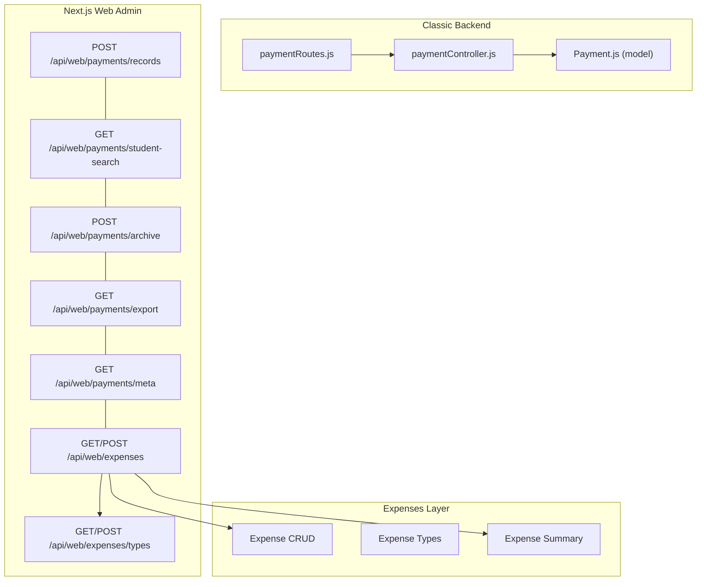
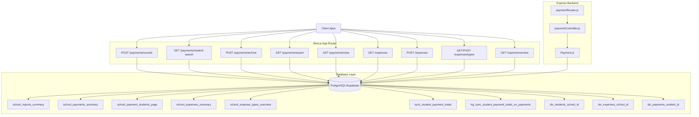
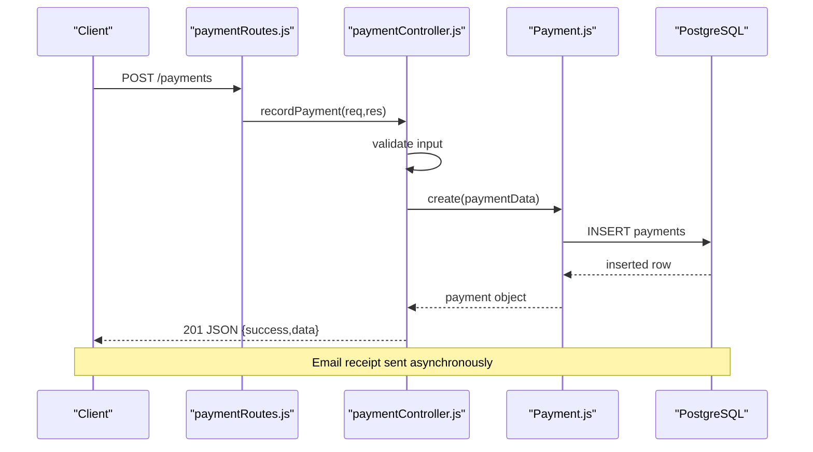
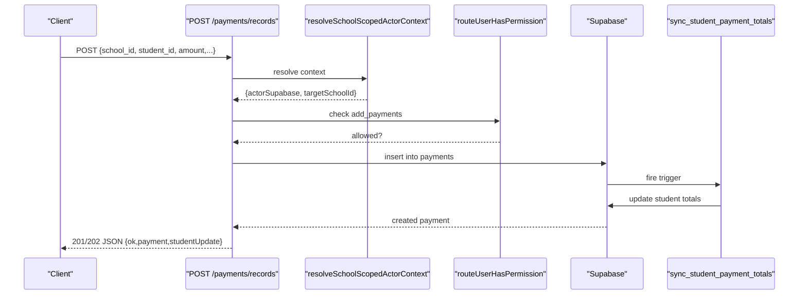
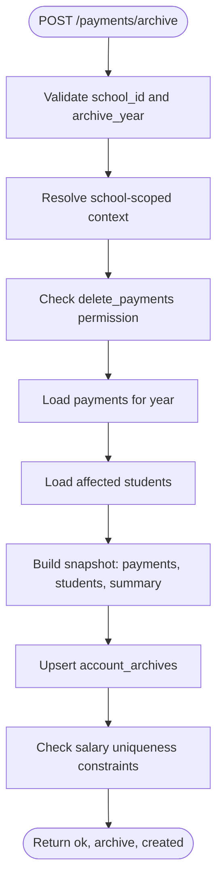
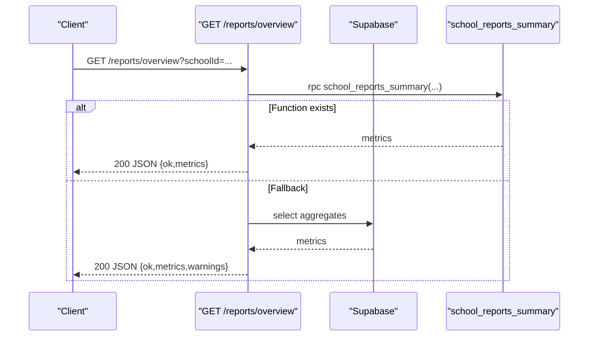
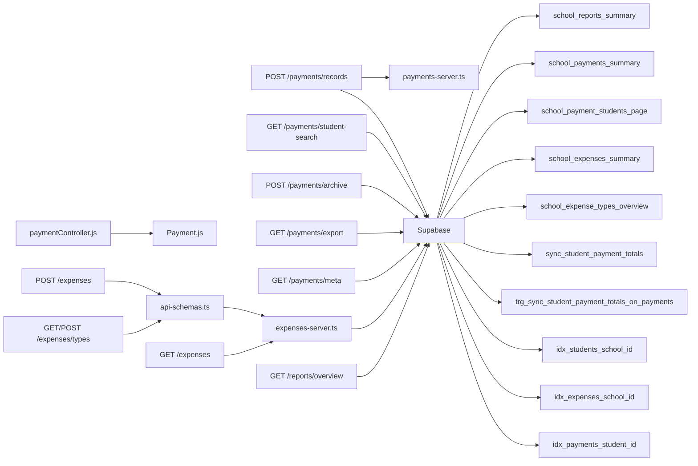

# Financial Operations API

<cite>
**Referenced Files in This Document**
- [paymentRoutes.js](file://00990090/school-accounting-system/backend/src/routes/paymentRoutes.js)
- [paymentController.js](file://00990090/school-accounting-system/backend/src/controllers/paymentController.js)
- [Payment.js](file://00990090/school-accounting-system/backend/src/models/Payment.js)
- [route.ts](file://app/api/web/payments/records/route.ts)
- [route.ts](file://app/api/web/payments/student-search/route.ts)
- [route.ts](file://app/api/web/payments/archive/route.ts)
- [route.ts](file://app/api/web/payments/export/route.ts)
- [route.ts](file://app/api/web/payments/meta/route.ts)
- [expenses/route.ts](file://app/api/web/expenses/route.ts)
- [expenses/[expenseId]/route.ts](file://app/api/web/expenses/[expenseId]/route.ts)
- [expenses/types/route.ts](file://app/api/web/expenses/types/route.ts)
- [expenses/types/[typeId]/route.ts](file://app/api/web/expenses/types/[typeId]/route.ts)
- [expenses-server.ts](file://lib/expenses-server.ts)
- [api-schemas.ts](file://lib/api-schemas.ts)
- [route.ts](file://app/api/web/reports/dataset/route.ts)
- [route.ts](file://app/api/web/reports/overview/route.ts)
- [20260326_010000_payments_page_functions.sql](file://migrations/20260326_010000_payments_page_functions.sql)
- [20260326_020000_account_archives_table.sql](file://migrations/20260326_020000_account_archives_table.sql)
- [20260326_000000_reports_summary_function.sql](file://migrations/20260326_000000_reports_summary_function.sql)
- [20260403_000000_payment_consistency_and_salary_uniqueness.sql](file://migrations/20260403_000000_payment_consistency_and_salary_uniqueness.sql)
- [20260403_010000_expenses_performance_and_overview.sql](file://migrations/20260403_010000_expenses_performance_and_overview.sql)
- [20260330_000000_add_missing_indexes.sql](file://migrations/20260330_000000_add_missing_indexes.sql)
- [database_setup.sql](file://database_setup.sql)
</cite>

## Update Summary
**Changes Made**
- Added comprehensive expenses API layer with CRUD operations for expense management
- Enhanced payment processing with new database functions for payment consistency
- Added expense types management with validation and usage tracking
- Implemented advanced payment archiving with unique constraint enforcement
- Enhanced salary processing with uniqueness constraints
- Added comprehensive expense reporting with RPC functions
- Updated payment consistency triggers and student fee synchronization

## Table of Contents
1. [Introduction](#introduction)
2. [Project Structure](#project-structure)
3. [Core Components](#core-components)
4. [Architecture Overview](#architecture-overview)
5. [Detailed Component Analysis](#detailed-component-analysis)
6. [Dependency Analysis](#dependency-analysis)
7. [Performance Considerations](#performance-considerations)
8. [Troubleshooting Guide](#troubleshooting-guide)
9. [Conclusion](#conclusion)
10. [Appendices](#appendices)

## Introduction
This document provides comprehensive API documentation for financial operations, covering payment processing, student payment searches, payment archiving, financial reporting, export functionality, payment metadata, and the new comprehensive expenses management system. It documents request/response schemas, status tracking, batch operations, financial data aggregation, error handling, and security considerations including PCI compliance and financial data protection.

## Project Structure
The financial operations are implemented across three primary layers:
- Backend Express routes/controllers/models for classic accounting endpoints
- Next.js App Router handlers for modern web admin endpoints
- Comprehensive expenses API layer with type management and reporting

**Diagram sources**
- [paymentRoutes.js:1-32](file://00990090/school-accounting-system/backend/src/routes/paymentRoutes.js#L1-L32)
- [paymentController.js:1-305](file://00990090/school-accounting-system/backend/src/controllers/paymentController.js#L1-L305)
- [Payment.js:1-176](file://00990090/school-accounting-system/backend/src/models/Payment.js#L1-L176)
- [route.ts:1-129](file://app/api/web/payments/records/route.ts#L1-L129)
- [route.ts:1-58](file://app/api/web/payments/student-search/route.ts#L1-L58)
- [route.ts:1-130](file://app/api/web/payments/archive/route.ts#L1-L130)
- [route.ts:1-58](file://app/api/web/payments/export/route.ts#L1-L58)
- [route.ts:1-54](file://app/api/web/payments/meta/route.ts#L1-L54)
- [expenses/route.ts:1-174](file://app/api/web/expenses/route.ts#L1-L174)
- [expenses/[expenseId]/route.ts:1-181](file://app/api/web/expenses/[expenseId]/route.ts#L1-L181)
- [expenses/types/route.ts:1-177](file://app/api/web/expenses/types/route.ts#L1-L177)
- [expenses/types/[typeId]/route.ts:1-217](file://app/api/web/expenses/types/[typeId]/route.ts#L1-L217)

**Section sources**
- [paymentRoutes.js:1-32](file://00990090/school-accounting-system/backend/src/routes/paymentRoutes.js#L1-L32)
- [paymentController.js:1-305](file://00990090/school-accounting-system/backend/src/controllers/paymentController.js#L1-L305)
- [Payment.js:1-176](file://00990090/school-accounting-system/backend/src/models/Payment.js#L1-L176)
- [route.ts:1-129](file://app/api/web/payments/records/route.ts#L1-L129)
- [route.ts:1-58](file://app/api/web/payments/student-search/route.ts#L1-L58)
- [route.ts:1-130](file://app/api/web/payments/archive/route.ts#L1-L130)
- [route.ts:1-58](file://app/api/web/payments/export/route.ts#L1-L58)
- [route.ts:1-54](file://app/api/web/payments/meta/route.ts#L1-L54)
- [expenses/route.ts:1-174](file://app/api/web/expenses/route.ts#L1-L174)
- [expenses/[expenseId]/route.ts:1-181](file://app/api/web/expenses/[expenseId]/route.ts#L1-L181)
- [expenses/types/route.ts:1-177](file://app/api/web/expenses/types/route.ts#L1-L177)
- [expenses/types/[typeId]/route.ts:1-217](file://app/api/web/expenses/types/[typeId]/route.ts#L1-L217)

## Core Components
- Classic backend payment endpoints: listing, filtering, recording, updating, deleting, and invoice generation
- Modern web admin payment endpoints: payment creation, student search, archiving, export, and metadata
- Comprehensive expenses management: CRUD operations, type management, and reporting
- Enhanced payment processing with consistency triggers and student fee synchronization
- Advanced salary processing with uniqueness constraints
- Reporting endpoints: dataset exports and financial overview metrics
- Supporting utilities: student fee recomputation and database functions

**Section sources**
- [paymentController.js:11-305](file://00990090/school-accounting-system/backend/src/controllers/paymentController.js#L11-L305)
- [Payment.js:14-176](file://00990090/school-accounting-system/backend/src/models/Payment.js#L14-L176)
- [route.ts:23-129](file://app/api/web/payments/records/route.ts#L23-L129)
- [route.ts:11-58](file://app/api/web/payments/student-search/route.ts#L11-L58)
- [route.ts:11-130](file://app/api/web/payments/archive/route.ts#L11-L130)
- [route.ts:11-58](file://app/api/web/payments/export/route.ts#L11-L58)
- [route.ts:11-54](file://app/api/web/payments/meta/route.ts#L11-L54)
- [expenses/route.ts:18-89](file://app/api/web/expenses/route.ts#L18-L89)
- [expenses/[expenseId]/route.ts:9-106](file://app/api/web/expenses/[expenseId]/route.ts#L9-L106)
- [expenses/types/route.ts:44-102](file://app/api/web/expenses/types/route.ts#L44-L102)
- [expenses/types/[typeId]/route.ts:38-216](file://app/api/web/expenses/types/[typeId]/route.ts#L38-L216)
- [expenses-server.ts:1-407](file://lib/expenses-server.ts#L1-L407)
- [api-schemas.ts:107-197](file://lib/api-schemas.ts#L107-L197)
- [route.ts:40-184](file://app/api/web/reports/dataset/route.ts#L40-L184)
- [route.ts:173-248](file://app/api/web/reports/overview/route.ts#L173-L248)
- [20260403_000000_payment_consistency_and_salary_uniqueness.sql:1-98](file://migrations/20260403_000000_payment_consistency_and_salary_uniqueness.sql#L1-L98)

## Architecture Overview
The system integrates classic backend and modern web admin endpoints with a shared Supabase/PostgreSQL backend. A new comprehensive expenses layer provides full CRUD operations with type management and advanced reporting. Authentication and authorization are enforced via role-based access control (RBAC) and row-level security (RLS). Payment data is stored in dedicated tables with supporting functions for summaries, paginated student payment views, and enhanced consistency triggers.

**Diagram sources**
- [route.ts:1-129](file://app/api/web/payments/records/route.ts#L1-L129)
- [route.ts:1-58](file://app/api/web/payments/student-search/route.ts#L1-L58)
- [route.ts:1-130](file://app/api/web/payments/archive/route.ts#L1-L130)
- [route.ts:1-58](file://app/api/web/payments/export/route.ts#L1-L58)
- [route.ts:1-54](file://app/api/web/payments/meta/route.ts#L1-L54)
- [expenses/route.ts:1-174](file://app/api/web/expenses/route.ts#L1-L174)
- [expenses/[expenseId]/route.ts:1-181](file://app/api/web/expenses/[expenseId]/route.ts#L1-L181)
- [expenses/types/route.ts:1-177](file://app/api/web/expenses/types/route.ts#L1-L177)
- [expenses/types/[typeId]/route.ts:1-217](file://app/api/web/expenses/types/[typeId]/route.ts#L1-L217)
- [route.ts:1-184](file://app/api/web/reports/dataset/route.ts#L1-L184)
- [route.ts:1-248](file://app/api/web/reports/overview/route.ts#L1-L248)
- [paymentRoutes.js:1-32](file://00990090/school-accounting-system/backend/src/routes/paymentRoutes.js#L1-L32)
- [paymentController.js:1-305](file://00990090/school-accounting-system/backend/src/controllers/paymentController.js#L1-L305)
- [Payment.js:1-176](file://00990090/school-accounting-system/backend/src/models/Payment.js#L1-L176)
- [20260326_000000_reports_summary_function.sql:1-83](file://migrations/20260326_000000_reports_summary_function.sql#L1-L83)
- [20260326_010000_payments_page_functions.sql:1-190](file://migrations/20260326_010000_payments_page_functions.sql#L1-L190)
- [20260326_020000_account_archives_table.sql:1-64](file://migrations/20260326_020000_account_archives_table.sql#L1-L64)
- [20260403_000000_payment_consistency_and_salary_uniqueness.sql:1-98](file://migrations/20260403_000000_payment_consistency_and_salary_uniqueness.sql#L1-L98)
- [20260403_010000_expenses_performance_and_overview.sql:1-101](file://migrations/20260403_010000_expenses_performance_and_overview.sql#L1-L101)
- [20260330_000000_add_missing_indexes.sql:1-11](file://migrations/20260330_000000_add_missing_indexes.sql#L1-L11)

## Detailed Component Analysis

### Payment Records (Classic Backend)
Endpoints for listing, filtering, retrieving, recording, updating, deleting payments, and generating invoices.

- GET /payments
  - Query parameters: page, limit, student_id, from_date, to_date
  - Response: success flag, data array, pagination metadata
- GET /payments/:id
  - Path parameter: id
  - Response: success flag, single payment object
- POST /payments (roles: admin, accountant)
  - Request body: student_id, student_fee_id, amount, payment_method, reference_number, notes
  - Response: success flag, message, created payment object
- PUT /payments/:id (roles: admin, accountant)
  - Path parameter: id
  - Request body: amount, payment_method, reference_number, notes
  - Response: success flag, message, updated payment object
- DELETE /payments/:id (roles: admin)
  - Path parameter: id
  - Response: success flag, message
- GET /payments/:student_id/invoice/:fee_id
  - Path parameters: student_id, fee_id
  - Response: success flag, message, invoice metadata (invoice_number, pdf_path)

**Diagram sources**
- [paymentRoutes.js:19-21](file://00990090/school-accounting-system/backend/src/routes/paymentRoutes.js#L19-L21)
- [paymentController.js:79-130](file://00990090/school-accounting-system/backend/src/controllers/paymentController.js#L79-L130)
- [Payment.js:94-114](file://00990090/school-accounting-system/backend/src/models/Payment.js#L94-L114)

**Section sources**
- [paymentRoutes.js:10-29](file://00990090/school-accounting-system/backend/src/routes/paymentRoutes.js#L10-L29)
- [paymentController.js:15-184](file://00990090/school-accounting-system/backend/src/controllers/paymentController.js#L15-L184)
- [Payment.js:14-139](file://00990090/school-accounting-system/backend/src/models/Payment.js#L14-L139)

### Payment Records (Web Admin)
Modern endpoint for creating payments with school-scoped authorization, permission checks, and student fee recomputation.

- POST /api/web/payments/records
  - Request body: school_id, student_id, amount, payment_method, notes, receipt_date, receipt_number, manual_receipt_number, branch_id
  - Response: ok flag, payment object, studentUpdate payload with recalculated paid_fee and remaining_fee
  - On sync failure: 202 Accepted with warning message

**Enhanced** with new payment consistency triggers that automatically synchronize student payment totals and enforce data integrity.

**Diagram sources**
- [route.ts:23-129](file://app/api/web/payments/records/route.ts#L23-L129)
- [20260403_000000_payment_consistency_and_salary_uniqueness.sql:33-59](file://migrations/20260403_000000_payment_consistency_and_salary_uniqueness.sql#L33-L59)

**Section sources**
- [route.ts:23-129](file://app/api/web/payments/records/route.ts#L23-L129)
- [20260403_000000_payment_consistency_and_salary_uniqueness.sql:1-98](file://migrations/20260403_000000_payment_consistency_and_salary_uniqueness.sql#L1-L98)

### Student Payment Searches
- GET /api/web/payments/student-search
  - Query parameters: schoolId, q (search), limit
  - Response: ok flag, students array
  - Rate-limited per user

**Section sources**
- [route.ts:11-58](file://app/api/web/payments/student-search/route.ts#L11-L58)

### Payment Archiving
- POST /api/web/payments/archive
  - Request body: school_id, archive_year
  - Response: ok flag, archive object, created indicator
  - Requires delete_payments permission
  - Creates/updates yearly snapshot in account_archives table
  - **Enhanced** with unique constraint enforcement for salary records

**Updated** with improved unique constraint enforcement for salary records to prevent duplicates.

**Diagram sources**
- [route.ts:11-130](file://app/api/web/payments/archive/route.ts#L11-L130)
- [20260403_000000_payment_consistency_and_salary_uniqueness.sql:77-96](file://migrations/20260403_000000_payment_consistency_and_salary_uniqueness.sql#L77-L96)

**Section sources**
- [route.ts:11-130](file://app/api/web/payments/archive/route.ts#L11-L130)
- [20260403_000000_payment_consistency_and_salary_uniqueness.sql:1-98](file://migrations/20260403_000000_payment_consistency_and_salary_uniqueness.sql#L1-L98)

### Export and Metadata
- GET /api/web/payments/export
  - Query parameters: schoolId (forwarded to filters)
  - Response: ok flag, students array (exportable dataset)
  - Rate-limited per user
- GET /api/web/payments/meta
  - Query parameters: schoolId
  - Response: ok flag, metadata payload
  - Rate-limited per user

**Section sources**
- [route.ts:11-58](file://app/api/web/payments/export/route.ts#L11-L58)
- [route.ts:11-54](file://app/api/web/payments/meta/route.ts#L11-L54)

### Financial Reporting
- GET /api/web/reports/dataset
  - Query parameters: schoolId, type (students|payments|expenses|salaries|all), status, search, className, sectionName
  - Response: ok flag, dataset subset(s)
- GET /api/web/reports/overview
  - Query parameters: schoolId
  - Response: ok flag, metrics object (counts, volumes, balances)
  - Falls back to per-query aggregates if function unavailable

**Enhanced** with new expenses reporting functions for comprehensive financial insights.

**Diagram sources**
- [route.ts:173-248](file://app/api/web/reports/overview/route.ts#L173-L248)
- [20260326_000000_reports_summary_function.sql:1-83](file://migrations/20260326_000000_reports_summary_function.sql#L1-L83)

**Section sources**
- [route.ts:40-184](file://app/api/web/reports/dataset/route.ts#L40-L184)
- [route.ts:173-248](file://app/api/web/reports/overview/route.ts#L173-L248)
- [20260326_000000_reports_summary_function.sql:1-83](file://migrations/20260326_000000_reports_summary_function.sql#L1-L83)

### Expenses Management System

#### Expense CRUD Operations
- GET /api/web/expenses
  - Query parameters: schoolId, page, pageSize, search, expenseTypeId, fromDate, toDate
  - Response: ok flag, paginated expenses with summary metrics
  - **Enhanced** with advanced filtering and caching support
- POST /api/web/expenses
  - Request body: school_id, expense_type_id, amount, expense_date, recipient, receipt_number, notes
  - Response: ok flag, created expense object
  - **Enhanced** with type validation and branch resolution

#### Expense Type Management
- GET /api/web/expenses/types
  - Query parameters: schoolId, search
  - Response: ok flag, expense types with usage statistics
  - **Enhanced** with RPC-based overview function
- POST /api/web/expenses/types
  - Request body: school_id, name, notes
  - Response: ok flag, created expense type with usage counters
  - **Enhanced** with duplicate detection and validation

#### Expense Type CRUD Operations
- PATCH /api/web/expenses/types/[typeId]
  - Request body: school_id, name, notes
  - Response: ok flag, updated expense type
  - **Enhanced** with usage validation before deletion
- DELETE /api/web/expenses/types/[typeId]
  - Request body: school_id
  - Response: ok flag, deleted type identifier
  - **Enhanced** with usage verification to prevent orphaned records

**Section sources**
- [expenses/route.ts:18-89](file://app/api/web/expenses/route.ts#L18-L89)
- [expenses/[expenseId]/route.ts:9-106](file://app/api/web/expenses/[expenseId]/route.ts#L9-L106)
- [expenses/types/route.ts:44-102](file://app/api/web/expenses/types/route.ts#L44-L102)
- [expenses/types/[typeId]/route.ts:38-216](file://app/api/web/expenses/types/[typeId]/route.ts#L38-L216)
- [expenses-server.ts:132-273](file://lib/expenses-server.ts#L132-L273)
- [expenses-server.ts:275-399](file://lib/expenses-server.ts#L275-L399)
- [api-schemas.ts:154-197](file://lib/api-schemas.ts#L154-L197)

### Enhanced Payment Processing

#### Payment Consistency Triggers
- **New** `sync_student_payment_totals_from_payments()` trigger function
- **New** `recompute_student_payment_totals(target_student_id)` function
- Automatic student fee synchronization on payment changes
- Improved data integrity and consistency

#### Salary Processing Enhancements
- **New** Unique constraint on `salaries(school_id, teacher_id, month)`
- Duplicate salary prevention with proper error handling
- Enhanced concurrent operation safety

**Section sources**
- [20260403_000000_payment_consistency_and_salary_uniqueness.sql:1-98](file://migrations/20260403_000000_payment_consistency_and_salary_uniqueness.sql#L1-L98)

### Expense Reporting Functions

#### Summary Functions
- **New** `school_expenses_summary()` RPC function
- **New** `school_expense_types_overview()` RPC function
- Comprehensive expense analytics and reporting
- Fallback to SQL queries when RPC functions unavailable

#### Performance Optimizations
- **New** Database functions for efficient reporting
- **New** Proper indexing on foreign key columns
- Enhanced query performance for large datasets

**Section sources**
- [expenses-server.ts:132-205](file://lib/expenses-server.ts#L132-L205)
- [expenses-server.ts:275-358](file://lib/expenses-server.ts#L275-L358)
- [20260403_010000_expenses_performance_and_overview.sql:1-101](file://migrations/20260403_010000_expenses_performance_and_overview.sql#L1-L101)
- [20260330_000000_add_missing_indexes.sql:1-11](file://migrations/20260330_000000_add_missing_indexes.sql#L1-L11)

## Dependency Analysis
- Classic backend depends on:
  - Payment model for database operations
  - Helpers for pagination and invoice number generation
  - PDF/email utilities for receipts
- Web admin endpoints depend on:
  - Managed user context resolution
  - Permission checks
  - Supabase client for inserts and selects
  - Student fee recomputation utility
  - **New** Expenses server for expense operations
  - **New** API schemas for request validation
- Database functions and policies:
  - school_reports_summary for overview metrics
  - school_payments_summary and school_payment_students_page for paginated views
  - **New** school_expenses_summary and school_expense_types_overview for expense reporting
  - **New** sync_student_payment_totals functions for payment consistency
  - **New** unique constraints for salary processing
  - account_archives table for yearly snapshots
  - **New** indexes for performance optimization

**Diagram sources**
- [paymentController.js:1-305](file://00990090/school-accounting-system/backend/src/controllers/paymentController.js#L1-L305)
- [Payment.js:1-176](file://00990090/school-accounting-system/backend/src/models/Payment.js#L1-L176)
- [route.ts:1-129](file://app/api/web/payments/records/route.ts#L1-L129)
- [expenses-server.ts:1-407](file://lib/expenses-server.ts#L1-L407)
- [api-schemas.ts:1-197](file://lib/api-schemas.ts#L1-L197)
- [expenses/route.ts:1-174](file://app/api/web/expenses/route.ts#L1-L174)
- [expenses/[expenseId]/route.ts:1-181](file://app/api/web/expenses/[expenseId]/route.ts#L1-L181)
- [expenses/types/route.ts:1-177](file://app/api/web/expenses/types/route.ts#L1-L177)
- [expenses/types/[typeId]/route.ts:1-217](file://app/api/web/expenses/types/[typeId]/route.ts#L1-L217)
- [route.ts:1-184](file://app/api/web/reports/dataset/route.ts#L1-L184)
- [route.ts:1-248](file://app/api/web/reports/overview/route.ts#L1-L248)
- [20260326_000000_reports_summary_function.sql:1-83](file://migrations/20260326_000000_reports_summary_function.sql#L1-L83)
- [20260326_010000_payments_page_functions.sql:1-190](file://migrations/20260326_010000_payments_page_functions.sql#L1-L190)
- [20260326_020000_account_archives_table.sql:1-64](file://migrations/20260326_020000_account_archives_table.sql#L1-L64)
- [20260403_000000_payment_consistency_and_salary_uniqueness.sql:1-98](file://migrations/20260403_000000_payment_consistency_and_salary_uniqueness.sql#L1-L98)
- [20260403_010000_expenses_performance_and_overview.sql:1-101](file://migrations/20260403_010000_expenses_performance_and_overview.sql#L1-L101)
- [20260330_000000_add_missing_indexes.sql:1-11](file://migrations/20260330_000000_add_missing_indexes.sql#L1-L11)

**Section sources**
- [paymentController.js:1-305](file://00990090/school-accounting-system/backend/src/controllers/paymentController.js#L1-L305)
- [Payment.js:1-176](file://00990090/school-accounting-system/backend/src/models/Payment.js#L1-L176)
- [route.ts:1-129](file://app/api/web/payments/records/route.ts#L1-L129)
- [expenses-server.ts:1-407](file://lib/expenses-server.ts#L1-L407)
- [api-schemas.ts:1-197](file://lib/api-schemas.ts#L1-L197)
- [expenses/route.ts:1-174](file://app/api/web/expenses/route.ts#L1-L174)
- [expenses/[expenseId]/route.ts:1-181](file://app/api/web/expenses/[expenseId]/route.ts#L1-L181)
- [expenses/types/route.ts:1-177](file://app/api/web/expenses/types/route.ts#L1-L177)
- [expenses/types/[typeId]/route.ts:1-217](file://app/api/web/expenses/types/[typeId]/route.ts#L1-L217)
- [route.ts:1-184](file://app/api/web/reports/dataset/route.ts#L1-L184)
- [route.ts:1-248](file://app/api/web/reports/overview/route.ts#L1-L248)
- [20260326_000000_reports_summary_function.sql:1-83](file://migrations/20260326_000000_reports_summary_function.sql#L1-L83)
- [20260326_010000_payments_page_functions.sql:1-190](file://migrations/20260326_010000_payments_page_functions.sql#L1-L190)
- [20260326_020000_account_archives_table.sql:1-64](file://migrations/20260326_020000_account_archives_table.sql#L1-L64)
- [20260403_000000_payment_consistency_and_salary_uniqueness.sql:1-98](file://migrations/20260403_000000_payment_consistency_and_salary_uniqueness.sql#L1-L98)
- [20260403_010000_expenses_performance_and_overview.sql:1-101](file://migrations/20260403_010000_expenses_performance_and_overview.sql#L1-L101)
- [20260330_000000_add_missing_indexes.sql:1-11](file://migrations/20260330_000000_add_missing_indexes.sql#L1-L11)

## Performance Considerations
- Use pagination and filters on payment listing to avoid large result sets
- Prefer database functions (e.g., school_reports_summary, school_expenses_summary) for aggregated metrics when available; expect fallback behavior otherwise
- **New** Expenses system uses RPC functions for optimal performance with automatic fallback
- **New** Unique constraints prevent duplicate entries and improve data integrity
- **New** Proper indexing on foreign key columns (students, expenses, payments) significantly improves query performance
- Rate limits applied to search/export/meta endpoints prevent abuse
- **New** Cache invalidation ensures data consistency across related operations

## Troubleshooting Guide
Common errors and resolutions:
- Validation failures (400): Ensure required fields are present and formatted correctly
- Authorization failures (403): Verify user role and permissions for payment operations
- Resource not found (404): Confirm entity identifiers (payment, student, fee, expense) exist
- **New** Expense type conflicts (409): Check for duplicate expense types before creation
- **New** Salary duplicates (409): Verify monthly salary uniqueness before processing
- **New** Expense usage conflicts (409): Cannot delete expense types with existing expense records
- Internal errors (500): Inspect server logs; database constraints or missing functions may cause failures
- **New** Missing RPC functions: Apply expenses performance migration to create required functions
- Archive table missing: Apply database setup script to create account_archives table
- **New** Payment consistency issues: Check trigger functions and student fee synchronization

**Section sources**
- [route.ts:40-68](file://app/api/web/payments/records/route.ts#L40-L68)
- [route.ts:16-40](file://app/api/web/payments/archive/route.ts#L16-L40)
- [route.ts:222-229](file://app/api/web/reports/overview/route.ts#L222-L229)
- [expenses/[expenseId]/route.ts:160-L162](file://app/api/web/expenses/[expenseId]/route.ts#L160-L162)
- [expenses/types/[typeId]/route.ts:187-L189](file://app/api/web/expenses/types/[typeId]/route.ts#L187-L189)
- [expenses/route.ts:133-135](file://app/api/web/expenses/route.ts#L133-L135)
- [20260403_000000_payment_consistency_and_salary_uniqueness.sql:77-96](file://migrations/20260403_000000_payment_consistency_and_salary_uniqueness.sql#L77-L96)
- [20260403_010000_expenses_performance_and_overview.sql:1-101](file://migrations/20260403_010000_expenses_performance_and_overview.sql#L1-L101)
- [database_setup.sql:158-172](file://database_setup.sql#L158-L172)

## Conclusion
The financial operations API provides robust endpoints for payment processing, student search, archiving, export, and reporting, along with a comprehensive new expenses management system. The enhanced architecture leverages Supabase/PostgreSQL with RLS and RBAC for tenant isolation and secure access. New payment consistency triggers, unique constraints, and advanced reporting functions ensure data integrity and optimal performance. Use the provided schemas and examples to integrate payment workflows, implement batch operations safely, manage expenses effectively, and maintain accurate financial audits.

## Appendices

### Request/Response Schemas

#### Payment Operations
- POST /api/web/payments/records
  - Request body:
    - school_id: string
    - student_id: string
    - amount: number (must be > 0)
    - payment_method: string (default cash)
    - notes: string (optional)
    - receipt_date: string (ISO date/time optional)
    - receipt_number: string (optional)
    - manual_receipt_number: string (optional)
    - branch_id: string (optional)
  - Response:
    - ok: boolean
    - payment: object (payment record)
    - studentUpdate: object (paid_fee, remaining_fee)

- GET /api/web/payments/student-search
  - Query parameters:
    - schoolId: string
    - q: string (search term)
    - limit: number (default 8)
  - Response:
    - ok: boolean
    - students: array

- POST /api/web/payments/archive
  - Request body:
    - school_id: string
    - archive_year: number
  - Response:
    - ok: boolean
    - archive: object (snapshot)
    - created: boolean

- GET /api/web/payments/export
  - Query parameters:
    - schoolId: string
  - Response:
    - ok: boolean
    - students: array

- GET /api/web/payments/meta
  - Query parameters:
    - schoolId: string
  - Response:
    - ok: boolean
    - metadata: object

#### Expense Operations
- GET /api/web/expenses
  - Query parameters:
    - schoolId: string
    - page: number (default 1)
    - pageSize: number (default 20)
    - search: string (optional)
    - expenseTypeId: string (optional)
    - fromDate: string (YYYY-MM-DD, optional)
    - toDate: string (YYYY-MM-DD, optional)
  - Response:
    - ok: boolean
    - rows: array (expenses)
    - summary: object (counts, amounts)
    - page: number
    - pageSize: number
    - totalCount: number
    - totalPages: number

- POST /api/web/expenses
  - Request body:
    - school_id: string
    - expense_type_id: string
    - amount: number (must be > 0)
    - expense_date: string (YYYY-MM-DD)
    - recipient: string (optional)
    - receipt_number: string (optional)
    - notes: string (optional)
  - Response:
    - ok: boolean
    - expense: object

- PATCH /api/web/expenses/[expenseId]
  - Request body:
    - school_id: string
    - expense_type_id: string
    - amount: number (must be > 0)
    - expense_date: string (YYYY-MM-DD)
    - recipient: string (optional)
    - receipt_number: string (optional)
    - notes: string (optional)
  - Response:
    - ok: boolean
    - expense: object

- DELETE /api/web/expenses/[expenseId]
  - Request body:
    - school_id: string
  - Response:
    - ok: boolean
    - deletedExpenseId: string

- GET /api/web/expenses/types
  - Query parameters:
    - schoolId: string
    - search: string (optional)
  - Response:
    - ok: boolean
    - rows: array (expense types with usage stats)

- POST /api/web/expenses/types
  - Request body:
    - school_id: string
    - name: string (1-120 chars)
    - notes: string (optional)
  - Response:
    - ok: boolean
    - expenseType: object (with usage_count: 0, usage_total: 0)

- PATCH /api/web/expenses/types/[typeId]
  - Request body:
    - school_id: string
    - name: string (1-120 chars)
    - notes: string (optional)
  - Response:
    - ok: boolean
    - expenseType: object

- DELETE /api/web/expenses/types/[typeId]
  - Request body:
    - school_id: string
  - Response:
    - ok: boolean
    - deletedTypeId: string

#### Reporting Operations
- GET /api/web/reports/dataset
  - Query parameters:
    - schoolId: string
    - type: enum("students"|"payments"|"expenses"|"salaries"|"all")
    - status: enum("active"|"transferred"|"suspended"|"deleted")
    - search: string
    - className: string
    - sectionName: string
  - Response:
    - ok: boolean
    - dataset: object (selected arrays)

- GET /api/web/reports/overview
  - Query parameters:
    - schoolId: string
  - Response:
    - ok: boolean
    - metrics: object (counts, volumes, balances)
    - warnings: array (optional)

**Section sources**
- [route.ts:11-129](file://app/api/web/payments/records/route.ts#L11-L129)
- [route.ts:11-58](file://app/api/web/payments/student-search/route.ts#L11-L58)
- [route.ts:11-130](file://app/api/web/payments/archive/route.ts#L11-L130)
- [route.ts:11-58](file://app/api/web/payments/export/route.ts#L11-L58)
- [route.ts:11-54](file://app/api/web/payments/meta/route.ts#L11-L54)
- [expenses/route.ts:18-89](file://app/api/web/expenses/route.ts#L18-L89)
- [expenses/[expenseId]/route.ts:9-106](file://app/api/web/expenses/[expenseId]/route.ts#L9-L106)
- [expenses/types/route.ts:44-102](file://app/api/web/expenses/types/route.ts#L44-L102)
- [expenses/types/[typeId]/route.ts:38-216](file://app/api/web/expenses/types/[typeId]/route.ts#L38-L216)
- [route.ts:40-184](file://app/api/web/reports/dataset/route.ts#L40-L184)
- [route.ts:173-248](file://app/api/web/reports/overview/route.ts#L173-L248)
- [api-schemas.ts:107-197](file://lib/api-schemas.ts#L107-L197)

### Security and Compliance Notes
- Authentication and authorization:
  - Role-based access control (RBAC) enforced via route permissions
  - Row-level security (RLS) policies restrict data visibility by school
  - **New** Enhanced permission checks for expense operations
- Data protection:
  - Sensitive financial data is scoped to the authenticated user's school
  - Use HTTPS/TLS in production
  - **New** Unique constraints prevent data duplication
- PCI considerations:
  - Do not store, process, or transmit primary account numbers (PAN) or CVV
  - Use external payment processors; log minimal transaction metadata only
  - Restrict access to financial endpoints to authorized roles
  - **New** Payment consistency triggers ensure data integrity
- **New** Expense security:
  - Type validation prevents malicious input
  - Usage tracking prevents orphaned expense records
  - Cache invalidation maintains data consistency