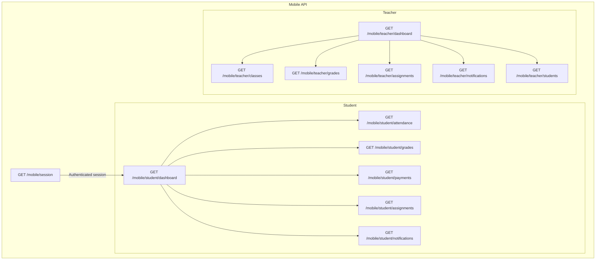
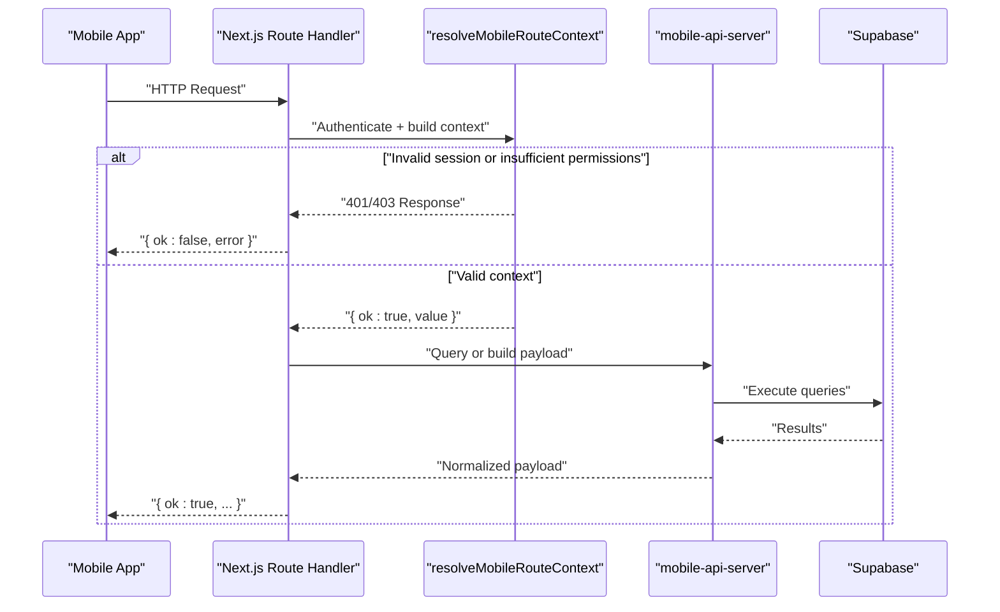
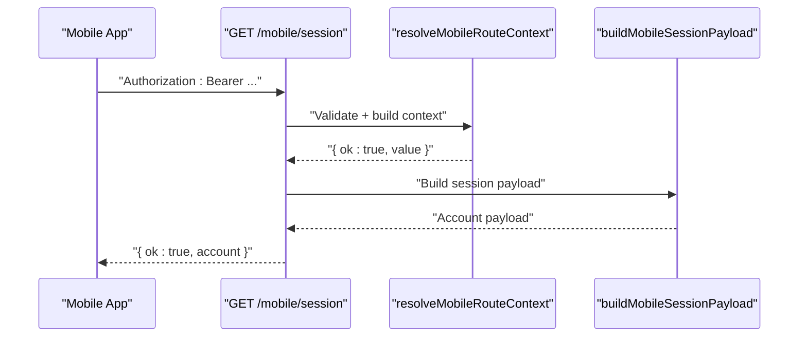
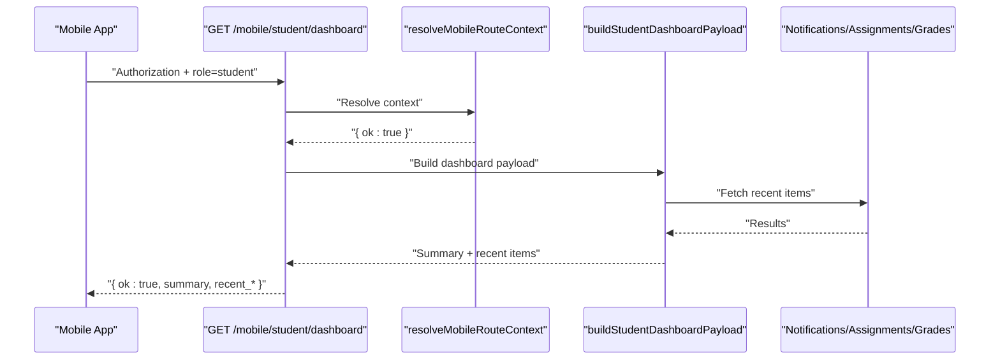
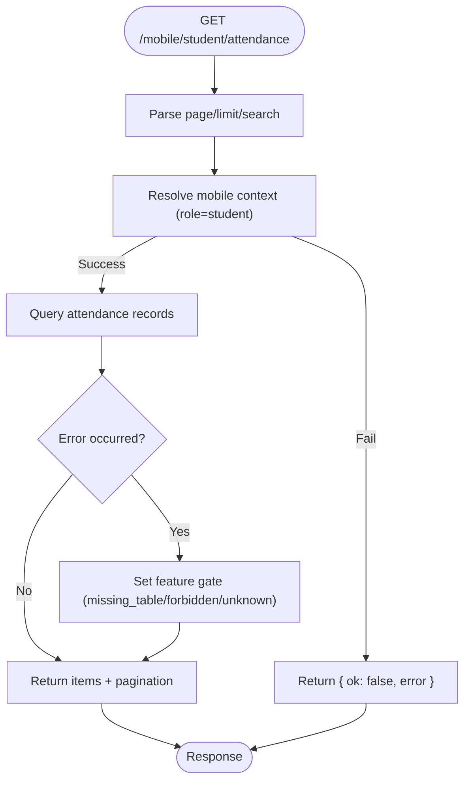
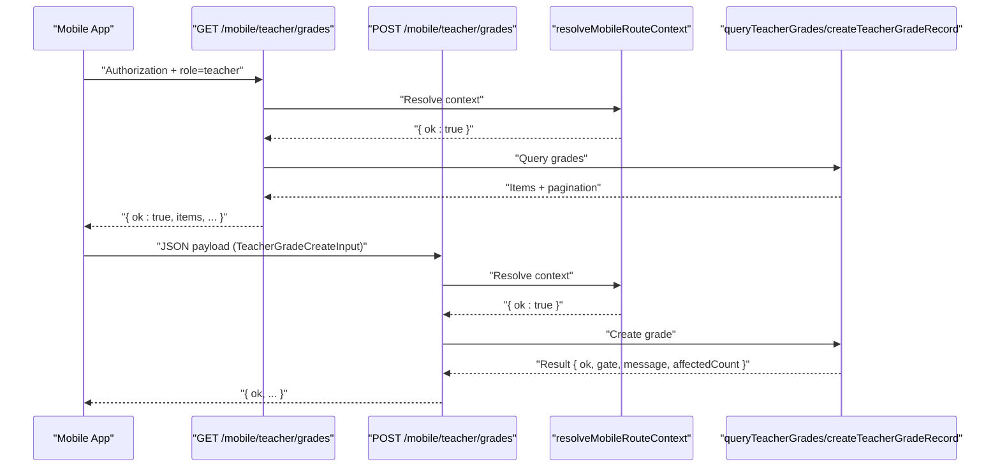
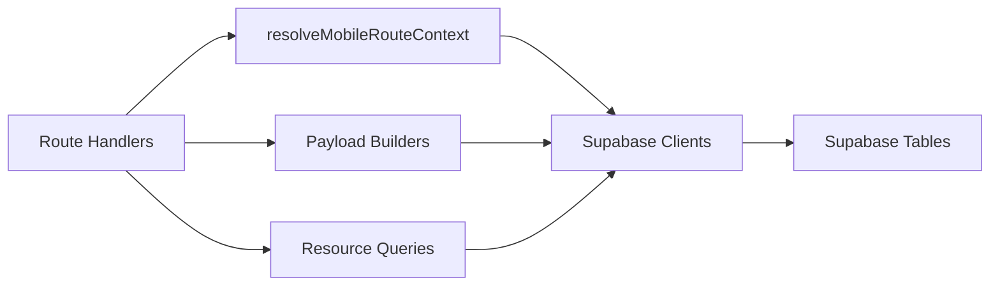

# Mobile API

<cite>
**Referenced Files in This Document**
- [session/route.ts](file://app/api/mobile/session/route.ts)
- [student/dashboard/route.ts](file://app/api/mobile/student/dashboard/route.ts)
- [student/attendance/route.ts](file://app/api/mobile/student/attendance/route.ts)
- [student/grades/route.ts](file://app/api/mobile/student/grades/route.ts)
- [student/payments/route.ts](file://app/api/mobile/student/payments/route.ts)
- [student/assignments/route.ts](file://app/api/mobile/student/assignments/route.ts)
- [student/notifications/route.ts](file://app/api/mobile/student/notifications/route.ts)
- [teacher/dashboard/route.ts](file://app/api/mobile/teacher/dashboard/route.ts)
- [teacher/classes/route.ts](file://app/api/mobile/teacher/classes/route.ts)
- [teacher/grades/route.ts](file://app/api/mobile/teacher/grades/route.ts)
- [teacher/assignments/route.ts](file://app/api/mobile/teacher/assignments/route.ts)
- [teacher/notifications/route.ts](file://app/api/mobile/teacher/notifications/route.ts)
- [teacher/students/route.ts](file://app/api/mobile/teacher/students/route.ts)
- [mobile-api-server.ts](file://lib/mobile-api-server.ts)
</cite>

## Table of Contents
1. [Introduction](#introduction)
2. [Project Structure](#project-structure)
3. [Core Components](#core-components)
4. [Architecture Overview](#architecture-overview)
5. [Detailed Component Analysis](#detailed-component-analysis)
6. [Dependency Analysis](#dependency-analysis)
7. [Performance Considerations](#performance-considerations)
8. [Troubleshooting Guide](#troubleshooting-guide)
9. [Conclusion](#conclusion)
10. [Appendices](#appendices)

## Introduction
This document describes the mobile application API surface for session management, student mobile features (dashboard, attendance, grades, payments, assignments, notifications), and teacher mobile functionality (dashboard, classes, grades, assignments, notifications, students). It also documents mobile-specific request/response formats, authentication, offline-friendly pagination, data synchronization patterns, notification APIs, push notification handling, mobile-specific error responses, usage examples, caching strategies, and device compatibility considerations.

## Project Structure
The mobile API is organized under app/api/mobile with two primary resource groups:
- Session: single endpoint to fetch the authenticated mobile session
- Student: dashboard, attendance, grades, payments, assignments, notifications
- Teacher: dashboard, classes, grades, assignments, notifications, students

**Diagram sources**
- [session/route.ts:1-16](file://app/api/mobile/session/route.ts#L1-L16)
- [student/dashboard/route.ts:1-16](file://app/api/mobile/student/dashboard/route.ts#L1-L16)
- [student/attendance/route.ts:1-22](file://app/api/mobile/student/attendance/route.ts#L1-L22)
- [student/grades/route.ts:1-22](file://app/api/mobile/student/grades/route.ts#L1-L22)
- [student/payments/route.ts:1-22](file://app/api/mobile/student/payments/route.ts#L1-L22)
- [student/assignments/route.ts:1-22](file://app/api/mobile/student/assignments/route.ts#L1-L22)
- [student/notifications/route.ts:1-23](file://app/api/mobile/student/notifications/route.ts#L1-L23)
- [teacher/dashboard/route.ts:1-16](file://app/api/mobile/teacher/dashboard/route.ts#L1-L16)
- [teacher/classes/route.ts:1-16](file://app/api/mobile/teacher/classes/route.ts#L1-L16)
- [teacher/grades/route.ts:1-43](file://app/api/mobile/teacher/grades/route.ts#L1-L43)
- [teacher/assignments/route.ts:1-43](file://app/api/mobile/teacher/assignments/route.ts#L1-L43)
- [teacher/notifications/route.ts:1-22](file://app/api/mobile/teacher/notifications/route.ts#L1-L22)
- [teacher/students/route.ts:1-23](file://app/api/mobile/teacher/students/route.ts#L1-L23)

**Section sources**
- [session/route.ts:1-16](file://app/api/mobile/session/route.ts#L1-L16)
- [student/dashboard/route.ts:1-16](file://app/api/mobile/student/dashboard/route.ts#L1-L16)
- [teacher/dashboard/route.ts:1-16](file://app/api/mobile/teacher/dashboard/route.ts#L1-L16)

## Core Components
- Authentication and session resolution: All endpoints depend on resolving a validated mobile session via a shared resolver that authenticates the caller, verifies role and school scope, and builds a typed context.
- Pagination and filtering: A shared parser normalizes page/limit/search parameters with sane defaults and caps to optimize mobile bandwidth and rendering.
- Feature gates: Responses include a gate object indicating availability and optional error codes for missing tables, permission issues, or unknown errors.
- Payload builders: Dedicated builders assemble compact, mobile-optimized JSON payloads for dashboards and lists.

Key responsibilities:
- Session: returns identity, school, linkage, access, profile, and role-specific payloads
- Student: dashboard summary and lists (attendance, grades, payments, assignments, notifications)
- Teacher: dashboard summary and lists (classes, grades, assignments, notifications, students)

**Section sources**
- [mobile-api-server.ts:173-187](file://lib/mobile-api-server.ts#L173-L187)
- [mobile-api-server.ts:199-250](file://lib/mobile-api-server.ts#L199-L250)
- [mobile-api-server.ts:252-284](file://lib/mobile-api-server.ts#L252-L284)
- [mobile-api-server.ts:658-719](file://lib/mobile-api-server.ts#L658-L719)

## Architecture Overview
The mobile API follows a thin controller pattern:
- Each route handler resolves the mobile context
- On success, it delegates to a query or builder function from the shared server library
- Responses are compact JSON with an ok flag and feature gates

**Diagram sources**
- [session/route.ts:5-15](file://app/api/mobile/session/route.ts#L5-L15)
- [student/grades/route.ts:5-21](file://app/api/mobile/student/grades/route.ts#L5-L21)
- [mobile-api-server.ts:199-250](file://lib/mobile-api-server.ts#L199-L250)
- [mobile-api-server.ts:408-440](file://lib/mobile-api-server.ts#L408-L440)

## Detailed Component Analysis

### Session Management
- Endpoint: GET /mobile/session
- Purpose: Returns the authenticated mobile session with identity, school, linkage, access, profile, and role-specific data.
- Authentication: Uses the shared resolver to validate the Authorization header and build a typed context.
- Response shape: ok flag, account object containing identity, school, linkage, access, profile, app_account, and either student or teacher subsections.

**Diagram sources**
- [session/route.ts:5-15](file://app/api/mobile/session/route.ts#L5-L15)
- [mobile-api-server.ts:252-284](file://lib/mobile-api-server.ts#L252-L284)

**Section sources**
- [session/route.ts:1-16](file://app/api/mobile/session/route.ts#L1-L16)
- [mobile-api-server.ts:252-284](file://lib/mobile-api-server.ts#L252-L284)

### Student Features

#### Dashboard
- Endpoint: GET /mobile/student/dashboard
- Behavior: Aggregates recent notifications, assignments, and grades; computes counts and summaries.
- Response: ok flag, summary metrics, linked teachers, recent items, and per-feature gates.

**Diagram sources**
- [student/dashboard/route.ts:5-15](file://app/api/mobile/student/dashboard/route.ts#L5-L15)
- [mobile-api-server.ts:658-688](file://lib/mobile-api-server.ts#L658-L688)

**Section sources**
- [student/dashboard/route.ts:1-16](file://app/api/mobile/student/dashboard/route.ts#L1-L16)
- [mobile-api-server.ts:658-688](file://lib/mobile-api-server.ts#L658-L688)

#### Attendance
- Endpoint: GET /mobile/student/attendance?page&limit&search
- Pagination: Defaults and limits optimized for mobile (e.g., limit capped at 120).
- Response: ok flag, items array, pagination fields (page, limit), and feature gate.

**Diagram sources**
- [student/attendance/route.ts:11-21](file://app/api/mobile/student/attendance/route.ts#L11-L21)
- [mobile-api-server.ts:479-514](file://lib/mobile-api-server.ts#L479-L514)

**Section sources**
- [student/attendance/route.ts:1-22](file://app/api/mobile/student/attendance/route.ts#L1-L22)
- [mobile-api-server.ts:479-514](file://lib/mobile-api-server.ts#L479-L514)

#### Grades
- Endpoint: GET /mobile/student/grades?page&limit&search
- Pagination: Defaults and limits optimized for mobile (e.g., limit capped at 100).
- Response: ok flag, items array, pagination fields, and feature gate.

**Section sources**
- [student/grades/route.ts:1-22](file://app/api/mobile/student/grades/route.ts#L1-L22)
- [mobile-api-server.ts:408-440](file://lib/mobile-api-server.ts#L408-L440)

#### Payments
- Endpoint: GET /mobile/student/payments?page&limit&search
- Pagination: Defaults and limits optimized for mobile (e.g., limit capped at 100).
- Response: ok flag, items array, pagination fields, and feature gate.

**Section sources**
- [student/payments/route.ts:1-22](file://app/api/mobile/student/payments/route.ts#L1-L22)
- [mobile-api-server.ts:442-477](file://lib/mobile-api-server.ts#L442-L477)

#### Assignments
- Endpoint: GET /mobile/student/assignments?page&limit&search
- Pagination: Defaults and limits optimized for mobile (e.g., limit capped at 100).
- Response: ok flag, items array, pagination fields, and feature gate.

**Section sources**
- [student/assignments/route.ts:1-22](file://app/api/mobile/student/assignments/route.ts#L1-L22)
- [mobile-api-server.ts:337-406](file://lib/mobile-api-server.ts#L337-L406)

#### Notifications
- Endpoint: GET /mobile/student/notifications?page&limit&search
- Pagination: Defaults and limits optimized for mobile (e.g., limit capped at 100).
- Response: ok flag, items array, unread_count, pagination fields, and feature gate.

**Section sources**
- [student/notifications/route.ts:1-23](file://app/api/mobile/student/notifications/route.ts#L1-L23)
- [mobile-api-server.ts:286-335](file://lib/mobile-api-server.ts#L286-L335)

### Teacher Features

#### Dashboard
- Endpoint: GET /mobile/teacher/dashboard
- Behavior: Aggregates recent notifications, assignments, and grades; computes counts and summaries.
- Response: ok flag, summary metrics, assignments preview, assigned students preview, recent items, and per-feature gates.

**Section sources**
- [teacher/dashboard/route.ts:1-16](file://app/api/mobile/teacher/dashboard/route.ts#L1-L16)
- [mobile-api-server.ts:690-719](file://lib/mobile-api-server.ts#L690-L719)

#### Classes
- Endpoint: GET /mobile/teacher/classes
- Behavior: Builds a compact payload with assignments and derived subjects list.
- Response: ok flag, assignments, and subjects.

**Section sources**
- [teacher/classes/route.ts:1-16](file://app/api/mobile/teacher/classes/route.ts#L1-L16)
- [mobile-api-server.ts:646-656](file://lib/mobile-api-server.ts#L646-L656)

#### Grades
- Endpoint: GET /mobile/teacher/grades?page&limit&search
- Behavior: Lists grades authored by the teacher for the school.
- Response: ok flag, items array, pagination fields, and feature gate.

POST /mobile/teacher/grades
- Behavior: Creates a grade record for a student.
- Request body: TeacherGradeCreateInput (schema defined in academic-records-server).
- Response: ok flag, gate, message, affectedCount.

**Diagram sources**
- [teacher/grades/route.ts:6-22](file://app/api/mobile/teacher/grades/route.ts#L6-L22)
- [teacher/grades/route.ts:24-42](file://app/api/mobile/teacher/grades/route.ts#L24-L42)
- [mobile-api-server.ts:554-586](file://lib/mobile-api-server.ts#L554-L586)

**Section sources**
- [teacher/grades/route.ts:1-43](file://app/api/mobile/teacher/grades/route.ts#L1-L43)
- [mobile-api-server.ts:554-586](file://lib/mobile-api-server.ts#L554-L586)

#### Assignments
- Endpoint: GET /mobile/teacher/assignments?page&limit&search
- Behavior: Lists assignments authored by the teacher for the school.
- Response: ok flag, items array, pagination fields, and feature gate.

POST /mobile/teacher/assignments
- Behavior: Creates an assignment record for the teacher’s class/section.
- Request body: TeacherAssignmentCreateInput (schema defined in academic-records-server).
- Response: ok flag, gate, message, affectedCount.

**Section sources**
- [teacher/assignments/route.ts:1-43](file://app/api/mobile/teacher/assignments/route.ts#L1-L43)
- [mobile-api-server.ts:516-552](file://lib/mobile-api-server.ts#L516-L552)

#### Notifications
- Endpoint: GET /mobile/teacher/notifications?page&limit&search
- Behavior: Lists notifications scoped to the teacher’s metadata.
- Response: ok flag, items array, pagination fields, and feature gate.

**Section sources**
- [teacher/notifications/route.ts:1-22](file://app/api/mobile/teacher/notifications/route.ts#L1-L22)
- [mobile-api-server.ts:588-621](file://lib/mobile-api-server.ts#L588-L621)

#### Students
- Endpoint: GET /mobile/teacher/students?page&limit&search
- Behavior: Filters and paginates the teacher’s assigned student previews.
- Response: ok flag, items array, pagination fields (page, limit, total, has_more).

**Section sources**
- [teacher/students/route.ts:1-23](file://app/api/mobile/teacher/students/route.ts#L1-L23)
- [mobile-api-server.ts:623-644](file://lib/mobile-api-server.ts#L623-L644)

## Dependency Analysis
The mobile API depends on a shared server library for:
- Authentication and session resolution
- Pagination and filtering
- Feature gates and error normalization
- Query builders and payload builders

**Diagram sources**
- [mobile-api-server.ts:199-250](file://lib/mobile-api-server.ts#L199-L250)
- [mobile-api-server.ts:408-440](file://lib/mobile-api-server.ts#L408-L440)
- [mobile-api-server.ts:658-688](file://lib/mobile-api-server.ts#L658-L688)

**Section sources**
- [mobile-api-server.ts:1-720](file://lib/mobile-api-server.ts#L1-L720)

## Performance Considerations
- Pagination defaults and caps: Mobile endpoints define sensible defaults and maximum limits to reduce payload sizes and rendering overhead.
- Parallel fetching: Dashboard endpoints fetch multiple resources concurrently to minimize latency.
- Sorting and deduplication: Assignment queries merge multiple sources, deduplicate by ID, and sort by timestamps to present a unified feed.
- Conditional column checks: Queries adapt to schema presence (e.g., school_id) to avoid unnecessary filters and maintain compatibility across environments.
- Lightweight selects: Notification and payment endpoints use targeted select lists to minimize bandwidth.

[No sources needed since this section provides general guidance]

## Troubleshooting Guide
Common mobile-specific error responses:
- Unauthorized: Returned when the Authorization header is missing or invalid during session resolution.
- Forbidden: Returned when the account lacks access or the role does not match the endpoint.
- Feature gate errors: Returned when underlying tables are missing, visibility columns are absent, or permissions are insufficient. These include codes such as missing_table, forbidden, and unknown.

Operational tips:
- Validate Authorization header format and token freshness.
- Verify the account’s role and school scope align with the requested endpoint.
- Inspect feature gate codes to diagnose missing schema or permissions.

**Section sources**
- [mobile-api-server.ts:82-110](file://lib/mobile-api-server.ts#L82-L110)
- [mobile-api-server.ts:207-232](file://lib/mobile-api-server.ts#L207-L232)
- [mobile-api-server.ts:302-309](file://lib/mobile-api-server.ts#L302-L309)
- [mobile-api-server.ts:426-431](file://lib/mobile-api-server.ts#L426-L431)

## Conclusion
The mobile API provides a cohesive, role-scoped set of endpoints optimized for mobile clients. It emphasizes compact responses, robust pagination, feature gates for resilience, and shared authentication and query logic. The design supports offline-friendly consumption patterns and scalable synchronization through pagination and lightweight payloads.

[No sources needed since this section summarizes without analyzing specific files]

## Appendices

### Authentication Methods for Mobile Apps
- Transport: Authorization header with bearer token
- Validation: Route handlers delegate to a shared resolver that validates the session and scopes access to the user’s school and role
- Session refresh: Use the session endpoint to rehydrate account state after token renewal

**Section sources**
- [session/route.ts:5-15](file://app/api/mobile/session/route.ts#L5-L15)
- [mobile-api-server.ts:199-250](file://lib/mobile-api-server.ts#L199-L250)

### Offline Capabilities and Data Synchronization
- Pagination-first design: Use page and limit parameters to incrementally fetch data
- Feature gates: Detect missing tables or permissions and adapt UI accordingly
- Timestamp sorting: Resources are sorted by creation or grading timestamps for reliable incremental updates
- Deduplication: Assignment feeds deduplicate items by ID to handle merged queries

**Section sources**
- [mobile-api-server.ts:173-187](file://lib/mobile-api-server.ts#L173-L187)
- [mobile-api-server.ts:393-405](file://lib/mobile-api-server.ts#L393-L405)
- [mobile-api-server.ts:408-440](file://lib/mobile-api-server.ts#L408-L440)

### Mobile Notification APIs
- Student notifications: GET endpoint returns items and unread_count for badge calculation
- Teacher notifications: GET endpoint filters by teacher metadata in notification metadata
- Push handling: While push delivery is outside the API surface, the notification endpoints expose is_read and metadata to support client-side read receipts and deep links

**Section sources**
- [student/notifications/route.ts:1-23](file://app/api/mobile/student/notifications/route.ts#L1-L23)
- [teacher/notifications/route.ts:1-22](file://app/api/mobile/teacher/notifications/route.ts#L1-L22)
- [mobile-api-server.ts:286-335](file://lib/mobile-api-server.ts#L286-L335)
- [mobile-api-server.ts:588-621](file://lib/mobile-api-server.ts#L588-L621)

### Mobile-Specific Error Responses
- ok: boolean flag indicating operation outcome
- error: object with message for client display
- feature gates: per-resource gate with available flag and code (missing_table, forbidden, unknown)

**Section sources**
- [mobile-api-server.ts:82-110](file://lib/mobile-api-server.ts#L82-L110)
- [mobile-api-server.ts:408-440](file://lib/mobile-api-server.ts#L408-L440)

### Examples of Mobile API Usage Patterns
- Fetch session and dashboard on app launch to hydrate UI quickly
- Paginate attendance/grades/payments/assignments using page and limit
- Compute badges from unread_count for notifications
- On teacher grade/assignment POST, handle affectedCount to update local cache

**Section sources**
- [student/dashboard/route.ts:5-15](file://app/api/mobile/student/dashboard/route.ts#L5-L15)
- [student/notifications/route.ts:18-21](file://app/api/mobile/student/notifications/route.ts#L18-L21)
- [teacher/grades/route.ts:36-42](file://app/api/mobile/teacher/grades/route.ts#L36-L42)
- [teacher/assignments/route.ts:36-42](file://app/api/mobile/teacher/assignments/route.ts#L36-L42)

### Caching Strategies
- ETag/Last-Modified: Not implemented at the API level; consider client-side cache keys based on last-modified timestamps
- Stale-while-revalidate: Fetch latest data while serving cached entries to improve perceived performance
- Incremental sync: Use pagination and timestamps to diff and update local stores

[No sources needed since this section provides general guidance]

### Mobile Device Compatibility Considerations
- Keep payloads small: Prefer compact selects and moderate limits
- Avoid deep nesting: Return flat or minimally nested structures
- Normalize dates: Ensure timestamps are parseable across platforms
- Graceful degradation: Use feature gates to hide unavailable sections

[No sources needed since this section provides general guidance]