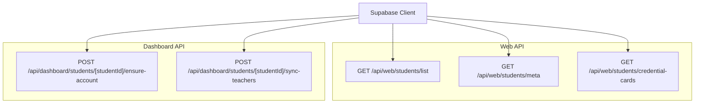
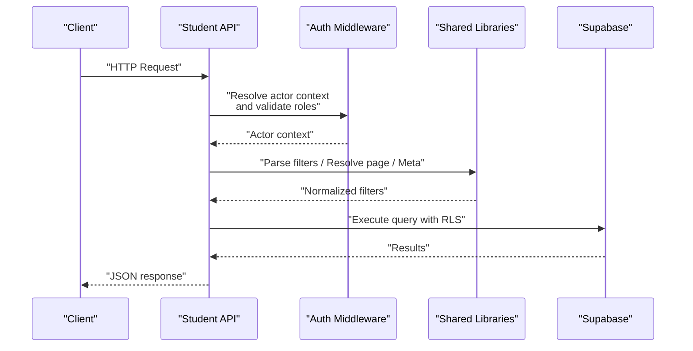
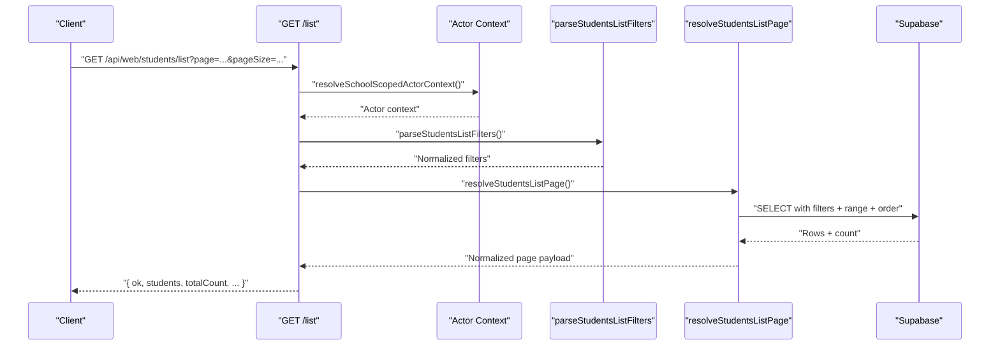
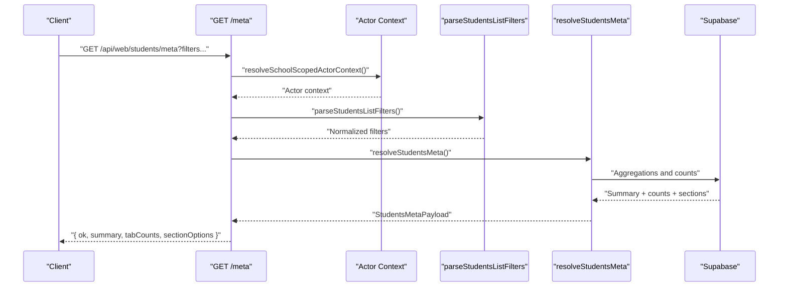
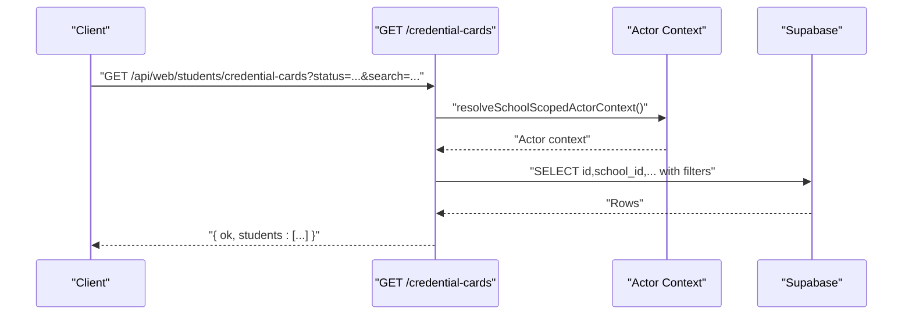
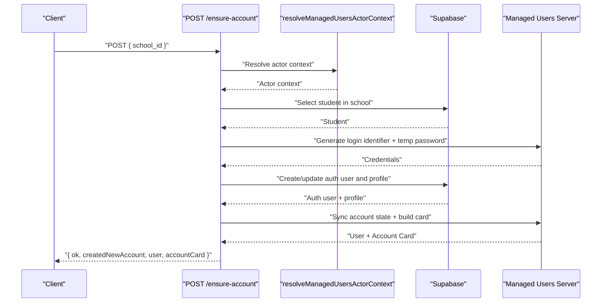
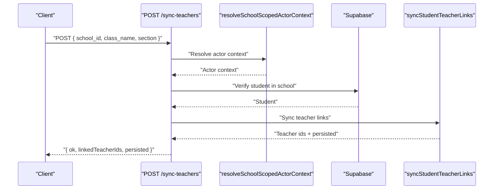
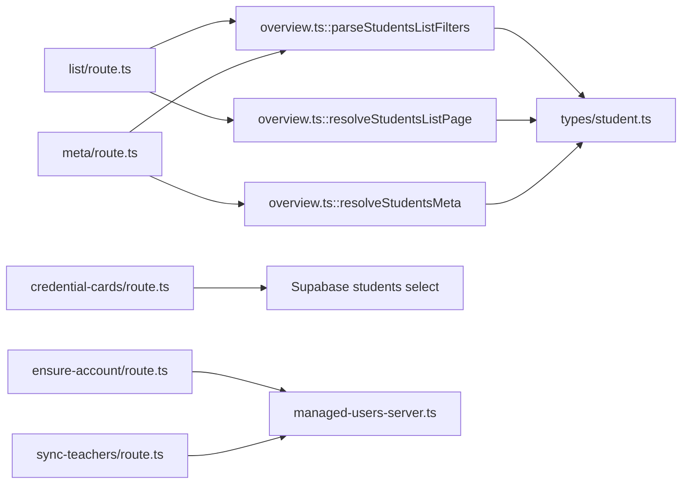

# Student Management API

<cite>
**Referenced Files in This Document**
- [list/route.ts](file://app/api/web/students/list/route.ts)
- [meta/route.ts](file://app/api/web/students/meta/route.ts)
- [credential-cards/route.ts](file://app/api/web/students/credential-cards/route.ts)
- [ensure-account/route.ts](file://app/api/dashboard/students/[studentId]/ensure-account/route.ts)
- [sync-teachers/route.ts](file://app/api/dashboard/students/[studentId]/sync-teachers/route.ts)
- [overview.ts](file://lib/students/overview.ts)
- [student.ts](file://types/student.ts)
- [managed-users-server.ts](file://lib/managed-users-server.ts)
- [20260322_managed_mobile_rls.sql](file://migrations/20260322_managed_mobile_rls.sql)
- [database_setup.sql](file://database_setup.sql)
</cite>

## Table of Contents
1. [Introduction](#introduction)
2. [Project Structure](#project-structure)
3. [Core Components](#core-components)
4. [Architecture Overview](#architecture-overview)
5. [Detailed Component Analysis](#detailed-component-analysis)
6. [Dependency Analysis](#dependency-analysis)
7. [Performance Considerations](#performance-considerations)
8. [Troubleshooting Guide](#troubleshooting-guide)
9. [Conclusion](#conclusion)
10. [Appendices](#appendices)

## Introduction
This document provides comprehensive API documentation for student management endpoints. It covers:
- Listing students with filtering, pagination, and search
- Metadata retrieval for student summaries and counts
- Credential card generation for student accounts
- Student account creation and linking to managed applications
- Teacher synchronization for student-class relationships
- Request parameters, response schemas, and validation rules
- Privacy, access controls, and multi-school data isolation

## Project Structure
The student management API surface is organized under:
- Web-facing endpoints for listing, metadata, and credential cards
- Dashboard endpoints for account creation and teacher sync

**Diagram sources**
- [list/route.ts:11-54](file://app/api/web/students/list/route.ts#L11-L54)
- [meta/route.ts:11-54](file://app/api/web/students/meta/route.ts#L11-L54)
- [credential-cards/route.ts:11-64](file://app/api/web/students/credential-cards/route.ts#L11-L64)
- [ensure-account/route.ts:22-265](file://app/api/dashboard/students/[studentId]/ensure-account/route.ts#L22-L265)
- [sync-teachers/route.ts:9-70](file://app/api/dashboard/students/[studentId]/sync-teachers/route.ts#L9-L70)

**Section sources**
- [list/route.ts:11-54](file://app/api/web/students/list/route.ts#L11-L54)
- [meta/route.ts:11-54](file://app/api/web/students/meta/route.ts#L11-L54)
- [credential-cards/route.ts:11-64](file://app/api/web/students/credential-cards/route.ts#L11-L64)
- [ensure-account/route.ts:22-265](file://app/api/dashboard/students/[studentId]/ensure-account/route.ts#L22-L265)
- [sync-teachers/route.ts:9-70](file://app/api/dashboard/students/[studentId]/sync-teachers/route.ts#L9-L70)

## Core Components
- Student listing endpoint: paginated, filterable, and searchable
- Student metadata endpoint: summary, tab counts, and section options
- Credential cards endpoint: printable student data filtered by status and class
- Account creation endpoint: ensures a managed application account exists for a student
- Teacher sync endpoint: synchronizes student-class-teacher links

Key request/response models:
- Student list row model and filters
- Students summary and metadata payload
- Student entity and form data types

**Section sources**
- [overview.ts:5-43](file://lib/students/overview.ts#L5-L43)
- [student.ts:10-32](file://types/student.ts#L10-L32)

## Architecture Overview
The API enforces school-scoped access and rate limits. Requests are validated and transformed via shared libraries, then executed against Supabase with row-level security policies ensuring multi-school isolation.

**Diagram sources**
- [list/route.ts:11-54](file://app/api/web/students/list/route.ts#L11-L54)
- [meta/route.ts:11-54](file://app/api/web/students/meta/route.ts#L11-L54)
- [overview.ts:212-227](file://lib/students/overview.ts#L212-L227)
- [20260322_managed_mobile_rls.sql:17-32](file://migrations/20260322_managed_mobile_rls.sql#L17-L32)
- [database_setup.sql:524-569](file://database_setup.sql#L524-L569)

## Detailed Component Analysis

### Student Listing API
- Endpoint: GET /api/web/students/list
- Purpose: Retrieve paginated student records with optional filters
- Authentication and scope:
  - Requires a valid session and resolves a school-scoped actor context
  - Allowed roles: super_admin, admin, employee
- Rate limit: 120 requests per minute per user
- Query parameters:
  - schoolId: target school identifier (required for context resolution)
  - page: integer, default 1, min 1
  - pageSize: integer, default 50, min 1, max 100
  - search: text search across name and class
  - className: filter by class name
  - sectionName: filter by section
  - status: tab filter; supported values: active, transferred, suspended, deleted
- Response payload:
  - ok: boolean
  - students: array of StudentListRow
  - totalCount: number
  - page: number
  - pageSize: number
  - totalPages: number
- Validation and normalization:
  - Filters are normalized and sanitized
  - Search terms are escaped and trimmed
  - Pagination bounds enforced

**Diagram sources**
- [list/route.ts:11-54](file://app/api/web/students/list/route.ts#L11-L54)
- [overview.ts:212-227](file://lib/students/overview.ts#L212-L227)
- [overview.ts:229-260](file://lib/students/overview.ts#L229-L260)

**Section sources**
- [list/route.ts:11-54](file://app/api/web/students/list/route.ts#L11-L54)
- [overview.ts:212-227](file://lib/students/overview.ts#L212-L227)
- [overview.ts:229-260](file://lib/students/overview.ts#L229-L260)
- [student.ts:10-25](file://types/student.ts#L10-L25)

### Student Metadata API
- Endpoint: GET /api/web/students/meta
- Purpose: Retrieve summary statistics, tab counts, and section options
- Authentication and scope:
  - Same as listing endpoint
- Rate limit: 90 requests per minute per user
- Query parameters:
  - schoolId: target school identifier
  - Filters identical to listing endpoint
- Response payload:
  - ok: boolean
  - summary: StudentsSummary
  - tabCounts: counts per StudentsStatusTab
  - sectionOptions: distinct sections (sorted)

**Diagram sources**
- [meta/route.ts:11-54](file://app/api/web/students/meta/route.ts#L11-L54)
- [overview.ts:262-282](file://lib/students/overview.ts#L262-L282)

**Section sources**
- [meta/route.ts:11-54](file://app/api/web/students/meta/route.ts#L11-L54)
- [overview.ts:32-43](file://lib/students/overview.ts#L32-L43)
- [overview.ts:262-282](file://lib/students/overview.ts#L262-L282)

### Credential Cards API
- Endpoint: GET /api/web/students/credential-cards
- Purpose: Retrieve printable student data for ID cards
- Authentication and scope:
  - Allowed roles: super_admin, admin
- Query parameters:
  - schoolId: target school identifier
  - status: defaults to active; supports active and explicit statuses
  - search: free-text search across name and class
  - className: filter by class
  - section: filter by section
- Response payload:
  - ok: boolean
  - students: array of minimal student records suitable for printing

**Diagram sources**
- [credential-cards/route.ts:11-64](file://app/api/web/students/credential-cards/route.ts#L11-L64)

**Section sources**
- [credential-cards/route.ts:11-64](file://app/api/web/students/credential-cards/route.ts#L11-L64)

### Student Account Creation API
- Endpoint: POST /api/dashboard/students/[studentId]/ensure-account
- Purpose: Ensure a managed application account exists for a student; optionally generate credentials and synchronize teacher links
- Authentication and scope:
  - Requires managed users actor context
  - Allowed roles: depends on managed user policy
- Request body:
  - school_id: target school identifier
- Behavior:
  - Resolves student record in target school
  - Generates login identifier and temporary password if needed
  - Creates or relinks auth user and managed profile
  - Syncs managed account state and builds account card
  - Attempts to synchronize teacher links (non-blocking)
- Response payload:
  - ok: boolean
  - createdNewAccount: boolean
  - user: managed user representation
  - accountCard: printable account card data

**Diagram sources**
- [ensure-account/route.ts:22-265](file://app/api/dashboard/students/[studentId]/ensure-account/route.ts#L22-L265)
- [managed-users-server.ts:186-200](file://lib/managed-users-server.ts#L186-L200)

**Section sources**
- [ensure-account/route.ts:22-265](file://app/api/dashboard/students/[studentId]/ensure-account/route.ts#L22-L265)
- [managed-users-server.ts:186-200](file://lib/managed-users-server.ts#L186-L200)

### Teacher Synchronization API
- Endpoint: POST /api/dashboard/students/[studentId]/sync-teachers
- Purpose: Synchronize student-class-teacher links
- Authentication and scope:
  - Requires school-scoped actor context
  - Allowed roles: super_admin, admin, employee
- Request body:
  - school_id: target school identifier
  - class_name: required
  - section: optional
- Behavior:
  - Validates presence of school and class
  - Confirms student belongs to target school
  - Calls sync routine to establish teacher links
- Response payload:
  - ok: boolean
  - linkedTeacherIds: identifiers of synced teachers
  - persisted: boolean indicating persistence outcome

**Diagram sources**
- [sync-teachers/route.ts:9-70](file://app/api/dashboard/students/[studentId]/sync-teachers/route.ts#L9-L70)

**Section sources**
- [sync-teachers/route.ts:9-70](file://app/api/dashboard/students/[studentId]/sync-teachers/route.ts#L9-L70)

## Dependency Analysis
- Shared filter parsing and normalization:
  - parseStudentsListFilters
  - resolveStudentsListPage
  - resolveStudentsMeta
- Data models:
  - StudentListRow, StudentsListFilters, StudentsSummary, StudentsMetaPayload
  - Student, StudentWithFees, StudentFormData
- Access control and isolation:
  - Row-level security policies on students and related tables
  - Managed user functions for role and school scoping

**Diagram sources**
- [list/route.ts:41-42](file://app/api/web/students/list/route.ts#L41-L42)
- [meta/route.ts:42-43](file://app/api/web/students/meta/route.ts#L42-L43)
- [overview.ts:212-227](file://lib/students/overview.ts#L212-L227)
- [overview.ts:229-260](file://lib/students/overview.ts#L229-L260)
- [overview.ts:262-282](file://lib/students/overview.ts#L262-L282)
- [student.ts:10-32](file://types/student.ts#L10-L32)
- [credential-cards/route.ts:31-55](file://app/api/web/students/credential-cards/route.ts#L31-L55)
- [ensure-account/route.ts:30-38](file://app/api/dashboard/students/[studentId]/ensure-account/route.ts#L30-L38)
- [sync-teachers/route.ts:29-40](file://app/api/dashboard/students/[studentId]/sync-teachers/route.ts#L29-L40)

**Section sources**
- [overview.ts:212-282](file://lib/students/overview.ts#L212-L282)
- [student.ts:10-32](file://types/student.ts#L10-L32)
- [20260322_managed_mobile_rls.sql:17-32](file://migrations/20260322_managed_mobile_rls.sql#L17-L32)
- [database_setup.sql:524-569](file://database_setup.sql#L524-L569)

## Performance Considerations
- Pagination and limits:
  - Default page size 50; maximum 100 items per page
  - Range-based queries with explicit ordering
- Filtering:
  - Index-friendly equality filters (class_name, section, status)
  - Text search uses ILIKE with sanitized inputs
- Caching:
  - Responses set cache-control to prevent caching
- Rate limiting:
  - Distinct limits per endpoint to protect resources

[No sources needed since this section provides general guidance]

## Troubleshooting Guide
Common errors and resolutions:
- Authorization failures:
  - Ensure the actor context resolves with allowed roles
  - Verify the schoolId matches the actor’s school scope
- Resource not found:
  - Student must belong to the resolved target school
- Validation errors:
  - Ensure required fields (e.g., class_name for teacher sync) are present
- Rate limit exceeded:
  - Reduce request frequency or batch operations

**Section sources**
- [list/route.ts:22-27](file://app/api/web/students/list/route.ts#L22-L27)
- [meta/route.ts:22-27](file://app/api/web/students/meta/route.ts#L22-L27)
- [credential-cards/route.ts:18-29](file://app/api/web/students/credential-cards/route.ts#L18-L29)
- [sync-teachers/route.ts:21-28](file://app/api/dashboard/students/[studentId]/sync-teachers/route.ts#L21-L28)

## Conclusion
The student management API provides robust, secure, and scalable operations for listing, summarizing, generating credential cards, and managing student accounts and teacher links. Multi-school isolation and role-based access are enforced through shared actor contexts and database policies.

[No sources needed since this section summarizes without analyzing specific files]

## Appendices

### Request Parameters Reference
- Listing and metadata:
  - page: integer ≥ 1
  - pageSize: integer between 1 and 100
  - search: text (sanitized)
  - className: text
  - sectionName: text
  - status: active | transferred | suspended | deleted
- Credential cards:
  - status: active | explicit status
  - search: text
  - className: text
  - section: text

**Section sources**
- [overview.ts:212-227](file://lib/students/overview.ts#L212-L227)
- [credential-cards/route.ts:13-16](file://app/api/web/students/credential-cards/route.ts#L13-L16)

### Response Schemas
- StudentListRow:
  - id, school_id, auth_user_id?, full_name, class_name, section?, phone?, address?, total_fee, paid_fee, discount_value, remaining_fee, status, created_at, updated_at?
- StudentsSummary:
  - totalStudents, activeStudents, totalFee, totalRemaining
- StudentsMetaPayload:
  - summary: StudentsSummary
  - tabCounts: { active, transferred, suspended, deleted }
  - sectionOptions: string[]
- Student entity:
  - id, school_id, full_name, class_name, section?, phone?, address?, total_fee, paid_fee, discount_value, status, auth_user_id?, created_at, updated_at?

**Section sources**
- [overview.ts:5-43](file://lib/students/overview.ts#L5-L43)
- [student.ts:10-32](file://types/student.ts#L10-L32)

### Access Controls and Privacy
- Multi-school isolation:
  - Actor context resolves target school and enforces scope
  - Database RLS policies restrict access to current school or super admin
- Role-based access:
  - Different endpoints require different roles (e.g., admin vs. employee)
- Data privacy:
  - Credential cards endpoint returns minimal fields suitable for printing
  - Managed user flows centralize identity and profile updates

**Section sources**
- [list/route.ts:13-20](file://app/api/web/students/list/route.ts#L13-L20)
- [meta/route.ts:13-20](file://app/api/web/students/meta/route.ts#L13-L20)
- [credential-cards/route.ts:18-25](file://app/api/web/students/credential-cards/route.ts#L18-L25)
- [20260322_managed_mobile_rls.sql:17-32](file://migrations/20260322_managed_mobile_rls.sql#L17-L32)
- [database_setup.sql:524-569](file://database_setup.sql#L524-L569)