# Utility & System API

<cite>
**Referenced Files in This Document**
- [app/api/ping/route.ts](file://app/api/ping/route.ts)
- [app/api/rbac/session/route.ts](file://app/api/rbac/session/route.ts)
- [app/api/users/route.ts](file://app/api/users/route.ts)
- [app/api/web/schema-compat/route.ts](file://app/api/web/schema-compat/route.ts)
- [app/api/web/teacher-activity/meta/route.ts](file://app/api/web/teacher-activity/meta/route.ts)
- [app/api/web/teacher-activity/homework/route.ts](file://app/api/web/teacher-activity/homework/route.ts)
- [app/api/web/teacher-activity/messages/route.ts](file://app/api/web/teacher-activity/messages/route.ts)
- [app/api/web/dashboard/overview/route.ts](file://app/api/web/dashboard/overview/route.ts)
- [app/api/web/reports/overview/route.ts](file://app/api/web/reports/overview/route.ts)
- [app/api/web/super-admin/overview/route.ts](file://app/api/web/super-admin/overview/route.ts)
- [app/api/web/super-admin/schools/route.ts](file://app/api/web/super-admin/schools/route.ts)
- [app/api/web/students/list/route.ts](file://app/api/web/students/list/route.ts)
- [app/api/web/payments/overview/route.ts](file://app/api/web/payments/overview/route.ts)
- [app/api/web/payments/export/route.ts](file://app/api/web/payments/export/route.ts)
- [app/api/web/payments/archive/route.ts](file://app/api/web/payments/archive/route.ts)
</cite>

## Table of Contents
1. [Introduction](#introduction)
2. [Project Structure](#project-structure)
3. [Core Components](#core-components)
4. [Architecture Overview](#architecture-overview)
5. [Detailed Component Analysis](#detailed-component-analysis)
6. [Dependency Analysis](#dependency-analysis)
7. [Performance Considerations](#performance-considerations)
8. [Troubleshooting Guide](#troubleshooting-guide)
9. [Conclusion](#conclusion)

## Introduction
This document describes the Utility and System API surface for the school administration platform. It covers health checks, schema compatibility, dashboard utilities, reporting systems, teacher activity monitoring (homework and messaging), administrative utilities, and system maintenance endpoints. It also documents request/response schemas, integration patterns, and operational monitoring capabilities.

## Project Structure
The API is organized under Next.js App Router-style handlers grouped by domain and capability:
- Health and session: /api/ping, /api/rbac/session
- Users and admin utilities: /api/users, /api/web/super-admin/*
- Schema compatibility: /api/web/schema-compat
- Teacher activity monitoring: /api/web/teacher-activity/*
- Dashboard and reporting: /api/web/dashboard/*, /api/web/reports/*
- Payments and archives: /api/web/payments/*
- Students listing: /api/web/students/*

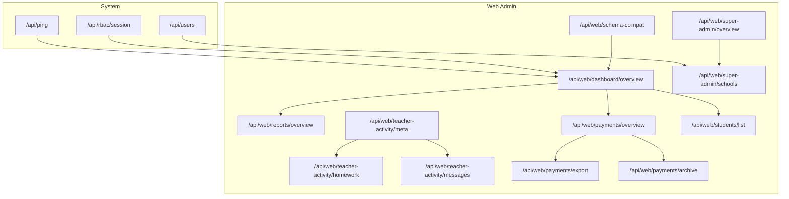

**Diagram sources**
- [app/api/ping/route.ts:1-51](file://app/api/ping/route.ts#L1-L51)
- [app/api/rbac/session/route.ts:1-155](file://app/api/rbac/session/route.ts#L1-L155)
- [app/api/users/route.ts:1-201](file://app/api/users/route.ts#L1-L201)
- [app/api/web/schema-compat/route.ts:1-24](file://app/api/web/schema-compat/route.ts#L1-L24)
- [app/api/web/dashboard/overview/route.ts:1-179](file://app/api/web/dashboard/overview/route.ts#L1-L179)
- [app/api/web/reports/overview/route.ts:1-248](file://app/api/web/reports/overview/route.ts#L1-L248)
- [app/api/web/teacher-activity/meta/route.ts:1-23](file://app/api/web/teacher-activity/meta/route.ts#L1-L23)
- [app/api/web/teacher-activity/homework/route.ts:1-20](file://app/api/web/teacher-activity/homework/route.ts#L1-L20)
- [app/api/web/teacher-activity/messages/route.ts:1-20](file://app/api/web/teacher-activity/messages/route.ts#L1-L20)
- [app/api/web/payments/overview/route.ts:1-44](file://app/api/web/payments/overview/route.ts#L1-L44)
- [app/api/web/payments/export/route.ts:1-58](file://app/api/web/payments/export/route.ts#L1-L58)
- [app/api/web/payments/archive/route.ts:1-130](file://app/api/web/payments/archive/route.ts#L1-L130)
- [app/api/web/students/list/route.ts:1-55](file://app/api/web/students/list/route.ts#L1-L55)
- [app/api/web/super-admin/overview/route.ts:1-28](file://app/api/web/super-admin/overview/route.ts#L1-L28)
- [app/api/web/super-admin/schools/route.ts:1-147](file://app/api/web/super-admin/schools/route.ts#L1-L147)

**Section sources**
- [app/api/ping/route.ts:1-51](file://app/api/ping/route.ts#L1-L51)
- [app/api/rbac/session/route.ts:1-155](file://app/api/rbac/session/route.ts#L1-L155)
- [app/api/users/route.ts:1-201](file://app/api/users/route.ts#L1-L201)
- [app/api/web/schema-compat/route.ts:1-24](file://app/api/web/schema-compat/route.ts#L1-L24)
- [app/api/web/dashboard/overview/route.ts:1-179](file://app/api/web/dashboard/overview/route.ts#L1-L179)
- [app/api/web/reports/overview/route.ts:1-248](file://app/api/web/reports/overview/route.ts#L1-L248)
- [app/api/web/teacher-activity/meta/route.ts:1-23](file://app/api/web/teacher-activity/meta/route.ts#L1-L23)
- [app/api/web/teacher-activity/homework/route.ts:1-20](file://app/api/web/teacher-activity/homework/route.ts#L1-L20)
- [app/api/web/teacher-activity/messages/route.ts:1-20](file://app/api/web/teacher-activity/messages/route.ts#L1-L20)
- [app/api/web/payments/overview/route.ts:1-44](file://app/api/web/payments/overview/route.ts#L1-L44)
- [app/api/web/payments/export/route.ts:1-58](file://app/api/web/payments/export/route.ts#L1-L58)
- [app/api/web/payments/archive/route.ts:1-130](file://app/api/web/payments/archive/route.ts#L1-L130)
- [app/api/web/students/list/route.ts:1-55](file://app/api/web/students/list/route.ts#L1-L55)
- [app/api/web/super-admin/overview/route.ts:1-28](file://app/api/web/super-admin/overview/route.ts#L1-L28)
- [app/api/web/super-admin/schools/route.ts:1-147](file://app/api/web/super-admin/schools/route.ts#L1-L147)

## Core Components
- Health check: Lightweight server health and Supabase connectivity probe.
- RBAC session: Build and sign session cookies with role and permissions.
- Users: Administrative user creation with validation and schema compatibility handling.
- Schema compatibility: Detect application schema compatibility with client.
- Teacher activity: Meta and paginated lists for homework and messages.
- Dashboard: School-scoped overview with totals, recent payments, and class stats.
- Reporting: Aggregated metrics via RPC with fallback logic.
- Payments: Overview, export, and annual archive operations.
- Students: Paginated list with filters and rate limiting.
- Super Admin: Global overview and school creation with plan and subscription.

**Section sources**
- [app/api/ping/route.ts:1-51](file://app/api/ping/route.ts#L1-L51)
- [app/api/rbac/session/route.ts:1-155](file://app/api/rbac/session/route.ts#L1-L155)
- [app/api/users/route.ts:1-201](file://app/api/users/route.ts#L1-L201)
- [app/api/web/schema-compat/route.ts:1-24](file://app/api/web/schema-compat/route.ts#L1-L24)
- [app/api/web/teacher-activity/meta/route.ts:1-23](file://app/api/web/teacher-activity/meta/route.ts#L1-L23)
- [app/api/web/teacher-activity/homework/route.ts:1-20](file://app/api/web/teacher-activity/homework/route.ts#L1-L20)
- [app/api/web/teacher-activity/messages/route.ts:1-20](file://app/api/web/teacher-activity/messages/route.ts#L1-L20)
- [app/api/web/dashboard/overview/route.ts:1-179](file://app/api/web/dashboard/overview/route.ts#L1-L179)
- [app/api/web/reports/overview/route.ts:1-248](file://app/api/web/reports/overview/route.ts#L1-L248)
- [app/api/web/payments/overview/route.ts:1-44](file://app/api/web/payments/overview/route.ts#L1-L44)
- [app/api/web/payments/export/route.ts:1-58](file://app/api/web/payments/export/route.ts#L1-L58)
- [app/api/web/payments/archive/route.ts:1-130](file://app/api/web/payments/archive/route.ts#L1-L130)
- [app/api/web/students/list/route.ts:1-55](file://app/api/web/students/list/route.ts#L1-L55)
- [app/api/web/super-admin/overview/route.ts:1-28](file://app/api/web/super-admin/overview/route.ts#L1-L28)
- [app/api/web/super-admin/schools/route.ts:1-147](file://app/api/web/super-admin/schools/route.ts#L1-L147)

## Architecture Overview
The system exposes REST-like endpoints backed by Supabase. Authentication is handled via Authorization header and Supabase client helpers. RBAC builds signed session cookies for admin sessions. Many endpoints enforce rate limits and restrict access to the acting user’s school scope. Fallbacks and compatibility detection ensure graceful operation when advanced features are not yet deployed.

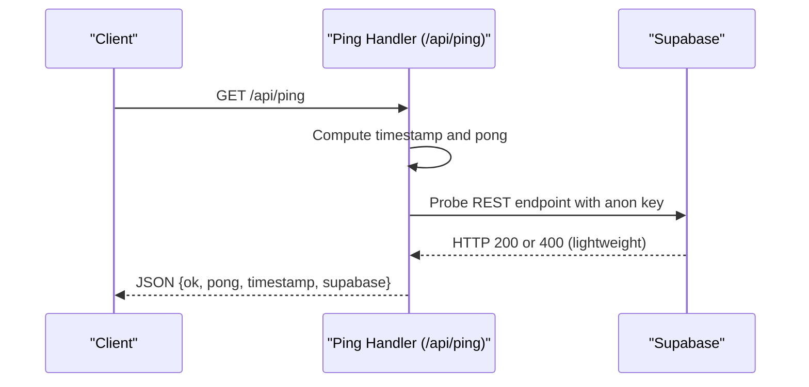

**Diagram sources**
- [app/api/ping/route.ts:10-50](file://app/api/ping/route.ts#L10-L50)

**Section sources**
- [app/api/ping/route.ts:1-51](file://app/api/ping/route.ts#L1-L51)

## Detailed Component Analysis

### Health Check Endpoint
- Path: GET /api/ping
- Purpose: Lightweight health check returning server timestamp, pong, and Supabase connectivity status.
- Behavior:
  - Reads Supabase URL and anon/publishable keys from environment.
  - Probes REST endpoint with short timeout.
  - Sets no-store cache control.
- Response schema:
  - ok: boolean
  - pong: number (epoch millis)
  - timestamp: string (ISO instant)
  - supabase: "ok" | "error" | "unconfigured"

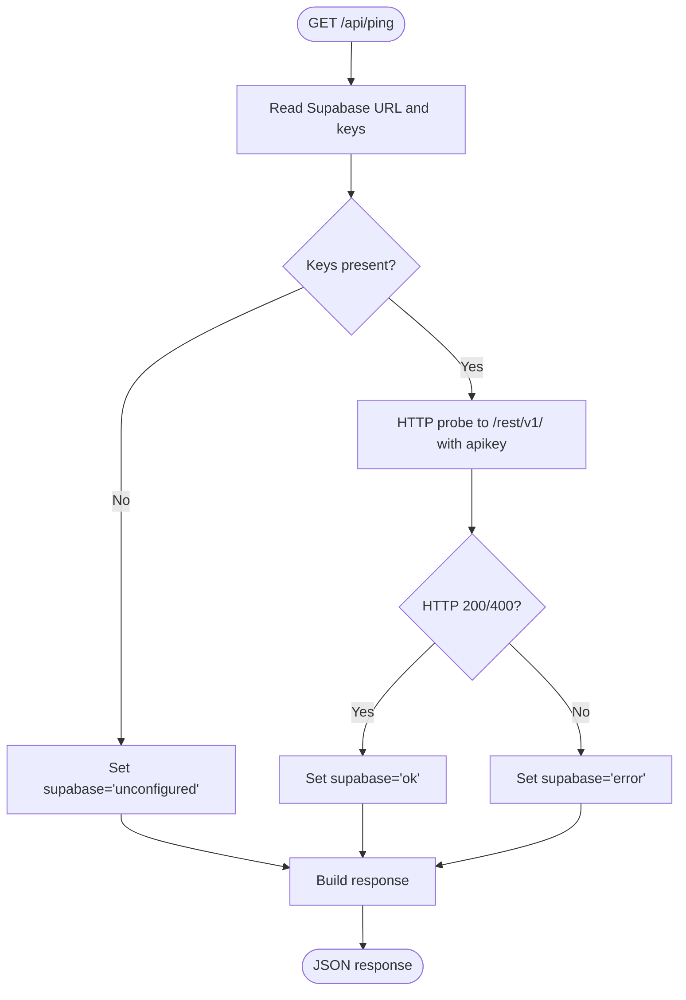

**Diagram sources**
- [app/api/ping/route.ts:10-50](file://app/api/ping/route.ts#L10-L50)

**Section sources**
- [app/api/ping/route.ts:1-51](file://app/api/ping/route.ts#L1-L51)

### RBAC Session Management
- Path: POST /api/rbac/session
  - Validates RBAC secret, authenticates user, resolves role and permissions, checks school and subscription status, signs a session cookie.
- Path: DELETE /api/rbac/session
  - Clears the session cookie.

Key behaviors:
- Enforces rate limit per user for POST.
- Fetches user profile and permissions via Supabase with RLS.
- Builds payload with role, permissions, school and subscription flags.
- Signs and sets a cookie with secure and same-site options.

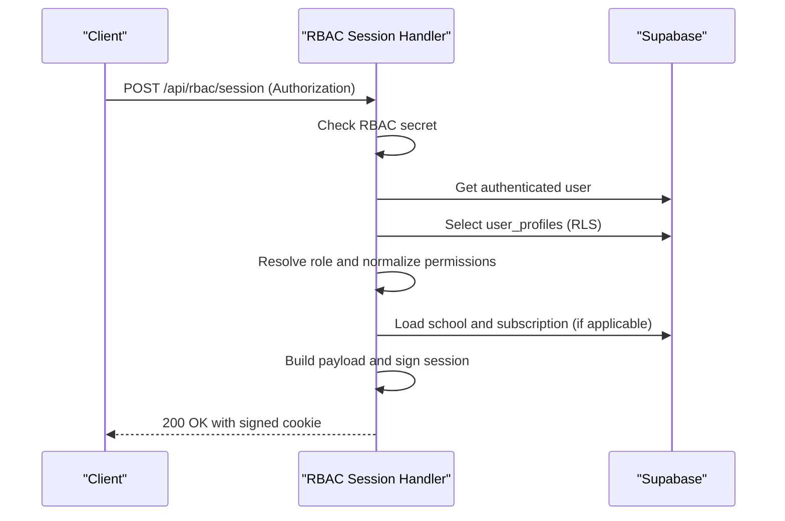

**Diagram sources**
- [app/api/rbac/session/route.ts:14-133](file://app/api/rbac/session/route.ts#L14-L133)

**Section sources**
- [app/api/rbac/session/route.ts:1-155](file://app/api/rbac/session/route.ts#L1-L155)

### Users Administration
- Path: POST /api/users
  - Creates a new user via Supabase admin auth and inserts a profile row.
  - Validates input (email format, password length, role constraints, optional fields).
  - Enforces rate limit per actor user.
  - Requires actor to be super_admin.
  - Handles schema compatibility for custom_permissions column by omitting if missing.

Validation and constraints:
- Email must match pattern.
- Password length 8–72.
- Non-super_admin requires school_id.
- is_active defaults to true.
- custom_permissions normalized and filtered against allowed set.

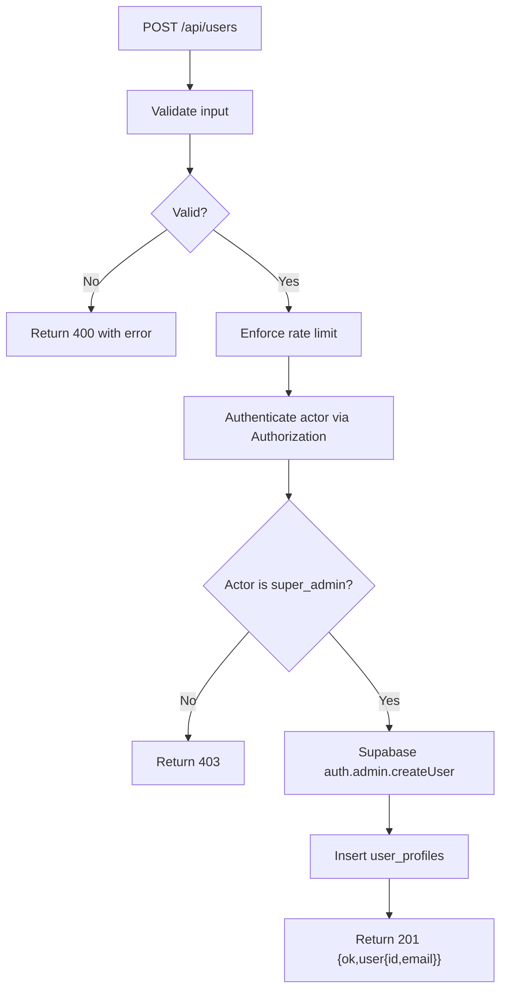

**Diagram sources**
- [app/api/users/route.ts:77-200](file://app/api/users/route.ts#L77-L200)

**Section sources**
- [app/api/users/route.ts:1-201](file://app/api/users/route.ts#L1-L201)

### Schema Compatibility API
- Path: GET /api/web/schema-compat
  - Detects application schema compatibility with the client.
  - On missing tables, returns default compatibility and admin infrastructure hints.
  - Otherwise returns detected compatibility object.

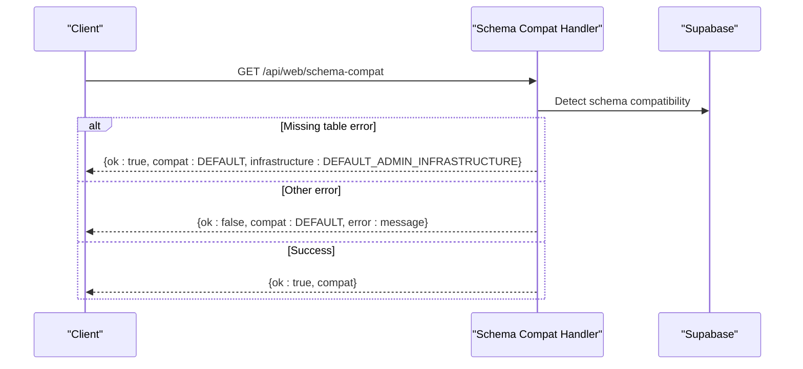

**Diagram sources**
- [app/api/web/schema-compat/route.ts:7-23](file://app/api/web/schema-compat/route.ts#L7-L23)

**Section sources**
- [app/api/web/schema-compat/route.ts:1-24](file://app/api/web/schema-compat/route.ts#L1-L24)

### Teacher Activity Monitoring
Endpoints:
- GET /api/web/teacher-activity/meta
  - Returns metadata filters (schoolId, studentQuery, branchId, className, section).
- GET /api/web/teacher-activity/homework
  - Lists homework with pagination and filters.
- GET /api/web/teacher-activity/messages
  - Lists teacher messages with pagination and filters.

Common behavior:
- Parse filters from query parameters.
- Invoke server-side listers and return items plus totalCount.
- Return errors via jsonError with appropriate status.

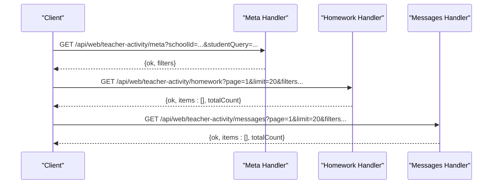

**Diagram sources**
- [app/api/web/teacher-activity/meta/route.ts:5-22](file://app/api/web/teacher-activity/meta/route.ts#L5-L22)
- [app/api/web/teacher-activity/homework/route.ts:6-19](file://app/api/web/teacher-activity/homework/route.ts#L6-L19)
- [app/api/web/teacher-activity/messages/route.ts:6-19](file://app/api/web/teacher-activity/messages/route.ts#L6-L19)

**Section sources**
- [app/api/web/teacher-activity/meta/route.ts:1-23](file://app/api/web/teacher-activity/meta/route.ts#L1-L23)
- [app/api/web/teacher-activity/homework/route.ts:1-20](file://app/api/web/teacher-activity/homework/route.ts#L1-L20)
- [app/api/web/teacher-activity/messages/route.ts:1-20](file://app/api/web/teacher-activity/messages/route.ts#L1-L20)

### Dashboard Utilities
- GET /api/web/dashboard/overview
  - Computes totals, recent payments, overdue students, class fees with stats, and student count by class.
  - Enforces school-scoped actor context and gracefully adapts to schema differences.

Response highlights:
- totals: studentsCount, transferredCount, totalFees, totalPaid, totalDiscount, totalRemaining, afterDiscount, paidPct, remainingPct.
- recentPayments: last 5 payments with student/class names.
- overdueStudents: top 3 by remaining fee.
- classFees: with computed stats per class.
- studentCountByClass: counts per class.

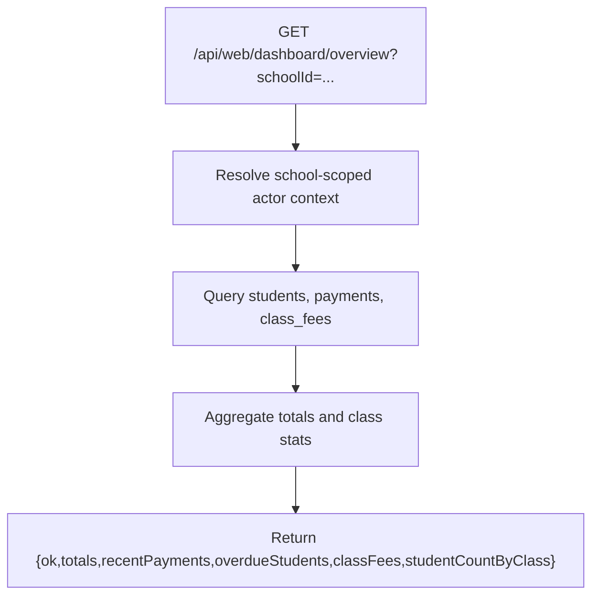

**Diagram sources**
- [app/api/web/dashboard/overview/route.ts:20-178](file://app/api/web/dashboard/overview/route.ts#L20-L178)

**Section sources**
- [app/api/web/dashboard/overview/route.ts:1-179](file://app/api/web/dashboard/overview/route.ts#L1-L179)

### Reporting Systems
- GET /api/web/reports/overview
  - Loads aggregated metrics via RPC function school_reports_summary when available.
  - Falls back to manual aggregation across students, payments, expenses, and salaries.
  - Applies rate limit per actor user.
  - Returns warnings when fallback is used.

Response highlights:
- metrics: studentsCount, activeStudents, totalFees, totalPaid, totalRemaining, paymentsCount, paymentVolume, todayPayments, expensesCount, expenseVolume, expenseTypeCount, salariesCount, salaryVolume, currentMonthSalaryCount, netBalance.
- warnings: array of informational messages.

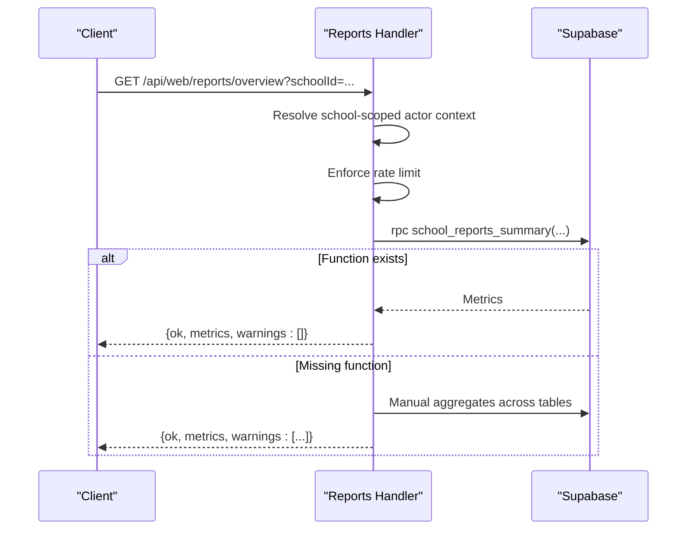

**Diagram sources**
- [app/api/web/reports/overview/route.ts:173-247](file://app/api/web/reports/overview/route.ts#L173-L247)

**Section sources**
- [app/api/web/reports/overview/route.ts:1-248](file://app/api/web/reports/overview/route.ts#L1-L248)

### Administrative Utilities
- GET /api/web/super-admin/overview
  - Returns global super admin overview data after resolving actor context.
- POST /api/web/super-admin/schools
  - Creates a school with plan and initial subscription.
  - Detects admin infrastructure and schema compatibility to conditionally include color fields and branch creation.
  - Returns schemaCompat and branchSkipped flags.

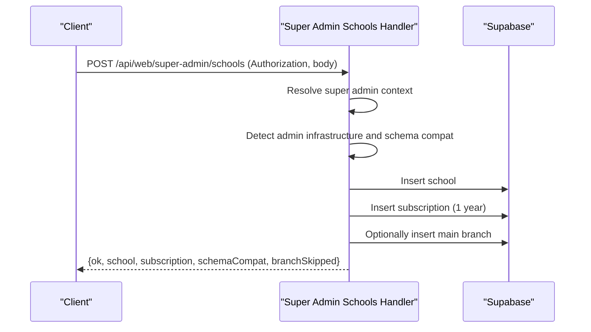

**Diagram sources**
- [app/api/web/super-admin/schools/route.ts:46-146](file://app/api/web/super-admin/schools/route.ts#L46-L146)

**Section sources**
- [app/api/web/super-admin/overview/route.ts:1-28](file://app/api/web/super-admin/overview/route.ts#L1-L28)
- [app/api/web/super-admin/schools/route.ts:1-147](file://app/api/web/super-admin/schools/route.ts#L1-L147)

### Data Validation and Listing
- GET /api/web/students/list
  - School-scoped listing with filters and rate limit enforcement.
  - Returns paginated results with counts and metadata.

- GET /api/web/payments/overview
  - Returns payment overview metadata and redirects clients to export endpoint for full datasets.

- GET /api/web/payments/export
  - Exports payment-related student data with rate limit and filters.

- POST /api/web/payments/archive
  - Archives annual payments and related student snapshots into account_archives.
  - Requires delete_payments permission and validates inputs.

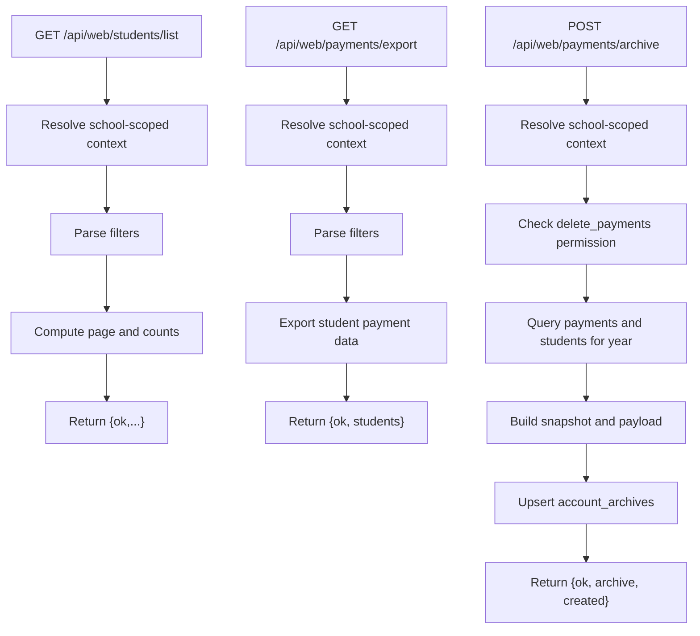

**Diagram sources**
- [app/api/web/students/list/route.ts:11-54](file://app/api/web/students/list/route.ts#L11-L54)
- [app/api/web/payments/overview/route.ts:10-43](file://app/api/web/payments/overview/route.ts#L10-L43)
- [app/api/web/payments/export/route.ts:11-57](file://app/api/web/payments/export/route.ts#L11-L57)
- [app/api/web/payments/archive/route.ts:11-129](file://app/api/web/payments/archive/route.ts#L11-L129)

**Section sources**
- [app/api/web/students/list/route.ts:1-55](file://app/api/web/students/list/route.ts#L1-L55)
- [app/api/web/payments/overview/route.ts:1-44](file://app/api/web/payments/overview/route.ts#L1-L44)
- [app/api/web/payments/export/route.ts:1-58](file://app/api/web/payments/export/route.ts#L1-L58)
- [app/api/web/payments/archive/route.ts:1-130](file://app/api/web/payments/archive/route.ts#L1-L130)

## Dependency Analysis
- Authentication and authorization:
  - RBAC session handler depends on Supabase client helpers and role normalization.
  - Users handler depends on Supabase admin client and actor context resolution.
- Data access:
  - Dashboard, reports, payments, and students endpoints rely on Supabase RLS-protected queries.
  - Payments archive depends on account_archives table presence and permissions.
- Compatibility:
  - Schema-compat handler detects presence of optional columns/tables and adjusts queries accordingly.
  - Super admin schools handler adapts to branches availability and color fields.

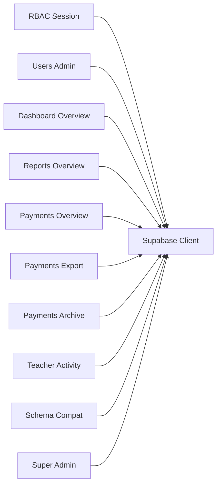

**Diagram sources**
- [app/api/rbac/session/route.ts:1-155](file://app/api/rbac/session/route.ts#L1-L155)
- [app/api/users/route.ts:1-201](file://app/api/users/route.ts#L1-L201)
- [app/api/web/dashboard/overview/route.ts:1-179](file://app/api/web/dashboard/overview/route.ts#L1-L179)
- [app/api/web/reports/overview/route.ts:1-248](file://app/api/web/reports/overview/route.ts#L1-L248)
- [app/api/web/payments/overview/route.ts:1-44](file://app/api/web/payments/overview/route.ts#L1-L44)
- [app/api/web/payments/export/route.ts:1-58](file://app/api/web/payments/export/route.ts#L1-L58)
- [app/api/web/payments/archive/route.ts:1-130](file://app/api/web/payments/archive/route.ts#L1-L130)
- [app/api/web/teacher-activity/meta/route.ts:1-23](file://app/api/web/teacher-activity/meta/route.ts#L1-L23)
- [app/api/web/schema-compat/route.ts:1-24](file://app/api/web/schema-compat/route.ts#L1-L24)
- [app/api/web/super-admin/schools/route.ts:1-147](file://app/api/web/super-admin/schools/route.ts#L1-L147)

**Section sources**
- [app/api/rbac/session/route.ts:1-155](file://app/api/rbac/session/route.ts#L1-L155)
- [app/api/users/route.ts:1-201](file://app/api/users/route.ts#L1-L201)
- [app/api/web/dashboard/overview/route.ts:1-179](file://app/api/web/dashboard/overview/route.ts#L1-L179)
- [app/api/web/reports/overview/route.ts:1-248](file://app/api/web/reports/overview/route.ts#L1-L248)
- [app/api/web/payments/overview/route.ts:1-44](file://app/api/web/payments/overview/route.ts#L1-L44)
- [app/api/web/payments/export/route.ts:1-58](file://app/api/web/payments/export/route.ts#L1-L58)
- [app/api/web/payments/archive/route.ts:1-130](file://app/api/web/payments/archive/route.ts#L1-L130)
- [app/api/web/teacher-activity/meta/route.ts:1-23](file://app/api/web/teacher-activity/meta/route.ts#L1-L23)
- [app/api/web/schema-compat/route.ts:1-24](file://app/api/web/schema-compat/route.ts#L1-L24)
- [app/api/web/super-admin/schools/route.ts:1-147](file://app/api/web/super-admin/schools/route.ts#L1-L147)

## Performance Considerations
- Rate limiting:
  - RBAC session POST, reports overview, students list, payments export, and payments archive enforce per-user or per-window limits to prevent abuse.
- Parallelization:
  - Dashboard overview performs multiple queries concurrently and aggregates results.
- Caching:
  - Health check disables caching to ensure fresh status.
- Fallbacks:
  - Reports overview falls back to manual aggregation when RPC function is unavailable.
- Conditional queries:
  - Dashboard and super admin handlers adapt queries based on schema compatibility (e.g., color fields, branches).

[No sources needed since this section provides general guidance]

## Troubleshooting Guide
- Health check returns unconfigured:
  - Verify NEXT_PUBLIC_SUPABASE_URL and NEXT_PUBLIC_SUPABASE_ANON_KEY (or publishable key) are set.
- RBAC session fails:
  - Ensure RBAC secret is configured server-side and user profile exists with a recognized role.
- Users creation returns 403:
  - Only super_admin actors can create users.
- Schema compatibility:
  - If missing table errors occur, apply migrations to add required tables and columns.
- Reports overview:
  - If RPC function is missing, apply the migration for school_reports_summary to enable optimized metrics.
- Payments archive:
  - If account_archives table is missing, run database setup script to create it.

**Section sources**
- [app/api/ping/route.ts:17-34](file://app/api/ping/route.ts#L17-L34)
- [app/api/rbac/session/route.ts:15-72](file://app/api/rbac/session/route.ts#L15-L72)
- [app/api/users/route.ts:124-130](file://app/api/users/route.ts#L124-L130)
- [app/api/web/schema-compat/route.ts:14-21](file://app/api/web/schema-compat/route.ts#L14-L21)
- [app/api/web/reports/overview/route.ts:222-229](file://app/api/web/reports/overview/route.ts#L222-L229)
- [app/api/web/payments/archive/route.ts:106-108](file://app/api/web/payments/archive/route.ts#L106-L108)

## Conclusion
The Utility and System API provides robust health monitoring, secure RBAC sessions, administrative user management, compatibility detection, teacher activity monitoring, comprehensive dashboard and reporting, and payment lifecycle operations with archival. The design emphasizes schema compatibility, graceful fallbacks, and strict access controls aligned with school-scoped contexts.