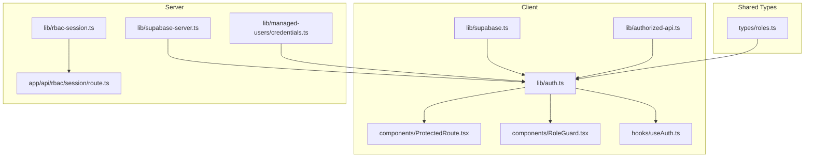
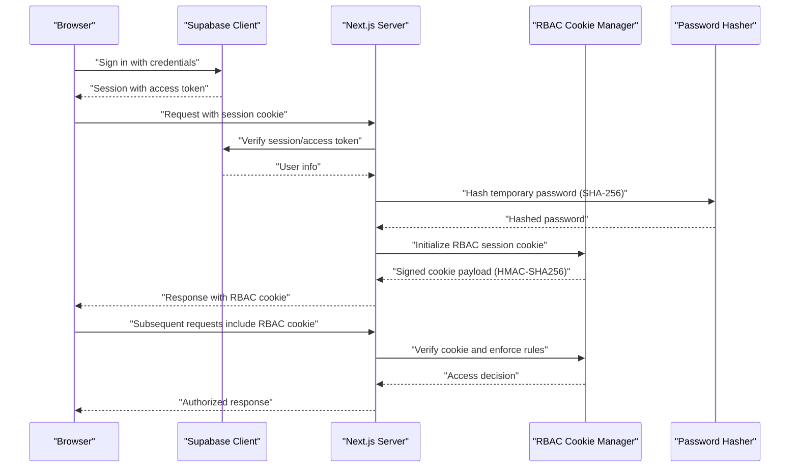
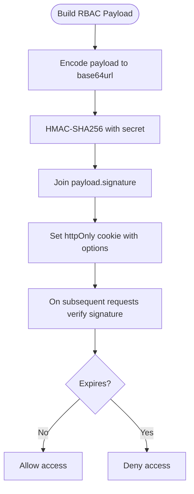
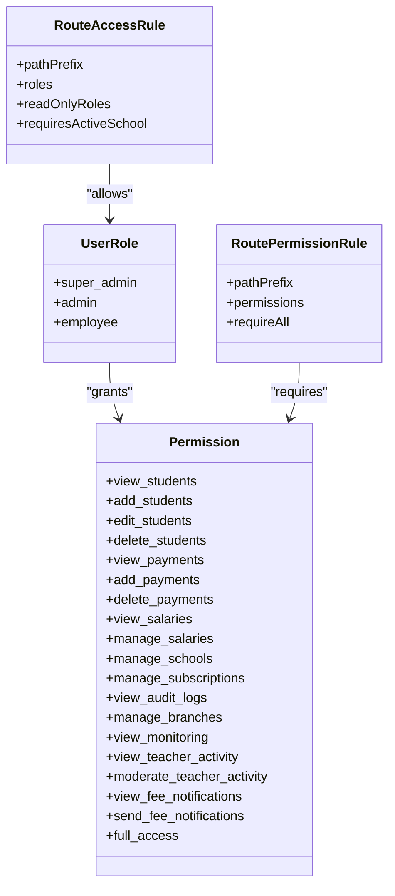
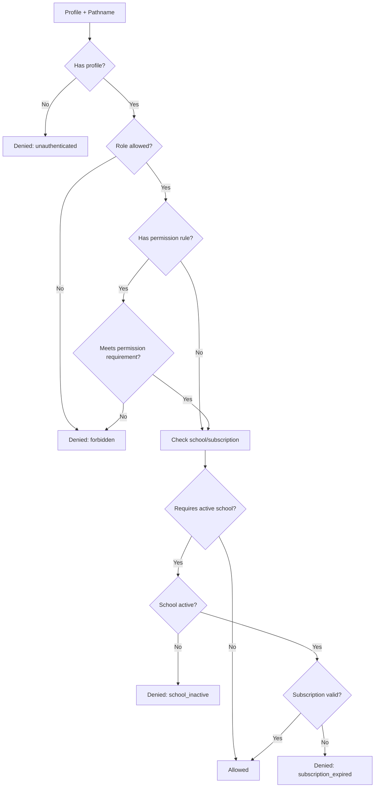
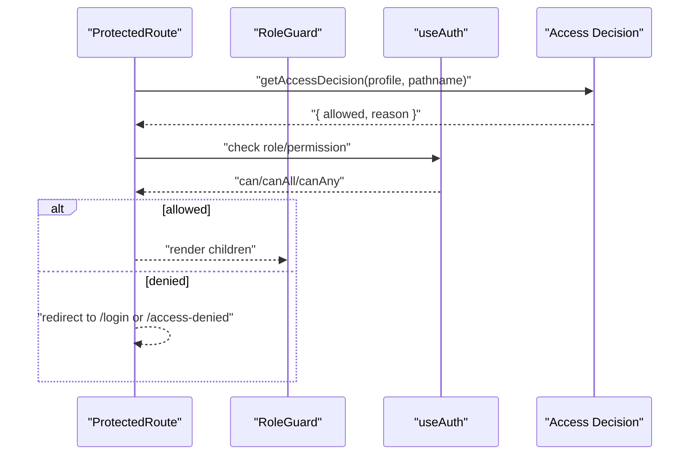
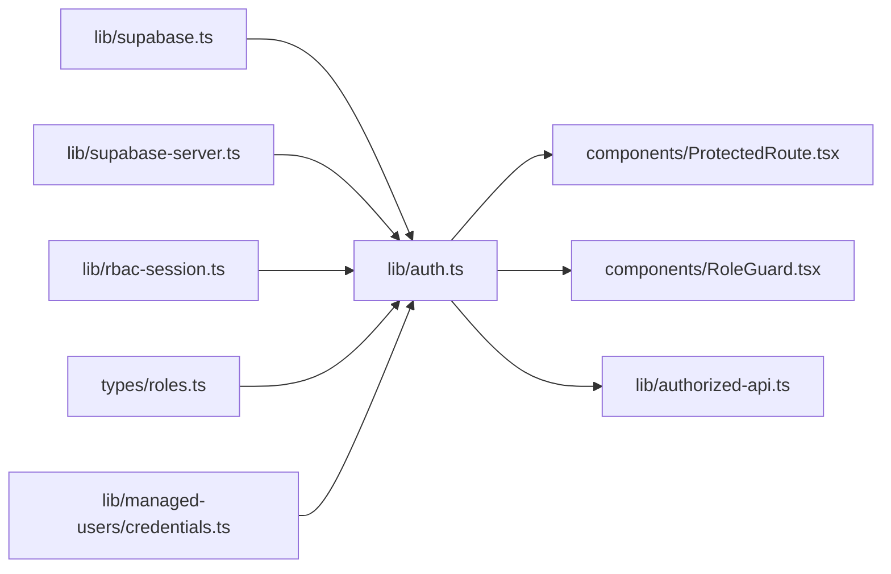

# Authentication & Authorization

<cite>
**Referenced Files in This Document**
- [lib/auth.ts](file://lib/auth.ts)
- [lib/rbac-session.ts](file://lib/rbac-session.ts)
- [lib/supabase.ts](file://lib/supabase.ts)
- [lib/supabase-server.ts](file://lib/supabase-server.ts)
- [lib/authorized-api.ts](file://lib/authorized-api.ts)
- [types/roles.ts](file://types/roles.ts)
- [components/ProtectedRoute.tsx](file://components/ProtectedRoute.tsx)
- [components/RoleGuard.tsx](file://components/RoleGuard.tsx)
- [hooks/useAuth.ts](file://hooks/useAuth.ts)
- [app/api/rbac/session/route.ts](file://app/api/rbac/session/route.ts)
- [lib/managed-users/credentials.ts](file://lib/managed-users/credentials.ts)
- [migrations/20260401_000000_remove_plaintext_passwords.sql](file://migrations/20260401_000000_remove_plaintext_passwords.sql)
</cite>

## Update Summary
**Changes Made**
- Updated password hashing system from bcrypt to SHA-256 for temporary passwords
- Removed legacy authentication middleware components and session management
- Enhanced RBAC session security with improved HMAC-SHA256 signing
- Updated authentication flow documentation to reflect new password management approach

## Table of Contents
1. [Introduction](#introduction)
2. [Project Structure](#project-structure)
3. [Core Components](#core-components)
4. [Architecture Overview](#architecture-overview)
5. [Detailed Component Analysis](#detailed-component-analysis)
6. [Dependency Analysis](#dependency-analysis)
7. [Performance Considerations](#performance-considerations)
8. [Security Implementation](#security-implementation)
9. [Practical Usage Examples](#practical-usage-examples)
10. [Troubleshooting Guide](#troubleshooting-guide)
11. [Conclusion](#conclusion)

## Introduction
This document explains the authentication and authorization system built on Supabase and Next.js, with a focus on Role-Based Access Control (RBAC). The system has been updated to use SHA-256 hashed passwords instead of bcrypt, and has removed legacy authentication middleware components. It covers the end-to-end authentication flow from login to token validation, session management via cookies, and permission checking. It documents the role hierarchy (super admin, admin, employee), route-level protections, permission validation, and real-time authorization checks. It also provides guidance on token storage, CSRF protection, session invalidation, and troubleshooting.

## Project Structure
The authentication and authorization logic spans client-side utilities, server-side Supabase integration, RBAC session management, and UI guards:
- Client-side Supabase SDK initialization and authorized API helpers
- RBAC session signing and verification for cookie-based session state
- Role and permission definitions with route-level access rules
- UI guards for protecting routes and rendering content conditionally
- Server-side helpers to extract authenticated users from requests
- Password hashing utilities using SHA-256 algorithm

**Diagram sources**
- [lib/supabase.ts:1-22](file://lib/supabase.ts#L1-L22)
- [lib/authorized-api.ts:1-49](file://lib/authorized-api.ts#L1-L49)
- [lib/auth.ts:1-341](file://lib/auth.ts#L1-L341)
- [components/ProtectedRoute.tsx:1-72](file://components/ProtectedRoute.tsx#L1-L72)
- [components/RoleGuard.tsx:1-18](file://components/RoleGuard.tsx#L1-L18)
- [hooks/useAuth.ts:1-22](file://hooks/useAuth.ts#L1-L22)
- [types/roles.ts:1-432](file://types/roles.ts#L1-L432)
- [lib/supabase-server.ts:1-75](file://lib/supabase-server.ts#L1-L75)
- [lib/rbac-session.ts:1-153](file://lib/rbac-session.ts#L1-L153)
- [app/api/rbac/session/route.ts:1-155](file://app/api/rbac/session/route.ts#L1-L155)
- [lib/managed-users/credentials.ts:1-518](file://lib/managed-users/credentials.ts#L1-L518)

**Section sources**
- [lib/supabase.ts:1-22](file://lib/supabase.ts#L1-L22)
- [lib/authorized-api.ts:1-49](file://lib/authorized-api.ts#L1-L49)
- [lib/auth.ts:1-341](file://lib/auth.ts#L1-L341)
- [types/roles.ts:1-432](file://types/roles.ts#L1-L432)
- [lib/supabase-server.ts:1-75](file://lib/supabase-server.ts#L1-L75)
- [lib/rbac-session.ts:1-153](file://lib/rbac-session.ts#L1-L153)
- [components/ProtectedRoute.tsx:1-72](file://components/ProtectedRoute.tsx#L1-L72)
- [components/RoleGuard.tsx:1-18](file://components/RoleGuard.tsx#L1-L18)
- [hooks/useAuth.ts:1-22](file://hooks/useAuth.ts#L1-L22)
- [app/api/rbac/session/route.ts:1-155](file://app/api/rbac/session/route.ts#L1-L155)
- [lib/managed-users/credentials.ts:1-518](file://lib/managed-users/credentials.ts#L1-L518)

## Core Components
- Supabase client initialization and server helpers for authenticated requests
- RBAC session cookie signing and verification with HMAC-SHA256
- Role and permission definitions with route-level access rules
- UI guards for role-based route protection and conditional rendering
- Authorized API helpers to attach Supabase session tokens to outgoing requests
- SHA-256 password hashing for temporary credentials

Key responsibilities:
- Supabase integration: initialize client, extract authenticated user from headers, and manage session state
- RBAC session: sign and verify a cookie-backed session with embedded role and permissions using modern cryptographic standards
- Permissions: define roles, normalize permissions, and enforce route-level and permission-level access
- Guards: protect routes and render fallbacks based on access decisions
- Authorized API: attach Bearer tokens from Supabase session to client requests
- Password management: hash temporary passwords using SHA-256 algorithm

**Section sources**
- [lib/supabase.ts:1-22](file://lib/supabase.ts#L1-L22)
- [lib/supabase-server.ts:1-75](file://lib/supabase-server.ts#L1-L75)
- [lib/rbac-session.ts:1-153](file://lib/rbac-session.ts#L1-L153)
- [types/roles.ts:1-432](file://types/roles.ts#L1-L432)
- [components/ProtectedRoute.tsx:1-72](file://components/ProtectedRoute.tsx#L1-L72)
- [components/RoleGuard.tsx:1-18](file://components/RoleGuard.tsx#L1-L18)
- [lib/authorized-api.ts:1-49](file://lib/authorized-api.ts#L1-L49)
- [lib/managed-users/credentials.ts:65-67](file://lib/managed-users/credentials.ts#L65-L67)

## Architecture Overview
The system combines Supabase for identity and session management with a custom RBAC session cookie for fast, server-side validated authorization decisions. The architecture has been updated to use SHA-256 hashing for password security and has removed legacy authentication middleware components.

**Diagram sources**
- [lib/supabase.ts:1-22](file://lib/supabase.ts#L1-L22)
- [lib/supabase-server.ts:1-75](file://lib/supabase-server.ts#L1-L75)
- [lib/rbac-session.ts:1-153](file://lib/rbac-session.ts#L1-L153)
- [lib/auth.ts:273-341](file://lib/auth.ts#L273-L341)
- [lib/managed-users/credentials.ts:65-67](file://lib/managed-users/credentials.ts#L65-L67)

## Detailed Component Analysis

### Supabase Integration
- Client initialization validates environment variables and creates a browser client.
- Server helpers create a Supabase client bound to Next.js cookies, enabling session persistence across requests.
- A helper extracts a Bearer token from Authorization headers and falls back to the current session if absent.

Implementation highlights:
- Environment validation and client creation
- Cookie-aware server client
- Token extraction and authenticated user retrieval

**Section sources**
- [lib/supabase.ts:1-22](file://lib/supabase.ts#L1-L22)
- [lib/supabase-server.ts:1-75](file://lib/supabase-server.ts#L1-L75)

### RBAC Session Management
- RBAC cookie name and max age constants
- Payload structure includes role, permissions, school and subscription metadata, timestamps, and version
- Signing and verification use HMAC-SHA256 over a base64url-encoded payload
- Cookie options configure httpOnly, sameSite, secure, path, and maxAge
- Secret derivation prefers a dedicated RBAC_COOKIE_SECRET; warns in dev if falling back to SUPABASE_JWT_SECRET

**Diagram sources**
- [lib/rbac-session.ts:56-152](file://lib/rbac-session.ts#L56-L152)

**Section sources**
- [lib/rbac-session.ts:1-153](file://lib/rbac-session.ts#L1-L153)

### Role and Permission Model
- Roles: super_admin, admin, employee
- Permissions: view/edit/add/delete students, payments, salaries, manage branches, manage schools/subscriptions, view audit logs, view/modify teacher activity, send/view fee notifications, full_access
- Template permissions per role and normalization logic
- Route access rules and permission rules define allowed roles and required permissions per path prefix
- Default redirect paths per role and sidebar items per role

**Diagram sources**
- [types/roles.ts:1-432](file://types/roles.ts#L1-L432)

**Section sources**
- [types/roles.ts:1-432](file://types/roles.ts#L1-L432)

### Access Decision Engine
- Determines if a user can access a given path considering role, permission rules, and school/subscription status
- Supports read-only enforcement per role and path
- Returns reasons for denial (unauthenticated, inactive user, forbidden, school_inactive, subscription_expired)

**Diagram sources**
- [lib/auth.ts:106-149](file://lib/auth.ts#L106-L149)
- [types/roles.ts:196-274](file://types/roles.ts#L196-L274)

**Section sources**
- [lib/auth.ts:106-149](file://lib/auth.ts#L106-L149)
- [types/roles.ts:196-274](file://types/roles.ts#L196-L274)

### UI Guards and Route Protection
- ProtectedRoute enforces access decisions, redirects to login, access denied, or subscription expired based on reason
- RoleGuard renders children only if the profile's role matches the allowed roles
- useAuth aggregates role checks and exposes convenience booleans

**Diagram sources**
- [components/ProtectedRoute.tsx:18-71](file://components/ProtectedRoute.tsx#L18-L71)
- [components/RoleGuard.tsx:13-17](file://components/RoleGuard.tsx#L13-L17)
- [hooks/useAuth.ts:5-21](file://hooks/useAuth.ts#L5-L21)
- [lib/auth.ts:106-149](file://lib/auth.ts#L106-L149)

**Section sources**
- [components/ProtectedRoute.tsx:1-72](file://components/ProtectedRoute.tsx#L1-L72)
- [components/RoleGuard.tsx:1-18](file://components/RoleGuard.tsx#L1-L18)
- [hooks/useAuth.ts:1-22](file://hooks/useAuth.ts#L1-L22)

### Authorized API Requests
- Builds headers with Bearer token from Supabase session
- Fetch wrapper ensures credentials and cache policy are applied consistently
- Utility to merge headers and set JSON content type

**Section sources**
- [lib/authorized-api.ts:1-49](file://lib/authorized-api.ts#L1-L49)

### Password Management System
- Temporary passwords are generated using cryptographically secure random bytes
- Passwords are hashed using SHA-256 algorithm for storage and comparison
- Migration script removes plaintext password storage and adds SHA-256 hashed password support
- Password hashing provides constant-time comparison for security

**Section sources**
- [lib/managed-users/credentials.ts:55-67](file://lib/managed-users/credentials.ts#L55-L67)
- [migrations/20260401_000000_remove_plaintext_passwords.sql:1-15](file://migrations/20260401_000000_remove_plaintext_passwords.sql#L1-L15)

## Dependency Analysis
- Client-side auth depends on Supabase for session state and on RBAC session utilities for cookie-based authorization
- Server-side helpers depend on Supabase server client and RBAC session verification
- UI guards depend on role and permission definitions and the access decision engine
- Authorized API helpers depend on Supabase session and standardized header merging
- Password management depends on Node.js crypto module for SHA-256 hashing

**Diagram sources**
- [lib/supabase.ts:1-22](file://lib/supabase.ts#L1-L22)
- [lib/supabase-server.ts:1-75](file://lib/supabase-server.ts#L1-L75)
- [lib/rbac-session.ts:1-153](file://lib/rbac-session.ts#L1-L153)
- [types/roles.ts:1-432](file://types/roles.ts#L1-L432)
- [lib/auth.ts:1-341](file://lib/auth.ts#L1-L341)
- [components/ProtectedRoute.tsx:1-72](file://components/ProtectedRoute.tsx#L1-L72)
- [components/RoleGuard.tsx:1-18](file://components/RoleGuard.tsx#L1-L18)
- [lib/authorized-api.ts:1-49](file://lib/authorized-api.ts#L1-L49)
- [lib/managed-users/credentials.ts:1-518](file://lib/managed-users/credentials.ts#L1-L518)

**Section sources**
- [lib/auth.ts:1-341](file://lib/auth.ts#L1-L341)
- [types/roles.ts:1-432](file://types/roles.ts#L1-L432)
- [lib/rbac-session.ts:1-153](file://lib/rbac-session.ts#L1-L153)
- [lib/supabase.ts:1-22](file://lib/supabase.ts#L1-L22)
- [lib/supabase-server.ts:1-75](file://lib/supabase-server.ts#L1-L75)
- [components/ProtectedRoute.tsx:1-72](file://components/ProtectedRoute.tsx#L1-L72)
- [components/RoleGuard.tsx:1-18](file://components/RoleGuard.tsx#L1-L18)
- [lib/authorized-api.ts:1-49](file://lib/authorized-api.ts#L1-L49)
- [lib/managed-users/credentials.ts:1-518](file://lib/managed-users/credentials.ts#L1-L518)

## Performance Considerations
- RBAC cookie eliminates repeated backend permission computations for subsequent requests
- Normalize and cache permissions server-side where appropriate
- Use route-level caching for static assets and avoid unnecessary revalidation
- Keep permission lists minimal and grouped for efficient checks
- SHA-256 hashing is computationally efficient compared to bcrypt, improving password processing performance
- Modern HMAC-SHA256 signing provides better performance than legacy signing methods

## Security Implementation
- RBAC cookie signing: dedicated secret preferred; warns in development if falling back to Supabase JWT secret
- Cookie attributes: httpOnly, sameSite lax, secure in production, path "/", maxAge 8 hours
- Supabase session management: browser client initialized with environment validation; server client bound to Next.js cookies
- Token handling: Bearer token extraction from Authorization header; fallback to current session
- Session invalidation: sign out clears Supabase session and RBAC cookie
- Password security: SHA-256 hashing replaces bcrypt for temporary passwords; migration removes plaintext storage
- Cryptographic security: HMAC-SHA256 provides authenticated encryption for RBAC sessions

**Section sources**
- [lib/rbac-session.ts:19-54](file://lib/rbac-session.ts#L19-L54)
- [lib/rbac-session.ts:144-152](file://lib/rbac-session.ts#L144-L152)
- [lib/supabase.ts:8-19](file://lib/supabase.ts#L8-L19)
- [lib/supabase-server.ts:52-74](file://lib/supabase-server.ts#L52-L74)
- [lib/auth.ts:337-341](file://lib/auth.ts#L337-L341)
- [lib/managed-users/credentials.ts:65-67](file://lib/managed-users/credentials.ts#L65-L67)

## Practical Usage Examples

### Role-based route protection
- Wrap pages with ProtectedRoute and specify allowed roles and optional permission requirements
- Redirect behavior: unauthenticated users go to login with next parameter; subscription issues go to subscription-expired; other denials go to access-denied

Example reference:
- [components/ProtectedRoute.tsx:33-71](file://components/ProtectedRoute.tsx#L33-L71)

### Conditional rendering by role
- Use RoleGuard to show/hide UI elements based on the current profile's role

Example reference:
- [components/RoleGuard.tsx:13-17](file://components/RoleGuard.tsx#L13-L17)

### Permission checking in components
- useAuth exposes convenience booleans and a can function; use it to gate actions and UI controls

Example reference:
- [hooks/useAuth.ts:5-21](file://hooks/useAuth.ts#L5-L21)

### Authorized API calls
- Use fetchWithAuthorizedSession to automatically attach the current session's Bearer token

Example reference:
- [lib/authorized-api.ts:27-44](file://lib/authorized-api.ts#L27-L44)

### RBAC session initialization and clearing
- Initialize RBAC session after login and clear on sign out

Example reference:
- [lib/auth.ts:273-341](file://lib/auth.ts#L273-L341)

### Password hashing and verification
- Use hashPassword function to hash temporary passwords using SHA-256
- Passwords are stored as SHA-256 hashes without salt for simplicity

Example reference:
- [lib/managed-users/credentials.ts:65-67](file://lib/managed-users/credentials.ts#L65-L67)

## Troubleshooting Guide
Common issues and resolutions:
- Missing Supabase environment variables: ensure NEXT_PUBLIC_SUPABASE_URL and NEXT_PUBLIC_SUPABASE_ANON_KEY (or publishable key) are set
  - Reference: [lib/supabase.ts:8-19](file://lib/supabase.ts#L8-L19)
- RBAC cookie secret not configured: set RBAC_COOKIE_SECRET; system warns in development if falling back to SUPABASE_JWT_SECRET
  - Reference: [lib/rbac-session.ts:19-54](file://lib/rbac-session.ts#L19-L54)
- Auth session missing errors: internal handling treats AuthSessionMissingError specially during profile fetching
  - Reference: [lib/auth.ts:156-164](file://lib/auth.ts#L156-L164)
- Access denied: check getAccessDecision reason and route/permission rules
  - Reference: [lib/auth.ts:106-149](file://lib/auth.ts#L106-L149), [types/roles.ts:196-274](file://types/roles.ts#L196-L274)
- Subscription or school inactivated: verify school and subscription status checks
  - Reference: [lib/auth.ts:93-104](file://lib/auth.ts#L93-L104)
- Password hash migration issues: ensure database migration has been applied and plaintext passwords are removed
  - Reference: [migrations/20260401_000000_remove_plaintext_passwords.sql:1-15](file://migrations/20260401_000000_remove_plaintext_passwords.sql#L1-L15)

**Section sources**
- [lib/supabase.ts:8-19](file://lib/supabase.ts#L8-L19)
- [lib/rbac-session.ts:19-54](file://lib/rbac-session.ts#L19-L54)
- [lib/auth.ts:106-149](file://lib/auth.ts#L106-L149)
- [types/roles.ts:196-274](file://types/roles.ts#L196-L274)
- [migrations/20260401_000000_remove_plaintext_passwords.sql:1-15](file://migrations/20260401_000000_remove_plaintext_passwords.sql#L1-L15)

## Conclusion
The system integrates Supabase for identity and session management with a custom RBAC session cookie to deliver fast, secure, and flexible authorization. The recent updates include SHA-256 password hashing for improved security and performance, removal of legacy authentication middleware components, and enhanced HMAC-SHA256 signing for RBAC sessions. The role and permission model, combined with route-level access rules and UI guards, provides a robust foundation for protecting features and enforcing least-privilege access across the application.