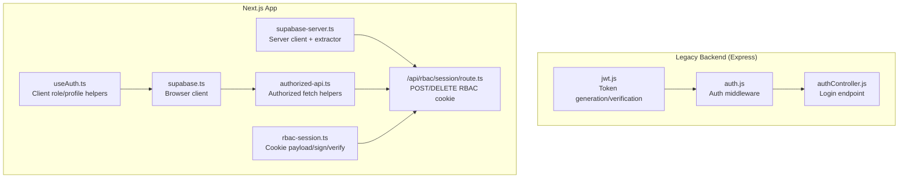
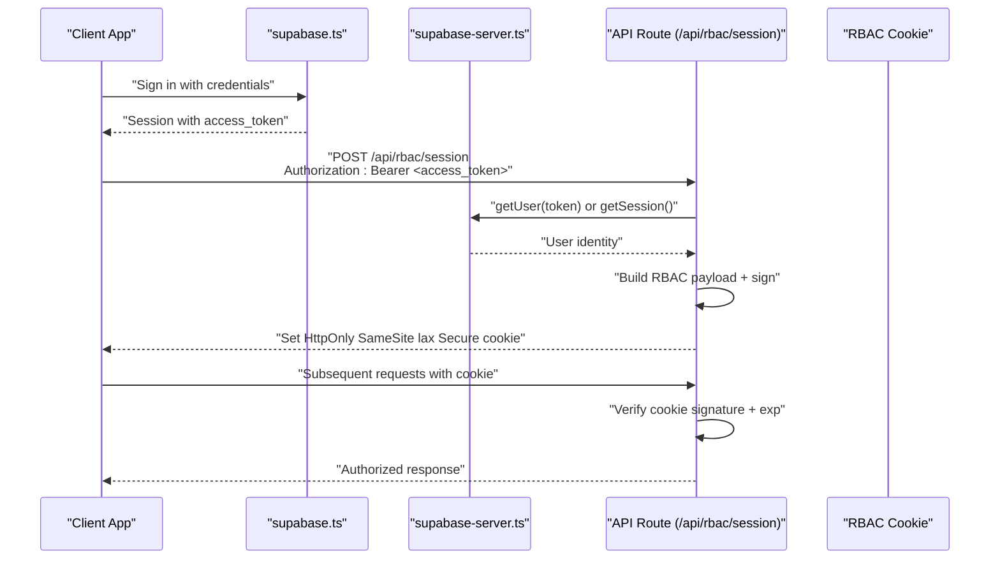
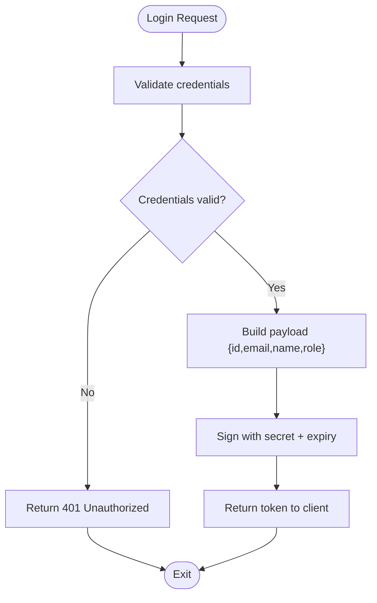
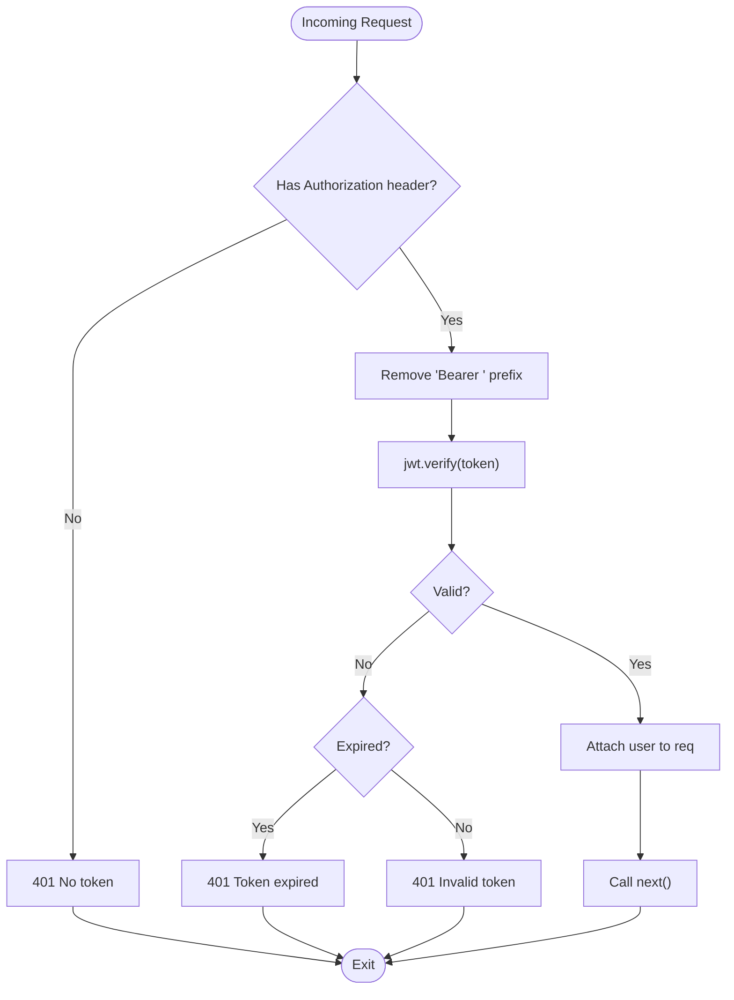
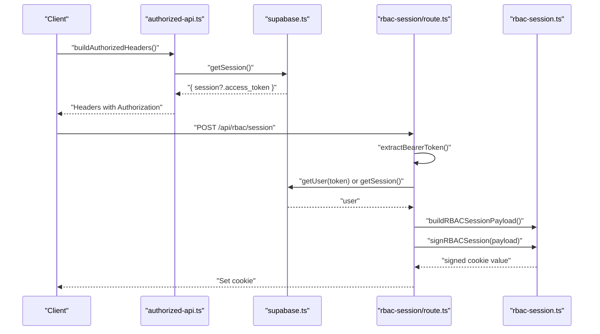
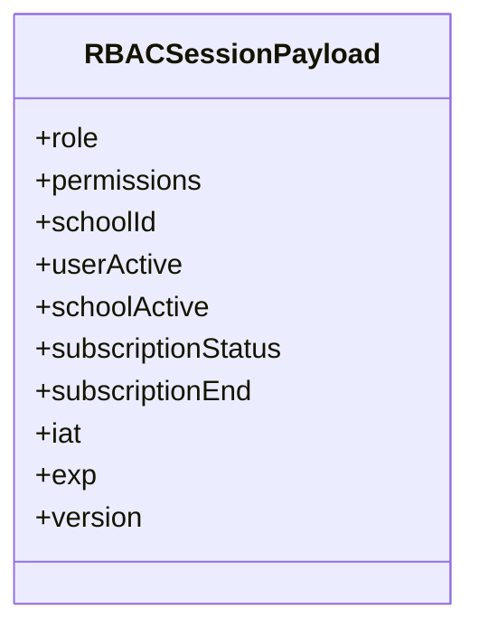
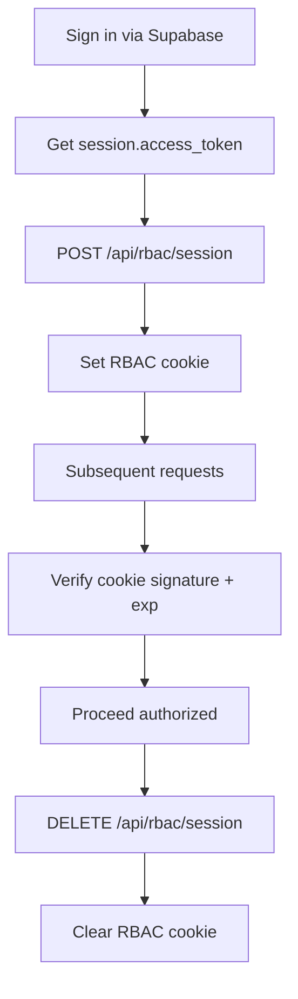
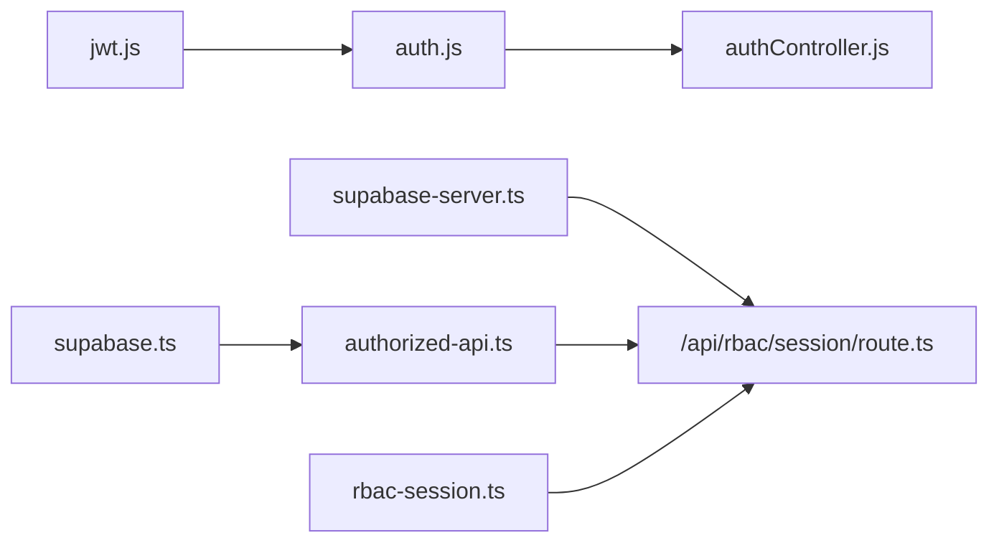

# JWT Implementation

<cite>
**Referenced Files in This Document**
- [jwt.js](file://00990090/school-accounting-system/backend/src/utils/jwt.js)
- [auth.js](file://00990090/school-accounting-system/backend/src/middleware/auth.js)
- [authController.js](file://00990090/school-accounting-system/backend/src/controllers/authController.js)
- [supabase.ts](file://lib/supabase.ts)
- [supabase-server.ts](file://lib/supabase-server.ts)
- [authorized-api.ts](file://lib/authorized-api.ts)
- [rbac-session.ts](file://lib/rbac-session.ts)
- [route.ts](file://app/api/rbac/session/route.ts)
- [useAuth.ts](file://hooks/useAuth.ts)
</cite>

## Table of Contents
1. [Introduction](#introduction)
2. [Project Structure](#project-structure)
3. [Core Components](#core-components)
4. [Architecture Overview](#architecture-overview)
5. [Detailed Component Analysis](#detailed-component-analysis)
6. [Dependency Analysis](#dependency-analysis)
7. [Performance Considerations](#performance-considerations)
8. [Troubleshooting Guide](#troubleshooting-guide)
9. [Conclusion](#conclusion)

## Introduction
This document explains the JWT-based authentication implementation in the project. It covers token generation, validation, and refresh strategies, and documents how the system integrates with Supabase authentication to obtain access tokens. It also details the RBAC session cookie lifecycle, payload structure, expiration handling, and error handling for expired or invalid tokens. Practical examples show how to use JWT in API requests, store tokens in cookies, and maintain session persistence across browser sessions. Security measures, header configuration, and client/server integration patterns are included.

## Project Structure
The JWT implementation spans two primary areas:
- Legacy Express-based JWT utilities and middleware for a separate backend module
- Next.js server-side Supabase integration with an RBAC session cookie for the main application

**Diagram sources**
- [jwt.js:1-42](file://00990090/school-accounting-system/backend/src/utils/jwt.js#L1-L42)
- [auth.js:1-88](file://00990090/school-accounting-system/backend/src/middleware/auth.js#L1-L88)
- [authController.js:1-141](file://00990090/school-accounting-system/backend/src/controllers/authController.js#L1-L141)
- [supabase.ts:1-22](file://lib/supabase.ts#L1-L22)
- [supabase-server.ts:1-75](file://lib/supabase-server.ts#L1-L75)
- [authorized-api.ts:1-49](file://lib/authorized-api.ts#L1-L49)
- [rbac-session.ts:1-153](file://lib/rbac-session.ts#L1-L153)
- [route.ts:1-155](file://app/api/rbac/session/route.ts#L1-L155)
- [useAuth.ts:1-22](file://hooks/useAuth.ts#L1-L22)

**Section sources**
- [jwt.js:1-42](file://00990090/school-accounting-system/backend/src/utils/jwt.js#L1-L42)
- [auth.js:1-88](file://00990090/school-accounting-system/backend/src/middleware/auth.js#L1-L88)
- [authController.js:1-141](file://00990090/school-accounting-system/backend/src/controllers/authController.js#L1-L141)
- [supabase.ts:1-22](file://lib/supabase.ts#L1-L22)
- [supabase-server.ts:1-75](file://lib/supabase-server.ts#L1-L75)
- [authorized-api.ts:1-49](file://lib/authorized-api.ts#L1-L49)
- [rbac-session.ts:1-153](file://lib/rbac-session.ts#L1-L153)
- [route.ts:1-155](file://app/api/rbac/session/route.ts#L1-L155)
- [useAuth.ts:1-22](file://hooks/useAuth.ts#L1-L22)

## Core Components
- JWT utilities (legacy Express backend):
  - Token generation with a configurable secret and expiration
  - Token verification with explicit error handling for expired or invalid tokens
- Authentication middleware:
  - Extracts Bearer token from Authorization header
  - Verifies token and attaches user payload to request
  - Returns standardized 401/403 responses
- Supabase integration (Next.js app):
  - Browser client initialization with environment variables
  - Server client with cookie persistence and token extraction
  - Authorized fetch helpers that inject Authorization headers using Supabase session access tokens
  - RBAC session cookie management via a dedicated API route
  - RBAC session payload signing/verification with HMAC-SHA256 and Base64Url encoding

**Section sources**
- [jwt.js:12-36](file://00990090/school-accounting-system/backend/src/utils/jwt.js#L12-L36)
- [auth.js:10-40](file://00990090/school-accounting-system/backend/src/middleware/auth.js#L10-L40)
- [supabase.ts:1-22](file://lib/supabase.ts#L1-L22)
- [supabase-server.ts:52-74](file://lib/supabase-server.ts#L52-L74)
- [authorized-api.ts:14-35](file://lib/authorized-api.ts#L14-L35)
- [rbac-session.ts:3-17](file://lib/rbac-session.ts#L3-L17)
- [rbac-session.ts:112-142](file://lib/rbac-session.ts#L112-L142)
- [route.ts:14-133](file://app/api/rbac/session/route.ts#L14-L133)

## Architecture Overview
The system supports two complementary authentication flows:
- Legacy Express backend: generates and verifies JWT tokens for internal APIs
- Next.js app: obtains access tokens from Supabase, signs an RBAC session cookie, and validates it server-side

**Diagram sources**
- [supabase.ts:1-22](file://lib/supabase.ts#L1-L22)
- [supabase-server.ts:52-74](file://lib/supabase-server.ts#L52-L74)
- [route.ts:14-133](file://app/api/rbac/session/route.ts#L14-L133)
- [rbac-session.ts:112-142](file://lib/rbac-session.ts#L112-L142)

## Detailed Component Analysis

### Legacy Express JWT Utilities
- Token generation:
  - Payload includes user identity and role
  - Signed with a server secret and configured expiration
- Token verification:
  - Validates signature and throws a standardized error for invalid/expired tokens

**Diagram sources**
- [authController.js:11-60](file://00990090/school-accounting-system/backend/src/controllers/authController.js#L11-L60)
- [jwt.js:12-23](file://00990090/school-accounting-system/backend/src/utils/jwt.js#L12-L23)

**Section sources**
- [jwt.js:12-23](file://00990090/school-accounting-system/backend/src/utils/jwt.js#L12-L23)
- [authController.js:11-60](file://00990090/school-accounting-system/backend/src/controllers/authController.js#L11-L60)

### Authentication Middleware (Legacy)
- Extracts Authorization header and ensures it starts with Bearer
- Verifies token and attaches decoded user to request
- Handles expired vs invalid token errors with appropriate HTTP status codes

**Diagram sources**
- [auth.js:10-40](file://00990090/school-accounting-system/backend/src/middleware/auth.js#L10-L40)

**Section sources**
- [auth.js:10-40](file://00990090/school-accounting-system/backend/src/middleware/auth.js#L10-L40)

### Supabase Integration and RBAC Session Cookie
- Browser client:
  - Initializes Supabase client with environment variables
  - Provides session retrieval for building Authorization headers
- Server client:
  - Creates a server-side Supabase client with cookie store integration
  - Extracts Bearer token from Authorization header for direct token validation
- Authorized fetch helpers:
  - Merge base headers with Authorization: Bearer <access_token>
  - Enforce cache and credentials policies
- RBAC session cookie:
  - POST endpoint initializes cookie after validating the access token
  - DELETE endpoint clears the cookie
  - Payload includes role, permissions, school and subscription state, plus iat/exp/version
  - Signing uses a dedicated secret with HMAC-SHA256 and Base64Url encoding

**Diagram sources**
- [authorized-api.ts:14-25](file://lib/authorized-api.ts#L14-L25)
- [supabase.ts:1-22](file://lib/supabase.ts#L1-L22)
- [route.ts:14-133](file://app/api/rbac/session/route.ts#L14-L133)
- [rbac-session.ts:56-64](file://lib/rbac-session.ts#L56-L64)
- [rbac-session.ts:112-119](file://lib/rbac-session.ts#L112-L119)

**Section sources**
- [supabase.ts:1-22](file://lib/supabase.ts#L1-L22)
- [supabase-server.ts:52-74](file://lib/supabase-server.ts#L52-L74)
- [authorized-api.ts:14-35](file://lib/authorized-api.ts#L14-L35)
- [rbac-session.ts:3-17](file://lib/rbac-session.ts#L3-L17)
- [rbac-session.ts:56-64](file://lib/rbac-session.ts#L56-L64)
- [rbac-session.ts:112-142](file://lib/rbac-session.ts#L112-L142)
- [route.ts:14-133](file://app/api/rbac/session/route.ts#L14-L133)

### RBAC Session Payload and Expiration
- Payload fields:
  - role, permissions, schoolId, userActive, schoolActive, subscriptionStatus, subscriptionEnd
  - iat, exp, version
- Expiration:
  - exp is set to current time + 8 hours
  - Verification rejects expired tokens
- Cookie attributes:
  - HttpOnly, SameSite lax, Secure in production, path "/", maxAge 8h

**Diagram sources**
- [rbac-session.ts:6-17](file://lib/rbac-session.ts#L6-L17)

**Section sources**
- [rbac-session.ts:56-64](file://lib/rbac-session.ts#L56-L64)
- [rbac-session.ts:131-139](file://lib/rbac-session.ts#L131-L139)
- [rbac-session.ts:144-152](file://lib/rbac-session.ts#L144-L152)

### Token Lifecycle and Refresh Strategies
- Access tokens:
  - Supabase manages access tokens; clients use them to call protected APIs
  - Authorized fetch helpers automatically attach Authorization headers
- RBAC session cookie:
  - Created upon successful login via Supabase
  - Used for server-side RBAC checks without re-validating the access token on every request
  - Can be refreshed by calling the POST endpoint again
  - Cleared via the DELETE endpoint during logout

**Diagram sources**
- [authorized-api.ts:14-25](file://lib/authorized-api.ts#L14-L25)
- [route.ts:14-133](file://app/api/rbac/session/route.ts#L14-L133)
- [route.ts:135-154](file://app/api/rbac/session/route.ts#L135-L154)

**Section sources**
- [authorized-api.ts:14-35](file://lib/authorized-api.ts#L14-L35)
- [route.ts:14-133](file://app/api/rbac/session/route.ts#L14-L133)
- [route.ts:135-154](file://app/api/rbac/session/route.ts#L135-L154)

### Practical Examples

- Using JWT in API requests (legacy Express):
  - After login, the client receives a token and includes it in the Authorization header for subsequent requests
  - The middleware verifies the token and authorizes access based on roles

- Using Supabase access tokens in API requests (Next.js):
  - Use the helper to build headers with Authorization: Bearer <access_token>
  - The helper merges headers and sets credentials/cache policies

- Storing and using RBAC session cookie:
  - On successful login, call the POST endpoint to set the cookie
  - Subsequent requests rely on the cookie for RBAC decisions
  - On logout, call the DELETE endpoint to clear the cookie

- Session persistence across browser sessions:
  - The cookie is HttpOnly and SameSite lax; Secure flag is enabled in production
  - The maxAge is 8 hours; adjust as needed for your security posture

**Section sources**
- [auth.js:10-40](file://00990090/school-accounting-system/backend/src/middleware/auth.js#L10-L40)
- [authController.js:11-60](file://00990090/school-accounting-system/backend/src/controllers/authController.js#L11-L60)
- [authorized-api.ts:14-35](file://lib/authorized-api.ts#L14-L35)
- [route.ts:14-133](file://app/api/rbac/session/route.ts#L14-L133)
- [rbac-session.ts:144-152](file://lib/rbac-session.ts#L144-L152)

### Token Security Measures
- Dedicated secrets:
  - RBAC cookie signing uses a dedicated secret; fallback to Supabase JWT secret is warned in development
- Cookie attributes:
  - HttpOnly prevents XSS exposure
  - SameSite lax balances CSRF protection and usability
  - Secure flag enabled in production
- Token verification:
  - HMAC-SHA256 with constant-time comparison to prevent timing attacks
  - Signature and expiration checks before accepting the payload

**Section sources**
- [rbac-session.ts:19-50](file://lib/rbac-session.ts#L19-L50)
- [rbac-session.ts:101-110](file://lib/rbac-session.ts#L101-L110)
- [rbac-session.ts:144-152](file://lib/rbac-session.ts#L144-L152)

### Header Configuration and Error Handling
- Authorization header:
  - Clients must send Authorization: Bearer <access_token> for protected endpoints
  - Helpers merge headers and ensure Content-Type is set when needed
- Error handling:
  - Middleware returns 401 for missing/invalid/expired tokens
  - RBAC route returns 401 for unauthorized and 404 for profile not found
  - Strict mode in RBAC session initialization throws on failures

**Section sources**
- [auth.js:14-40](file://00990090/school-accounting-system/backend/src/middleware/auth.js#L14-L40)
- [authorized-api.ts:14-25](file://lib/authorized-api.ts#L14-L25)
- [route.ts:28-30](file://app/api/rbac/session/route.ts#L28-L30)
- [route.ts:49-56](file://app/api/rbac/session/route.ts#L49-L56)
- [lib/auth.ts:319-331](file://lib/auth.ts#L319-L331)

## Dependency Analysis
- Legacy Express JWT:
  - jwt.js depends on a server secret and expiration configuration
  - auth.js depends on jwt.js and requires Authorization headers
  - authController.js depends on jwt.js and UserModel for login
- Next.js Supabase:
  - authorized-api.ts depends on supabase.ts for session access tokens
  - supabase-server.ts provides token extraction and server client creation
  - rbac-session.ts provides payload signing/verification and cookie options
  - route.ts orchestrates RBAC cookie creation and deletion

**Diagram sources**
- [jwt.js:1-42](file://00990090/school-accounting-system/backend/src/utils/jwt.js#L1-L42)
- [auth.js:1-88](file://00990090/school-accounting-system/backend/src/middleware/auth.js#L1-L88)
- [authController.js:1-141](file://00990090/school-accounting-system/backend/src/controllers/authController.js#L1-L141)
- [supabase.ts:1-22](file://lib/supabase.ts#L1-L22)
- [supabase-server.ts:1-75](file://lib/supabase-server.ts#L1-L75)
- [authorized-api.ts:1-49](file://lib/authorized-api.ts#L1-L49)
- [rbac-session.ts:1-153](file://lib/rbac-session.ts#L1-L153)
- [route.ts:1-155](file://app/api/rbac/session/route.ts#L1-L155)

**Section sources**
- [jwt.js:1-42](file://00990090/school-accounting-system/backend/src/utils/jwt.js#L1-L42)
- [auth.js:1-88](file://00990090/school-accounting-system/backend/src/middleware/auth.js#L1-L88)
- [authController.js:1-141](file://00990090/school-accounting-system/backend/src/controllers/authController.js#L1-L141)
- [supabase.ts:1-22](file://lib/supabase.ts#L1-L22)
- [supabase-server.ts:1-75](file://lib/supabase-server.ts#L1-L75)
- [authorized-api.ts:1-49](file://lib/authorized-api.ts#L1-L49)
- [rbac-session.ts:1-153](file://lib/rbac-session.ts#L1-L153)
- [route.ts:1-155](file://app/api/rbac/session/route.ts#L1-L155)

## Performance Considerations
- Token verification overhead:
  - Prefer server-side RBAC cookie verification for frequent requests to avoid repeated token validation
- Cookie size:
  - Keep RBAC payload minimal; it is Base64Url-encoded and signed
- Network latency:
  - Use the authorized fetch helpers to centralize header management and reduce duplication

## Troubleshooting Guide
- Missing Supabase environment variables:
  - Ensure NEXT_PUBLIC_SUPABASE_URL and NEXT_PUBLIC_SUPABASE_ANON_KEY are set
- RBAC cookie secret not configured:
  - Set RBAC_COOKIE_SECRET; fallbacks are warned in development
- Unauthorized responses:
  - Verify Authorization header format and that the access token is present
  - Ensure the RBAC cookie is set and not expired
- Token expired errors:
  - Re-authenticate to obtain a fresh access token
  - For RBAC cookie, refresh via the POST endpoint after re-authentication

**Section sources**
- [supabase.ts:8-19](file://lib/supabase.ts#L8-L19)
- [rbac-session.ts:26-31](file://lib/rbac-session.ts#L26-L31)
- [rbac-session.ts:44-49](file://lib/rbac-session.ts#L44-L49)
- [route.ts:28-30](file://app/api/rbac/session/route.ts#L28-L30)
- [auth.js:29-39](file://00990090/school-accounting-system/backend/src/middleware/auth.js#L29-L39)

## Conclusion
The project implements authentication across two layers: a legacy Express JWT stack for internal APIs and a modern Next.js Supabase-based RBAC session cookie for the main application. Supabase handles access tokens, while the RBAC cookie encapsulates role and permission state server-side. Proper header configuration, strict error handling, and secure cookie attributes ensure robust and secure authentication. The provided helpers and routes streamline token usage, session persistence, and lifecycle management.