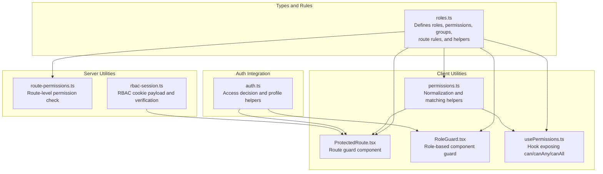
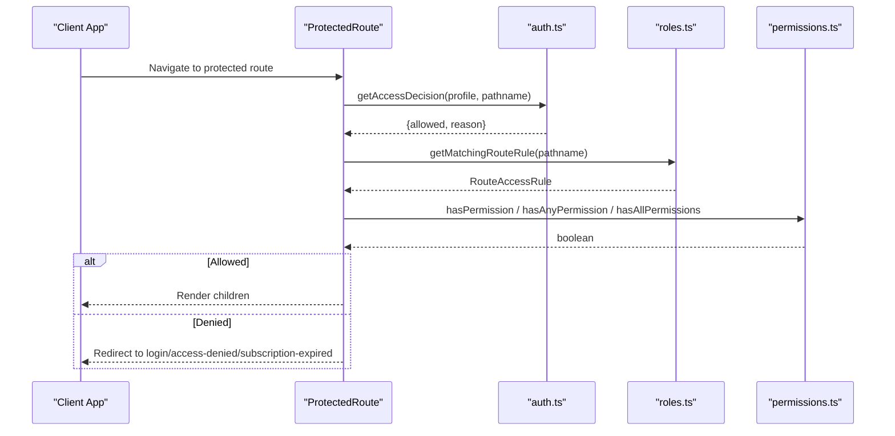
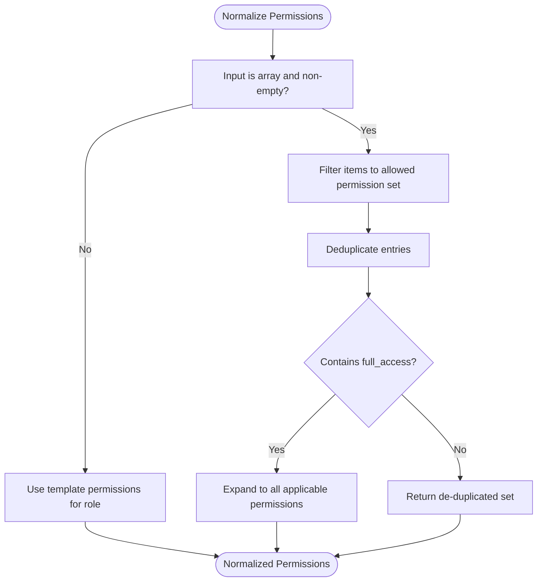
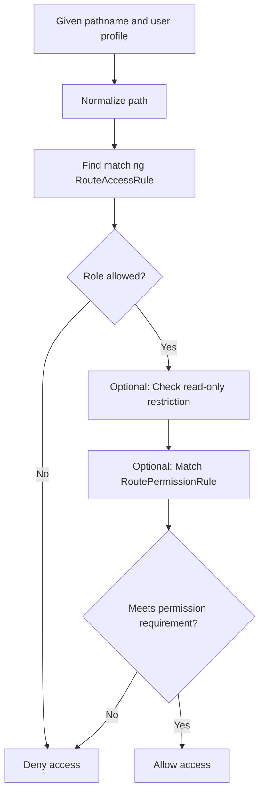
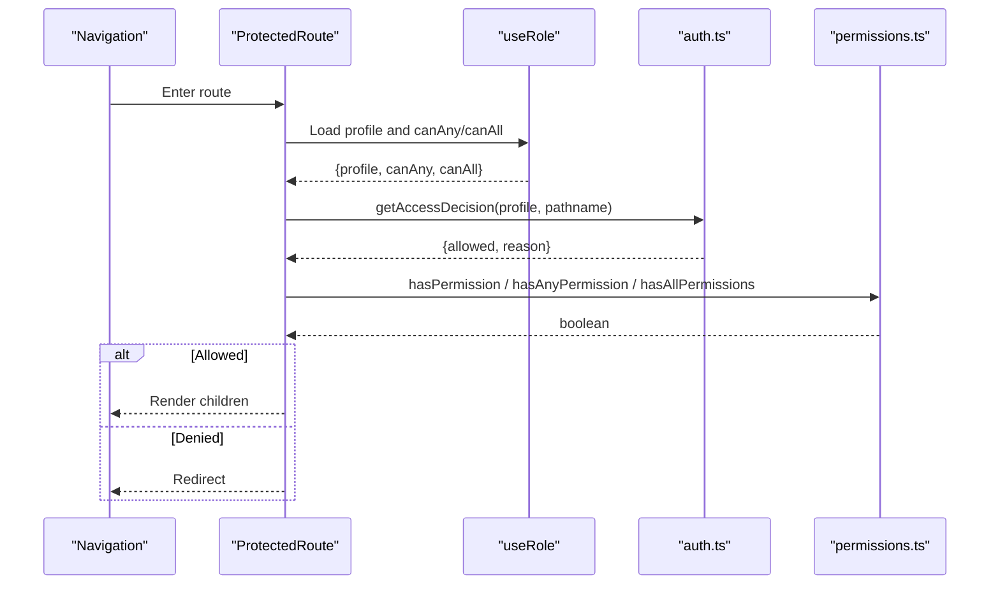
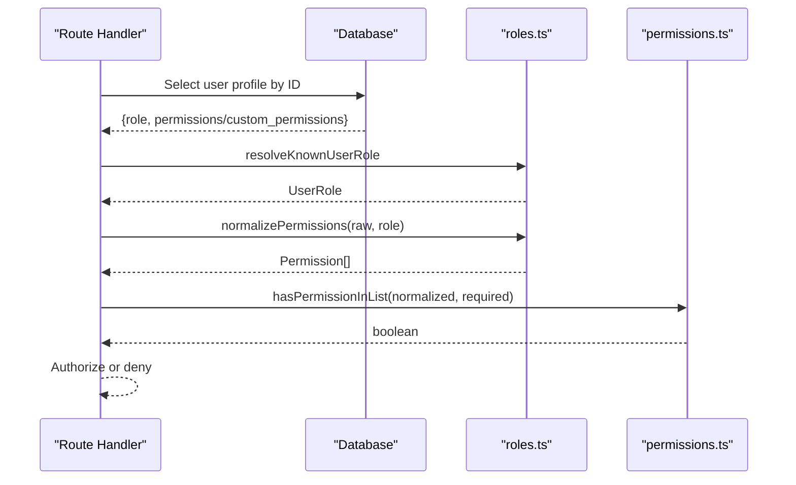
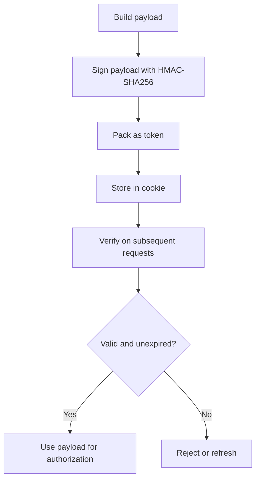
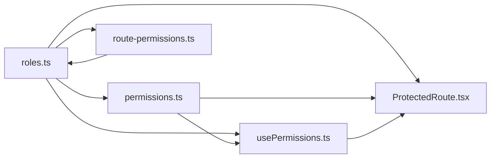

# Permission Validation

<cite>
**Referenced Files in This Document**
- [route-permissions.ts](file://lib/route-permissions.ts)
- [permissions.ts](file://school-saas-next/src/lib/permissions.ts)
- [roles.ts](file://types/roles.ts)
- [ProtectedRoute.tsx](file://components/ProtectedRoute.tsx)
- [RoleGuard.tsx](file://components/RoleGuard.tsx)
- [usePermissions.ts](file://school-saas-next/src/hooks/usePermissions.ts)
- [rbac-session.ts](file://lib/rbac-session.ts)
- [auth.ts](file://lib/auth.ts)
</cite>

## Table of Contents
1. [Introduction](#introduction)
2. [Project Structure](#project-structure)
3. [Core Components](#core-components)
4. [Architecture Overview](#architecture-overview)
5. [Detailed Component Analysis](#detailed-component-analysis)
6. [Dependency Analysis](#dependency-analysis)
7. [Performance Considerations](#performance-considerations)
8. [Troubleshooting Guide](#troubleshooting-guide)
9. [Conclusion](#conclusion)
10. [Appendices](#appendices)

## Introduction
This document explains the permission validation system used across the application. It covers how permissions are defined, normalized, matched, and enforced at runtime. It documents the core functions for permission checks (hasPermission, hasAnyPermission, hasAllPermissions, and hasPermissionInList), route-based access control, path-level rules, read-only access determination, and dynamic evaluation of permissions. Practical examples show how to apply permission checks in route guards, component rendering, and API endpoint authorization. Guidance is included for implementing custom permission checks and debugging permission-related issues.

## Project Structure
The permission system spans several layers:
- Types and constants define roles, permissions, and rules.
- Utility libraries provide permission normalization and matching.
- Route-level helpers enforce access based on path prefixes and roles.
- Client-side guards protect pages and components.
- Hooks expose permission APIs to React components.
- Optional RBAC session cookies carry scoped permissions and metadata.

**Diagram sources**
- [roles.ts:1-432](file://types/roles.ts#L1-L432)
- [permissions.ts:1-103](file://school-saas-next/src/lib/permissions.ts#L1-L103)
- [ProtectedRoute.tsx:1-72](file://components/ProtectedRoute.tsx#L1-L72)
- [RoleGuard.tsx:1-18](file://components/RoleGuard.tsx#L1-L18)
- [usePermissions.ts:1-47](file://school-saas-next/src/hooks/usePermissions.ts#L1-L47)
- [route-permissions.ts:1-42](file://lib/route-permissions.ts#L1-L42)
- [rbac-session.ts:1-153](file://lib/rbac-session.ts#L1-L153)
- [auth.ts](file://lib/auth.ts)

**Section sources**
- [roles.ts:1-432](file://types/roles.ts#L1-L432)
- [permissions.ts:1-103](file://school-saas-next/src/lib/permissions.ts#L1-L103)
- [ProtectedRoute.tsx:1-72](file://components/ProtectedRoute.tsx#L1-L72)
- [RoleGuard.tsx:1-18](file://components/RoleGuard.tsx#L1-L18)
- [usePermissions.ts:1-47](file://school-saas-next/src/hooks/usePermissions.ts#L1-L47)
- [route-permissions.ts:1-42](file://lib/route-permissions.ts#L1-L42)
- [rbac-session.ts:1-153](file://lib/rbac-session.ts#L1-L153)
- [auth.ts](file://lib/auth.ts)

## Core Components
- Permission constants and normalization:
  - ALL_PERMISSIONS enumerates supported permissions.
  - normalizePermissions filters and deduplicates incoming permission lists against allowed sets and applies full_access semantics.
- Matching functions:
  - hasPermissionInList checks a single permission against a list.
  - hasAnyPermission checks if any of the required permissions is present.
  - hasAllPermissions checks if all required permissions are present.
- Role and template permissions:
  - ROLE_PERMISSIONS defines baseline permissions per role.
  - buildTemplatePermissions derives default permissions for a role.
- Route-level rules:
  - ROUTE_ACCESS_RULES map path prefixes to allowed roles and optional read-only roles and activation requirements.
  - ROUTE_PERMISSION_RULES map path prefixes to required permissions and whether all are needed.
- Client-side guards:
  - ProtectedRoute enforces role and permission checks at the route level.
  - RoleGuard enforces role-based visibility inside components.
  - usePermissions exposes can/canAny/canAll and canAccess for declarative checks.

**Section sources**
- [roles.ts:5-177](file://types/roles.ts#L5-L177)
- [permissions.ts:5-103](file://school-saas-next/src/lib/permissions.ts#L5-L103)
- [ProtectedRoute.tsx:33-71](file://components/ProtectedRoute.tsx#L33-L71)
- [RoleGuard.tsx:13-17](file://components/RoleGuard.tsx#L13-L17)
- [usePermissions.ts:14-46](file://school-saas-next/src/hooks/usePermissions.ts#L14-L46)

## Architecture Overview
The permission system combines:
- Static route rules for coarse-grained access control.
- Dynamic permission evaluation for fine-grained actions.
- Client-side guards for UI protection and navigation.
- Optional server-side route-level checks for API endpoints.

**Diagram sources**
- [ProtectedRoute.tsx:33-71](file://components/ProtectedRoute.tsx#L33-L71)
- [auth.ts](file://lib/auth.ts)
- [roles.ts:404-426](file://types/roles.ts#L404-L426)
- [permissions.ts:84-102](file://school-saas-next/src/lib/permissions.ts#L84-L102)

## Detailed Component Analysis

### Permission Normalization and Matching
- Normalization:
  - normalizePermissions ensures only allowed permissions are retained, deduplicates entries, and expands full_access to include all applicable permissions.
- Matching:
  - hasPermissionInList returns true if full_access is present or the target permission exists.
  - hasAnyPermission returns true if full_access is present or any member of the required array is present.
  - hasAllPermissions returns true if full_access is present or all members of the required array are present.

**Diagram sources**
- [roles.ts:131-151](file://types/roles.ts#L131-L151)

**Section sources**
- [roles.ts:131-151](file://types/roles.ts#L131-L151)
- [permissions.ts:79-102](file://school-saas-next/src/lib/permissions.ts#L79-L102)

### Route-Based Permission Validation
- Route access rules:
  - getMatchingRouteRule selects the most specific pathPrefix rule for a given pathname.
  - isRoleAllowedForPath determines if a role can access a path.
  - isPathReadOnlyForRole determines if a role has read-only access to a path.
- Route permission rules:
  - getMatchingPermissionRule selects the most specific pathPrefix rule requiring permissions.
  - canAccess evaluates whether a user’s role and permissions satisfy the rule, optionally requiring all permissions.

**Diagram sources**
- [roles.ts:404-426](file://types/roles.ts#L404-L426)
- [usePermissions.ts:22-36](file://school-saas-next/src/hooks/usePermissions.ts#L22-L36)

**Section sources**
- [roles.ts:198-268](file://types/roles.ts#L198-L268)
- [usePermissions.ts:22-36](file://school-saas-next/src/hooks/usePermissions.ts#L22-L36)

### Path Access Control and Read-Only Determination
- Path access control:
  - ROUTE_ACCESS_RULES define which roles can enter a path and whether an active school is required.
- Read-only determination:
  - readOnlyRoles in RouteAccessRule restricts a role to read-only access for that path.

Practical usage:
- Use isRoleAllowedForPath to gate navigation links.
- Use isPathReadOnlyForRole to adjust UI affordances (e.g., hide edit controls).

**Section sources**
- [roles.ts:198-268](file://types/roles.ts#L198-L268)
- [roles.ts:422-426](file://types/roles.ts#L422-L426)

### Client-Side Guards: ProtectedRoute and RoleGuard
- ProtectedRoute:
  - Enforces role and permission checks on navigation.
  - Uses getAccessDecision to evaluate general access constraints.
  - Applies hasPermission, hasAnyPermission, or hasAllPermissions depending on props.
  - Redirects to appropriate pages based on reason (unauthenticated, forbidden, inactive subscription).
- RoleGuard:
  - Simple role-based visibility guard for component rendering.

**Diagram sources**
- [ProtectedRoute.tsx:33-71](file://components/ProtectedRoute.tsx#L33-L71)
- [auth.ts](file://lib/auth.ts)
- [permissions.ts:84-102](file://school-saas-next/src/lib/permissions.ts#L84-L102)

**Section sources**
- [ProtectedRoute.tsx:33-71](file://components/ProtectedRoute.tsx#L33-L71)
- [RoleGuard.tsx:13-17](file://components/RoleGuard.tsx#L13-L17)

### Hook-Based Permission Evaluation: usePermissions
- Exposes:
  - can(permission): checks a single permission.
  - canAny(permissions[]): checks any permission.
  - canAll(permissions[]): checks all permissions.
  - canAccess(options): composite check combining roles and permissions with requireAll flag.
- Useful for:
  - Conditional rendering of buttons, menus, and sections.
  - Declarative authorization in components.

**Section sources**
- [usePermissions.ts:14-46](file://school-saas-next/src/hooks/usePermissions.ts#L14-L46)

### Server-Side Route-Level Permission Check
- routeUserHasPermission:
  - Loads user profile from the database.
  - Resolves role and normalizes permissions.
  - Checks if the user has the required permission via hasPermissionInList.

**Diagram sources**
- [route-permissions.ts:11-41](file://lib/route-permissions.ts#L11-L41)
- [roles.ts:38-41](file://types/roles.ts#L38-L41)
- [roles.ts:131-151](file://types/roles.ts#L131-L151)
- [permissions.ts:84-86](file://school-saas-next/src/lib/permissions.ts#L84-L86)

**Section sources**
- [route-permissions.ts:11-41](file://lib/route-permissions.ts#L11-L41)

### RBAC Session Cookie (Optional)
- RBACSessionPayload carries scoped permissions and metadata.
- Signing and verification use HMAC-SHA256 with a dedicated secret.
- Cookie options enforce security and lifetime.

**Diagram sources**
- [rbac-session.ts:56-142](file://lib/rbac-session.ts#L56-L142)

**Section sources**
- [rbac-session.ts:6-17](file://lib/rbac-session.ts#L6-L17)
- [rbac-session.ts:112-142](file://lib/rbac-session.ts#L112-L142)

## Dependency Analysis
- Cohesion:
  - roles.ts centralizes all permission-related constants, templates, and rules.
  - permissions.ts encapsulates normalization and matching logic.
  - ProtectedRoute.tsx and RoleGuard.tsx depend on roles.ts and permissions.ts for enforcement.
  - usePermissions.ts depends on permissions.ts and auth state.
- Coupling:
  - route-permissions.ts depends on roles.ts for normalization and lookup.
  - RBAC session utilities are independent but can complement runtime checks.
- External dependencies:
  - Supabase client usage in route-permissions.ts for profile retrieval.

**Diagram sources**
- [roles.ts:1-432](file://types/roles.ts#L1-L432)
- [permissions.ts:1-103](file://school-saas-next/src/lib/permissions.ts#L1-L103)
- [ProtectedRoute.tsx:1-72](file://components/ProtectedRoute.tsx#L1-L72)
- [usePermissions.ts:1-47](file://school-saas-next/src/hooks/usePermissions.ts#L1-L47)
- [route-permissions.ts:1-42](file://lib/route-permissions.ts#L1-L42)

**Section sources**
- [roles.ts:1-432](file://types/roles.ts#L1-L432)
- [permissions.ts:1-103](file://school-saas-next/src/lib/permissions.ts#L1-L103)
- [ProtectedRoute.tsx:1-72](file://components/ProtectedRoute.tsx#L1-L72)
- [usePermissions.ts:1-47](file://school-saas-next/src/hooks/usePermissions.ts#L1-L47)
- [route-permissions.ts:1-42](file://lib/route-permissions.ts#L1-L42)

## Performance Considerations
- Prefer hasAnyPermission and hasAllPermissions over manual loops for readability and consistency.
- Normalize permissions once per user session to avoid repeated filtering.
- Use getMatchingRouteRule/getMatchingPermissionRule to minimize repeated rule scans; cache results if evaluating many paths.
- Avoid excessive database reads by caching normalized permissions in memory or cookies (RBAC session).

## Troubleshooting Guide
Common issues and resolutions:
- Unexpected denial:
  - Verify the user’s role and permissions align with ROUTE_ACCESS_RULES and ROUTE_PERMISSION_RULES.
  - Check for full_access expansion if custom permissions include full_access.
- Read-only confusion:
  - Confirm whether readOnlyRoles is set for the path and whether the user’s role is included.
- Route guard not redirecting:
  - Ensure getAccessDecision returns allowed=false and ProtectedRoute receives a blocked reason.
- Server-side route check failing:
  - Confirm the user profile contains either permissions or custom_permissions and that normalization yields a non-empty set.

Debugging tips:
- Log normalized permissions after normalization.
- Compare normalized set against ALL_PERMISSIONS and ROLE_PERMISSIONS.
- Inspect route rule matching by printing matched pathPrefix and required permissions.

**Section sources**
- [roles.ts:131-151](file://types/roles.ts#L131-L151)
- [roles.ts:198-268](file://types/roles.ts#L198-L268)
- [ProtectedRoute.tsx:18-31](file://components/ProtectedRoute.tsx#L18-L31)
- [route-permissions.ts:16-41](file://lib/route-permissions.ts#L16-L41)

## Conclusion
The permission system combines static route rules with dynamic permission evaluation to provide robust, maintainable access control. By leveraging normalization, matching helpers, and client/server guards, teams can implement consistent authorization across routes, components, and API endpoints. Extending the system involves adding new permissions, updating templates and rules, and integrating RBAC sessions where appropriate.

## Appendices

### Practical Examples

- Route guards:
  - Single permission: wrap a page with ProtectedRoute and pass permission="view_students".
  - Multiple permissions with OR: pass permissions={["view_payments", "view_students"]} and omit requireAllPermissions to default to OR.
  - Multiple permissions with AND: pass permissions={...} and set requireAllPermissions=true.
  - Role gating: pass roles={["admin", "super_admin"]} to RoleGuard for component-level visibility.

- Component rendering:
  - Use usePermissions().can("view_payments") to conditionally render a button.
  - Use usePermissions().canAny(["add_payments", "edit_payments"]) for flexible capability checks.
  - Use usePermissions().canAll(["delete_payments", "manage_salaries"]) for strict multi-permission checks.

- API endpoint authorization:
  - On the server, call routeUserHasPermission(actorSupabase, userId, "view_students") to authorize a route handler.

- Read-only access:
  - Use isPathReadOnlyForRole(profile.role, pathname) to disable editing controls for specific roles on a path.

- Custom permission handling:
  - Extend ALL_PERMISSIONS and ROLE_PERMISSIONS in roles.ts.
  - Add new route rules in ROUTE_PERMISSION_RULES for new paths.
  - Use RBAC session cookies to propagate scoped permissions and metadata.

**Section sources**
- [ProtectedRoute.tsx:33-71](file://components/ProtectedRoute.tsx#L33-L71)
- [RoleGuard.tsx:13-17](file://components/RoleGuard.tsx#L13-L17)
- [usePermissions.ts:14-46](file://school-saas-next/src/hooks/usePermissions.ts#L14-L46)
- [route-permissions.ts:11-41](file://lib/route-permissions.ts#L11-L41)
- [roles.ts:5-177](file://types/roles.ts#L5-L177)
- [roles.ts:198-268](file://types/roles.ts#L198-L268)
- [rbac-session.ts:56-142](file://lib/rbac-session.ts#L56-L142)