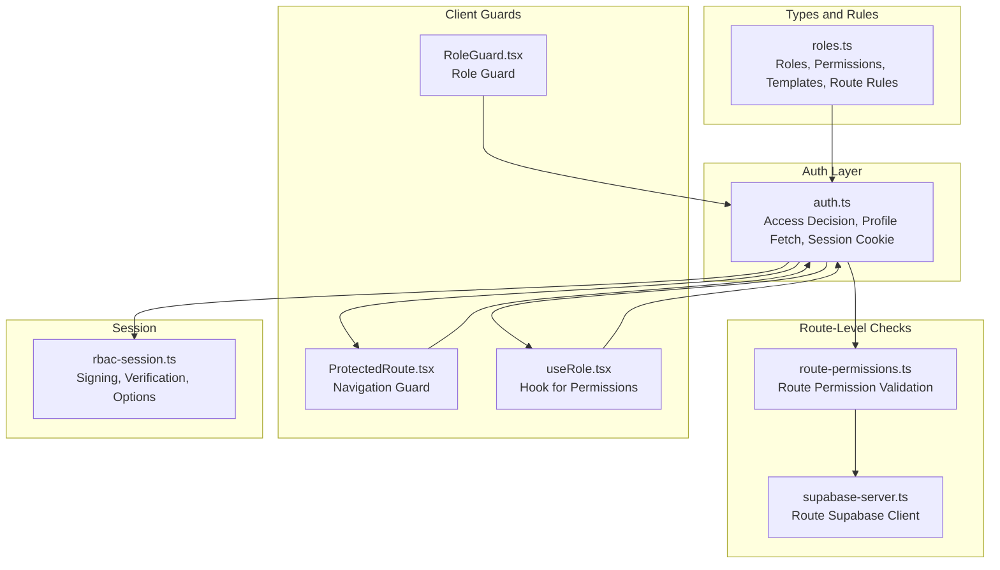
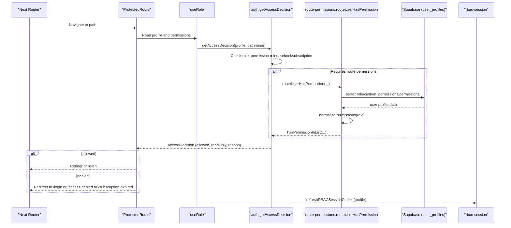
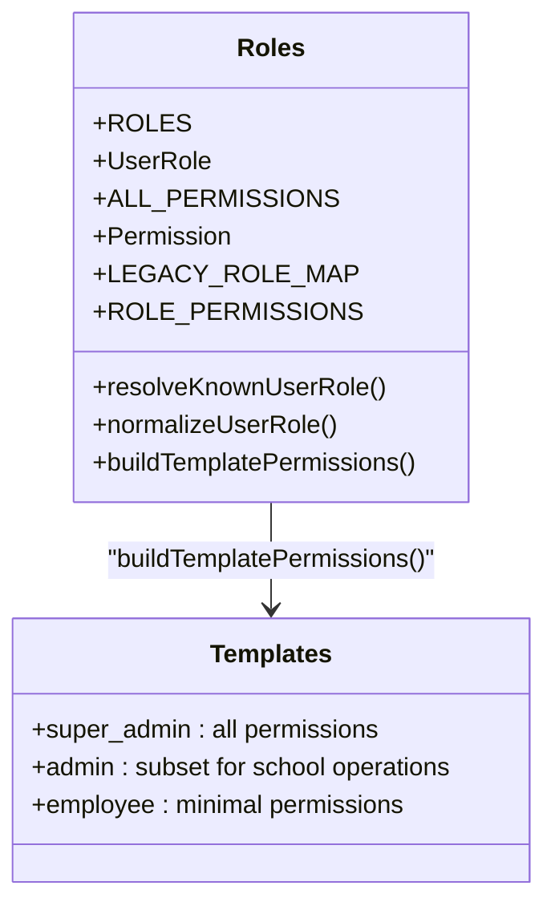
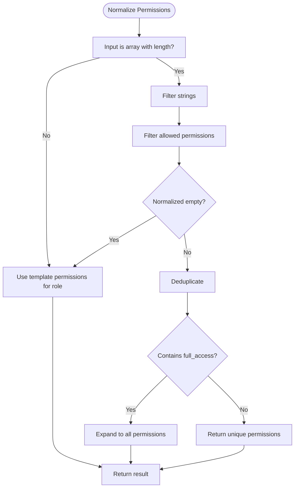
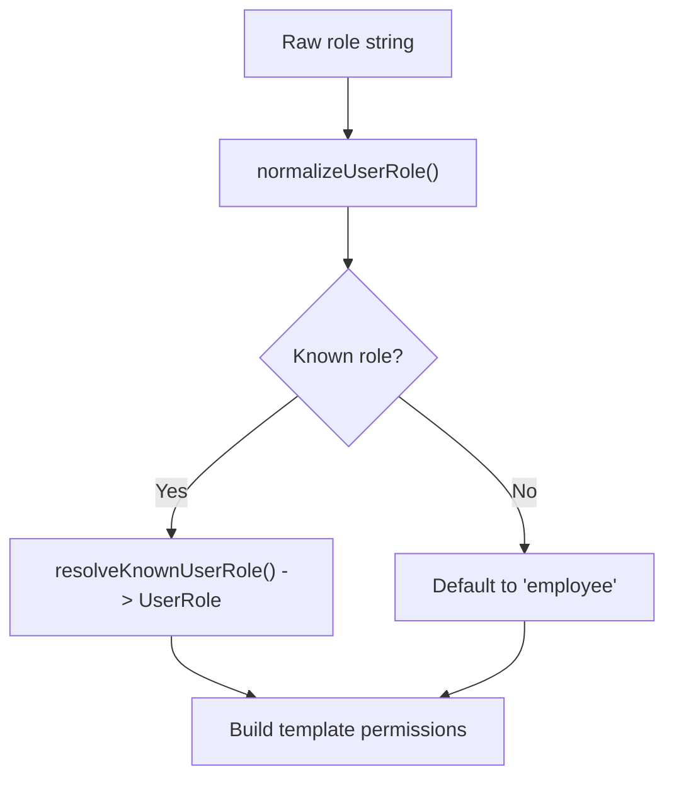
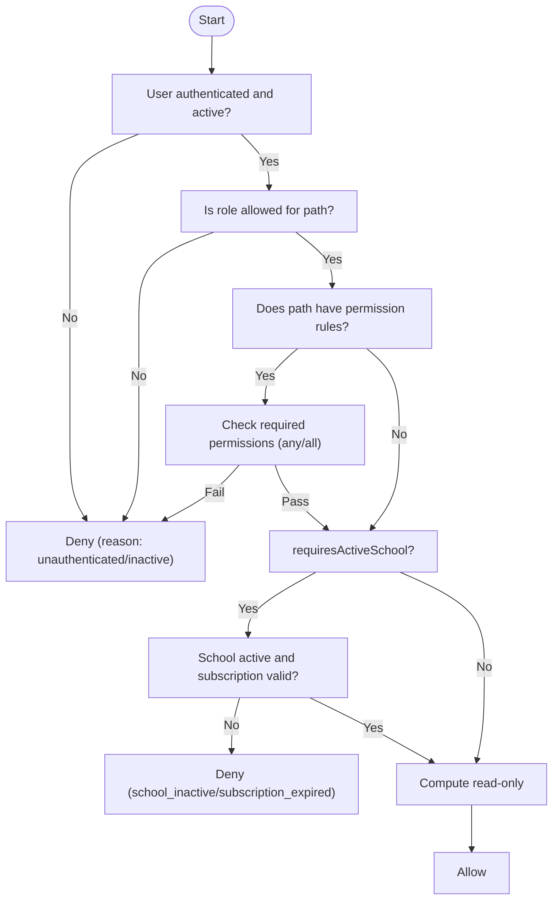
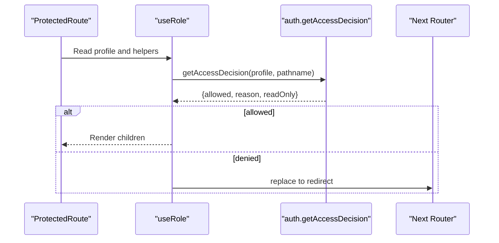
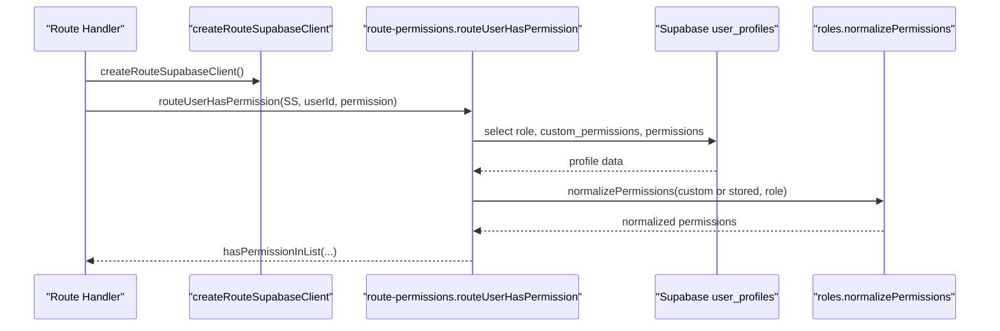
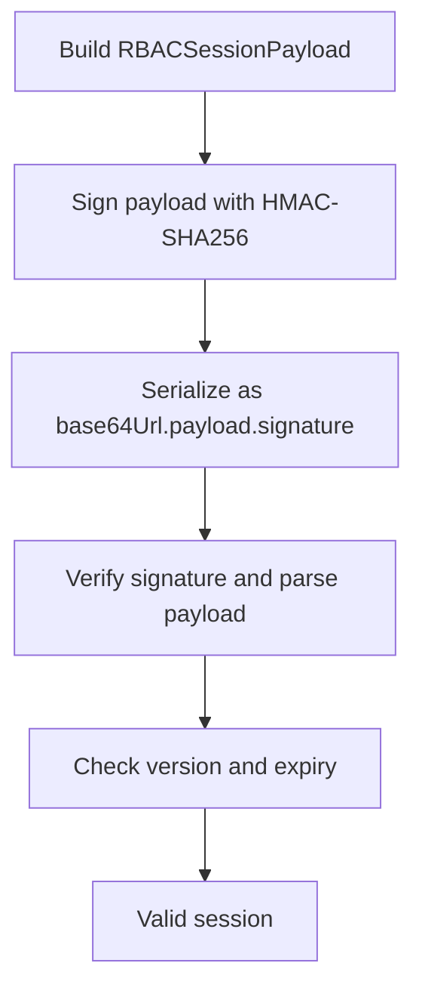
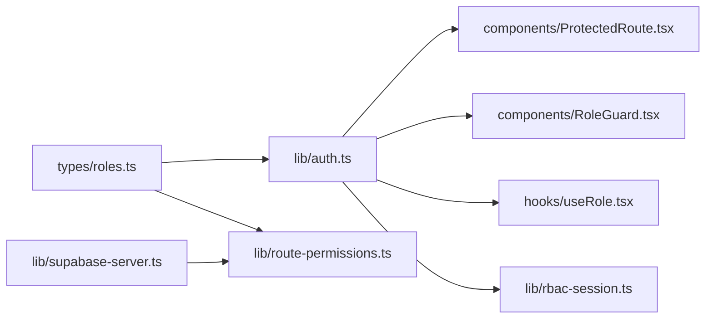

# RBAC Architecture

<cite>
**Referenced Files in This Document**
- [roles.ts](file://types/roles.ts)
- [auth.ts](file://lib/auth.ts)
- [route-permissions.ts](file://lib/route-permissions.ts)
- [rbac-session.ts](file://lib/rbac-session.ts)
- [ProtectedRoute.tsx](file://components/ProtectedRoute.tsx)
- [RoleGuard.tsx](file://components/RoleGuard.tsx)
- [useRole.tsx](file://hooks/useRole.tsx)
- [supabase-server.ts](file://lib/supabase-server.ts)
</cite>

## Table of Contents
1. [Introduction](#introduction)
2. [Project Structure](#project-structure)
3. [Core Components](#core-components)
4. [Architecture Overview](#architecture-overview)
5. [Detailed Component Analysis](#detailed-component-analysis)
6. [Dependency Analysis](#dependency-analysis)
7. [Performance Considerations](#performance-considerations)
8. [Troubleshooting Guide](#troubleshooting-guide)
9. [Conclusion](#conclusion)

## Introduction
This document explains the Role-Based Access Control (RBAC) architecture used by the application. It covers the role hierarchy, permission system, role resolution, permission normalization, dynamic permission assignment, permission validation, route-based access control, and read-only access determination. It also documents how user roles, permissions, and system functionality relate to each other, with practical examples and decision trees.

## Project Structure
The RBAC implementation spans several layers:
- Types and constants define roles, permissions, templates, and route rules.
- Authentication utilities compute access decisions and manage user profiles.
- Route-level helpers validate permissions against routes.
- Client-side guards enforce access during navigation.
- Session management signs and verifies RBAC cookies.

**Diagram sources**
- [roles.ts:1-432](file://types/roles.ts#L1-L432)
- [auth.ts:1-341](file://lib/auth.ts#L1-L341)
- [route-permissions.ts:1-42](file://lib/route-permissions.ts#L1-L42)
- [supabase-server.ts:1-75](file://lib/supabase-server.ts#L1-L75)
- [ProtectedRoute.tsx:1-72](file://components/ProtectedRoute.tsx#L1-L72)
- [RoleGuard.tsx:1-18](file://components/RoleGuard.tsx#L1-L18)
- [useRole.tsx:1-177](file://hooks/useRole.tsx#L1-L177)
- [rbac-session.ts:1-153](file://lib/rbac-session.ts#L1-L153)

**Section sources**
- [roles.ts:1-432](file://types/roles.ts#L1-L432)
- [auth.ts:1-341](file://lib/auth.ts#L1-L341)
- [route-permissions.ts:1-42](file://lib/route-permissions.ts#L1-L42)
- [rbac-session.ts:1-153](file://lib/rbac-session.ts#L1-L153)
- [ProtectedRoute.tsx:1-72](file://components/ProtectedRoute.tsx#L1-L72)
- [RoleGuard.tsx:1-18](file://components/RoleGuard.tsx#L1-L18)
- [useRole.tsx:1-177](file://hooks/useRole.tsx#L1-L177)
- [supabase-server.ts:1-75](file://lib/supabase-server.ts#L1-L75)

## Core Components
- Roles and Permissions
  - Roles: super_admin, admin, employee.
  - Permissions: a curated set covering students, payments, salaries, branches, teacher activity, fee notifications, and administrative capabilities.
  - Templates: role-specific permission sets used as defaults.
  - Normalization: filters invalid permissions, deduplicates, and expands full_access into the full set.
- Access Rules
  - RouteAccessRule: pathPrefix, allowed roles, optional read-only roles, and active-school requirement.
  - RoutePermissionRule: pathPrefix, required permissions, and whether all are required.
- Decision Engine
  - AccessDecision: allowed flag, reason, and read-only flag computed per route.
- Session Management
  - RBAC cookie payload, signing, verification, and options.

**Section sources**
- [roles.ts:1-432](file://types/roles.ts#L1-L432)
- [auth.ts:47-145](file://lib/auth.ts#L47-L145)
- [rbac-session.ts:6-153](file://lib/rbac-session.ts#L6-L153)

## Architecture Overview
The RBAC pipeline integrates client-side guards, server-side route checks, and session signing:
- Client-side navigation is guarded by ProtectedRoute and RoleGuard.
- Access decisions are computed via getAccessDecision(profile, pathname).
- Route-level permission checks use routeUserHasPermission for dynamic validation.
- RBAC cookies are signed and verified to protect session integrity.

**Diagram sources**
- [ProtectedRoute.tsx:33-71](file://components/ProtectedRoute.tsx#L33-L71)
- [useRole.tsx:41-84](file://hooks/useRole.tsx#L41-L84)
- [auth.ts:106-145](file://lib/auth.ts#L106-L145)
- [route-permissions.ts:11-41](file://lib/route-permissions.ts#L11-L41)
- [rbac-session.ts:112-152](file://lib/rbac-session.ts#L112-L152)

## Detailed Component Analysis

### Role Hierarchy and Templates
- Roles: super_admin, admin, employee.
- Template permissions:
  - super_admin: all permissions.
  - admin: a subset focused on students, payments, salaries, branches, teacher activity, and fee notifications.
  - employee: a minimal subset focused on viewing and adding students/payments.
- Legacy role mapping resolves common legacy role names to built-in roles.

**Diagram sources**
- [roles.ts:1-129](file://types/roles.ts#L1-L129)

**Section sources**
- [roles.ts:1-129](file://types/roles.ts#L1-L129)

### Permission System: Normalization and Dynamic Assignment
- Normalization:
  - Filters out invalid permission strings.
  - Deduplicates entries.
  - Expands full_access to include all permissions except itself.
- Dynamic assignment:
  - If a user has custom_permissions, those are used; otherwise, template permissions are normalized.
- Permission checks:
  - Single permission: hasPermissionInList.
  - Any/All: hasAnyPermission and hasAllPermissions.

**Diagram sources**
- [roles.ts:131-151](file://types/roles.ts#L131-L151)

**Section sources**
- [roles.ts:131-177](file://types/roles.ts#L131-L177)
- [auth.ts:205-212](file://lib/auth.ts#L205-L212)

### Role Resolution and Inheritance
- resolveKnownUserRole maps legacy role names to built-in roles.
- normalizeUserRole falls back to employee if resolution fails.
- Inheritance model:
  - There is no explicit inheritance chain; permissions are role-based templates with optional overrides.

**Diagram sources**
- [roles.ts:38-45](file://types/roles.ts#L38-L45)

**Section sources**
- [roles.ts:29-45](file://types/roles.ts#L29-L45)

### Permission Validation Logic
- Route-access rules:
  - Allowed roles per pathPrefix.
  - Optional read-only roles list.
  - requiresActiveSchool flag for non-super-admin roles.
- Permission rules:
  - Define required permissions per pathPrefix.
  - Optionally requireAll permissions.
- Decision engine:
  - Unauthenticated/inactive users are blocked.
  - Role check failure leads to forbidden.
  - Permission rule mismatch leads to forbidden.
  - Active-school checks evaluate school and subscription status.
  - Returns read-only flag based on role and path.

**Diagram sources**
- [auth.ts:106-145](file://lib/auth.ts#L106-L145)
- [roles.ts:198-268](file://types/roles.ts#L198-L268)

**Section sources**
- [auth.ts:106-145](file://lib/auth.ts#L106-L145)
- [roles.ts:183-274](file://types/roles.ts#L183-L274)

### Route-Based Access Control and Read-Only Determination
- RouteAccessRule:
  - pathPrefix: matches routes.
  - roles: allowed roles.
  - readOnlyRoles: roles treated as read-only for the path.
  - requiresActiveSchool: restricts access for non-super-admins.
- RoutePermissionRule:
  - pathPrefix: target route.
  - permissions: required permissions.
  - requireAll: whether all permissions are required.
- Read-only determination:
  - isPathReadOnlyForRole(profile.role, pathname) returns true if the role is in readOnlyRoles for the matched rule.

**Section sources**
- [roles.ts:183-274](file://types/roles.ts#L183-L274)

### Client-Side Guards and Hook Behavior
- ProtectedRoute:
  - Computes access via getAccessDecision.
  - Supports role, single permission, or multiple permissions (any/all).
  - Redirects based on reason: login, subscription-expired, or access-denied.
- RoleGuard:
  - Simple role-based guard for rendering children.
- useRole:
  - Provides profile, loading, and permission helpers (can, canAny, canAll).
  - Syncs RBAC session cookie periodically and on auth changes.
  - Exposes canAccessPath and isReadOnlyPath.

**Diagram sources**
- [ProtectedRoute.tsx:33-71](file://components/ProtectedRoute.tsx#L33-L71)
- [useRole.tsx:119-131](file://hooks/useRole.tsx#L119-L131)
- [auth.ts:106-145](file://lib/auth.ts#L106-L145)

**Section sources**
- [ProtectedRoute.tsx:1-72](file://components/ProtectedRoute.tsx#L1-L72)
- [RoleGuard.tsx:1-18](file://components/RoleGuard.tsx#L1-L18)
- [useRole.tsx:1-177](file://hooks/useRole.tsx#L1-L177)

### Dynamic Permission Assignment and Route-Level Validation
- Dynamic assignment:
  - If user has custom_permissions, those are used; otherwise, template permissions are normalized.
- Route-level validation:
  - routeUserHasPermission queries user_profiles and resolves permissions dynamically for the current request context.

**Diagram sources**
- [route-permissions.ts:11-41](file://lib/route-permissions.ts#L11-L41)
- [supabase-server.ts:5-37](file://lib/supabase-server.ts#L5-L37)
- [roles.ts:131-151](file://types/roles.ts#L131-L151)

**Section sources**
- [auth.ts:205-212](file://lib/auth.ts#L205-L212)
- [route-permissions.ts:11-41](file://lib/route-permissions.ts#L11-L41)

### RBAC Session Signing and Verification
- Payload includes role, permissions, school and subscription metadata, timestamps, and version.
- Signing uses HMAC-SHA256 with a dedicated secret (RBAC_COOKIE_SECRET) or falls back cautiously in development.
- Verification validates signature, version, and expiration.

**Diagram sources**
- [rbac-session.ts:56-152](file://lib/rbac-session.ts#L56-L152)

**Section sources**
- [rbac-session.ts:19-50](file://lib/rbac-session.ts#L19-L50)
- [rbac-session.ts:112-142](file://lib/rbac-session.ts#L112-L142)

## Dependency Analysis
- Internal dependencies:
  - auth.ts depends on roles.ts for templates, normalization, and route rules.
  - route-permissions.ts depends on roles.ts for normalization and role resolution.
  - ProtectedRoute and RoleGuard depend on auth.ts for access decisions and helpers.
  - useRole depends on auth.ts and exposes permission helpers.
  - rbac-session.ts is consumed by auth.ts for session refresh.
- External dependencies:
  - Supabase client for user and session management.
  - Next.js routing and cookies for SSR/SSG contexts.

**Diagram sources**
- [roles.ts:1-432](file://types/roles.ts#L1-L432)
- [auth.ts:1-341](file://lib/auth.ts#L1-L341)
- [route-permissions.ts:1-42](file://lib/route-permissions.ts#L1-L42)
- [ProtectedRoute.tsx:1-72](file://components/ProtectedRoute.tsx#L1-L72)
- [RoleGuard.tsx:1-18](file://components/RoleGuard.tsx#L1-L18)
- [useRole.tsx:1-177](file://hooks/useRole.tsx#L1-L177)
- [rbac-session.ts:1-153](file://lib/rbac-session.ts#L1-L153)
- [supabase-server.ts:1-75](file://lib/supabase-server.ts#L1-L75)

**Section sources**
- [auth.ts:1-16](file://lib/auth.ts#L1-L16)
- [route-permissions.ts:1-7](file://lib/route-permissions.ts#L1-L7)

## Performance Considerations
- Permission normalization runs once per profile fetch; keep the permission lists concise.
- Route permission checks query user_profiles; cache where appropriate in higher layers.
- RBAC cookie signing/verification is lightweight; avoid excessive refreshes by leveraging the built-in cooldown.
- Prefer hasAnyPermission for broad checks to short-circuit early.

## Troubleshooting Guide
- Missing RBAC_COOKIE_SECRET in production:
  - The system throws a clear error; configure a dedicated secret.
- No secret configured:
  - Signing is disabled; expect null from signRBACSession and bypassed integrity checks.
- Auth session missing errors:
  - The auth layer recognizes specific session-missing errors and handles them gracefully.
- Route permission failures:
  - Ensure user_profiles contains either custom_permissions or normalized permissions aligned with the role template.
- Subscription/expired access blocked:
  - Verify school and subscription status; expired subscriptions block access for non-super-admins.

**Section sources**
- [rbac-session.ts:23-50](file://lib/rbac-session.ts#L23-L50)
- [auth.ts:156-164](file://lib/auth.ts#L156-L164)
- [auth.ts:205-212](file://lib/auth.ts#L205-L212)
- [auth.ts:93-104](file://lib/auth.ts#L93-L104)

## Conclusion
The RBAC architecture combines role templates, dynamic permission assignment, and robust route-level validation. It supports granular access control with read-only modes, subscription-aware gating, and secure session management. The design balances flexibility (custom permissions) with safety (template defaults and normalization), and provides clear client-side guards for seamless user experiences.