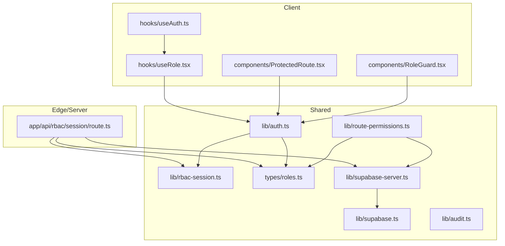
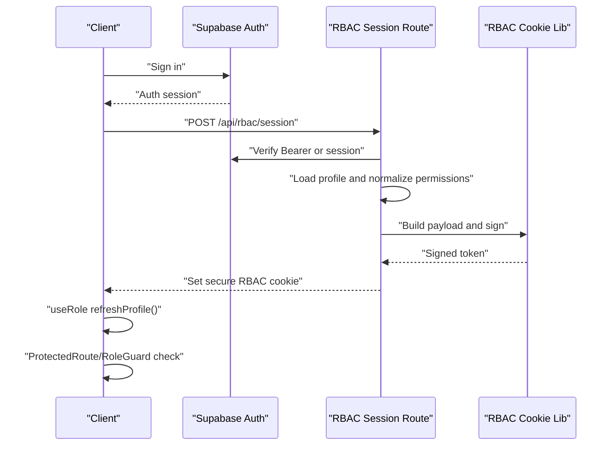
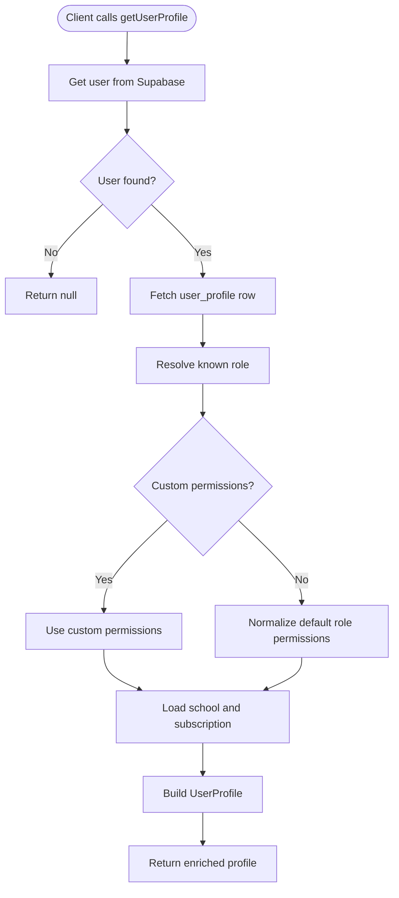
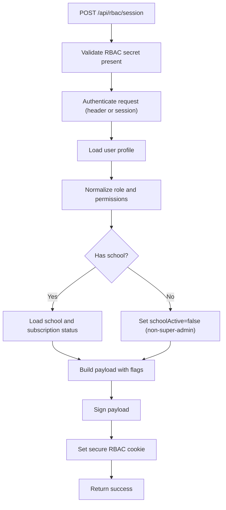
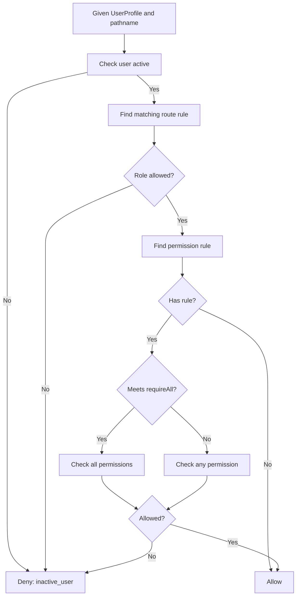
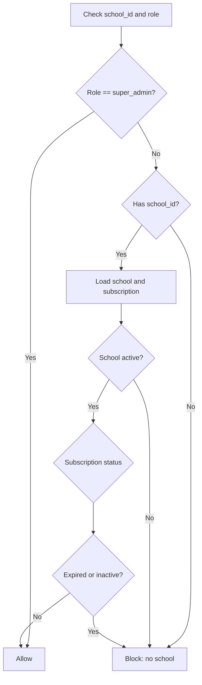
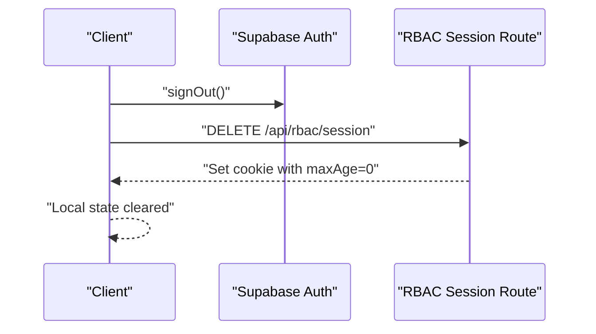
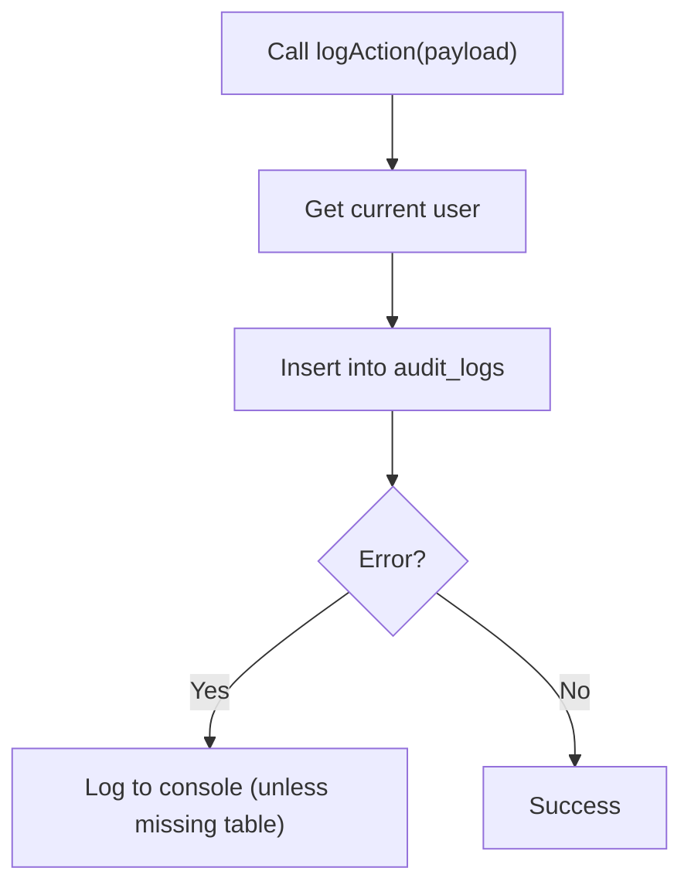
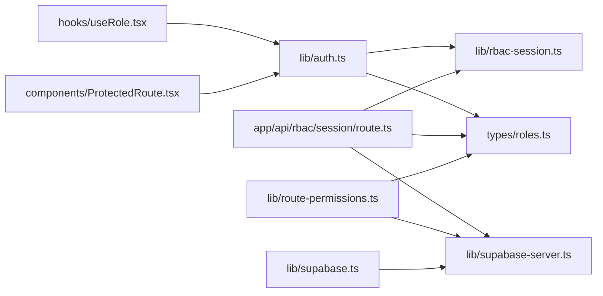

# Security Considerations

<cite>
**Referenced Files in This Document**
- [SECURITY.md](file://SECURITY.md)
- [lib/auth.ts](file://lib/auth.ts)
- [lib/rbac-session.ts](file://lib/rbac-session.ts)
- [app/api/rbac/session/route.ts](file://app/api/rbac/session/route.ts)
- [types/roles.ts](file://types/roles.ts)
- [lib/route-permissions.ts](file://lib/route-permissions.ts)
- [lib/supabase-server.ts](file://lib/supabase-server.ts)
- [lib/supabase.ts](file://lib/supabase.ts)
- [components/ProtectedRoute.tsx](file://components/ProtectedRoute.tsx)
- [components/RoleGuard.tsx](file://components/RoleGuard.tsx)
- [hooks/useRole.tsx](file://hooks/useRole.tsx)
- [hooks/useAuth.ts](file://hooks/useAuth.ts)
- [lib/audit.ts](file://lib/audit.ts)
</cite>

## Table of Contents
1. [Introduction](#introduction)
2. [Project Structure](#project-structure)
3. [Core Components](#core-components)
4. [Architecture Overview](#architecture-overview)
5. [Detailed Component Analysis](#detailed-component-analysis)
6. [Dependency Analysis](#dependency-analysis)
7. [Performance Considerations](#performance-considerations)
8. [Troubleshooting Guide](#troubleshooting-guide)
9. [Conclusion](#conclusion)
10. [Appendices](#appendices)

## Introduction
This document consolidates the security implementation and considerations across the platform’s authentication, authorization, session management, and audit logging systems. It explains how Supabase Auth identities are combined with signed RBAC session cookies to enforce access control, how permissions are validated, and how operational security controls are enforced. It also outlines practical secure authentication patterns, permission validation security, audit logging, common vulnerability mitigations, and guidance for configuration, threat modeling, and security testing.

## Project Structure
Security is implemented across three layers:
- Client-side React components and hooks that manage user profiles, permissions, and route protection.
- Edge/Server routes that validate authenticated identities and mint/sign RBAC cookies.
- Shared libraries that define roles, permissions, and session signing/verification.

**Diagram sources**
- [hooks/useRole.tsx:1-177](file://hooks/useRole.tsx#L1-L177)
- [hooks/useAuth.ts:1-22](file://hooks/useAuth.ts#L1-L22)
- [components/ProtectedRoute.tsx:1-72](file://components/ProtectedRoute.tsx#L1-L72)
- [components/RoleGuard.tsx:1-18](file://components/RoleGuard.tsx#L1-L18)
- [app/api/rbac/session/route.ts:1-155](file://app/api/rbac/session/route.ts#L1-L155)
- [lib/auth.ts:1-341](file://lib/auth.ts#L1-L341)
- [lib/rbac-session.ts:1-153](file://lib/rbac-session.ts#L1-L153)
- [types/roles.ts:1-432](file://types/roles.ts#L1-L432)
- [lib/route-permissions.ts:1-42](file://lib/route-permissions.ts#L1-L42)
- [lib/supabase-server.ts:1-75](file://lib/supabase-server.ts#L1-L75)
- [lib/supabase.ts:1-22](file://lib/supabase.ts#L1-L22)
- [lib/audit.ts:1-63](file://lib/audit.ts#L1-L63)

**Section sources**
- [SECURITY.md:1-36](file://SECURITY.md#L1-L36)
- [lib/auth.ts:1-341](file://lib/auth.ts#L1-L341)
- [lib/rbac-session.ts:1-153](file://lib/rbac-session.ts#L1-L153)
- [app/api/rbac/session/route.ts:1-155](file://app/api/rbac/session/route.ts#L1-L155)
- [types/roles.ts:1-432](file://types/roles.ts#L1-L432)
- [lib/route-permissions.ts:1-42](file://lib/route-permissions.ts#L1-L42)
- [lib/supabase-server.ts:1-75](file://lib/supabase-server.ts#L1-L75)
- [lib/supabase.ts:1-22](file://lib/supabase.ts#L1-L22)
- [components/ProtectedRoute.tsx:1-72](file://components/ProtectedRoute.tsx#L1-L72)
- [components/RoleGuard.tsx:1-18](file://components/RoleGuard.tsx#L1-L18)
- [hooks/useRole.tsx:1-177](file://hooks/useRole.tsx#L1-L177)
- [hooks/useAuth.ts:1-22](file://hooks/useAuth.ts#L1-L22)
- [lib/audit.ts:1-63](file://lib/audit.ts#L1-L63)

## Core Components
- Authentication identity: Supabase Auth manages authenticated identities and sessions.
- Authorization model: Roles and permissions are defined centrally and enforced via route rules and permission checks.
- RBAC session cookie: A signed, server-side validated cookie stores a scoped authorization payload for fast client-side decisions.
- Audit logging: Centralized logging of key actions for compliance and monitoring.
- Supabase client configuration: Separate clients for server routes and browser to enforce session behavior and service role usage.

**Section sources**
- [lib/auth.ts:1-341](file://lib/auth.ts#L1-L341)
- [types/roles.ts:1-432](file://types/roles.ts#L1-L432)
- [lib/rbac-session.ts:1-153](file://lib/rbac-session.ts#L1-L153)
- [app/api/rbac/session/route.ts:1-155](file://app/api/rbac/session/route.ts#L1-L155)
- [lib/audit.ts:1-63](file://lib/audit.ts#L1-L63)
- [lib/supabase-server.ts:1-75](file://lib/supabase-server.ts#L1-L75)
- [lib/supabase.ts:1-22](file://lib/supabase.ts#L1-L22)

## Architecture Overview
The system combines Supabase Auth with a signed RBAC cookie to enforce access control:
- On successful login, the client fetches the user profile and calls the RBAC session endpoint to mint a signed cookie.
- The server validates the authenticated user, loads the profile, normalizes permissions, and builds a payload including role, permissions, and school/subscription status.
- The signed cookie is returned with secure attributes and short-lived expiration.
- Client-side hooks and route guards use the cookie for fast authorization decisions and subscription/block status checks.

**Diagram sources**
- [app/api/rbac/session/route.ts:14-133](file://app/api/rbac/session/route.ts#L14-L133)
- [lib/rbac-session.ts:56-142](file://lib/rbac-session.ts#L56-L142)
- [lib/auth.ts:239-267](file://lib/auth.ts#L239-L267)
- [hooks/useRole.tsx:47-68](file://hooks/useRole.tsx#L47-L68)
- [components/ProtectedRoute.tsx:33-71](file://components/ProtectedRoute.tsx#L33-L71)

## Detailed Component Analysis

### Authentication Identity and Profile Loading
- Supabase Auth is used for identity management. The client library validates environment variables and throws if missing.
- The server creates a Supabase client with cookie persistence for SSR and route handlers.
- The client-side profile loader retrieves the authenticated user, fetches the user profile, resolves role, normalizes permissions, and enriches with school/subscription context.

**Diagram sources**
- [lib/auth.ts:239-267](file://lib/auth.ts#L239-L267)
- [lib/auth.ts:188-237](file://lib/auth.ts#L188-L237)
- [lib/supabase.ts:1-22](file://lib/supabase.ts#L1-L22)
- [lib/supabase-server.ts:5-37](file://lib/supabase-server.ts#L5-L37)

**Section sources**
- [lib/supabase.ts:1-22](file://lib/supabase.ts#L1-L22)
- [lib/supabase-server.ts:1-75](file://lib/supabase-server.ts#L1-L75)
- [lib/auth.ts:188-267](file://lib/auth.ts#L188-L267)

### RBAC Session Signing and Cookie Management
- The RBAC cookie payload includes role, permissions, school and subscription status, timestamps, and a version.
- The signing secret is derived from a dedicated environment variable with a controlled fallback and explicit warnings in development.
- The cookie is configured as httpOnly, SameSite lax, secure in production, and short-lived.
- The server endpoint validates the authenticated identity, loads profile and optional permissions, computes access flags, builds the payload, signs it, and sets the cookie.

**Diagram sources**
- [app/api/rbac/session/route.ts:14-133](file://app/api/rbac/session/route.ts#L14-L133)
- [lib/rbac-session.ts:19-50](file://lib/rbac-session.ts#L19-L50)
- [lib/rbac-session.ts:112-152](file://lib/rbac-session.ts#L112-L152)

**Section sources**
- [lib/rbac-session.ts:1-153](file://lib/rbac-session.ts#L1-L153)
- [app/api/rbac/session/route.ts:1-155](file://app/api/rbac/session/route.ts#L1-L155)

### Authorization Controls and Access Control Enforcement
- Roles and permissions are defined centrally with templates and normalization.
- Route access rules specify allowed roles per path prefix and whether a school must be active.
- Permission rules define required permissions per path prefix, supporting either “any” or “all” semantics.
- Client-side access decisions are computed from the profile and path, with a dedicated hook exposing can/canAny/canAll and path access checks.
- Route guards redirect unauthenticated, inactive-school, or insufficient-permission users appropriately.

**Diagram sources**
- [lib/auth.ts:106-145](file://lib/auth.ts#L106-L145)
- [types/roles.ts:183-282](file://types/roles.ts#L183-L282)
- [hooks/useRole.tsx:119-131](file://hooks/useRole.tsx#L119-L131)
- [components/ProtectedRoute.tsx:33-71](file://components/ProtectedRoute.tsx#L33-L71)

**Section sources**
- [types/roles.ts:1-432](file://types/roles.ts#L1-L432)
- [lib/auth.ts:79-149](file://lib/auth.ts#L79-L149)
- [hooks/useRole.tsx:119-131](file://hooks/useRole.tsx#L119-L131)
- [components/ProtectedRoute.tsx:1-72](file://components/ProtectedRoute.tsx#L1-L72)

### Data Protection Mechanisms and Subscription-Based Access Blocks
- Subscription expiration and status checks are performed to block access when a school’s subscription is expired or inactive.
- The decision logic accounts for subscription end-of-day boundary and various statuses.

**Diagram sources**
- [lib/auth.ts:93-104](file://lib/auth.ts#L93-L104)
- [lib/auth.ts:71-77](file://lib/auth.ts#L71-L77)

**Section sources**
- [lib/auth.ts:71-104](file://lib/auth.ts#L71-L104)

### Session Invalidation and Sign-Out
- Client sign-out clears the Supabase session and deletes the RBAC cookie.
- The RBAC session deletion endpoint clears the cookie immediately.

**Diagram sources**
- [lib/auth.ts:337-340](file://lib/auth.ts#L337-L340)
- [app/api/rbac/session/route.ts:135-154](file://app/api/rbac/session/route.ts#L135-L154)

**Section sources**
- [lib/auth.ts:333-340](file://lib/auth.ts#L333-L340)
- [app/api/rbac/session/route.ts:135-154](file://app/api/rbac/session/route.ts#L135-L154)

### Audit Logging
- Audit logs capture actions with actor metadata and optional structured metadata.
- Logging is resilient to missing tables and errors are surfaced for observability.

**Diagram sources**
- [lib/audit.ts:40-62](file://lib/audit.ts#L40-L62)

**Section sources**
- [lib/audit.ts:1-63](file://lib/audit.ts#L1-L63)

### Practical Secure Authentication Patterns
- Use Supabase Auth for identity and enforce RBAC session cookie minting after successful login.
- Enforce rate limits on RBAC session endpoints to mitigate abuse.
- Keep RBAC signing secrets separate from JWT secrets and configure them in production.
- Use httpOnly, SameSite lax, and secure flags for cookies; set short maxAge.
- Refresh RBAC cookies on profile changes with a cooldown to balance freshness and performance.

**Section sources**
- [app/api/rbac/session/route.ts:32-40](file://app/api/rbac/session/route.ts#L32-L40)
- [lib/rbac-session.ts:19-50](file://lib/rbac-session.ts#L19-L50)
- [lib/rbac-session.ts:144-152](file://lib/rbac-session.ts#L144-L152)
- [hooks/useRole.tsx:47-62](file://hooks/useRole.tsx#L47-L62)

### Permission Validation Security
- Normalize permissions from stored data and enforce “full_access” semantics.
- Use route-level permission rules with either “any” or “all” requirements.
- Server-side route permission checks leverage the same normalization and role resolution.

**Section sources**
- [types/roles.ts:131-151](file://types/roles.ts#L131-L151)
- [types/roles.ts:190-194](file://types/roles.ts#L190-L194)
- [lib/route-permissions.ts:11-41](file://lib/route-permissions.ts#L11-L41)

### CSRF Protection
- The RBAC cookie is httpOnly, preventing client-side script access and reducing XSS impact.
- The cookie is set with SameSite lax to mitigate CSRF in cross-site contexts while enabling expected navigation flows.
- The server validates the authenticated identity via header or session before signing the cookie.

**Section sources**
- [lib/rbac-session.ts:144-152](file://lib/rbac-session.ts#L144-L152)
- [app/api/rbac/session/route.ts:26-30](file://app/api/rbac/session/route.ts#L26-L30)

### Token Storage and Session Management Security
- RBAC cookie is signed server-side; clients cannot tamper with it.
- The server enforces a dedicated signing secret and warns in development if relying on fallbacks.
- Session invalidation is immediate via cookie deletion.

**Section sources**
- [lib/rbac-session.ts:112-142](file://lib/rbac-session.ts#L112-L142)
- [lib/rbac-session.ts:19-50](file://lib/rbac-session.ts#L19-L50)
- [app/api/rbac/session/route.ts:135-154](file://app/api/rbac/session/route.ts#L135-L154)

## Dependency Analysis

**Diagram sources**
- [lib/auth.ts:1-341](file://lib/auth.ts#L1-L341)
- [types/roles.ts:1-432](file://types/roles.ts#L1-L432)
- [lib/rbac-session.ts:1-153](file://lib/rbac-session.ts#L1-L153)
- [app/api/rbac/session/route.ts:1-155](file://app/api/rbac/session/route.ts#L1-L155)
- [lib/supabase-server.ts:1-75](file://lib/supabase-server.ts#L1-L75)
- [hooks/useRole.tsx:1-177](file://hooks/useRole.tsx#L1-L177)
- [components/ProtectedRoute.tsx:1-72](file://components/ProtectedRoute.tsx#L1-L72)
- [lib/route-permissions.ts:1-42](file://lib/route-permissions.ts#L1-L42)
- [lib/supabase.ts:1-22](file://lib/supabase.ts#L1-L22)

**Section sources**
- [lib/auth.ts:1-341](file://lib/auth.ts#L1-L341)
- [types/roles.ts:1-432](file://types/roles.ts#L1-L432)
- [lib/rbac-session.ts:1-153](file://lib/rbac-session.ts#L1-L153)
- [app/api/rbac/session/route.ts:1-155](file://app/api/rbac/session/route.ts#L1-L155)
- [lib/supabase-server.ts:1-75](file://lib/supabase-server.ts#L1-L75)
- [hooks/useRole.tsx:1-177](file://hooks/useRole.tsx#L1-L177)
- [components/ProtectedRoute.tsx:1-72](file://components/ProtectedRoute.tsx#L1-L72)
- [lib/route-permissions.ts:1-42](file://lib/route-permissions.ts#L1-L42)
- [lib/supabase.ts:1-22](file://lib/supabase.ts#L1-L22)

## Performance Considerations
- RBAC cookie refresh is rate-limited and includes a cooldown to avoid frequent re-signing.
- Profile loading uses concurrent queries for school and subscription data.
- Client-side access checks rely on the cookie and profile, minimizing server round-trips.

**Section sources**
- [hooks/useRole.tsx:39](file://hooks/useRole.tsx#L39)
- [hooks/useRole.tsx:55-62](file://hooks/useRole.tsx#L55-L62)
- [lib/auth.ts:166-186](file://lib/auth.ts#L166-L186)
- [app/api/rbac/session/route.ts:32-40](file://app/api/rbac/session/route.ts#L32-L40)

## Troubleshooting Guide
- RBAC secret not configured: The server endpoint returns an error; ensure a dedicated signing secret is set in production.
- Missing Supabase environment variables: Client and server constructors throw descriptive errors.
- Profile not found during RBAC initialization: The server responds with a 404-like message; verify user profile exists.
- Subscription/expired school blocking access: The decision logic returns a specific reason; redirect to subscription-expired page accordingly.
- Audit logging failures: Errors are logged to the console unless the table is missing.

**Section sources**
- [app/api/rbac/session/route.ts:15-20](file://app/api/rbac/session/route.ts#L15-L20)
- [lib/supabase.ts:8-18](file://lib/supabase.ts#L8-L18)
- [lib/supabase-server.ts:11-15](file://lib/supabase-server.ts#L11-L15)
- [app/api/rbac/session/route.ts:49-56](file://app/api/rbac/session/route.ts#L49-L56)
- [lib/auth.ts:93-104](file://lib/auth.ts#L93-L104)
- [lib/audit.ts:56-62](file://lib/audit.ts#L56-L62)

## Conclusion
The platform integrates Supabase Auth with a signed RBAC session cookie to deliver robust, tenant-aware access control. Centralized role and permission definitions, server-side signing, and cookie security attributes form a cohesive security model. Operational controls like rate limiting, subscription-based access blocks, and audit logging further strengthen the system. Adhering to the recommended configuration and testing practices ensures a secure deployment.

## Appendices

### Security Configuration Checklist
- Configure a dedicated RBAC signing secret in production.
- Ensure httpOnly, SameSite lax, and secure cookie flags are active.
- Enforce rate limits on RBAC session endpoints.
- Verify Supabase environment variables are present and correct.
- Monitor audit logs and address missing table conditions gracefully.

**Section sources**
- [SECURITY.md:8-16](file://SECURITY.md#L8-L16)
- [lib/rbac-session.ts:144-152](file://lib/rbac-session.ts#L144-L152)
- [app/api/rbac/session/route.ts:32-40](file://app/api/rbac/session/route.ts#L32-L40)
- [lib/supabase.ts:8-18](file://lib/supabase.ts#L8-L18)
- [lib/audit.ts:34-39](file://lib/audit.ts#L34-L39)

### Threat Modeling and Mitigations
- Identity theft or session hijacking: Supabase Auth with signed RBAC cookie reduces exposure; httpOnly and secure flags mitigate theft.
- Privilege escalation: Centralized permission normalization and route-level checks prevent unauthorized access.
- Tenant isolation failure: Subscription and school status checks block access when tenants are inactive or expired.
- Abuse of session endpoints: Rate limiting prevents brute-force and denial-of-service scenarios.

**Section sources**
- [SECURITY.md:8-16](file://SECURITY.md#L8-L16)
- [lib/rbac-session.ts:19-50](file://lib/rbac-session.ts#L19-L50)
- [lib/auth.ts:93-104](file://lib/auth.ts#L93-L104)
- [app/api/rbac/session/route.ts:32-40](file://app/api/rbac/session/route.ts#L32-L40)

### Security Testing Approaches
- Unit/integration tests for permission checks and route rules.
- End-to-end tests validating redirect flows for unauthenticated, forbidden, and subscription-expired states.
- Penetration testing focusing on RBAC cookie tampering, CSRF vectors, and rate-limit bypass attempts.
- Audit log verification to ensure critical actions are recorded.

[No sources needed since this section provides general guidance]