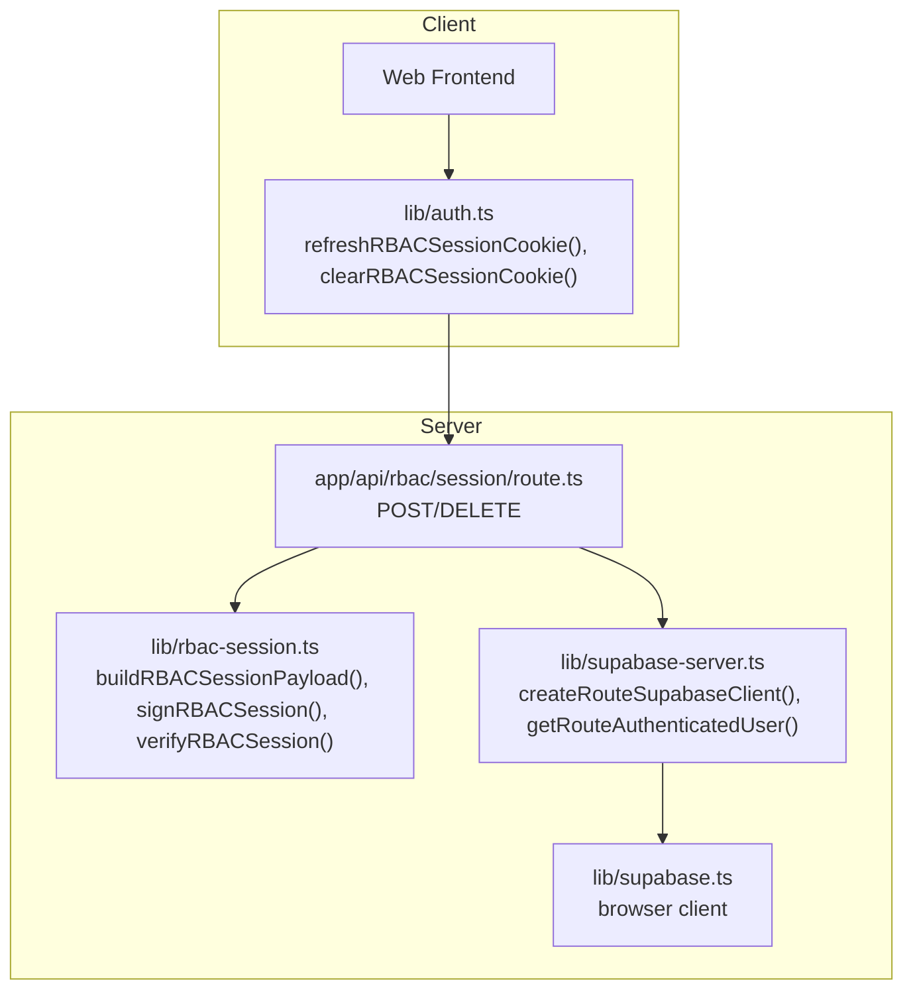
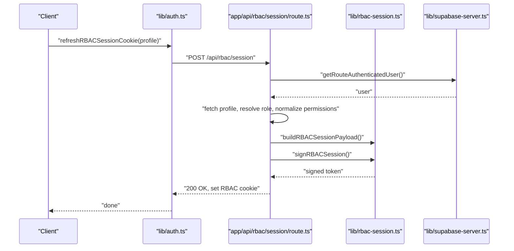
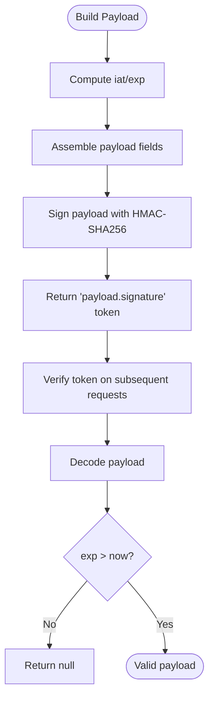
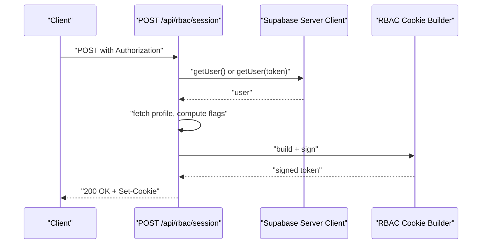
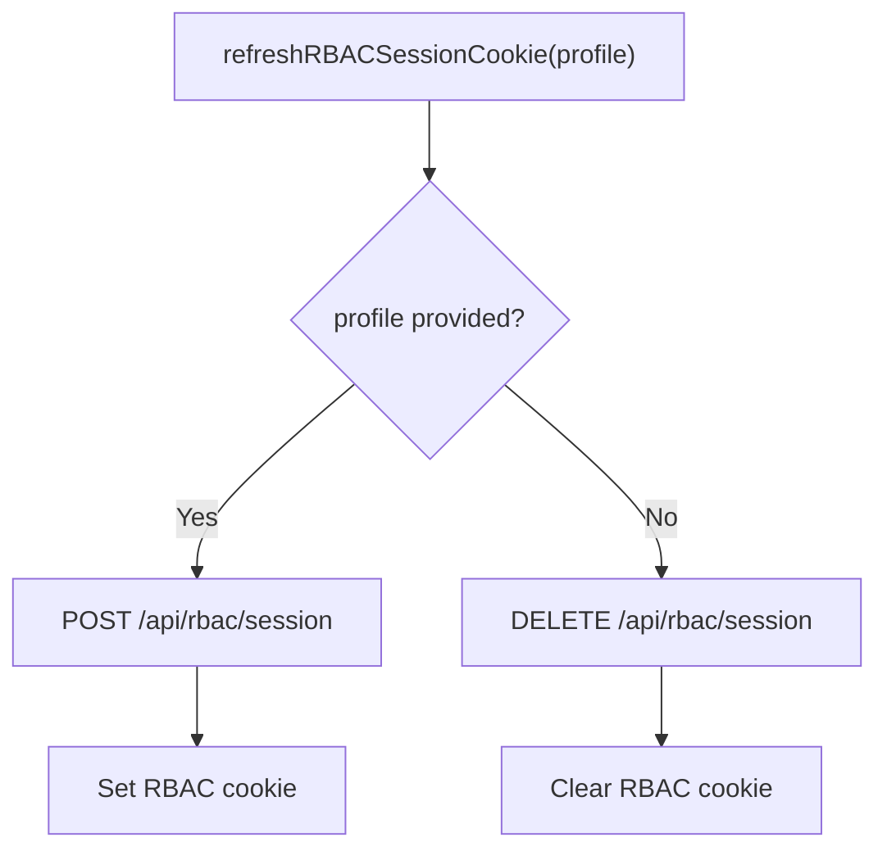
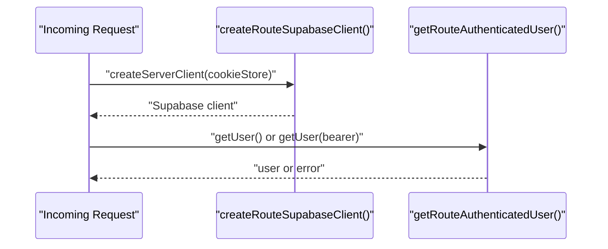
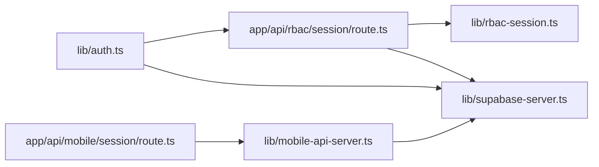

# Session Management

<cite>
**Referenced Files in This Document**
- [rbac-session.ts](file://lib/rbac-session.ts)
- [route.ts](file://app/api/rbac/session/route.ts)
- [auth.ts](file://lib/auth.ts)
- [supabase-server.ts](file://lib/supabase-server.ts)
- [supabase.ts](file://lib/supabase.ts)
- [mobile-session.route.ts](file://app/api/mobile/session/route.ts)
- [mobile-api-server.ts](file://lib/mobile-api-server.ts)
- [auth-session.ts](file://school-saas-next/src/lib/auth-session.ts)
</cite>

## Table of Contents
1. [Introduction](#introduction)
2. [Project Structure](#project-structure)
3. [Core Components](#core-components)
4. [Architecture Overview](#architecture-overview)
5. [Detailed Component Analysis](#detailed-component-analysis)
6. [Dependency Analysis](#dependency-analysis)
7. [Performance Considerations](#performance-considerations)
8. [Troubleshooting Guide](#troubleshooting-guide)
9. [Conclusion](#conclusion)

## Introduction
This document explains the session management system for the administrative web application. It covers:
- RBAC session initialization via a server endpoint
- Cookie-based session persistence for RBAC state
- Session lifecycle management (create, validate, delete)
- Integration between Supabase authentication sessions and custom RBAC sessions
- Practical examples and troubleshooting guidance

## Project Structure
The session management spans several modules:
- RBAC session builder and validator
- Server endpoint to create/delete RBAC cookies
- Supabase integration for authentication and profile retrieval
- Client-side helpers to refresh or clear RBAC cookies
- Optional SaaS-style session cookie for other contexts

**Diagram sources**
- [route.ts:1-155](file://app/api/rbac/session/route.ts#L1-L155)
- [rbac-session.ts:1-153](file://lib/rbac-session.ts#L1-L153)
- [auth.ts:273-341](file://lib/auth.ts#L273-L341)
- [supabase-server.ts:1-75](file://lib/supabase-server.ts#L1-L75)
- [supabase.ts:1-22](file://lib/supabase.ts#L1-L22)

**Section sources**
- [route.ts:1-155](file://app/api/rbac/session/route.ts#L1-L155)
- [rbac-session.ts:1-153](file://lib/rbac-session.ts#L1-L153)
- [auth.ts:273-341](file://lib/auth.ts#L273-L341)
- [supabase-server.ts:1-75](file://lib/supabase-server.ts#L1-L75)
- [supabase.ts:1-22](file://lib/supabase.ts#L1-L22)

## Core Components
- RBAC cookie builder and validator:
  - Payload shape and signing/verification
  - Cookie options and expiration
- RBAC session endpoint:
  - Creates a signed cookie after validating Supabase auth and user profile
  - Deletes the cookie on logout/clear
- Supabase integration:
  - Server client with cookie store
  - Authentication extraction from Authorization header or session
- Client helpers:
  - Refresh or clear RBAC cookie using the server endpoint
- Mobile session endpoint:
  - Lightweight session payload for mobile contexts (distinct from RBAC cookie)

**Section sources**
- [rbac-session.ts:1-153](file://lib/rbac-session.ts#L1-L153)
- [route.ts:1-155](file://app/api/rbac/session/route.ts#L1-L155)
- [auth.ts:273-341](file://lib/auth.ts#L273-L341)
- [supabase-server.ts:1-75](file://lib/supabase-server.ts#L1-L75)
- [mobile-session.route.ts:1-16](file://app/api/mobile/session/route.ts#L1-L16)

## Architecture Overview
The RBAC session is a signed cookie stored on the client. It encapsulates role, permissions, and school/subscription context derived from the authenticated Supabase user’s profile. The server endpoint validates the user, builds the payload, signs it, and sets the cookie. The client can refresh or clear the cookie as needed.

**Diagram sources**
- [auth.ts:273-331](file://lib/auth.ts#L273-L331)
- [route.ts:14-133](file://app/api/rbac/session/route.ts#L14-L133)
- [rbac-session.ts:56-120](file://lib/rbac-session.ts#L56-L120)
- [supabase-server.ts:60-74](file://lib/supabase-server.ts#L60-L74)

## Detailed Component Analysis

### RBAC Cookie Builder and Validator
- Cookie name and max age constants
- Payload interface with role, permissions, school flags, and timestamps
- Secret derivation with production safety checks
- Signing and verification using HMAC-SHA256 over base64url-encoded payload
- Cookie options include httpOnly, sameSite, secure, path, and maxAge

**Diagram sources**
- [rbac-session.ts:56-142](file://lib/rbac-session.ts#L56-L142)

**Section sources**
- [rbac-session.ts:1-153](file://lib/rbac-session.ts#L1-L153)

### RBAC Session Endpoint (Create/Delete)
- POST endpoint:
  - Validates server secret availability
  - Extracts authenticated user from Authorization header or session
  - Fetches user profile and resolves role
  - Normalizes permissions and computes school/subscription flags
  - Builds and signs payload, sets cookie with options
- DELETE endpoint:
  - Clears the RBAC cookie immediately

**Diagram sources**
- [route.ts:14-133](file://app/api/rbac/session/route.ts#L14-L133)
- [supabase-server.ts:60-74](file://lib/supabase-server.ts#L60-L74)
- [rbac-session.ts:56-120](file://lib/rbac-session.ts#L56-L120)

**Section sources**
- [route.ts:1-155](file://app/api/rbac/session/route.ts#L1-L155)

### Client Helpers: Refresh and Clear RBAC Cookie
- refreshRBACSessionCookie(profile?, options?): calls POST to initialize or update cookie
- clearRBACSessionCookie(): calls DELETE to remove cookie
- signOutClient(): clears RBAC cookie and signs out from Supabase

**Diagram sources**
- [auth.ts:273-341](file://lib/auth.ts#L273-L341)
- [route.ts:135-154](file://app/api/rbac/session/route.ts#L135-L154)

**Section sources**
- [auth.ts:273-341](file://lib/auth.ts#L273-L341)

### Supabase Authentication Integration
- Server client with cookie store to persist session across SSR
- Authentication extraction supports Authorization: Bearer token or session
- Mobile session context resolver demonstrates similar pattern

**Diagram sources**
- [supabase-server.ts:5-75](file://lib/supabase-server.ts#L5-L75)
- [mobile-api-server.ts:199-250](file://lib/mobile-api-server.ts#L199-L250)

**Section sources**
- [supabase-server.ts:1-75](file://lib/supabase-server.ts#L1-L75)
- [mobile-api-server.ts:199-250](file://lib/mobile-api-server.ts#L199-L250)

### Mobile Session Endpoint (Contextual)
- Returns a lightweight session payload for mobile clients
- Not the RBAC cookie; used for mobile-specific routes

**Section sources**
- [mobile-session.route.ts:1-16](file://app/api/mobile/session/route.ts#L1-L16)
- [mobile-api-server.ts:252-284](file://lib/mobile-api-server.ts#L252-L284)

### Optional SaaS Session Cookie
- Separate cookie serializer/parser and default options
- Useful for other session-like contexts outside RBAC

**Section sources**
- [auth-session.ts:1-41](file://school-saas-next/src/lib/auth-session.ts#L1-L41)

## Dependency Analysis
- RBAC endpoint depends on:
  - Supabase server client for authentication and RLS-enabled profile queries
  - RBAC cookie builder for payload construction and signing
- Client helpers depend on:
  - Supabase browser client for session retrieval
  - RBAC endpoint for cookie updates
- Mobile session endpoint depends on:
  - Supabase service client and managed user context

**Diagram sources**
- [route.ts:1-155](file://app/api/rbac/session/route.ts#L1-L155)
- [rbac-session.ts:1-153](file://lib/rbac-session.ts#L1-L153)
- [auth.ts:273-341](file://lib/auth.ts#L273-L341)
- [supabase-server.ts:1-75](file://lib/supabase-server.ts#L1-L75)
- [mobile-session.route.ts:1-16](file://app/api/mobile/session/route.ts#L1-L16)
- [mobile-api-server.ts:1-720](file://lib/mobile-api-server.ts#L1-L720)

**Section sources**
- [route.ts:1-155](file://app/api/rbac/session/route.ts#L1-L155)
- [rbac-session.ts:1-153](file://lib/rbac-session.ts#L1-L153)
- [auth.ts:273-341](file://lib/auth.ts#L273-L341)
- [supabase-server.ts:1-75](file://lib/supabase-server.ts#L1-L75)
- [mobile-session.route.ts:1-16](file://app/api/mobile/session/route.ts#L1-L16)
- [mobile-api-server.ts:1-720](file://lib/mobile-api-server.ts#L1-L720)

## Performance Considerations
- Rate limiting on RBAC session creation and deletion endpoints prevents abuse.
- Asynchronous profile and subscription queries are executed concurrently to reduce latency.
- Payload signing uses HMAC-SHA256; keep payloads minimal to reduce overhead.
- Cookie options set httpOnly and secure appropriately to minimize XSS risks.

[No sources needed since this section provides general guidance]

## Troubleshooting Guide
Common issues and resolutions:
- RBAC secret not configured in production:
  - Symptom: Server responds with internal error indicating missing secret.
  - Resolution: Set a dedicated RBAC cookie secret; do not rely on JWT secret fallback in production.
- Unauthorized or missing Supabase session:
  - Symptom: 401 Unauthorized on RBAC session creation.
  - Resolution: Ensure Authorization header contains a valid bearer token or that the session is present.
- Profile not found:
  - Symptom: 404 when building RBAC session.
  - Resolution: Verify user profile exists and is readable via RLS.
- Role not supported for web:
  - Symptom: 403 with cookie cleared.
  - Resolution: Ensure the resolved role is known and allowed for web access.
- Cookie not set or cleared:
  - Symptom: Browser does not receive or retains the cookie.
  - Resolution: Confirm SameSite, Secure, and Path settings match deployment; test with HTTPS in production.
- Excessive requests:
  - Symptom: Rate-limited responses.
  - Resolution: Back off and avoid frequent refreshes; leverage client-side caching of decisions.

Practical debugging steps:
- Inspect network tab for /api/rbac/session requests and Set-Cookie responses.
- Log server-side errors during profile and subscription fetches.
- Verify cookie presence and expiration in browser developer tools.
- Test with a fresh session and confirm Supabase auth.getUser() returns the user.

**Section sources**
- [route.ts:14-154](file://app/api/rbac/session/route.ts#L14-L154)
- [rbac-session.ts:19-50](file://lib/rbac-session.ts#L19-L50)
- [supabase-server.ts:52-74](file://lib/supabase-server.ts#L52-L74)

## Conclusion
The session management system integrates Supabase authentication with a custom RBAC cookie. It securely initializes, validates, and cleans up sessions while enforcing role-based permissions and contextual school/subscription constraints. By following the recommended configurations and troubleshooting steps, teams can maintain reliable and secure session behavior across environments.