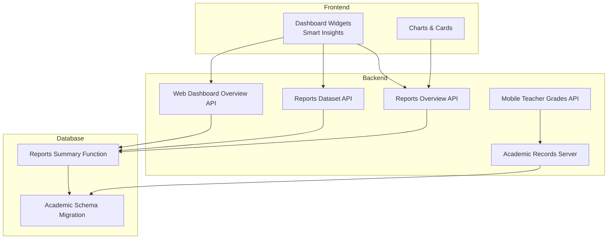
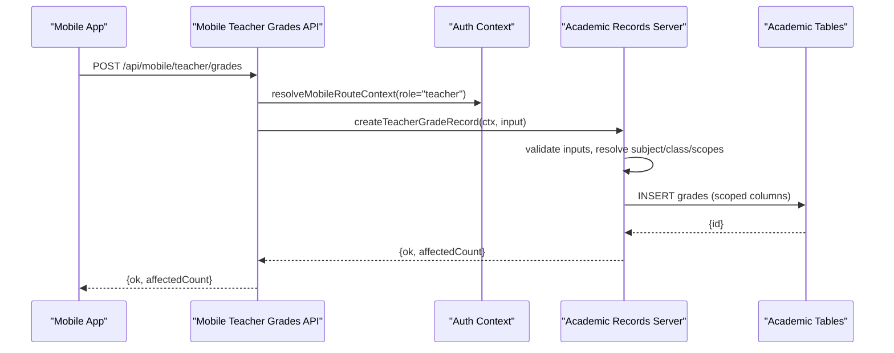
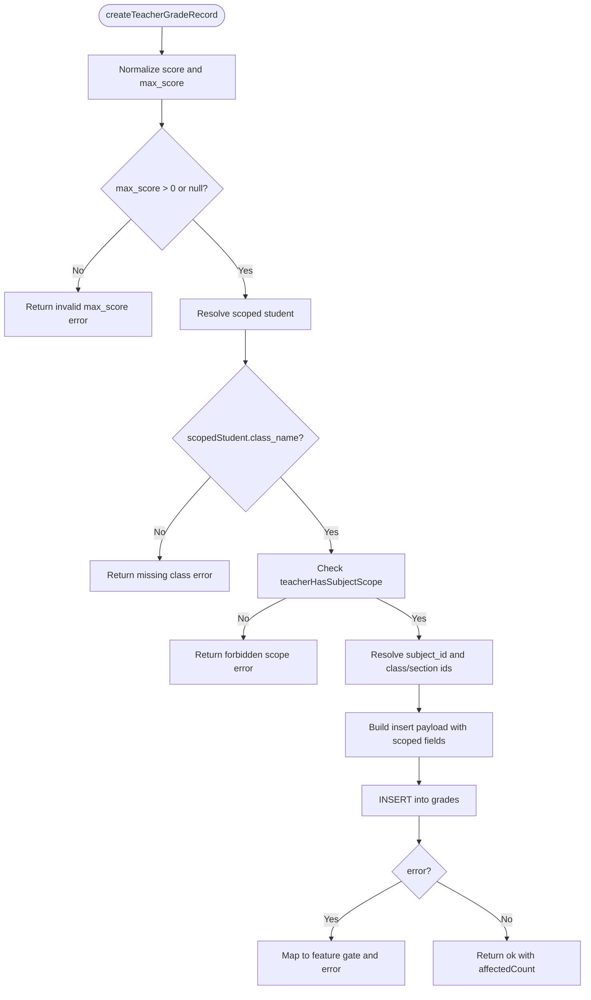
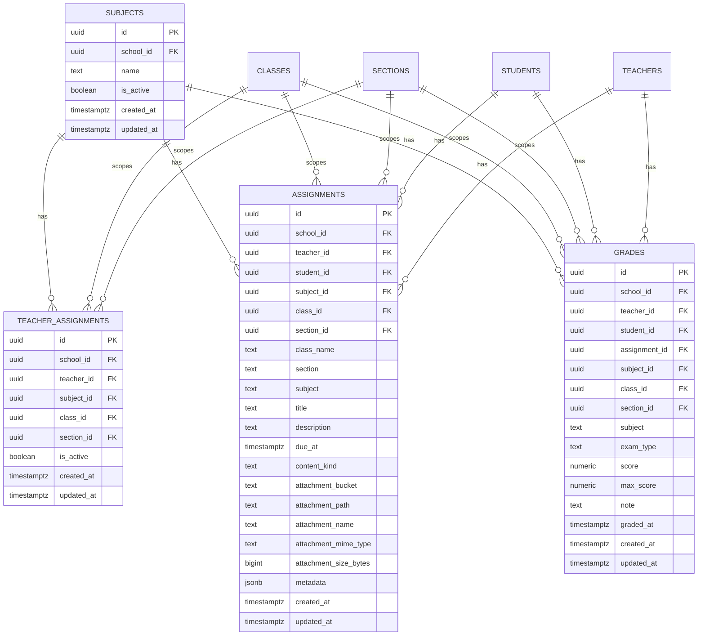
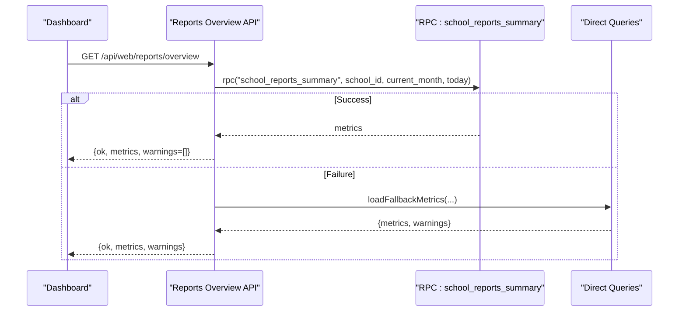
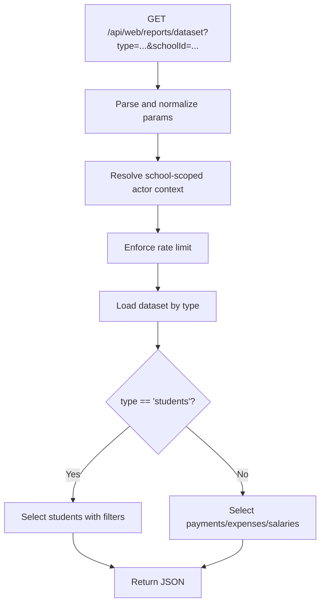
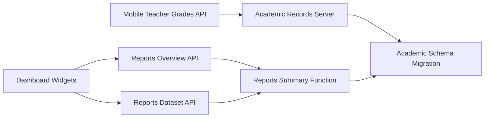

# Academic Analytics

<cite>
**Referenced Files in This Document**
- [academic-records-server.ts](file://lib/academic-records-server.ts)
- [20260324_010000_academic_records_scope_model.sql](file://migrations/20260324_010000_academic_records_scope_model.sql)
- [20260326_000000_reports_summary_function.sql](file://migrations/20260326_000000_reports_summary_function.sql)
- [route.ts](file://app/api/web/reports/overview/route.ts)
- [route.ts](file://app/api/web/reports/dataset/route.ts)
- [route.ts](file://app/api/web/dashboard/overview/route.ts)
- [route.ts](file://app/api/mobile/teacher/grades/route.ts)
- [smart-insights.tsx](file://school-saas-next/src/components/dashboard/smart-insights.tsx)
- [OverviewCharts.tsx](file://app/[locale]/super-admin/components/OverviewCharts.tsx)
- [academic-year.ts](file://lib/academic-year.ts)
- [overview.ts](file://lib/students/overview.ts)
- [route.ts](file://app/api/web/students/meta/route.ts)
- [route.ts](file://app/[locale]/students/page.tsx)
</cite>

## Table of Contents
1. [Introduction](#introduction)
2. [Project Structure](#project-structure)
3. [Core Components](#core-components)
4. [Architecture Overview](#architecture-overview)
5. [Detailed Component Analysis](#detailed-component-analysis)
6. [Dependency Analysis](#dependency-analysis)
7. [Performance Considerations](#performance-considerations)
8. [Troubleshooting Guide](#troubleshooting-guide)
9. [Conclusion](#conclusion)
10. [Appendices](#appendices)

## Introduction
This document describes the academic analytics system for student performance tracking, grade distributions, and institutional metrics. It explains how academic data is visualized (grade trends, class comparisons, student achievement monitoring), how academic records are aggregated and validated, and how grade calculations and statistical summaries are computed. It also covers integrations with student enrollment systems, grade entry modules, and academic year management, along with privacy and reporting considerations, and guidance for customizing metrics and generating insights.

## Project Structure
The academic analytics capability spans:
- Backend APIs for reports, datasets, and dashboards
- Academic records storage and validation logic
- Database migrations defining academic tables and policies
- Frontend dashboard widgets and charts
- Utilities for academic year labeling and student dataset filtering

**Diagram sources**
- [route.ts:121-247](file://app/api/web/reports/overview/route.ts#L121-L247)
- [route.ts:40-184](file://app/api/web/reports/dataset/route.ts#L40-L184)
- [route.ts:126-152](file://app/api/web/dashboard/overview/route.ts#L126-L152)
- [route.ts:1-42](file://app/api/mobile/teacher/grades/route.ts#L1-L42)
- [academic-records-server.ts:686-824](file://lib/academic-records-server.ts#L686-L824)
- [20260324_010000_academic_records_scope_model.sql:224-307](file://migrations/20260324_010000_academic_records_scope_model.sql#L224-L307)
- [20260326_000000_reports_summary_function.sql:43-82](file://migrations/20260326_000000_reports_summary_function.sql#L43-L82)

**Section sources**
- [route.ts:121-247](file://app/api/web/reports/overview/route.ts#L121-L247)
- [route.ts:40-184](file://app/api/web/reports/dataset/route.ts#L40-L184)
- [route.ts:126-152](file://app/api/web/dashboard/overview/route.ts#L126-L152)
- [route.ts:1-42](file://app/api/mobile/teacher/grades/route.ts#L1-L42)
- [academic-records-server.ts:686-824](file://lib/academic-records-server.ts#L686-L824)
- [20260324_010000_academic_records_scope_model.sql:224-307](file://migrations/20260324_010000_academic_records_scope_model.sql#L224-L307)
- [20260326_000000_reports_summary_function.sql:43-82](file://migrations/20260326_000000_reports_summary_function.sql#L43-L82)

## Core Components
- Academic records server: Validates teacher scope, resolves subjects and class scopes, normalizes inputs, and persists grades and assignments with appropriate scoping columns.
- Academic schema migration: Defines subjects, teacher assignments, assignments, and grades tables, indexes, and Row Level Security policies.
- Reports overview API: Aggregates institutional metrics using a dedicated RPC function and returns warnings for degraded modes.
- Reports dataset API: Loads filtered datasets for students, payments, expenses, and salaries with rate limits and scoped access.
- Mobile teacher grades API: CRUD for teacher-entered grades with validation and scoping checks.
- Dashboard widgets: Smart insights cards and pie/bar charts for institutional KPIs and health.

**Section sources**
- [academic-records-server.ts:686-824](file://lib/academic-records-server.ts#L686-L824)
- [20260324_010000_academic_records_scope_model.sql:224-307](file://migrations/20260324_010000_academic_records_scope_model.sql#L224-L307)
- [route.ts:121-247](file://app/api/web/reports/overview/route.ts#L121-L247)
- [route.ts:40-184](file://app/api/web/reports/dataset/route.ts#L40-L184)
- [route.ts:1-42](file://app/api/mobile/teacher/grades/route.ts#L1-L42)
- [smart-insights.tsx:23-50](file://school-saas-next/src/components/dashboard/smart-insights.tsx#L23-L50)
- [OverviewCharts.tsx:88-119](file://app/[locale]/super-admin/components/OverviewCharts.tsx#L88-L119)

## Architecture Overview
The system integrates teacher-grade entry, academic record storage, and institutional reporting through typed APIs and a shared academic schema. Institutional metrics are computed via a Postgres RPC function and surfaced to dashboards with fallbacks and warnings. Student datasets support filtering and export for cohort analysis.

**Diagram sources**
- [route.ts:24-42](file://app/api/mobile/teacher/grades/route.ts#L24-L42)
- [academic-records-server.ts:686-824](file://lib/academic-records-server.ts#L686-L824)
- [20260324_010000_academic_records_scope_model.sql:224-307](file://migrations/20260324_010000_academic_records_scope_model.sql#L224-L307)

## Detailed Component Analysis

### Academic Records Server
Implements:
- Input normalization and validation for scores and max scores
- Scope resolution for subject, class, and section
- Teacher assignment scoping checks
- Persistence of grades with scoped columns and timestamps
- Feature gating and error messaging

**Diagram sources**
- [academic-records-server.ts:686-824](file://lib/academic-records-server.ts#L686-L824)

**Section sources**
- [academic-records-server.ts:686-824](file://lib/academic-records-server.ts#L686-L824)

### Academic Schema and Policies
Defines academic tables with scoping columns and indexes, and enables Row Level Security with admin-manage policies for subjects, teacher assignments, assignments, and grades.

**Diagram sources**
- [20260324_010000_academic_records_scope_model.sql:24-307](file://migrations/20260324_010000_academic_records_scope_model.sql#L24-L307)

**Section sources**
- [20260324_010000_academic_records_scope_model.sql:224-307](file://migrations/20260324_010000_academic_records_scope_model.sql#L224-L307)

### Reports Overview API
Computes institutional metrics using a Postgres RPC function and returns warnings when the function is unavailable, falling back to direct queries.

**Diagram sources**
- [route.ts:121-247](file://app/api/web/reports/overview/route.ts#L121-L247)
- [20260326_000000_reports_summary_function.sql:43-82](file://migrations/20260326_000000_reports_summary_function.sql#L43-L82)

**Section sources**
- [route.ts:121-247](file://app/api/web/reports/overview/route.ts#L121-L247)
- [20260326_000000_reports_summary_function.sql:43-82](file://migrations/20260326_000000_reports_summary_function.sql#L43-L82)

### Reports Dataset API
Provides filtered datasets for students, payments, expenses, and salaries with rate limiting and scoped access. Supports cohort analysis by class and section.

**Diagram sources**
- [route.ts:40-184](file://app/api/web/reports/dataset/route.ts#L40-L184)

**Section sources**
- [route.ts:40-184](file://app/api/web/reports/dataset/route.ts#L40-L184)

### Web Dashboard Overview API
Aggregates student fee statistics per class/section and computes overall totals and percentages for payment progress.

**Section sources**
- [route.ts:126-152](file://app/api/web/dashboard/overview/route.ts#L126-L152)

### Mobile Teacher Grades API
Handles grade creation and listing for teachers, validating inputs and scoping.

**Section sources**
- [route.ts:1-42](file://app/api/mobile/teacher/grades/route.ts#L1-L42)

### Dashboard Widgets and Charts
- Smart insights cards present trended insights with directional indicators.
- Pie charts visualize subscription health and other categorical metrics.

**Section sources**
- [smart-insights.tsx:23-50](file://school-saas-next/src/components/dashboard/smart-insights.tsx#L23-L50)
- [OverviewCharts.tsx:88-119](file://app/[locale]/super-admin/components/OverviewCharts.tsx#L88-L119)

### Academic Year Management
Utility to compute academic year labels for reporting periods.

**Section sources**
- [academic-year.ts:1-7](file://lib/academic-year.ts#L1-L7)

### Student Dataset Filtering and Export
Student dataset loading supports filtering by class, section, status, and search terms, enabling cohort analysis and exporting.

**Section sources**
- [route.ts:1146-1182](file://app/[locale]/students/page.tsx#L1146-L1182)
- [overview.ts:212-231](file://lib/students/overview.ts#L212-L231)
- [route.ts:1-54](file://app/api/web/students/meta/route.ts#L1-L54)

## Dependency Analysis
- Academic records depend on the academic schema migration for table definitions, indexes, and RLS policies.
- Reports overview depends on the Postgres RPC function for efficient aggregation.
- Mobile teacher grades depend on the academic records server for validation and persistence.
- Frontend dashboards depend on backend APIs for metrics and datasets.

**Diagram sources**
- [route.ts:24-42](file://app/api/mobile/teacher/grades/route.ts#L24-L42)
- [academic-records-server.ts:686-824](file://lib/academic-records-server.ts#L686-L824)
- [20260324_010000_academic_records_scope_model.sql:224-307](file://migrations/20260324_010000_academic_records_scope_model.sql#L224-L307)
- [route.ts:121-247](file://app/api/web/reports/overview/route.ts#L121-L247)
- [20260326_000000_reports_summary_function.sql:43-82](file://migrations/20260326_000000_reports_summary_function.sql#L43-L82)
- [route.ts:40-184](file://app/api/web/reports/dataset/route.ts#L40-L184)
- [smart-insights.tsx:23-50](file://school-saas-next/src/components/dashboard/smart-insights.tsx#L23-L50)

**Section sources**
- [route.ts:24-42](file://app/api/mobile/teacher/grades/route.ts#L24-L42)
- [academic-records-server.ts:686-824](file://lib/academic-records-server.ts#L686-L824)
- [20260324_010000_academic_records_scope_model.sql:224-307](file://migrations/20260324_010000_academic_records_scope_model.sql#L224-L307)
- [route.ts:121-247](file://app/api/web/reports/overview/route.ts#L121-L247)
- [20260326_000000_reports_summary_function.sql:43-82](file://migrations/20260326_000000_reports_summary_function.sql#L43-L82)
- [route.ts:40-184](file://app/api/web/reports/dataset/route.ts#L40-L184)
- [smart-insights.tsx:23-50](file://school-saas-next/src/components/dashboard/smart-insights.tsx#L23-L50)

## Performance Considerations
- Prefer server-side aggregation via the reports summary function to avoid client-side computation at scale.
- Use indexes on academic tables (e.g., by school_id, class_id, section_id, subject_id) to speed up scoping and filtering.
- Apply rate limits on dataset endpoints to protect database resources.
- Consider pagination and filtering to reduce payload sizes for large cohorts.

[No sources needed since this section provides general guidance]

## Troubleshooting Guide
Common issues and resolutions:
- Missing academic tables or columns: The academic records server maps errors to a feature gate with explicit messages for missing tables or permission errors.
- Invalid inputs: Score and max_score validations return clear messages when inputs are missing or out-of-range.
- Scoping violations: Teacher-grade creation fails if the student’s class/section is outside the teacher’s assigned scope.
- Reports summary function unavailable: The overview API returns warnings and falls back to direct queries.

**Section sources**
- [academic-records-server.ts:84-108](file://lib/academic-records-server.ts#L84-L108)
- [academic-records-server.ts:719-735](file://lib/academic-records-server.ts#L719-L735)
- [academic-records-server.ts:768-774](file://lib/academic-records-server.ts#L768-L774)
- [route.ts:222-246](file://app/api/web/reports/overview/route.ts#L222-L246)

## Conclusion
The academic analytics system provides a robust foundation for tracking student performance, aggregating institutional metrics, and generating actionable insights. It integrates teacher-grade entry with academic record validation, leverages a dedicated RPC function for efficient reporting, and offers flexible filtering and export capabilities for cohort analysis. Privacy and access are enforced via RLS and scoped contexts, while dashboard widgets present key metrics with clear warnings for degraded functionality.

[No sources needed since this section summarizes without analyzing specific files]

## Appendices

### Practical Examples
- Academic dashboard widgets:
  - Smart insights cards for trended metrics
  - Subscription health pie chart for administrative oversight
- Performance indicators:
  - Payment volume, expense volume, salary volume, and net balance
  - Student counts, active students, and fee balances
- Cohort analysis:
  - Filter datasets by class and section
  - Export student datasets for external reporting

**Section sources**
- [smart-insights.tsx:23-50](file://school-saas-next/src/components/dashboard/smart-insights.tsx#L23-L50)
- [OverviewCharts.tsx:88-119](file://app/[locale]/super-admin/components/OverviewCharts.tsx#L88-L119)
- [route.ts:137-170](file://app/api/web/reports/overview/route.ts#L137-L170)
- [route.ts:79-107](file://app/api/web/reports/dataset/route.ts#L79-L107)
- [route.ts:1146-1182](file://app/[locale]/students/page.tsx#L1146-L1182)

### Customization and Filtering Guidance
- Customize academic metrics by extending the reports summary function or adding new RPC aggregates.
- Filter student populations by class, section, status, and search terms using the dataset API.
- Generate insights by combining metrics from the overview API with cohort datasets from the dataset API.

**Section sources**
- [20260326_000000_reports_summary_function.sql:43-82](file://migrations/20260326_000000_reports_summary_function.sql#L43-L82)
- [route.ts:40-184](file://app/api/web/reports/dataset/route.ts#L40-L184)
- [overview.ts:212-231](file://lib/students/overview.ts#L212-L231)