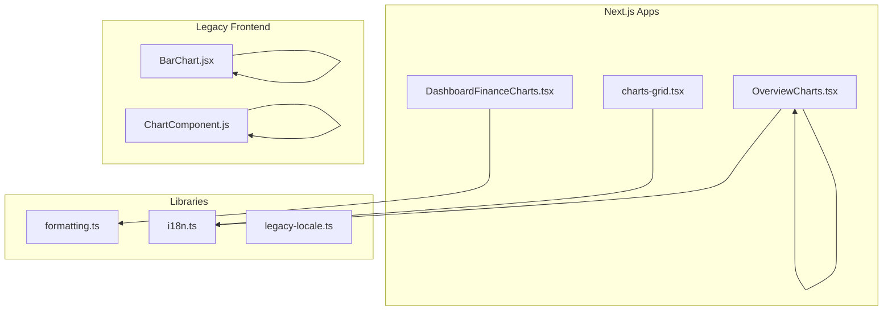
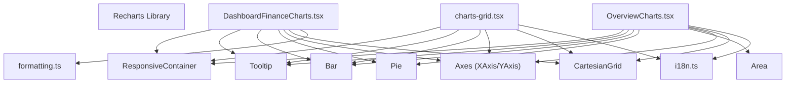
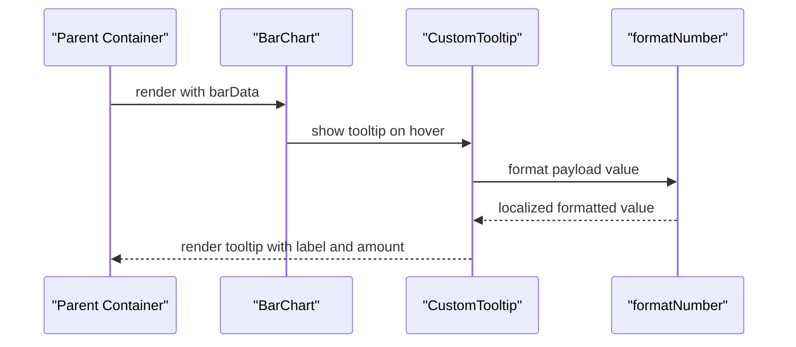
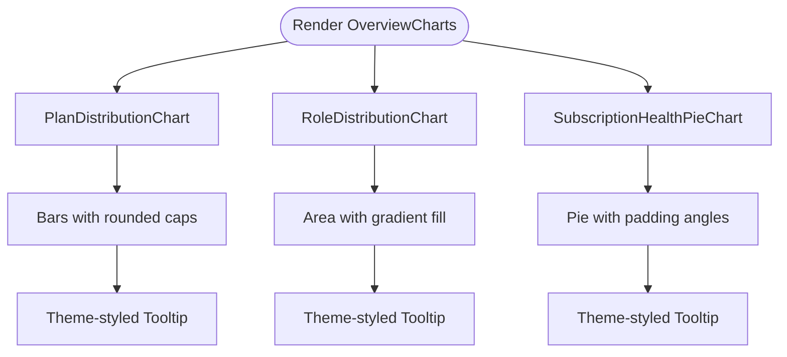
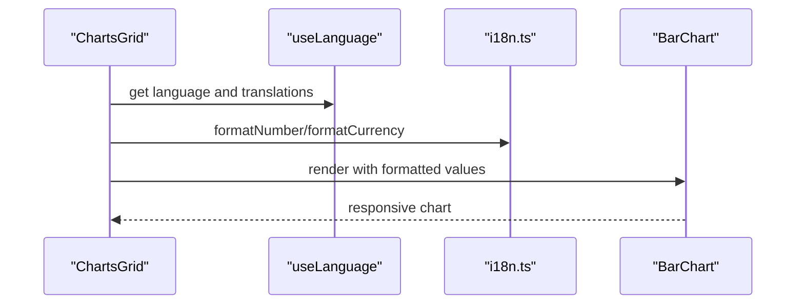
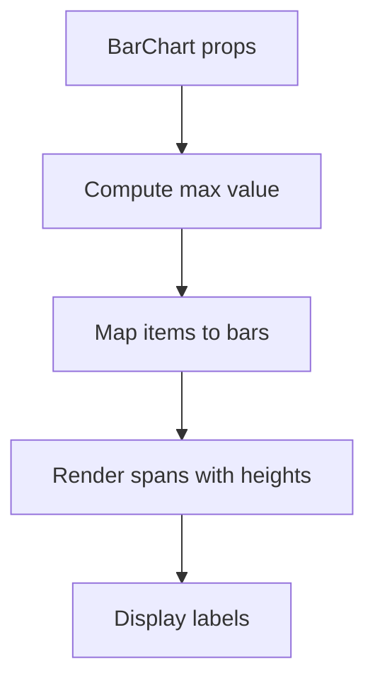
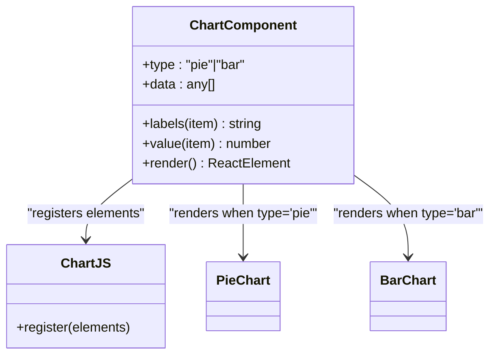
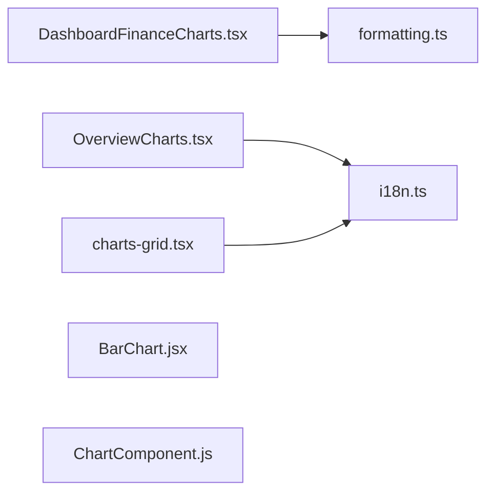

# Chart Components

<cite>
**Referenced Files in This Document**
- [DashboardFinanceCharts.tsx](file://components/DashboardFinanceCharts.tsx)
- [OverviewCharts.tsx](file://app/[locale]/super-admin/components/OverviewCharts.tsx)
- [BarChart.jsx](file://school-acc-system/frontend/src/components/BarChart.jsx)
- [ChartComponent.js](file://00990090/school-accounting-system/frontend/src/components/ChartComponent.js)
- [charts-grid.tsx](file://school-saas-next/src/components/dashboard/charts-grid.tsx)
- [i18n.ts](file://school-saas-next/src/lib/i18n.ts)
- [formatting.ts](file://lib/formatting.ts)
- [legacy-locale.ts](file://lib/legacy-locale.ts)
</cite>

## Table of Contents
1. [Introduction](#introduction)
2. [Project Structure](#project-structure)
3. [Core Components](#core-components)
4. [Architecture Overview](#architecture-overview)
5. [Detailed Component Analysis](#detailed-component-analysis)
6. [Dependency Analysis](#dependency-analysis)
7. [Performance Considerations](#performance-considerations)
8. [Troubleshooting Guide](#troubleshooting-guide)
9. [Conclusion](#conclusion)
10. [Appendices](#appendices)

## Introduction
This document describes the chart component library used across the school administration applications. It focuses on reusable data visualization components built with Recharts, including responsive chart containers, tooltip customization, and data formatting utilities. The documentation covers component architecture, prop interfaces, data transformation patterns, styling configurations, and practical examples for bar charts, pie charts, and mixed chart implementations. It also addresses accessibility, internationalization for Arabic and English, and performance optimization techniques. Guidance is included for extending components, adding new chart types, and implementing custom visualizations tailored to dashboard needs.

## Project Structure
The chart components are implemented across multiple Next.js applications and legacy frontends:
- A Recharts-based dashboard component with responsive containers and custom tooltips
- A set of specialized Recharts charts for administrative dashboards
- A lightweight bar chart component for simple rendering
- A Chart.js-based chart component for an alternate visualization stack
- A Recharts grid component integrating localization-aware formatting

**Diagram sources**
- [DashboardFinanceCharts.tsx:1-124](file://components/DashboardFinanceCharts.tsx#L1-L124)
- [OverviewCharts.tsx:1-120](file://app/[locale]/super-admin/components/OverviewCharts.tsx#L1-L120)
- [charts-grid.tsx:1-71](file://school-saas-next/src/components/dashboard/charts-grid.tsx#L1-L71)
- [BarChart.jsx:1-17](file://school-acc-system/frontend/src/components/BarChart.jsx#L1-L17)
- [ChartComponent.js:1-46](file://00990090/school-accounting-system/frontend/src/components/ChartComponent.js#L1-L46)
- [formatting.ts:1-3](file://lib/formatting.ts#L1-L3)
- [i18n.ts:776-786](file://school-saas-next/src/lib/i18n.ts#L776-L786)
- [legacy-locale.ts:182-205](file://lib/legacy-locale.ts#L182-L205)

**Section sources**
- [DashboardFinanceCharts.tsx:1-124](file://components/DashboardFinanceCharts.tsx#L1-L124)
- [OverviewCharts.tsx:1-120](file://app/[locale]/super-admin/components/OverviewCharts.tsx#L1-L120)
- [charts-grid.tsx:1-71](file://school-saas-next/src/components/dashboard/charts-grid.tsx#L1-L71)
- [BarChart.jsx:1-17](file://school-acc-system/frontend/src/components/BarChart.jsx#L1-L17)
- [ChartComponent.js:1-46](file://00990090/school-accounting-system/frontend/src/components/ChartComponent.js#L1-L46)
- [formatting.ts:1-3](file://lib/formatting.ts#L1-L3)
- [i18n.ts:776-786](file://school-saas-next/src/lib/i18n.ts#L776-L786)
- [legacy-locale.ts:182-205](file://lib/legacy-locale.ts#L182-L205)

## Core Components
This section outlines the primary chart components and their responsibilities.

- DashboardFinanceCharts
  - Purpose: Renders a two-column layout with a bar chart and a pie chart, plus a percentage badge.
  - Key features:
    - Responsive container for both charts
    - Custom tooltip for bar chart with localized currency formatting
    - Y-axis tick formatting and localized legend labels
    - Per-bar cell coloring via data entries
  - Props:
    - barData: array of objects with name, value, and fill
    - pieData: array of objects with name, value, and color
    - paidPct: number representing a percentage indicator
  - Data transformation:
    - Uses per-entry fill/color for bars and pie slices
    - Localized currency formatting via a formatting utility
  - Styling:
    - Tailwind-like CSS classes for layout and typography
    - Inline styles for tooltip appearance and axis fonts

- OverviewCharts
  - Purpose: Provides reusable Recharts components for plan distribution (bar), role distribution (area), and subscription health (pie).
  - Key features:
    - Responsive containers for each chart
    - Custom tooltips with theme-aware content styles
    - Gradient fills for area charts
    - Rounded bar radii and consistent axis styling
  - Props:
    - PlanDistributionChart: data with name, value, fill
    - RoleDistributionChart: data with name, value
    - SubscriptionHealthPieChart: data with name, value, fill
  - Styling:
    - CSS-in-JS contentStyle for tooltips
    - Theme variables for borders, backgrounds, and shadows

- charts-grid (Recharts grid)
  - Purpose: A dashboard grid integrating multiple Recharts charts with localization-aware formatting.
  - Key features:
    - Responsive containers for each chart
    - Currency and number formatters based on language
    - Color palette for multi-series bars
  - Props:
    - monthlyMetrics: array of monthly data
    - topSchools: array of top schools metrics
  - Styling:
    - Tailwind classes for layout and typography
    - Recharts theme variables for axes and grids

- BarChart (legacy)
  - Purpose: A minimal bar chart component rendering bars with proportional heights.
  - Props:
    - title: string header
    - data: array of items with label and value
  - Styling:
    - Inline styles for bar heights relative to the maximum value

- ChartComponent (Chart.js)
  - Purpose: A generic Chart.js wrapper supporting pie and bar charts with dynamic data mapping.
  - Props:
    - type: "pie" or "bar"
    - data: array of raw data
    - labels: function to extract labels
    - value: function to extract values
  - Styling:
    - Built-in color palette and legend positioning based on chart type

**Section sources**
- [DashboardFinanceCharts.tsx:31-123](file://components/DashboardFinanceCharts.tsx#L31-L123)
- [OverviewCharts.tsx:35-119](file://app/[locale]/super-admin/components/OverviewCharts.tsx#L35-L119)
- [charts-grid.tsx:20-71](file://school-saas-next/src/components/dashboard/charts-grid.tsx#L20-L71)
- [BarChart.jsx:1-17](file://school-acc-system/frontend/src/components/BarChart.jsx#L1-L17)
- [ChartComponent.js:8-45](file://00990090/school-accounting-system/frontend/src/components/ChartComponent.js#L8-L45)

## Architecture Overview
The chart architecture centers on Recharts for most dashboards, with optional Chart.js integration. Components share a common pattern:
- Responsive containers ensure charts adapt to their parent’s width and height
- Tooltips are customized either via content components or contentStyle
- Data is normalized into arrays of objects with name/value pairs
- Formatting utilities handle number and currency display based on language

**Diagram sources**
- [DashboardFinanceCharts.tsx:76-88](file://components/DashboardFinanceCharts.tsx#L76-L88)
- [OverviewCharts.tsx:37-58](file://app/[locale]/super-admin/components/OverviewCharts.tsx#L37-L58)
- [charts-grid.tsx:60-70](file://school-saas-next/src/components/dashboard/charts-grid.tsx#L60-L70)
- [formatting.ts:1-3](file://lib/formatting.ts#L1-L3)
- [i18n.ts:776-786](file://school-saas-next/src/lib/i18n.ts#L776-L786)

## Detailed Component Analysis

### DashboardFinanceCharts
- Implementation highlights
  - Custom tooltip component renders label and formatted currency
  - Bar chart with rounded corners and per-bar fill
  - Y-axis tick formatter for compact numeric display
  - Localized legend and tooltip labels
- Prop interfaces
  - barData: array of { name: string; value: number; fill: string }
  - pieData: array of { name: string; value: number; color: string }
  - paidPct: number
- Data transformation
  - Uses dataKey to map name/value to chart visuals
  - Applies per-cell fill for bars and pie slices
- Styling configuration
  - Inline styles for tooltip container and axis typography
  - CSS classes for layout and badges
- Accessibility and internationalization
  - Axis and legend text rendered in a local font family
  - Tooltip content localized for currency display
- Practical example
  - Bar chart: monthly financial breakdown
  - Pie chart: payment status distribution

**Diagram sources**
- [DashboardFinanceCharts.tsx:37-65](file://components/DashboardFinanceCharts.tsx#L37-L65)
- [DashboardFinanceCharts.tsx:76-88](file://components/DashboardFinanceCharts.tsx#L76-L88)
- [formatting.ts:1-1](file://lib/formatting.ts#L1-L1)

**Section sources**
- [DashboardFinanceCharts.tsx:31-123](file://components/DashboardFinanceCharts.tsx#L31-L123)
- [formatting.ts:1-3](file://lib/formatting.ts#L1-L3)

### OverviewCharts
- Implementation highlights
  - PlanDistributionChart: bar chart with gradient-like theme styling
  - RoleDistributionChart: area chart with linear gradient fill
  - SubscriptionHealthPieChart: pie chart with padding angles and theme styling
- Prop interfaces
  - PlanDatum: { name: string; value: number; fill: string }
  - RoleDatum: { name: string; value: number }
  - SubscriptionHealthDatum: { name: string; value: number; fill: string }
- Styling configuration
  - CSS-in-JS contentStyle for tooltips
  - Theme variables for borders, backgrounds, and shadows
- Accessibility and internationalization
  - Tooltip content styled with theme-aware colors
  - Axes configured with theme variables for consistent look

**Diagram sources**
- [OverviewCharts.tsx:35-119](file://app/[locale]/super-admin/components/OverviewCharts.tsx#L35-L119)

**Section sources**
- [OverviewCharts.tsx:18-119](file://app/[locale]/super-admin/components/OverviewCharts.tsx#L18-L119)

### charts-grid (Recharts Grid)
- Implementation highlights
  - Responsive containers for each chart
  - Currency and number formatting based on current language
  - Multi-series bar chart with a predefined color palette
- Prop interfaces
  - monthlyMetrics: array of monthly data
  - topSchools: array of top schools metrics
- Styling configuration
  - Tailwind classes for layout and typography
  - Recharts theme variables for axes and grids

**Diagram sources**
- [charts-grid.tsx:27-71](file://school-saas-next/src/components/dashboard/charts-grid.tsx#L27-L71)
- [i18n.ts:776-786](file://school-saas-next/src/lib/i18n.ts#L776-L786)

**Section sources**
- [charts-grid.tsx:20-71](file://school-saas-next/src/components/dashboard/charts-grid.tsx#L20-L71)
- [i18n.ts:776-786](file://school-saas-next/src/lib/i18n.ts#L776-L786)

### BarChart (legacy)
- Implementation highlights
  - Computes max value to normalize bar heights
  - Renders proportional bars with labels
- Prop interfaces
  - title: string
  - data: array of { label: string; value: number }
- Styling configuration
  - Inline styles for bar heights
  - Minimal CSS classes for layout

**Diagram sources**
- [BarChart.jsx:1-17](file://school-acc-system/frontend/src/components/BarChart.jsx#L1-L17)

**Section sources**
- [BarChart.jsx:1-17](file://school-acc-system/frontend/src/components/BarChart.jsx#L1-L17)

### ChartComponent (Chart.js)
- Implementation highlights
  - Registers Chart.js elements and components
  - Accepts dynamic labels and values via functions
  - Supports pie and bar chart types
- Prop interfaces
  - type: "pie" or "bar"
  - data: array of raw data
  - labels: function extracting labels
  - value: function extracting values
- Styling configuration
  - Built-in color palette and legend positioning
  - Responsive options with aspect ratio maintained

**Diagram sources**
- [ChartComponent.js:3-6](file://00990090/school-accounting-system/frontend/src/components/ChartComponent.js#L3-L6)
- [ChartComponent.js:8-45](file://00990090/school-accounting-system/frontend/src/components/ChartComponent.js#L8-L45)

**Section sources**
- [ChartComponent.js:1-46](file://00990090/school-accounting-system/frontend/src/components/ChartComponent.js#L1-L46)

## Dependency Analysis
- Internal dependencies
  - DashboardFinanceCharts depends on formatting utilities for currency display
  - OverviewCharts and charts-grid depend on i18n utilities for number and currency formatting
  - BarChart is self-contained with no external dependencies
  - ChartComponent depends on Chart.js ecosystem
- External dependencies
  - Recharts for responsive containers, axes, grids, tooltips, and chart primitives
  - Chart.js for an alternative charting stack

**Diagram sources**
- [DashboardFinanceCharts.tsx:17-17](file://components/DashboardFinanceCharts.tsx#L17-L17)
- [OverviewCharts.tsx:1-16](file://app/[locale]/super-admin/components/OverviewCharts.tsx#L1-L16)
- [charts-grid.tsx:16-17](file://school-saas-next/src/components/dashboard/charts-grid.tsx#L16-L17)
- [BarChart.jsx:1-1](file://school-acc-system/frontend/src/components/BarChart.jsx#L1-L1)
- [ChartComponent.js:3-4](file://00990090/school-accounting-system/frontend/src/components/ChartComponent.js#L3-L4)

**Section sources**
- [DashboardFinanceCharts.tsx:1-18](file://components/DashboardFinanceCharts.tsx#L1-L18)
- [OverviewCharts.tsx:1-16](file://app/[locale]/super-admin/components/OverviewCharts.tsx#L1-L16)
- [charts-grid.tsx:1-18](file://school-saas-next/src/components/dashboard/charts-grid.tsx#L1-L18)
- [BarChart.jsx:1-1](file://school-acc-system/frontend/src/components/BarChart.jsx#L1-L1)
- [ChartComponent.js:1-6](file://00990090/school-accounting-system/frontend/src/components/ChartComponent.js#L1-L6)

## Performance Considerations
- Prefer Recharts’ ResponsiveContainer to avoid manual resize listeners and reduce layout thrashing
- Memoize data transformations and formatting functions to prevent unnecessary re-renders
- Limit the number of animated chart elements; disable animations for large datasets
- Use CSS-in-JS contentStyle for tooltips sparingly; consider pre-rendered HTML for heavy content
- Defer rendering of charts until after hydration in client-only contexts
- For Chart.js components, keep registration centralized to avoid repeated registrations

## Troubleshooting Guide
- Empty or missing data
  - Ensure data arrays are non-empty; provide fallback UI when data is unavailable
- Tooltip not appearing
  - Verify Tooltip component is present and content is properly configured
- Incorrect number formatting
  - Confirm language selection and formatting utilities are applied consistently
- RTL layout issues
  - Validate direction and locale settings; adjust axis and legend alignment accordingly
- Color mismatches
  - Ensure data keys align with chart dataKey and per-cell fill mapping

**Section sources**
- [ChartComponent.js:9-11](file://00990090/school-accounting-system/frontend/src/components/ChartComponent.js#L9-L11)
- [DashboardFinanceCharts.tsx:37-65](file://components/DashboardFinanceCharts.tsx#L37-L65)
- [i18n.ts:764-770](file://school-saas-next/src/lib/i18n.ts#L764-L770)

## Conclusion
The chart component library combines Recharts-based dashboards with lightweight alternatives, emphasizing responsive design, customizable tooltips, and robust formatting utilities. By standardizing prop interfaces, data transformation, and styling, teams can extend the library with new chart types, integrate localization seamlessly, and optimize performance for diverse dashboard scenarios.

## Appendices

### Extending Chart Components
- Add new chart types
  - Define a new component similar to OverviewCharts with a dedicated data interface
  - Wrap charts in ResponsiveContainer and configure Tooltip and axes
- Integrate localization
  - Use i18n utilities for number and currency formatting
  - Apply theme variables for consistent styling across light/dark modes
- Implement custom visualizations
  - For Recharts, leverage gradients, custom ticks, and legends
  - For Chart.js, centralize element registration and reuse options

### Internationalization and Accessibility
- Language and direction
  - Use language utilities to select locales and directions
  - Ensure axis and legend text supports RTL when applicable
- Accessibility
  - Provide aria-labels and descriptions for complex charts
  - Ensure sufficient color contrast and readable font sizes

### Data Formatting Utilities
- Number formatting
  - Use locale-aware formatting for numbers and currencies
- Legacy text translation
  - Bridge legacy Arabic strings to English when needed

**Section sources**
- [i18n.ts:764-786](file://school-saas-next/src/lib/i18n.ts#L764-L786)
- [legacy-locale.ts:182-205](file://lib/legacy-locale.ts#L182-L205)
- [formatting.ts:1-3](file://lib/formatting.ts#L1-L3)