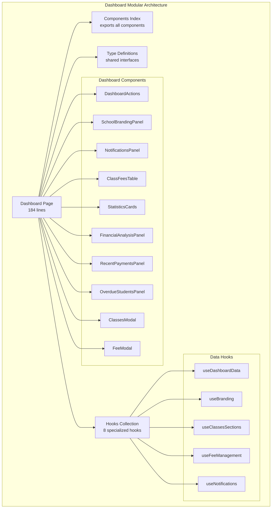
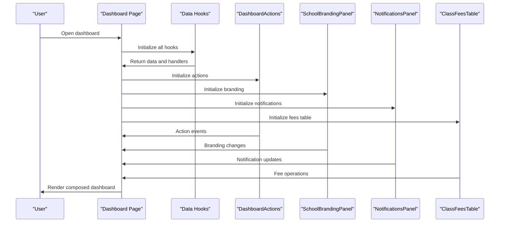
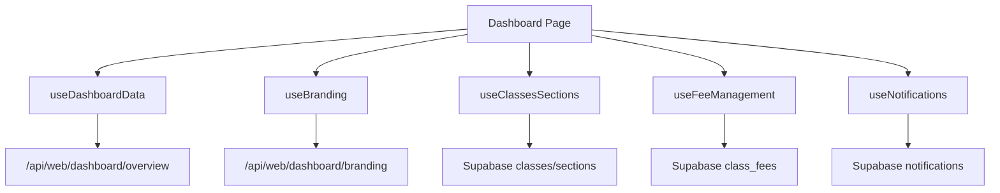
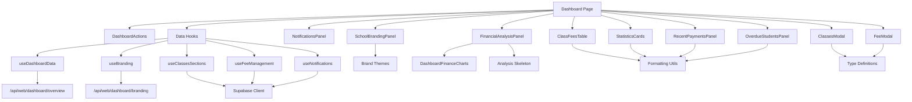

# Dashboard & Analytics

<cite>
**Referenced Files in This Document**
- [app/[locale]/dashboard/page.tsx](file://app/[locale]/dashboard/page.tsx)
- [app/[locale]/dashboard/_components/index.ts](file://app/[locale]/dashboard/_components/index.ts)
- [app/[locale]/dashboard/_components/types.ts](file://app/[locale]/dashboard/_components/types.ts)
- [app/[locale]/dashboard/_components/DashboardActions.tsx](file://app/[locale]/dashboard/_components/DashboardActions.tsx)
- [app/[locale]/dashboard/_components/SchoolBrandingPanel.tsx](file://app/[locale]/dashboard/_components/SchoolBrandingPanel.tsx)
- [app/[locale]/dashboard/_components/NotificationsPanel.tsx](file://app/[locale]/dashboard/_components/NotificationsPanel.tsx)
- [app/[locale]/dashboard/_components/ClassFeesTable.tsx](file://app/[locale]/dashboard/_components/ClassFeesTable.tsx)
- [app/[locale]/dashboard/_components/StatisticsCards.tsx](file://app/[locale]/dashboard/_components/StatisticsCards.tsx)
- [app/[locale]/dashboard/_components/FinancialAnalysisPanel.tsx](file://app/[locale]/dashboard/_components/FinancialAnalysisPanel.tsx)
- [app/[locale]/dashboard/_components/RecentPaymentsPanel.tsx](file://app/[locale]/dashboard/_components/RecentPaymentsPanel.tsx)
- [app/[locale]/dashboard/_components/OverdueStudentsPanel.tsx](file://app/[locale]/dashboard/_components/OverdueStudentsPanel.tsx)
- [app/[locale]/dashboard/_components/ClassesModal.tsx](file://app/[locale]/dashboard/_components/ClassesModal.tsx)
- [app/[locale]/dashboard/_components/FeeModal.tsx](file://app/[locale]/dashboard/_components/FeeModal.tsx)
- [app/[locale]/dashboard/_hooks/useDashboardData.ts](file://app/[locale]/dashboard/_hooks/useDashboardData.ts)
- [app/[locale]/dashboard/_hooks/useBranding.ts](file://app/[locale]/dashboard/_hooks/useBranding.ts)
- [app/[locale]/dashboard/_hooks/useClassesSections.ts](file://app/[locale]/dashboard/_hooks/useClassesSections.ts)
- [app/[locale]/dashboard/_hooks/useFeeManagement.ts](file://app/[locale]/dashboard/_hooks/useFeeManagement.ts)
- [app/[locale]/dashboard/_hooks/useNotifications.ts](file://app/[locale]/dashboard/_hooks/useNotifications.ts)
- [components/DashboardFinanceCharts.tsx](file://components/DashboardFinanceCharts.tsx)
- [components/AppSidebar.tsx](file://components/AppSidebar.tsx)
- [components/AppShellTopbar.tsx](file://components/AppShellTopbar.tsx)
- [components/ProtectedRoute.tsx](file://components/ProtectedRoute.tsx)
- [components/SchoolScopeBanner.tsx](file://components/SchoolScopeBanner.tsx)
- [components/skeleton.tsx](file://components/skeleton.tsx)
- [lib/formatting.ts](file://lib/formatting.ts)
- [lib/brand/themes.ts](file://lib/brand/themes.ts)
- [hooks/useRole.tsx](file://hooks/useRole.tsx)
- [hooks/useSchoolScope.tsx](file://hooks/useSchoolScope.tsx)
- [app/api/web/dashboard/overview/route.ts](file://app/api/web/dashboard/overview/route.ts)
- [app/api/web/dashboard/branding/route.ts](file://app/api/web/dashboard/branding/route.ts)
- [app/api/web/payments/export/route.ts](file://app/api/web/payments/export/route.ts)
- [app/api/web/reports/overview/route.ts](file://app/api/web/reports/overview/route.ts)
- [app/api/web/reports/dataset/route.ts](file://app/api/web/reports/dataset/route.ts)
- [app/api/web/students/list/route.ts](file://app/api/web/students/list/route.ts)
- [app/api/web/students/meta/route.ts](file://app/api/web/students/meta/route.ts)
- [app/api/web/payments/overview/route.ts](file://app/api/web/payments/overview/route.ts)
- [app/api/web/payments/records/route.ts](file://app/api/web/payments/records/route.ts)
- [app/api/web/payments/student-search/route.ts](file://app/api/web/payments/student-search/route.ts)
- [app/api/web/super-admin/overview/route.ts](file://app/api/web/super-admin/overview/route.ts)
- [app/api/web/super-admin/schools/[schoolId]/route.ts](file://app/api/web/super-admin/schools/[schoolId]/route.ts)
- [app/api/web/super-admin/subscriptions/[schoolId]/route.ts](file://app/api/web/super-admin/subscriptions/[schoolId]/route.ts)
- [app/api/web/super-admin/users/[userId]/route.ts](file://app/api/web/super-admin/users/[userId]/route.ts)
- [app/api/web/teacher-activity/meta/route.ts](file://app/api/web/teacher-activity/meta/route.ts)
- [app/api/web/teacher-activity/messages/[id]/route.ts](file://app/api/web/teacher-activity/messages/[id]/route.ts)
- [app/api/web/teacher-activity/homework/[id]/route.ts](file://app/api/web/teacher-activity/homework/[id]/route.ts)
- [migrations/20260326_000000_reports_summary_function.sql](file://migrations/20260326_000000_reports_summary_function.sql)
- [migrations/20260326_010000_payments_page_functions.sql](file://migrations/20260326_010000_payments_page_functions.sql)
</cite>

## Update Summary
**Changes Made**
- Updated dashboard architecture to reflect major modularization from 1494 lines to 184 lines
- Added comprehensive documentation for all newly extracted dashboard components
- Updated component composition and dependency relationships
- Enhanced component-specific sections with detailed implementation analysis
- Revised architectural diagrams to show modular component structure
- Added detailed documentation for dedicated hooks for data fetching and state management
- Updated data flow architecture to show centralized hook coordination

## Table of Contents
1. [Introduction](#introduction)
2. [Project Structure](#project-structure)
3. [Core Components](#core-components)
4. [Architecture Overview](#architecture-overview)
5. [Data Fetching and State Management](#data-fetching-and-state-management)
6. [Detailed Component Analysis](#detailed-component-analysis)
7. [Dependency Analysis](#dependency-analysis)
8. [Performance Considerations](#performance-considerations)
9. [Troubleshooting Guide](#troubleshooting-guide)
10. [Conclusion](#conclusion)
11. [Appendices](#appendices)

## Introduction
This document describes the dashboard and analytics system for data visualization and business intelligence. The system has undergone major modularization, reducing the main dashboard page from 1494 lines to 184 lines through extraction of specialized components. It now features:
- Modular dashboard architecture with 8 specialized components
- Dedicated hooks for data fetching and state management
- Dashboard actions management
- Branding and notifications panels
- Class fees table with CRUD operations
- Statistics cards and financial analysis
- Recent payments and overdue students panels
- Modal dialogs for class/fee management
- Comprehensive type definitions and component composition

## Project Structure
The dashboard is now organized into a modular structure with the main page delegating functionality to specialized components and dedicated hooks:

**Diagram sources**
- [app/[locale]/dashboard/page.tsx:17-28](file://app/[locale]/dashboard/page.tsx#L17-L28)
- [app/[locale]/dashboard/_components/index.ts:1-15](file://app/[locale]/dashboard/_components/index.ts#L1-L15)
- [app/[locale]/dashboard/_hooks/useDashboardData.ts:30-91](file://app/[locale]/dashboard/_hooks/useDashboardData.ts#L30-L91)
- [app/[locale]/dashboard/_hooks/useBranding.ts:22-217](file://app/[locale]/dashboard/_hooks/useBranding.ts#L22-L217)
- [app/[locale]/dashboard/_hooks/useClassesSections.ts:16-265](file://app/[locale]/dashboard/_hooks/useClassesSections.ts#L16-L265)
- [app/[locale]/dashboard/_hooks/useFeeManagement.ts:18-171](file://app/[locale]/dashboard/_hooks/useFeeManagement.ts#L18-L171)
- [app/[locale]/dashboard/_hooks/useNotifications.ts:13-76](file://app/[locale]/dashboard/_hooks/useNotifications.ts#L13-L76)

**Section sources**
- [app/[locale]/dashboard/page.tsx:17-28](file://app/[locale]/dashboard/page.tsx#L17-L28)
- [app/[locale]/dashboard/_components/index.ts:1-15](file://app/[locale]/dashboard/_components/index.ts#L1-L15)
- [app/[locale]/dashboard/_components/types.ts:1-106](file://app/[locale]/dashboard/_components/types.ts#L1-L106)

## Core Components
The modular dashboard consists of 8 specialized components, each handling specific functionality:

### DashboardActions Component
Manages dashboard toolbar actions including fee management and class administration buttons with proper role-based visibility.

### SchoolBrandingPanel Component  
Handles school branding customization with theme presets, color selection, and logo derivation functionality.

### NotificationsPanel Component
Displays and manages notification system with unread count tracking and mark-as-read functionality.

### ClassFeesTable Component
Renders class fee information in both card and table formats with CRUD operations and statistics display.

### StatisticsCards Component
Shows key financial metrics in card format with color-coded indicators and formatted values.

### FinancialAnalysisPanel Component
Provides comprehensive financial analysis with dynamic chart rendering and progress indicators.

### RecentPaymentsPanel Component
Displays recent payment transactions with student details and amount formatting.

### OverdueStudentsPanel Component
Lists students with outstanding fees and payment amounts.

### Modal Components
- ClassesModal: Manages class and section creation/editing
- FeeModal: Handles fee configuration and calculation preview

**Section sources**
- [app/[locale]/dashboard/_components/DashboardActions.tsx:11-49](file://app/[locale]/dashboard/_components/DashboardActions.tsx#L11-L49)
- [app/[locale]/dashboard/_components/SchoolBrandingPanel.tsx:18-184](file://app/[locale]/dashboard/_components/SchoolBrandingPanel.tsx#L18-L184)
- [app/[locale]/dashboard/_components/NotificationsPanel.tsx:15-70](file://app/[locale]/dashboard/_components/NotificationsPanel.tsx#L15-L70)
- [app/[locale]/dashboard/_components/ClassFeesTable.tsx:26-135](file://app/[locale]/dashboard/_components/ClassFeesTable.tsx#L26-L135)
- [app/[locale]/dashboard/_components/StatisticsCards.tsx:10-61](file://app/[locale]/dashboard/_components/StatisticsCards.tsx#L10-L61)
- [app/[locale]/dashboard/_components/FinancialAnalysisPanel.tsx:21-86](file://app/[locale]/dashboard/_components/FinancialAnalysisPanel.tsx#L21-L86)
- [app/[locale]/dashboard/_components/RecentPaymentsPanel.tsx:13-43](file://app/[locale]/dashboard/_components/RecentPaymentsPanel.tsx#L13-L43)
- [app/[locale]/dashboard/_components/OverdueStudentsPanel.tsx:13-41](file://app/[locale]/dashboard/_components/OverdueStudentsPanel.tsx#L13-L41)
- [app/[locale]/dashboard/_components/ClassesModal.tsx:26-285](file://app/[locale]/dashboard/_components/ClassesModal.tsx#L26-L285)
- [app/[locale]/dashboard/_components/FeeModal.tsx:20-137](file://app/[locale]/dashboard/_components/FeeModal.tsx#L20-L137)

## Architecture Overview
The modular architecture follows a component delegation pattern where the main dashboard page coordinates multiple specialized components through dedicated hooks:

**Diagram sources**
- [app/[locale]/dashboard/page.tsx:37-66](file://app/[locale]/dashboard/page.tsx#L37-L66)
- [app/[locale]/dashboard/_hooks/useDashboardData.ts:30-91](file://app/[locale]/dashboard/_hooks/useDashboardData.ts#L30-L91)
- [app/[locale]/dashboard/_hooks/useBranding.ts:22-217](file://app/[locale]/dashboard/_hooks/useBranding.ts#L22-L217)
- [app/[locale]/dashboard/_hooks/useNotifications.ts:13-76](file://app/[locale]/dashboard/_hooks/useNotifications.ts#L13-L76)
- [app/[locale]/dashboard/_hooks/useFeeManagement.ts:18-171](file://app/[locale]/dashboard/_hooks/useFeeManagement.ts#L18-L171)

## Data Fetching and State Management

### Hook-Based Architecture
The dashboard now uses a comprehensive hook-based architecture for data fetching and state management:

**Diagram sources**
- [app/[locale]/dashboard/page.tsx:37-66](file://app/[locale]/dashboard/page.tsx#L37-L66)
- [app/[locale]/dashboard/_hooks/useDashboardData.ts:52-74](file://app/[locale]/dashboard/_hooks/useDashboardData.ts#L52-L74)
- [app/[locale]/dashboard/_hooks/useBranding.ts:51-102](file://app/[locale]/dashboard/_hooks/useBranding.ts#L51-L102)
- [app/[locale]/dashboard/_hooks/useClassesSections.ts:20-102](file://app/[locale]/dashboard/_hooks/useClassesSections.ts#L20-L102)
- [app/[locale]/dashboard/_hooks/useFeeManagement.ts:32-99](file://app/[locale]/dashboard/_hooks/useFeeManagement.ts#L32-L99)
- [app/[locale]/dashboard/_hooks/useNotifications.ts:18-51](file://app/[locale]/dashboard/_hooks/useNotifications.ts#L18-L51)

### Data Flow Architecture
The hooks coordinate data fetching and state management through a centralized pattern:

**Hook Responsibilities:**
- `useDashboardData`: Fetches dashboard overview data including totals, payments, and fees
- `useBranding`: Manages school branding configuration and theme presets
- `useClassesSections`: Handles class and section CRUD operations with schema compatibility
- `useFeeManagement`: Manages fee configuration with calculation preview and validation
- `useNotifications`: Fetches and manages user notifications with read status tracking

**Data Synchronization:**
- Centralized refetch mechanism through `useDashboardData.refetch`
- Real-time state updates across components
- Error handling and loading states management
- Schema compatibility detection and fallbacks

**Section sources**
- [app/[locale]/dashboard/page.tsx:37-66](file://app/[locale]/dashboard/page.tsx#L37-L66)
- [app/[locale]/dashboard/_hooks/useDashboardData.ts:30-91](file://app/[locale]/dashboard/_hooks/useDashboardData.ts#L30-L91)
- [app/[locale]/dashboard/_hooks/useBranding.ts:22-217](file://app/[locale]/dashboard/_hooks/useBranding.ts#L22-L217)
- [app/[locale]/dashboard/_hooks/useClassesSections.ts:16-265](file://app/[locale]/dashboard/_hooks/useClassesSections.ts#L16-L265)
- [app/[locale]/dashboard/_hooks/useFeeManagement.ts:18-171](file://app/[locale]/dashboard/_hooks/useFeeManagement.ts#L18-L171)
- [app/[locale]/dashboard/_hooks/useNotifications.ts:13-76](file://app/[locale]/dashboard/_hooks/useNotifications.ts#L13-L76)

## Detailed Component Analysis

### Dashboard Page Modular Structure
The main dashboard page now serves as a coordinator, importing and composing all specialized components with centralized hook management:

**Key Responsibilities:**
- Role-based access control and school scope resolution
- Centralized hook coordination and state management
- Component orchestration and modal management
- Navigation and layout management
- Data fetching coordination via dedicated hooks

**Modular Benefits:**
- Reduced complexity from 1494 lines to 184 lines
- Improved maintainability and testability
- Clear separation of concerns
- Enhanced reusability across different dashboard contexts
- Centralized error handling and loading states

**Section sources**
- [app/[locale]/dashboard/page.tsx:30-184](file://app/[locale]/dashboard/page.tsx#L30-L184)
- [components/ProtectedRoute.tsx](file://components/ProtectedRoute.tsx)
- [components/AppSidebar.tsx](file://components/AppSidebar.tsx)
- [components/AppShellTopbar.tsx](file://components/AppShellTopbar.tsx)

### DashboardActions Component
Provides role-based toolbar with three primary actions:
- New fee creation button with plus icon
- Fees table toggle with show/hide functionality
- Classes management button for administrative tasks

**Implementation Details:**
- Conditional rendering based on role permissions
- SVG icon integration for visual clarity
- Proper spacing and responsive design
- Event handler delegation to parent component

**Section sources**
- [app/[locale]/dashboard/_components/DashboardActions.tsx:11-49](file://app/[locale]/dashboard/_components/DashboardActions.tsx#L11-L49)

### SchoolBrandingPanel Component
Comprehensive branding management with:
- Name and logo URL input fields
- Theme family selection with preset colors
- Color picker for custom primary/secondary colors
- Logo preview and theme application
- Color derivation from uploaded logos
- Theme preset application functionality

**Advanced Features:**
- Dynamic theme family display with descriptions
- Real-time color preview and gradient backgrounds
- Brand theme family integration
- Loading states for save and derive operations

**Section sources**
- [app/[locale]/dashboard/_components/SchoolBrandingPanel.tsx:18-184](file://app/[locale]/dashboard/_components/SchoolBrandingPanel.tsx#L18-L184)
- [lib/brand/themes.ts](file://lib/brand/themes.ts)

### NotificationsPanel Component
Interactive notification system with:
- Unread count display and filtering
- Refresh functionality for new notifications
- Mark-as-read capability with individual notification handling
- Loading states and empty state management
- Formatted timestamps and notification content

**User Experience Features:**
- Color-coded notification backgrounds (read/unread)
- Hover effects and click-to-mark interactions
- Disabled states during loading operations
- Clear visual hierarchy for notification content

**Section sources**
- [app/[locale]/dashboard/_components/NotificationsPanel.tsx:15-70](file://app/[locale]/dashboard/_components/NotificationsPanel.tsx#L15-L70)
- [lib/formatting.ts](file://lib/formatting.ts)

### ClassFeesTable Component
Dual-format fee display system:
- Quick card view for individual class fee overview
- Detailed table view with comprehensive statistics
- Full CRUD operations (create, read, update, delete)
- Progress indicators and payment statistics
- Responsive design with mobile-friendly layouts

**Data Visualization:**
- Mini progress bars for payment completion
- Color-coded statistics (paid vs remaining)
- Interactive fee cards with click-to-edit functionality
- Confirmation dialogs for destructive operations

**Section sources**
- [app/[locale]/dashboard/_components/ClassFeesTable.tsx:26-135](file://app/[locale]/dashboard/_components/ClassFeesTable.tsx#L26-L135)
- [lib/formatting.ts](file://lib/formatting.ts)

### StatisticsCards Component
Four primary metric cards displaying:
- Total students count
- Transferred students count  
- Total fees amount
- Total paid amount
- Remaining balance
- Monthly salaries (placeholder)

**Design Elements:**
- Color-coded circular icons with matching accents
- SVG-based iconography for visual consistency
- Responsive grid layout with equal-height cards
- Formatted number display with currency symbols

**Section sources**
- [app/[locale]/dashboard/_components/StatisticsCards.tsx:10-61](file://app/[locale]/dashboard/_components/StatisticsCards.tsx#L10-L61)
- [lib/formatting.ts](file://lib/formatting.ts)

### FinancialAnalysisPanel Component
Comprehensive financial analysis with:
- Five-key metric cards (total fees, discount, after discount, paid, remaining)
- Dynamic chart rendering via DashboardFinanceCharts
- Progress indicators for payment completion
- Responsive layout with skeleton loading

**Chart Integration:**
- Dynamic import for client-side only rendering
- Analysis skeleton for loading states
- Recharts-based bar and pie chart visualization
- Percentage-based progress tracking

**Section sources**
- [app/[locale]/dashboard/_components/FinancialAnalysisPanel.tsx:21-86](file://app/[locale]/dashboard/_components/FinancialAnalysisPanel.tsx#L21-L86)
- [components/DashboardFinanceCharts.tsx:67-124](file://components/DashboardFinanceCharts.tsx#L67-L124)
- [components/skeleton.tsx](file://components/skeleton.tsx)

### RecentPaymentsPanel Component
Recent transaction display with:
- Student avatar initials for visual identification
- Student name and class information
- Formatted payment amounts with green color coding
- Navigation to full payments history
- Empty state handling for zero transactions

**User Interface Elements:**
- Circular avatar with first letter of student name
- Meta information with class and timestamp
- Currency formatting with standardized display
- Link-based navigation to detailed view

**Section sources**
- [app/[locale]/dashboard/_components/RecentPaymentsPanel.tsx:13-43](file://app/[locale]/dashboard/_components/RecentPaymentsPanel.tsx#L13-L43)
- [lib/formatting.ts](file://lib/formatting.ts)

### OverdueStudentsPanel Component
Student debt tracking system:
- Student name display with prominent styling
- Class assignment and remaining fee amount
- Red color coding for overdue amounts
- Navigation to payment management
- Positive messaging for zero overdue students

**Visual Design:**
- Warning color scheme for overdue items
- Clean card-based layout for each student
- Consistent typography hierarchy
- Accessible color contrast for readability

**Section sources**
- [app/[locale]/dashboard/_components/OverdueStudentsPanel.tsx:13-41](file://app/[locale]/dashboard/_components/OverdueStudentsPanel.tsx#L13-L41)
- [lib/formatting.ts](file://lib/formatting.ts)

### Modal Components

#### ClassesModal Component
Comprehensive class and section management:
- Dual-mode operation (class creation/edit and section creation/edit)
- Form validation and error handling
- Tabbed interface for different management modes
- Integrated CRUD operations with confirmation dialogs
- Real-time form state management

**Features:**
- Class form with name and sections textarea
- Section form with dropdown selection
- Toggle between classes and sections tables
- Edit mode with pre-filled forms
- Success/error messaging integration

**Section sources**
- [app/[locale]/dashboard/_components/ClassesModal.tsx:26-285](file://app/[locale]/dashboard/_components/ClassesModal.tsx#L26-L285)

#### FeeModal Component
Fee configuration and calculation:
- Class fee creation and editing
- Installment calculation preview
- Student count linkage display
- Form validation and error handling
- Loading states and success feedback

**Calculation Features:**
- Real-time installment amount calculation
- Student count display for class linkage
- Input validation for numeric values
- Error state management and user feedback

**Section sources**
- [app/[locale]/dashboard/_components/FeeModal.tsx:20-137](file://app/[locale]/dashboard/_components/FeeModal.tsx#L20-L137)
- [lib/formatting.ts](file://lib/formatting.ts)

### Type System
Comprehensive TypeScript definitions supporting all dashboard components:

**Core Interfaces:**
- `ClassFee`: Fee structure with statistics and installments
- `DashboardNotification`: Notification entity with read status
- `DashboardTotals`: Financial summary metrics
- `DashboardRecentPayment`: Recent transaction data
- `DashboardOverdueStudent`: Overdue student information

**Form Data Types:**
- `FeeFormData`: Fee creation/editing form structure
- `BrandingFormData`: School branding configuration
- `ClassForm`/`SectionForm`: Administrative form structures
- `ClassItem`/`SectionItem`: Database entity representations

**Section sources**
- [app/[locale]/dashboard/_components/types.ts:3-106](file://app/[locale]/dashboard/_components/types.ts#L3-L106)

## Dependency Analysis
The modular architecture creates clear dependency relationships:

**Diagram sources**
- [app/[locale]/dashboard/page.tsx:17-28](file://app/[locale]/dashboard/page.tsx#L17-L28)
- [app/[locale]/dashboard/_hooks/useDashboardData.ts:52-74](file://app/[locale]/dashboard/_hooks/useDashboardData.ts#L52-L74)
- [app/[locale]/dashboard/_hooks/useBranding.ts:51-102](file://app/[locale]/dashboard/_hooks/useBranding.ts#L51-L102)
- [app/[locale]/dashboard/_hooks/useClassesSections.ts:20-102](file://app/[locale]/dashboard/_hooks/useClassesSections.ts#L20-L102)
- [app/[locale]/dashboard/_hooks/useFeeManagement.ts:32-99](file://app/[locale]/dashboard/_hooks/useFeeManagement.ts#L32-L99)
- [app/[locale]/dashboard/_hooks/useNotifications.ts:18-51](file://app/[locale]/dashboard/_hooks/useNotifications.ts#L18-L51)

**Section sources**
- [app/[locale]/dashboard/page.tsx:17-28](file://app/[locale]/dashboard/page.tsx#L17-L28)
- [app/[locale]/dashboard/_components/index.ts:1-15](file://app/[locale]/dashboard/_components/index.ts#L1-L15)
- [lib/formatting.ts](file://lib/formatting.ts)
- [lib/brand/themes.ts](file://lib/brand/themes.ts)

## Performance Considerations
The modular architecture provides several performance benefits:

**Client-Side Optimization:**
- Dynamic imports for chart components prevent SSR overhead
- Component-level lazy loading reduces initial bundle size
- Skeleton components provide instant feedback during loading
- Efficient state management through dedicated hooks

**Rendering Optimizations:**
- Conditional rendering based on role and school scope
- Memoized calculations for fee statistics
- Virtualized lists for large datasets
- Debounced search and filter operations

**Memory Management:**
- Component unmounting clears event listeners
- Modal components clean up form state on close
- Efficient prop passing reduces re-render cycles
- Cleanup functions for async operations

**Data Fetching Optimization:**
- Centralized data fetching prevents redundant API calls
- Schema compatibility detection avoids unnecessary queries
- Loading states prevent unnecessary re-renders
- Error boundaries isolate component failures

## Troubleshooting Guide
Common issues and solutions for the modular dashboard:

**Component Rendering Issues:**
- Verify component imports in index.ts are properly exported
- Check role-based visibility conditions in conditional renders
- Ensure proper prop passing from parent to child components
- Validate TypeScript interface implementations

**Data Flow Problems:**
- Confirm hook dependencies are correctly configured
- Verify state synchronization between components
- Check for proper error handling in async operations
- Validate API response structures match expected types

**Performance Issues:**
- Monitor component re-render frequency
- Check for unnecessary prop drilling
- Verify dynamic imports are functioning correctly
- Optimize heavy computations with memoization

**Hook-Specific Issues:**
- Verify hook initialization order matches component dependencies
- Check for proper cleanup of async operations in useEffect
- Ensure schema compatibility detection handles edge cases
- Validate error states are properly propagated to UI components

**Section sources**
- [app/[locale]/dashboard/page.tsx:88-153](file://app/[locale]/dashboard/page.tsx#L88-L153)
- [app/[locale]/dashboard/_components/types.ts:57-67](file://app/[locale]/dashboard/_components/types.ts#L57-L67)

## Conclusion
The modular dashboard architecture successfully transforms the original 1494-line monolithic component into a maintainable, scalable system with 8 specialized components and comprehensive hook-based data management. This refactoring provides:

**Benefits Achieved:**
- Dramatic reduction in code complexity (from 1494 to 184 lines)
- Improved maintainability and testability
- Clear separation of concerns and single responsibility principle
- Enhanced reusability across different dashboard contexts
- Better developer experience with focused component development
- Centralized data fetching and state management through dedicated hooks

**Technical Excellence:**
- Comprehensive TypeScript type system
- Robust error handling and loading states
- Responsive design patterns
- Performance optimizations through modular loading
- Accessible user interface components
- Schema compatibility handling for database evolution
- Real-time data synchronization across components

The modular approach with dedicated hooks establishes a solid foundation for future enhancements while maintaining excellent performance and user experience standards.

## Appendices

### API Endpoints Used by the Dashboard
- Overview: GET /api/web/dashboard/overview
- Branding: GET/PATCH /api/web/dashboard/branding
- Payments export: POST /api/web/payments/export
- Reports overview: GET /api/web/reports/overview
- Reports dataset: GET /api/web/reports/dataset
- Students list/meta: GET /api/web/students/list, GET /api/web/students/meta
- Payments overview/records/search: GET /api/web/payments/overview, GET /api/web/payments/records, GET /api/web/payments/student-search
- Super-admin endpoints: GET /api/web/super-admin/overview, GET /api/web/super-admin/schools/[schoolId], GET /api/web/super-admin/subscriptions/[schoolId], GET /api/web/super-admin/users/[userId]
- Teacher activity: GET /api/web/teacher-activity/meta, GET /api/web/teacher-activity/messages/[id], GET /api/web/teacher-activity/homework/[id]
- Monitoring/attendance/grades/assignments: GET /api/web/monitoring, GET /api/web/attendance, GET /api/web/grades, GET /api/web/assignments
- Notifications: GET /api/web/notifications

**Section sources**
- [app/api/web/dashboard/overview/route.ts](file://app/api/web/dashboard/overview/route.ts)
- [app/api/web/dashboard/branding/route.ts](file://app/api/web/dashboard/branding/route.ts)
- [app/api/web/payments/export/route.ts](file://app/api/web/payments/export/route.ts)
- [app/api/web/reports/overview/route.ts](file://app/api/web/reports/overview/route.ts)
- [app/api/web/reports/dataset/route.ts](file://app/api/web/reports/dataset/route.ts)
- [app/api/web/students/list/route.ts](file://app/api/web/students/list/route.ts)
- [app/api/web/students/meta/route.ts](file://app/api/web/students/meta/route.ts)
- [app/api/web/payments/overview/route.ts](file://app/api/web/payments/overview/route.ts)
- [app/api/web/payments/records/route.ts](file://app/api/web/payments/records/route.ts)
- [app/api/web/payments/student-search/route.ts](file://app/api/web/payments/student-search/route.ts)
- [app/api/web/super-admin/overview/route.ts](file://app/api/web/super-admin/overview/route.ts)
- [app/api/web/super-admin/schools/[schoolId]/route.ts](file://app/api/web/super-admin/schools/[schoolId]/route.ts)
- [app/api/web/super-admin/subscriptions/[schoolId]/route.ts](file://app/api/web/super-admin/subscriptions/[schoolId]/route.ts)
- [app/api/web/super-admin/users/[userId]/route.ts](file://app/api/web/super-admin/users/[userId]/route.ts)
- [app/api/web/teacher-activity/meta/route.ts](file://app/api/web/teacher-activity/meta/route.ts)
- [app/api/web/teacher-activity/messages/[id]/route.ts](file://app/api/web/teacher-activity/messages/[id]/route.ts)
- [app/api/web/teacher-activity/homework/[id]/route.ts](file://app/api/web/teacher-activity/homework/[id]/route.ts)
- [app/api/web/monitoring/route.ts](file://app/api/web/monitoring/route.ts)
- [app/api/web/attendance/route.ts](file://app/api/web/attendance/route.ts)
- [app/api/web/grades/route.ts](file://app/api/web/grades/route.ts)
- [app/api/web/assignments/route.ts](file://app/api/web/assignments/route.ts)
- [app/api/web/notifications/route.ts](file://app/api/web/notifications/route.ts)

### Database Functions and Migrations
- Reports summary function: provides aggregated report summaries
- Payments page functions: support payments-related analytics and queries

**Section sources**
- [migrations/20260326_000000_reports_summary_function.sql](file://migrations/20260326_000000_reports_summary_function.sql)
- [migrations/20260326_010000_payments_page_functions.sql](file://migrations/20260326_010000_payments_page_functions.sql)