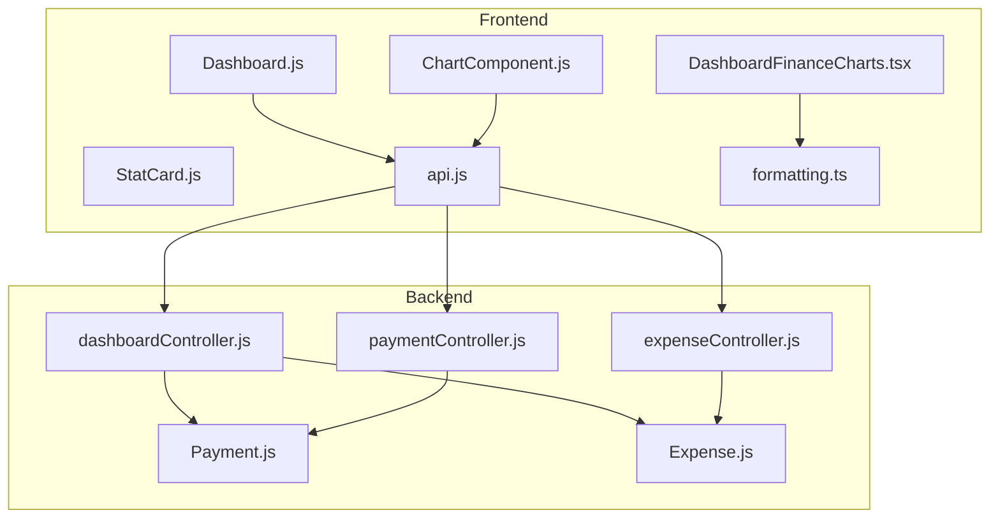
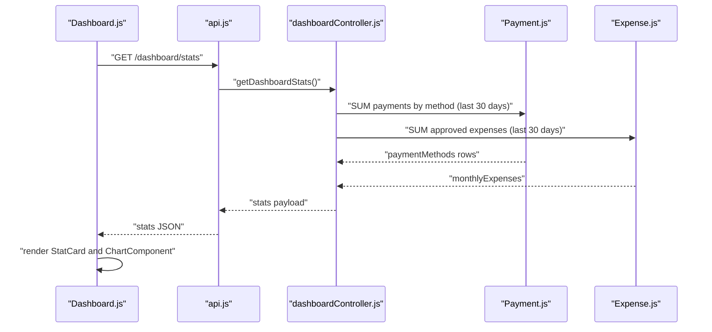
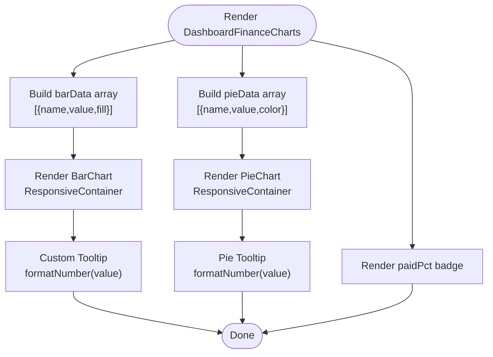
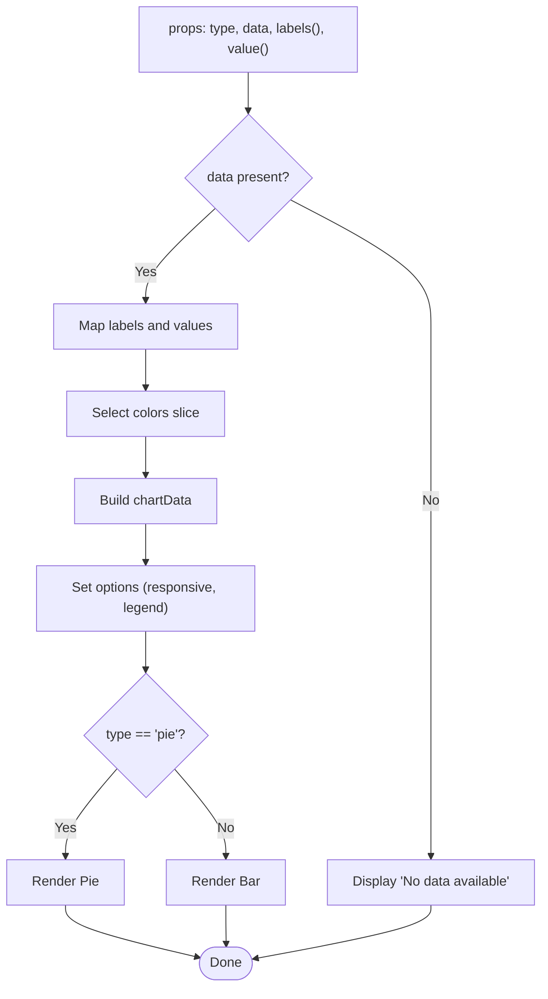
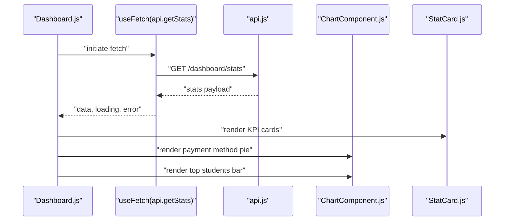
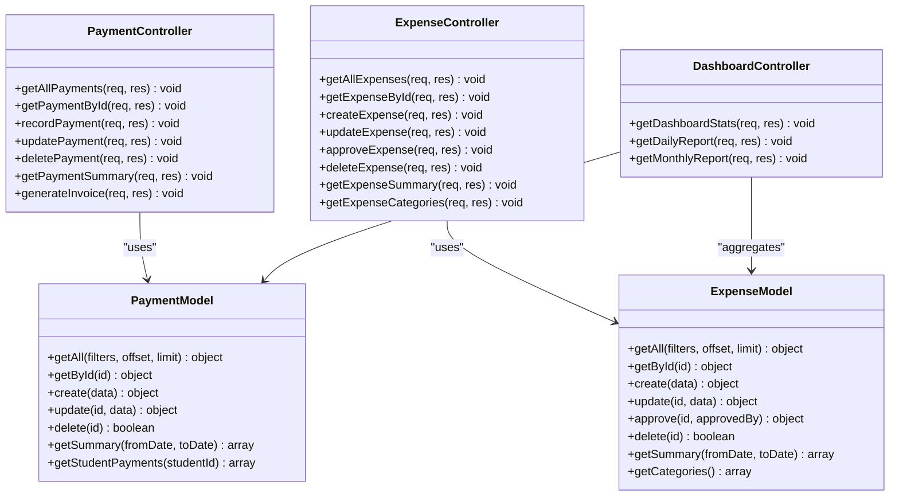
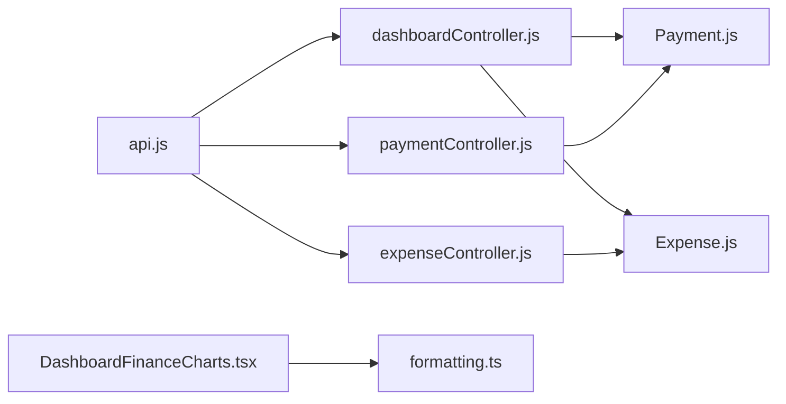

# Financial Dashboards

<cite>
**Referenced Files in This Document**
- [DashboardFinanceCharts.tsx](file://components/DashboardFinanceCharts.tsx)
- [formatting.ts](file://lib/formatting.ts)
- [Dashboard.js](file://00990090/school-accounting-system/frontend/src/pages/Dashboard.js)
- [ChartComponent.js](file://00990090/school-accounting-system/frontend/src/components/ChartComponent.js)
- [StatCard.js](file://00990090/school-accounting-system/frontend/src/components/StatCard.js)
- [api.js](file://00990090/school-accounting-system/frontend/src/services/api.js)
- [dashboardController.js](file://00990090/school-accounting-system/backend/src/controllers/dashboardController.js)
- [paymentController.js](file://00990090/school-accounting-system/backend/src/controllers/paymentController.js)
- [expenseController.js](file://00990090/school-accounting-system/backend/src/controllers/expenseController.js)
- [Payment.js](file://00990090/school-accounting-system/backend/src/models/Payment.js)
- [Expense.js](file://00990090/school-accounting-system/backend/src/models/Expense.js)
</cite>

## Table of Contents
1. [Introduction](#introduction)
2. [Project Structure](#project-structure)
3. [Core Components](#core-components)
4. [Architecture Overview](#architecture-overview)
5. [Detailed Component Analysis](#detailed-component-analysis)
6. [Dependency Analysis](#dependency-analysis)
7. [Performance Considerations](#performance-considerations)
8. [Troubleshooting Guide](#troubleshooting-guide)
9. [Conclusion](#conclusion)
10. [Appendices](#appendices)

## Introduction
This document explains the financial dashboard system for revenue tracking, expense analysis, and cash flow visualization. It covers:
- Bar charts for income breakdown by category
- Pie charts for payment status distribution
- Percentage indicators for payment completion rates
- Data structures for bar and pie datasets
- Tooltip customization and responsive chart containers
- Practical examples of financial data aggregation, currency formatting, and real-time dashboard updates
- Integration with payment processing, expense tracking, and reporting
- Chart customization, filtering, performance optimization, and dashboard widget composition

## Project Structure
The financial dashboard spans a frontend React application and a backend Node.js service. The frontend renders charts and KPI cards, while the backend exposes REST endpoints for aggregated financial data and supports filtering and summaries.

**Diagram sources**
- [Dashboard.js:1-111](file://00990090/school-accounting-system/frontend/src/pages/Dashboard.js#L1-L111)
- [ChartComponent.js:1-46](file://00990090/school-accounting-system/frontend/src/components/ChartComponent.js#L1-L46)
- [DashboardFinanceCharts.tsx:1-124](file://components/DashboardFinanceCharts.tsx#L1-L124)
- [StatCard.js:1-11](file://00990090/school-accounting-system/frontend/src/components/StatCard.js#L1-L11)
- [api.js:1-86](file://00990090/school-accounting-system/frontend/src/services/api.js#L1-L86)
- [dashboardController.js:1-193](file://00990090/school-accounting-system/backend/src/controllers/dashboardController.js#L1-L193)
- [paymentController.js:1-305](file://00990090/school-accounting-system/backend/src/controllers/paymentController.js#L1-L305)
- [expenseController.js:1-259](file://00990090/school-accounting-system/backend/src/controllers/expenseController.js#L1-L259)
- [Payment.js:1-176](file://00990090/school-accounting-system/backend/src/models/Payment.js#L1-L176)
- [Expense.js:1-204](file://00990090/school-accounting-system/backend/src/models/Expense.js#L1-L204)

**Section sources**
- [Dashboard.js:1-111](file://00990090/school-accounting-system/frontend/src/pages/Dashboard.js#L1-L111)
- [api.js:1-86](file://00990090/school-accounting-system/frontend/src/services/api.js#L1-L86)
- [dashboardController.js:1-193](file://00990090/school-accounting-system/backend/src/controllers/dashboardController.js#L1-L193)

## Core Components
- DashboardFinanceCharts: Renders a responsive two-column chart grid with a bar chart for income breakdown and a pie chart for payment completion percentage, plus a custom tooltip and localized currency formatting.
- ChartComponent: A generic Chart.js-based component supporting pie and bar visualizations with responsive containers and legend positioning.
- StatCard: Lightweight KPI card component for displaying totals and balances.
- API service: Centralized axios instance with typed endpoints for dashboard, payments, and expenses.
- Backend controllers and models: Provide aggregated financial data, summaries, and filtering for payments and expenses.

**Section sources**
- [DashboardFinanceCharts.tsx:1-124](file://components/DashboardFinanceCharts.tsx#L1-L124)
- [ChartComponent.js:1-46](file://00990090/school-accounting-system/frontend/src/components/ChartComponent.js#L1-L46)
- [StatCard.js:1-11](file://00990090/school-accounting-system/frontend/src/components/StatCard.js#L1-L11)
- [api.js:1-86](file://00990090/school-accounting-system/frontend/src/services/api.js#L1-L86)
- [dashboardController.js:1-193](file://00990090/school-accounting-system/backend/src/controllers/dashboardController.js#L1-L193)
- [paymentController.js:1-305](file://00990090/school-accounting-system/backend/src/controllers/paymentController.js#L1-L305)
- [expenseController.js:1-259](file://00990090/school-accounting-system/backend/src/controllers/expenseController.js#L1-L259)
- [Payment.js:1-176](file://00990090/school-accounting-system/backend/src/models/Payment.js#L1-L176)
- [Expense.js:1-204](file://00990090/school-accounting-system/backend/src/models/Expense.js#L1-L204)

## Architecture Overview
The frontend fetches financial metrics from backend endpoints and renders charts and KPIs. The backend aggregates data from the database using SQL queries and returns structured datasets suitable for visualization.

**Diagram sources**
- [Dashboard.js:1-111](file://00990090/school-accounting-system/frontend/src/pages/Dashboard.js#L1-L111)
- [api.js:77-83](file://00990090/school-accounting-system/frontend/src/services/api.js#L77-L83)
- [dashboardController.js:10-82](file://00990090/school-accounting-system/backend/src/controllers/dashboardController.js#L10-L82)
- [Payment.js:144-159](file://00990090/school-accounting-system/backend/src/models/Payment.js#L144-L159)
- [Expense.js:174-190](file://00990090/school-accounting-system/backend/src/models/Expense.js#L174-L190)

## Detailed Component Analysis

### DashboardFinanceCharts: Bar and Pie Charts with Percentage Indicator
- Purpose: Render a responsive two-chart grid with a bar chart for income breakdown by category and a pie chart for payment completion percentage, plus a percentage badge.
- Data structures:
  - Bar dataset: array of objects with name, value, fill.
  - Pie dataset: array of objects with name, value, color.
  - paidPct: number representing completion percentage.
- Customization:
  - Custom tooltip with localized currency formatting via formatting.ts.
  - Responsive container ensures charts adapt to grid width.
  - Y-axis formatted in millions for readability.
  - Legend and tooltip formatters for Cairo font family.
- Rendering:
  - BarChart with bars colored per entry and rounded corners.
  - PieChart with inner/outer radii, start/end angles, and per-sector colors.

**Diagram sources**
- [DashboardFinanceCharts.tsx:37-123](file://components/DashboardFinanceCharts.tsx#L37-L123)
- [formatting.ts:1-3](file://lib/formatting.ts#L1-L3)

**Section sources**
- [DashboardFinanceCharts.tsx:1-124](file://components/DashboardFinanceCharts.tsx#L1-L124)
- [formatting.ts:1-3](file://lib/formatting.ts#L1-L3)

### ChartComponent: Generic Chart Renderer (Chart.js)
- Purpose: Accepts labels and value mappers to produce either a pie or bar chart.
- Data structure:
  - chartData.labels: computed from labels mapper
  - chartData.datasets[0].data: computed from value mapper
  - Background colors cycled from a predefined palette
- Options:
  - responsive and aspect ratio maintained
  - legend positioned at bottom for pie, top for bar

**Diagram sources**
- [ChartComponent.js:8-45](file://00990090/school-accounting-system/frontend/src/components/ChartComponent.js#L8-L45)

**Section sources**
- [ChartComponent.js:1-46](file://00990090/school-accounting-system/frontend/src/components/ChartComponent.js#L1-L46)

### StatCard: Financial KPI Display
- Purpose: Present a single metric with icon and optional theme class.
- Typical usage: Total students, monthly revenue, monthly expenses, net income, pending fees.

**Section sources**
- [StatCard.js:1-11](file://00990090/school-accounting-system/frontend/src/components/StatCard.js#L1-L11)

### Frontend Dashboard Page Composition
- Fetches dashboard stats via API.
- Renders StatCards for high-level KPIs.
- Renders ChartComponent instances for payment method breakdown and top students by fees.
- Uses grid layout to organize widgets responsively.

**Diagram sources**
- [Dashboard.js:9-110](file://00990090/school-accounting-system/frontend/src/pages/Dashboard.js#L9-L110)
- [api.js:77-83](file://00990090/school-accounting-system/frontend/src/services/api.js#L77-L83)
- [ChartComponent.js:8-45](file://00990090/school-accounting-system/frontend/src/components/ChartComponent.js#L8-L45)
- [StatCard.js:1-11](file://00990090/school-accounting-system/frontend/src/components/StatCard.js#L1-L11)

**Section sources**
- [Dashboard.js:1-111](file://00990090/school-accounting-system/frontend/src/pages/Dashboard.js#L1-L111)
- [api.js:77-83](file://00990090/school-accounting-system/frontend/src/services/api.js#L77-L83)

### Backend Controllers and Models: Data Aggregation and Filtering
- Dashboard controller:
  - Monthly revenue from payments within last 30 days
  - Monthly approved expenses
  - Pending fees by summing outstanding student fees
  - Payment methods breakdown grouped by method
  - Top students by total fees
- Payment controller:
  - Paginated payments with filters: student_id, from_date, to_date
  - Payment summary grouped by method and date
- Expense controller:
  - Paginated expenses with filters: category, is_approved, from_date, to_date
  - Expense summary grouped by category and date
  - Expense categories enumeration

**Diagram sources**
- [paymentController.js:1-305](file://00990090/school-accounting-system/backend/src/controllers/paymentController.js#L1-L305)
- [expenseController.js:1-259](file://00990090/school-accounting-system/backend/src/controllers/expenseController.js#L1-L259)
- [dashboardController.js:1-193](file://00990090/school-accounting-system/backend/src/controllers/dashboardController.js#L1-L193)
- [Payment.js:1-176](file://00990090/school-accounting-system/backend/src/models/Payment.js#L1-L176)
- [Expense.js:1-204](file://00990090/school-accounting-system/backend/src/models/Expense.js#L1-L204)

**Section sources**
- [dashboardController.js:1-193](file://00990090/school-accounting-system/backend/src/controllers/dashboardController.js#L1-L193)
- [paymentController.js:1-305](file://00990090/school-accounting-system/backend/src/controllers/paymentController.js#L1-L305)
- [expenseController.js:1-259](file://00990090/school-accounting-system/backend/src/controllers/expenseController.js#L1-L259)
- [Payment.js:1-176](file://00990090/school-accounting-system/backend/src/models/Payment.js#L1-L176)
- [Expense.js:1-204](file://00990090/school-accounting-system/backend/src/models/Expense.js#L1-L204)

## Dependency Analysis
- Frontend depends on:
  - API service for backend endpoints
  - Chart libraries for rendering
  - Formatting utilities for currency display
- Backend depends on:
  - Database for financial aggregations
  - Models for reusable query logic
  - Controllers for endpoint orchestration

**Diagram sources**
- [api.js:1-86](file://00990090/school-accounting-system/frontend/src/services/api.js#L1-L86)
- [dashboardController.js:1-193](file://00990090/school-accounting-system/backend/src/controllers/dashboardController.js#L1-L193)
- [paymentController.js:1-305](file://00990090/school-accounting-system/backend/src/controllers/paymentController.js#L1-L305)
- [expenseController.js:1-259](file://00990090/school-accounting-system/backend/src/controllers/expenseController.js#L1-L259)
- [Payment.js:1-176](file://00990090/school-accounting-system/backend/src/models/Payment.js#L1-L176)
- [Expense.js:1-204](file://00990090/school-accounting-system/backend/src/models/Expense.js#L1-L204)
- [DashboardFinanceCharts.tsx:1-124](file://components/DashboardFinanceCharts.tsx#L1-L124)
- [formatting.ts:1-3](file://lib/formatting.ts#L1-L3)

**Section sources**
- [api.js:1-86](file://00990090/school-accounting-system/frontend/src/services/api.js#L1-L86)
- [dashboardController.js:1-193](file://00990090/school-accounting-system/backend/src/controllers/dashboardController.js#L1-L193)
- [paymentController.js:1-305](file://00990090/school-accounting-system/backend/src/controllers/paymentController.js#L1-L305)
- [expenseController.js:1-259](file://00990090/school-accounting-system/backend/src/controllers/expenseController.js#L1-L259)
- [Payment.js:1-176](file://00990090/school-accounting-system/backend/src/models/Payment.js#L1-L176)
- [Expense.js:1-204](file://00990090/school-accounting-system/backend/src/models/Expense.js#L1-L204)
- [DashboardFinanceCharts.tsx:1-124](file://components/DashboardFinanceCharts.tsx#L1-L124)
- [formatting.ts:1-3](file://lib/formatting.ts#L1-L3)

## Performance Considerations
- Backend
  - Use indexed columns for filters (student_id, payment_date, expense_date, category, is_approved).
  - Prefer aggregation queries with appropriate WHERE clauses to avoid scanning entire tables.
  - Paginate results for lists and summaries to reduce payload sizes.
- Frontend
  - Lazy-load chart libraries if bundle size becomes a concern.
  - Debounce filter changes to avoid excessive re-fetches.
  - Memoize computed datasets to prevent unnecessary re-renders.
  - Use virtualized lists for long tabular data.
- Real-time updates
  - Polling intervals should be tuned (e.g., every 30–60 seconds) to balance freshness and load.
  - Consider WebSockets for live updates if supported by infrastructure.

## Troubleshooting Guide
- No data in charts
  - Verify API responses for empty arrays and handle gracefully in components.
  - Ensure labels/value mappers return non-empty arrays.
- Currency formatting issues
  - Confirm formatting.ts is imported and used consistently in tooltips and badges.
- Backend errors
  - Check controller error handling and return structured JSON with success=false and message.
  - Validate database connectivity and query correctness.
- Pagination and filtering
  - Ensure filters are passed correctly in API calls and mapped to backend query builders.

**Section sources**
- [ChartComponent.js:8-11](file://00990090/school-accounting-system/frontend/src/components/ChartComponent.js#L8-L11)
- [DashboardFinanceCharts.tsx:37-65](file://components/DashboardFinanceCharts.tsx#L37-L65)
- [formatting.ts:1-3](file://lib/formatting.ts#L1-L3)
- [dashboardController.js:75-81](file://00990090/school-accounting-system/backend/src/controllers/dashboardController.js#L75-L81)
- [paymentController.js:37-44](file://00990090/school-accounting-system/backend/src/controllers/paymentController.js#L37-L44)
- [expenseController.js:34-41](file://00990090/school-accounting-system/backend/src/controllers/expenseController.js#L34-L41)

## Conclusion
The financial dashboard integrates robust backend aggregations with flexible frontend visualizations. Bar and pie charts, combined with percentage indicators and KPI cards, deliver a comprehensive view of revenue, expenses, and payment status. By leveraging filtering, summaries, and responsive containers, the system supports efficient financial monitoring and reporting.

## Appendices

### Data Structures and Examples
- Bar dataset (income breakdown by category)
  - Fields: name, value, fill
  - Example usage: render income distribution across categories in a bar chart
- Pie dataset (payment status distribution)
  - Fields: name, value, color
  - Example usage: show paid vs pending amounts in a pie chart
- Payment completion percentage
  - Field: paidPct (number)
  - Example usage: display a badge indicating completion rate

**Section sources**
- [DashboardFinanceCharts.tsx:19-35](file://components/DashboardFinanceCharts.tsx#L19-L35)

### Currency Formatting and Localization
- Use the formatting utility to localize numeric output in tooltips and badges.
- Apply consistent currency units across charts and cards.

**Section sources**
- [formatting.ts:1-3](file://lib/formatting.ts#L1-L3)
- [DashboardFinanceCharts.tsx:37-65](file://components/DashboardFinanceCharts.tsx#L37-L65)

### Real-Time Updates and Polling
- Implement periodic polling for dashboard refresh.
- Debounce user-driven filters to minimize network requests.

**Section sources**
- [Dashboard.js:9-16](file://00990090/school-accounting-system/frontend/src/pages/Dashboard.js#L9-L16)

### Chart Customization and Responsiveness
- Customize tooltips, legends, and axes for clarity.
- Use ResponsiveContainer to adapt charts to grid layouts.

**Section sources**
- [DashboardFinanceCharts.tsx:76-123](file://components/DashboardFinanceCharts.tsx#L76-L123)
- [ChartComponent.js:32-45](file://00990090/school-accounting-system/frontend/src/components/ChartComponent.js#L32-L45)

### Data Filtering Capabilities
- Payments: filter by student_id, from_date, to_date
- Expenses: filter by category, is_approved, from_date, to_date
- Summaries: group by method/date or category/date for trend analysis

**Section sources**
- [paymentController.js:15-25](file://00990090/school-accounting-system/backend/src/controllers/paymentController.js#L15-L25)
- [expenseController.js:11-22](file://00990090/school-accounting-system/backend/src/controllers/expenseController.js#L11-L22)
- [Payment.js:14-76](file://00990090/school-accounting-system/backend/src/models/Payment.js#L14-L76)
- [Expense.js:13-85](file://00990090/school-accounting-system/backend/src/models/Expense.js#L13-L85)

### Integration Patterns
- Payments: record, update, delete, and summarize payments
- Expenses: create, approve, update, delete, and summarize expenses
- Reporting: daily and monthly financial reports

**Section sources**
- [paymentController.js:75-130](file://00990090/school-accounting-system/backend/src/controllers/paymentController.js#L75-L130)
- [expenseController.js:72-174](file://00990090/school-accounting-system/backend/src/controllers/expenseController.js#L72-L174)
- [dashboardController.js:134-186](file://00990090/school-accounting-system/backend/src/controllers/dashboardController.js#L134-L186)