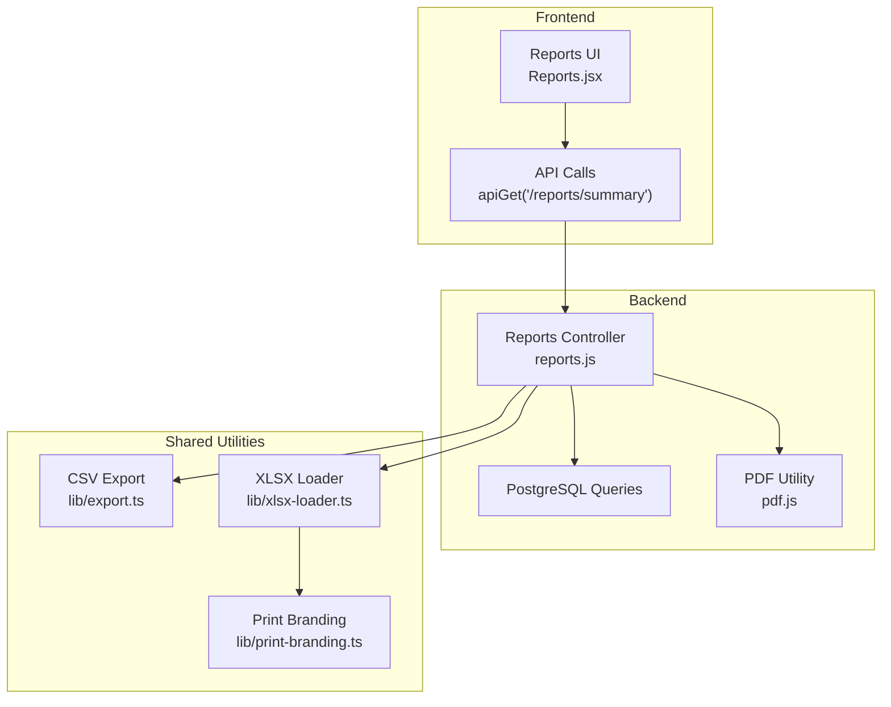
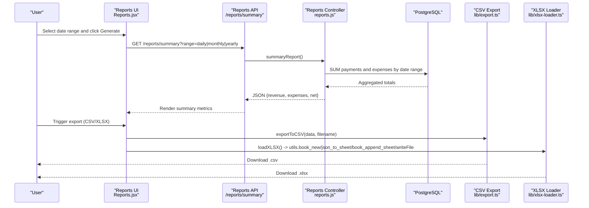
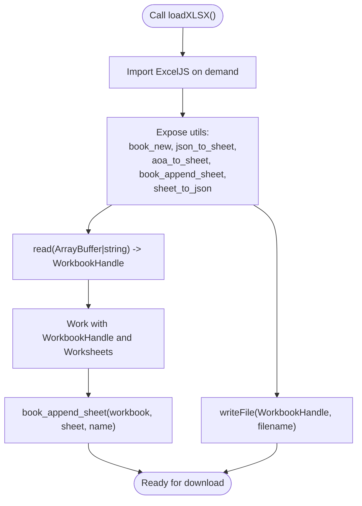
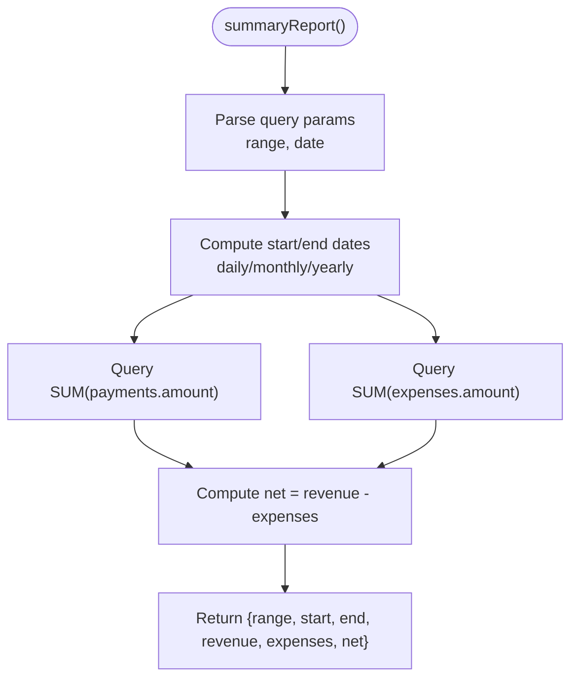
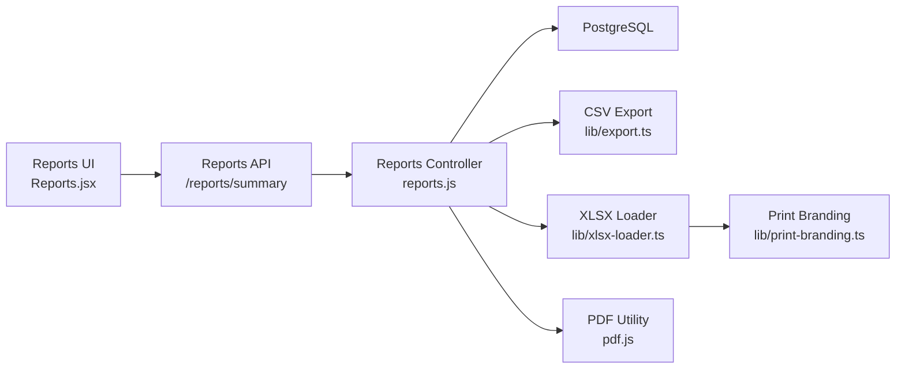

# Reporting & Export

<cite>
**Referenced Files in This Document**
- [lib/export.ts](file://lib/export.ts)
- [lib/xlsx-loader.ts](file://lib/xlsx-loader.ts)
- [lib/print-branding.ts](file://lib/print-branding.ts)
- [school-acc-system/backend/src/utils/pdf.js](file://school-acc-system/backend/src/utils/pdf.js)
- [school-acc-system/backend/src/controllers/reports.js](file://school-acc-system/backend/src/controllers/reports.js)
- [school-acc-system/frontend/src/pages/Reports.jsx](file://school-acc-system/frontend/src/pages/Reports.jsx)
- [app/reports/page.tsx](file://app/reports/page.tsx)
</cite>

## Table of Contents
1. [Introduction](#introduction)
2. [Project Structure](#project-structure)
3. [Core Components](#core-components)
4. [Architecture Overview](#architecture-overview)
5. [Detailed Component Analysis](#detailed-component-analysis)
6. [Dependency Analysis](#dependency-analysis)
7. [Performance Considerations](#performance-considerations)
8. [Troubleshooting Guide](#troubleshooting-guide)
9. [Conclusion](#conclusion)
10. [Appendices](#appendices)

## Introduction
This document explains the reporting and export system with a focus on:
- Report generation workflows and data export formats
- Print-friendly layouts and branding integration
- Export utility functions for CSV, Excel (XLSX), and PDF
- Spreadsheet generation using ExcelJS
- Practical examples for report customization, data filtering, and batch generation
- Integration with dashboard data sources, scheduling systems, and export quality controls
- Guidance on extending formats and automating reporting workflows

## Project Structure
The reporting and export capabilities span both the Next.js frontend and a separate accounting system backend. Key areas:
- Frontend reporting UI and data fetching
- Backend report controllers and PDF generation utilities
- Shared export utilities for CSV and XLSX
- Print branding integration for consistent visuals across exports

**Diagram sources**
- [school-acc-system/frontend/src/pages/Reports.jsx:1-63](file://school-acc-system/frontend/src/pages/Reports.jsx#L1-L63)
- [school-acc-system/backend/src/controllers/reports.js:1-55](file://school-acc-system/backend/src/controllers/reports.js#L1-L55)
- [school-acc-system/backend/src/utils/pdf.js:1-37](file://school-acc-system/backend/src/utils/pdf.js#L1-L37)
- [lib/export.ts:1-29](file://lib/export.ts#L1-L29)
- [lib/xlsx-loader.ts:1-251](file://lib/xlsx-loader.ts#L1-L251)
- [lib/print-branding.ts:1-2](file://lib/print-branding.ts#L1-L2)

**Section sources**
- [school-acc-system/frontend/src/pages/Reports.jsx:1-63](file://school-acc-system/frontend/src/pages/Reports.jsx#L1-L63)
- [school-acc-system/backend/src/controllers/reports.js:1-55](file://school-acc-system/backend/src/controllers/reports.js#L1-L55)
- [lib/export.ts:1-29](file://lib/export.ts#L1-L29)
- [lib/xlsx-loader.ts:1-251](file://lib/xlsx-loader.ts#L1-L251)
- [lib/print-branding.ts:1-2](file://lib/print-branding.ts#L1-L2)
- [school-acc-system/backend/src/utils/pdf.js:1-37](file://school-acc-system/backend/src/utils/pdf.js#L1-L37)

## Core Components
- CSV Export Utility: Generates downloadable CSV files from array-of-objects datasets.
- ExcelJS Loader: Asynchronous loader and builder for XLSX workbooks with JSON/AOA sheet creation and conversion helpers.
- PDF Generator: Backend utility to render invoice-style PDFs using PDFKit.
- Reports Controller: Computes financial summaries over configurable date ranges and exposes endpoints for consumption by the UI.
- Reports UI: Fetches filtered report data and displays metrics.

Key responsibilities:
- Data export: CSV and XLSX exports with normalization and download triggers
- PDF rendering: Backend-driven PDF generation for printable documents
- Report computation: Daily/monthly/yearly summaries with robust date range handling
- Print branding: Centralized branding exports for consistent visuals

**Section sources**
- [lib/export.ts:1-29](file://lib/export.ts#L1-L29)
- [lib/xlsx-loader.ts:1-251](file://lib/xlsx-loader.ts#L1-L251)
- [school-acc-system/backend/src/utils/pdf.js:1-37](file://school-acc-system/backend/src/utils/pdf.js#L1-L37)
- [school-acc-system/backend/src/controllers/reports.js:1-55](file://school-acc-system/backend/src/controllers/reports.js#L1-L55)
- [school-acc-system/frontend/src/pages/Reports.jsx:1-63](file://school-acc-system/frontend/src/pages/Reports.jsx#L1-L63)

## Architecture Overview
The reporting pipeline connects UI interactions to backend computations and export utilities. The frontend fetches filtered summaries, while the backend computes totals and supports export pathways via CSV/XLSX/PDF.

**Diagram sources**
- [school-acc-system/frontend/src/pages/Reports.jsx:1-63](file://school-acc-system/frontend/src/pages/Reports.jsx#L1-L63)
- [school-acc-system/backend/src/controllers/reports.js:1-55](file://school-acc-system/backend/src/controllers/reports.js#L1-L55)
- [lib/export.ts:1-29](file://lib/export.ts#L1-L29)
- [lib/xlsx-loader.ts:1-251](file://lib/xlsx-loader.ts#L1-L251)

## Detailed Component Analysis

### CSV Export Utility
Purpose:
- Convert structured arrays to CSV with proper escaping and UTF-8 BOM
- Trigger browser downloads with standardized filenames

Implementation highlights:
- Header extraction from the first row
- Quoting and escaping of string values
- Null/undefined normalization to empty cells
- Blob creation and automatic download via anchor element

Usage pattern:
- Build a data array from report results
- Call exportToCSV(data, "filename_prefix")

Quality controls:
- Empty data guard prevents unnecessary operations
- Consistent date suffix appended to filenames

**Section sources**
- [lib/export.ts:1-29](file://lib/export.ts#L1-L29)

### ExcelJS Loader (XLSX)
Purpose:
- Declarative, asynchronous XLSX handling with JSON and AOA (array of arrays) support
- Normalize mixed cell types (rich text, hyperlinks, formulas, errors)
- Provide workbook handle with sheet indexing and append utilities

Key APIs:
- loadXLSX(): Lazily imports ExcelJS and returns a typed interface
- utils.book_new(): Create workbook handle
- utils.json_to_sheet()/utils.aoa_to_sheet(): Prepare sheet inputs
- utils.book_append_sheet(): Add sheets to workbook
- utils.sheet_to_json(): Convert worksheets to normalized JSON
- read(): Load workbook from ArrayBuffer/string
- writeFile(): Trigger browser download of workbook

Workflow:
- Create workbook handle
- Convert data to sheet inputs (JSON or AOA)
- Append sheets and write to file

**Diagram sources**
- [lib/xlsx-loader.ts:1-251](file://lib/xlsx-loader.ts#L1-L251)

**Section sources**
- [lib/xlsx-loader.ts:1-251](file://lib/xlsx-loader.ts#L1-L251)

### PDF Generator (Backend)
Purpose:
- Generate printable PDFs (e.g., invoices) with fixed layout and typography
- Save to a storage path for later retrieval or distribution

Highlights:
- Uses PDFKit to stream PDF content to a file
- Renders invoice metadata and line items
- Returns filename and absolute path for downstream use

Integration:
- Can be invoked by report workflows to attach or deliver PDFs alongside exports

**Section sources**
- [school-acc-system/backend/src/utils/pdf.js:1-37](file://school-acc-system/backend/src/utils/pdf.js#L1-L37)

### Reports Controller
Purpose:
- Compute financial summaries over configurable ranges
- Support daily, monthly, and yearly windows with precise boundaries

Key logic:
- getRange(range, dateStr): Builds inclusive start/end timestamps
- summaryReport(): Executes two queries to sum payments and expenses within the window
- Responds with range, bounds, and computed totals

**Diagram sources**
- [school-acc-system/backend/src/controllers/reports.js:1-55](file://school-acc-system/backend/src/controllers/reports.js#L1-L55)

**Section sources**
- [school-acc-system/backend/src/controllers/reports.js:1-55](file://school-acc-system/backend/src/controllers/reports.js#L1-L55)

### Reports UI
Purpose:
- Allow users to select date ranges and render summarized metrics
- Demonstrate integration with the backend summary endpoint

Features:
- Range selector (daily/monthly/yearly)
- Generate button to fetch and display summary
- Metrics display for revenue, expenses, and net

Note:
- The Next.js app redirects legacy reports page to a localized route

**Section sources**
- [school-acc-system/frontend/src/pages/Reports.jsx:1-63](file://school-acc-system/frontend/src/pages/Reports.jsx#L1-L63)
- [app/reports/page.tsx:1-6](file://app/reports/page.tsx#L1-L6)

### Print Branding Integration
Purpose:
- Centralize branding assets and styles for print-friendly outputs
- Ensure consistent visuals across CSV/XLSX/PDF exports

Approach:
- Re-export branding utilities from a dedicated print module
- Apply consistent fonts, colors, and logos in spreadsheets and PDFs

**Section sources**
- [lib/print-branding.ts:1-2](file://lib/print-branding.ts#L1-L2)

## Dependency Analysis
- Reports UI depends on the Reports API for data
- Reports API depends on the Reports Controller for computation
- Reports Controller depends on PostgreSQL for aggregations
- Export utilities (CSV/XLSX) are independent and reusable
- PDF utility is backend-only but can complement exports

**Diagram sources**
- [school-acc-system/frontend/src/pages/Reports.jsx:1-63](file://school-acc-system/frontend/src/pages/Reports.jsx#L1-L63)
- [school-acc-system/backend/src/controllers/reports.js:1-55](file://school-acc-system/backend/src/controllers/reports.js#L1-L55)
- [lib/export.ts:1-29](file://lib/export.ts#L1-L29)
- [lib/xlsx-loader.ts:1-251](file://lib/xlsx-loader.ts#L1-L251)
- [school-acc-system/backend/src/utils/pdf.js:1-37](file://school-acc-system/backend/src/utils/pdf.js#L1-L37)
- [lib/print-branding.ts:1-2](file://lib/print-branding.ts#L1-L2)

**Section sources**
- [school-acc-system/frontend/src/pages/Reports.jsx:1-63](file://school-acc-system/frontend/src/pages/Reports.jsx#L1-L63)
- [school-acc-system/backend/src/controllers/reports.js:1-55](file://school-acc-system/backend/src/controllers/reports.js#L1-L55)
- [lib/export.ts:1-29](file://lib/export.ts#L1-L29)
- [lib/xlsx-loader.ts:1-251](file://lib/xlsx-loader.ts#L1-L251)
- [school-acc-system/backend/src/utils/pdf.js:1-37](file://school-acc-system/backend/src/utils/pdf.js#L1-L37)
- [lib/print-branding.ts:1-2](file://lib/print-branding.ts#L1-L2)

## Performance Considerations
- CSV/XLSX generation:
  - Prefer streaming or chunked writes for very large datasets
  - Normalize mixed cell types early to avoid repeated conversions
  - Use workbook handles to minimize redundant lookups
- PDF generation:
  - Keep layouts minimal to reduce rendering overhead
  - Cache frequently used fonts/logos
- Report queries:
  - Ensure appropriate indexes on date columns for efficient range scans
  - Paginate or limit result sets when extending to detailed reports
- Browser downloads:
  - Revoke object URLs after triggering download to free memory
  - Avoid synchronous operations during large exports

## Troubleshooting Guide
Common issues and resolutions:
- Empty CSV/XLSX exports:
  - Verify input arrays are non-empty before invoking export functions
  - Ensure headers exist for CSV and sheet names for XLSX
- Mixed cell types in XLSX:
  - Normalize values using provided helpers to convert rich text, hyperlinks, and formulas to strings
- PDF generation failures:
  - Confirm writable storage path exists and is accessible
  - Validate invoice data completeness before rendering
- Date range mismatches:
  - Use the controller’s range computation to ensure inclusive boundaries
- Download not triggered:
  - Confirm anchor element lifecycle and URL revocation

**Section sources**
- [lib/export.ts:1-29](file://lib/export.ts#L1-L29)
- [lib/xlsx-loader.ts:1-251](file://lib/xlsx-loader.ts#L1-L251)
- [school-acc-system/backend/src/utils/pdf.js:1-37](file://school-acc-system/backend/src/utils/pdf.js#L1-L37)
- [school-acc-system/backend/src/controllers/reports.js:1-55](file://school-acc-system/backend/src/controllers/reports.js#L1-L55)

## Conclusion
The reporting and export system combines a flexible UI, robust backend computations, and reusable export utilities to produce CSV, XLSX, and PDF outputs. By leveraging date-range filtering, print branding, and modular components, teams can customize reports, scale to large datasets, and automate workflows for recurring needs.

## Appendices

### Practical Examples

- Report customization
  - Extend the Reports Controller to compute additional KPIs (e.g., average payment per student)
  - Modify the UI to include filters (program, grade, date range) and pass them to the API
  - Add export buttons for CSV and XLSX after generating summary data

- Data filtering for exports
  - Pass filters (date range, category, status) to the backend and adjust SQL queries accordingly
  - Normalize exported data to ensure consistent formatting across formats

- Batch report generation
  - Schedule periodic runs of summaryReport() and persist results to storage
  - Generate PDFs for each period and attach them to automated emails

- Integrating with dashboard data sources
  - Reuse the same aggregation queries in dashboards and export flows
  - Share the same date range computation logic across components

- Export quality controls
  - Validate CSV/XLSX headers and data types before download
  - Verify PDF content and page breaks for print readiness
  - Monitor export sizes and apply pagination for large datasets

- Adding new export types
  - For new formats, follow the CSV/XLSX patterns: normalize data, create a writer, and trigger download
  - For PDFs, reuse PDFKit patterns and integrate with print branding

- Implementing automated reporting workflows
  - Wire scheduled jobs to call summaryReport() and export results
  - Store artifacts in cloud storage and send notifications upon completion