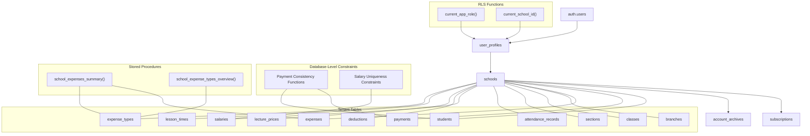
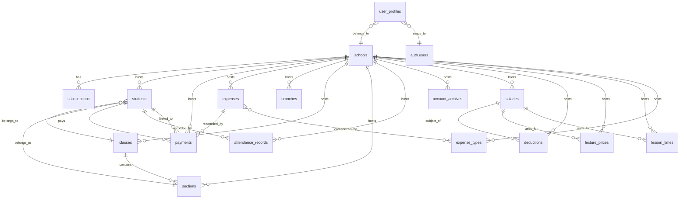
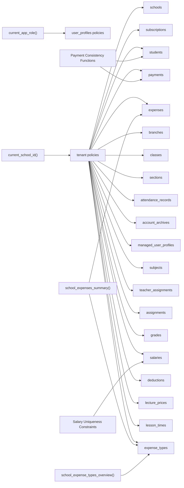

# Database Design

<cite>
**Referenced Files in This Document**
- [database_setup.sql](file://database_setup.sql)
- [admin_infrastructure.sql](file://admin_infrastructure.sql)
- [migrations/README.md](file://migrations/README.md)
- [migrations/20260322_000000_mobile_core_tables.sql](file://migrations/20260322_000000_mobile_core_tables.sql)
- [migrations/20260323_000000_dashboard_managed_account_schema.sql](file://migrations/20260323_000000_dashboard_managed_account_schema.sql)
- [migrations/20260324_000000_reliability_performance_indexes.sql](file://migrations/20260324_000000_reliability_performance_indexes.sql)
- [migrations/20260324_010000_academic_records_scope_model.sql](file://migrations/20260324_010000_academic_records_scope_model.sql)
- [migrations/20260326_020000_account_archives_table.sql](file://migrations/20260326_020000_account_archives_table.sql)
- [migrations/20260329_000000_teacher_activity_monitoring.sql](file://migrations/20260329_000000_teacher_activity_monitoring.sql)
- [migrations/20260330_000000_add_missing_indexes.sql](file://migrations/20260330_000000_add_missing_indexes.sql)
- [migrations/20260401_000000_remove_plaintext_passwords.sql](file://migrations/20260401_000000_remove_plaintext_passwords.sql)
- [migrations/20260403_000000_payment_consistency_and_salary_uniqueness.sql](file://migrations/20260403_000000_payment_consistency_and_salary_uniqueness.sql)
- [migrations/20260403_010000_expenses_performance_and_overview.sql](file://migrations/20260403_010000_expenses_performance_and_overview.sql)
- [00990090/school-accounting-system/database/schema.sql](file://00990090/school-accounting-system/database/schema.sql)
- [00990090/school-accounting-system/database/sample_data.sql](file://00990090/school-accounting-system/database/sample_data.sql)
- [00990090/school-accounting-system/backend/src/models/User.js](file://00990090/school-accounting-system/backend/src/models/User.js)
- [00990090/school-accounting-system/backend/src/models/Student.js](file://00990090/school-accounting-system/backend/src/models/Student.js)
- [00990090/school-accounting-system/backend/src/models/Payment.js](file://00990090/school-accounting-system/backend/src/models/Payment.js)
- [00990090/school-accounting-system/backend/src/models/Expense.js](file://00990090/school-accounting-system/backend/src/models/Expense.js)
</cite>

## Update Summary
**Changes Made**
- Updated Performance Considerations section to document new database-level constraints and stored procedures
- Added documentation for new migrations: payment consistency functions and salary uniqueness constraints
- Enhanced Indexing Strategy documentation with complete coverage of all performance optimizations
- Added documentation for specialized stored procedures for expense reporting and overview functionality
- Updated Migration Timeline to include the new April 2026 migrations

## Table of Contents
1. [Introduction](#introduction)
2. [Project Structure](#project-structure)
3. [Core Components](#core-components)
4. [Architecture Overview](#architecture-overview)
5. [Detailed Component Analysis](#detailed-component-analysis)
6. [Dependency Analysis](#dependency-analysis)
7. [Performance Considerations](#performance-considerations)
8. [Troubleshooting Guide](#troubleshooting-guide)
9. [Conclusion](#conclusion)
10. [Appendices](#appendices)

## Introduction
This document provides comprehensive database design documentation for the school management system. It covers the multi-tenant schema, entity relationships, constraints, indexes, and RLS policies that enforce tenant isolation and role-based access control. It also documents the migration strategy, versioning, schema evolution, indexing strategy, and operational procedures such as backup and recovery. Finally, it includes sample data and common query patterns for major entities.

## Project Structure
The database schema is primarily defined in SQL bootstrap and migration files. The repository includes:
- Bootstrap schema and core RLS policies
- Administrative infrastructure (audit logs, notifications, feature flags, soft deletes)
- Academic records and teacher assignment schema
- Performance indexes and additional indexes
- Database-level constraints for payment consistency and salary uniqueness
- Specialized stored procedures for expense reporting and overview functionality
- Legacy accounting system schema and sample data for reference

```mermaid
graph TB
subgraph "Bootstrap"
A["database_setup.sql"]
B["admin_infrastructure.sql"]
end
subgraph "Migrations"
C["20260322_000000_mobile_core_tables.sql"]
D["20260323_000000_dashboard_managed_account_schema.sql"]
E["20260324_000000_reliability_performance_indexes.sql"]
F["20260324_010000_academic_records_scope_model.sql"]
G["20260326_020000_account_archives_table.sql"]
H["20260329_000000_teacher_activity_monitoring.sql"]
I["20260330_000000_add_missing_indexes.sql"]
J["20260401_000000_remove_plaintext_passwords.sql"]
K["20260403_000000_payment_consistency_and_salary_uniqueness.sql"]
L["20260403_010000_expenses_performance_and_overview.sql"]
end
subgraph "Legacy Accounting"
M["00990090/school-accounting-system/database/schema.sql"]
N["00990090/school-accounting-system/database/sample_data.sql"]
end
A --> C
A --> D
A --> E
A --> F
A --> G
A --> H
A --> I
A --> J
A --> K
A --> L
B --> A
M --> N
```

**Diagram sources**
- [database_setup.sql](file://database_setup.sql)
- [admin_infrastructure.sql](file://admin_infrastructure.sql)
- [migrations/20260322_000000_mobile_core_tables.sql](file://migrations/20260322_000000_mobile_core_tables.sql)
- [migrations/20260323_000000_dashboard_managed_account_schema.sql](file://migrations/20260323_000000_dashboard_managed_account_schema.sql)
- [migrations/20260324_000000_reliability_performance_indexes.sql](file://migrations/20260324_000000_reliability_performance_indexes.sql)
- [migrations/20260324_010000_academic_records_scope_model.sql](file://migrations/20260324_010000_academic_records_scope_model.sql)
- [migrations/20260326_020000_account_archives_table.sql](file://migrations/20260326_020000_account_archives_table.sql)
- [migrations/20260329_000000_teacher_activity_monitoring.sql](file://migrations/20260329_000000_teacher_activity_monitoring.sql)
- [migrations/20260330_000000_add_missing_indexes.sql](file://migrations/20260330_000000_add_missing_indexes.sql)
- [migrations/20260401_000000_remove_plaintext_passwords.sql](file://migrations/20260401_000000_remove_plaintext_passwords.sql)
- [migrations/20260403_000000_payment_consistency_and_salary_uniqueness.sql](file://migrations/20260403_000000_payment_consistency_and_salary_uniqueness.sql)
- [migrations/20260403_010000_expenses_performance_and_overview.sql](file://migrations/20260403_010000_expenses_performance_and_overview.sql)
- [00990090/school-accounting-system/database/schema.sql](file://00990090/school-accounting-system/database/schema.sql)
- [00990090/school-accounting-system/database/sample_data.sql](file://00990090/school-accounting-system/database/sample_data.sql)

**Section sources**
- [migrations/README.md](file://migrations/README.md)
- [database_setup.sql](file://database_setup.sql)
- [admin_infrastructure.sql](file://admin_infrastructure.sql)

## Core Components
This section outlines the principal database components and their roles in the system.

- Schools and Subscriptions
  - Schools define tenants with subscription lifecycle management.
  - Subscriptions track plan, status, and effective dates; a computed end date is maintained per school.
  - Indexes optimize queries by school and status.

- User Profiles and Authentication
  - User profiles link auth users to schools and roles.
  - Soft delete columns are standardized across key entities via administrative infrastructure.

- Academic Records and Managed Accounts
  - Managed user profiles unify student and teacher identities with role scoping.
  - Subjects, teacher assignments, assignments, and grades form the academic record domain.
  - Triggers maintain updated_at timestamps for managed entities.

- Payments and Expenses
  - Payments and expenses are tracked with method, references, and approvals.
  - Database-level constraints ensure payment consistency and salary uniqueness.
  - Specialized stored procedures provide efficient expense reporting and overview functionality.
  - Legacy accounting schema and sample data illustrate historical modeling.

- Administrative Infrastructure
  - Audit logs capture actions with actor metadata.
  - Notifications target recipients with read status.
  - Feature flags and soft-delete support are centrally managed.

**Section sources**
- [database_setup.sql](file://database_setup.sql)
- [admin_infrastructure.sql](file://admin_infrastructure.sql)
- [migrations/20260322_000000_mobile_core_tables.sql](file://migrations/20260322_000000_mobile_core_tables.sql)
- [migrations/20260324_010000_academic_records_scope_model.sql](file://migrations/20260324_010000_academic_records_scope_model.sql)
- [migrations/20260403_000000_payment_consistency_and_salary_uniqueness.sql](file://migrations/20260403_000000_payment_consistency_and_salary_uniqueness.sql)
- [migrations/20260403_010000_expenses_performance_and_overview.sql](file://migrations/20260403_010000_expenses_performance_and_overview.sql)
- [00990090/school-accounting-system/database/schema.sql](file://00990090/school-accounting-system/database/schema.sql)

## Architecture Overview
The database enforces multi-tenancy and role-based access control through RLS policies and helper functions. Tenant isolation is applied to tables containing a school_id column. Helper functions expose current_app_role and current_school_id to policy expressions.

**Diagram sources**
- [database_setup.sql](file://database_setup.sql)
- [migrations/20260403_000000_payment_consistency_and_salary_uniqueness.sql](file://migrations/20260403_000000_payment_consistency_and_salary_uniqueness.sql)
- [migrations/20260403_010000_expenses_performance_and_overview.sql](file://migrations/20260403_010000_expenses_performance_and_overview.sql)

## Detailed Component Analysis

### Entity Relationship Model
The following ER diagram maps core entities and their relationships, highlighting primary keys, foreign keys, and indexes.

**Diagram sources**
- [database_setup.sql](file://database_setup.sql)

**Section sources**
- [database_setup.sql](file://database_setup.sql)

### Schools and Subscriptions
- Purpose: Define tenants and manage subscription lifecycles.
- Key fields:
  - schools: id, name, is_active, subscription_end, created_at, plus optional address, phone, owner_email, city, plan.
  - subscriptions: id, school_id, plan, status, start_date, end_date, created_at.
- Constraints and indexes:
  - Unique indexes on school_id for subscriptions.
  - Indexes on subscriptions for school_id and status.
- Computed fields:
  - subscription_end is recomputed via triggers/functions to reflect the latest subscription end date.

**Section sources**
- [database_setup.sql](file://database_setup.sql)

### Students and Payments
- Purpose: Track student enrollment, class/section assignment, and payment history.
- Key fields:
  - students: admission_number, personal info, class_id, section_id, auth_user_id, is_active, created_at, updated_at, paid_fee, remaining_fee, total_fee, discount_value.
  - payments: student_id, student_fee_id, amount, payment_method, reference_number, payment_date, receipt_number, notes, created_by, created_at, updated_at.
- Constraints and indexes:
  - Unique indexes on admission_number and receipt_number.
  - Indexes on student_id, payment_date, and receipt_number.
  - Foreign keys to students and users.
  - **Updated**: Database-level triggers and functions ensure payment totals are automatically synchronized between students and payments tables.

**Section sources**
- [database_setup.sql](file://database_setup.sql)
- [migrations/20260403_000000_payment_consistency_and_salary_uniqueness.sql](file://migrations/20260403_000000_payment_consistency_and_salary_uniqueness.sql)
- [00990090/school-accounting-system/database/schema.sql](file://00990090/school-accounting-system/database/schema.sql)
- [00990090/school-accounting-system/database/sample_data.sql](file://00990090/school-accounting-system/database/sample_data.sql)

### Academic Records and Managed Accounts
- Purpose: Provide managed user profiles for students and teachers, and academic record tracking.
- Key fields:
  - managed_user_profiles: auth_user_id, school_id, role, full_name, email, phone, is_active, student_id, teacher_id, created_by, created_at, updated_at.
  - subjects: school_id, name, is_active, created_at, updated_at.
  - teacher_assignments: school_id, teacher_id, subject_id, class_id, section_id, is_active, created_at, updated_at.
  - assignments: school_id, teacher_id, student_id, subject_id, class_id, section_id, class_name, section, subject, title, description, due_at, content_kind, metadata, created_at, updated_at.
  - grades: school_id, teacher_id, student_id, assignment_id, subject_id, class_id, section_id, subject, exam_type, score, max_score, note, graded_at, created_at, updated_at.
- Constraints and indexes:
  - Unique indexes on email per school, student_id, teacher_id in managed_user_profiles.
  - Unique indexes on (school_id, name) for subjects.
  - Unique indexes for classwide and section-specific assignments.
  - Indexes on school_id, student_id, teacher_id, due_at for assignments and grades.
  - Triggers to maintain updated_at timestamps.

**Section sources**
- [migrations/20260322_000000_mobile_core_tables.sql](file://migrations/20260322_000000_mobile_core_tables.sql)
- [migrations/20260324_010000_academic_records_scope_model.sql](file://migrations/20260324_010000_academic_records_scope_model.sql)

### Attendance Records
- Purpose: Track daily attendance with status and notes.
- Key fields:
  - attendance_records: student_id, school_id, branch_id, attendance_date, status, note, created_at, updated_at.
- Constraints and indexes:
  - Unique index on (student_id, attendance_date).
  - Indexes on attendance_date and student_id.
  - **Updated**: Foreign key constraint standardized to ON DELETE CASCADE for consistency with other tenant-scoped tables.
  - Trigger to update updated_at automatically.

**Section sources**
- [database_setup.sql](file://database_setup.sql)
- [migrations/20260330_000000_add_missing_indexes.sql](file://migrations/20260330_000000_add_missing_indexes.sql)

### Salaries and Deductions
- Purpose: Manage teacher compensation, hourly rates, and deduction tracking.
- Key fields:
  - salaries: school_id, teacher_id, month, amount, type, notes, created_at, updated_at.
  - deductions: school_id, teacher_id, deduction_date, amount, reason, notes, created_at, updated_at.
  - lecture_prices: school_id, grade, price, notes, created_at, updated_at.
  - lesson_times: school_id, session_type, period, duration, notes, created_at, updated_at.
- Constraints and indexes:
  - **Updated**: Database-level unique constraint prevents duplicate salary entries for the same teacher in the same month per school.
  - Indexes on school_id, teacher_id, month for efficient salary queries.
  - Indexes on deduction_date and teacher_id for deduction tracking.
  - **Updated**: Database-level triggers and functions ensure salary uniqueness constraints are enforced at the database level.

**Section sources**
- [migrations/20260403_000000_payment_consistency_and_salary_uniqueness.sql](file://migrations/20260403_000000_payment_consistency_and_salary_uniqueness.sql)
- [migrations/20260324_000000_reliability_performance_indexes.sql](file://migrations/20260324_000000_reliability_performance_indexes.sql)

### Expenses and Expense Types
- Purpose: Track school expenses with categorization and reporting capabilities.
- Key fields:
  - expenses: school_id, expense_type_id, expense_date, amount, recipient, receipt_number, notes, created_by, created_at, updated_at.
  - expense_types: school_id, name, notes, created_at, updated_at.
- Constraints and indexes:
  - **Updated**: Performance-optimized indexes for expense queries by school, date, and type.
  - Indexes on school_id, expense_date, and created_at for efficient expense reporting.
  - Indexes on expense_type_id and name for category management.
  - **Updated**: Specialized stored procedures provide comprehensive expense reporting and overview functionality.

**Section sources**
- [migrations/20260403_010000_expenses_performance_and_overview.sql](file://migrations/20260403_010000_expenses_performance_and_overview.sql)
- [migrations/20260330_000000_add_missing_indexes.sql](file://migrations/20260330_000000_add_missing_indexes.sql)

### Administrative Infrastructure
- Audit Logs
  - Fields: id, actor_id, actor_name, actor_email, action_type, entity_type, entity_id, summary, metadata, ip_address, user_agent, created_at.
  - RLS: Super admin only.
  - Indexes: actor_id, action_type, entity_type, created_at.
- Notifications
  - Fields: id, user_id, school_id, type, title, message, is_read, link, metadata, created_at.
  - RLS: Owner-only.
  - Indexes: user_id, is_read.
- Feature Flags
  - Fields: id, key, is_enabled, description, updated_at.
  - RLS: Super admin only.
- Soft Delete Support
  - Adds deleted_at and deleted_by to key tables and centralizes soft-delete handling.

**Section sources**
- [admin_infrastructure.sql](file://admin_infrastructure.sql)

### Migration Strategy and Version Management
- Scope: Migrations cover shared managed-user auth/domain tables, teacher assignment and subject schema, storage buckets, RLS helper functions, and reliability/performance indexes.
- Guidance:
  - Keep existing migration filenames stable to preserve history.
  - Use comments and documentation to clarify intent.
  - Apply migrations in chronological order; later migrations may depend on earlier ones.
- **Updated**: Recent migrations include database-level constraints and stored procedures for enhanced data integrity and reporting capabilities.

**Section sources**
- [migrations/README.md](file://migrations/README.md)

### RLS Policies and Access Control
- Helper Functions
  - current_app_role(): Returns the authenticated user's role from user_profiles.
  - current_school_id(): Returns the user's school_id from user_profiles.
- Tenant Isolation
  - Policies on tables with school_id:
    - Select: super_admin OR school_id = current_school_id().
    - Insert/Update/Delete: super_admin OR school_id = current_school_id(), with appropriate WITH CHECK clauses.
- Specialized Policies
  - user_profiles: select/update insert/delete with role-based checks.
  - schools/subscriptions: super_admin manages; select scoped by current school.
  - managed_user_profiles and academic tables: admin within current school.

**Section sources**
- [database_setup.sql](file://database_setup.sql)

### Indexing Strategy and Performance
- **Updated**: Complete Index Coverage
  - **Core Indexes**: All tenant-scoped tables now have comprehensive indexing strategy
    - subscriptions: school_id, status
    - account_archives: school_id, archive_year
    - managed_user_profiles: school_id, role, is_active; unique constraints on student_id and teacher_id; unique index on (school_id, lower(email))
    - subjects: school_id, name, is_active
    - teacher_assignments: school_id scope, teacher_id, is_active
    - assignments: school_id, student_id, teacher_id, due_at; composite scopes
    - grades: school_id, student_id, teacher_id, assignment_id; scopes
    - payments: school_id, student_id, created_at
    - **Newly Added**: payments.school_id, students.school_id, expenses.school_id, salaries.school_id, deductions.school_id, lecture_prices.school_id, lesson_times.school_id
    - **Enhanced**: payments.student_id with composite index (school_id, student_id, created_at)
  - **Performance-Optimized Indexes**: 
    - **New**: expenses.school_id, expense_date, created_at; expenses.school_id, expense_type_id, expense_date
    - **New**: expense_types.school_id, name; expense_types.school_id, lower(name)
    - **New**: salaries.school_id, teacher_id, month with unique constraint
    - **New**: deductions.school_id, deduction_date, teacher_id
    - **New**: lecture_prices.school_id, grade
    - **New**: lesson_times.school_id, session_type, period
  - **Additional Indexes**: Reliability/performance indexes including payments, salaries, deductions, lecture_prices, lesson_times
  - **Missing Indexes**: Added in dedicated migration to complete coverage
  - **Standardization**: Foreign key constraints now consistently use ON DELETE CASCADE for tenant-scoped tables

**Section sources**
- [migrations/20260324_000000_reliability_performance_indexes.sql](file://migrations/20260324_000000_reliability_performance_indexes.sql)
- [migrations/20260330_000000_add_missing_indexes.sql](file://migrations/20260330_000000_add_missing_indexes.sql)
- [migrations/20260403_010000_expenses_performance_and_overview.sql](file://migrations/20260403_010000_expenses_performance_and_overview.sql)
- [database_setup.sql](file://database_setup.sql)

### Stored Procedures and Database-Level Constraints
- **Updated**: Database-Level Constraints
  - Payment Consistency Functions: Triggers automatically synchronize payment totals between students and payments tables, ensuring data consistency.
  - Salary Uniqueness Constraints: Database-level unique constraint prevents duplicate salary entries for the same teacher in the same month per school.
- **Updated**: Specialized Stored Procedures
  - school_expenses_summary(): Comprehensive expense reporting function providing school-wide totals, filtered totals, and today's expenses.
  - school_expense_types_overview(): Expense type analysis function with usage counts and totals for each category.
  - Both functions are granted execute permissions to authenticated and service_role users.

**Section sources**
- [migrations/20260403_000000_payment_consistency_and_salary_uniqueness.sql](file://migrations/20260403_000000_payment_consistency_and_salary_uniqueness.sql)
- [migrations/20260403_010000_expenses_performance_and_overview.sql](file://migrations/20260403_010000_expenses_performance_and_overview.sql)

### Backup and Recovery Procedures
- Recommended Approach
  - Use database-native logical backups for full/incremental snapshots.
  - Schedule regular backups and retain multiple retention cycles.
  - Test restore procedures periodically and document steps.
  - Store backups securely and encrypt at rest.
- Audit Trail
  - Maintain audit logs for administrative actions impacting data integrity.

### Data Security Measures and Compliance
- Row Level Security
  - Enforce tenant isolation and role-based access across sensitive tables.
- Audit Logging
  - Capture actor, action, entity, and metadata for compliance reporting.
- Data Loss Prevention
  - Soft delete support and centralized deletion controls.
- Access Controls
  - Least privilege via helper functions and policies.
- **Updated**: Database-Level Constraints
  - Payment consistency functions prevent data inconsistencies at the database level.
  - Salary uniqueness constraints ensure regulatory compliance for payroll processing.

**Section sources**
- [admin_infrastructure.sql](file://admin_infrastructure.sql)
- [database_setup.sql](file://database_setup.sql)
- [migrations/20260403_000000_payment_consistency_and_salary_uniqueness.sql](file://migrations/20260403_000000_payment_consistency_and_salary_uniqueness.sql)

### Sample Data and Common Query Patterns
- Sample Data
  - Legacy accounting system includes representative inserts for users, classes, sections, students, fee structures, student fees, payments, installments, invoices, expenses, notifications, and backups.
- Common Queries (by model)
  - User
    - Find by email, by ID, create, verify password, update, list with pagination, delete (soft).
  - Student
    - List with filters (class, search), get by ID with payment summary, get by admission number, create, update, delete (soft), payment summary.
  - Payment
    - List with filters (student, date range), get by ID, create, update, delete, summary by date range, student payments.
  - Expense
    - List with filters (category, approval, date range), get by ID, create, update, approve, delete, summary by date range, categories.
  - **Updated**: Expense Reporting
    - Expense summary with school-wide and filtered totals using school_expenses_summary() function.
    - Expense type overview with usage counts and totals using school_expense_types_overview() function.

**Section sources**
- [00990090/school-accounting-system/database/sample_data.sql](file://00990090/school-accounting-system/database/sample_data.sql)
- [00990090/school-accounting-system/backend/src/models/User.js](file://00990090/school-accounting-system/backend/src/models/User.js)
- [00990090/school-accounting-system/backend/src/models/Student.js](file://00990090/school-accounting-system/backend/src/models/Student.js)
- [00990090/school-accounting-system/backend/src/models/Payment.js](file://00990090/school-accounting-system/backend/src/models/Payment.js)
- [00990090/school-accounting-system/backend/src/models/Expense.js](file://00990090/school-accounting-system/backend/src/models/Expense.js)
- [migrations/20260403_010000_expenses_performance_and_overview.sql](file://migrations/20260403_010000_expenses_performance_and_overview.sql)

## Dependency Analysis
The following diagram shows dependencies among key schema components and policies.

**Diagram sources**
- [database_setup.sql](file://database_setup.sql)
- [migrations/20260403_000000_payment_consistency_and_salary_uniqueness.sql](file://migrations/20260403_000000_payment_consistency_and_salary_uniqueness.sql)
- [migrations/20260403_010000_expenses_performance_and_overview.sql](file://migrations/20260403_010000_expenses_performance_and_overview.sql)

**Section sources**
- [database_setup.sql](file://database_setup.sql)

## Performance Considerations
- **Updated**: Comprehensive Index Coverage
  - **Primary Indexes**: All tenant-scoped tables now have optimized indexes for common query patterns
    - **students.school_id**: Optimizes school-level student queries and filtering
    - **expenses.school_id**: Improves expense reporting and aggregation by school
    - **payments.student_id**: Enhances student payment history queries and financial reporting
    - **salaries.school_id, teacher_id, month**: Prevents duplicate salary entries and optimizes payroll queries
    - **deductions.school_id, deduction_date, teacher_id**: Efficient deduction tracking and reporting
    - **lecture_prices.school_id, grade**: Optimizes pricing queries by grade level
    - **lesson_times.school_id, session_type, period**: Efficient lesson scheduling queries
  - **Secondary Indexes**: Support for date-range queries, status filtering, and composite lookups
  - **Foreign Key Consistency**: Standardized ON DELETE CASCADE behavior across tenant-scoped tables
  - **Database-Level Constraints**: Payment consistency functions and salary uniqueness constraints ensure data integrity
  - **Stored Procedures**: Specialized functions provide optimized expense reporting with minimal database overhead
  - **Query Performance**: Significantly improved performance for:
    - School administration dashboards
    - Financial reporting and analytics
    - Student payment history views
    - Expense categorization and approval workflows
    - Payroll processing and salary management
    - Expense reporting and overview functionality
- Triggers and Timestamps
  - Updated-at triggers reduce application logic and keep audit trails accurate.
- Partitioning
  - Consider partitioning large tables (e.g., payments, attendance_records, expenses) by date ranges for improved maintenance and query performance.
- Statistics and Vacuum
  - Regularly update statistics and vacuum/analyze to maintain query planner effectiveness.

## Troubleshooting Guide
- RLS Denials
  - Verify current_app_role and current_school_id return expected values for the authenticated user.
  - Confirm user_profiles contains the correct role and school_id.
- Policy Conflicts
  - Remove outdated generic policies before applying tenant policies.
- Index Issues
  - **Updated**: All previously missing indexes have been added in migrations/20260330_000000_add_missing_indexes.sql
  - Verify indexes exist: students.school_id, expenses.school_id, payments.student_id, salaries.school_id, deductions.school_id, lecture_prices.school_id, lesson_times.school_id
  - Check foreign key constraints: attendance_records.school_id uses ON DELETE CASCADE
  - **Updated**: Verify new indexes exist: expenses.school_id, expense_date, created_at; expenses.school_id, expense_type_id, expense_date
- **Updated**: Database-Level Constraint Issues
  - Payment consistency functions: Ensure recompute_student_payment_totals and sync_student_payment_totals_from_payments triggers are functioning correctly
  - Salary uniqueness constraints: Verify unique index on (school_id, teacher_id, month) exists and prevents duplicate entries
- **Updated**: Stored Procedure Issues
  - Expense reporting functions: Verify school_expenses_summary and school_expense_types_overview functions exist and are executable by authenticated users
  - Grant permissions: Ensure EXECUTE permissions are granted to authenticated and service_role users
- Audit Logs
  - Check audit_logs for failed operations and actor metadata to diagnose access problems.

**Section sources**
- [admin_infrastructure.sql](file://admin_infrastructure.sql)
- [database_setup.sql](file://database_setup.sql)
- [migrations/20260330_000000_add_missing_indexes.sql](file://migrations/20260330_000000_add_missing_indexes.sql)
- [migrations/20260403_000000_payment_consistency_and_salary_uniqueness.sql](file://migrations/20260403_000000_payment_consistency_and_salary_uniqueness.sql)
- [migrations/20260403_010000_expenses_performance_and_overview.sql](file://migrations/20260403_010000_expenses_performance_and_overview.sql)

## Conclusion
The school management system employs a robust multi-tenant schema with strong RLS enforcement, centralized administrative infrastructure, and a well-defined migration strategy. The recent indexing improvements and database-level constraints have significantly enhanced query performance and data integrity across all major functional areas. The addition of specialized stored procedures for expense reporting and database-level constraints for payment consistency and salary uniqueness ensures reliable, scalable, and secure operations across schools, students, payments, academic records, expenses, salaries, and administrative functions.

## Appendices

### Appendix A: Migration Timeline and Evolution
- Bootstrap and Core
  - database_setup.sql establishes schools, subscriptions, user_profiles, attendance, and RLS helpers.
  - admin_infrastructure.sql adds audit logs, notifications, feature flags, and soft-delete support.
- Academic and Managed Accounts
  - 20260322_000000_mobile_core_tables.sql introduces managed_user_profiles, assignments, and grades.
  - 20260324_010000_academic_records_scope_model.sql evolves academic schema with subjects and teacher assignments.
- Reliability and Performance
  - 20260324_000000_reliability_performance_indexes.sql adds critical indexes.
  - **20260330_000000_add_missing_indexes.sql**: Completes indexing strategy with students.school_id, expenses.school_id, and payments.student_id indexes. Standardizes foreign key constraints to ON DELETE CASCADE.
  - **20260401_000000_remove_plaintext_passwords.sql**: Removes plaintext passwords and enhances security.
- **Updated**: Database-Level Constraints and Stored Procedures
  - **20260403_000000_payment_consistency_and_salary_uniqueness.sql**: Introduces database-level constraints for payment consistency and salary uniqueness. Adds triggers and functions to maintain data integrity.
  - **20260403_010000_expenses_performance_and_overview.sql**: Adds performance optimizations for expenses and specialized stored procedures for expense reporting and overview functionality.
- Specialized Tables
  - 20260326_020000_account_archives_table.sql adds account_archives with RLS.
  - 20260329_000000_teacher_activity_monitoring.sql extends monitoring capabilities.

**Section sources**
- [migrations/README.md](file://migrations/README.md)
- [database_setup.sql](file://database_setup.sql)
- [admin_infrastructure.sql](file://admin_infrastructure.sql)
- [migrations/20260322_000000_mobile_core_tables.sql](file://migrations/20260322_000000_mobile_core_tables.sql)
- [migrations/20260324_010000_academic_records_scope_model.sql](file://migrations/20260324_010000_academic_records_scope_model.sql)
- [migrations/20260324_000000_reliability_performance_indexes.sql](file://migrations/20260324_000000_reliability_performance_indexes.sql)
- [migrations/20260330_000000_add_missing_indexes.sql](file://migrations/20260330_000000_add_missing_indexes.sql)
- [migrations/20260401_000000_remove_plaintext_passwords.sql](file://migrations/20260401_000000_remove_plaintext_passwords.sql)
- [migrations/20260403_000000_payment_consistency_and_salary_uniqueness.sql](file://migrations/20260403_000000_payment_consistency_and_salary_uniqueness.sql)
- [migrations/20260403_010000_expenses_performance_and_overview.sql](file://migrations/20260403_010000_expenses_performance_and_overview.sql)
- [migrations/20260326_020000_account_archives_table.sql](file://migrations/20260326_020000_account_archives_table.sql)
- [migrations/20260329_000000_teacher_activity_monitoring.sql](file://migrations/20260329_000000_teacher_activity_monitoring.sql)