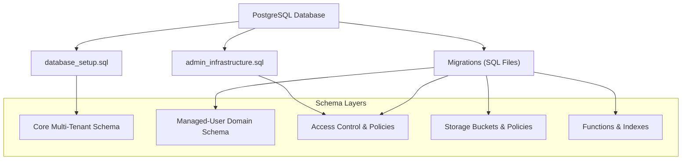
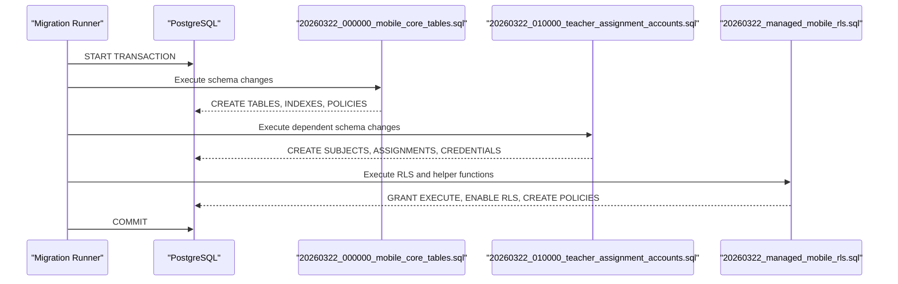
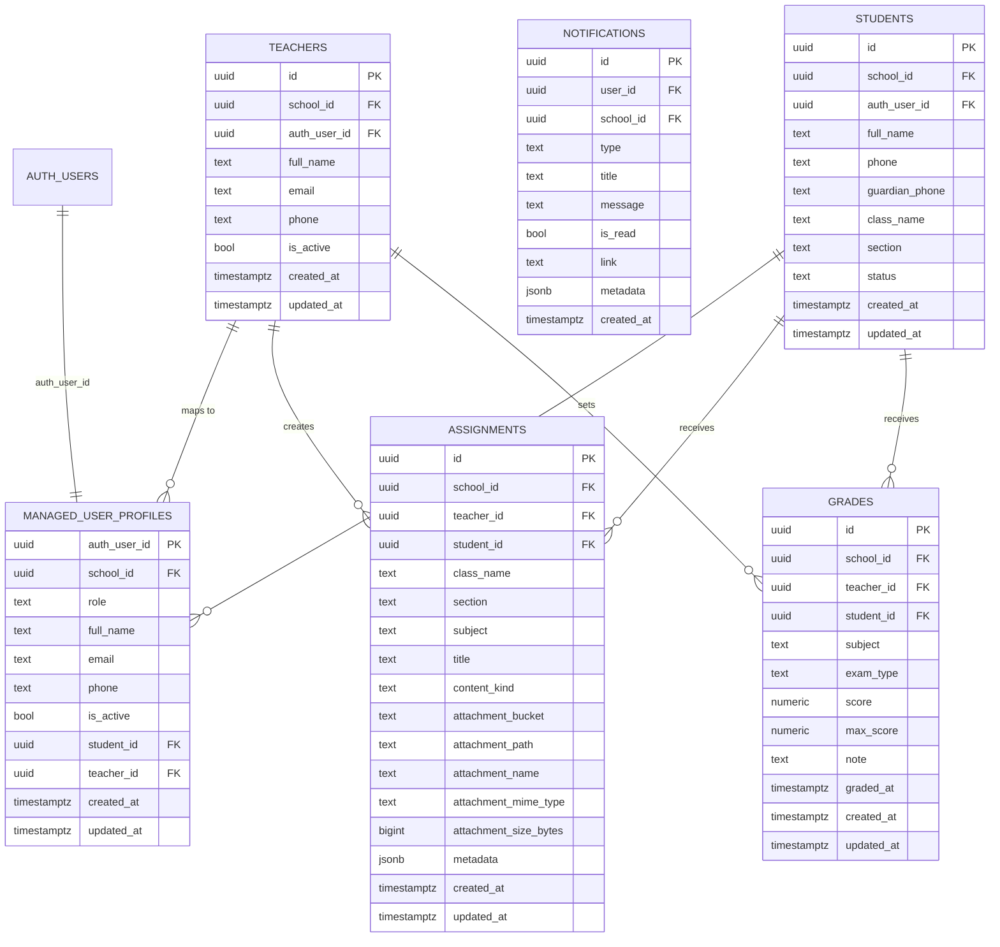
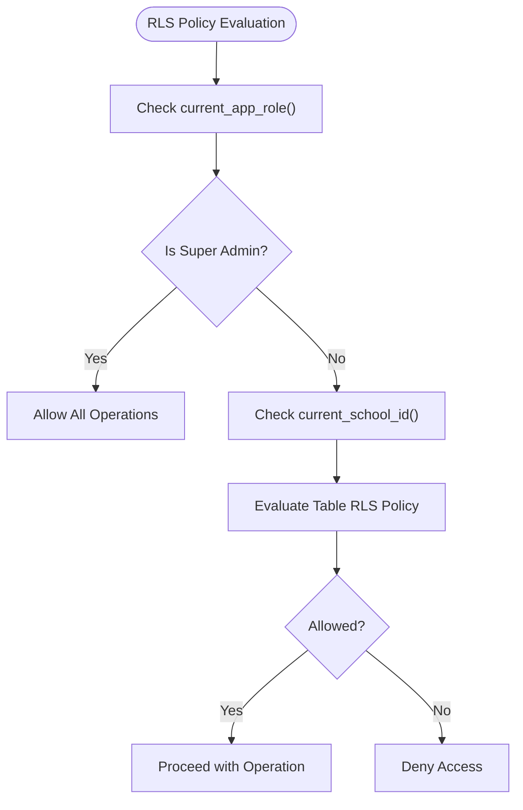
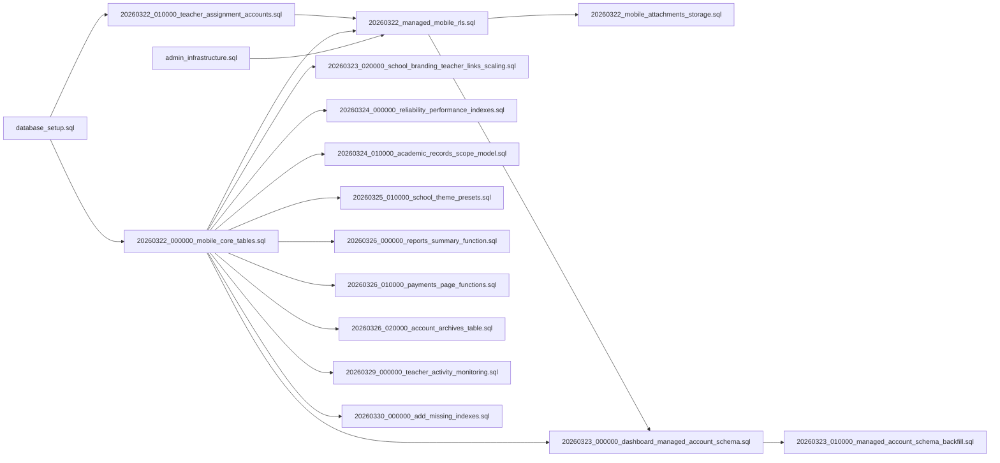

# Migration Management

<cite>
**Referenced Files in This Document**
- [migrations/README.md](file://migrations/README.md)
- [migrations/20260322_000000_mobile_core_tables.sql](file://migrations/20260322_000000_mobile_core_tables.sql)
- [migrations/20260322_010000_teacher_assignment_accounts.sql](file://migrations/20260322_010000_teacher_assignment_accounts.sql)
- [migrations/20260322_managed_mobile_rls.sql](file://migrations/20260322_managed_mobile_rls.sql)
- [migrations/20260322_mobile_attachments_storage.sql](file://migrations/20260322_mobile_attachments_storage.sql)
- [migrations/20260323_000000_dashboard_managed_account_schema.sql](file://migrations/20260323_000000_dashboard_managed_account_schema.sql)
- [migrations/20260323_010000_managed_account_schema_backfill.sql](file://migrations/20260323_010000_managed_account_schema_backfill.sql)
- [migrations/20260323_020000_school_branding_teacher_links_scaling.sql](file://migrations/20260323_020000_school_branding_teacher_links_scaling.sql)
- [migrations/20260324_000000_reliability_performance_indexes.sql](file://migrations/20260324_000000_reliability_performance_indexes.sql)
- [migrations/20260324_010000_academic_records_scope_model.sql](file://migrations/20260324_010000_academic_records_scope_model.sql)
- [migrations/20260325_010000_school_theme_presets.sql](file://migrations/20260325_010000_school_theme_presets.sql)
- [migrations/20260326_000000_reports_summary_function.sql](file://migrations/20260326_000000_reports_summary_function.sql)
- [migrations/20260326_010000_payments_page_functions.sql](file://migrations/20260326_010000_payments_page_functions.sql)
- [migrations/20260326_020000_account_archives_table.sql](file://migrations/20260326_020000_account_archives_table.sql)
- [migrations/20260329_000000_teacher_activity_monitoring.sql](file://migrations/20260329_000000_teacher_activity_monitoring.sql)
- [migrations/20260330_000000_add_missing_indexes.sql](file://migrations/20260330_000000_add_missing_indexes.sql)
- [database_setup.sql](file://database_setup.sql)
- [admin_infrastructure.sql](file://admin_infrastructure.sql)
</cite>

## Table of Contents
1. [Introduction](#introduction)
2. [Project Structure](#project-structure)
3. [Core Components](#core-components)
4. [Architecture Overview](#architecture-overview)
5. [Detailed Component Analysis](#detailed-component-analysis)
6. [Dependency Analysis](#dependency-analysis)
7. [Performance Considerations](#performance-considerations)
8. [Troubleshooting Guide](#troubleshooting-guide)
9. [Conclusion](#conclusion)
10. [Appendices](#appendices)

## Introduction
This document explains the database migration management system for the school application. It covers the migration file naming convention, versioning strategy, schema evolution process, and the relationship between migrations and the broader database setup. It also documents the current scope of migrations (shared managed-user auth/domain tables, teacher assignment and subject schema, storage bucket setup, and RLS helper functions), legacy naming considerations, migration execution and rollback procedures, dependency management, examples, best practices, and testing strategies.

## Project Structure
The migration system is organized under a dedicated directory containing numbered SQL files that evolve the schema, storage, and Row Level Security (RLS) policies. The migrations directory also includes a README that outlines scope, legacy naming, and related SQL files outside the folder.

**Diagram sources**
- [migrations/README.md](file://migrations/README.md)
- [migrations/20260322_000000_mobile_core_tables.sql](file://migrations/20260322_000000_mobile_core_tables.sql)
- [migrations/20260322_010000_teacher_assignment_accounts.sql](file://migrations/20260322_010000_teacher_assignment_accounts.sql)
- [migrations/20260322_managed_mobile_rls.sql](file://migrations/20260322_managed_mobile_rls.sql)
- [migrations/20260322_mobile_attachments_storage.sql](file://migrations/20260322_mobile_attachments_storage.sql)
- [migrations/20260323_000000_dashboard_managed_account_schema.sql](file://migrations/20260323_000000_dashboard_managed_account_schema.sql)
- [migrations/20260323_010000_managed_account_schema_backfill.sql](file://migrations/20260323_010000_managed_account_schema_backfill.sql)
- [migrations/20260323_020000_school_branding_teacher_links_scaling.sql](file://migrations/20260323_020000_school_branding_teacher_links_scaling.sql)
- [migrations/20260324_000000_reliability_performance_indexes.sql](file://migrations/20260324_000000_reliability_performance_indexes.sql)
- [migrations/20260324_010000_academic_records_scope_model.sql](file://migrations/20260324_010000_academic_records_scope_model.sql)
- [migrations/20260325_010000_school_theme_presets.sql](file://migrations/20260325_010000_school_theme_presets.sql)
- [migrations/20260326_000000_reports_summary_function.sql](file://migrations/20260326_000000_reports_summary_function.sql)
- [migrations/20260326_010000_payments_page_functions.sql](file://migrations/20260326_010000_payments_page_functions.sql)
- [migrations/20260326_020000_account_archives_table.sql](file://migrations/20260326_020000_account_archives_table.sql)
- [migrations/20260329_000000_teacher_activity_monitoring.sql](file://migrations/20260329_000000_teacher_activity_monitoring.sql)
- [migrations/20260330_000000_add_missing_indexes.sql](file://migrations/20260330_000000_add_missing_indexes.sql)
- [database_setup.sql](file://database_setup.sql)
- [admin_infrastructure.sql](file://admin_infrastructure.sql)

**Section sources**
- [migrations/README.md](file://migrations/README.md)

## Core Components
- Migration naming convention: Four-part date plus incremental sequence with underscores, followed by a descriptive suffix indicating scope (e.g., mobile_core_tables, teacher_assignment_accounts, managed_mobile_rls, mobile_attachments_storage).
- Versioning strategy: Sequential numbering ensures deterministic ordering and repeatable deployments. The presence of a README clarifies scope and legacy naming rationale.
- Schema evolution: Migrations evolve shared managed-user tables, teacher assignment and subject schema, storage buckets and policies, and RLS helper functions.
- Legacy naming considerations: Filenames may include “mobile” for historical continuity; this does not imply mobile UI ownership of the repository.
- Relationship to broader setup: Migrations complement database_setup.sql (core bootstrap) and admin_infrastructure.sql (admin features and RLS).

**Section sources**
- [migrations/README.md](file://migrations/README.md)
- [migrations/20260322_000000_mobile_core_tables.sql](file://migrations/20260322_000000_mobile_core_tables.sql)
- [migrations/20260322_010000_teacher_assignment_accounts.sql](file://migrations/20260322_010000_teacher_assignment_accounts.sql)
- [migrations/20260322_managed_mobile_rls.sql](file://migrations/20260322_managed_mobile_rls.sql)
- [migrations/20260322_mobile_attachments_storage.sql](file://migrations/20260322_mobile_attachments_storage.sql)
- [database_setup.sql](file://database_setup.sql)
- [admin_infrastructure.sql](file://admin_infrastructure.sql)

## Architecture Overview
The migration system orchestrates schema changes, storage policies, and RLS rules in a layered manner:
- Bootstrap and core schema: database_setup.sql establishes base tables and RLS for multi-tenant entities.
- Managed-user domain: migrations introduce managed_user_profiles, assignments, grades, notifications, and credentials.
- Access control: admin_infrastructure.sql and managed RLS migrations define tenant-aware policies and helper functions.
- Storage: migrations configure storage buckets and access rules for media objects.
- Functions and indexes: specialized migrations add reporting functions, page queries, and performance indexes.

**Diagram sources**
- [database_setup.sql](file://database_setup.sql)
- [admin_infrastructure.sql](file://admin_infrastructure.sql)
- [migrations/20260322_000000_mobile_core_tables.sql](file://migrations/20260322_000000_mobile_core_tables.sql)
- [migrations/20260322_010000_teacher_assignment_accounts.sql](file://migrations/20260322_010000_teacher_assignment_accounts.sql)
- [migrations/20260322_managed_mobile_rls.sql](file://migrations/20260322_managed_mobile_rls.sql)
- [migrations/20260322_mobile_attachments_storage.sql](file://migrations/20260322_mobile_attachments_storage.sql)
- [migrations/20260326_000000_reports_summary_function.sql](file://migrations/20260326_000000_reports_summary_function.sql)
- [migrations/20260326_010000_payments_page_functions.sql](file://migrations/20260326_010000_payments_page_functions.sql)
- [migrations/20260324_000000_reliability_performance_indexes.sql](file://migrations/20260324_000000_reliability_performance_indexes.sql)

## Detailed Component Analysis

### Migration Naming Convention and Versioning
- Pattern: YYYYMMDD_HHMMSS_[description].sql
- Purpose: Ensures chronological ordering and deterministic application.
- Examples:
  - 20260322_000000_mobile_core_tables.sql
  - 20260322_010000_teacher_assignment_accounts.sql
  - 20260322_managed_mobile_rls.sql
  - 20260322_mobile_attachments_storage.sql
  - 20260323_000000_dashboard_managed_account_schema.sql
  - 20260323_010000_managed_account_schema_backfill.sql
  - 20260323_020000_school_branding_teacher_links_scaling.sql
  - 20260324_000000_reliability_performance_indexes.sql
  - 20260324_010000_academic_records_scope_model.sql
  - 20260325_010000_school_theme_presets.sql
  - 20260326_000000_reports_summary_function.sql
  - 20260326_010000_payments_page_functions.sql
  - 20260326_020000_account_archives_table.sql
  - 20260329_000000_teacher_activity_monitoring.sql
  - 20260330_000000_add_missing_indexes.sql

**Section sources**
- [migrations/README.md](file://migrations/README.md)
- [migrations/20260322_000000_mobile_core_tables.sql](file://migrations/20260322_000000_mobile_core_tables.sql)
- [migrations/20260322_010000_teacher_assignment_accounts.sql](file://migrations/20260322_010000_teacher_assignment_accounts.sql)
- [migrations/20260322_managed_mobile_rls.sql](file://migrations/20260322_managed_mobile_rls.sql)
- [migrations/20260322_mobile_attachments_storage.sql](file://migrations/20260322_mobile_attachments_storage.sql)
- [migrations/20260323_000000_dashboard_managed_account_schema.sql](file://migrations/20260323_000000_dashboard_managed_account_schema.sql)
- [migrations/20260323_010000_managed_account_schema_backfill.sql](file://migrations/20260323_010000_managed_account_schema_backfill.sql)
- [migrations/20260323_020000_school_branding_teacher_links_scaling.sql](file://migrations/20260323_020000_school_branding_teacher_links_scaling.sql)
- [migrations/20260324_000000_reliability_performance_indexes.sql](file://migrations/20260324_000000_reliability_performance_indexes.sql)
- [migrations/20260324_010000_academic_records_scope_model.sql](file://migrations/20260324_010000_academic_records_scope_model.sql)
- [migrations/20260325_010000_school_theme_presets.sql](file://migrations/20260325_010000_school_theme_presets.sql)
- [migrations/20260326_000000_reports_summary_function.sql](file://migrations/20260326_000000_reports_summary_function.sql)
- [migrations/20260326_010000_payments_page_functions.sql](file://migrations/20260326_010000_payments_page_functions.sql)
- [migrations/20260326_020000_account_archives_table.sql](file://migrations/20260326_020000_account_archives_table.sql)
- [migrations/20260329_000000_teacher_activity_monitoring.sql](file://migrations/20260329_000000_teacher_activity_monitoring.sql)
- [migrations/20260330_000000_add_missing_indexes.sql](file://migrations/20260330_000000_add_missing_indexes.sql)

### Legacy Naming Considerations
- Some filenames include “mobile” for historical continuity; this is preserved for migration history stability.
- The README clarifies that “mobile” does not imply mobile UI ownership of this repository.
- Scope remains database-focused regardless of legacy naming.

**Section sources**
- [migrations/README.md](file://migrations/README.md)
- [migrations/20260322_000000_mobile_core_tables.sql](file://migrations/20260322_000000_mobile_core_tables.sql)
- [migrations/20260322_managed_mobile_rls.sql](file://migrations/20260322_managed_mobile_rls.sql)
- [migrations/20260322_mobile_attachments_storage.sql](file://migrations/20260322_mobile_attachments_storage.sql)

### Migration Execution and Rollback Procedures
- Execution model: Each migration runs inside a transaction block to ensure atomicity.
- Rollback: There is no automated rollback mechanism in the provided files. Rollbacks should be designed per-migration and documented separately.
- Dependency management: Migrations are ordered by filename; later migrations depend on earlier ones. For example, managed-user RLS depends on helper functions created by earlier migrations.

**Diagram sources**
- [migrations/20260322_000000_mobile_core_tables.sql](file://migrations/20260322_000000_mobile_core_tables.sql)
- [migrations/20260322_010000_teacher_assignment_accounts.sql](file://migrations/20260322_010000_teacher_assignment_accounts.sql)
- [migrations/20260322_managed_mobile_rls.sql](file://migrations/20260322_managed_mobile_rls.sql)

**Section sources**
- [migrations/20260322_000000_mobile_core_tables.sql](file://migrations/20260322_000000_mobile_core_tables.sql)
- [migrations/20260322_010000_teacher_assignment_accounts.sql](file://migrations/20260322_010000_teacher_assignment_accounts.sql)
- [migrations/20260322_managed_mobile_rls.sql](file://migrations/20260322_managed_mobile_rls.sql)

### Schema Evolution: Managed-User Domain
- Core tables: managed_user_profiles, assignments, grades, notifications, managed_user_credentials.
- Constraints and indexes: unique constraints on auth_user_id, role-specific relations, and indexes for performance.
- Backfill and updates: migrations populate managed_user_profiles from existing teachers and students, and add auth_user_id columns.

**Diagram sources**
- [migrations/20260322_000000_mobile_core_tables.sql](file://migrations/20260322_000000_mobile_core_tables.sql)
- [migrations/20260322_010000_teacher_assignment_accounts.sql](file://migrations/20260322_010000_teacher_assignment_accounts.sql)

**Section sources**
- [migrations/20260322_000000_mobile_core_tables.sql](file://migrations/20260322_000000_mobile_core_tables.sql)
- [migrations/20260322_010000_teacher_assignment_accounts.sql](file://migrations/20260322_010000_teacher_assignment_accounts.sql)

### Access Control and RLS
- Helper functions: current_app_role(), current_school_id(), current_managed_*(), teacher_can_access_class(), teacher_can_access_student(), student_can_read_assignment(), teacher_can_read_assignment(), teacher_can_write_assignment().
- Policies: tenant-aware SELECT/INSERT/UPDATE/DELETE policies on managed tables; storage policies for bucket access.

**Diagram sources**
- [migrations/20260322_managed_mobile_rls.sql](file://migrations/20260322_managed_mobile_rls.sql)
- [migrations/20260322_000000_mobile_core_tables.sql](file://migrations/20260322_000000_mobile_core_tables.sql)
- [admin_infrastructure.sql](file://admin_infrastructure.sql)

**Section sources**
- [migrations/20260322_managed_mobile_rls.sql](file://migrations/20260322_managed_mobile_rls.sql)
- [admin_infrastructure.sql](file://admin_infrastructure.sql)

### Storage Bucket Setup and Policies
- Adds attachment metadata to assignments and creates storage.buckets entry for media.
- Defines helper functions can_manage_school_media() and can_read_school_media() for access control.
- Creates storage policies for SELECT/INSERT/UPDATE/DELETE on bucket objects.

**Section sources**
- [migrations/20260322_mobile_attachments_storage.sql](file://migrations/20260322_mobile_attachments_storage.sql)

### Functions and Reporting
- school_reports_summary(): aggregates student, payment, expense, and salary metrics for a school.
- school_payments_summary(): computes payment summaries and year lists.
- school_payment_students_page(): paginated student listing with filters and counts.

**Section sources**
- [migrations/20260326_000000_reports_summary_function.sql](file://migrations/20260326_000000_reports_summary_function.sql)
- [migrations/20260326_010000_payments_page_functions.sql](file://migrations/20260326_010000_payments_page_functions.sql)

### Indexes and Performance
- Adds indexes on foreign keys and frequently queried columns to improve query performance.
- Adjusts foreign key cascade behavior for consistency.

**Section sources**
- [migrations/20260324_000000_reliability_performance_indexes.sql](file://migrations/20260324_000000_reliability_performance_indexes.sql)
- [migrations/20260330_000000_add_missing_indexes.sql](file://migrations/20260330_000000_add_missing_indexes.sql)

### Teacher Activity Monitoring
- Extends assignments and notifications with branch_id, status, moderation fields, and triggers to infer scope defaults.
- Adds monitoring views for teacher message groups and homework monitoring.

**Section sources**
- [migrations/20260329_000000_teacher_activity_monitoring.sql](file://migrations/20260329_000000_teacher_activity_monitoring.sql)

### Account Archives
- Introduces account_archives table with tenant-aware RLS policies.

**Section sources**
- [migrations/20260326_020000_account_archives_table.sql](file://migrations/20260326_020000_account_archives_table.sql)

## Dependency Analysis
Migrations depend on prior migrations and on the base schema established by database_setup.sql and admin_infrastructure.sql. The dependency chain is primarily temporal (earlier migrations create prerequisites for later ones).

**Diagram sources**
- [database_setup.sql](file://database_setup.sql)
- [admin_infrastructure.sql](file://admin_infrastructure.sql)
- [migrations/20260322_000000_mobile_core_tables.sql](file://migrations/20260322_000000_mobile_core_tables.sql)
- [migrations/20260322_010000_teacher_assignment_accounts.sql](file://migrations/20260322_010000_teacher_assignment_accounts.sql)
- [migrations/20260322_managed_mobile_rls.sql](file://migrations/20260322_managed_mobile_rls.sql)
- [migrations/20260322_mobile_attachments_storage.sql](file://migrations/20260322_mobile_attachments_storage.sql)
- [migrations/20260323_000000_dashboard_managed_account_schema.sql](file://migrations/20260323_000000_dashboard_managed_account_schema.sql)
- [migrations/20260323_010000_managed_account_schema_backfill.sql](file://migrations/20260323_010000_managed_account_schema_backfill.sql)
- [migrations/20260323_020000_school_branding_teacher_links_scaling.sql](file://migrations/20260323_020000_school_branding_teacher_links_scaling.sql)
- [migrations/20260324_000000_reliability_performance_indexes.sql](file://migrations/20260324_000000_reliability_performance_indexes.sql)
- [migrations/20260324_010000_academic_records_scope_model.sql](file://migrations/20260324_010000_academic_records_scope_model.sql)
- [migrations/20260325_010000_school_theme_presets.sql](file://migrations/20260325_010000_school_theme_presets.sql)
- [migrations/20260326_000000_reports_summary_function.sql](file://migrations/20260326_000000_reports_summary_function.sql)
- [migrations/20260326_010000_payments_page_functions.sql](file://migrations/20260326_010000_payments_page_functions.sql)
- [migrations/20260326_020000_account_archives_table.sql](file://migrations/20260326_020000_account_archives_table.sql)
- [migrations/20260329_000000_teacher_activity_monitoring.sql](file://migrations/20260329_000000_teacher_activity_monitoring.sql)
- [migrations/20260330_000000_add_missing_indexes.sql](file://migrations/20260330_000000_add_missing_indexes.sql)

**Section sources**
- [migrations/README.md](file://migrations/README.md)
- [database_setup.sql](file://database_setup.sql)
- [admin_infrastructure.sql](file://admin_infrastructure.sql)

## Performance Considerations
- Index coverage: Migrations add indexes on foreign keys and frequently filtered/sorted columns to improve query performance.
- Cascade consistency: Foreign keys are standardized to CASCADE for tenant-scoped tables to avoid NULL inconsistencies.
- Function-based indexes: Consider adding expression indexes for computed columns if frequently queried.

[No sources needed since this section provides general guidance]

## Troubleshooting Guide
- Transaction failures: Each migration runs in a transaction; check for constraint violations, missing dependencies, or policy conflicts.
- Policy conflicts: Ensure helper functions exist before creating policies that depend on them.
- Storage access: Verify bucket existence and storage policies for media uploads/downloads.
- RLS evaluation: Confirm current_app_role() and current_school_id() return expected values for the authenticated user.

**Section sources**
- [migrations/20260322_managed_mobile_rls.sql](file://migrations/20260322_managed_mobile_rls.sql)
- [migrations/20260322_mobile_attachments_storage.sql](file://migrations/20260322_mobile_attachments_storage.sql)
- [migrations/20260330_000000_add_missing_indexes.sql](file://migrations/20260330_000000_add_missing_indexes.sql)

## Conclusion
The migration system employs a strict naming and versioning scheme to manage schema evolution across managed-user domains, RLS, storage, and performance enhancements. Legacy “mobile” naming is preserved for historical continuity while the scope remains database-centric. Migrations are ordered and interdependent, relying on database_setup.sql and admin_infrastructure.sql for foundational schema and policies. Best practices include careful dependency management, transactional execution, and thorough testing of RLS and storage policies.

[No sources needed since this section summarizes without analyzing specific files]

## Appendices

### Migration Execution Best Practices
- Always wrap changes in BEGIN/COMMIT blocks.
- Use DO $$ ... $$ blocks to conditionally create indexes/functions/policies.
- Test RLS policies against helper functions before enabling.
- Validate storage policies with realistic object paths.

**Section sources**
- [migrations/20260322_000000_mobile_core_tables.sql](file://migrations/20260322_000000_mobile_core_tables.sql)
- [migrations/20260322_010000_teacher_assignment_accounts.sql](file://migrations/20260322_010000_teacher_assignment_accounts.sql)
- [migrations/20260322_managed_mobile_rls.sql](file://migrations/20260322_managed_mobile_rls.sql)
- [migrations/20260322_mobile_attachments_storage.sql](file://migrations/20260322_mobile_attachments_storage.sql)

### Testing Strategies
- Unit test helper functions via direct invocation with known inputs.
- Snapshot test RLS policies by simulating authenticated sessions with different roles.
- Load test index-heavy queries after adding new indexes.
- Regression test storage policies by attempting uploads/downloads with various object names.

[No sources needed since this section provides general guidance]