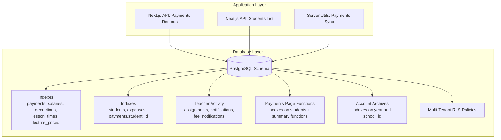
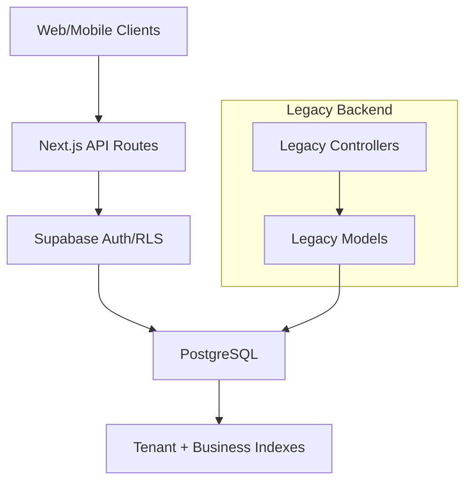
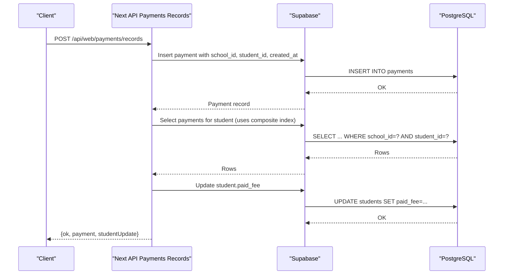
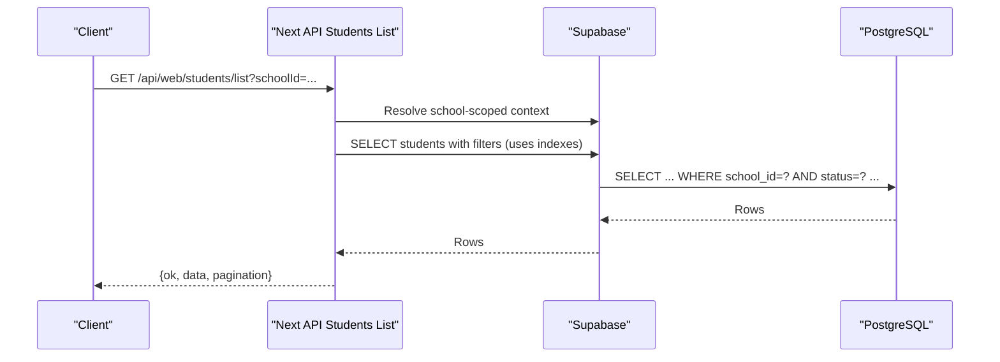
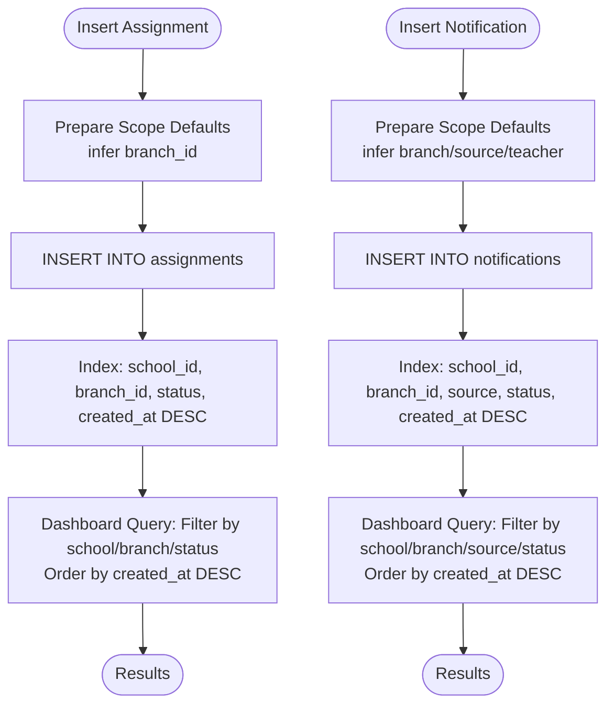
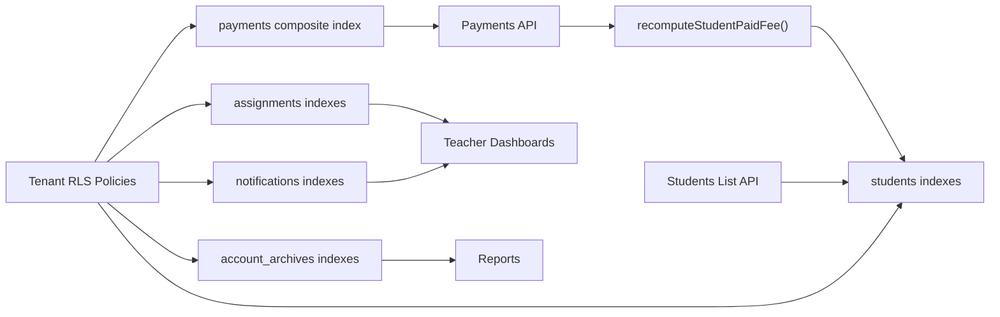

# Performance & Indexing Strategy

<cite>
**Referenced Files in This Document**
- [20260324_000000_reliability_performance_indexes.sql](file://migrations/20260324_000000_reliability_performance_indexes.sql)
- [20260330_000000_add_missing_indexes.sql](file://migrations/20260330_000000_add_missing_indexes.sql)
- [20260329_000000_teacher_activity_monitoring.sql](file://migrations/20260329_000000_teacher_activity_monitoring.sql)
- [20260326_010000_payments_page_functions.sql](file://migrations/20260326_010000_payments_page_functions.sql)
- [20260326_020000_account_archives_table.sql](file://migrations/20260326_020000_account_archives_table.sql)
- [database_setup.sql](file://database_setup.sql)
- [admin_infrastructure.sql](file://admin_infrastructure.sql)
- [payments-server.ts](file://lib/payments-server.ts)
- [route.ts](file://app/api/web/payments/records/route.ts)
- [route.ts](file://app/api/web/students/list/route.ts)
- [Payment.js](file://00990090/school-accounting-system/backend/src/models/Payment.js)
- [studentController.js](file://00990090/school-accounting-system/backend/src/controllers/studentController.js)
</cite>

## Table of Contents
1. [Introduction](#introduction)
2. [Project Structure](#project-structure)
3. [Core Components](#core-components)
4. [Architecture Overview](#architecture-overview)
5. [Detailed Component Analysis](#detailed-component-analysis)
6. [Dependency Analysis](#dependency-analysis)
7. [Performance Considerations](#performance-considerations)
8. [Troubleshooting Guide](#troubleshooting-guide)
9. [Conclusion](#conclusion)

## Introduction
This document details the database performance optimization and indexing strategy implemented across the school management system. It focuses on reliability and performance indexes for critical tables related to student management, payment processing, and teacher activity monitoring. It explains the rationale behind specific index choices, documents missing indexes identified and added, and outlines query optimization techniques, explain plan analysis, and performance tuning guidelines. It also connects indexing strategy to the overall system architecture, including considerations for multi-tenant scaling and concurrent access patterns.

## Project Structure
The performance and indexing work spans several migration scripts and application layers:
- Database bootstrap and multi-tenant RLS policies
- Dedicated performance index migrations
- Application API routes and server-side logic that drive query patterns
- Legacy accounting system models and controllers

**Diagram sources**
- [20260324_000000_reliability_performance_indexes.sql:1-24](file://migrations/20260324_000000_reliability_performance_indexes.sql#L1-L24)
- [20260330_000000_add_missing_indexes.sql:1-11](file://migrations/20260330_000000_add_missing_indexes.sql#L1-L11)
- [20260329_000000_teacher_activity_monitoring.sql:104-112](file://migrations/20260329_000000_teacher_activity_monitoring.sql#L104-L112)
- [20260326_010000_payments_page_functions.sql:1-10](file://migrations/20260326_010000_payments_page_functions.sql#L1-L10)
- [20260326_020000_account_archives_table.sql:13-17](file://migrations/20260326_020000_account_archives_table.sql#L13-L17)
- [database_setup.sql:524-614](file://database_setup.sql#L524-L614)
- [route.ts:82-96](file://app/api/web/payments/records/route.ts#L82-L96)
- [route.ts:40-43](file://app/api/web/students/list/route.ts#L40-L43)
- [payments-server.ts:10-14](file://lib/payments-server.ts#L10-L14)

**Section sources**
- [database_setup.sql:524-614](file://database_setup.sql#L524-L614)
- [20260324_000000_reliability_performance_indexes.sql:1-24](file://migrations/20260324_000000_reliability_performance_indexes.sql#L1-L24)
- [20260330_000000_add_missing_indexes.sql:1-11](file://migrations/20260330_000000_add_missing_indexes.sql#L1-L11)
- [20260329_000000_teacher_activity_monitoring.sql:104-112](file://migrations/20260329_000000_teacher_activity_monitoring.sql#L104-L112)
- [20260326_010000_payments_page_functions.sql:1-10](file://migrations/20260326_010000_payments_page_functions.sql#L1-L10)
- [20260326_020000_account_archives_table.sql:13-17](file://migrations/20260326_020000_account_archives_table.sql#L13-L17)

## Core Components
- Multi-tenant RLS and tenant-scoped indexes: Ensures queries filter by school_id efficiently and securely.
- Payment-centric indexes: Composite indexes on payments and student-level metrics to accelerate reporting and listing.
- Teacher activity monitoring indexes: Composite indexes on assignments and notifications to support teacher dashboards and moderation workflows.
- Account archives indexes: Efficient lookups by year and school for financial archiving.
- Missing indexes added: Foreign-key indexes on students, expenses, and payments.student_id to improve join performance.

These indexes align with frequent query patterns:
- Payments listing by school and date
- Student lists filtered by school/class/status
- Teacher activity grouping by status and created_at
- Financial summaries and per-student payment counts

**Section sources**
- [database_setup.sql:524-614](file://database_setup.sql#L524-L614)
- [20260324_000000_reliability_performance_indexes.sql:1-24](file://migrations/20260324_000000_reliability_performance_indexes.sql#L1-L24)
- [20260330_000000_add_missing_indexes.sql:1-11](file://migrations/20260330_000000_add_missing_indexes.sql#L1-L11)
- [20260329_000000_teacher_activity_monitoring.sql:104-112](file://migrations/20260329_000000_teacher_activity_monitoring.sql#L104-L112)
- [20260326_010000_payments_page_functions.sql:1-10](file://migrations/20260326_010000_payments_page_functions.sql#L1-L10)
- [20260326_020000_account_archives_table.sql:13-17](file://migrations/20260326_020000_account_archives_table.sql#L13-L17)

## Architecture Overview
The indexing strategy supports a dual-layer architecture:
- Modern Next.js API routes that enforce RLS and perform scoped reads/writes
- Legacy accounting system models and controllers that still query the same schema

**Diagram sources**
- [route.ts:48-65](file://app/api/web/payments/records/route.ts#L48-L65)
- [route.ts:13-27](file://app/api/web/students/list/route.ts#L13-L27)
- [database_setup.sql:524-614](file://database_setup.sql#L524-L614)

## Detailed Component Analysis

### Payments: Composite Indexes and Reporting Functions
Rationale:
- Composite index on payments(school_id, student_id, created_at DESC) supports efficient per-school payment listings and recent-first ordering.
- Additional indexes on salaries, deductions, lecture_prices, lesson_times enhance reporting and scheduling queries.
- Functions for payments page (per-student counts, summaries) rely on indexes to avoid sequential scans.

Implementation highlights:
- Index creation guarded by existence checks to prevent errors on repeated runs.
- Functions compute aggregated metrics per school and per-student, leveraging indexes for fast filtering.

**Diagram sources**
- [route.ts:82-96](file://app/api/web/payments/records/route.ts#L82-L96)
- [payments-server.ts:10-14](file://lib/payments-server.ts#L10-L14)
- [20260324_000000_reliability_performance_indexes.sql:3-5](file://migrations/20260324_000000_reliability_performance_indexes.sql#L3-L5)
- [20260326_010000_payments_page_functions.sql:1-10](file://migrations/20260326_010000_payments_page_functions.sql#L1-L10)

**Section sources**
- [20260324_000000_reliability_performance_indexes.sql:1-24](file://migrations/20260324_000000_reliability_performance_indexes.sql#L1-L24)
- [20260326_010000_payments_page_functions.sql:12-67](file://migrations/20260326_010000_payments_page_functions.sql#L12-L67)
- [route.ts:82-96](file://app/api/web/payments/records/route.ts#L82-L96)
- [payments-server.ts:10-14](file://lib/payments-server.ts#L10-L14)

### Students: Tenant Filtering and Listing
Rationale:
- Indexes on students(school_id, status, full_name) and students(school_id, class_name) enable fast filtered lists and sorting.
- Listing API enforces RLS via resolved school context and applies rate limiting to protect the database under load.

**Diagram sources**
- [route.ts:11-43](file://app/api/web/students/list/route.ts#L11-L43)
- [20260326_010000_payments_page_functions.sql:3-9](file://migrations/20260326_010000_payments_page_functions.sql#L3-L9)
- [database_setup.sql:524-614](file://database_setup.sql#L524-L614)

**Section sources**
- [20260326_010000_payments_page_functions.sql:1-10](file://migrations/20260326_010000_payments_page_functions.sql#L1-L10)
- [route.ts:11-43](file://app/api/web/students/list/route.ts#L11-L43)

### Teacher Activity Monitoring: Assignments and Notifications
Rationale:
- Composite indexes on assignments(school_id, branch_id, status, created_at DESC) and notifications(school_id, branch_id, source, status, created_at DESC) optimize teacher dashboards and moderation views.
- Additional indexes on assignments(teacher_id, status, created_at DESC) and notifications(teacher_id, sender_user_id, created_at DESC) support per-user activity feeds.

**Diagram sources**
- [20260329_000000_teacher_activity_monitoring.sql:104-112](file://migrations/20260329_000000_teacher_activity_monitoring.sql#L104-L112)
- [20260329_000000_teacher_activity_monitoring.sql:330-340](file://migrations/20260329_000000_teacher_activity_monitoring.sql#L330-L340)

**Section sources**
- [20260329_000000_teacher_activity_monitoring.sql:104-112](file://migrations/20260329_000000_teacher_activity_monitoring.sql#L104-L112)
- [20260329_000000_teacher_activity_monitoring.sql:330-340](file://migrations/20260329_000000_teacher_activity_monitoring.sql#L330-L340)

### Account Archives: Year and School Scoping
Rationale:
- Indexes on account_archives(school_id) and account_archives(archive_year) support efficient financial archiving and retrieval by year.

**Section sources**
- [20260326_020000_account_archives_table.sql:13-17](file://migrations/20260326_020000_account_archives_table.sql#L13-L17)

### Missing Indexes Added and Cascade Behavior
- Added missing indexes on foreign keys: students(school_id), expenses(school_id), payments(student_id).
- Standardized cascade behavior for attendance_records.school_id to ON DELETE CASCADE to align with other tenant-scoped tables.

Impact:
- Improved join performance for listing and reporting.
- Consistent referential integrity and cascading deletes across tenant tables.

**Section sources**
- [20260330_000000_add_missing_indexes.sql:1-11](file://migrations/20260330_000000_add_missing_indexes.sql#L1-L11)

## Dependency Analysis
The following diagram maps the primary dependencies between indexes, functions, and API routes that drive query patterns.

**Diagram sources**
- [20260324_000000_reliability_performance_indexes.sql:1-24](file://migrations/20260324_000000_reliability_performance_indexes.sql#L1-L24)
- [20260330_000000_add_missing_indexes.sql:1-11](file://migrations/20260330_000000_add_missing_indexes.sql#L1-L11)
- [20260329_000000_teacher_activity_monitoring.sql:104-112](file://migrations/20260329_000000_teacher_activity_monitoring.sql#L104-L112)
- [20260326_020000_account_archives_table.sql:13-17](file://migrations/20260326_020000_account_archives_table.sql#L13-L17)
- [payments-server.ts:10-14](file://lib/payments-server.ts#L10-L14)
- [route.ts:40-43](file://app/api/web/students/list/route.ts#L40-L43)
- [route.ts:82-96](file://app/api/web/payments/records/route.ts#L82-L96)
- [database_setup.sql:524-614](file://database_setup.sql#L524-L614)

**Section sources**
- [database_setup.sql:524-614](file://database_setup.sql#L524-L614)
- [20260324_000000_reliability_performance_indexes.sql:1-24](file://migrations/20260324_000000_reliability_performance_indexes.sql#L1-L24)
- [20260330_000000_add_missing_indexes.sql:1-11](file://migrations/20260330_000000_add_missing_indexes.sql#L1-L11)
- [20260329_000000_teacher_activity_monitoring.sql:104-112](file://migrations/20260329_000000_teacher_activity_monitoring.sql#L104-L112)
- [20260326_020000_account_archives_table.sql:13-17](file://migrations/20260326_020000_account_archives_table.sql#L13-L17)
- [payments-server.ts:10-14](file://lib/payments-server.ts#L10-L14)
- [route.ts:40-43](file://app/api/web/students/list/route.ts#L40-L43)
- [route.ts:82-96](file://app/api/web/payments/records/route.ts#L82-L96)

## Performance Considerations
- Composite index design:
  - Use leading columns that match equality predicates in WHERE clauses.
  - Place order-sensitive columns (like created_at DESC) at the end of the index to support range scans and ORDER BY without extra sorting.
- Cost-based optimization:
  - Prefer selective leading columns (school_id) to reduce index width and I/O.
  - Ensure statistics are up-to-date so the planner chooses optimal plans.
- Concurrency and locking:
  - Batch updates (e.g., recomputeStudentPaidFee) minimize contention; consider background jobs for heavy recomputations.
- Monitoring:
  - Track slow query logs and analyze EXPLAIN/EXPLAIN ANALYZE for queries using the new indexes.
  - Observe index scan vs. sequential scan indicators and adjust indexes accordingly.
- Maintenance:
  - Regular VACUUM/ANALYZE after bulk loads.
  - Periodic reindexing if fragmentation becomes significant.

[No sources needed since this section provides general guidance]

## Troubleshooting Guide
Common issues and resolutions:
- Slow payments listing:
  - Verify payments composite index exists and is being used (check query plan).
  - Ensure requests include school_id filters.
- Missing student records in lists:
  - Confirm tenant RLS policies are applied and the requesting user belongs to the correct school.
- Teacher dashboard slowness:
  - Confirm assignments and notifications indexes exist and are used for filtering by status and created_at.
- Payment sync delays:
  - Monitor recomputeStudentPaidFee queries; ensure payments.student_id index is present for efficient aggregation.

Monitoring approaches:
- Use EXPLAIN/EXPLAIN ANALYZE to confirm index usage.
- Set up database performance monitoring and alert on long-running queries.
- Review Supabase logs for RLS policy violations or permission errors.

**Section sources**
- [20260324_000000_reliability_performance_indexes.sql:1-24](file://migrations/20260324_000000_reliability_performance_indexes.sql#L1-L24)
- [20260330_000000_add_missing_indexes.sql:1-11](file://migrations/20260330_000000_add_missing_indexes.sql#L1-L11)
- [20260329_000000_teacher_activity_monitoring.sql:104-112](file://migrations/20260329_000000_teacher_activity_monitoring.sql#L104-L112)
- [payments-server.ts:10-14](file://lib/payments-server.ts#L10-L14)

## Conclusion
The indexing strategy aligns closely with real-world query patterns across student management, payment processing, and teacher activity monitoring. By adding missing foreign-key indexes, introducing composite indexes for tenant scoping and time-series ordering, and supporting reporting functions, the system achieves improved query performance and scalability. The strategy integrates seamlessly with multi-tenant RLS and concurrent access patterns, ensuring both correctness and efficiency at scale.