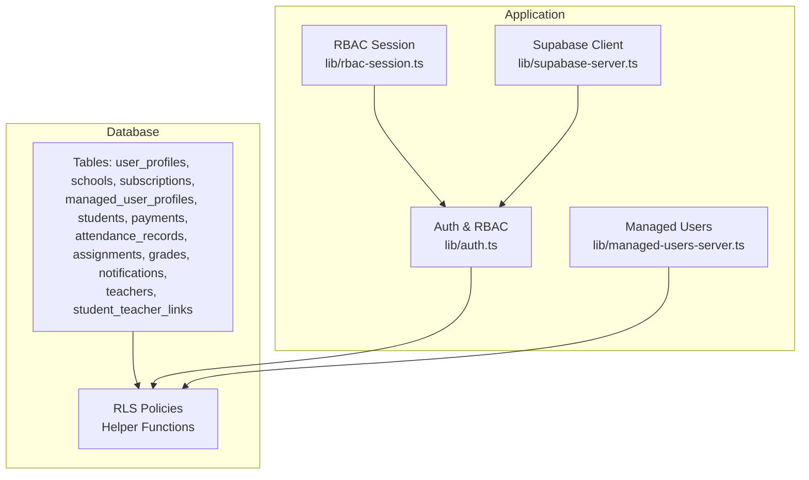
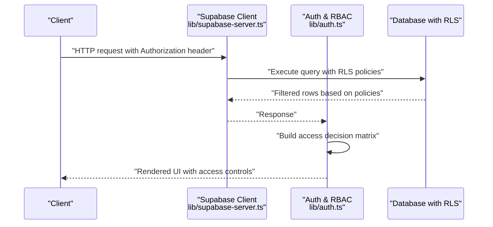
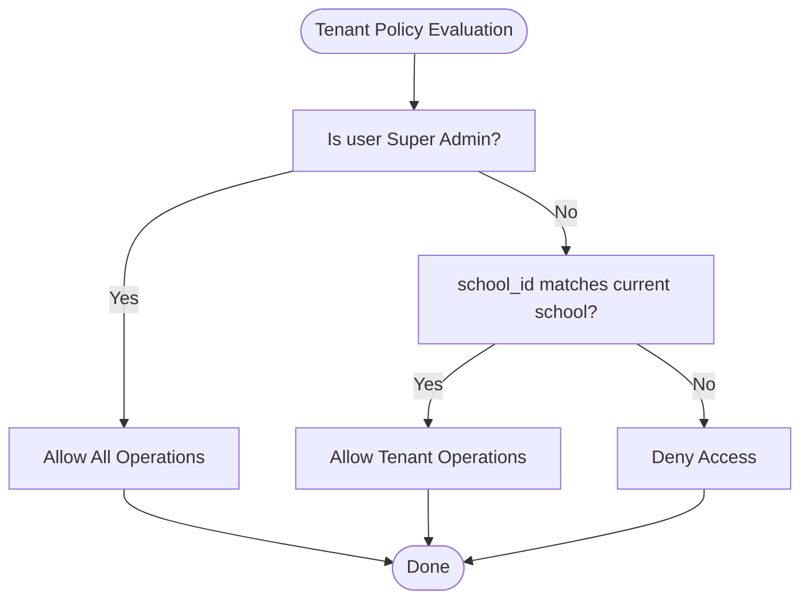
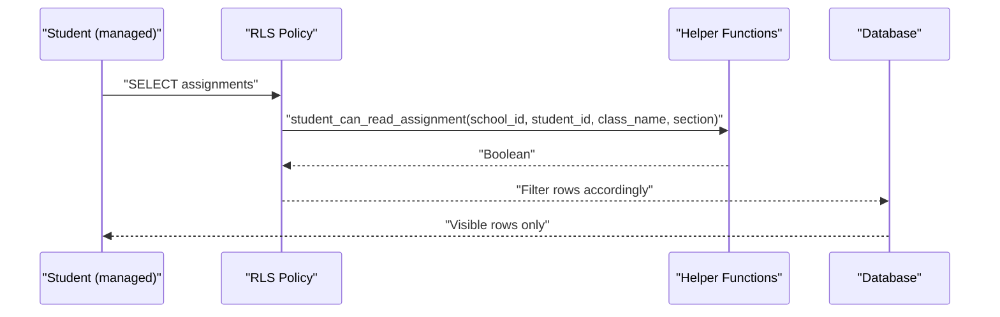
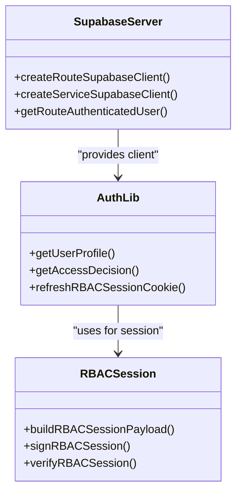
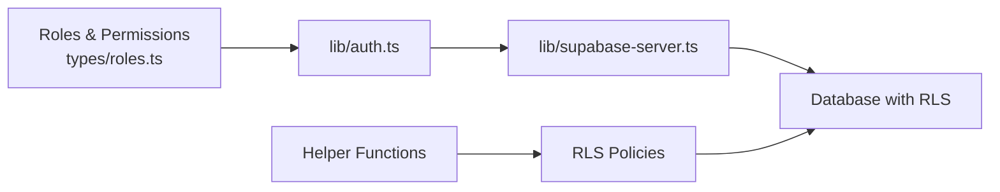

# Row Level Security Policies

<cite>
**Referenced Files in This Document**
- [20260322_managed_mobile_rls.sql](file://migrations/20260322_managed_mobile_rls.sql)
- [database_setup.sql](file://database_setup.sql)
- [admin_infrastructure.sql](file://admin_infrastructure.sql)
- [20260323_020000_school_branding_teacher_links_scaling.sql](file://migrations/20260323_020000_school_branding_teacher_links_scaling.sql)
- [20260324_000000_reliability_performance_indexes.sql](file://migrations/20260324_000000_reliability_performance_indexes.sql)
- [roles.ts](file://types/roles.ts)
- [auth.ts](file://lib/auth.ts)
- [rbac-session.ts](file://lib/rbac-session.ts)
- [supabase-server.ts](file://lib/supabase-server.ts)
- [managed-users-server.ts](file://lib/managed-users-server.ts)
- [managed-users.ts](file://lib/managed-users.ts)
</cite>

## Table of Contents
1. [Introduction](#introduction)
2. [Project Structure](#project-structure)
3. [Core Components](#core-components)
4. [Architecture Overview](#architecture-overview)
5. [Detailed Component Analysis](#detailed-component-analysis)
6. [Dependency Analysis](#dependency-analysis)
7. [Performance Considerations](#performance-considerations)
8. [Troubleshooting Guide](#troubleshooting-guide)
9. [Conclusion](#conclusion)

## Introduction
This document explains the Row Level Security (RLS) policies that enforce multi-tenant data isolation and role-based access control across the system. It focuses on:
- Helper functions that resolve current user roles and scopes
- Access rules for managed users (students and teachers)
- Policy implementations that isolate data by school and branch
- Integration with Supabase authentication, session management, and RBAC
- School branding and teacher-student linking policies
- Performance considerations, debugging techniques, and troubleshooting

## Project Structure
The RLS implementation spans database migrations and application-level libraries:
- Database-level RLS and helper functions are defined in migration and setup SQL files
- Application-level RBAC and session management are implemented in TypeScript libraries
- Types define roles, permissions, and route-level access rules

**Diagram sources**
- [20260322_managed_mobile_rls.sql:1-580](file://migrations/20260322_managed_mobile_rls.sql#L1-L580)
- [database_setup.sql:1-614](file://database_setup.sql#L1-L614)
- [admin_infrastructure.sql:1-156](file://admin_infrastructure.sql#L1-L156)
- [20260323_020000_school_branding_teacher_links_scaling.sql:1-139](file://migrations/20260323_020000_school_branding_teacher_links_scaling.sql#L1-L139)
- [auth.ts:1-341](file://lib/auth.ts#L1-L341)
- [rbac-session.ts:1-153](file://lib/rbac-session.ts#L1-L153)
- [supabase-server.ts:1-75](file://lib/supabase-server.ts#L1-L75)
- [managed-users-server.ts:1-800](file://lib/managed-users-server.ts#L1-L800)

**Section sources**
- [20260322_managed_mobile_rls.sql:1-580](file://migrations/20260322_managed_mobile_rls.sql#L1-L580)
- [database_setup.sql:1-614](file://database_setup.sql#L1-L614)
- [admin_infrastructure.sql:1-156](file://admin_infrastructure.sql#L1-L156)
- [20260323_020000_school_branding_teacher_links_scaling.sql:1-139](file://migrations/20260323_020000_school_branding_teacher_links_scaling.sql#L1-L139)
- [auth.ts:1-341](file://lib/auth.ts#L1-L341)
- [rbac-session.ts:1-153](file://lib/rbac-session.ts#L1-L153)
- [supabase-server.ts:1-75](file://lib/supabase-server.ts#L1-L75)
- [managed-users-server.ts:1-800](file://lib/managed-users-server.ts#L1-L800)

## Core Components
- Database helper functions:
  - Resolve current application role and school ID for authenticated users
  - Resolve current managed role, school ID, student/teacher IDs, and activity status for managed-user accounts
  - Validate teacher access to classes and students, and student/teacher access to assignments
- Tenant isolation policies:
  - Enforce per-school visibility and modification rules for most tenant tables
  - Super Admin and Admin roles bypass restrictions based on current school context
- Managed-user policies:
  - Isolate student and teacher views to their own records or permitted scope
  - Restrict assignment, grade, attendance, and payment access based on role and relationships
- Admin infrastructure policies:
  - Audit logs, notifications, feature flags, and custom roles are restricted to Super Admin
- Branding and teacher-student links:
  - Schools support branding columns and auto-linking table for teacher-student relationships
  - Policies enforce per-school access to these resources

**Section sources**
- [database_setup.sql:419-447](file://database_setup.sql#L419-L447)
- [20260322_managed_mobile_rls.sql:7-72](file://migrations/20260322_managed_mobile_rls.sql#L7-L72)
- [20260322_managed_mobile_rls.sql:100-314](file://migrations/20260322_managed_mobile_rls.sql#L100-L314)
- [admin_infrastructure.sql:29-90](file://admin_infrastructure.sql#L29-L90)
- [20260323_020000_school_branding_teacher_links_scaling.sql:24-76](file://migrations/20260323_020000_school_branding_teacher_links_scaling.sql#L24-L76)

## Architecture Overview
The RLS architecture combines database-level enforcement with application-level RBAC and session management.

**Diagram sources**
- [supabase-server.ts:1-75](file://lib/supabase-server.ts#L1-L75)
- [auth.ts:106-145](file://lib/auth.ts#L106-L145)
- [database_setup.sql:452-520](file://database_setup.sql#L452-L520)
- [20260322_managed_mobile_rls.sql:315-432](file://migrations/20260322_managed_mobile_rls.sql#L315-L432)

## Detailed Component Analysis

### Database Helper Functions
- Application-level:
  - current_app_role(): resolves authenticated user’s role from user_profiles
  - current_school_id(): resolves authenticated user’s school_id from user_profiles
- Managed-user-level:
  - current_managed_role(), current_managed_school_id(), current_managed_student_id(), current_managed_teacher_id(), current_managed_is_active()
  - current_managed_student_class_name(), current_managed_student_section()
  - teacher_can_access_class(), teacher_can_access_student()
  - student_can_read_assignment(), teacher_can_read_assignment(), teacher_can_write_assignment()

These functions are granted execute privileges to authenticated users and are invoked by RLS policies to compute access.

**Section sources**
- [database_setup.sql:419-447](file://database_setup.sql#L419-L447)
- [20260322_managed_mobile_rls.sql:7-72](file://migrations/20260322_managed_mobile_rls.sql#L7-L72)
- [20260322_managed_mobile_rls.sql:100-314](file://migrations/20260322_managed_mobile_rls.sql#L100-L314)

### Tenant Isolation Policies
- user_profiles, schools, subscriptions:
  - Select/update allowed for self or Super Admin
  - Insert/Delete allowed only by Super Admin
- Tenant tables (when containing school_id):
  - Select/Insert/Update/Delete allowed for Super Admin or when school_id equals current school
- Attendance records:
  - Select allowed for active student or teacher with access to student
  - Insert/Update require active teacher, matching school, and access to student

**Diagram sources**
- [database_setup.sql:485-520](file://database_setup.sql#L485-L520)
- [database_setup.sql:524-613](file://database_setup.sql#L524-L613)
- [20260322_managed_mobile_rls.sql:381-432](file://migrations/20260322_managed_mobile_rls.sql#L381-L432)

**Section sources**
- [database_setup.sql:452-520](file://database_setup.sql#L452-L520)
- [database_setup.sql:524-613](file://database_setup.sql#L524-L613)
- [20260322_managed_mobile_rls.sql:381-432](file://migrations/20260322_managed_mobile_rls.sql#L381-L432)

### Managed-User Access Patterns
- Students:
  - Can only view their own records and attendance/payments via managed_user_profiles
  - Assignment access depends on matching school/class/section
- Teachers:
  - Can view/manage students they teach based on class/section assignments
  - Assignment/Grade access scoped by school and permitted student/class
- Notifications:
  - Teachers can insert notifications only for students they can access

**Diagram sources**
- [20260322_managed_mobile_rls.sql:208-238](file://migrations/20260322_managed_mobile_rls.sql#L208-L238)
- [20260322_managed_mobile_rls.sql:240-275](file://migrations/20260322_managed_mobile_rls.sql#L240-L275)
- [20260322_managed_mobile_rls.sql:277-300](file://migrations/20260322_managed_mobile_rls.sql#L277-L300)

**Section sources**
- [20260322_managed_mobile_rls.sql:324-346](file://migrations/20260322_managed_mobile_rls.sql#L324-L346)
- [20260322_managed_mobile_rls.sql:381-432](file://migrations/20260322_managed_mobile_rls.sql#L381-L432)
- [20260322_managed_mobile_rls.sql:442-551](file://migrations/20260322_managed_mobile_rls.sql#L442-L551)
- [20260322_managed_mobile_rls.sql:553-577](file://migrations/20260322_managed_mobile_rls.sql#L553-L577)

### Admin Infrastructure Policies
- Audit logs, feature flags, custom roles:
  - Only Super Admin can perform operations
- Notifications:
  - Owner can perform all operations on their own notifications

**Section sources**
- [admin_infrastructure.sql:29-90](file://admin_infrastructure.sql#L29-L90)

### School Branding and Teacher-Student Links
- Schools support branding columns and a trigger to maintain updated_at
- student_teacher_links table connects students and teachers within a school
- Policies enforce per-school access to links and branding-related columns

**Section sources**
- [20260323_020000_school_branding_teacher_links_scaling.sql:5-23](file://migrations/20260323_020000_school_branding_teacher_links_scaling.sql#L5-L23)
- [20260323_020000_school_branding_teacher_links_scaling.sql:24-76](file://migrations/20260323_020000_school_branding_teacher_links_scaling.sql#L24-L76)

### Integration with Supabase Authentication and RBAC
- Supabase client creation and bearer token extraction
- Application-level RBAC session building and verification
- Access decisions computed from roles, permissions, and subscription status

**Diagram sources**
- [supabase-server.ts:1-75](file://lib/supabase-server.ts#L1-L75)
- [auth.ts:188-267](file://lib/auth.ts#L188-L267)
- [rbac-session.ts:56-142](file://lib/rbac-session.ts#L56-L142)

**Section sources**
- [supabase-server.ts:1-75](file://lib/supabase-server.ts#L1-L75)
- [auth.ts:188-267](file://lib/auth.ts#L188-L267)
- [rbac-session.ts:56-142](file://lib/rbac-session.ts#L56-L142)

## Dependency Analysis
- Database helper functions depend on:
  - user_profiles and managed_user_profiles for role/school resolution
  - students, teachers, and assignments for managed-user access checks
- Policies depend on helper functions to evaluate access conditions
- Application-level RBAC depends on:
  - Supabase client for authenticated user retrieval
  - Roles and permissions types for access decisions

**Diagram sources**
- [roles.ts:1-432](file://types/roles.ts#L1-L432)
- [auth.ts:106-145](file://lib/auth.ts#L106-L145)
- [supabase-server.ts:1-75](file://lib/supabase-server.ts#L1-L75)
- [20260322_managed_mobile_rls.sql:100-314](file://migrations/20260322_managed_mobile_rls.sql#L100-L314)

**Section sources**
- [roles.ts:1-432](file://types/roles.ts#L1-L432)
- [auth.ts:106-145](file://lib/auth.ts#L106-L145)
- [supabase-server.ts:1-75](file://lib/supabase-server.ts#L1-L75)
- [20260322_managed_mobile_rls.sql:100-314](file://migrations/20260322_managed_mobile_rls.sql#L100-L314)

## Performance Considerations
- Indexes on tenant tables improve query performance:
  - students(school_id, status, created_at DESC), students(school_id, class_name, section)
  - payments(school_id, student_id, created_at DESC)
  - teachers(school_id, is_active) or teachers(school_id, created_at DESC)
  - expenses(school_id, created_at DESC)
  - daily_lectures(school_id, teacher_id, lecture_date DESC)
  - salaries(school_id, created_at DESC), salaries(school_id, teacher_id, month)
  - deductions(school_id, deduction_date DESC, teacher_id)
  - lecture_prices(school_id, grade)
  - lesson_times(school_id, session_type, period)
- Use selective queries with school_id filters to leverage indexes
- Prefer helper functions that minimize cross-table joins in policies

**Section sources**
- [20260324_000000_reliability_performance_indexes.sql:1-24](file://migrations/20260324_000000_reliability_performance_indexes.sql#L1-L24)
- [20260323_020000_school_branding_teacher_links_scaling.sql:80-121](file://migrations/20260323_020000_school_branding_teacher_links_scaling.sql#L80-L121)

## Troubleshooting Guide
Common access issues and resolutions:
- Unauthorized access attempts:
  - Verify current_app_role() and current_school_id() return expected values for the authenticated user
  - Ensure managed_user_profiles reflects correct role and active status
- Managed-user access denied:
  - Confirm teacher_can_access_class() and teacher_can_access_student() return true for the target student/class
  - Check student/teacher IDs resolved by current_managed_* functions
- Subscription or school status blocking:
  - Check subscription status and end_date; expired or suspended subscriptions block access
- Session and RBAC cookie:
  - Refresh RBAC session cookie after login or role changes
  - Ensure RBAC_COOKIE_SECRET is configured in production

Debugging steps:
- Inspect helper function outputs in database queries
- Validate RLS policy conditions step-by-step
- Review Supabase client initialization and bearer token handling
- Confirm indexes exist and are used by EXPLAIN/EXPLAIN ANALYZE

**Section sources**
- [auth.ts:106-145](file://lib/auth.ts#L106-L145)
- [auth.ts:239-267](file://lib/auth.ts#L239-L267)
- [rbac-session.ts:112-142](file://lib/rbac-session.ts#L112-L142)
- [supabase-server.ts:60-75](file://lib/supabase-server.ts#L60-L75)

## Conclusion
The RLS implementation enforces robust multi-tenant isolation and role-based access control across the system. Database helper functions and policies ensure that users see only data within their school scope and according to their role. Application-level RBAC complements database enforcement by validating permissions and managing sessions. Proper indexing and careful policy design maintain performance while preserving security.