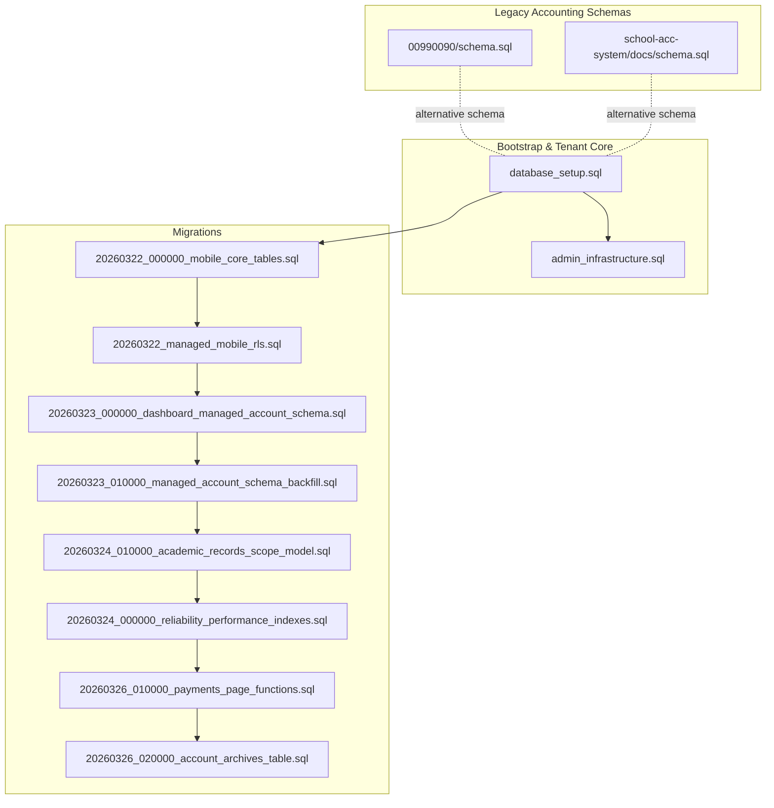
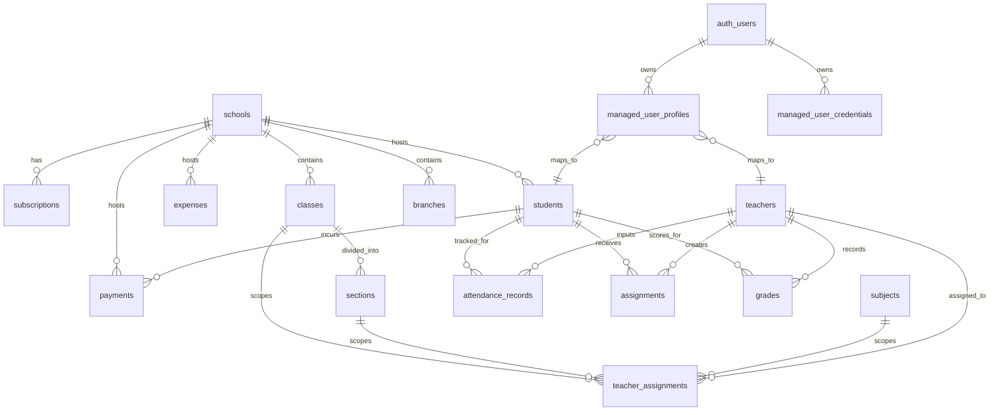
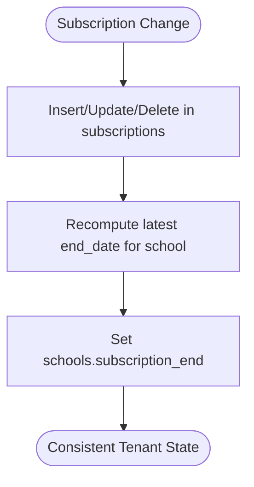
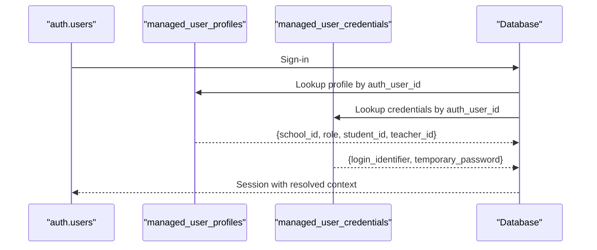
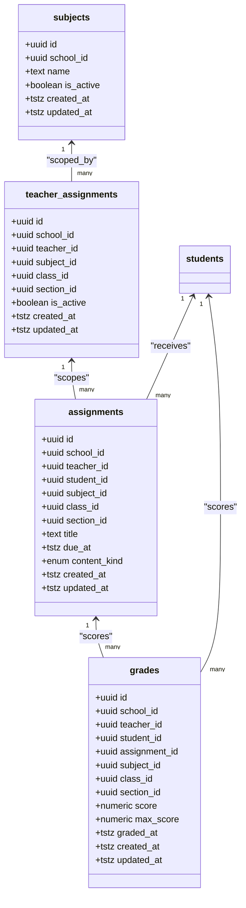
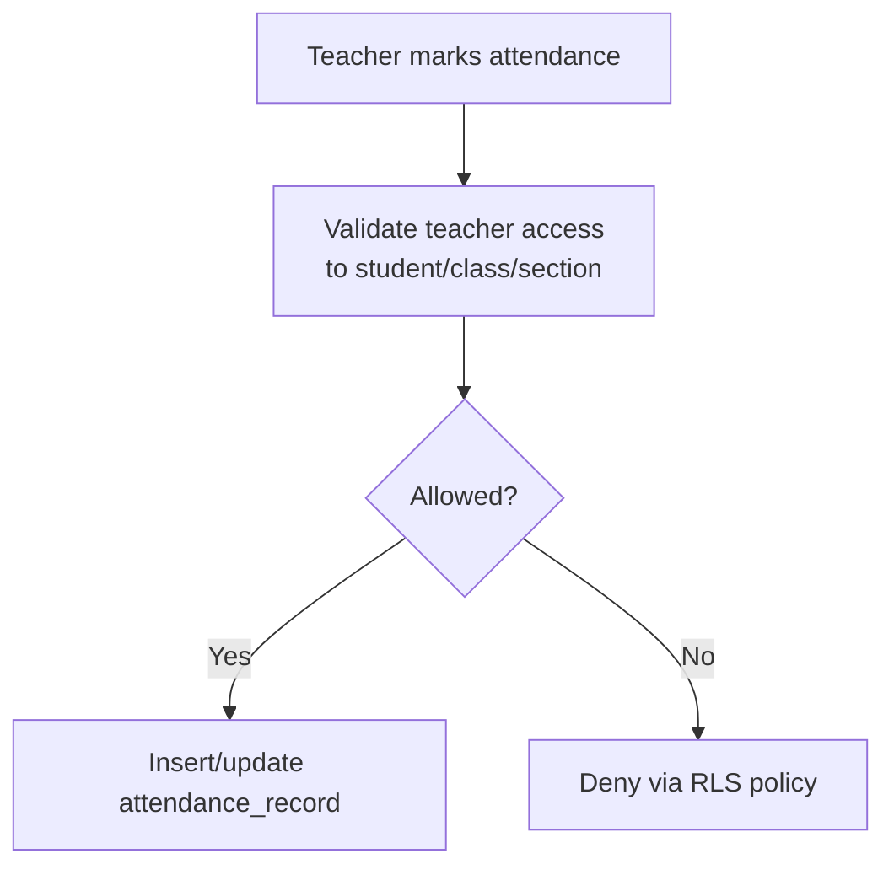
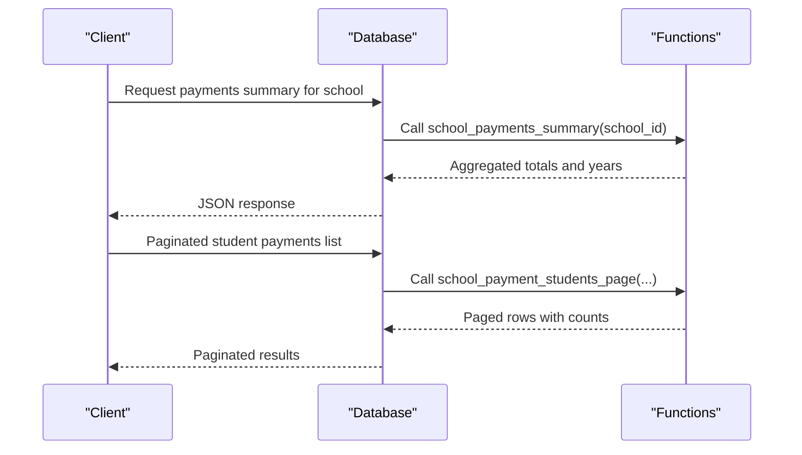
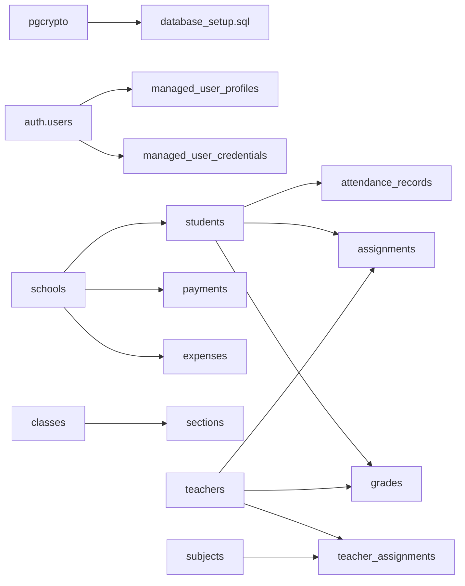

# Schema Architecture

<cite>
**Referenced Files in This Document**
- [database_setup.sql](file://database_setup.sql)
- [admin_infrastructure.sql](file://admin_infrastructure.sql)
- [20260322_000000_mobile_core_tables.sql](file://migrations/20260322_000000_mobile_core_tables.sql)
- [20260322_managed_mobile_rls.sql](file://migrations/20260322_managed_mobile_rls.sql)
- [20260323_000000_dashboard_managed_account_schema.sql](file://migrations/20260323_000000_dashboard_managed_account_schema.sql)
- [20260323_010000_managed_account_schema_backfill.sql](file://migrations/20260323_010000_managed_account_schema_backfill.sql)
- [20260324_000000_reliability_performance_indexes.sql](file://migrations/20260324_000000_reliability_performance_indexes.sql)
- [20260324_010000_academic_records_scope_model.sql](file://migrations/20260324_010000_academic_records_scope_model.sql)
- [20260326_010000_payments_page_functions.sql](file://migrations/20260326_010000_payments_page_functions.sql)
- [20260326_020000_account_archives_table.sql](file://migrations/20260326_020000_account_archives_table.sql)
- [schema.sql](file://00990090/school-accounting-system/database/schema.sql)
- [schema.sql](file://school-acc-system/docs/schema.sql)
</cite>

## Table of Contents
1. [Introduction](#introduction)
2. [Project Structure](#project-structure)
3. [Core Components](#core-components)
4. [Architecture Overview](#architecture-overview)
5. [Detailed Component Analysis](#detailed-component-analysis)
6. [Dependency Analysis](#dependency-analysis)
7. [Performance Considerations](#performance-considerations)
8. [Troubleshooting Guide](#troubleshooting-guide)
9. [Conclusion](#conclusion)
10. [Appendices](#appendices)

## Introduction
This document describes the schema architecture for the school management system with a focus on multi-tenant data models, shared managed-user authentication, academic records, and financial operations. It covers the base bootstrap schema, school and subscription setup, shared managed-user authentication tables, and the relationships among users, schools, branches, students, payments, expenses, and academic records. It also documents indexes, constraints, referential integrity enforcement via foreign keys and row-level security (RLS), and practical query patterns.

## Project Structure
The schema is implemented across:
- Base bootstrap and tenant schema: [database_setup.sql](file://database_setup.sql)
- Admin infrastructure (audit, notifications, feature flags): [admin_infrastructure.sql](file://admin_infrastructure.sql)
- Migrations for managed-user accounts and academic records:
  - [20260322_000000_mobile_core_tables.sql](file://migrations/20260322_000000_mobile_core_tables.sql)
  - [20260322_managed_mobile_rls.sql](file://migrations/20260322_managed_mobile_rls.sql)
  - [20260323_000000_dashboard_managed_account_schema.sql](file://migrations/20260323_000000_dashboard_managed_account_schema.sql)
  - [20260323_010000_managed_account_schema_backfill.sql](file://migrations/20260323_010000_managed_account_schema_backfill.sql)
  - [20260324_010000_academic_records_scope_model.sql](file://migrations/20260324_010000_academic_records_scope_model.sql)
- Financial and reporting helpers:
  - [20260326_010000_payments_page_functions.sql](file://migrations/20260326_010000_payments_page_functions.sql)
  - [20260326_020000_account_archives_table.sql](file://migrations/20260326_020000_account_archives_table.sql)
- Additional accounting schema variants:
  - [schema.sql](file://00990090/school-accounting-system/database/schema.sql)
  - [schema.sql](file://school-acc-system/docs/schema.sql)

**Diagram sources**
- [database_setup.sql:1-614](file://database_setup.sql#L1-L614)
- [admin_infrastructure.sql:1-156](file://admin_infrastructure.sql#L1-L156)
- [20260322_000000_mobile_core_tables.sql:1-389](file://migrations/20260322_000000_mobile_core_tables.sql#L1-L389)
- [20260322_managed_mobile_rls.sql:1-580](file://migrations/20260322_managed_mobile_rls.sql#L1-L580)
- [20260323_000000_dashboard_managed_account_schema.sql:1-50](file://migrations/20260323_000000_dashboard_managed_account_schema.sql#L1-L50)
- [20260323_010000_managed_account_schema_backfill.sql:1-273](file://migrations/20260323_010000_managed_account_schema_backfill.sql#L1-L273)
- [20260324_010000_academic_records_scope_model.sql:1-529](file://migrations/20260324_010000_academic_records_scope_model.sql#L1-L529)
- [20260324_000000_reliability_performance_indexes.sql:1-24](file://migrations/20260324_000000_reliability_performance_indexes.sql#L1-L24)
- [20260326_010000_payments_page_functions.sql:1-190](file://migrations/20260326_010000_payments_page_functions.sql#L1-L190)
- [20260326_020000_account_archives_table.sql:1-64](file://migrations/20260326_020000_account_archives_table.sql#L1-L64)
- [schema.sql:1-260](file://00990090/school-accounting-system/database/schema.sql#L1-L260)
- [schema.sql:1-130](file://school-acc-system/docs/schema.sql#L1-L130)

**Section sources**
- [database_setup.sql:1-614](file://database_setup.sql#L1-L614)
- [admin_infrastructure.sql:1-156](file://admin_infrastructure.sql#L1-L156)
- [20260322_000000_mobile_core_tables.sql:1-389](file://migrations/20260322_000000_mobile_core_tables.sql#L1-L389)
- [20260322_managed_mobile_rls.sql:1-580](file://migrations/20260322_managed_mobile_rls.sql#L1-L580)
- [20260323_000000_dashboard_managed_account_schema.sql:1-50](file://migrations/20260323_000000_dashboard_managed_account_schema.sql#L1-L50)
- [20260323_010000_managed_account_schema_backfill.sql:1-273](file://migrations/20260323_010000_managed_account_schema_backfill.sql#L1-L273)
- [20260324_010000_academic_records_scope_model.sql:1-529](file://migrations/20260324_010000_academic_records_scope_model.sql#L1-L529)
- [20260324_000000_reliability_performance_indexes.sql:1-24](file://migrations/20260324_000000_reliability_performance_indexes.sql#L1-L24)
- [20260326_010000_payments_page_functions.sql:1-190](file://migrations/20260326_010000_payments_page_functions.sql#L1-L190)
- [20260326_020000_account_archives_table.sql:1-64](file://migrations/20260326_020000_account_archives_table.sql#L1-L64)
- [schema.sql:1-260](file://00990090/school-accounting-system/database/schema.sql#L1-L260)
- [schema.sql:1-130](file://school-acc-system/docs/schema.sql#L1-L130)

## Core Components
- Multi-tenant core: schools, subscriptions, and derived subscription_end
- Shared managed-user authentication: managed_user_profiles, managed_user_credentials
- Academic records: subjects, teacher_assignments, assignments, grades
- Attendance and class/section scoping
- Payments and financial summaries
- Admin infrastructure: audit_logs, notifications, feature_flags, soft-delete support
- Account archives for yearly aggregation

Key bootstrap and tenant setup:
- Bootstrap extension for UUID generation and RLS enablement
- Tenant-scoped indexes and policies for most tables with school_id
- Subscription synchronization to compute effective subscription_end per school

**Section sources**
- [database_setup.sql:75-183](file://database_setup.sql#L75-L183)
- [database_setup.sql:188-414](file://database_setup.sql#L188-L414)
- [admin_infrastructure.sql:9-156](file://admin_infrastructure.sql#L9-L156)

## Architecture Overview
The schema follows a multi-tenant pattern with:
- UUID primary keys for cross-service identity
- Foreign keys enforcing referential integrity
- Row-level security policies scoped by current_app_role() and current_school_id()
- Managed-user profiles bridging auth.users to student/teacher records
- Academic records scoped by school/class/section
- Financial summaries and paginated queries exposed via SQL functions

**Diagram sources**
- [database_setup.sql:75-414](file://database_setup.sql#L75-L414)
- [20260322_000000_mobile_core_tables.sql:23-126](file://migrations/20260322_000000_mobile_core_tables.sql#L23-L126)
- [20260324_010000_academic_records_scope_model.sql:24-135](file://migrations/20260324_010000_academic_records_scope_model.sql#L24-L135)

## Detailed Component Analysis

### Multi-Tenant Core: Schools and Subscriptions
- schools: UUID primary key, address/phone/owner metadata, plan, is_active, computed subscription_end
- subscriptions: links to schools, plan/status, dates, recompute function and trigger to maintain subscription_end
- account_archives: yearly aggregates per school

**Diagram sources**
- [database_setup.sql:102-139](file://database_setup.sql#L102-L139)
- [database_setup.sql:141-156](file://database_setup.sql#L141-L156)

**Section sources**
- [database_setup.sql:75-183](file://database_setup.sql#L75-L183)
- [database_setup.sql:158-168](file://database_setup.sql#L158-L168)

### Shared Managed-User Authentication Tables
- managed_user_profiles: bridges auth.users to student/teacher, enforces role/student_id or role/teacher_id exclusivity, RLS policy allows self-read and admin manage
- managed_user_credentials: stores login_identifier and temporary_password per school
- Helper functions: current_managed_* to resolve role, school, student/teacher ids, and access checks for assignments/grades/attendance

**Diagram sources**
- [20260322_000000_mobile_core_tables.sql:23-126](file://migrations/20260322_000000_mobile_core_tables.sql#L23-L126)
- [20260322_managed_mobile_rls.sql:7-59](file://migrations/20260322_managed_mobile_rls.sql#L7-L59)
- [20260323_010000_managed_account_schema_backfill.sql:159-226](file://migrations/20260323_010000_managed_account_schema_backfill.sql#L159-L226)

**Section sources**
- [20260322_000000_mobile_core_tables.sql:23-126](file://migrations/20260322_000000_mobile_core_tables.sql#L23-L126)
- [20260322_managed_mobile_rls.sql:315-379](file://migrations/20260322_managed_mobile_rls.sql#L315-L379)
- [20260323_010000_managed_account_schema_backfill.sql:39-157](file://migrations/20260323_010000_managed_account_schema_backfill.sql#L39-L157)

### Academic Records: Subjects, Assignments, Grades
- subjects: school-scoped subject catalog with indexes
- teacher_assignments: unique constraints per class-wide or section-specific assignment
- assignments: school/class/section/subject scoping, due dates, attachments, content kinds
- grades: student scores with optional assignment linkage

**Diagram sources**
- [20260324_010000_academic_records_scope_model.sql:24-135](file://migrations/20260324_010000_academic_records_scope_model.sql#L24-L135)
- [20260324_010000_academic_records_scope_model.sql:111-135](file://migrations/20260324_010000_academic_records_scope_model.sql#L111-L135)
- [20260324_010000_academic_records_scope_model.sql:224-241](file://migrations/20260324_010000_academic_records_scope_model.sql#L224-L241)

**Section sources**
- [20260324_010000_academic_records_scope_model.sql:24-135](file://migrations/20260324_010000_academic_records_scope_model.sql#L24-L135)
- [20260324_010000_academic_records_scope_model.sql:111-135](file://migrations/20260324_010000_academic_records_scope_model.sql#L111-L135)
- [20260324_010000_academic_records_scope_model.sql:224-241](file://migrations/20260324_010000_academic_records_scope_model.sql#L224-L241)

### Attendance and Class/Section Scoping
- attendance_records: per-student, per-date records with status and note; RLS policies for student/teacher access
- classes and sections: school-scoped with unique constraints per school/class/section

**Diagram sources**
- [database_setup.sql:29-63](file://database_setup.sql#L29-L63)
- [20260322_managed_mobile_rls.sql:381-432](file://migrations/20260322_managed_mobile_rls.sql#L381-L432)

**Section sources**
- [database_setup.sql:29-63](file://database_setup.sql#L29-L63)
- [20260322_managed_mobile_rls.sql:381-432](file://migrations/20260322_managed_mobile_rls.sql#L381-L432)

### Payments and Financial Summaries
- Payments: school-scoped, indexed by school/student/created_at; linked to students
- Functions: school_payments_summary, school_payment_students_page for reporting and pagination
- Indexes: reliability-focused indexes for payments and related entities

**Diagram sources**
- [20260326_010000_payments_page_functions.sql:12-67](file://migrations/20260326_010000_payments_page_functions.sql#L12-L67)
- [20260326_010000_payments_page_functions.sql:69-190](file://migrations/20260326_010000_payments_page_functions.sql#L69-L190)

**Section sources**
- [20260326_010000_payments_page_functions.sql:12-67](file://migrations/20260326_010000_payments_page_functions.sql#L12-L67)
- [20260326_010000_payments_page_functions.sql:69-190](file://migrations/20260326_010000_payments_page_functions.sql#L69-L190)
- [20260324_000000_reliability_performance_indexes.sql:3-22](file://migrations/20260324_000000_reliability_performance_indexes.sql#L3-L22)

### Expenses and Reporting
- Expenses: school-scoped with approval metadata
- Account archives: yearly snapshots with JSONB payload

**Section sources**
- [database_setup.sql:158-168](file://database_setup.sql#L158-L168)
- [20260326_020000_account_archives_table.sql:1-64](file://migrations/20260326_020000_account_archives_table.sql#L1-L64)

### Admin Infrastructure
- Audit logs: actor metadata, action_type, entity_type, timestamps
- Notifications: per-user and per-school, RLS for ownership
- Feature flags: centralized toggles
- Soft delete support: optional deleted_at/deleted_by columns on key tables

**Section sources**
- [admin_infrastructure.sql:9-156](file://admin_infrastructure.sql#L9-L156)

### Legacy Accounting Schema Variants
Two alternative accounting schemas exist in the repository:
- [schema.sql](file://00990090/school-accounting-system/database/schema.sql) with traditional serial PKs and views
- [schema.sql](file://school-acc-system/docs/schema.sql) with simplified entities and indexes

These are not used in the current managed-user architecture but illustrate alternate modeling approaches.

**Section sources**
- [schema.sql:1-260](file://00990090/school-accounting-system/database/schema.sql#L1-L260)
- [schema.sql:1-130](file://school-acc-system/docs/schema.sql#L1-L130)

## Dependency Analysis
- Bootstrap depends on Supabase’s auth.users and pgcrypto extensions
- Tenant tables depend on schools and branch relationships
- Managed-user tables depend on auth.users and student/teacher records
- Academic tables depend on subjects, classes, sections
- Financial functions depend on payments and students
- RLS policies depend on helper functions current_app_role() and current_school_id()

**Diagram sources**
- [database_setup.sql:7-10](file://database_setup.sql#L7-L10)
- [20260322_000000_mobile_core_tables.sql:23-126](file://migrations/20260322_000000_mobile_core_tables.sql#L23-L126)
- [20260324_010000_academic_records_scope_model.sql:63-135](file://migrations/20260324_010000_academic_records_scope_model.sql#L63-L135)

**Section sources**
- [database_setup.sql:7-10](file://database_setup.sql#L7-L10)
- [20260322_000000_mobile_core_tables.sql:23-126](file://migrations/20260322_000000_mobile_core_tables.sql#L23-L126)
- [20260324_010000_academic_records_scope_model.sql:63-135](file://migrations/20260324_010000_academic_records_scope_model.sql#L63-L135)

## Performance Considerations
- Indexes on frequently filtered/sorted columns:
  - attendance_records: date, student_id
  - payments: school_id, student_id, created_at desc
  - students: school_id, status/full_name, class_name, remaining_fee/total_fee/discount_value
  - account_archives: school_id, archive_year
  - academic tables: school_id/class/section/subject scopes
- Triggers to maintain updated_at fields for managed entities
- Functions for computed fields (subscription_end) and paginated reporting
- JSONB fields for flexible payloads (e.g., account_archives.data)

[No sources needed since this section provides general guidance]

## Troubleshooting Guide
- RLS Denials: Verify current_app_role() and current_school_id() return expected values for the authenticated user
- Access Checks: Use helper functions like teacher_can_access_class/student and student_can_read_assignment to debug visibility
- Subscription End Issues: Confirm trigger and function execution after subscription updates
- Managed User Mapping: Ensure auth_user_id is populated and managed_user_profiles entries exist for students/teachers

**Section sources**
- [20260322_managed_mobile_rls.sql:7-59](file://migrations/20260322_managed_mobile_rls.sql#L7-L59)
- [20260322_managed_mobile_rls.sql:100-176](file://migrations/20260322_managed_mobile_rls.sql#L100-L176)
- [database_setup.sql:102-139](file://database_setup.sql#L102-L139)

## Conclusion
The schema architecture centers on a robust multi-tenant foundation with managed-user authentication, academic scoping, and financial reporting capabilities. It leverages UUIDs, foreign keys, indexes, and RLS to enforce isolation and access control. The migrations document a clear evolution toward unified managed-user profiles and academic records, while supporting reliable performance and extensibility.

[No sources needed since this section summarizes without analyzing specific files]

## Appendices

### Sample Data Examples
- Schools: Create a school with address/phone/owner metadata and initial plan
- Subscriptions: Add subscription records with status and dates; subscription_end is recomputed
- Managed User Profiles: Insert mapped profiles linking auth.users to students/teachers
- Attendance: Teacher inserts daily attendance for enrolled students
- Payments: Record payments per student with method/reference and receipt number
- Academic Records: Create subjects, assign teachers, publish assignments, record grades

[No sources needed since this section provides general guidance]

### Common Query Patterns
- Payments summary per school: [school_payments_summary:12-67](file://migrations/20260326_010000_payments_page_functions.sql#L12-L67)
- Paginated student payments list: [school_payment_students_page:69-190](file://migrations/20260326_010000_payments_page_functions.sql#L69-L190)
- Attendance lookup by date and student: [attendance_records indexes:44-45](file://database_setup.sql#L44-L45)
- Academic scope filters: [academic indexes:206-222](file://migrations/20260324_010000_academic_records_scope_model.sql#L206-L222)

**Section sources**
- [20260326_010000_payments_page_functions.sql:12-67](file://migrations/20260326_010000_payments_page_functions.sql#L12-L67)
- [20260326_010000_payments_page_functions.sql:69-190](file://migrations/20260326_010000_payments_page_functions.sql#L69-L190)
- [database_setup.sql:44-45](file://database_setup.sql#L44-L45)
- [20260324_010000_academic_records_scope_model.sql:206-222](file://migrations/20260324_010000_academic_records_scope_model.sql#L206-L222)