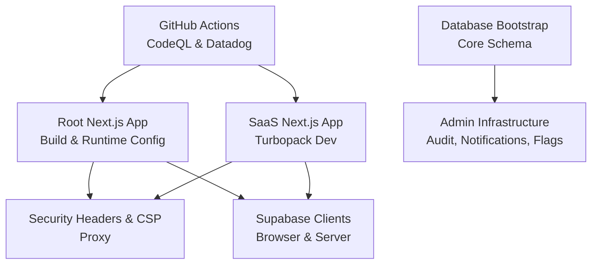
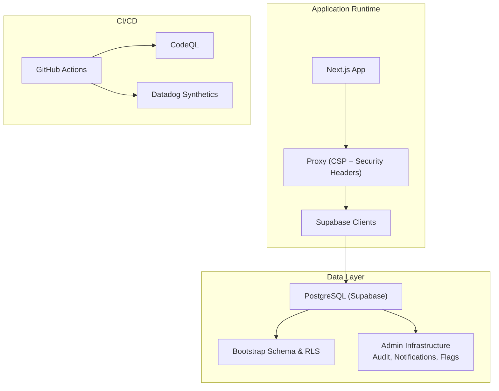
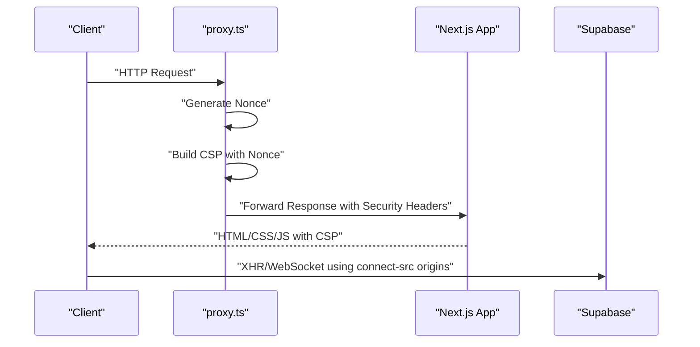
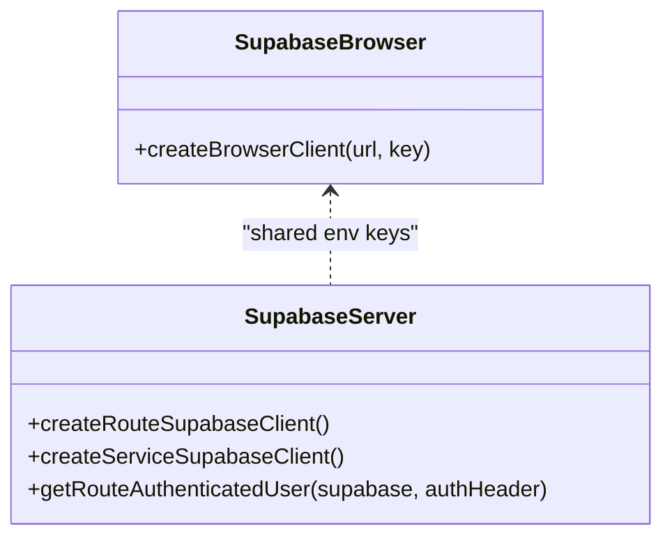
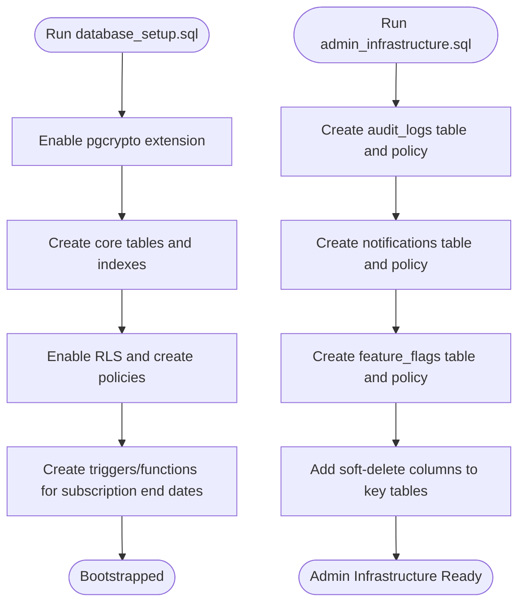
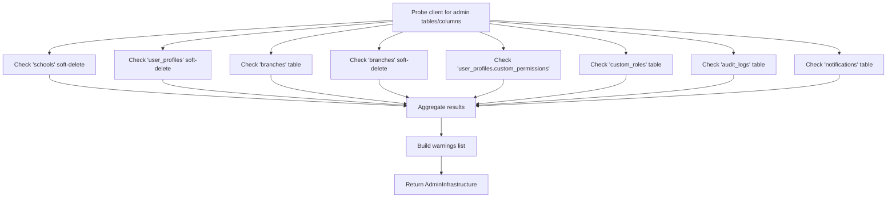
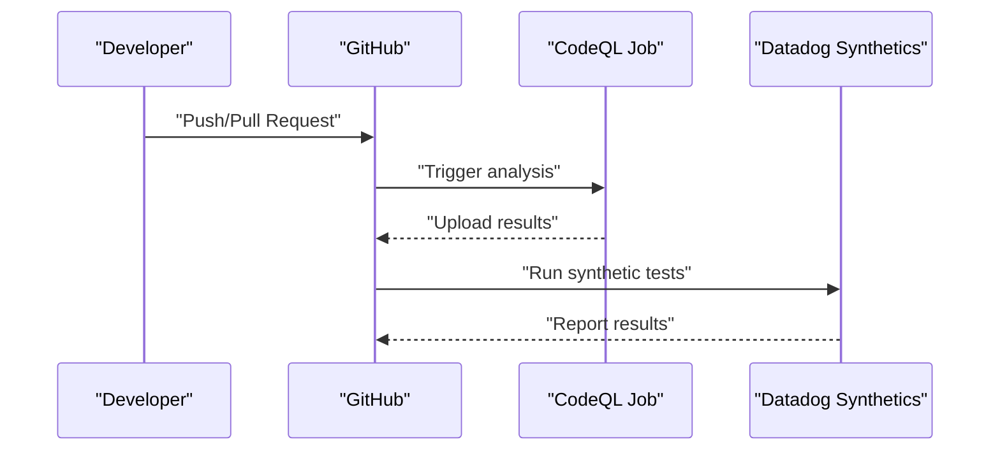
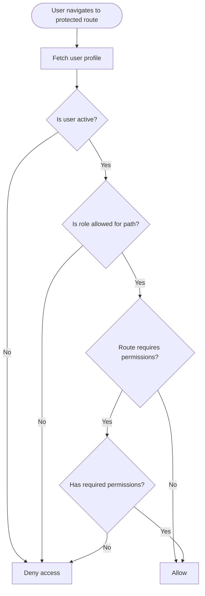
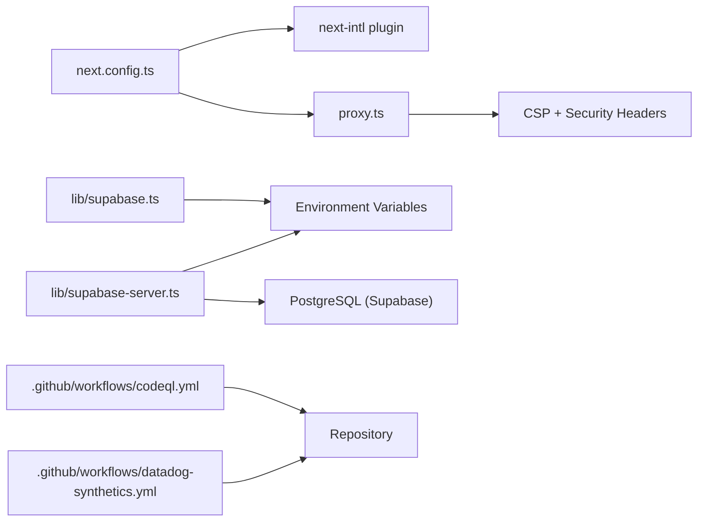

# Deployment & DevOps

<cite>
**Referenced Files in This Document**
- [package.json](file://package.json)
- [next.config.ts](file://next.config.ts)
- [school-saas-next/next.config.ts](file://school-saas-next/next.config.ts)
- [proxy.ts](file://proxy.ts)
- [lib/supabase.ts](file://lib/supabase.ts)
- [lib/supabase-server.ts](file://lib/supabase-server.ts)
- [lib/admin-infrastructure.ts](file://lib/admin-infrastructure.ts)
- [database_setup.sql](file://database_setup.sql)
- [admin_infrastructure.sql](file://admin_infrastructure.sql)
- [.github/workflows/codeql.yml](file://.github/workflows/codeql.yml)
- [.github/workflows/datadog-synthetics.yml](file://.github/workflows/datadog-synthetics.yml)
- [.codex/config.toml](file://.codex/config.toml)
- [lib/auth.ts](file://lib/auth.ts)
- [hooks/useAuth.ts](file://hooks/useAuth.ts)
</cite>

## Table of Contents
1. [Introduction](#introduction)
2. [Project Structure](#project-structure)
3. [Core Components](#core-components)
4. [Architecture Overview](#architecture-overview)
5. [Detailed Component Analysis](#detailed-component-analysis)
6. [Dependency Analysis](#dependency-analysis)
7. [Performance Considerations](#performance-considerations)
8. [Troubleshooting Guide](#troubleshooting-guide)
9. [Conclusion](#conclusion)
10. [Appendices](#appendices)

## Introduction
This document provides a comprehensive guide to deploying and operating the Next.js application in production, covering build optimization, static generation, server-side rendering configuration, CI/CD pipelines with GitHub Actions, infrastructure setup with Supabase, environment variable management, deployment targets, monitoring, and operational procedures such as rollback and maintenance.

## Project Structure
The repository contains two primary application surfaces:
- The main Next.js application under the root path, configured for production-grade security headers and runtime CSP via a proxy function.
- A separate SaaS-focused Next.js app under school-saas-next/, optimized for Turbopack during development.

Key deployment-related files include:
- Build and runtime configuration for Next.js
- Proxy-based CSP and security headers
- Supabase client initialization and server-side clients
- Database bootstrap and admin infrastructure SQL scripts
- GitHub Actions workflows for security scanning and synthetic tests

**Diagram sources**
- [next.config.ts:1-50](file://next.config.ts#L1-L50)
- [school-saas-next/next.config.ts:1-10](file://school-saas-next/next.config.ts#L1-L10)
- [proxy.ts:1-139](file://proxy.ts#L1-L139)
- [lib/supabase.ts:1-22](file://lib/supabase.ts#L1-L22)
- [lib/supabase-server.ts:1-75](file://lib/supabase-server.ts#L1-L75)
- [database_setup.sql:1-614](file://database_setup.sql#L1-L614)
- [admin_infrastructure.sql:1-156](file://admin_infrastructure.sql#L1-L156)
- [.github/workflows/codeql.yml:1-102](file://.github/workflows/codeql.yml#L1-L102)
- [.github/workflows/datadog-synthetics.yml:1-39](file://.github/workflows/datadog-synthetics.yml#L1-L39)

**Section sources**
- [next.config.ts:1-50](file://next.config.ts#L1-L50)
- [school-saas-next/next.config.ts:1-10](file://school-saas-next/next.config.ts#L1-L10)
- [proxy.ts:1-139](file://proxy.ts#L1-L139)
- [lib/supabase.ts:1-22](file://lib/supabase.ts#L1-L22)
- [lib/supabase-server.ts:1-75](file://lib/supabase-server.ts#L1-L75)
- [database_setup.sql:1-614](file://database_setup.sql#L1-L614)
- [admin_infrastructure.sql:1-156](file://admin_infrastructure.sql#L1-L156)
- [.github/workflows/codeql.yml:1-102](file://.github/workflows/codeql.yml#L1-L102)
- [.github/workflows/datadog-synthetics.yml:1-39](file://.github/workflows/datadog-synthetics.yml#L1-L39)

## Core Components
- Next.js configuration and security headers
  - Production security headers and CSP fallback for static assets are defined in the Next.js config.
  - A runtime proxy function dynamically computes CSP with per-request nonces and applies additional security headers for dynamic routes.
- Supabase integration
  - Browser client creation validates required environment variables and throws if missing.
  - Server-side clients differentiate route-based and service-role clients, enabling robust SSR and API routing.
- Database bootstrap and admin infrastructure
  - Core schema and RLS policies are defined in the database bootstrap script.
  - Admin infrastructure script adds audit logs, notifications, feature flags, and soft-delete support.
- CI/CD
  - CodeQL workflow for vulnerability scanning.
  - Datadog Synthetic tests workflow for end-to-end monitoring.

**Section sources**
- [next.config.ts:1-50](file://next.config.ts#L1-L50)
- [proxy.ts:1-139](file://proxy.ts#L1-L139)
- [lib/supabase.ts:1-22](file://lib/supabase.ts#L1-L22)
- [lib/supabase-server.ts:1-75](file://lib/supabase-server.ts#L1-L75)
- [database_setup.sql:1-614](file://database_setup.sql#L1-L614)
- [admin_infrastructure.sql:1-156](file://admin_infrastructure.sql#L1-L156)
- [.github/workflows/codeql.yml:1-102](file://.github/workflows/codeql.yml#L1-L102)
- [.github/workflows/datadog-synthetics.yml:1-39](file://.github/workflows/datadog-synthetics.yml#L1-L39)

## Architecture Overview
The production architecture centers on:
- Next.js serving pages with dynamic CSP via a proxy for enhanced security.
- Supabase as the identity and data layer with RLS and row-level tenant isolation.
- GitHub Actions for automated security scanning and synthetic tests.
- Database bootstrap and admin infrastructure ensuring auditability and extensibility.

**Diagram sources**
- [proxy.ts:1-139](file://proxy.ts#L1-L139)
- [lib/supabase.ts:1-22](file://lib/supabase.ts#L1-L22)
- [lib/supabase-server.ts:1-75](file://lib/supabase-server.ts#L1-L75)
- [database_setup.sql:1-614](file://database_setup.sql#L1-L614)
- [admin_infrastructure.sql:1-156](file://admin_infrastructure.sql#L1-L156)
- [.github/workflows/codeql.yml:1-102](file://.github/workflows/codeql.yml#L1-L102)
- [.github/workflows/datadog-synthetics.yml:1-39](file://.github/workflows/datadog-synthetics.yml#L1-L39)

## Detailed Component Analysis

### Next.js Build and Runtime Configuration
- Build optimization and output tracing root are configured for deterministic builds.
- Security headers for static assets are applied globally; dynamic routes receive CSP with per-request nonces via the proxy.
- Internationalization plugin is integrated with request configuration.

Operational guidance:
- Keep NODE_ENV production for runtime headers and HSTS.
- Ensure outputFileTracingRoot points to the repository root for accurate bundling.

**Section sources**
- [next.config.ts:1-50](file://next.config.ts#L1-L50)

### Turbopack Development (SaaS App)
- The SaaS app enables Turbopack for faster development iteration by setting the root path.

Operational guidance:
- Use this configuration locally for rapid reloads; keep the root Next.js app for production builds.

**Section sources**
- [school-saas-next/next.config.ts:1-10](file://school-saas-next/next.config.ts#L1-L10)

### Proxy-Based CSP and Security Headers
- Generates a cryptographically random nonce per request and constructs CSP with strict directives.
- Applies additional security headers (Referrer-Policy, X-Content-Type-Options, X-Frame-Options, Permissions-Policy) and HSTS in production.
- Exposes the nonce via a custom header for downstream components.

**Diagram sources**
- [proxy.ts:1-139](file://proxy.ts#L1-L139)

**Section sources**
- [proxy.ts:1-139](file://proxy.ts#L1-L139)

### Supabase Client Initialization and SSR
- Browser client validates presence of Supabase URL and either the anonymous key or publishable key; errors if missing.
- Server-side clients:
  - Route-based client manages cookies and supports bearer token extraction for authenticated routes.
  - Service role client uses a dedicated key for privileged operations.

**Diagram sources**
- [lib/supabase.ts:1-22](file://lib/supabase.ts#L1-L22)
- [lib/supabase-server.ts:1-75](file://lib/supabase-server.ts#L1-L75)

**Section sources**
- [lib/supabase.ts:1-22](file://lib/supabase.ts#L1-L22)
- [lib/supabase-server.ts:1-75](file://lib/supabase-server.ts#L1-L75)

### Database Bootstrap and Admin Infrastructure
- Core schema includes multi-tenant entities (schools, subscriptions), RLS policies, indexes, and helper functions.
- Admin infrastructure adds audit logs, notifications, feature flags, and soft-delete support across selected tables.

**Diagram sources**
- [database_setup.sql:1-614](file://database_setup.sql#L1-L614)
- [admin_infrastructure.sql:1-156](file://admin_infrastructure.sql#L1-L156)

**Section sources**
- [database_setup.sql:1-614](file://database_setup.sql#L1-L614)
- [admin_infrastructure.sql:1-156](file://admin_infrastructure.sql#L1-L156)

### Admin Infrastructure Detection Utility
- Detects presence of admin infrastructure tables/columns and produces a compatibility notice for missing components.
- Provides helpers to identify missing tables, columns, and relationships.

**Diagram sources**
- [lib/admin-infrastructure.ts:1-209](file://lib/admin-infrastructure.ts#L1-L209)

**Section sources**
- [lib/admin-infrastructure.ts:1-209](file://lib/admin-infrastructure.ts#L1-L209)

### CI/CD Pipelines
- CodeQL Advanced workflow
  - Runs on push and pull_request to main.
  - Supports multiple languages with matrix analysis and writes security events.
- Datadog Synthetic tests workflow
  - Requires Datadog API and Application keys as GitHub secrets.
  - Executes synthetic tests tagged for e2e-tests.

**Diagram sources**
- [.github/workflows/codeql.yml:1-102](file://.github/workflows/codeql.yml#L1-L102)
- [.github/workflows/datadog-synthetics.yml:1-39](file://.github/workflows/datadog-synthetics.yml#L1-L39)

**Section sources**
- [.github/workflows/codeql.yml:1-102](file://.github/workflows/codeql.yml#L1-L102)
- [.github/workflows/datadog-synthetics.yml:1-39](file://.github/workflows/datadog-synthetics.yml#L1-L39)

### Environment Variables and Secrets Management
- Required Supabase environment variables for the browser client:
  - NEXT_PUBLIC_SUPABASE_URL
  - NEXT_PUBLIC_SUPABASE_ANON_KEY or NEXT_PUBLIC_SUPABASE_PUBLISHABLE_KEY
- Server-side Supabase keys:
  - NEXT_PUBLIC_SUPABASE_URL
  - SUPABASE_SERVICE_ROLE_KEY
- Additional environment variables:
  - NODE_ENV (production recommended for HSTS and hardened headers)
  - NEXT_PUBLIC_SUPABASE_URL and Supabase origin hostnames influence CSP connect-src and WebSocket origins

Secrets management recommendations:
- Store Supabase keys and Datadog keys as repository secrets.
- Use separate keys for service role and anonymous/publishable usage.
- Avoid committing secrets to the repository.

**Section sources**
- [lib/supabase.ts:1-22](file://lib/supabase.ts#L1-L22)
- [lib/supabase-server.ts:1-75](file://lib/supabase-server.ts#L1-L75)
- [proxy.ts:1-139](file://proxy.ts#L1-L139)

### RBAC and Access Control Integration
- Client-side role-aware access decisions and subscription status checks.
- Helpers to compute access decisions based on role, permissions, and subscription state.
- Client-side RBAC session cookie lifecycle via API endpoints.

**Diagram sources**
- [lib/auth.ts:1-341](file://lib/auth.ts#L1-L341)
- [hooks/useAuth.ts:1-22](file://hooks/useAuth.ts#L1-L22)

**Section sources**
- [lib/auth.ts:1-341](file://lib/auth.ts#L1-L341)
- [hooks/useAuth.ts:1-22](file://hooks/useAuth.ts#L1-L22)

## Dependency Analysis
- Next.js configuration depends on the internationalization plugin and runtime proxy for CSP.
- Supabase clients depend on environment variables and the database schema.
- CI/CD workflows depend on repository secrets and external services.

**Diagram sources**
- [next.config.ts:1-50](file://next.config.ts#L1-L50)
- [proxy.ts:1-139](file://proxy.ts#L1-L139)
- [lib/supabase.ts:1-22](file://lib/supabase.ts#L1-L22)
- [lib/supabase-server.ts:1-75](file://lib/supabase-server.ts#L1-L75)
- [.github/workflows/codeql.yml:1-102](file://.github/workflows/codeql.yml#L1-L102)
- [.github/workflows/datadog-synthetics.yml:1-39](file://.github/workflows/datadog-synthetics.yml#L1-L39)

**Section sources**
- [next.config.ts:1-50](file://next.config.ts#L1-L50)
- [proxy.ts:1-139](file://proxy.ts#L1-L139)
- [lib/supabase.ts:1-22](file://lib/supabase.ts#L1-L22)
- [lib/supabase-server.ts:1-75](file://lib/supabase-server.ts#L1-L75)
- [.github/workflows/codeql.yml:1-102](file://.github/workflows/codeql.yml#L1-L102)
- [.github/workflows/datadog-synthetics.yml:1-39](file://.github/workflows/datadog-synthetics.yml#L1-L39)

## Performance Considerations
- Build optimization
  - Use outputFileTracingRoot to ensure deterministic builds and reduce bundle size.
  - Prefer static generation where possible; leverage ISR for frequently updated content.
- Runtime performance
  - Apply CSP with nonces to prevent inline scripts; rely on hashed or nonce-based script-src.
  - Minimize external connect-src origins to reduce latency and improve security.
- Database performance
  - Indexes are included in the bootstrap schema; maintain them after schema changes.
  - Use RLS judiciously; ensure policies are selective and leverage indexes.

[No sources needed since this section provides general guidance]

## Troubleshooting Guide
Common deployment issues and resolutions:
- Missing Supabase environment variables
  - Symptom: Application fails to initialize Supabase client in development or production.
  - Resolution: Ensure NEXT_PUBLIC_SUPABASE_URL and either NEXT_PUBLIC_SUPABASE_ANON_KEY or NEXT_PUBLIC_SUPABASE_PUBLISHABLE_KEY are present.
- Service role key missing
  - Symptom: Server-side operations fail with unauthorized or missing key errors.
  - Resolution: Provide SUPABASE_SERVICE_ROLE_KEY and ensure it matches the Supabase project.
- CSP blocking inline scripts/styles
  - Symptom: Console errors about CSP violations.
  - Resolution: Use nonce-based script-src and accept 'unsafe-inline' for Tailwind-generated styles as documented; avoid unsafe eval in production.
- Subscription expiration or inactive school
  - Symptom: Access denied due to expired or suspended subscription.
  - Resolution: Verify subscription status and renewal; ensure school is active.
- Admin infrastructure not fully enabled
  - Symptom: Some admin features unavailable.
  - Resolution: Run admin_infrastructure.sql to create audit logs, notifications, feature flags, and soft-delete columns.

**Section sources**
- [lib/supabase.ts:1-22](file://lib/supabase.ts#L1-L22)
- [lib/supabase-server.ts:1-75](file://lib/supabase-server.ts#L1-L75)
- [proxy.ts:1-139](file://proxy.ts#L1-L139)
- [lib/auth.ts:1-341](file://lib/auth.ts#L1-L341)
- [lib/admin-infrastructure.ts:1-209](file://lib/admin-infrastructure.ts#L1-L209)

## Conclusion
This guide outlines a production-ready deployment and DevOps strategy for the Next.js application, emphasizing secure CSP via a proxy, robust Supabase integration, comprehensive database bootstrapping, and automated CI/CD. By following the environment variable requirements, database setup, and CI/CD configurations, teams can achieve reliable deployments, strong security posture, and operational observability.

[No sources needed since this section summarizes without analyzing specific files]

## Appendices

### A. Environment Configuration Checklist
- Required for browser client:
  - NEXT_PUBLIC_SUPABASE_URL
  - NEXT_PUBLIC_SUPABASE_ANON_KEY or NEXT_PUBLIC_SUPABASE_PUBLISHABLE_KEY
- Required for server-side:
  - NEXT_PUBLIC_SUPABASE_URL
  - SUPABASE_SERVICE_ROLE_KEY
- Optional for CSP:
  - NEXT_PUBLIC_SUPABASE_URL (to expand connect-src and WebSocket origins)

**Section sources**
- [lib/supabase.ts:1-22](file://lib/supabase.ts#L1-L22)
- [lib/supabase-server.ts:1-75](file://lib/supabase-server.ts#L1-L75)
- [proxy.ts:1-139](file://proxy.ts#L1-L139)

### B. Secrets Management Best Practices
- Store keys as repository secrets in GitHub.
- Separate service role key from anonymous/publishable keys.
- Limit secret scope to required environments.

**Section sources**
- [.github/workflows/codeql.yml:1-102](file://.github/workflows/codeql.yml#L1-L102)
- [.github/workflows/datadog-synthetics.yml:1-39](file://.github/workflows/datadog-synthetics.yml#L1-L39)

### C. Rollback Procedures
- Version control and immutable artifacts
  - Tag releases and pin Docker images or static build artifacts.
- Canary deployments
  - Gradually shift traffic to the new version; monitor synthetic tests and logs.
- Database migrations
  - Keep migration scripts idempotent; maintain backups before applying changes.
- Reverting Supabase schema changes
  - Use stored procedures or views to manage soft deletes; restore deleted rows if needed.

**Section sources**
- [database_setup.sql:1-614](file://database_setup.sql#L1-L614)
- [admin_infrastructure.sql:1-156](file://admin_infrastructure.sql#L1-L156)

### D. Monitoring, Health Checks, and Alerting
- Synthetic tests
  - Configure Datadog Synthetic tests with appropriate tags and secrets.
- Security scanning
  - CodeQL workflow detects vulnerabilities; review results and remediate.
- Operational notes
  - Use the admin infrastructure detection utility to surface missing capabilities.

**Section sources**
- [.github/workflows/datadog-synthetics.yml:1-39](file://.github/workflows/datadog-synthetics.yml#L1-L39)
- [.github/workflows/codeql.yml:1-102](file://.github/workflows/codeql.yml#L1-L102)
- [lib/admin-infrastructure.ts:1-209](file://lib/admin-infrastructure.ts#L1-L209)

### E. Sandbox Mode Notes
- Codex sandbox mode is configured for development convenience; ensure production deployments use proper environment variables and secrets.

**Section sources**
- [.codex/config.toml:1-2](file://.codex/config.toml#L1-L2)