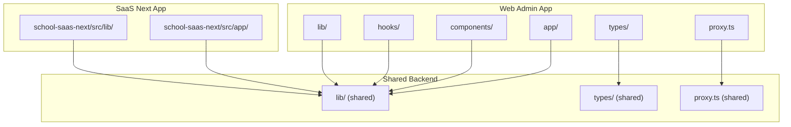
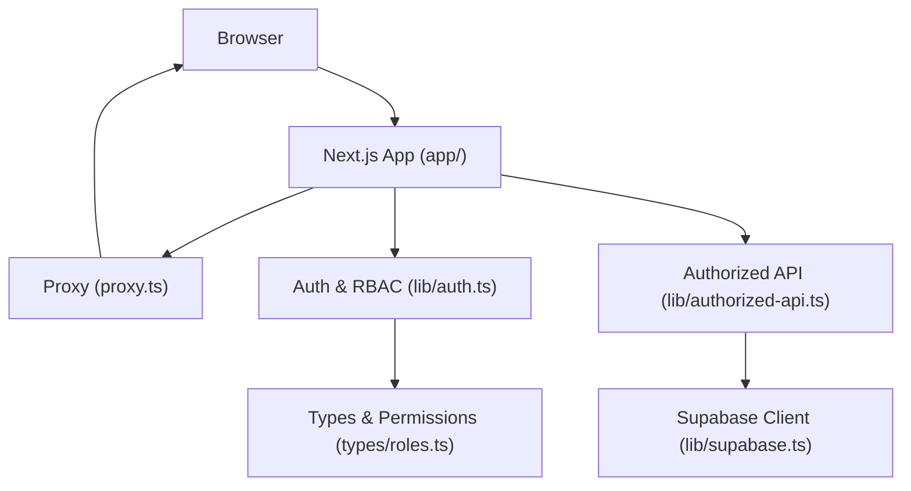
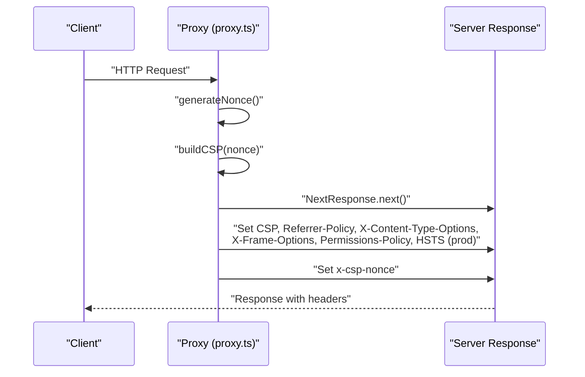
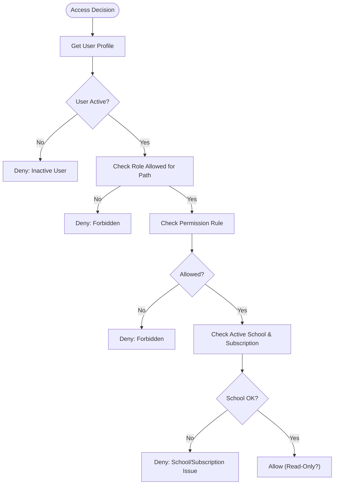
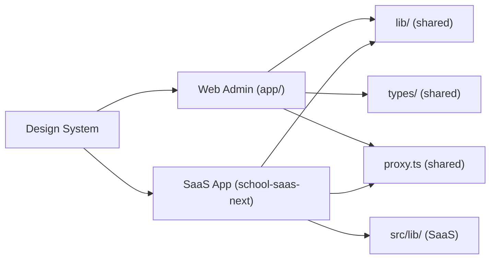

# Developer Guidelines

<cite>
**Referenced Files in This Document**
- [README.md](file://README.md)
- [package.json](file://package.json)
- [eslint.config.mjs](file://eslint.config.mjs)
- [tsconfig.json](file://tsconfig.json)
- [next.config.ts](file://next.config.ts)
- [postcss.config.mjs](file://postcss.config.mjs)
- [proxy.ts](file://proxy.ts)
- [GEMINI.md](file://GEMINI.md)
- [docs/web-admin-handoff/design-system.md](file://docs/web-admin-handoff/design-system.md)
- [docs/web-admin-handoff/tokens/figma-design-tokens.json](file://docs/web-admin-handoff/tokens/figma-design-tokens.json)
- [app/[locale]/globals.css](file://app/[locale]/globals.css)
- [school-saas-next/src/app/globals.css](file://school-saas-next/src/app/globals.css)
- [lib/auth.ts](file://lib/auth.ts)
- [lib/supabase.ts](file://lib/supabase.ts)
- [lib/authorized-api.ts](file://lib/authorized-api.ts)
- [types/roles.ts](file://types/roles.ts)
- [hooks/useAuth.ts](file://hooks/useAuth.ts)
- [hooks/useRole.tsx](file://hooks/useRole.tsx)
- [hooks/useRuntimeBranding.tsx](file://hooks/useRuntimeBranding.tsx)
- [components/ui/button.tsx](file://components/ui/button.tsx)
- [components/school/SchoolModuleLayout.tsx](file://components/school/SchoolModuleLayout.tsx)
- [components/brand/BrandLockup.tsx](file://components/brand/BrandLockup.tsx)
- [components/brand/index.ts](file://components/brand/index.ts)
- [app/[locale]/dashboard/_components/index.ts](file://app/[locale]/dashboard/_components/index.ts)
- [app/[locale]/payments/_components/index.ts](file://app/[locale]/payments/_components/index.ts)
- [app/layout.tsx](file://app/layout.tsx)
- [school-saas-next/eslint.config.mjs](file://school-saas-next/eslint.config.mjs)
- [school-saas-next/tsconfig.json](file://school-saas-next/tsconfig.json)
- [school-saas-next/package.json](file://school-saas-next/package.json)
</cite>

## Update Summary
**Changes Made**
- Added comprehensive GEMINI design system guidelines with RTL-first approach, mobile-first methodology, and 8px spacing system
- Integrated clean modern UI principles with accessibility compliance and reusable component patterns
- Established design token specifications including color palettes, typography scales, and component sizing
- Updated component architecture to align with design system requirements and spacing guidelines
- Enhanced TypeScript strict mode enforcement with comprehensive type safety improvements

## Table of Contents
1. [Introduction](#introduction)
2. [Design System Framework](#design-system-framework)
3. [Project Structure](#project-structure)
4. [Core Components](#core-components)
5. [Architecture Overview](#architecture-overview)
6. [Detailed Component Analysis](#detailed-component-analysis)
7. [Dependency Analysis](#dependency-analysis)
8. [Performance Considerations](#performance-considerations)
9. [Troubleshooting Guide](#troubleshooting-guide)
10. [Conclusion](#conclusion)
11. [Appendices](#appendices)

## Introduction
This document defines developer standards, contribution processes, and best practices for the school administration platform. It covers TypeScript configuration, ESLint rules, code formatting, development workflow, project structure conventions, testing and documentation expectations, quality gates, and practical examples for implementing features, refactoring, and integrating with shared backend services. It also describes the development environment setup, debugging techniques, and performance profiling approaches.

**Updated** The platform now enforces comprehensive TypeScript strict mode across all applications, significantly enhancing type safety and code quality through strict: true and noImplicitAny: true configurations, along with enhanced ESLint rules including @typescript-eslint/no-unused-vars set to error level. The architecture has evolved to embrace comprehensive component-based patterns with standardized component interfaces and modular exports. Additionally, the platform implements the GEMINI design system framework with RTL-first approach, mobile-first methodology, and 8px spacing system for consistent, accessible user experiences.

## Design System Framework

### GEMINI Design System Principles
The GEMINI design system establishes comprehensive guidelines for creating consistent, accessible, and modern user interfaces:

**Core Principles:**
- **RTL First**: Right-to-left layout direction as the default for Arabic and Hebrew languages
- **Mobile First**: Responsive design prioritizing mobile experiences with progressive enhancement
- **Clean Modern UI**: Minimalist aesthetic with professional educational characteristics
- **Accessible Components**: WCAG 2.1 AA compliance with proper semantic markup and keyboard navigation
- **8px Spacing System**: Consistent spacing scale using multiples of 8px for predictable layouts
- **Touch Targets**: Minimum 44px touch targets for optimal mobile interaction
- **Reusable Components**: Component library with consistent APIs and design tokens
- **Simple Forms**: Intuitive form design with clear labeling and validation feedback

**Technical Specifications:**
- **Color Palette**: Indigo/Purple/Sky base colors with semantic variations
- **Typography Scale**: Manrope font family with defined text styles and hierarchy
- **Component Tokens**: Standardized sizing, spacing, and styling for buttons, inputs, cards, and modals
- **Dark Mode Support**: Complete dark theme implementation with proper contrast ratios
- **Animation System**: Smooth transitions and micro-interactions with 150-220ms timing

**Section sources**
- [GEMINI.md:1-15](file://GEMINI.md#L1-L15)
- [docs/web-admin-handoff/design-system.md:1-267](file://docs/web-admin-handoff/design-system.md#L1-L267)
- [docs/web-admin-handoff/tokens/figma-design-tokens.json:1-210](file://docs/web-admin-handoff/tokens/figma-design-tokens.json#L1-L210)

### Design Token Implementation
The design system provides structured token definitions for consistent implementation:

**Color Tokens:**
- Primitive colors: indigo-950, indigo-800, sky-700, surface-0, text-950
- Semantic colors: primary, secondary, success, warning, danger with light/dark variants
- Dark mode palette: canvas, surface, sidebar, and text variations

**Spacing Scale:**
- Base units: 4, 8, 12, 16, 20, 24, 32, 40, 48
- Layout tokens: sidebar width (220px), content padding (24px), section gaps (16px)
- Component tokens: card padding (16px), modal padding (24px)

**Typography System:**
- Font family: Manrope with fallbacks
- Text styles: Display (32px), Heading XL (24px), Body (16px), Label (14px)
- Line heights: 150% for body text, 120-130% for headings
- Tabular numerals for data displays

**Component Specifications:**
- App shell: Fixed sidebar (220px), floating theme toggle, scrollable content area
- Buttons: Height 40-44px, radius 9-14px, variant support (primary, secondary, success, danger)
- Inputs: Height 40-44px, surface-50 background, soft indigo borders
- Cards: Radius 12px, shadow-sm, subtle borders
- Modals: Max widths 480/720/1120px, 18-22px radius, clear header/action structure

**Section sources**
- [docs/web-admin-handoff/tokens/figma-design-tokens.json:8-209](file://docs/web-admin-handoff/tokens/figma-design-tokens.json#L8-L209)
- [docs/web-admin-handoff/design-system.md:23-267](file://docs/web-admin-handoff/design-system.md#L23-L267)

## Project Structure
The repository is a monorepo-like structure with multiple apps and shared libraries:
- Web admin UI: app/[locale], components/, hooks/, messages/, public/
- Shared backend/domain logic: app/api/, lib/, types/, proxy.ts, scripts/
- Database, migrations, storage: migrations/, database_setup.sql, admin_infrastructure.sql
- SaaS Next.js app: school-saas-next/
- Additional standalone apps: 00990090/, school-acc-system/

Key boundaries and notes:
- The web admin UI is intentionally scoped to web-only concerns and must not include mobile runtime code.
- Shared Supabase and domain logic live under lib/ and are consumed by both web and SaaS apps.
- Security headers and CSP are enforced via a proxy function that injects per-request nonces.

**Diagram sources**
- [README.md:18-31](file://README.md#L18-L31)
- [proxy.ts:125-139](file://proxy.ts#L125-L139)

**Section sources**
- [README.md:18-31](file://README.md#L18-L31)

## Core Components
- TypeScript configuration: strict mode, bundler module resolution, isolated modules, JSX transform, path aliases, and include/exclude rules tailored to the app scope.
- ESLint configuration: Next.js core-web-vitals and TypeScript presets, custom overrides, and project-specific ignores.
- Build and lint scripts: dev, build, lint, typecheck, check, audit.
- Security headers and CSP: dynamic generation via a proxy with per-request nonces and environment-aware HSTS.
- Component architecture: modular component exports, standardized prop interfaces, and reusable component patterns.
- **Updated** Design system integration: RTL-first layout implementation, 8px spacing system compliance, and accessibility-focused component development.

**Updated** Enhanced with comprehensive TypeScript strict mode enforcement including strict: true and noImplicitAny: true throughout the application, ensuring rigorous type checking and eliminating implicit any types. The component architecture now follows standardized patterns with clear prop interfaces and modular exports. Design system integration ensures all components adhere to GEMINI guidelines including RTL support, mobile-first approach, and 8px spacing system.

**Section sources**
- [tsconfig.json:1-49](file://tsconfig.json#L1-L49)
- [eslint.config.mjs:1-40](file://eslint.config.mjs#L1-L40)
- [package.json:5-14](file://package.json#L5-L14)
- [next.config.ts:8-49](file://next.config.ts#L8-L49)
- [proxy.ts:44-123](file://proxy.ts#L44-L123)
- [GEMINI.md:3-15](file://GEMINI.md#L3-L15)

## Architecture Overview
The system integrates a Next.js web admin app with shared backend logic and Supabase. Authentication and RBAC decisions are centralized in lib/auth.ts, while API access is mediated by lib/authorized-api.ts. Security headers and CSP are injected by proxy.ts for dynamic routes, with static assets receiving fallback headers.

**Diagram sources**
- [proxy.ts:91-123](file://proxy.ts#L91-L123)
- [lib/auth.ts:1-341](file://lib/auth.ts#L1-L341)
- [lib/authorized-api.ts:1-49](file://lib/authorized-api.ts#L1-L49)
- [lib/supabase.ts:1-22](file://lib/supabase.ts#L1-L22)
- [types/roles.ts:1-432](file://types/roles.ts#L1-L432)

## Detailed Component Analysis

### TypeScript Configuration and Formatting Standards
- Strictness: enabled with strict: true and noImplicitAny: true throughout the application, ensuring comprehensive type safety and eliminating implicit any types.
- Module resolution: bundler for ESM and isolated modules for build safety.
- Path aliases: @/* mapped to repository root for clean imports.
- Include/exclude: targets TS/TSX files and Next's generated types; excludes sibling projects and artifacts.
- Formatting: enforced via ESLint rules and Next presets; avoid unsafe inline scripts by generating nonces in CSP.

**Updated** The TypeScript configuration now enforces strict: true and noImplicitAny: true across all applications, providing comprehensive type safety guarantees and catching potential type-related issues early in the development process. This applies to both the main application and the SaaS Next.js app with identical strict mode configurations. All components must now include proper TypeScript definitions and type annotations to comply with the enhanced strict mode requirements.

**Section sources**
- [tsconfig.json:11-31](file://tsconfig.json#L11-L31)
- [tsconfig.json:33-47](file://tsconfig.json#L33-L47)
- [school-saas-next/tsconfig.json:2-24](file://school-saas-next/tsconfig.json#L2-L24)
- [eslint.config.mjs:27-35](file://eslint.config.mjs#L27-L35)

### ESLint Rules and Code Quality
- Presets: Next.js core-web-vitals and TypeScript recommended rules.
- Overrides: disable specific React Hooks purity and setState-in-effect checks; warn on unused vars with underscore pattern; prefer const; warn on explicit any.
- Ignores: exclude sibling projects and artifacts; keep Next internals and build outputs ignored.

**Updated** Enhanced ESLint configuration now includes @typescript-eslint/no-unused-vars rule set to error level, with argsIgnorePattern and varsIgnorePattern configured to allow underscore-prefixed variables. This ensures all unused variables are caught during development, improving code cleanliness and maintainability. The rule configuration supports both main application and SaaS Next.js app with consistent patterns. All code must now pass stricter linting rules to ensure type safety and code quality.

**Section sources**
- [eslint.config.mjs:5-37](file://eslint.config.mjs#L5-L37)
- [school-saas-next/eslint.config.mjs:1-19](file://school-saas-next/eslint.config.mjs#L1-L19)

### Security Headers and CSP (Dynamic Nonce Injection)
- Per-request nonce generation for CSP script-src.
- Connect-src and image-src include self, data, blob, HTTPS, and Supabase origins when configured.
- Development adds unsafe-eval for HMR/source maps; production includes HSTS.
- Other security headers set consistently; nonce exposed via custom header for server components.

**Diagram sources**
- [proxy.ts:7-17](file://proxy.ts#L7-L17)
- [proxy.ts:44-85](file://proxy.ts#L44-L85)
- [proxy.ts:91-123](file://proxy.ts#L91-L123)

**Section sources**
- [proxy.ts:44-123](file://proxy.ts#L44-L123)

### Authentication, RBAC, and Access Control
- Centralized user profile retrieval and access decision logic.
- Role-based permissions and route-level rules; supports read-only roles and subscription checks.
- Session cookie initialization via an RBAC endpoint; safe sign-out clears session cookie and Supabase session.

**Diagram sources**
- [lib/auth.ts:106-145](file://lib/auth.ts#L106-L145)
- [types/roles.ts:198-268](file://types/roles.ts#L198-L268)

**Section sources**
- [lib/auth.ts:79-149](file://lib/auth.ts#L79-L149)
- [types/roles.ts:47-72](file://types/roles.ts#L47-L72)
- [types/roles.ts:198-268](file://types/roles.ts#L198-L268)

### Authorized API Access Pattern
- Merge and augment headers with Supabase session bearer token.
- Provide fetch wrappers for authorized requests and JSON parsing with safe error handling.

**Section sources**
- [lib/authorized-api.ts:14-49](file://lib/authorized-api.ts#L14-L49)

### Supabase Client Initialization
- Enforce presence of required environment variables for Supabase URL and keys.
- Create a browser client for SSR-friendly auth and data access.

**Section sources**
- [lib/supabase.ts:8-22](file://lib/supabase.ts#L8-L22)

### Component-Based Architecture Patterns
- Modular component exports with standardized interfaces and prop types.
- Reusable UI components with forwardRef and Tailwind-based variants/sizes.
- Component composition patterns with clear separation of concerns.
- Branding and school-specific components with runtime customization support.
- **Updated** Design system compliance: components must follow GEMINI guidelines including RTL-first layout, 8px spacing system, and accessibility requirements.

**Updated** The component architecture now follows comprehensive patterns with standardized component interfaces, modular exports, and clear separation of concerns. Components like Button, SchoolModuleLayout, and BrandLockup demonstrate consistent typing, prop interfaces, and composition patterns that enhance maintainability and reusability. All components must now comply with GEMINI design system requirements including RTL support, mobile-first approach, and 8px spacing system.

**Section sources**
- [components/ui/button.tsx:15-35](file://components/ui/button.tsx#L15-L35)
- [components/school/SchoolModuleLayout.tsx:7-21](file://components/school/SchoolModuleLayout.tsx#L7-L21)
- [components/brand/BrandLockup.tsx:11-20](file://components/brand/BrandLockup.tsx#L11-L20)
- [components/brand/index.ts:1-3](file://components/brand/index.ts#L1-L3)

### Application Layout and Providers
- Global metadata and RTL layout with hydration suppression.
- Providers wrap children for theme, language, and toast contexts.
- **Updated** Design system integration: layout components must support RTL-first approach and implement 8px spacing system.

**Section sources**
- [app/layout.tsx:6-31](file://app/layout.tsx#L6-L31)

### Hook-Based State Management
- Centralized authentication state management with useRole and useAuth hooks.
- Provider pattern for role context with memoized callbacks and optimized rendering.
- Runtime branding integration with hook-based customization.
- **Updated** Enhanced with design system compliance: hooks must support RTL layout switching and theme mode toggling.

**Updated** The hook-based architecture provides centralized state management with optimized performance patterns. The useRole hook implements provider pattern with memoized callbacks, efficient state updates, and proper context management. The useAuth hook simplifies role-based access patterns for component usage. All hooks now support design system requirements including RTL layout and theme mode management.

**Section sources**
- [hooks/useAuth.ts:5-21](file://hooks/useAuth.ts#L5-L21)
- [hooks/useRole.tsx:41-167](file://hooks/useRole.tsx#L41-L167)
- [hooks/useRuntimeBranding.tsx:1-2](file://hooks/useRuntimeBranding.tsx#L1-L2)

### SaaS Next.js App Configuration
- Separate ESLint and TypeScript configs for the SaaS app with minimal ignores.
- Scripts and dependencies aligned with Next.js 16.

**Section sources**
- [school-saas-next/eslint.config.mjs:1-19](file://school-saas-next/eslint.config.mjs#L1-L19)
- [school-saas-next/tsconfig.json:1-35](file://school-saas-next/tsconfig.json#L1-L35)
- [school-saas-next/package.json:5-10](file://school-saas-next/package.json#L5-L10)

### Design System Integration
- **RTL-First Implementation**: HTML elements automatically switch to RTL layout for Arabic locales
- **Mobile-First Approach**: Responsive breakpoints and touch-friendly interactions
- **8px Spacing System**: Consistent spacing using multiples of 8px throughout components
- **Accessibility Compliance**: WCAG 2.1 AA compliant with proper ARIA attributes and keyboard navigation
- **Component Library**: Reusable UI components following design tokens and spacing guidelines

**Section sources**
- [app/[locale]/globals.css:138-146](file://app/[locale]/globals.css#L138-L146)
- [docs/web-admin-handoff/design-system.md:117-138](file://docs/web-admin-handoff/design-system.md#L117-L138)
- [docs/web-admin-handoff/tokens/figma-design-tokens.json:59-70](file://docs/web-admin-handoff/tokens/figma-design-tokens.json#L59-L70)

## Dependency Analysis
- Web admin app depends on shared lib/, types/, and proxy.ts.
- SaaS app depends on its own src/lib and shares Supabase client patterns.
- Security posture relies on CSP nonces and environment-aware headers.
- **Updated** Design system dependencies: components rely on design tokens and spacing system for consistent implementation.

**Diagram sources**
- [README.md:20-22](file://README.md#L20-L22)
- [proxy.ts:125-139](file://proxy.ts#L125-L139)

**Section sources**
- [README.md:20-22](file://README.md#L20-L22)

## Performance Considerations
- Prefer isolated modules and bundler module resolution for faster builds and accurate diagnostics.
- Keep strict mode enabled to catch potential performance pitfalls early.
- Use the proxy's CSP with nonces to minimize render-blocking script risks.
- Leverage Next.js static headers for static assets and dynamic headers only for non-static routes.
- **Updated** Design system optimization: leverage CSS custom properties for theme switching and reduce layout thrashing.

**Updated** The comprehensive TypeScript strict mode implementation enhances build-time performance by catching type-related issues early, reducing runtime errors and improving overall application stability. Component-based architecture patterns with proper typing and modular exports contribute to better tree-shaking and reduced bundle sizes. Design system implementation uses CSS custom properties for efficient theme switching and maintains consistent performance across RTL and LTR layouts.

**Section sources**
- [tsconfig.json:14-18](file://tsconfig.json#L14-L18)
- [next.config.ts:10-44](file://next.config.ts#L10-L44)
- [proxy.ts:44-85](file://proxy.ts#L44-L85)

## Troubleshooting Guide
- Missing Supabase environment variables cause an immediate error during client creation. Ensure NEXT_PUBLIC_SUPABASE_URL and NEXT_PUBLIC_SUPABASE_ANON_KEY (or publishable key) are present.
- If RBAC session initialization fails, the wrapper throws a descriptive error when strict mode is enabled; otherwise it logs and continues.
- For access denied issues, inspect the access decision reasons returned by the RBAC logic and verify role, permissions, active school, and subscription status.
- To debug CSP, confirm the nonce header is present and that dynamic routes match the proxy matcher configuration.
- **Updated** With enhanced strict mode, type-related compilation errors will now surface immediately during development, helping identify issues like missing type annotations, implicit any types, and incorrect type usage before they reach runtime. Unused variable warnings are now elevated to errors, ensuring cleaner codebases. Design system issues can be debugged by verifying CSS custom properties and component token implementations.

**Updated** With enhanced strict mode, type-related compilation errors will now surface immediately during development, helping identify issues like missing type annotations, implicit any types, and incorrect type usage before they reach runtime. Unused variable warnings are now elevated to errors, ensuring cleaner codebases. Design system issues can be debugged by verifying CSS custom properties and component token implementations. RTL layout problems can be identified by checking HTML direction attributes and CSS writing-mode properties.

**Section sources**
- [lib/supabase.ts:8-19](file://lib/supabase.ts#L8-L19)
- [lib/authorized-api.ts:294-317](file://lib/authorized-api.ts#L294-L317)
- [lib/auth.ts:106-145](file://lib/auth.ts#L106-L145)
- [proxy.ts:125-139](file://proxy.ts#L125-L139)

## Conclusion
These guidelines establish a consistent, secure, and maintainable development process across the web admin app, shared backend, and SaaS app. By adhering to TypeScript strictness, ESLint rules, CSP with nonces, and centralized auth/RBAC patterns, contributors can implement features safely and efficiently while preserving code quality and performance.

**Updated** The comprehensive TypeScript strict mode implementation significantly strengthens the codebase's reliability and maintainability by enforcing strict type checking, eliminating implicit any types, and catching potential type-related issues early in the development cycle. The adoption of component-based architecture patterns with standardized interfaces and modular exports enhances code organization, reusability, and long-term maintainability. The integration of GEMINI design system principles ensures consistent, accessible, and modern user experiences across all components and layouts.

## Appendices

### Development Workflow and Contribution Processes
- Branching: Use feature branches prefixed with concise, descriptive names. Sync with main before opening PRs.
- Pull Requests: Include a summary, rationale, and links to related issues. Ensure CI passes and reviews are approved.
- Code Review: Focus on correctness, readability, security (especially CSP and auth), and adherence to project conventions.
- Quality Gates: Run lint, typecheck, and build locally before pushing. Verify Supabase env vars are set and RBAC behavior aligns with expectations.
- **Updated** Design system compliance: Ensure all new components follow GEMINI guidelines including RTL support, 8px spacing system, and accessibility requirements.

### Testing Requirements
- Unit tests: Prefer component and utility tests with deterministic mocks for Supabase and RBAC logic.
- Integration tests: Validate API flows with authorized headers and session cookies.
- Manual QA: Test access control across roles, locales, and subscription states; verify CSP and security headers.
- **Updated** Design system testing: Verify RTL layout rendering, mobile responsiveness, and accessibility compliance across different screen sizes and languages.

### Documentation Standards
- Document new APIs in lib/ and shared types with clear intent and examples.
- Update README sections when introducing new capabilities or changing boundaries.
- Keep inline comments concise; defer long-form explanations to docs or JSDoc.
- **Updated** Design system documentation: Include component usage examples, design token references, and RTL implementation notes.

### Practical Examples

#### Implementing a New Feature Page
- Create a new page under app/[locale]/<feature>/page.tsx.
- Add route-level access rules in types/roles.ts if needed.
- Use lib/authorized-api.ts for data fetching and hooks/useAuth.ts for capability checks.
- Apply UI components from components/ and ensure RTL layout compatibility.

**Section sources**
- [types/roles.ts:198-268](file://types/roles.ts#L198-L268)
- [lib/authorized-api.ts:27-49](file://lib/authorized-api.ts#L27-L49)
- [hooks/useAuth.ts:5-21](file://hooks/useAuth.ts#L5-L21)

#### Refactoring Existing Code
- Replace ad-hoc headers with buildAuthorizedHeaders from lib/authorized-api.ts.
- Consolidate access checks into getAccessDecision from lib/auth.ts.
- Ensure path normalization and matching logic align with types/roles.ts.

**Section sources**
- [lib/authorized-api.ts:14-25](file://lib/authorized-api.ts#L14-L25)
- [lib/auth.ts:106-145](file://lib/auth.ts#L106-L145)
- [types/roles.ts:380-414](file://types/roles.ts#L380-L414)

#### Integrating with Shared Backend Services
- Use lib/supabase.ts for client initialization and lib/authorized-api.ts for authenticated requests.
- Respect RBAC rules and session lifecycle; clear cookies on sign-out via lib/auth.ts.

**Section sources**
- [lib/supabase.ts:1-22](file://lib/supabase.ts#L1-L22)
- [lib/authorized-api.ts:27-49](file://lib/authorized-api.ts#L27-L49)
- [lib/auth.ts:333-341](file://lib/auth.ts#L333-L341)

#### Implementing GEMINI Design System Components
- Create components using design tokens from CSS custom properties.
- Ensure RTL layout compatibility with proper direction and writing-mode properties.
- Implement 8px spacing system using consistent padding and margin values.
- Follow accessibility guidelines with proper ARIA attributes and keyboard navigation.

**Section sources**
- [docs/web-admin-handoff/design-system.md:156-267](file://docs/web-admin-handoff/design-system.md#L156-L267)
- [docs/web-admin-handoff/tokens/figma-design-tokens.json:160-209](file://docs/web-admin-handoff/tokens/figma-design-tokens.json#L160-L209)
- [app/[locale]/globals.css:138-146](file://app/[locale]/globals.css#L138-L146)

### Development Environment Setup
- Install dependencies and run the dev server using the scripts defined in package.json.
- Configure environment variables for Supabase and any external services.
- Use ESLint and TypeScript checks locally before committing.
- **Updated** Verify design system compliance: test RTL layout switching, mobile responsiveness, and accessibility features.

**Section sources**
- [package.json:5-14](file://package.json#L5-L14)
- [lib/supabase.ts:3-19](file://lib/supabase.ts#L3-L19)
- [eslint.config.mjs:9-25](file://eslint.config.mjs#L9-L25)

### Debugging Techniques
- Inspect access decision reasons in lib/auth.ts to diagnose permission failures.
- Verify CSP headers and nonce presence in proxy.ts for script-related issues.
- Use browser devtools to confirm headers and network requests.
- **Updated** Design system debugging: inspect CSS custom properties, verify RTL layout rendering, and test component spacing consistency.

**Section sources**
- [lib/auth.ts:106-145](file://lib/auth.ts#L106-L145)
- [proxy.ts:91-123](file://proxy.ts#L91-L123)

### Performance Profiling Approaches
- Measure build times with Next.js stats and analyze bundle composition.
- Monitor runtime performance using browser devtools and server logs.
- Keep CSP minimal and nonces per request to reduce render-blocking risks.
- **Updated** Design system performance: monitor CSS custom property usage, optimize theme switching, and profile RTL layout rendering performance.

### TypeScript Strict Mode Best Practices
**Updated** With the comprehensive TypeScript strict mode implementation, developers should follow these enhanced best practices:

- **Eliminate Implicit Any Types**: All variables, parameters, and return values must have explicit type annotations. Remove any implicit any types that may have existed previously.
- **Enable Strict Type Checking**: The strict: true configuration ensures comprehensive type checking including strictNullChecks, strictFunctionTypes, and strictPropertyInitialization.
- **Handle Optional Properties Properly**: Use proper optional chaining and nullish coalescing operators when dealing with potentially undefined properties.
- **Use Exhaustive Type Checking**: Implement exhaustive switch statements and conditional checks to handle all possible union types.
- **Leverage Type Guards**: Use type guards and discriminated unions to narrow types in complex conditional logic.
- **Avoid Type Assertions**: Minimize the use of type assertions (as) and type casting. Instead, fix underlying type issues at their source.
- **Implement Generic Constraints**: Use proper generic constraints and type parameters to maintain type safety in reusable components and utilities.
- **Follow Component Interface Patterns**: Adhere to standardized component prop interfaces and typing patterns established in the component library.
- **Design System Type Safety**: Ensure all design system components include proper TypeScript definitions for design tokens and spacing values.

### Component Architecture Guidelines
**Updated** The component-based architecture follows these established patterns:

- **Standardized Interfaces**: All components use consistent prop interfaces with clear type definitions and optional properties.
- **Modular Exports**: Components are organized in logical groups with barrel exports for easy consumption.
- **ForwardRef Implementation**: Interactive components implement forwardRef for proper DOM access and ref forwarding.
- **Tailwind Integration**: Components use Tailwind CSS classes with consistent variant patterns and responsive design.
- **Runtime Customization**: Branding and theming are handled through runtime hooks and context providers.
- **Composition Patterns**: Complex components are built from smaller, reusable pieces following single responsibility principles.
- **Design System Compliance**: All components must follow GEMINI guidelines including RTL support, 8px spacing system, and accessibility requirements.
- **TypeScript Integration**: Components include proper TypeScript definitions for design tokens, spacing values, and component variants.

### Design System Implementation Guidelines
**Updated** Developers implementing components with the GEMINI design system should follow these guidelines:

- **RTL-First Implementation**: Use CSS writing-mode and direction properties for proper right-to-left layout support.
- **Mobile-First Approach**: Implement responsive breakpoints and touch-friendly interactions with minimum 44px touch targets.
- **8px Spacing System**: Use CSS custom properties for spacing values (4, 8, 12, 16, 20, 24, 32, 40, 48px multiples).
- **Accessibility Compliance**: Implement proper ARIA attributes, keyboard navigation, and WCAG 2.1 AA compliant color contrasts.
- **Component Token Usage**: Reference design tokens from CSS custom properties for consistent colors, typography, and spacing.
- **Theme Mode Support**: Implement dark/light theme switching with proper contrast ratios and visual consistency.
- **Animation Standards**: Use consistent transition durations (150-220ms) and easing functions for micro-interactions.
- **Form Design**: Implement clean, accessible form layouts with proper labeling, validation feedback, and error states.