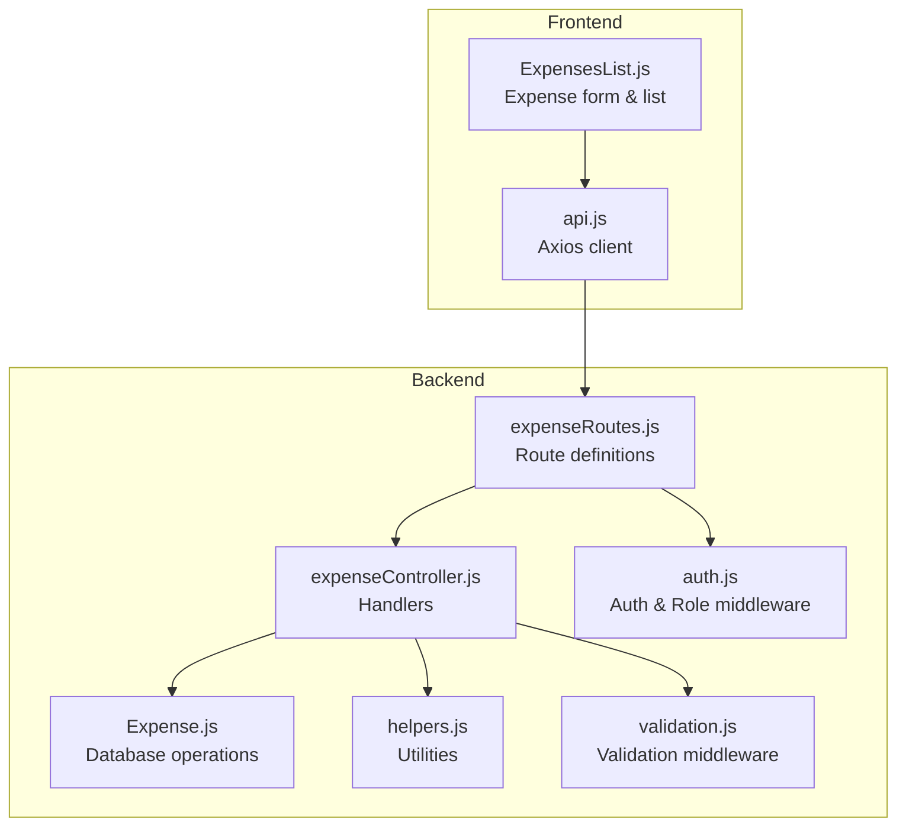
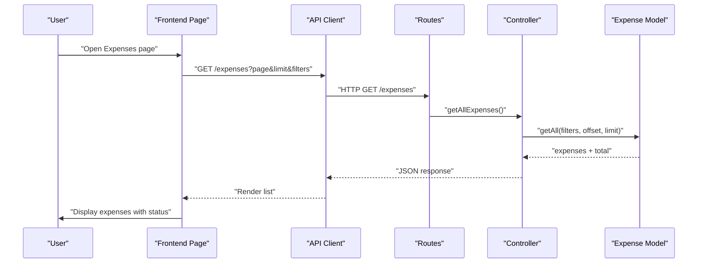
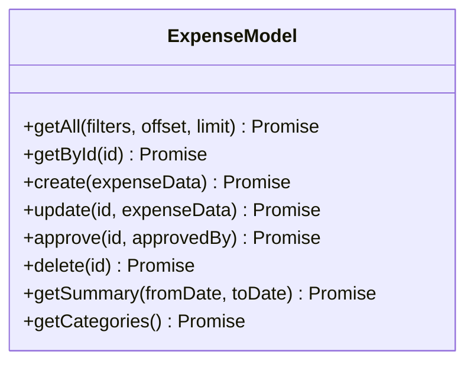
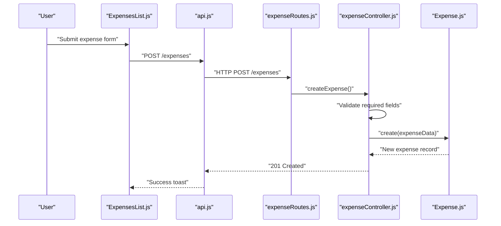
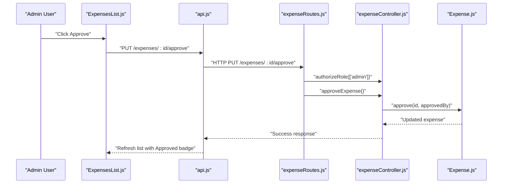
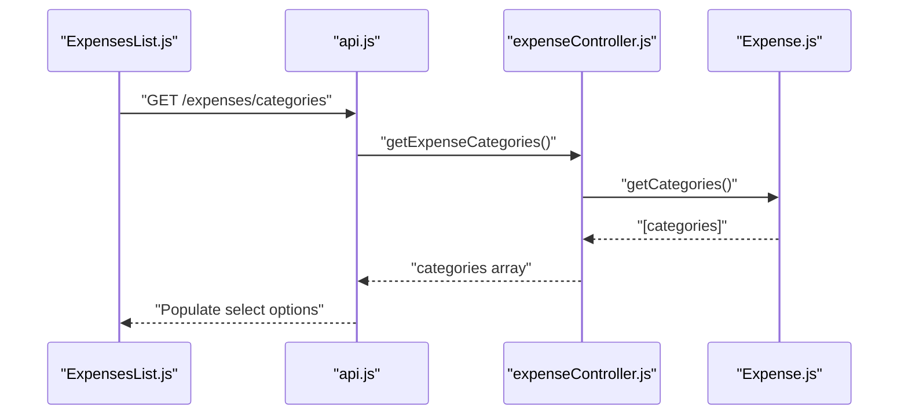
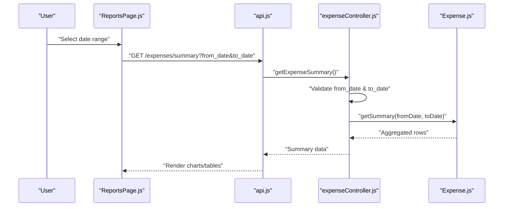
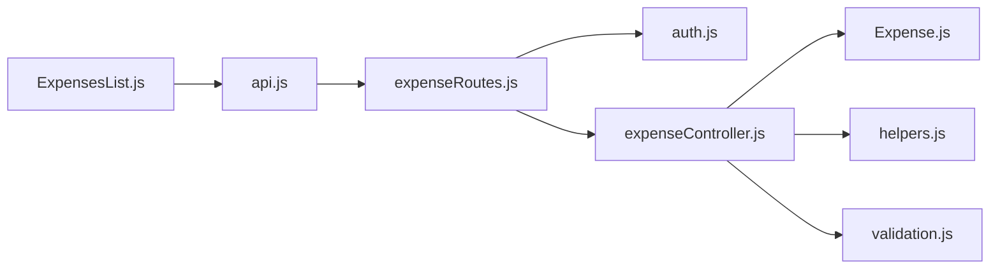

# Expense Management

<cite>
**Referenced Files in This Document**
- [Expense.js](file://00990090/school-accounting-system/backend/src/models/Expense.js)
- [expenseController.js](file://00990090/school-accounting-system/backend/src/controllers/expenseController.js)
- [expenseRoutes.js](file://00990090/school-accounting-system/backend/src/routes/expenseRoutes.js)
- [validation.js](file://00990090/school-accounting-system/backend/src/middleware/validation.js)
- [auth.js](file://00990090/school-accounting-system/backend/src/middleware/auth.js)
- [helpers.js](file://00990090/school-accounting-system/backend/src/utils/helpers.js)
- [ExpensesList.js](file://00990090/school-accounting-system/frontend/src/pages/ExpensesList.js)
- [api.js](file://00990090/school-accounting-system/frontend/src/services/api.js)
- [schema.sql](file://00990090/school-accounting-system/database/schema.sql)
- [sample_data.sql](file://00990090/school-accounting-system/database/sample_data.sql)
</cite>

## Table of Contents
1. [Introduction](#introduction)
2. [Project Structure](#project-structure)
3. [Core Components](#core-components)
4. [Architecture Overview](#architecture-overview)
5. [Detailed Component Analysis](#detailed-component-analysis)
6. [Dependency Analysis](#dependency-analysis)
7. [Performance Considerations](#performance-considerations)
8. [Troubleshooting Guide](#troubleshooting-guide)
9. [Conclusion](#conclusion)
10. [Appendices](#appendices)

## Introduction
This document describes the expense management system within the school accounting solution. It covers the end-to-end expense lifecycle: recording, categorization, approval workflows, reporting, and integration with financial summaries. It also documents the data model, validation rules, and practical examples for common scenarios such as creating expenses, routing approvals, and generating expense reports.

## Project Structure
The expense management system spans a backend Node.js/Express application and a frontend React interface. The backend exposes REST endpoints for CRUD operations, filtering, and reporting. The frontend consumes these endpoints to present forms, lists, and summaries.

**Diagram sources**
- [expenseRoutes.js:1-35](file://00990090/school-accounting-system/backend/src/routes/expenseRoutes.js#L1-L35)
- [expenseController.js:1-259](file://00990090/school-accounting-system/backend/src/controllers/expenseController.js#L1-L259)
- [Expense.js:1-204](file://00990090/school-accounting-system/backend/src/models/Expense.js#L1-L204)
- [helpers.js:1-104](file://00990090/school-accounting-system/backend/src/utils/helpers.js#L1-L104)
- [auth.js:1-88](file://00990090/school-accounting-system/backend/src/middleware/auth.js#L1-L88)
- [validation.js:1-27](file://00990090/school-accounting-system/backend/src/middleware/validation.js#L1-L27)
- [api.js:1-86](file://00990090/school-accounting-system/frontend/src/services/api.js#L1-L86)
- [ExpensesList.js:1-145](file://00990090/school-accounting-system/frontend/src/pages/ExpensesList.js#L1-L145)

**Section sources**
- [expenseRoutes.js:1-35](file://00990090/school-accounting-system/backend/src/routes/expenseRoutes.js#L1-L35)
- [expenseController.js:1-259](file://00990090/school-accounting-system/backend/src/controllers/expenseController.js#L1-L259)
- [Expense.js:1-204](file://00990090/school-accounting-system/backend/src/models/Expense.js#L1-L204)
- [helpers.js:1-104](file://00990090/school-accounting-system/backend/src/utils/helpers.js#L1-L104)
- [auth.js:1-88](file://00990090/school-accounting-system/backend/src/middleware/auth.js#L1-L88)
- [validation.js:1-27](file://00990090/school-accounting-system/backend/src/middleware/validation.js#L1-L27)
- [api.js:1-86](file://00990090/school-accounting-system/frontend/src/services/api.js#L1-L86)
- [ExpensesList.js:1-145](file://00990090/school-accounting-system/frontend/src/pages/ExpensesList.js#L1-L145)

## Core Components
- Expense Model: Encapsulates database operations for expenses, including listing with filters, creation, updates, approvals, deletions, summaries, and category retrieval.
- Expense Controller: Implements handlers for endpoints, applies pagination, validates inputs, and orchestrates model operations.
- Expense Routes: Defines REST endpoints with authentication and role-based authorization.
- Frontend API Client: Axios-based service exposing typed calls for expense operations.
- Frontend Page: Renders the expense form, category dropdown, and paginated list with status indicators.

Key capabilities:
- Expense recording with required fields and defaults
- Filtering by category, approval status, and date range
- Approval workflow with administrative authorization
- Expense summary aggregation by category and date
- Category enumeration for selection

**Section sources**
- [Expense.js:104-122](file://00990090/school-accounting-system/backend/src/models/Expense.js#L104-L122)
- [expenseController.js:76-112](file://00990090/school-accounting-system/backend/src/controllers/expenseController.js#L76-L112)
- [expenseRoutes.js:22-32](file://00990090/school-accounting-system/backend/src/routes/expenseRoutes.js#L22-L32)
- [api.js:63-75](file://00990090/school-accounting-system/frontend/src/services/api.js#L63-L75)
- [ExpensesList.js:10-42](file://00990090/school-accounting-system/frontend/src/pages/ExpensesList.js#L10-L42)

## Architecture Overview
The system follows a layered architecture:
- Presentation Layer: React page renders forms and lists.
- API Layer: Express routes define endpoints.
- Business Logic Layer: Controllers implement workflows and validations.
- Persistence Layer: Model executes database queries.

**Diagram sources**
- [expenseRoutes.js:10-11](file://00990090/school-accounting-system/backend/src/routes/expenseRoutes.js#L10-L11)
- [expenseController.js:11-41](file://00990090/school-accounting-system/backend/src/controllers/expenseController.js#L11-L41)
- [Expense.js:13-85](file://00990090/school-accounting-system/backend/src/models/Expense.js#L13-L85)
- [api.js:63-75](file://00990090/school-accounting-system/frontend/src/services/api.js#L63-L75)
- [ExpensesList.js:20](file://00990090/school-accounting-system/frontend/src/pages/ExpensesList.js#L20)

## Detailed Component Analysis

### Expense Data Model
The Expense model defines the expense entity and operations:
- Fields: id, description, category, amount, expense_date, payment_method, reference_number, notes, is_approved, created_by, approved_by, created_at, updated_at.
- Operations:
  - Retrieve all with filters and pagination
  - Retrieve by ID
  - Create with defaults and creator metadata
  - Update fields with timestamps
  - Approve by setting approval flag and approver
  - Delete
  - Summary aggregation by category and date for approved expenses
  - Category enumeration

**Diagram sources**
- [Expense.js:9-201](file://00990090/school-accounting-system/backend/src/models/Expense.js#L9-L201)

**Section sources**
- [Expense.js:13-85](file://00990090/school-accounting-system/backend/src/models/Expense.js#L13-L85)
- [Expense.js:104-122](file://00990090/school-accounting-system/backend/src/models/Expense.js#L104-L122)
- [Expense.js:127-147](file://00990090/school-accounting-system/backend/src/models/Expense.js#L127-L147)
- [Expense.js:152-162](file://00990090/school-accounting-system/backend/src/models/Expense.js#L152-L162)
- [Expense.js:175-190](file://00990090/school-accounting-system/backend/src/models/Expense.js#L175-L190)
- [Expense.js:195-200](file://00990090/school-accounting-system/backend/src/models/Expense.js#L195-L200)

### Expense Recording Workflow
Recording an expense involves:
- Frontend form submission via the API client
- Controller validation ensuring required fields
- Model insertion with creator metadata and defaults

**Diagram sources**
- [ExpensesList.js:23-42](file://00990090/school-accounting-system/frontend/src/pages/ExpensesList.js#L23-L42)
- [api.js:68](file://00990090/school-accounting-system/frontend/src/services/api.js#L68)
- [expenseRoutes.js:23](file://00990090/school-accounting-system/backend/src/routes/expenseRoutes.js#L23)
- [expenseController.js:76-112](file://00990090/school-accounting-system/backend/src/controllers/expenseController.js#L76-L112)
- [Expense.js:104-122](file://00990090/school-accounting-system/backend/src/models/Expense.js#L104-L122)

**Section sources**
- [ExpensesList.js:10-42](file://00990090/school-accounting-system/frontend/src/pages/ExpensesList.js#L10-L42)
- [api.js:63-75](file://00990090/school-accounting-system/frontend/src/services/api.js#L63-L75)
- [expenseController.js:76-112](file://00990090/school-accounting-system/backend/src/controllers/expenseController.js#L76-L112)
- [Expense.js:104-122](file://00990090/school-accounting-system/backend/src/models/Expense.js#L104-L122)

### Expense Approval Workflow
Approval requires administrative authorization:
- Route enforces role-based access
- Controller sets approval flag and approver
- Model updates approval metadata

**Diagram sources**
- [expenseRoutes.js:29](file://00990090/school-accounting-system/backend/src/routes/expenseRoutes.js#L29)
- [auth.js:46-64](file://00990090/school-accounting-system/backend/src/middleware/auth.js#L46-L64)
- [expenseController.js:150-174](file://00990090/school-accounting-system/backend/src/controllers/expenseController.js#L150-L174)
- [Expense.js:152-162](file://00990090/school-accounting-system/backend/src/models/Expense.js#L152-L162)

**Section sources**
- [expenseRoutes.js:28-32](file://00990090/school-accounting-system/backend/src/routes/expenseRoutes.js#L28-L32)
- [auth.js:46-64](file://00990090/school-accounting-system/backend/src/middleware/auth.js#L46-L64)
- [expenseController.js:150-174](file://00990090/school-accounting-system/backend/src/controllers/expenseController.js#L150-L174)
- [Expense.js:152-162](file://00990090/school-accounting-system/backend/src/models/Expense.js#L152-L162)

### Expense Categories and Categorization
- Categories are enumerated from the database and presented in the UI.
- The form includes a category dropdown with predefined options and dynamic categories from the backend.
- Filtering supports category-based queries.

**Diagram sources**
- [api.js:74](file://00990090/school-accounting-system/frontend/src/services/api.js#L74)
- [expenseController.js:232-247](file://00990090/school-accounting-system/backend/src/controllers/expenseController.js#L232-L247)
- [Expense.js:195-200](file://00990090/school-accounting-system/backend/src/models/Expense.js#L195-L200)

**Section sources**
- [ExpensesList.js:74-81](file://00990090/school-accounting-system/frontend/src/pages/ExpensesList.js#L74-L81)
- [api.js:74](file://00990090/school-accounting-system/frontend/src/services/api.js#L74)
- [expenseController.js:232-247](file://00990090/school-accounting-system/backend/src/controllers/expenseController.js#L232-L247)
- [Expense.js:195-200](file://00990090/school-accounting-system/backend/src/models/Expense.js#L195-L200)

### Expense Tracking and Reporting
- Summary endpoint aggregates approved expenses by category and date for a given period.
- The controller validates required date parameters.
- The model performs grouped aggregation with totals and counts.

**Diagram sources**
- [api.js:72-73](file://00990090/school-accounting-system/frontend/src/services/api.js#L72-L73)
- [expenseController.js:202-226](file://00990090/school-accounting-system/backend/src/controllers/expenseController.js#L202-L226)
- [Expense.js:175-190](file://00990090/school-accounting-system/backend/src/models/Expense.js#L175-L190)

**Section sources**
- [expenseController.js:202-226](file://00990090/school-accounting-system/backend/src/controllers/expenseController.js#L202-L226)
- [Expense.js:175-190](file://00990090/school-accounting-system/backend/src/models/Expense.js#L175-L190)

### Vendor Management
- The current implementation does not include a dedicated vendor entity or vendor-specific fields on expenses.
- Vendors can be represented conceptually via notes or reference numbers, but there is no vendor lookup, creation, or management UI/API in the current codebase.

**Section sources**
- [Expense.js:106-119](file://00990090/school-accounting-system/backend/src/models/Expense.js#L106-L119)
- [expenseController.js:78-96](file://00990090/school-accounting-system/backend/src/controllers/expenseController.js#L78-L96)

### Reimbursement Procedures
- The system does not implement a dedicated reimbursement workflow or payment linkage to expenses.
- No endpoints exist for marking expenses as reimbursed or generating payment records against expenses.

**Section sources**
- [expenseRoutes.js:1-35](file://00990090/school-accounting-system/backend/src/routes/expenseRoutes.js#L1-L35)
- [expenseController.js:1-259](file://00990090/school-accounting-system/backend/src/controllers/expenseController.js#L1-L259)

### Financial Reporting and Budget Monitoring
- The summary endpoint aggregates approved expenses by category and date, enabling basic reporting.
- Budget monitoring would require linking categories to budgets and adding budget thresholds, which is not implemented in the current codebase.

**Section sources**
- [Expense.js:175-190](file://00990090/school-accounting-system/backend/src/models/Expense.js#L175-L190)
- [expenseController.js:202-226](file://00990090/school-accounting-system/backend/src/controllers/expenseController.js#L202-L226)

### Implementation Examples

#### Example: Create an Expense
- Frontend: Fill the form and submit via the API client.
- Backend: Controller validates required fields; Model inserts the record with creator metadata.

**Section sources**
- [ExpensesList.js:23-42](file://00990090/school-accounting-system/frontend/src/pages/ExpensesList.js#L23-L42)
- [api.js:68](file://00990090/school-accounting-system/frontend/src/services/api.js#L68)
- [expenseController.js:76-112](file://00990090/school-accounting-system/backend/src/controllers/expenseController.js#L76-L112)
- [Expense.js:104-122](file://00990090/school-accounting-system/backend/src/models/Expense.js#L104-L122)

#### Example: Approve an Expense
- Frontend: Click approve on the list item.
- Backend: Route enforces admin role; Controller updates approval flag; Model persists the change.

**Section sources**
- [ExpensesList.js:126-130](file://00990090/school-accounting-system/frontend/src/pages/ExpensesList.js#L126-L130)
- [api.js:70](file://00990090/school-accounting-system/frontend/src/services/api.js#L70)
- [expenseRoutes.js:29](file://00990090/school-accounting-system/backend/src/routes/expenseRoutes.js#L29)
- [auth.js:46-64](file://00990090/school-accounting-system/backend/src/middleware/auth.js#L46-L64)
- [expenseController.js:150-174](file://00990090/school-accounting-system/backend/src/controllers/expenseController.js#L150-L174)
- [Expense.js:152-162](file://00990090/school-accounting-system/backend/src/models/Expense.js#L152-L162)

#### Example: Filter and Paginate Expenses
- Frontend: Use query parameters for page, limit, category, approval status, and date range.
- Backend: Controller builds filters and pagination; Model executes filtered query with counts.

**Section sources**
- [ExpensesList.js:20](file://00990090/school-accounting-system/frontend/src/pages/ExpensesList.js#L20)
- [api.js:65-66](file://00990090/school-accounting-system/frontend/src/services/api.js#L65-L66)
- [expenseController.js:11-41](file://00990090/school-accounting-system/backend/src/controllers/expenseController.js#L11-L41)
- [Expense.js:13-85](file://00990090/school-accounting-system/backend/src/models/Expense.js#L13-L85)

### Expense Validation Rules
- Required fields for creation: description, category, amount.
- Optional fields: expense_date, payment_method, reference_number, notes.
- Default behavior: expense_date defaults to today if not provided.
- Additional validations can be integrated using the validation middleware.

**Section sources**
- [expenseController.js:80-85](file://00990090/school-accounting-system/backend/src/controllers/expenseController.js#L80-L85)
- [expenseController.js:91](file://00990090/school-accounting-system/backend/src/controllers/expenseController.js#L91)
- [validation.js:9-22](file://00990090/school-accounting-system/backend/src/middleware/validation.js#L9-L22)

### Receipt Management
- The backend includes utilities for generating unique identifiers (receipt/invoice numbers) and formatting currency/date, which could support receipt numbering and display.
- There is no dedicated receipt attachment or storage integration in the current codebase.

**Section sources**
- [helpers.js:8-24](file://00990090/school-accounting-system/backend/src/utils/helpers.js#L8-L24)
- [helpers.js:32-37](file://00990090/school-accounting-system/backend/src/utils/helpers.js#L32-L37)
- [helpers.js:44-50](file://00990090/school-accounting-system/backend/src/utils/helpers.js#L44-L50)

### Expense Audit Requirements
- The model tracks created_by and approved_by, enabling audit trails for who created and approved each expense.
- Timestamps (created_at, updated_at) are maintained automatically.

**Section sources**
- [Expense.js:15-18](file://00990090/school-accounting-system/backend/src/models/Expense.js#L15-L18)
- [Expense.js:138](file://00990090/school-accounting-system/backend/src/models/Expense.js#L138)
- [Expense.js:157](file://00990090/school-accounting-system/backend/src/models/Expense.js#L157)

## Dependency Analysis
The expense module exhibits clear separation of concerns:
- Routes depend on authentication and authorization middleware.
- Controllers depend on the model and helper utilities.
- Frontend depends on the API client and renders lists and forms.

**Diagram sources**
- [expenseRoutes.js:1-35](file://00990090/school-accounting-system/backend/src/routes/expenseRoutes.js#L1-L35)
- [auth.js:1-88](file://00990090/school-accounting-system/backend/src/middleware/auth.js#L1-L88)
- [expenseController.js:1-259](file://00990090/school-accounting-system/backend/src/controllers/expenseController.js#L1-L259)
- [Expense.js:1-204](file://00990090/school-accounting-system/backend/src/models/Expense.js#L1-L204)
- [helpers.js:1-104](file://00990090/school-accounting-system/backend/src/utils/helpers.js#L1-L104)
- [validation.js:1-27](file://00990090/school-accounting-system/backend/src/middleware/validation.js#L1-L27)
- [api.js:1-86](file://00990090/school-accounting-system/frontend/src/services/api.js#L1-L86)
- [ExpensesList.js:1-145](file://00990090/school-accounting-system/frontend/src/pages/ExpensesList.js#L1-L145)

**Section sources**
- [expenseRoutes.js:1-35](file://00990090/school-accounting-system/backend/src/routes/expenseRoutes.js#L1-L35)
- [auth.js:1-88](file://00990090/school-accounting-system/backend/src/middleware/auth.js#L1-L88)
- [expenseController.js:1-259](file://00990090/school-accounting-system/backend/src/controllers/expenseController.js#L1-L259)
- [Expense.js:1-204](file://00990090/school-accounting-system/backend/src/models/Expense.js#L1-L204)
- [helpers.js:1-104](file://00990090/school-accounting-system/backend/src/utils/helpers.js#L1-L104)
- [validation.js:1-27](file://00990090/school-accounting-system/backend/src/middleware/validation.js#L1-L27)
- [api.js:1-86](file://00990090/school-accounting-system/frontend/src/services/api.js#L1-L86)
- [ExpensesList.js:1-145](file://00990090/school-accounting-system/frontend/src/pages/ExpensesList.js#L1-L145)

## Performance Considerations
- Pagination: The controller and model implement offset/limit pagination to avoid large result sets.
- Filtering: Database-side filtering reduces payload sizes.
- Aggregation: Summary queries group by category and date; ensure appropriate indexing on date and category fields for performance.
- Recommendations:
  - Add database indexes on category, expense_date, and is_approved for filtering and grouping.
  - Consider caching frequently accessed categories.
  - Monitor query execution plans for large datasets.

**Section sources**
- [helpers.js:79-83](file://00990090/school-accounting-system/backend/src/utils/helpers.js#L79-L83)
- [Expense.js:13-85](file://00990090/school-accounting-system/backend/src/models/Expense.js#L13-L85)
- [Expense.js:175-190](file://00990090/school-accounting-system/backend/src/models/Expense.js#L175-L190)

## Troubleshooting Guide
Common issues and resolutions:
- Authentication failures: Ensure a valid Bearer token is included in Authorization headers.
- Insufficient permissions: Approve and delete endpoints require admin role.
- Validation errors: Required fields must be provided; check the validation middleware response for specific field errors.
- Expense not found: Verify the expense ID exists before attempting updates or approvals.
- Date range missing: Summary endpoint requires both from_date and to_date.

**Section sources**
- [auth.js:10-40](file://00990090/school-accounting-system/backend/src/middleware/auth.js#L10-L40)
- [auth.js:46-64](file://00990090/school-accounting-system/backend/src/middleware/auth.js#L46-L64)
- [validation.js:9-22](file://00990090/school-accounting-system/backend/src/middleware/validation.js#L9-L22)
- [expenseController.js:52-57](file://00990090/school-accounting-system/backend/src/controllers/expenseController.js#L52-L57)
- [expenseController.js:206-211](file://00990090/school-accounting-system/backend/src/controllers/expenseController.js#L206-L211)

## Conclusion
The expense management system provides a solid foundation for recording, categorizing, and approving expenses, with reporting capabilities for approved items. It includes clear separation of concerns, role-based access controls, and pagination. Enhancements such as vendor management, reimbursement workflows, and budget monitoring would extend the system’s financial governance capabilities.

## Appendices

### Expense Data Model Definition
- Entity: expenses
- Key attributes: id, description, category, amount, expense_date, payment_method, reference_number, notes, is_approved, created_by, approved_by, created_at, updated_at
- Relationships: created_by and approved_by link to users

**Section sources**
- [Expense.js:15-18](file://00990090/school-accounting-system/backend/src/models/Expense.js#L15-L18)
- [schema.sql](file://00990090/school-accounting-system/database/schema.sql)

### Sample Data
- The sample data includes initial categories and test records to populate the system during development.

**Section sources**
- [sample_data.sql](file://00990090/school-accounting-system/database/sample_data.sql)