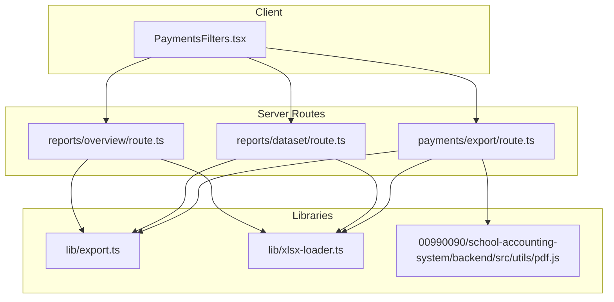
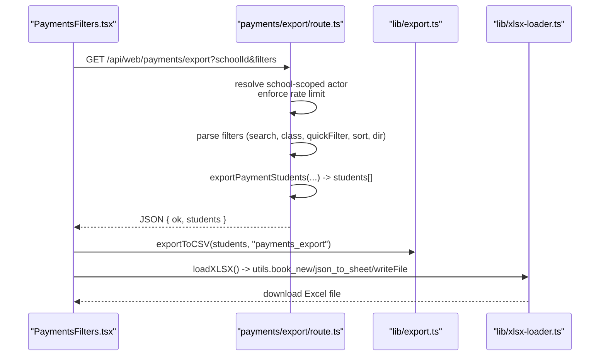
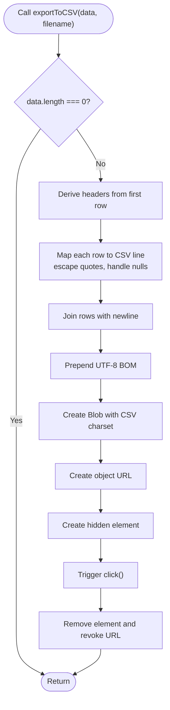
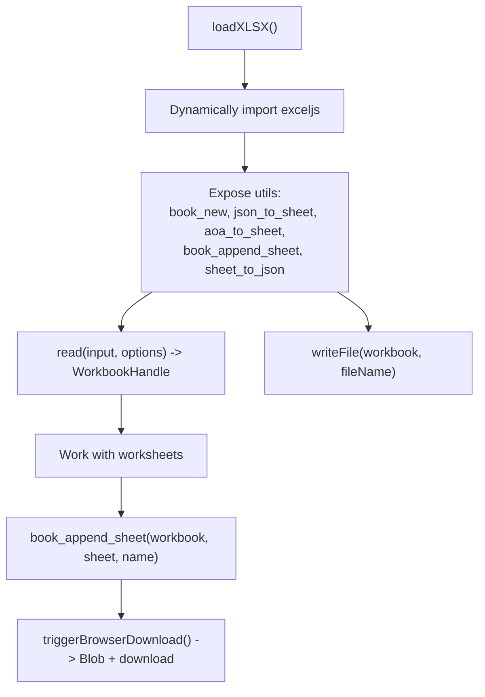
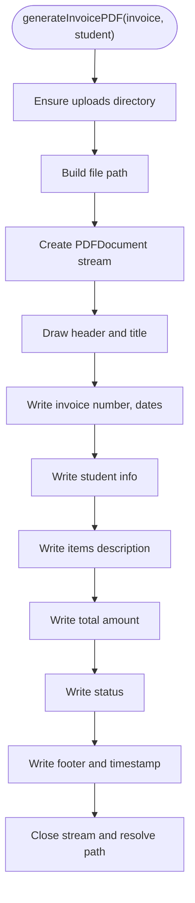
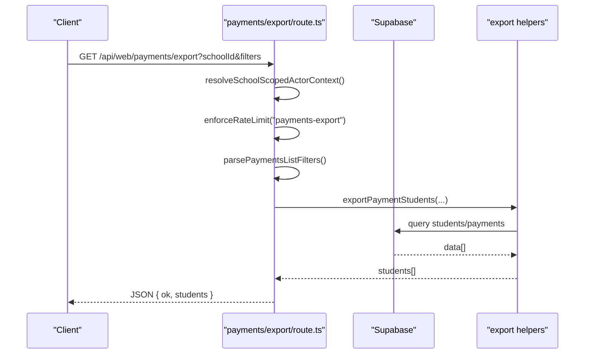
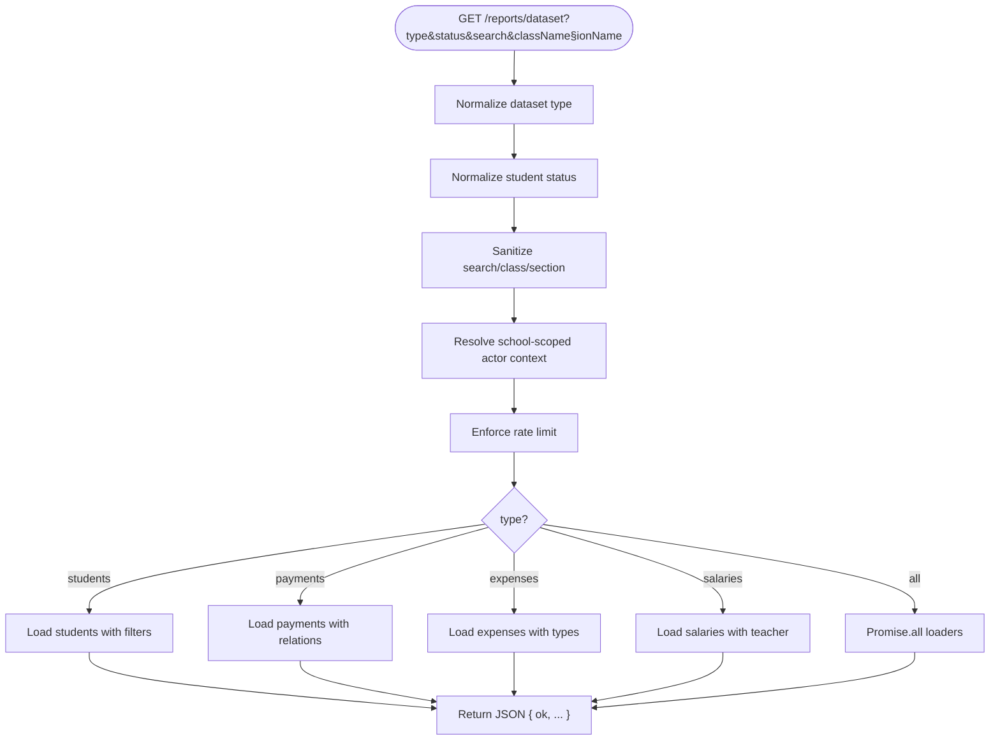
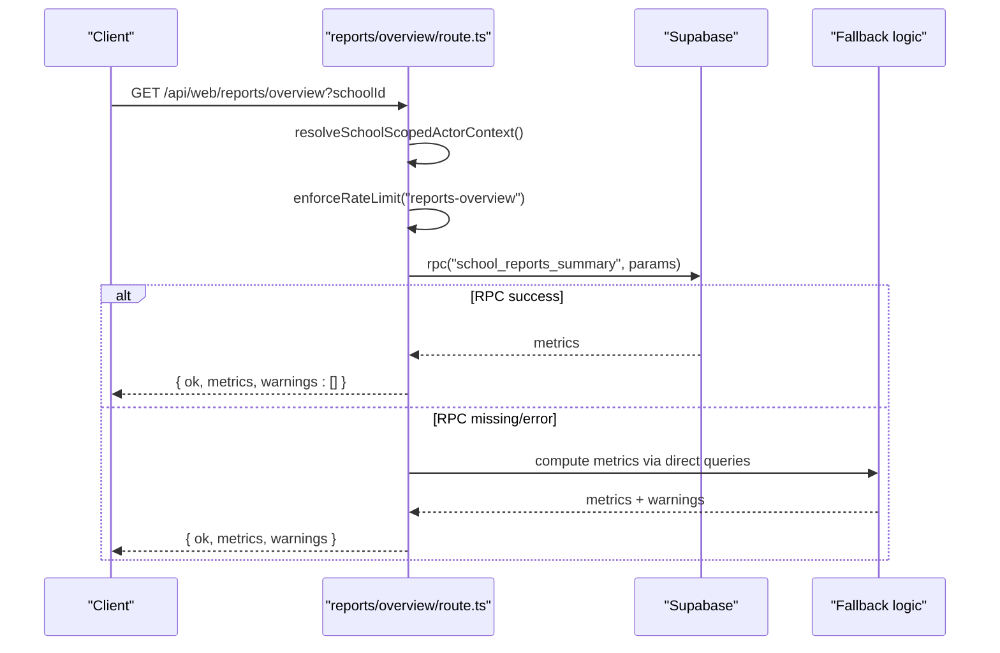
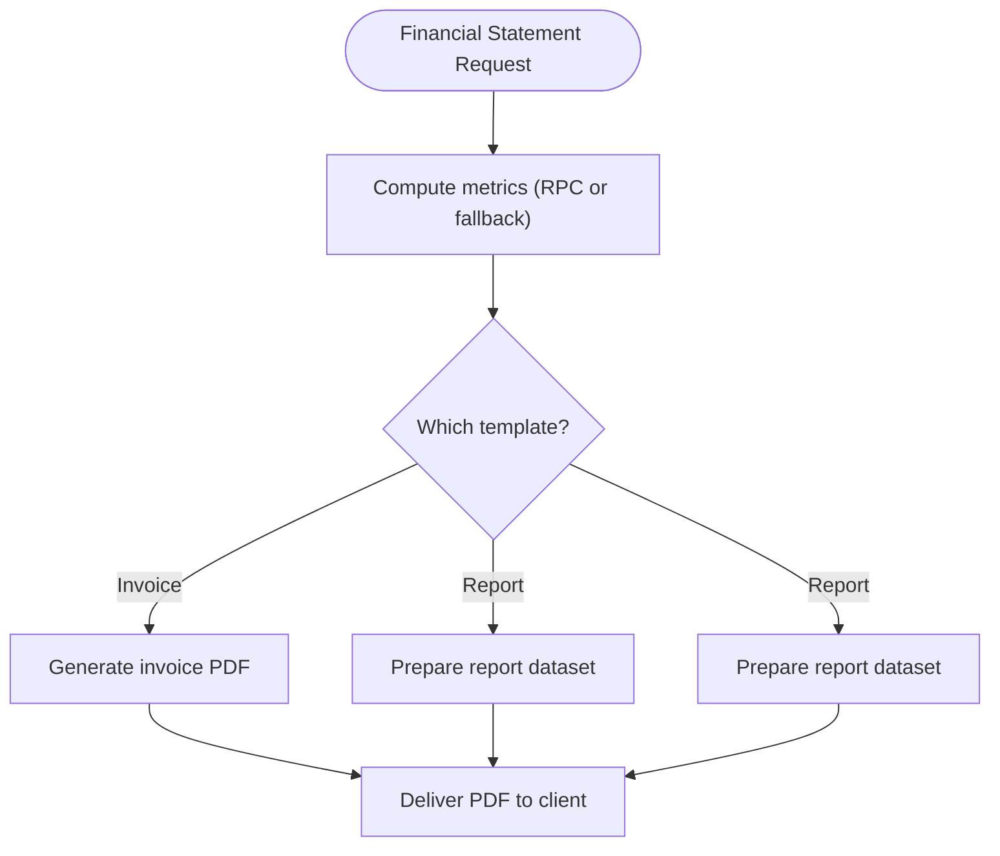
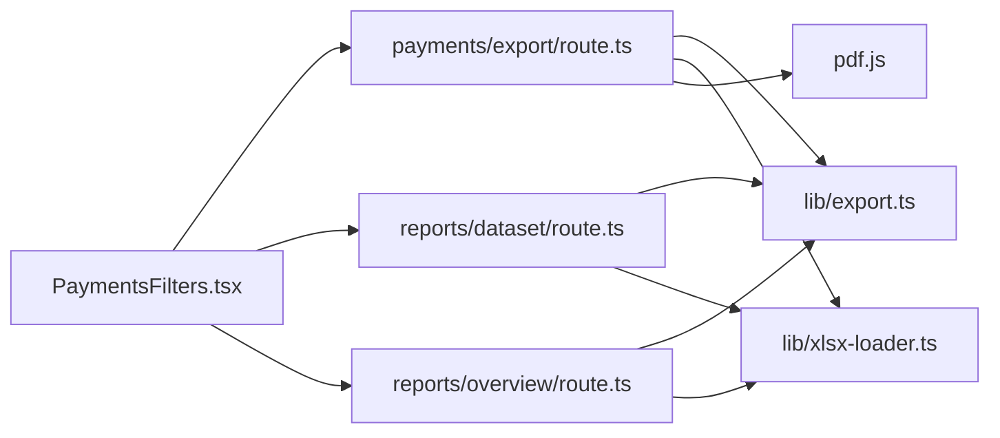

# Export Functionality

<cite>
**Referenced Files in This Document**
- [lib/export.ts](file://lib/export.ts)
- [lib/xlsx-loader.ts](file://lib/xlsx-loader.ts)
- [00990090/school-accounting-system/backend/src/utils/pdf.js](file://00990090/school-accounting-system/backend/src/utils/pdf.js)
- [app/api/web/payments/export/route.ts](file://app/api/web/payments/export/route.ts)
- [app/api/web/reports/dataset/route.ts](file://app/api/web/reports/dataset/route.ts)
- [app/api/web/reports/overview/route.ts](file://app/api/web/reports/overview/route.ts)
- [app/[locale]/payments/_components/PaymentsFilters.tsx](file://app/[locale]/payments/_components/PaymentsFilters.tsx)
</cite>

## Table of Contents
1. [Introduction](#introduction)
2. [Project Structure](#project-structure)
3. [Core Components](#core-components)
4. [Architecture Overview](#architecture-overview)
5. [Detailed Component Analysis](#detailed-component-analysis)
6. [Dependency Analysis](#dependency-analysis)
7. [Performance Considerations](#performance-considerations)
8. [Troubleshooting Guide](#troubleshooting-guide)
9. [Conclusion](#conclusion)
10. [Appendices](#appendices)

## Introduction
This document describes the financial export system, focusing on supported export formats, filtering and selection mechanisms, report customization, print branding, invoice templates, and financial statement generation. It also documents endpoint implementations, batch processing patterns, file generation workflows, security and access controls, audit logging considerations, performance optimization strategies, and scheduling approaches for large datasets.

## Project Structure
The export functionality spans client-side UI components, server-side API routes, and reusable libraries for CSV, Excel, and PDF generation. Key areas:
- Client UI triggers exports and passes filters to server endpoints.
- Server routes validate roles, enforce rate limits, apply filters, and return datasets.
- Libraries provide CSV, Excel, and PDF generation utilities.

**Diagram sources**
- [app/[locale]/payments/_components/PaymentsFilters.tsx](file://app/[locale]/payments/_components/PaymentsFilters.tsx)
- [app/api/web/payments/export/route.ts](file://app/api/web/payments/export/route.ts)
- [app/api/web/reports/dataset/route.ts](file://app/api/web/reports/dataset/route.ts)
- [app/api/web/reports/overview/route.ts](file://app/api/web/reports/overview/route.ts)
- [lib/export.ts](file://lib/export.ts)
- [lib/xlsx-loader.ts](file://lib/xlsx-loader.ts)
- [00990090/school-accounting-system/backend/src/utils/pdf.js](file://00990090/school-accounting-system/backend/src/utils/pdf.js)

**Section sources**
- [app/[locale]/payments/_components/PaymentsFilters.tsx](file://app/[locale]/payments/_components/PaymentsFilters.tsx)
- [app/api/web/payments/export/route.ts](file://app/api/web/payments/export/route.ts)
- [app/api/web/reports/dataset/route.ts](file://app/api/web/reports/dataset/route.ts)
- [app/api/web/reports/overview/route.ts](file://app/api/web/reports/overview/route.ts)
- [lib/export.ts](file://lib/export.ts)
- [lib/xlsx-loader.ts](file://lib/xlsx-loader.ts)
- [00990090/school-accounting-system/backend/src/utils/pdf.js](file://00990090/school-accounting-system/backend/src/utils/pdf.js)

## Core Components
- CSV export utility: generates downloadable CSV files from arrays of objects.
- Excel loader: loads, transforms, and writes Excel workbooks via browser-compatible APIs.
- PDF generator: produces invoice PDFs using a PDF toolkit.
- Payments export route: resolves school-scoped actor context, enforces rate limits, parses filters, and returns filtered student/payment datasets.
- Reports dataset route: returns normalized datasets for students, payments, expenses, and salaries with configurable filters.
- Reports overview route: computes financial summaries with primary and fallback computation paths.

**Section sources**
- [lib/export.ts](file://lib/export.ts)
- [lib/xlsx-loader.ts](file://lib/xlsx-loader.ts)
- [00990090/school-accounting-system/backend/src/utils/pdf.js](file://00990090/school-accounting-system/backend/src/utils/pdf.js)
- [app/api/web/payments/export/route.ts](file://app/api/web/payments/export/route.ts)
- [app/api/web/reports/dataset/route.ts](file://app/api/web/reports/dataset/route.ts)
- [app/api/web/reports/overview/route.ts](file://app/api/web/reports/overview/route.ts)

## Architecture Overview
The export pipeline integrates UI-driven filters with server-side data retrieval and library-based file generation. The client initiates exports, the server validates access and applies filters, and the response is transformed into CSV, Excel, or PDF depending on the chosen format.

**Diagram sources**
- [app/[locale]/payments/_components/PaymentsFilters.tsx](file://app/[locale]/payments/_components/PaymentsFilters.tsx)
- [app/api/web/payments/export/route.ts](file://app/api/web/payments/export/route.ts)
- [lib/export.ts](file://lib/export.ts)
- [lib/xlsx-loader.ts](file://lib/xlsx-loader.ts)

## Detailed Component Analysis

### CSV Export Utility
- Purpose: Convert an array of objects into a CSV string and trigger a browser download.
- Behavior:
  - Derives headers from the first row keys.
  - Escapes quotes and handles null/undefined values.
  - Prepends UTF-8 BOM and sets appropriate MIME type.
  - Creates a Blob, object URL, and simulates a click to download.

**Diagram sources**
- [lib/export.ts](file://lib/export.ts)

**Section sources**
- [lib/export.ts](file://lib/export.ts)

### Excel Loader (xlsx-loader)
- Purpose: Provide a browser-friendly interface to create, populate, and download Excel workbooks.
- Key capabilities:
  - Create workbook and worksheets.
  - Normalize mixed data formats (JSON rows, AoA).
  - Convert worksheets to JSON with optional default values.
  - Read existing workbooks and write buffers for downloads.
  - Trigger browser downloads via Blob and object URLs.

**Diagram sources**
- [lib/xlsx-loader.ts](file://lib/xlsx-loader.ts)

**Section sources**
- [lib/xlsx-loader.ts](file://lib/xlsx-loader.ts)

### PDF Generator (Invoice)
- Purpose: Generate invoice PDFs for student billing.
- Behavior:
  - Ensures upload directory exists.
  - Writes invoice metadata, student info, items description, totals, and status.
  - Streams PDF to a file and resolves the file path upon completion.

**Diagram sources**
- [00990090/school-accounting-system/backend/src/utils/pdf.js](file://00990090/school-accounting-system/backend/src/utils/pdf.js)

**Section sources**
- [00990090/school-accounting-system/backend/src/utils/pdf.js](file://00990090/school-accounting-system/backend/src/utils/pdf.js)

### Payments Export Endpoint
- Access control: Resolves school-scoped actor context and restricts to allowed roles.
- Rate limiting: Enforces per-user limits for the export namespace.
- Filtering: Parses search, class, quickFilter, sort, and direction parameters.
- Output: Returns a JSON payload containing filtered student/payment datasets suitable for downstream CSV/XLSX generation.

**Diagram sources**
- [app/api/web/payments/export/route.ts](file://app/api/web/payments/export/route.ts)

**Section sources**
- [app/api/web/payments/export/route.ts](file://app/api/web/payments/export/route.ts)

### Reports Dataset Endpoint
- Access control: Restricts to allowed roles and validates school scope.
- Rate limiting: Per-user limits for dataset reports.
- Filtering:
  - Dataset type normalization ("students", "payments", "expenses", "salaries", "all").
  - Student status normalization ("active", "transferred", "suspended", "deleted").
  - Search, class, and section filters with sanitization.
- Output: Returns requested dataset(s) with relations normalized to single values.

**Diagram sources**
- [app/api/web/reports/dataset/route.ts](file://app/api/web/reports/dataset/route.ts)

**Section sources**
- [app/api/web/reports/dataset/route.ts](file://app/api/web/reports/dataset/route.ts)

### Reports Overview Endpoint
- Access control: School-scoped actor resolution with allowed roles.
- Rate limiting: Per-user limits for overview reports.
- Metrics computation:
  - Primary: Calls a stored RPC function for aggregated metrics.
  - Fallback: Computes metrics via direct queries if the RPC is unavailable.
- Output: Returns metrics and warnings indicating fallback usage.

**Diagram sources**
- [app/api/web/reports/overview/route.ts](file://app/api/web/reports/overview/route.ts)

**Section sources**
- [app/api/web/reports/overview/route.ts](file://app/api/web/reports/overview/route.ts)

### Print Branding and Financial Statement Generation
- Print branding: The PDF generator embeds a standardized header and footer; branding can be extended by modifying the header/footer drawing routines.
- Invoice template: The PDF utility constructs a structured invoice with invoice metadata, student details, items description, totals, and status.
- Financial statements: The overview endpoint aggregates counts, volumes, balances, and net positions across students, payments, expenses, and salaries.

**Diagram sources**
- [app/api/web/reports/overview/route.ts](file://app/api/web/reports/overview/route.ts)
- [00990090/school-accounting-system/backend/src/utils/pdf.js](file://00990090/school-accounting-system/backend/src/utils/pdf.js)
- [lib/export.ts](file://lib/export.ts)
- [lib/xlsx-loader.ts](file://lib/xlsx-loader.ts)

**Section sources**
- [app/api/web/reports/overview/route.ts](file://app/api/web/reports/overview/route.ts)
- [00990090/school-accounting-system/backend/src/utils/pdf.js](file://00990090/school-accounting-system/backend/src/utils/pdf.js)
- [lib/export.ts](file://lib/export.ts)
- [lib/xlsx-loader.ts](file://lib/xlsx-loader.ts)

## Dependency Analysis
- Client-to-server:
  - PaymentsFilters triggers export endpoints and delegates file generation to libraries.
- Server-to-database:
  - Reports endpoints query students, payments, expenses, and salaries with filters and joins.
- Server-to-library:
  - Export endpoints rely on CSV and Excel utilities for file generation.
  - PDF generation is encapsulated in a dedicated utility.

**Diagram sources**
- [app/[locale]/payments/_components/PaymentsFilters.tsx](file://app/[locale]/payments/_components/PaymentsFilters.tsx)
- [app/api/web/payments/export/route.ts](file://app/api/web/payments/export/route.ts)
- [app/api/web/reports/dataset/route.ts](file://app/api/web/reports/dataset/route.ts)
- [app/api/web/reports/overview/route.ts](file://app/api/web/reports/overview/route.ts)
- [lib/export.ts](file://lib/export.ts)
- [lib/xlsx-loader.ts](file://lib/xlsx-loader.ts)
- [00990090/school-accounting-system/backend/src/utils/pdf.js](file://00990090/school-accounting-system/backend/src/utils/pdf.js)

**Section sources**
- [app/[locale]/payments/_components/PaymentsFilters.tsx](file://app/[locale]/payments/_components/PaymentsFilters.tsx)
- [app/api/web/payments/export/route.ts](file://app/api/web/payments/export/route.ts)
- [app/api/web/reports/dataset/route.ts](file://app/api/web/reports/dataset/route.ts)
- [app/api/web/reports/overview/route.ts](file://app/api/web/reports/overview/route.ts)
- [lib/export.ts](file://lib/export.ts)
- [lib/xlsx-loader.ts](file://lib/xlsx-loader.ts)
- [00990090/school-accounting-system/backend/src/utils/pdf.js](file://00990090/school-accounting-system/backend/src/utils/pdf.js)

## Performance Considerations
- Batch processing:
  - Use the reports dataset endpoint to fetch consolidated datasets in parallel for multiple entities.
  - Apply server-side filters to reduce payload sizes before client-side transformations.
- Large dataset handling:
  - Prefer pagination or chunked processing on the client when converting to CSV/XLSX.
  - Use streaming where possible; for PDFs, write directly to streams to avoid memory spikes.
- Export scheduling:
  - Offload heavy computations to background jobs (e.g., queue workers) and notify users via email or in-app notifications.
- Caching:
  - The overview endpoint sets cache-control headers to prevent caching; keep datasets endpoints private and short-lived.
- Rate limiting:
  - Enforced per-user windows to prevent abuse; tune thresholds based on workload.

[No sources needed since this section provides general guidance]

## Troubleshooting Guide
- Access denied:
  - Ensure the requesting user belongs to the correct school and holds an allowed role.
- Rate limit exceeded:
  - Reduce frequency of requests or increase thresholds for trusted users.
- Missing RPC function:
  - The overview endpoint falls back to direct queries if the summary function is unavailable; verify migration status.
- Export failures:
  - Verify that the dataset endpoint returns data; check filters and search terms.
  - For PDFs, confirm the upload directory is writable.

**Section sources**
- [app/api/web/reports/overview/route.ts](file://app/api/web/reports/overview/route.ts)
- [app/api/web/payments/export/route.ts](file://app/api/web/payments/export/route.ts)
- [app/api/web/reports/dataset/route.ts](file://app/api/web/reports/dataset/route.ts)
- [00990090/school-accounting-system/backend/src/utils/pdf.js](file://00990090/school-accounting-system/backend/src/utils/pdf.js)

## Conclusion
The export system combines robust server-side filtering, role-based access control, and rate limiting with flexible client-side file generation. CSV and Excel utilities enable fast, scalable exports, while the PDF generator supports invoice creation. The reports endpoints provide both aggregated summaries and raw datasets for further processing. With proper scheduling and performance tuning, the system can handle large-scale financial exports reliably.

[No sources needed since this section summarizes without analyzing specific files]

## Appendices

### Supported Export Formats and Capabilities
- CSV: Direct conversion of arrays to CSV with escaping and BOM.
- Excel: Workbook creation, sheet population, and browser-triggered downloads.
- PDF: Invoice generation with standardized sections and metadata.

**Section sources**
- [lib/export.ts](file://lib/export.ts)
- [lib/xlsx-loader.ts](file://lib/xlsx-loader.ts)
- [00990090/school-accounting-system/backend/src/utils/pdf.js](file://00990090/school-accounting-system/backend/src/utils/pdf.js)

### Export Data Filtering and Selection
- Payments export:
  - Filters: search, class, quickFilter, sort, direction.
  - Output: student/payment records suitable for CSV/XLSX.
- Reports dataset:
  - Filters: dataset type, student status, search, class, section.
  - Output: normalized datasets for students, payments, expenses, salaries.

**Section sources**
- [app/api/web/payments/export/route.ts](file://app/api/web/payments/export/route.ts)
- [app/api/web/reports/dataset/route.ts](file://app/api/web/reports/dataset/route.ts)

### Report Customization Options
- Choose dataset type ("students", "payments", "expenses", "salaries", "all").
- Filter by student status, search terms, class, and section.
- Customize sorting and direction for payment lists.

**Section sources**
- [app/api/web/reports/dataset/route.ts](file://app/api/web/reports/dataset/route.ts)
- [app/api/web/payments/export/route.ts](file://app/api/web/payments/export/route.ts)

### Print Branding and Invoice Templates
- Header/Footer branding and standardized sections.
- Invoice metadata, student details, items description, totals, and status.

**Section sources**
- [00990090/school-accounting-system/backend/src/utils/pdf.js](file://00990090/school-accounting-system/backend/src/utils/pdf.js)

### Implementation Examples
- Export endpoint invocation:
  - Payments export: GET /api/web/payments/export?schoolId&filters
  - Reports dataset: GET /api/web/reports/dataset?type=students&status=active&search=john
  - Reports overview: GET /api/web/reports/overview?schoolId
- Client-side export:
  - Use CSV utility to download filtered datasets.
  - Use Excel loader to create and download workbooks.

**Section sources**
- [app/api/web/payments/export/route.ts](file://app/api/web/payments/export/route.ts)
- [app/api/web/reports/dataset/route.ts](file://app/api/web/reports/dataset/route.ts)
- [app/api/web/reports/overview/route.ts](file://app/api/web/reports/overview/route.ts)
- [lib/export.ts](file://lib/export.ts)
- [lib/xlsx-loader.ts](file://lib/xlsx-loader.ts)

### Security Measures, Access Controls, and Audit Logging
- Access control:
  - School-scoped actor resolution ensures users operate within their institution.
  - Allowed roles enforced per endpoint.
- Rate limiting:
  - Per-user windows to throttle export requests.
- Audit logging:
  - Recommended: log export requests (identifier, filters, timestamps) for compliance and monitoring.

**Section sources**
- [app/api/web/payments/export/route.ts](file://app/api/web/payments/export/route.ts)
- [app/api/web/reports/dataset/route.ts](file://app/api/web/reports/dataset/route.ts)
- [app/api/web/reports/overview/route.ts](file://app/api/web/reports/overview/route.ts)

### Export Performance Optimization and Scheduling
- Optimize:
  - Server-side filtering, parallel dataset loading, and streaming outputs.
- Schedule:
  - Queue background jobs for large exports; notify users upon completion.

[No sources needed since this section provides general guidance]