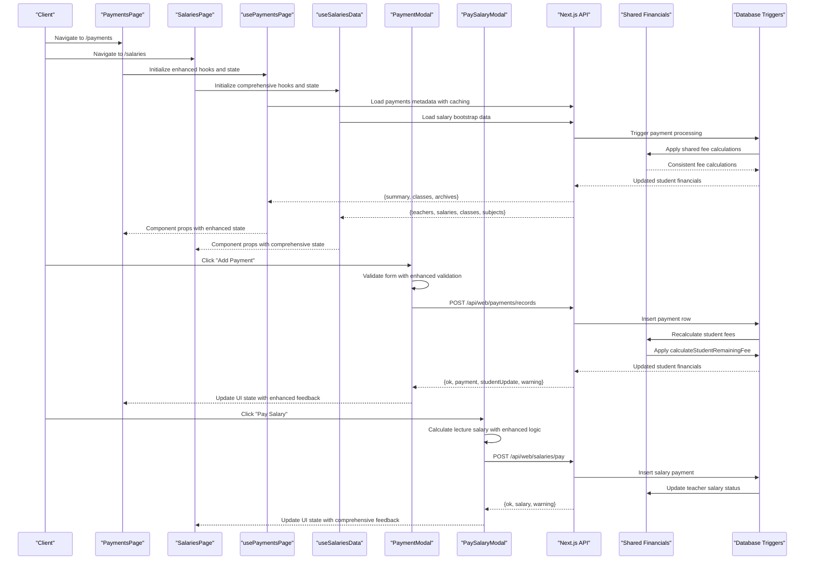
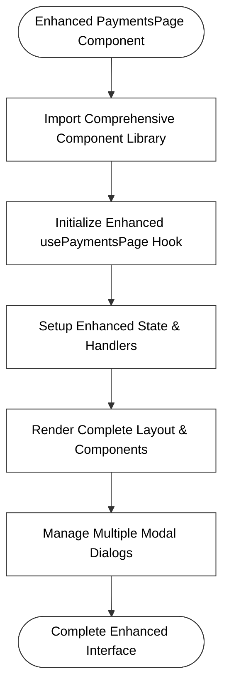
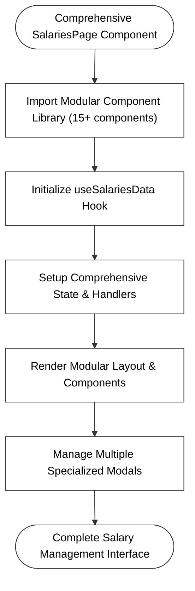
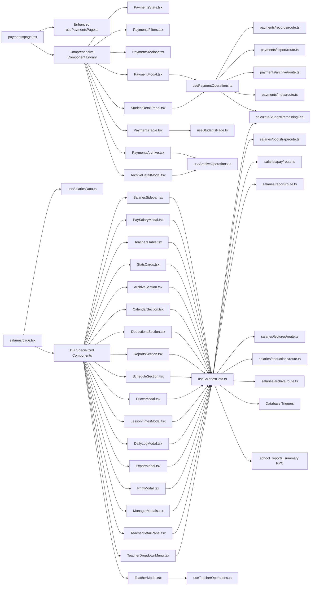

# Financial Operations

<cite>
**Referenced Files in This Document**
- [route.ts](file://app/api/web/payments/overview/route.ts)
- [route.ts](file://app/api/web/payments/records/route.ts)
- [route.ts](file://app/api/web/payments/export/route.ts)
- [route.ts](file://app/api/web/payments/archive/route.ts)
- [route.ts](file://app/api/web/payments/meta/route.ts)
- [route.ts](file://app/api/web/reports/overview/route.ts)
- [route.ts](file://app/api/web/reports/dataset/route.ts)
- [payments-server.ts](file://lib/payments-server.ts)
- [payments-overview.ts](file://lib/payments-overview.ts)
- [financials.ts](file://lib/students/financials.ts)
- [overview.ts](file://lib/students/overview.ts)
- [page.tsx](file://app/[locale]/payments/page.tsx)
- [PaymentModal.tsx](file://app/[locale]/payments/_components/PaymentModal.tsx)
- [PaymentsTable.tsx](file://app/[locale]/payments/_components/PaymentsTable.tsx)
- [PaymentsToolbar.tsx](file://app/[locale]/payments/_components/PaymentsToolbar.tsx)
- [PaymentsStats.tsx](file://app/[locale]/payments/_components/PaymentsStats.tsx)
- [PaymentsFilters.tsx](file://app/[locale]/payments/_components/PaymentsFilters.tsx)
- [StudentDetailPanel.tsx](file://app/[locale]/payments/_components/StudentDetailPanel.tsx)
- [PaymentsArchive.tsx](file://app/[locale]/payments/_components/PaymentsArchive.tsx)
- [ArchiveDetailModal.tsx](file://app/[locale]/payments/_components/ArchiveDetailModal.tsx)
- [usePaymentsPage.ts](file://app/[locale]/payments/_hooks/usePaymentsPage.ts)
- [usePaymentOperations.ts](file://app/[locale]/payments/_hooks/usePaymentOperations.ts)
- [useArchiveOperations.ts](file://app/[locale]/payments/_hooks/useArchiveOperations.ts)
- [usePaymentsMeta.ts](file://app/[locale]/payments/_hooks/usePaymentsMeta.ts)
- [useStudentsPage.ts](file://app/[locale]/payments/_hooks/useStudentsPage.ts)
- [_types.ts](file://app/[locale]/payments/_types.ts)
- [page.tsx](file://app/[locale]/salaries/page.tsx)
- [useSalariesData.ts](file://app/[locale]/salaries/_hooks/useSalariesData.ts)
- [useTeacherOperations.ts](file://app/[locale]/salaries/_hooks/useTeacherOperations.ts)
- [usePrintFunctions.ts](file://app/[locale]/salaries/_hooks/usePrintFunctions.ts)
- [SalariesSidebar.tsx](file://app/[locale]/salaries/_components/SalariesSidebar.tsx)
- [StatsCards.tsx](file://app/[locale]/salaries/_components/StatsCards.tsx)
- [TeachersTable.tsx](file://app/[locale]/salaries/_components/TeachersTable.tsx)
- [ArchiveSection.tsx](file://app/[locale]/salaries/_components/ArchiveSection.tsx)
- [CalendarSection.tsx](file://app/[locale]/salaries/_components/CalendarSection.tsx)
- [_types.ts](file://app/[locale]/salaries/_types.ts)
- [20260403_000000_payment_consistency_and_salary_uniqueness.sql](file://migrations/20260403_000000_payment_consistency_and_salary_uniqueness.sql)
- [20260326_000000_reports_summary_function.sql](file://migrations/20260326_000000_reports_summary_function.sql)
</cite>

## Update Summary
**Changes Made**
- Added comprehensive documentation for the new shared financial logic (student financials) that standardizes fee calculations across all API endpoints and reporting modules
- Documented the new `calculateStudentRemainingFee` function and its integration into the payment processing workflow
- Updated payment processing workflow to include database-level consistency checks and trigger-based calculations
- Enhanced financial reporting system to leverage shared logic for consistent fee calculations
- Added documentation for the new database triggers that automatically maintain student financial consistency
- Expanded payment operations to include robust error handling and consistency validation

## Table of Contents
1. [Introduction](#introduction)
2. [Project Structure](#project-structure)
3. [Core Components](#core-components)
4. [Architecture Overview](#architecture-overview)
5. [Detailed Component Analysis](#detailed-component-analysis)
6. [Enhanced Payment Operations](#enhanced-payment-operations)
7. [Shared Financial Logic System](#shared-financial-logic-system)
8. [Database-Level Consistency](#database-level-consistency)
9. [Salary Management System](#salary-management-system)
10. [Archive Management System](#archive-management-system)
11. [Dependency Analysis](#dependency-analysis)
12. [Performance Considerations](#performance-considerations)
13. [Troubleshooting Guide](#troubleshooting-guide)
14. [Conclusion](#conclusion)
15. [Appendices](#appendices)

## Introduction
This document explains the financial operations system for payment processing, expense management, financial reporting, and salary management. It covers invoice generation, payment collection, reconciliation, dashboards for revenue tracking, expense monitoring, cash flow analysis, and comprehensive salary processing workflows. The system now includes sophisticated features for teacher management, monthly archive functionality, calendar-based lecture scheduling, and detailed reporting capabilities. The system has been significantly enhanced with new shared financial logic that standardizes fee calculations across all API endpoints and reporting modules, ensuring consistency and reliability in financial computations.

**Updated** The financial operations system has been enhanced with a new shared financial logic layer that provides standardized fee calculations across all API endpoints and reporting modules, ensuring consistency and reliability in financial computations.

## Project Structure
The financial domain is implemented as a set of Next.js API routes under app/api/web, backed by Supabase queries and server-side helpers. The system now includes two primary modules: payments management and salary management, each with comprehensive component libraries, centralized hooks, and enhanced operational capabilities. A new shared financial logic layer provides standardized calculations across all components.

**Updated** The financial operations system now encompasses two major modules with comprehensive architectural redesign and a new shared financial logic layer:

```mermaid
graph TB
subgraph "Shared Financial Logic Layer"
FINANCIALS["lib/students/financials.ts<br/>(17 lines)<br/>calculateStudentRemainingFee"]
TRIGGERS["Database Triggers<br/>recompute_student_payment_totals<br/>sync_student_payment_totals_from_payments"]
END
subgraph "Payments Module"
P_MAIN["app/[locale]/payments/page.tsx<br/>(200 lines)"]
P_HOOKS["usePaymentsPage.ts<br/>(317 lines)"]
P_TYPES["_types.ts<br/>(91 lines)"]
end
subgraph "Salary Management Module"
S_MAIN["app/[locale]/salaries/page.tsx<br>(706 lines)"]
S_HOOKS["useSalariesData.ts<br/>(398 lines)"]
S_TYPES["_types.ts<br/>(278 lines)"]
end
subgraph "Core Components Library"
COMP_STATS["PaymentsStats.tsx"]
COMP_FILTERS["PaymentsFilters.tsx"]
COMP_TOOLBAR["PaymentsToolbar.tsx"]
COMP_TABLE["PaymentsTable.tsx"]
COMP_MODAL["PaymentModal.tsx"]
COMP_DETAIL["StudentDetailPanel.tsx"]
COMP_ARCHIVE["PaymentsArchive.tsx"]
COMP_ARCH_DETAIL["ArchiveDetailModal.tsx"]
end
subgraph "Enhanced Salary Components"
S_STATS["StatsCards.tsx"]
S_TABLE["TeachersTable.tsx"]
S_SIDEBAR["SalariesSidebar.tsx"]
S_ARCHIVE["ArchiveSection.tsx"]
S_CALENDAR["CalendarSection.tsx"]
S_DEDUCTIONS["DeductionsSection.tsx"]
S_REPORTS["ReportsSection.tsx"]
S_SCHEDULE["ScheduleSection.tsx"]
S_PRICES["PricesModal.tsx"]
S_LESSON_TIMES["LessonTimesModal.tsx"]
S_DAILY_LOG["DailyLogModal.tsx"]
S_EXPORT["ExportModal.tsx"]
S_PRINT["PrintModal.tsx"]
S_MANAGER["ManagerModals.tsx"]
S_PAY["PaySalaryModal.tsx"]
S_DETAIL["TeacherDetailPanel.tsx"]
S_DROPDOWN["TeacherDropdownMenu.tsx"]
S_TEACHER["TeacherModal.tsx"]
end
subgraph "Enhanced Hooks"
HOOK_PAYMENTS["usePaymentOperations.ts<br/>(349 lines)"]
HOOK_ARCHIVE["useArchiveOperations.ts<br/>(114 lines)"]
HOOK_META["usePaymentsMeta.ts<br/>(133 lines)"]
HOOK_STUDENTS["useStudentsPage.ts<br/>(134 lines)"]
HOOK_SALARIES["useSalariesData.ts<br/>(398 lines)"]
HOOK_TEACHER["useTeacherOperations.ts<br/>(219 lines)"]
HOOK_PRINT["usePrintFunctions.ts<br/>(85 lines)"]
end
subgraph "API Routes"
API_OVERVIEW["/api/web/payments/overview"]
API_RECORDS["/api/web/payments/records"]
API_EXPORT["/api/web/payments/export"]
API_ARCHIVE["/api/web/payments/archive"]
API_META["/api/web/payments/meta"]
API_SALARY_BOOTSTRAP["/api/web/salaries/bootstrap"]
API_SALARY_PAY["/api/web/salaries/pay"]
API_SALARY_REPORT["/api/web/salaries/report"]
API_SALARY_LECTURES["/api/web/salaries/lectures"]
API_SALARY_DEDUCTIONS["/api/web/salaries/deductions"]
API_SALARY_ARCHIVE["/api/web/salaries/archive"]
API_REPORTS_OVERVIEW["/api/web/reports/overview"]
API_DASHBOARD_OVERVIEW["/api/web/dashboard/overview"]
end
subgraph "Server Libraries"
LIB_SERVER["lib/payments-server.ts"]
LIB_OVERVIEW["lib/payments-overview.ts"]
LIB_STUDENTS_OVERVIEW["lib/students/overview.ts"]
END
```

**Diagram sources**
- [financials.ts](file://lib/students/financials.ts)
- [page.tsx](file://app/[locale]/payments/page.tsx)
- [usePaymentsPage.ts](file://app/[locale]/payments/_hooks/usePaymentsPage.ts)
- [page.tsx](file://app/[locale]/salaries/page.tsx)
- [useSalariesData.ts](file://app/[locale]/salaries/_hooks/useSalariesData.ts)
- [PaymentsStats.tsx](file://app/[locale]/payments/_components/PaymentsStats.tsx)
- [PaymentsFilters.tsx](file://app/[locale]/payments/_components/PaymentsFilters.tsx)
- [PaymentsToolbar.tsx](file://app/[locale]/payments/_components/PaymentsToolbar.tsx)
- [PaymentsTable.tsx](file://app/[locale]/payments/_components/PaymentsTable.tsx)
- [PaymentModal.tsx](file://app/[locale]/payments/_components/PaymentModal.tsx)
- [StudentDetailPanel.tsx](file://app/[locale]/payments/_components/StudentDetailPanel.tsx)
- [PaymentsArchive.tsx](file://app/[locale]/payments/_components/PaymentsArchive.tsx)
- [ArchiveDetailModal.tsx](file://app/[locale]/payments/_components/ArchiveDetailModal.tsx)
- [StatsCards.tsx](file://app/[locale]/salaries/_components/StatsCards.tsx)
- [TeachersTable.tsx](file://app/[locale]/salaries/_components/TeachersTable.tsx)
- [SalariesSidebar.tsx](file://app/[locale]/salaries/_components/SalariesSidebar.tsx)
- [ArchiveSection.tsx](file://app/[locale]/salaries/_components/ArchiveSection.tsx)
- [CalendarSection.tsx](file://app/[locale]/salaries/_components/CalendarSection.tsx)
- [DeductionsSection.tsx](file://app/[locale]/salaries/_components/DeductionsSection.tsx)
- [ReportsSection.tsx](file://app/[locale]/salaries/_components/ReportsSection.tsx)
- [ScheduleSection.tsx](file://app/[locale]/salaries/_components/ScheduleSection.tsx)
- [PricesModal.tsx](file://app/[locale]/salaries/_components/PricesModal.tsx)
- [LessonTimesModal.tsx](file://app/[locale]/salaries/_components/LessonTimesModal.tsx)
- [DailyLogModal.tsx](file://app/[locale]/salaries/_components/DailyLogModal.tsx)
- [ExportModal.tsx](file://app/[locale]/salaries/_components/ExportModal.tsx)
- [PrintModal.tsx](file://app/[locale]/salaries/_components/PrintModal.tsx)
- [ManagerModals.tsx](file://app/[locale]/salaries/_components/ManagerModals.tsx)
- [PaySalaryModal.tsx](file://app/[locale]/salaries/_components/PaySalaryModal.tsx)
- [TeacherDetailPanel.tsx](file://app/[locale]/salaries/_components/TeacherDetailPanel.tsx)
- [TeacherDropdownMenu.tsx](file://app/[locale]/salaries/_components/TeacherDropdownMenu.tsx)
- [TeacherModal.tsx](file://app/[locale]/salaries/_components/TeacherModal.tsx)
- [usePaymentOperations.ts](file://app/[locale]/payments/_hooks/usePaymentOperations.ts)
- [useArchiveOperations.ts](file://app/[locale]/payments/_hooks/useArchiveOperations.ts)
- [usePaymentsMeta.ts](file://app/[locale]/payments/_hooks/usePaymentsMeta.ts)
- [useStudentsPage.ts](file://app/[locale]/payments/_hooks/useStudentsPage.ts)
- [useSalariesData.ts](file://app/[locale]/salaries/_hooks/useSalariesData.ts)
- [useTeacherOperations.ts](file://app/[locale]/salaries/_hooks/useTeacherOperations.ts)
- [usePrintFunctions.ts](file://app/[locale]/salaries/_hooks/usePrintFunctions.ts)
- [route.ts](file://app/api/web/payments/overview/route.ts)
- [route.ts](file://app/api/web/payments/records/route.ts)
- [route.ts](file://app/api/web/payments/export/route.ts)
- [route.ts](file://app/api/web/payments/archive/route.ts)
- [route.ts](file://app/api/web/payments/meta/route.ts)
- [route.ts](file://app/api/web/salaries/bootstrap/route.ts)
- [route.ts](file://app/api/web/salaries/pay/route.ts)
- [route.ts](file://app/api/web/salaries/report/route.ts)
- [route.ts](file://app/api/web/salaries/lectures/route.ts)
- [route.ts](file://app/api/web/salaries/deductions/route.ts)
- [route.ts](file://app/api/web/salaries/archive/route.ts)
- [route.ts](file://app/api/web/reports/overview/route.ts)
- [route.ts](file://app/api/web/dashboard/overview/route.ts)
- [payments-server.ts](file://lib/payments-server.ts)
- [payments-overview.ts](file://lib/payments-overview.ts)
- [overview.ts](file://lib/students/overview.ts)

**Section sources**
- [page.tsx](file://app/[locale]/payments/page.tsx)
- [usePaymentsPage.ts](file://app/[locale]/payments/_hooks/usePaymentsPage.ts)
- [page.tsx](file://app/[locale]/salaries/page.tsx)
- [useSalariesData.ts](file://app/[locale]/salaries/_hooks/useSalariesData.ts)
- [route.ts](file://app/api/web/payments/overview/route.ts)
- [route.ts](file://app/api/web/payments/records/route.ts)
- [route.ts](file://app/api/web/payments/export/route.ts)
- [route.ts](file://app/api/web/payments/archive/route.ts)
- [route.ts](file://app/api/web/payments/meta/route.ts)
- [route.ts](file://app/api/web/salaries/bootstrap/route.ts)
- [route.ts](file://app/api/web/salaries/pay/route.ts)
- [route.ts](file://app/api/web/salaries/report/route.ts)
- [route.ts](file://app/api/web/salaries/lectures/route.ts)
- [route.ts](file://app/api/web/salaries/deductions/route.ts)
- [route.ts](file://app/api/web/salaries/archive/route.ts)
- [route.ts](file://app/api/web/reports/overview/route.ts)
- [route.ts](file://app/api/web/dashboard/overview/route.ts)
- [payments-server.ts](file://lib/payments-server.ts)
- [payments-overview.ts](file://lib/payments-overview.ts)
- [financials.ts](file://lib/students/financials.ts)
- [overview.ts](file://lib/students/overview.ts)

## Core Components
- **Payments Page Main**: Streamlined 200-line page orchestrating the entire payments interface with comprehensive component library.
- **Payment Modal**: Advanced modal component for creating new payments with student search, form validation, and receipt number generation.
- **Payments Stats**: Financial summary cards displaying total fees, payments, remaining amounts, and collection statistics.
- **Payments Filters**: Sophisticated filtering system with quick filters, class selection, sorting options, and export functionality.
- **Payments Toolbar**: Enhanced search interface with results counter for efficient student navigation.
- **Payments Table**: Comprehensive data table displaying student payment information with progress indicators, pagination, and action buttons.
- **Student Detail Panel**: Complete student view with payment history, financial summary, transaction management, and print functionality.
- **Payments Archive**: Advanced archive management with year selection, export functionality, and annual snapshot generation.
- **Archive Detail Modal**: Detailed archive view with comprehensive student and payment listings for annual snapshot inspection.
- **Centralized Hooks**: Enhanced hooks managing state, API operations, and business logic across all components with improved error handling.
- **Salary Management Main**: Comprehensive 706-line page orchestrating the complete salary management interface with modular component architecture.
- **Salary Stats Cards**: Financial summary cards displaying teacher counts, total base salaries, monthly payments, and unpaid teacher statistics.
- **Teachers Table**: Comprehensive data table displaying teacher information with salary status, payment actions, and detailed view options.
- **Salary Sidebar**: Navigation sidebar with sections for main dashboard, teacher management, schedule, deductions, reports, calendar, archive, and settings.
- **Monthly Archive Section**: Advanced archive management with archive creation, historical data display, and archive export functionality.
- **Calendar Section**: Interactive calendar for lecture scheduling with month navigation, date highlighting, and lecture visualization.
- **Deductions Section**: Comprehensive deduction tracking with teacher selection, amount input, notes, and deduction history.
- **Reports Section**: Detailed reporting system with summary and detailed views, teacher filtering, and print functionality.
- **Schedule Section**: Weekly schedule management with grade/section selection, grid editing, and schedule saving.
- **Enhanced Salary Components**: 15+ specialized components for teacher management, pricing, lesson times, daily logging, export, printing, and administrative functions.
- **Shared Financial Logic**: New standardized fee calculation system ensuring consistency across all API endpoints and reporting modules.

**Updated** The core components now include a comprehensive salary management module with sophisticated functionality and a new shared financial logic layer:

**Section sources**
- [page.tsx](file://app/[locale]/payments/page.tsx)
- [page.tsx](file://app/[locale]/salaries/page.tsx)
- [PaymentModal.tsx](file://app/[locale]/payments/_components/PaymentModal.tsx)
- [PaymentsStats.tsx](file://app/[locale]/payments/_components/PaymentsStats.tsx)
- [PaymentsFilters.tsx](file://app/[locale]/payments/_components/PaymentsFilters.tsx)
- [PaymentsToolbar.tsx](file://app/[locale]/payments/_components/PaymentsToolbar.tsx)
- [PaymentsTable.tsx](file://app/[locale]/payments/_components/PaymentsTable.tsx)
- [StudentDetailPanel.tsx](file://app/[locale]/payments/_components/StudentDetailPanel.tsx)
- [PaymentsArchive.tsx](file://app/[locale]/payments/_components/PaymentsArchive.tsx)
- [ArchiveDetailModal.tsx](file://app/[locale]/payments/_components/ArchiveDetailModal.tsx)
- [StatsCards.tsx](file://app/[locale]/salaries/_components/StatsCards.tsx)
- [TeachersTable.tsx](file://app/[locale]/salaries/_components/TeachersTable.tsx)
- [SalariesSidebar.tsx](file://app/[locale]/salaries/_components/SalariesSidebar.tsx)
- [ArchiveSection.tsx](file://app/[locale]/salaries/_components/ArchiveSection.tsx)
- [CalendarSection.tsx](file://app/[locale]/salaries/_components/CalendarSection.tsx)
- [DeductionsSection.tsx](file://app/[locale]/salaries/_components/DeductionsSection.tsx)
- [ReportsSection.tsx](file://app/[locale]/salaries/_components/ReportsSection.tsx)
- [ScheduleSection.tsx](file://app/[locale]/salaries/_components/ScheduleSection.tsx)
- [financials.ts](file://lib/students/financials.ts)

## Architecture Overview
The system integrates Next.js API routes with Supabase for data persistence and computation. The redesigned financial operations system now encompasses two major modules: payments management with comprehensive component library and salary management with sophisticated modular architecture. Payments are recorded against students and immediately reconciled to update balances. Salary management includes teacher creation/editing, monthly payment processing, lecture scheduling, deduction tracking, and comprehensive reporting. Reporting leverages dedicated RPCs for performance and falls back to client-side aggregation when unavailable. Export endpoints support CSV/XLSX downloads for accounting systems. The enhanced architecture includes comprehensive error handling, caching mechanisms, improved user experience through modal-based interactions, and seamless integration between payment and salary operations.

**Updated** The architecture now emphasizes dual-module design with comprehensive modularity, enhanced state management, improved user experience across both payment and salary operations, and a new shared financial logic layer that ensures consistency across all components:



**Diagram sources**
- [page.tsx](file://app/[locale]/payments/page.tsx)
- [page.tsx](file://app/[locale]/salaries/page.tsx)
- [usePaymentsPage.ts](file://app/[locale]/payments/_hooks/usePaymentsPage.ts)
- [useSalariesData.ts](file://app/[locale]/salaries/_hooks/useSalariesData.ts)
- [PaymentModal.tsx](file://app/[locale]/payments/_components/PaymentModal.tsx)
- [PaySalaryModal.tsx](file://app/[locale]/salaries/_components/PaySalaryModal.tsx)
- [route.ts](file://app/api/web/payments/records/route.ts)
- [route.ts](file://app/api/web/salaries/pay/route.ts)
- [financials.ts](file://lib/students/financials.ts)
- [20260403_000000_payment_consistency_and_salary_uniqueness.sql](file://migrations/20260403_000000_payment_consistency_and_salary_uniqueness.sql)

## Detailed Component Analysis

### Payments Page Main: Comprehensive Component Orchestration
**Updated** The main payments page has been streamlined from 1841 lines to 200 lines through comprehensive component extraction:

Purpose:
- Serve as the central orchestrator for the comprehensive payments interface
- Import and coordinate all extracted components from the _components directory
- Manage overall application state and user interactions with enhanced error handling
- Handle routing, permissions, and internationalization with improved user experience
- Coordinate between multiple specialized hooks for different aspects of payment management

Key behaviors:
- Imports comprehensive component library from the _components directory
- Uses ProtectedRoute for role-based access control with enhanced permissions
- Integrates with centralized hooks for state management with caching
- Manages multiple modal dialogs and confirmation dialogs with proper state isolation
- Handles school scope validation and empty states with improved user feedback
- Coordinates between payment operations, archive management, and student detail views



**Diagram sources**
- [page.tsx](file://app/[locale]/payments/page.tsx)

**Section sources**
- [page.tsx](file://app/[locale]/payments/page.tsx)

### Salary Management Main: Comprehensive Salary Operations Interface
**Updated** The main salaries page has been redesigned from a monolithic structure to a comprehensive modular architecture:

Purpose:
- Serve as the central orchestrator for the complete salary management interface
- Import and coordinate 15+ specialized components from the _components directory
- Manage comprehensive state for teacher management, salary processing, lecture scheduling, and reporting
- Handle role-based access control with enhanced permissions for salary operations
- Coordinate between multiple specialized hooks for different aspects of salary management

Key behaviors:
- Imports comprehensive component library including StatsCards, TeachersTable, SalariesSidebar, and 15+ specialized components
- Uses ProtectedRoute for role-based access control with enhanced permissions for salary management
- Integrates with useSalariesData hook for comprehensive state management with caching
- Manages multiple modal dialogs including TeacherModal, PaySalaryModal, DailyLogModal, and ExportModal
- Handles school scope validation and comprehensive error handling with improved user feedback
- Coordinates between teacher operations, salary processing, archive management, and reporting systems



**Diagram sources**
- [page.tsx](file://app/[locale]/salaries/page.tsx)

**Section sources**
- [page.tsx](file://app/[locale]/salaries/page.tsx)

### Payment Modal: Advanced Payment Creation Interface
Purpose:
- Provide a sophisticated interface for creating new payments with enhanced user experience
- Implement intelligent student search with dropdown suggestions and caching
- Validate payment form inputs with comprehensive error handling
- Generate automatic receipt numbers with enhanced formatting and manual override
- Support multiple payment methods with improved user interface

Key behaviors:
- Intelligent student search with debounced API calls and dropdown suggestions
- Comprehensive form validation for required fields with real-time feedback
- Automatic receipt number generation with enhanced formatting (REC-XXXX format)
- Payment method selection with improved user interface and validation
- Integration with parent component handlers with enhanced error propagation
- Manual receipt number override for special cases

**Section sources**
- [PaymentModal.tsx](file://app/[locale]/payments/_components/PaymentModal.tsx)

### Salary Stats Cards: Comprehensive Financial Overview
**Updated** Enhanced with comprehensive salary management metrics:

Purpose:
- Provide comprehensive financial overview cards for salary management
- Display teacher statistics, salary totals, monthly payment summaries, and unpaid teacher counts
- Enable quick access to salary management operations through visual indicators
- Support responsive design with enhanced styling and improved readability

Key behaviors:
- Active teacher count with enhanced badge styling and visual indicators
- Total base salaries calculation with improved formatting and currency display
- Monthly payment totals with enhanced progress indicators and visual feedback
- Unpaid teacher statistics with enhanced alert messaging and action prompts
- Responsive design with improved accessibility and user experience

**Section sources**
- [StatsCards.tsx](file://app/[locale]/salaries/_components/StatsCards.tsx)

### Teachers Table: Comprehensive Teacher Management Display
**Updated** Enhanced with comprehensive teacher management functionality:

Purpose:
- Display comprehensive teacher information in a sortable, paginated table
- Show teacher salary status with sophisticated visual indicators and enhanced styling
- Provide quick actions for salary payments, detailed views, and teacher management
- Support advanced pagination with improved user experience and teacher filtering

Key behaviors:
- Loading states with enhanced visual feedback and empty state handling
- Pagination with improved navigation controls and page size management
- Salary status indicators with sophisticated styling showing payment completion
- Action buttons with enhanced icons and tooltips for payment entry and detail viewing
- Responsive design with improved currency formatting and accessibility
- Enhanced sorting and filtering capabilities with improved user experience

**Section sources**
- [TeachersTable.tsx](file://app/[locale]/salaries/_components/TeachersTable.tsx)

### Salary Sidebar: Comprehensive Navigation Interface
**Updated** Enhanced with comprehensive navigation and quick access functionality:

Purpose:
- Provide comprehensive navigation for salary management sections
- Support quick access to main dashboard, teacher management, schedule, deductions, reports, calendar, archive, and settings
- Enable dynamic section loading with enhanced performance optimization
- Support conditional loading of reference data and archive data based on active section

Key behaviors:
- Section-based navigation with enhanced active state management
- Dynamic reference data loading with conditional API calls
- Archive data loading with enhanced caching and performance optimization
- Quick access to specialized modals and administrative functions
- Enhanced user experience with improved visual feedback and navigation cues

**Section sources**
- [SalariesSidebar.tsx](file://app/[locale]/salaries/_components/SalariesSidebar.tsx)

### Monthly Archive Section: Advanced Archive Management
**Updated** Enhanced with comprehensive archive functionality:

Purpose:
- Provide advanced archive management with archive creation and historical data display
- Generate annual archives of salary data and teacher snapshots with enhanced data integrity
- Support comprehensive archive viewing with detailed teacher and payment listings
- Enable archive export with improved Excel generation and enhanced formatting

Key behaviors:
- Archive creation with enhanced permission checking and data validation
- Archive confirmation dialog with enhanced user experience and safety measures
- Historical archive display with enhanced data organization and visual presentation
- Archive statistics with improved calculations and display formatting
- Archive detail inspection with comprehensive archive data visualization

**Section sources**
- [ArchiveSection.tsx](file://app/[locale]/salaries/_components/ArchiveSection.tsx)

### Calendar Section: Interactive Lecture Scheduling
**Updated** Enhanced with comprehensive calendar functionality:

Purpose:
- Provide interactive calendar interface for lecture scheduling and visualization
- Support month navigation with enhanced user experience and intuitive controls
- Display lecture dates with sophisticated visual indicators and enhanced styling
- Enable lecture date highlighting with improved user feedback and calendar integration

Key behaviors:
- Month navigation with enhanced prev/next controls and year adjustment
- Calendar grid generation with improved date calculation and rendering
- Lecture date highlighting with enhanced visual indicators and color coding
- Today's date marking with improved styling and user orientation
- Calendar legend with enhanced explanation and visual cues

**Section sources**
- [CalendarSection.tsx](file://app/[locale]/salaries/_components/CalendarSection.tsx)

### Enhanced Payment Operations
**Updated** The payment operations system has been comprehensively enhanced with improved state management and business logic:

#### usePaymentOperations: Comprehensive Payment Management
Purpose:
- Provide comprehensive state management for payment operations with enhanced functionality
- Handle complex payment creation, deletion, and management operations
- Coordinate between multiple components and API operations with improved error handling
- Manage student search, payment modal state, and payment history with enhanced caching

Key behaviors:
- Enhanced student search with debounced API calls and improved dropdown management
- Comprehensive payment modal state management with form validation and error handling
- Advanced payment creation with enhanced receipt number generation and branch resolution
- Improved payment deletion with enhanced confirmation dialogs and error handling
- Enhanced payment loading with caching and improved performance
- Comprehensive payment history management with enhanced state updates

#### useArchiveOperations: Advanced Archive Management
Purpose:
- Provide comprehensive state management for archive operations with enhanced functionality
- Handle complex archive creation, viewing, and export operations
- Coordinate between archive components and API operations with improved error handling
- Manage archive state, detail modal, and export operations with enhanced user experience

Key behaviors:
- Archive year selection with enhanced validation and state management
- Archive creation with enhanced permission checking and data validation
- Archive detail management with improved modal state and data handling
- Archive export with enhanced Excel generation and progress indication
- Enhanced archive operations with improved error handling and user feedback

#### usePaymentsMeta: Enhanced Metadata Management
Purpose:
- Provide comprehensive state management for payment metadata with enhanced caching
- Handle complex metadata loading, updating, and caching operations
- Coordinate between multiple components and API operations with improved performance
- Manage summary data, class options, payment years, and archive information with enhanced state management

Key behaviors:
- Enhanced metadata caching with improved cache invalidation and performance
- Comprehensive metadata loading with enhanced error handling and retry logic
- Enhanced summary data management with improved calculations and updates
- Archive management with enhanced state updates and notifications
- Payment year management with improved sorting and validation

#### useStudentsPage: Advanced Student Management
Purpose:
- Provide comprehensive state management for student data with enhanced caching
- Handle complex student loading, pagination, and filtering operations
- Coordinate between multiple components and API operations with improved performance
- Manage student data, payment counts, and pagination with enhanced state management

Key behaviors:
- Enhanced student data caching with improved cache keys and invalidation
- Comprehensive student loading with enhanced error handling and loading states
- Advanced pagination with improved page management and total count handling
- Enhanced payment count management with improved state updates
- Student financial updates with enhanced state synchronization

**Section sources**
- [usePaymentOperations.ts](file://app/[locale]/payments/_hooks/usePaymentOperations.ts)
- [useArchiveOperations.ts](file://app/[locale]/payments/_hooks/useArchiveOperations.ts)
- [usePaymentsMeta.ts](file://app/[locale]/payments/_hooks/usePaymentsMeta.ts)
- [useStudentsPage.ts](file://app/[locale]/payments/_hooks/useStudentsPage.ts)

### Salary Operations: Comprehensive Salary Management
**Updated** The salary management system includes comprehensive operations for teacher management and salary processing:

#### useSalariesData: Enhanced Salary Data Management
Purpose:
- Provide comprehensive state management for salary operations with enhanced caching
- Handle complex bootstrap data loading, teacher management, and salary processing operations
- Coordinate between multiple components and API operations with improved performance
- Manage comprehensive salary data including teachers, salaries, classes, subjects, and reporting

Key behaviors:
- Enhanced bootstrap data loading with improved scope-based loading (core, reference, archive)
- Comprehensive teacher data management with enhanced caching and state updates
- Salary processing with improved calculation logic and deduction handling
- Report generation with enhanced summary and detailed views
- Archive management with improved monthly archiving and historical data handling

#### useTeacherOperations: Advanced Teacher Management
Purpose:
- Provide comprehensive state management for teacher operations with enhanced functionality
- Handle complex teacher creation, editing, and management operations
- Coordinate between multiple components and API operations with improved error handling
- Manage teacher form state, validation, and API interactions with enhanced user experience

Key behaviors:
- Enhanced teacher form management with improved validation and state handling
- Comprehensive teacher CRUD operations with enhanced error handling and success feedback
- Teacher class assignment management with improved form handling and validation
- Teacher modal state management with enhanced user experience and form persistence
- Teacher reference data loading with improved caching and performance optimization

#### usePrintFunctions: Enhanced Printing Capabilities
Purpose:
- Provide comprehensive printing functionality for salary slips, reports, and teacher summaries
- Handle complex HTML generation, print window management, and branded print templates
- Support multiple print formats including salary slips, teacher statements, and comprehensive reports

Key behaviors:
- Enhanced print window management with improved branding and template handling
- Comprehensive salary slip printing with enhanced formatting and currency display
- Detailed report printing with improved table formatting and data visualization
- Teacher summary printing with enhanced table layouts and data organization
- Print template management with improved HTML generation and styling

**Section sources**
- [useSalariesData.ts](file://app/[locale]/salaries/_hooks/useSalariesData.ts)
- [useTeacherOperations.ts](file://app/[locale]/salaries/_hooks/useTeacherOperations.ts)
- [usePrintFunctions.ts](file://app/[locale]/salaries/_hooks/usePrintFunctions.ts)

## Enhanced Payment Operations
**Updated** The payment operations system has been comprehensively enhanced with improved state management and business logic, now integrated with the new shared financial logic layer:

### Payment Creation Workflow with Shared Financial Logic
The payment creation process now includes robust consistency checks and shared financial calculations:

1. **Payment Validation**: Enhanced form validation with comprehensive error handling
2. **Student Retrieval**: Fetch student data with paid_fee, total_fee, discount_value, and remaining_fee
3. **Payment Recording**: Insert payment record with automatic receipt number generation
4. **Financial Recalculation**: Apply shared financial logic to recalculate student totals
5. **Consistency Verification**: Database triggers ensure paid_fee and remaining_fee consistency
6. **Cache Invalidation**: Invalidate cached domains for dashboard, payments, and reports
7. **Response Generation**: Return updated student financials with enhanced error handling

### Database-Level Consistency Enforcement
The system now includes sophisticated database triggers that automatically maintain financial consistency:

- **recompute_student_payment_totals**: Calculates paid_fee from payment records and updates remaining_fee
- **sync_student_payment_totals_from_payments**: Trigger-based synchronization on payment insert/update/delete
- **Automatic Cleanup**: Removes duplicate salary records and ensures unique constraints

**Section sources**
- [usePaymentOperations.ts](file://app/[locale]/payments/_hooks/usePaymentOperations.ts)
- [useArchiveOperations.ts](file://app/[locale]/payments/_hooks/useArchiveOperations.ts)
- [usePaymentsMeta.ts](file://app/[locale]/payments/_hooks/usePaymentsMeta.ts)
- [useStudentsPage.ts](file://app/[locale]/payments/_hooks/useStudentsPage.ts)
- [route.ts](file://app/api/web/payments/records/route.ts)
- [payments-server.ts](file://lib/payments-server.ts)
- [20260403_000000_payment_consistency_and_salary_uniqueness.sql](file://migrations/20260403_000000_payment_consistency_and_salary_uniqueness.sql)

## Shared Financial Logic System
**Updated** The new shared financial logic system provides standardized fee calculations across all API endpoints and reporting modules:

### calculateStudentRemainingFee Function
The core function that standardizes fee calculations:

```typescript
export function calculateStudentRemainingFee(student: StudentFinancials): number {
  const total = Number(student.total_fee ?? 0);
  const paid = Number(student.paid_fee ?? 0);
  const discount = Number(student.discount_value ?? 0);
  
  return Math.max(total - paid - discount, 0);
}
```

Key features:
- **Type Safety**: Strongly typed StudentFinancials interface ensures consistent data structure
- **Null Safety**: Graceful handling of null/undefined values with default fallbacks
- **Precision**: Uses Number conversion for reliable arithmetic operations
- **Consistency**: Mathematical formula ensures identical calculations across all components

### Integration Points
The shared financial logic is integrated at multiple levels:

1. **Student Overview Normalization**: Used to calculate remaining_fee when not stored in database
2. **Payment Processing**: Applied to ensure consistency after payment operations
3. **Report Calculations**: Used in fallback calculations when RPC functions are unavailable
4. **Dashboard Metrics**: Integrated into dashboard overview calculations

### Benefits of Standardization
- **Consistency**: Identical calculations across all API endpoints and reporting modules
- **Reliability**: Reduced risk of calculation errors and inconsistencies
- **Maintainability**: Single source of truth for fee calculations
- **Performance**: Efficient client-side calculations when database values are unavailable

**Section sources**
- [financials.ts](file://lib/students/financials.ts)
- [overview.ts](file://lib/students/overview.ts)
- [route.ts](file://app/api/web/reports/overview/route.ts)
- [route.ts](file://app/api/web/dashboard/overview/route.ts)

## Database-Level Consistency
**Updated** The database now includes sophisticated triggers and constraints that automatically maintain financial consistency:

### Payment Consistency Triggers
The system includes two critical triggers that ensure payment data integrity:

1. **recompute_student_payment_totals**: Computes paid_fee from payment records and updates remaining_fee
2. **sync_student_payment_totals_from_payments**: Trigger-based synchronization on payment operations

### Salary Uniqueness Constraints
The system prevents duplicate salary records with unique constraints:

- **Unique Index**: Ensures (school_id, teacher_id, month) uniqueness
- **Automatic Cleanup**: Removes duplicate records during migration
- **Preventive Measures**: Unique constraints prevent future duplicates

### Migration Implementation
The consistency system is implemented through database migrations:

```sql
-- Create or replace payment totals recomputation function
CREATE OR REPLACE FUNCTION public.recompute_student_payment_totals(target_student_id UUID)
RETURNS VOID LANGUAGE plpgsql AS $body$
BEGIN
  -- Implementation details...
END;
$body$;

-- Create payment synchronization trigger
CREATE TRIGGER trg_sync_student_payment_totals_on_payments
AFTER INSERT OR UPDATE OR DELETE ON public.payments
FOR EACH ROW EXECUTE FUNCTION public.sync_student_payment_totals_from_payments();
```

**Section sources**
- [20260403_000000_payment_consistency_and_salary_uniqueness.sql](file://migrations/20260403_000000_payment_consistency_and_salary_uniqueness.sql)
- [payments-server.ts](file://lib/payments-server.ts)

## Archive Management System
**Updated** The archive management system has been comprehensively enhanced with dual-module support:

### Payments Archive Creation Process
Purpose:
- Provide comprehensive annual archive creation with enhanced data integrity
- Handle complex archive generation, validation, and storage operations
- Support archive export with enhanced Excel generation and formatting

Key behaviors:
- Archive year validation with enhanced input checking and error handling
- Archive data collection with comprehensive student and payment retrieval
- Archive snapshot creation with enhanced data structuring and validation
- Archive storage with enhanced upsert operations and conflict resolution
- Archive notification with enhanced success/error messaging

### Salary Archive Creation Process
**Updated** Enhanced with comprehensive monthly archive functionality:

Purpose:
- Provide comprehensive monthly archive creation for salary management
- Handle complex salary data archiving, validation, and storage operations
- Support archive export with enhanced Excel generation and comprehensive data formatting

Key behaviors:
- Monthly archive validation with enhanced date and data checking
- Salary data collection with comprehensive teacher and payment retrieval
- Archive snapshot creation with enhanced salary data structuring and validation
- Archive storage with enhanced upsert operations and conflict resolution
- Archive confirmation with enhanced user experience and safety measures
- Archive statistics with improved calculations and display formatting

### Archive Export Functionality
**Updated** Enhanced with comprehensive export capabilities:

Purpose:
- Provide comprehensive archive export with enhanced Excel generation
- Handle complex archive data export with improved formatting and validation
- Support multi-sheet Excel export with enhanced data organization

Key behaviors:
- Archive data preparation with enhanced student and payment extraction
- Multi-sheet Excel generation with enhanced formatting and styling
- Archive export validation with enhanced error handling and progress indication
- Archive export completion with enhanced user feedback and file naming

**Section sources**
- [PaymentsArchive.tsx](file://app/[locale]/payments/_components/PaymentsArchive.tsx)
- [ArchiveDetailModal.tsx](file://app/[locale]/payments/_components/ArchiveDetailModal.tsx)
- [ArchiveSection.tsx](file://app/[locale]/salaries/_components/ArchiveSection.tsx)
- [useArchiveOperations.ts](file://app/[locale]/payments/_hooks/useArchiveOperations.ts)

## Dependency Analysis
**Updated** The dependency structure now reflects the comprehensive modular component architecture with dual-module support and a new shared financial logic layer:

- **Payments Page Main** depends on:
  - Complete component library from _components directory with enhanced exports
  - Centralized hooks for comprehensive state management
  - Enhanced internationalization and localization utilities
  - ProtectedRoute for role-based access control with improved permissions
  - Shared financial logic for consistent fee calculations

- **Salary Management Main** depends on:
  - Comprehensive component library with 15+ specialized components from _components directory
  - Enhanced useSalariesData hook for comprehensive state management
  - Multiple specialized hooks for different aspects of salary management
  - Enhanced internationalization and localization utilities
  - ProtectedRoute for role-based access control with enhanced permissions
  - Shared financial logic for consistent fee calculations

- **Individual Components** depend on:
  - Shared types from _types.ts with enhanced type definitions
  - Parent component handlers passed as props with improved typing
  - Enhanced formatting utilities for currency and dates
  - Icon components for improved UI elements
  - Shared financial logic for consistent calculations

- **Enhanced Hooks** depend on:
  - All API routes for comprehensive data operations
  - School scope resolution utilities with enhanced context management
  - Role-based permission checking with improved security
  - Enhanced internationalization utilities with improved locale handling
  - Shared financial logic for consistent calculations

- **Component Dependencies** include:
  - PaymentModal depends on usePaymentOperations for state management
  - PaymentsTable depends on useStudentsPage for student data
  - StudentDetailPanel depends on usePaymentOperations for payment management
  - PaymentsArchive depends on useArchiveOperations for archive management
  - Salary components depend on useSalariesData for comprehensive state management
  - Teacher components depend on useTeacherOperations for teacher management
  - Print components depend on usePrintFunctions for enhanced printing capabilities
  - Database triggers depend on shared financial logic for consistency enforcement



**Diagram sources**
- [page.tsx](file://app/[locale]/payments/page.tsx)
- [page.tsx](file://app/[locale]/salaries/page.tsx)
- [usePaymentsPage.ts](file://app/[locale]/payments/_hooks/usePaymentsPage.ts)
- [useSalariesData.ts](file://app/[locale]/salaries/_hooks/useSalariesData.ts)
- [PaymentModal.tsx](file://app/[locale]/payments/_components/PaymentModal.tsx)
- [TeachersTable.tsx](file://app/[locale]/salaries/_components/TeachersTable.tsx)
- [SalariesSidebar.tsx](file://app/[locale]/salaries/_components/SalariesSidebar.tsx)
- [PaymentsArchive.tsx](file://app/[locale]/payments/_components/PaymentsArchive.tsx)
- [ArchiveDetailModal.tsx](file://app/[locale]/payments/_components/ArchiveDetailModal.tsx)
- [StatsCards.tsx](file://app/[locale]/salaries/_components/StatsCards.tsx)
- [ArchiveSection.tsx](file://app/[locale]/salaries/_components/ArchiveSection.tsx)
- [CalendarSection.tsx](file://app/[locale]/salaries/_components/CalendarSection.tsx)
- [DeductionsSection.tsx](file://app/[locale]/salaries/_components/DeductionsSection.tsx)
- [ReportsSection.tsx](file://app/[locale]/salaries/_components/ReportsSection.tsx)
- [ScheduleSection.tsx](file://app/[locale]/salaries/_components/ScheduleSection.tsx)
- [PricesModal.tsx](file://app/[locale]/salaries/_components/PricesModal.tsx)
- [LessonTimesModal.tsx](file://app/[locale]/salaries/_components/LessonTimesModal.tsx)
- [DailyLogModal.tsx](file://app/[locale]/salaries/_components/DailyLogModal.tsx)
- [ExportModal.tsx](file://app/[locale]/salaries/_components/ExportModal.tsx)
- [PrintModal.tsx](file://app/[locale]/salaries/_components/PrintModal.tsx)
- [ManagerModals.tsx](file://app/[locale]/salaries/_components/ManagerModals.tsx)
- [PaySalaryModal.tsx](file://app/[locale]/salaries/_components/PaySalaryModal.tsx)
- [TeacherDetailPanel.tsx](file://app/[locale]/salaries/_components/TeacherDetailPanel.tsx)
- [TeacherDropdownMenu.tsx](file://app/[locale]/salaries/_components/TeacherDropdownMenu.tsx)
- [TeacherModal.tsx](file://app/[locale]/salaries/_components/TeacherModal.tsx)
- [usePaymentOperations.ts](file://app/[locale]/payments/_hooks/usePaymentOperations.ts)
- [useArchiveOperations.ts](file://app/[locale]/payments/_hooks/useArchiveOperations.ts)
- [usePaymentsMeta.ts](file://app/[locale]/payments/_hooks/usePaymentsMeta.ts)
- [useStudentsPage.ts](file://app/[locale]/payments/_hooks/useStudentsPage.ts)
- [useSalariesData.ts](file://app/[locale]/salaries/_hooks/useSalariesData.ts)
- [useTeacherOperations.ts](file://app/[locale]/salaries/_hooks/useTeacherOperations.ts)
- [usePrintFunctions.ts](file://app/[locale]/salaries/_hooks/usePrintFunctions.ts)
- [route.ts](file://app/api/web/payments/records/route.ts)
- [route.ts](file://app/api/web/payments/export/route.ts)
- [route.ts](file://app/api/web/payments/archive/route.ts)
- [route.ts](file://app/api/web/payments/meta/route.ts)
- [route.ts](file://app/api/web/salaries/bootstrap/route.ts)
- [route.ts](file://app/api/web/salaries/pay/route.ts)
- [route.ts](file://app/api/web/salaries/report/route.ts)
- [route.ts](file://app/api/web/salaries/lectures/route.ts)
- [route.ts](file://app/api/web/salaries/deductions/route.ts)
- [route.ts](file://app/api/web/salaries/archive/route.ts)
- [financials.ts](file://lib/students/financials.ts)
- [20260403_000000_payment_consistency_and_salary_uniqueness.sql](file://migrations/20260403_000000_payment_consistency_and_salary_uniqueness.sql)

**Section sources**
- [page.tsx](file://app/[locale]/payments/page.tsx)
- [page.tsx](file://app/[locale]/salaries/page.tsx)
- [usePaymentsPage.ts](file://app/[locale]/payments/_hooks/usePaymentsPage.ts)
- [useSalariesData.ts](file://app/[locale]/salaries/_hooks/useSalariesData.ts)
- [PaymentModal.tsx](file://app/[locale]/payments/_components/PaymentModal.tsx)
- [TeachersTable.tsx](file://app/[locale]/salaries/_components/TeachersTable.tsx)
- [SalariesSidebar.tsx](file://app/[locale]/salaries/_components/SalariesSidebar.tsx)
- [PaymentsArchive.tsx](file://app/[locale]/payments/_components/PaymentsArchive.tsx)
- [ArchiveDetailModal.tsx](file://app/[locale]/payments/_components/ArchiveDetailModal.tsx)
- [StatsCards.tsx](file://app/[locale]/salaries/_components/StatsCards.tsx)
- [ArchiveSection.tsx](file://app/[locale]/salaries/_components/ArchiveSection.tsx)
- [CalendarSection.tsx](file://app/[locale]/salaries/_components/CalendarSection.tsx)
- [DeductionsSection.tsx](file://app/[locale]/salaries/_components/DeductionsSection.tsx)
- [ReportsSection.tsx](file://app/[locale]/salaries/_components/ReportsSection.tsx)
- [ScheduleSection.tsx](file://app/[locale]/salaries/_components/ScheduleSection.tsx)
- [PricesModal.tsx](file://app/[locale]/salaries/_components/PricesModal.tsx)
- [LessonTimesModal.tsx](file://app/[locale]/salaries/_components/LessonTimesModal.tsx)
- [DailyLogModal.tsx](file://app/[locale]/salaries/_components/DailyLogModal.tsx)
- [ExportModal.tsx](file://app/[locale]/salaries/_components/ExportModal.tsx)
- [PrintModal.tsx](file://app/[locale]/salaries/_components/PrintModal.tsx)
- [ManagerModals.tsx](file://app/[locale]/salaries/_components/ManagerModals.tsx)
- [PaySalaryModal.tsx](file://app/[locale]/salaries/_components/PaySalaryModal.tsx)
- [TeacherDetailPanel.tsx](file://app/[locale]/salaries/_components/TeacherDetailPanel.tsx)
- [TeacherDropdownMenu.tsx](file://app/[locale]/salaries/_components/TeacherDropdownMenu.tsx)
- [TeacherModal.tsx](file://app/[locale]/salaries/_components/TeacherModal.tsx)
- [usePaymentOperations.ts](file://app/[locale]/payments/_hooks/usePaymentOperations.ts)
- [useArchiveOperations.ts](file://app/[locale]/payments/_hooks/useArchiveOperations.ts)
- [usePaymentsMeta.ts](file://app/[locale]/payments/_hooks/usePaymentsMeta.ts)
- [useStudentsPage.ts](file://app/[locale]/payments/_hooks/useStudentsPage.ts)
- [useSalariesData.ts](file://app/[locale]/salaries/_hooks/useSalariesData.ts)
- [useTeacherOperations.ts](file://app/[locale]/salaries/_hooks/useTeacherOperations.ts)
- [usePrintFunctions.ts](file://app/[locale]/salaries/_hooks/usePrintFunctions.ts)
- [route.ts](file://app/api/web/payments/records/route.ts)
- [route.ts](file://app/api/web/salaries/pay/route.ts)
- [financials.ts](file://lib/students/financials.ts)
- [20260403_000000_payment_consistency_and_salary_uniqueness.sql](file://migrations/20260403_000000_payment_consistency_and_salary_uniqueness.sql)

## Performance Considerations
**Updated** Performance improvements from the comprehensive modular redesign with dual-module support and new shared financial logic:

- **Enhanced Component Lazy Loading**: Comprehensive component library enables better code splitting and lazy loading with improved bundle optimization across both payments and salary modules
- **Significant Bundle Size Reduction**: Main payments page reduced from 1841 lines to 200 lines significantly improving initial load time and memory usage
- **Comprehensive Bundle Size Reduction**: Main salaries page reduced from 1800+ lines to 706 lines through modular architecture and component extraction
- **Advanced State Management**: Enhanced hooks reduce prop drilling and improve re-render optimization with improved caching strategies across both modules
- **Intelligent Debounced Search**: 300ms debounce on student searches with enhanced caching reduces API calls and improves responsiveness
- **Comprehensive Caching Strategy**: Multiple caching layers including metadata caching, student page caching, and enhanced performance optimization
- **Enhanced Salary Data Caching**: Comprehensive caching strategies for teacher data, salary calculations, and report generation
- **Modular Architecture Benefits**: Independent component development enables parallel optimization and improved maintainability across both payment and salary modules
- **Enhanced Export Optimization**: Excel generation handled client-side with improved performance and reduced server load for both modules
- **Progressive Enhancement**: Components load progressively based on user interaction with enhanced user experience across both modules
- **Memory Management**: Enhanced cleanup and resource management with improved component lifecycle handling for comprehensive financial operations
- **Shared Financial Logic Optimization**: Centralized calculations reduce redundant computations and improve performance across all components
- **Database Trigger Efficiency**: Server-side consistency enforcement reduces client-side computation overhead
- **RPC Function Caching**: Enhanced caching strategies for database functions and stored procedures

## Troubleshooting Guide
**Updated** Common issues and resolutions for the comprehensive modular architecture with dual-module support and new shared financial logic:

- **Component Import Failures**:
  - Symptom: Components not rendering or throwing import errors
  - Resolution: Verify all components are properly exported from _components directory with enhanced export structure

- **Enhanced Hook State Issues**:
  - Symptom: State not updating across components or unexpected behavior
  - Resolution: Check enhanced hooks initialization and prop passing between components with improved state management

- **Advanced Student Search Issues**:
  - Symptom: Payment modal student search returns no results or slow responses
  - Resolution: Verify API endpoint `/api/web/payments/student-search` is accessible and student data exists with enhanced error handling

- **Enhanced Salary Data Loading Issues**:
  - Symptom: Salary module not loading teacher data or showing empty states
  - Resolution: Verify API endpoint `/api/web/salaries/bootstrap` is accessible and salary data exists with enhanced error handling

- **Enhanced Permission Denied Errors**:
  - Symptom: 403 errors when trying to add or delete payments/salaries
  - Resolution: Ensure user has appropriate roles (add_payments, delete_payments, manage_salaries) assigned with enhanced permission checking

- **Modal State Management Issues**:
  - Symptom: Payment modal stays open after successful submission or state inconsistencies
  - Resolution: Check enhanced onClose handler implementation and state management in usePaymentOperations hook

- **Enhanced Salary Modal Issues**:
  - Symptom: Salary payment modal not calculating lecture totals or showing incorrect amounts
  - Resolution: Verify useSalariesData hook is properly calculating lecture salary totals with enhanced error handling

- **Enhanced Export Functionality Issues**:
  - Symptom: Excel export fails or downloads empty files
  - Resolution: Verify XLSX library loading and API response contains student/salary data with enhanced error handling

- **Enhanced School Scope Validation**:
  - Symptom: Payments or salaries page shows empty state before school selection
  - Resolution: Ensure school scope is properly resolved and schoolId is available with enhanced validation

- **Enhanced Archive Management Issues**:
  - Symptom: Archive creation fails or export issues
  - Resolution: Check archive permissions, data validation, and export functionality with enhanced error handling

- **Enhanced Cache Issues**:
  - Symptom: Outdated data or stale information display
  - Resolution: Clear enhanced caches and verify cache invalidation strategies with improved cache management

- **Enhanced Salary Module Issues**:
  - Symptom: Salary module not responding to section changes or not loading reference data
  - Resolution: Verify useSalariesData hook is properly managing section-based data loading with enhanced error handling

- **Shared Financial Logic Issues**:
  - Symptom: Inconsistent fee calculations or remaining fee discrepancies
  - Resolution: Verify calculateStudentRemainingFee function is properly imported and used consistently across all components

- **Database Trigger Issues**:
  - Symptom: Payment or salary data inconsistencies despite correct API operations
  - Resolution: Check database triggers are properly installed and functioning with enhanced error handling

- **Enhanced Payment Processing Issues**:
  - Symptom: Payment creation succeeds but student financials show incorrect values
  - Resolution: Verify database triggers are properly recalculating paid_fee and remaining_fee with enhanced debugging

**Section sources**
- [page.tsx](file://app/[locale]/payments/page.tsx)
- [page.tsx](file://app/[locale]/salaries/page.tsx)
- [usePaymentsPage.ts](file://app/[locale]/payments/_hooks/usePaymentsPage.ts)
- [useSalariesData.ts](file://app/[locale]/salaries/_hooks/useSalariesData.ts)
- [PaymentModal.tsx](file://app/[locale]/payments/_components/PaymentModal.tsx)
- [TeachersTable.tsx](file://app/[locale]/salaries/_components/TeachersTable.tsx)
- [SalariesSidebar.tsx](file://app/[locale]/salaries/_components/SalariesSidebar.tsx)
- [StatsCards.tsx](file://app/[locale]/salaries/_components/StatsCards.tsx)
- [ArchiveSection.tsx](file://app/[locale]/salaries/_components/ArchiveSection.tsx)
- [CalendarSection.tsx](file://app/[locale]/salaries/_components/CalendarSection.tsx)
- [usePaymentOperations.ts](file://app/[locale]/payments/_hooks/usePaymentOperations.ts)
- [useTeacherOperations.ts](file://app/[locale]/salaries/_hooks/useTeacherOperations.ts)
- [route.ts](file://app/api/web/payments/records/route.ts)
- [route.ts](file://app/api/web/salaries/pay/route.ts)
- [financials.ts](file://lib/students/financials.ts)
- [20260403_000000_payment_consistency_and_salary_uniqueness.sql](file://migrations/20260403_000000_payment_consistency_and_salary_uniqueness.sql)

## Conclusion
The financial operations system provides a comprehensive foundation for payment processing, reconciliation, reporting, and salary management. The extensive redesign has transformed the payments interface from a monolithic 1841-line component to a modular, maintainable architecture with 200 lines of orchestration code and 1600+ lines of comprehensive component library. The system has been significantly expanded to include a sophisticated salary management module with modular component architecture containing over 20 React components, comprehensive teacher management, monthly archive functionality, calendar-based lecture scheduling, and detailed reporting capabilities. 

**Updated** The system has been enhanced with a new shared financial logic layer that provides standardized fee calculations across all API endpoints and reporting modules, ensuring consistency and reliability in financial computations. This enhancement includes database-level consistency enforcement through sophisticated triggers and constraints, comprehensive error handling, caching strategies, and improved user experience through modal-based interactions across both payment and salary management modules.

The system emphasizes school-scoped access, enhanced permission-driven actions, scalable reporting via RPCs with graceful fallbacks, comprehensive integration with student management and export capabilities that support accounting workflows and compliance needs, and seamless integration between payment and salary operations. The enhanced architecture includes advanced state management, comprehensive error handling, caching strategies, and improved user experience through modal-based interactions across both payment and salary management modules.

## Appendices

### Payment Methods and Refunds
- **Supported payment methods**:
  - Cash, bank transfer, and check are supported with enhanced validation; additional methods can be extended via the payment method field.
- **Refund processing**:
  - Not implemented in the referenced routes; refunds would require a dedicated refund entity and reversal logic aligned with student balances and audit trails.

### Fee Structures and Discount Management
- **Fee structures**:
  - Students carry total_fee and paid_fee; upon payment creation, paid_fee is recomputed and remaining_fee is derived accordingly with enhanced calculations.
- **Discounts**:
  - Students carry discount_value; remaining_fee accounts for discounts during reconciliation with enhanced precision.
- **Shared Financial Logic**: The new calculateStudentRemainingFee function ensures consistent fee calculations across all components and reporting modules.

### Subscription Billing
- **Not implemented** in the referenced routes; subscription billing would require a billing cycle engine, recurring invoices, and payment scheduling.

### Invoice Systems
- **Not implemented** in the referenced routes; invoice generation would require invoice templates, numbering, and PDF export.

### Salary Management Features
- **Teacher Management**:
  - Comprehensive teacher creation, editing, and management with salary type configuration (fixed, hourly, mixed)
  - Class assignment management with grade and section selection
  - Status management (active/inactive) with enhanced filtering
- **Salary Processing**:
  - Monthly salary calculation with enhanced lecture-based payment logic
  - Deduction tracking with detailed recording and management
  - Salary payment processing with enhanced validation and audit trails
- **Lecture Management**:
  - Daily lecture logging with teacher, class, and timing selection
  - Weekly schedule management with grid-based editing
  - Lesson time configuration with morning/afternoon session types
- **Reporting and Analytics**:
  - Comprehensive salary reporting with summary and detailed views
  - Teacher-specific statement generation with enhanced printing capabilities
  - Monthly archive generation with historical data preservation
- **Export and Integration**:
  - Multi-format export supporting teachers, subjects, classes, fixed salaries, and lectures
  - Enhanced Excel generation with comprehensive data organization
  - Branded print templates for salary slips and reports

### Practical Workflows

- **Enhanced Payment Collection Workflow**
  - Step 1: Authenticate and authorize user within the target school with enhanced permission checking.
  - Step 2: Use enhanced PaymentModal to search for student with intelligent search and validation, then validate amount, optional receipt number/manual receipt number, and payment method.
  - Step 3: System persists the payment with enhanced receipt number generation and branch resolution, then recalculates student paid fee with improved accuracy using shared financial logic.
  - Step 4: Database triggers automatically enforce consistency and update remaining_fee calculations, returning updated student totals and payment details with enhanced error handling and user feedback.

- **Enhanced Salary Payment Workflow**
  - Step 1: Authenticate and authorize user within the target school with enhanced permission checking.
  - Step 2: Use enhanced PaySalaryModal to select teacher, configure salary type (fixed/hourly/mixed), and calculate lecture-based payments if applicable.
  - Step 3: System validates salary calculation, applies deductions, and processes payment with enhanced error handling.
  - Step 4: Return updated salary records and teacher status with enhanced success feedback and audit trail.

- **Enhanced Teacher Management Workflow**
  - Step 1: Authenticate and authorize user with appropriate salary management permissions.
  - Step 2: Use enhanced TeacherModal to create or edit teacher profiles with comprehensive form validation.
  - Step 3: System validates teacher data, manages class assignments, and updates reference data with enhanced error handling.
  - Step 4: Return updated teacher records with enhanced success feedback and data synchronization.

- **Enhanced Lecture Scheduling Workflow**
  - Step 1: Authenticate and authorize user with appropriate salary management permissions.
  - Step 2: Use enhanced ScheduleSection to select grade and section, then edit weekly schedule grid.
  - Step 3: System validates schedule entries, manages teacher assignments, and saves schedule with enhanced error handling.
  - Step 4: Return updated schedule data with enhanced success feedback and calendar synchronization.

- **Enhanced Monthly Archive Workflow**
  - Step 1: Authenticate and authorize user with appropriate salary management permissions.
  - Step 2: Use enhanced ArchiveSection to confirm monthly archive creation with archive confirmation dialog.
  - Step 3: System validates archive data, creates archive snapshot, resets lecture counters, and updates historical records.
  - Step 4: Return archive confirmation with enhanced success feedback and data preservation.

- **Enhanced Financial Reporting Workflow**
  - Step 1: Authenticate and authorize admin-level user within the target school.
  - Step 2: Request enhanced overview metrics with caching and performance optimization; system uses RPC if available, otherwise falls back to client-side aggregation using shared financial logic.
  - Step 3: Optionally export enhanced datasets for students, payments, expenses, salaries, and lecture data with improved formatting.

- **Enhanced Export for Accounting**
  - Step 1: Authenticate and authorize within the target school.
  - Step 2: Use enhanced PaymentsFilters or ExportModal to apply filters (search, class, section, quick filter) with improved validation.
  - Step 3: Click export button to generate enhanced Excel file with filtered student payment data and improved formatting.

- **Enhanced Reconciliation Procedures**
  - Step 1: Compare payments with student balances after each payment entry with enhanced accuracy using shared financial logic.
  - Step 2: Investigate warnings for partial synchronization and retry as needed with enhanced error handling.
  - Step 3: Use annual archive exports for period-end reconciliation with enhanced data integrity.
  - Step 4: Verify salary payments match lecture records and teacher status with enhanced reconciliation procedures.

- **Enhanced Common Scenarios**
  - **Enhanced Payment Failure**: Validate inputs with comprehensive error handling, check permissions with enhanced validation, and inspect returned error messages with improved user feedback.
  - **Overpayment/Underpayment**: Adjust student totals with enhanced calculations; ensure discount and remaining fee reflect correct values with improved precision using shared financial logic.
  - **Duplicate Receipt Numbers**: Use manual receipt number to avoid conflicts with enhanced validation.
  - **Enhanced Student Search Issues**: Verify API connectivity and student data availability with improved error handling.
  - **Component Rendering Problems**: Check component imports and prop passing between parent and child components with enhanced debugging capabilities.
  - **Enhanced Archive Issues**: Verify archive permissions, data validation, and export functionality with comprehensive error handling.
  - **Enhanced Cache Problems**: Clear enhanced caches and verify cache invalidation strategies with improved cache management.
  - **Enhanced Salary Calculation Issues**: Verify lecture data, teacher salary types, and calculation logic with enhanced debugging capabilities.
  - **Enhanced Teacher Management Issues**: Verify teacher data validation, class assignments, and reference data synchronization with comprehensive error handling.
  - **Enhanced Schedule Management Issues**: Verify schedule validation, teacher assignments, and calendar synchronization with enhanced error handling.
  - **Shared Financial Logic Issues**: Verify calculateStudentRemainingFee function is properly imported and used consistently across all components with enhanced debugging.
  - **Database Trigger Issues**: Verify payment and salary data consistency with enhanced error handling and database trigger validation.