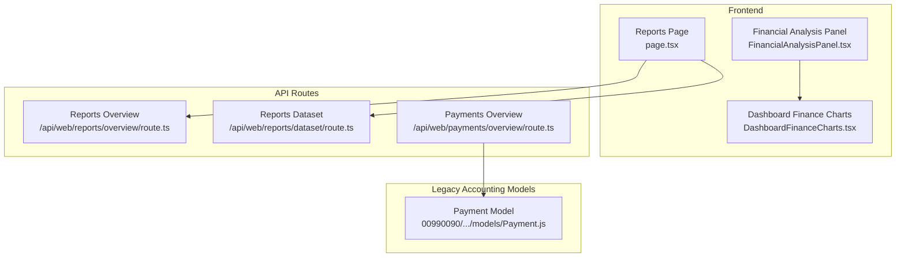
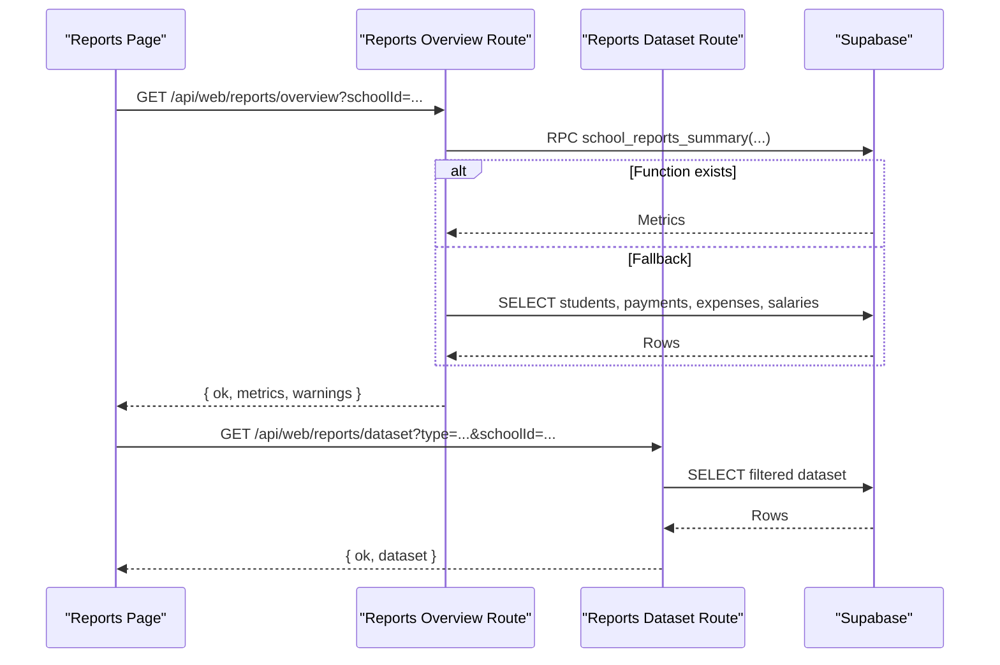
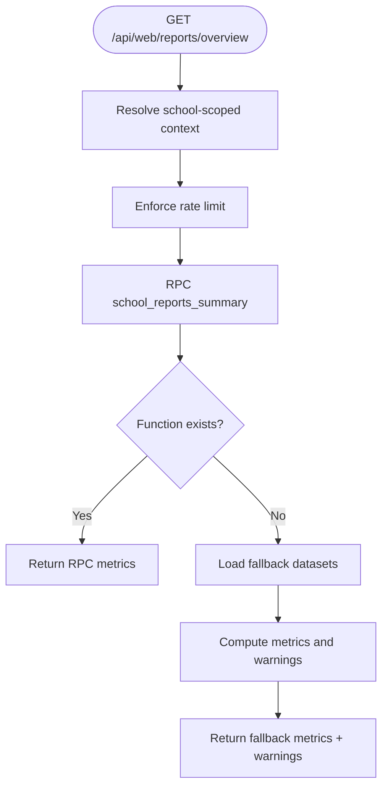
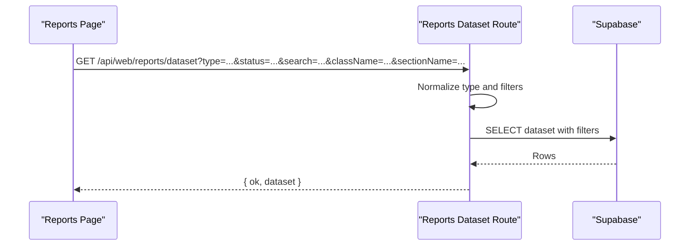
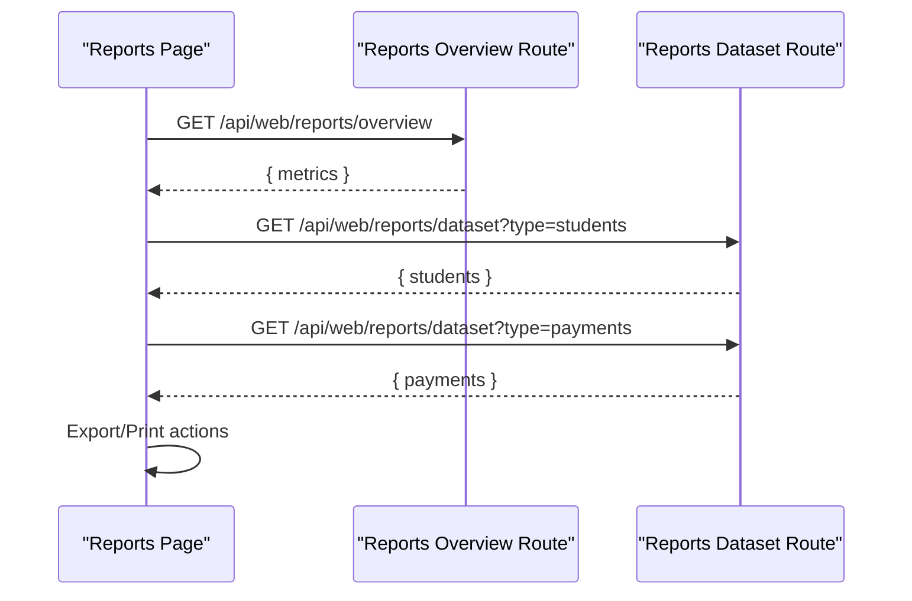
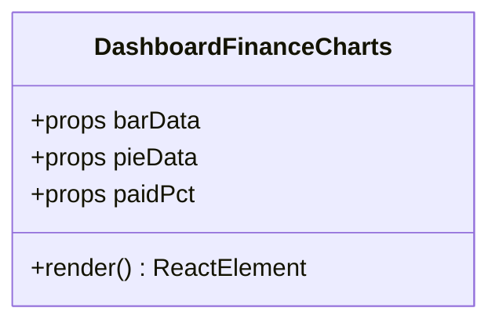
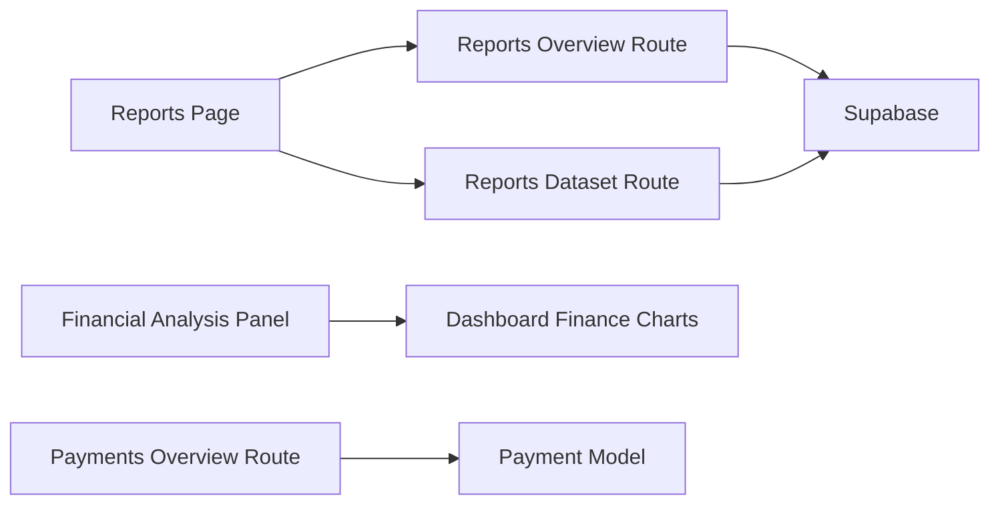

# Financial Reporting

<cite>
**Referenced Files in This Document**
- [route.ts](file://app/api/web/reports/overview/route.ts)
- [route.ts](file://app/api/web/reports/dataset/route.ts)
- [page.tsx](file://app/[locale]/reports/page.tsx)
- [FinancialAnalysisPanel.tsx](file://app/[locale]/dashboard/_components/FinancialAnalysisPanel.tsx)
- [DashboardFinanceCharts.tsx](file://components/DashboardFinanceCharts.tsx)
- [route.ts](file://app/api/web/payments/overview/route.ts)
- [Payment.js](file://00990090/school-accounting-system/backend/src/models/Payment.js)
</cite>

## Table of Contents
1. [Introduction](#introduction)
2. [Project Structure](#project-structure)
3. [Core Components](#core-components)
4. [Architecture Overview](#architecture-overview)
5. [Detailed Component Analysis](#detailed-component-analysis)
6. [Dependency Analysis](#dependency-analysis)
7. [Performance Considerations](#performance-considerations)
8. [Troubleshooting Guide](#troubleshooting-guide)
9. [Conclusion](#conclusion)
10. [Appendices](#appendices)

## Introduction
This document describes the financial reporting system for the school administration platform. It covers the financial dashboard components, revenue tracking, and expense monitoring capabilities. It explains reporting data sources, aggregation functions, and visualization components. It also documents financial overview calculations, cash flow analysis, and custom report creation, along with report generation, chart rendering, and data export functionality. Finally, it outlines the reporting API endpoints, filtering options, and strategies for performance optimization and real-time updates.

## Project Structure
The financial reporting system spans both the Next.js API routes and the frontend React components:
- API routes under app/api/web/reports provide aggregated metrics and raw datasets for reports.
- Frontend pages under app/[locale]/reports render financial summaries, detailed reports, and export/print actions.
- Dashboard components visualize financial KPIs and payment progress via reusable chart components.
- Legacy accounting system models support payment queries and summaries.

**Diagram sources**
- [page.tsx:123-180](file://app/[locale]/reports/page.tsx#L123-L180)
- [FinancialAnalysisPanel.tsx:1-87](file://app/[locale]/dashboard/_components/FinancialAnalysisPanel.tsx#L1-L87)
- [DashboardFinanceCharts.tsx:1-124](file://components/DashboardFinanceCharts.tsx#L1-L124)
- [route.ts:173-247](file://app/api/web/reports/overview/route.ts#L173-L247)
- [route.ts:40-183](file://app/api/web/reports/dataset/route.ts#L40-L183)
- [route.ts:10-43](file://app/api/web/payments/overview/route.ts#L10-L43)
- [Payment.js:14-76](file://00990090/school-accounting-system/backend/src/models/Payment.js#L14-L76)

**Section sources**
- [page.tsx:123-180](file://app/[locale]/reports/page.tsx#L123-L180)
- [route.ts:173-247](file://app/api/web/reports/overview/route.ts#L173-L247)
- [route.ts:40-183](file://app/api/web/reports/dataset/route.ts#L40-L183)
- [FinancialAnalysisPanel.tsx:1-87](file://app/[locale]/dashboard/_components/FinancialAnalysisPanel.tsx#L1-L87)
- [DashboardFinanceCharts.tsx:1-124](file://components/DashboardFinanceCharts.tsx#L1-L124)
- [route.ts:10-43](file://app/api/web/payments/overview/route.ts#L10-L43)
- [Payment.js:14-76](file://00990090/school-accounting-system/backend/src/models/Payment.js#L14-L76)

## Core Components
- Reports Overview API: Aggregates financial metrics for the school, including student counts, fees, payments, expenses, salaries, and net balance. It falls back to direct queries if a specialized summary function is unavailable.
- Reports Dataset API: Returns paginated and filterable datasets for students, payments, expenses, and salaries, with optional search and class/section filters.
- Reports Page: Renders financial summaries, detailed report cards, and provides export to Excel and print actions per dataset.
- Dashboard Finance Charts: Reusable components for bar and pie charts visualizing financial breakdowns and payment progress.
- Payments Overview API: Provides payment metadata scoped to the school, with role-based access and rate limiting.
- Payment Model: Supports historical payment queries, summaries by date range, and student-specific payment history.

**Section sources**
- [route.ts:6-247](file://app/api/web/reports/overview/route.ts#L6-L247)
- [route.ts:1-183](file://app/api/web/reports/dataset/route.ts#L1-L183)
- [page.tsx:123-779](file://app/[locale]/reports/page.tsx#L123-L779)
- [FinancialAnalysisPanel.tsx:1-87](file://app/[locale]/dashboard/_components/FinancialAnalysisPanel.tsx#L1-L87)
- [DashboardFinanceCharts.tsx:1-124](file://components/DashboardFinanceCharts.tsx#L1-L124)
- [route.ts:10-43](file://app/api/web/payments/overview/route.ts#L10-L43)
- [Payment.js:14-176](file://00990090/school-accounting-system/backend/src/models/Payment.js#L14-L176)

## Architecture Overview
The system follows a client-driven architecture:
- The Reports Page fetches aggregated metrics and datasets from dedicated API routes.
- The Reports Overview route attempts to use a specialized summary function and falls back to direct queries if unavailable.
- The Reports Dataset route supports granular filtering and search across datasets.
- The Dashboard Finance Charts component renders visualizations for payment progress and financial breakdowns.
- The Payments Overview route provides payment metadata for broader financial views.
- The Payment Model encapsulates legacy payment operations and summaries.

**Diagram sources**
- [route.ts:173-247](file://app/api/web/reports/overview/route.ts#L173-L247)
- [route.ts:40-183](file://app/api/web/reports/dataset/route.ts#L40-L183)
- [page.tsx:140-290](file://app/[locale]/reports/page.tsx#L140-L290)

## Detailed Component Analysis

### Reports Overview API
Responsibilities:
- Resolve school-scoped actor context and enforce role-based access.
- Enforce rate limits per user.
- Attempt to compute metrics via a stored summary function; fall back to direct queries if missing.
- Normalize numeric metrics and compute derived values (e.g., net balance).
- Return warnings when fallback data is used.

Key behaviors:
- Uses RPC to call a summary function with current month and today’s date parameters.
- On failure due to missing function, performs parallel selects across students, payments, expenses, and salaries.
- Computes counts and volumes, including today’s payment count and current month salary records.

**Diagram sources**
- [route.ts:173-247](file://app/api/web/reports/overview/route.ts#L173-L247)

**Section sources**
- [route.ts:137-171](file://app/api/web/reports/overview/route.ts#L137-L171)
- [route.ts:49-135](file://app/api/web/reports/overview/route.ts#L49-L135)
- [route.ts:173-247](file://app/api/web/reports/overview/route.ts#L173-L247)

### Reports Dataset API
Responsibilities:
- Validate dataset type and normalize filters (search, class, section, student status).
- Enforce role-based access and rate limits.
- Load datasets in parallel or individually depending on type.
- Return normalized relations and apply ordering and search filters.

Filtering options:
- type: students | payments | expenses | salaries | all
- status: active | transferred | suspended | deleted
- search: free-text search across names and classes
- className: class name filter
- sectionName: section filter

**Diagram sources**
- [route.ts:40-183](file://app/api/web/reports/dataset/route.ts#L40-L183)

**Section sources**
- [route.ts:18-38](file://app/api/web/reports/dataset/route.ts#L18-L38)
- [route.ts:79-146](file://app/api/web/reports/dataset/route.ts#L79-L146)
- [route.ts:148-183](file://app/api/web/reports/dataset/route.ts#L148-L183)

### Reports Page (Frontend)
Responsibilities:
- Fetch overview metrics and cache datasets per type.
- Render summary strips, financial balance cards, and report cards.
- Provide export to Excel and print actions for individual datasets and combined exports.
- Apply localized formatting and labels.

Key flows:
- fetchAll: loads overview metrics via authorized session.
- loadDataset/loadAllDatasets: caches per-type datasets and supports bulk loading.
- Export/print handlers: transform rows into spreadsheets or printable HTML.

**Diagram sources**
- [page.tsx:140-290](file://app/[locale]/reports/page.tsx#L140-L290)
- [route.ts:173-247](file://app/api/web/reports/overview/route.ts#L173-L247)
- [route.ts:40-183](file://app/api/web/reports/dataset/route.ts#L40-L183)

**Section sources**
- [page.tsx:123-779](file://app/[locale]/reports/page.tsx#L123-L779)

### Dashboard Finance Charts
Responsibilities:
- Render a bar chart of financial breakdowns and a pie chart of paid vs remaining amounts.
- Provide tooltips and responsive containers.
- Accept barData, pieData, and paid percentage props.

**Diagram sources**
- [DashboardFinanceCharts.tsx:31-35](file://components/DashboardFinanceCharts.tsx#L31-L35)

**Section sources**
- [DashboardFinanceCharts.tsx:1-124](file://components/DashboardFinanceCharts.tsx#L1-L124)
- [FinancialAnalysisPanel.tsx:1-87](file://app/[locale]/dashboard/_components/FinancialAnalysisPanel.tsx#L1-L87)

### Payments Overview API
Responsibilities:
- Resolve school-scoped actor context with broad roles.
- Enforce rate limits.
- Compute payment metadata for the school and return a standardized payload.

**Section sources**
- [route.ts:10-43](file://app/api/web/payments/overview/route.ts#L10-L43)

### Payment Model (Legacy)
Responsibilities:
- Paginated and filtered retrieval of payments with joins to students and users.
- Summary aggregation by date range and payment method.
- Student-specific payment history.

**Section sources**
- [Payment.js:14-176](file://00990090/school-accounting-system/backend/src/models/Payment.js#L14-L176)

## Dependency Analysis
- Reports Page depends on:
  - Reports Overview API for metrics.
  - Reports Dataset API for raw datasets.
- Reports Overview API depends on:
  - Supabase RPC for summary function.
  - Parallel selects for fallback.
- Reports Dataset API depends on:
  - Supabase queries with filters and ordering.
- Dashboard Finance Charts depends on:
  - Recharts for rendering.
- Payments Overview API depends on:
  - Payment metadata resolver and Payment Model for legacy summaries.

**Diagram sources**
- [page.tsx:123-180](file://app/[locale]/reports/page.tsx#L123-L180)
- [route.ts:173-247](file://app/api/web/reports/overview/route.ts#L173-L247)
- [route.ts:40-183](file://app/api/web/reports/dataset/route.ts#L40-L183)
- [FinancialAnalysisPanel.tsx:1-87](file://app/[locale]/dashboard/_components/FinancialAnalysisPanel.tsx#L1-L87)
- [DashboardFinanceCharts.tsx:1-124](file://components/DashboardFinanceCharts.tsx#L1-L124)
- [route.ts:10-43](file://app/api/web/payments/overview/route.ts#L10-L43)
- [Payment.js:14-176](file://00990090/school-accounting-system/backend/src/models/Payment.js#L14-L176)

**Section sources**
- [page.tsx:123-180](file://app/[locale]/reports/page.tsx#L123-L180)
- [route.ts:173-247](file://app/api/web/reports/overview/route.ts#L173-L247)
- [route.ts:40-183](file://app/api/web/reports/dataset/route.ts#L40-L183)
- [FinancialAnalysisPanel.tsx:1-87](file://app/[locale]/dashboard/_components/FinancialAnalysisPanel.tsx#L1-L87)
- [DashboardFinanceCharts.tsx:1-124](file://components/DashboardFinanceCharts.tsx#L1-L124)
- [route.ts:10-43](file://app/api/web/payments/overview/route.ts#L10-L43)
- [Payment.js:14-176](file://00990090/school-accounting-system/backend/src/models/Payment.js#L14-L176)

## Performance Considerations
- Rate limiting: Both overview and dataset routes enforce per-user rate limits to prevent abuse.
- Caching:
  - Frontend caches datasets per type to avoid repeated network requests.
  - No-store cache headers are applied to prevent stale data in proxies.
- Fallback strategy: When the summary function is unavailable, the overview route performs parallel selects across multiple tables; ensure indexes exist on join and filter columns.
- Indexes and queries: Consider adding indexes on payment_date, student_id, school_id, and status fields to optimize filtering and aggregation.
- Pagination: Prefer dataset loading per type rather than requesting all datasets at once unless necessary.
- Real-time updates: The current implementation relies on explicit fetches. To enable near-real-time updates, consider:
  - Polling with exponential backoff.
  - Server-sent events (SSE) for incremental updates.
  - Client-side optimistic updates with reconciliation on refresh.

[No sources needed since this section provides general guidance]

## Troubleshooting Guide
Common issues and resolutions:
- Missing summary function:
  - Symptom: Warnings indicating fallback mode and degraded performance.
  - Resolution: Apply the required migration to create the summary function.
- Role/access denied:
  - Symptom: Error responses when accessing reports or datasets.
  - Resolution: Ensure the user belongs to allowed roles and school scope.
- Rate limit exceeded:
  - Symptom: Requests blocked with rate limit headers.
  - Resolution: Reduce frequency or implement client-side backoff.
- Empty or partial datasets:
  - Symptom: Missing warnings or partial data.
  - Resolution: Verify filters and search terms; confirm dataset availability.

**Section sources**
- [route.ts:222-229](file://app/api/web/reports/overview/route.ts#L222-L229)
- [route.ts:184-189](file://app/api/web/reports/overview/route.ts#L184-L189)
- [route.ts:52-66](file://app/api/web/reports/dataset/route.ts#L52-L66)
- [page.tsx:140-175](file://app/[locale]/reports/page.tsx#L140-L175)

## Conclusion
The financial reporting system integrates robust APIs for aggregated metrics and granular datasets with a flexible frontend that supports export and printing. The dashboard components provide clear visual insights into revenue and expenses, while the fallback mechanisms ensure resilience when advanced functions are unavailable. With targeted indexing, caching, and optional real-time updates, the system can scale to meet growing reporting demands.

[No sources needed since this section summarizes without analyzing specific files]

## Appendices

### Reporting API Endpoints
- GET /api/web/reports/overview
  - Purpose: Retrieve financial overview metrics for the school.
  - Query params: schoolId (required).
  - Access: super_admin, admin.
  - Rate limit: per user, 60s window, max 90 hits.
  - Response: metrics object and warnings array.

- GET /api/web/reports/dataset
  - Purpose: Retrieve filtered datasets for students, payments, expenses, or salaries.
  - Query params: schoolId (required), type (students | payments | expenses | salaries | all), status (students only), search, className, sectionName.
  - Access: super_admin, admin.
  - Rate limit: per user, 60s window, max 45 hits.
  - Response: dataset object (per type or all).

- GET /api/web/payments/overview
  - Purpose: Retrieve payment metadata scoped to the school.
  - Query params: schoolId (required).
  - Access: super_admin, admin, employee.
  - Rate limit: per user.
  - Response: standardized payment metadata.

**Section sources**
- [route.ts:173-247](file://app/api/web/reports/overview/route.ts#L173-L247)
- [route.ts:40-183](file://app/api/web/reports/dataset/route.ts#L40-L183)
- [route.ts:10-43](file://app/api/web/payments/overview/route.ts#L10-L43)

### Data Filtering Options
- Dataset type: students | payments | expenses | salaries | all
- Student status (students): active | transferred | suspended | deleted
- Search: free-text search across names and classes
- Class name: exact match
- Section name: exact match

**Section sources**
- [route.ts:18-38](file://app/api/web/reports/dataset/route.ts#L18-L38)
- [route.ts:86-102](file://app/api/web/reports/dataset/route.ts#L86-L102)

### Implementation Examples
- Report generation:
  - Use the Reports Page to fetch overview metrics and datasets, then trigger export/print actions.
  - Example path: [page.tsx:140-290](file://app/[locale]/reports/page.tsx#L140-L290)

- Chart rendering:
  - Use Dashboard Finance Charts to visualize financial breakdowns and payment progress.
  - Example path: [DashboardFinanceCharts.tsx:67-123](file://components/DashboardFinanceCharts.tsx#L67-L123)

- Data export:
  - Export individual datasets or combined reports to Excel.
  - Example path: [page.tsx:292-418](file://app/[locale]/reports/page.tsx#L292-L418)

- Revenue tracking:
  - Use Payments Overview and Payment Model for summaries and historical queries.
  - Example path: [route.ts:10-43](file://app/api/web/payments/overview/route.ts#L10-L43), [Payment.js:144-159](file://00990090/school-accounting-system/backend/src/models/Payment.js#L144-L159)

- Expense monitoring:
  - Use Reports Dataset to retrieve filtered expense records.
  - Example path: [route.ts:122-133](file://app/api/web/reports/dataset/route.ts#L122-L133)

- Cash flow analysis:
  - Combine payment volume, expense volume, and salary volume to compute net balance.
  - Example path: [route.ts:101-126](file://app/api/web/reports/overview/route.ts#L101-L126)

- Revenue forecasting:
  - Use Payment Model summaries by date range to identify trends and seasonality.
  - Example path: [Payment.js:144-159](file://00990090/school-accounting-system/backend/src/models/Payment.js#L144-L159)

- Custom report creation:
  - Build custom filters and export pipelines using the dataset endpoint and export handlers.
  - Example path: [route.ts:40-183](file://app/api/web/reports/dataset/route.ts#L40-L183), [page.tsx:292-418](file://app/[locale]/reports/page.tsx#L292-L418)

### Financial Overview Calculations
- Derived metrics include:
  - Net balance = payment volume − expense volume − salary volume.
  - Today’s payments count filtered by created_at date equality to today.
  - Expense type count computed from distinct expense types.

**Section sources**
- [route.ts:101-126](file://app/api/web/reports/overview/route.ts#L101-L126)
- [route.ts:154-170](file://app/api/web/reports/overview/route.ts#L154-L170)

### Visualization Components
- Bar chart: Financial breakdown (total fees, paid, remaining, discounts).
- Pie chart: Paid vs remaining portions.
- Progress bars: Visual indicators for payment progress.

**Section sources**
- [FinancialAnalysisPanel.tsx:30-83](file://app/[locale]/dashboard/_components/FinancialAnalysisPanel.tsx#L30-L83)
- [DashboardFinanceCharts.tsx:76-120](file://components/DashboardFinanceCharts.tsx#L76-L120)