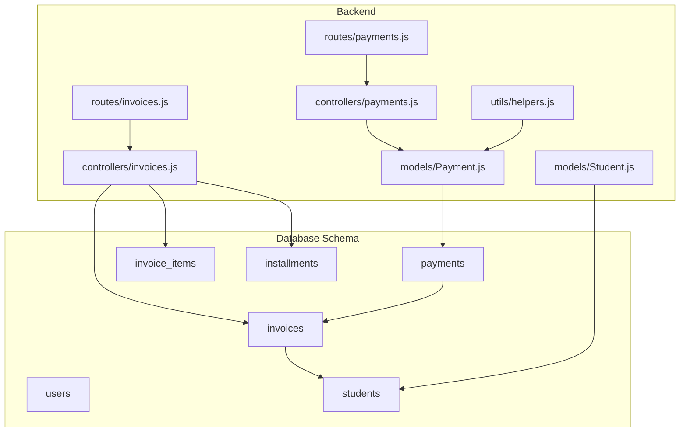
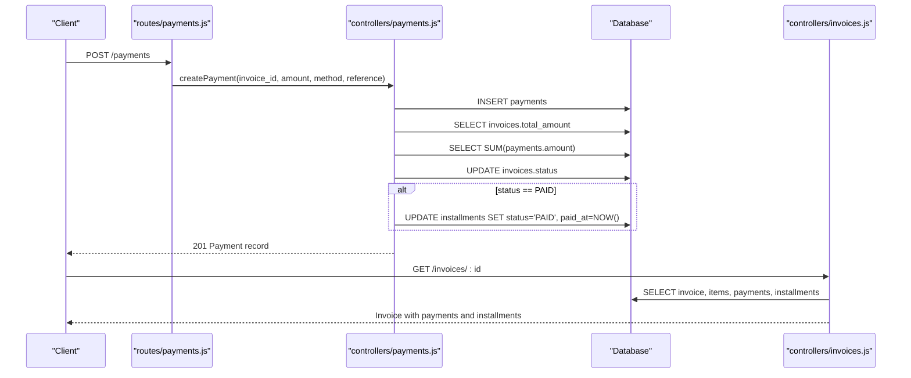
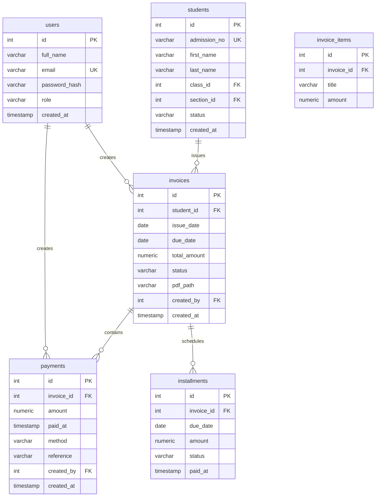
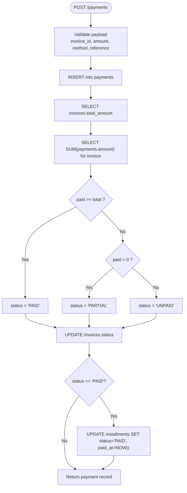
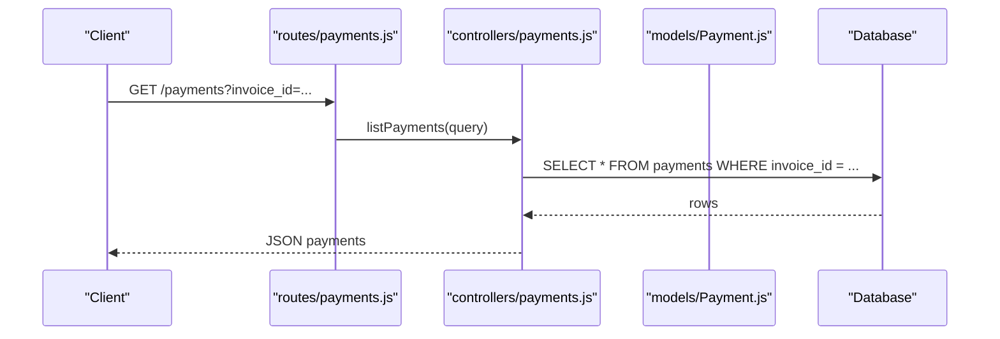
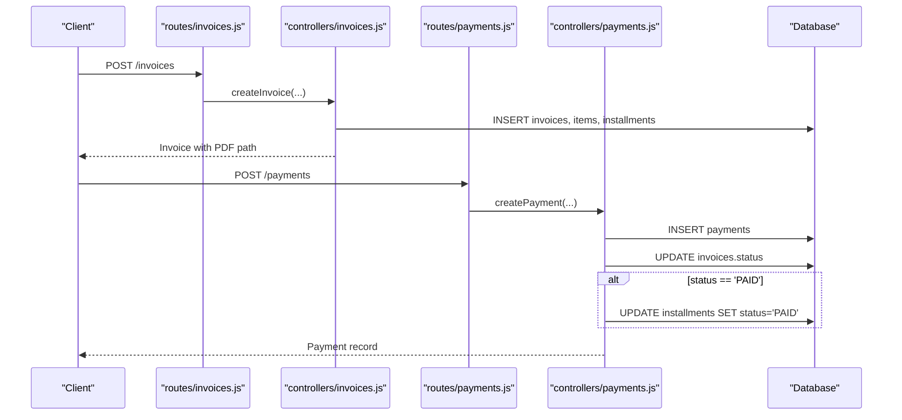
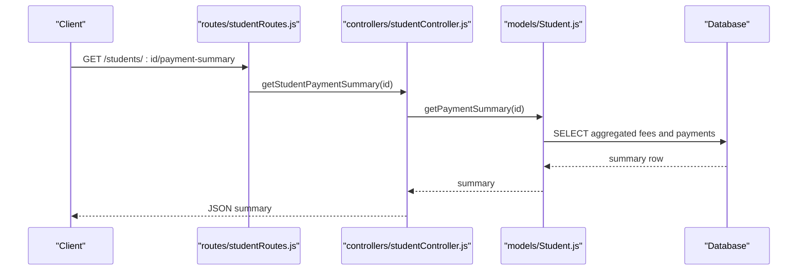
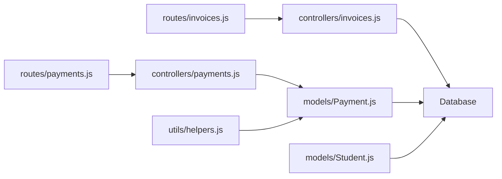

# Payment Processing

<cite>
**Referenced Files in This Document**
- [schema.sql](file://school-acc-system/docs/schema.sql)
- [helpers.js](file://00990090/school-accounting-system/backend/src/utils/helpers.js)
- [Payment.js](file://00990090/school-accounting-system/backend/src/models/Payment.js)
- [Student.js](file://00990090/school-accounting-system/backend/src/models/Student.js)
- [payments.js](file://00990090/school-accounting-system/backend/src/controllers/payments.js)
- [invoices.js](file://00990090/school-accounting-system/backend/src/controllers/invoices.js)
- [payments.js](file://00990090/school-accounting-system/backend/src/routes/payments.js)
- [invoices.js](file://00990090/school-accounting-system/backend/src/routes/invoices.js)
- [studentController.js](file://00990090/school-accounting-system/backend/src/controllers/studentController.js)
- [studentRoutes.js](file://00990090/school-accounting-system/backend/src/routes/studentRoutes.js)
- [20260326_010000_payments_page_functions.sql](file://migrations/20260326_010000_payments_page_functions.sql)
</cite>

## Table of Contents
1. [Introduction](#introduction)
2. [Project Structure](#project-structure)
3. [Core Components](#core-components)
4. [Architecture Overview](#architecture-overview)
5. [Detailed Component Analysis](#detailed-component-analysis)
6. [Dependency Analysis](#dependency-analysis)
7. [Performance Considerations](#performance-considerations)
8. [Troubleshooting Guide](#troubleshooting-guide)
9. [Conclusion](#conclusion)
10. [Appendices](#appendices)

## Introduction
This document describes the payment processing system for the school accounting application. It covers the complete payment lifecycle: creation, processing, reconciliation, validation, and integration with student and invoice management. It also documents supported payment methods, transaction recording, audit trail mechanisms, real-time updates, and practical examples for common scenarios and troubleshooting.

## Project Structure
The payment system spans database schema, models, controllers, routes, and utility helpers. The schema defines core entities and relationships. Models encapsulate persistence logic. Controllers orchestrate requests and enforce business rules. Routes expose endpoints. Helpers provide formatting and identifiers.

**Diagram sources**
- [schema.sql:67-94](file://school-acc-system/docs/schema.sql#L67-L94)
- [payments.js:1-55](file://00990090/school-accounting-system/backend/src/controllers/payments.js#L1-L55)
- [invoices.js:1-111](file://00990090/school-accounting-system/backend/src/controllers/invoices.js#L1-L111)
- [Payment.js:10-176](file://00990090/school-accounting-system/backend/src/models/Payment.js#L10-L176)
- [Student.js:9-183](file://00990090/school-accounting-system/backend/src/models/Student.js#L9-L183)
- [helpers.js:8-24](file://00990090/school-accounting-system/backend/src/utils/helpers.js#L8-L24)

**Section sources**
- [schema.sql:1-130](file://school-acc-system/docs/schema.sql#L1-L130)
- [payments.js:1-55](file://00990090/school-accounting-system/backend/src/controllers/payments.js#L1-L55)
- [invoices.js:1-111](file://00990090/school-accounting-system/backend/src/controllers/invoices.js#L1-L111)
- [Payment.js:10-176](file://00990090/school-accounting-system/backend/src/models/Payment.js#L10-L176)
- [Student.js:9-183](file://00990090/school-accounting-system/backend/src/models/Student.js#L9-L183)
- [helpers.js:8-24](file://00990090/school-accounting-system/backend/src/utils/helpers.js#L8-L24)

## Core Components
- Payment model: Encapsulates CRUD operations, aggregation queries, and student payment history retrieval.
- Student model: Provides student details and payment summaries including totals and pending amounts.
- Payment controller: Handles payment creation and invoice reconciliation logic.
- Invoice controller: Manages invoice lifecycle and links payments and installments.
- Routes: Expose endpoints for payments and invoices.
- Helpers: Provide unique identifiers and formatting utilities.

Key responsibilities:
- Payment creation validates invoice totals and updates invoice status and related installments.
- Payment listing supports filtering by invoice and pagination.
- Student payment summary aggregates fee totals and paid/pending amounts.

**Section sources**
- [Payment.js:14-172](file://00990090/school-accounting-system/backend/src/models/Payment.js#L14-L172)
- [Student.js:69-179](file://00990090/school-accounting-system/backend/src/models/Student.js#L69-L179)
- [payments.js:20-52](file://00990090/school-accounting-system/backend/src/controllers/payments.js#L20-L52)
- [invoices.js:4-108](file://00990090/school-accounting-system/backend/src/controllers/invoices.js#L4-L108)

## Architecture Overview
The payment workflow integrates with invoices and students. Payments are linked to invoices; invoice totals drive reconciliation and status updates. Installments reflect payment schedules and statuses.

**Diagram sources**
- [payments.js:20-52](file://00990090/school-accounting-system/backend/src/controllers/payments.js#L20-L52)
- [invoices.js:36-58](file://00990090/school-accounting-system/backend/src/controllers/invoices.js#L36-L58)
- [schema.sql:67-103](file://school-acc-system/docs/schema.sql#L67-L103)

## Detailed Component Analysis

### Payment Data Model and Relationships
The payment system relies on normalized tables with explicit foreign keys and constraints. The relationships are:
- payments.invoice_id → invoices.id
- invoices.student_id → students.id
- installments.invoice_id → invoices.id
- payments.created_by → users.id
- invoices.created_by → users.id

**Diagram sources**
- [schema.sql:3-130](file://school-acc-system/docs/schema.sql#L3-L130)

**Section sources**
- [schema.sql:67-103](file://school-acc-system/docs/schema.sql#L67-L103)

### Payment Creation and Reconciliation
Payment creation inserts a payment record and recalculates invoice status based on total amount and paid sum. If fully paid, related installments are updated to paid.

**Diagram sources**
- [payments.js:20-52](file://00990090/school-accounting-system/backend/src/controllers/payments.js#L20-L52)

**Section sources**
- [payments.js:20-52](file://00990090/school-accounting-system/backend/src/controllers/payments.js#L20-L52)

### Payment Listing and Filtering
Payments can be listed with optional filtering by invoice and pagination support via model methods.

**Diagram sources**
- [payments.js:3-18](file://00990090/school-accounting-system/backend/src/controllers/payments.js#L3-L18)
- [payments.js:1-10](file://00990090/school-accounting-system/backend/src/routes/payments.js#L1-L10)
- [Payment.js:14-76](file://00990090/school-accounting-system/backend/src/models/Payment.js#L14-L76)

**Section sources**
- [payments.js:3-18](file://00990090/school-accounting-system/backend/src/controllers/payments.js#L3-L18)
- [Payment.js:14-76](file://00990090/school-accounting-system/backend/src/models/Payment.js#L14-L76)

### Invoice Integration and Installment Updates
Invoice creation builds invoice items and installments, and payment creation updates invoice status and related installments.

**Diagram sources**
- [invoices.js:60-108](file://00990090/school-accounting-system/backend/src/controllers/invoices.js#L60-L108)
- [payments.js:20-52](file://00990090/school-accounting-system/backend/src/controllers/payments.js#L20-L52)

**Section sources**
- [invoices.js:60-108](file://00990090/school-accounting-system/backend/src/controllers/invoices.js#L60-L108)
- [payments.js:20-52](file://00990090/school-accounting-system/backend/src/controllers/payments.js#L20-L52)

### Student Management Integration
Student payment summaries aggregate fee totals and paid/pending amounts. Student routes expose endpoints for listing, searching, and retrieving payment summaries.

**Diagram sources**
- [studentRoutes.js:19-20](file://00990090/school-accounting-system/backend/src/routes/studentRoutes.js#L19-L20)
- [studentController.js:158-185](file://00990090/school-accounting-system/backend/src/controllers/studentController.js#L158-L185)
- [Student.js:164-179](file://00990090/school-accounting-system/backend/src/models/Student.js#L164-L179)

**Section sources**
- [studentRoutes.js:19-20](file://00990090/school-accounting-system/backend/src/routes/studentRoutes.js#L19-L20)
- [studentController.js:158-185](file://00990090/school-accounting-system/backend/src/controllers/studentController.js#L158-L185)
- [Student.js:164-179](file://00990090/school-accounting-system/backend/src/models/Student.js#L164-L179)

### Payment Methods and Validation
Supported payment methods are stored in the payments table. Validation ensures required fields are present during creation and defaults are applied when missing.

- Payment methods: Stored in the method column with a default value.
- Validation: Required fields include invoice_id, amount; optional fields include method and reference.

**Section sources**
- [schema.sql:86-94](file://school-acc-system/docs/schema.sql#L86-L94)
- [payments.js:20-27](file://00990090/school-accounting-system/backend/src/controllers/payments.js#L20-L27)

### Transaction Recording and Audit Trail
- Unique identifiers: Receipt numbers are generated for payments.
- Audit trail: Payments record who created them (created_by) and when they were created/updated. Users and invoices also maintain created_by and timestamps.

**Section sources**
- [helpers.js:8-12](file://00990090/school-accounting-system/backend/src/utils/helpers.js#L8-L12)
- [schema.sql:3-10](file://school-acc-system/docs/schema.sql#L3-L10)
- [schema.sql:86-94](file://school-acc-system/docs/schema.sql#L86-L94)
- [schema.sql:67-77](file://school-acc-system/docs/schema.sql#L67-L77)

### Real-Time Payment Updates
- Payment creation immediately updates invoice status and installments upon successful insertion.
- Installment status transitions to paid and captures paid_at timestamp when fully paid.

**Section sources**
- [payments.js:42-46](file://00990090/school-accounting-system/backend/src/controllers/payments.js#L42-L46)

### Refund Procedures
Refunds are not implemented in the current codebase. To add refunds:
- Introduce a refunds table referencing payments.
- Add refund amount and reason fields.
- Implement refund creation endpoint and reversal logic that adjusts invoice totals and statuses accordingly.

[No sources needed since this section proposes future enhancements]

### Implementation Examples

- Payment creation endpoint
  - Method: POST
  - Path: /payments
  - Body fields: invoice_id, amount, method (optional), reference (optional)
  - Response: 201 with created payment record

- Payment listing endpoint
  - Method: GET
  - Path: /payments?invoice_id={id}
  - Response: Array of payments ordered by paid_at descending

- Invoice retrieval with payments and installments
  - Method: GET
  - Path: /invoices/:id
  - Response: Invoice with embedded items, payments, and installments

- Student payment summary
  - Method: GET
  - Path: /students/:id/payment-summary
  - Response: Aggregated totals and pending amounts

**Section sources**
- [payments.js:6-7](file://00990090/school-accounting-system/backend/src/routes/payments.js#L6-L7)
- [payments.js:3-18](file://00990090/school-accounting-system/backend/src/controllers/payments.js#L3-L18)
- [invoices.js:6-8](file://00990090/school-accounting-system/backend/src/routes/invoices.js#L6-L8)
- [invoices.js:36-58](file://00990090/school-accounting-system/backend/src/controllers/invoices.js#L36-L58)
- [studentRoutes.js:19-20](file://00990090/school-accounting-system/backend/src/routes/studentRoutes.js#L19-L20)
- [studentController.js:158-185](file://00990090/school-accounting-system/backend/src/controllers/studentController.js#L158-L185)

## Dependency Analysis
- Controllers depend on models and database utilities.
- Routes depend on controllers.
- Models depend on the database connection and helpers.
- Business logic for reconciliation resides in the payment controller.

**Diagram sources**
- [payments.js:1-10](file://00990090/school-accounting-system/backend/src/routes/payments.js#L1-L10)
- [payments.js:20-52](file://00990090/school-accounting-system/backend/src/controllers/payments.js#L20-L52)
- [invoices.js:1-11](file://00990090/school-accounting-system/backend/src/routes/invoices.js#L1-L11)
- [invoices.js:4-108](file://00990090/school-accounting-system/backend/src/controllers/invoices.js#L4-L108)
- [Payment.js:10-176](file://00990090/school-accounting-system/backend/src/models/Payment.js#L10-L176)
- [Student.js:9-183](file://00990090/school-accounting-system/backend/src/models/Student.js#L9-L183)
- [helpers.js:8-24](file://00990090/school-accounting-system/backend/src/utils/helpers.js#L8-L24)

**Section sources**
- [payments.js:1-10](file://00990090/school-accounting-system/backend/src/routes/payments.js#L1-L10)
- [payments.js:20-52](file://00990090/school-accounting-system/backend/src/controllers/payments.js#L20-L52)
- [invoices.js:1-11](file://00990090/school-accounting-system/backend/src/routes/invoices.js#L1-L11)
- [invoices.js:4-108](file://00990090/school-accounting-system/backend/src/controllers/invoices.js#L4-L108)
- [Payment.js:10-176](file://00990090/school-accounting-system/backend/src/models/Payment.js#L10-L176)
- [Student.js:9-183](file://00990090/school-accounting-system/backend/src/models/Student.js#L9-L183)
- [helpers.js:8-24](file://00990090/school-accounting-system/backend/src/utils/helpers.js#L8-L24)

## Performance Considerations
- Indexes: The schema includes indexes on payments paid_at and invoices status/due_date, supporting efficient queries for reporting and reconciliation.
- Pagination: Payment listing supports pagination via offset/limit to avoid large result sets.
- Aggregation: Payment summaries and student payment summaries use grouped queries; ensure appropriate indexing on join and filter columns.

Recommendations:
- Add composite indexes for frequent filter combinations (e.g., invoice_id + paid_at).
- Monitor slow queries and consider materialized summaries for heavy reporting workloads.

**Section sources**
- [schema.sql:125-130](file://school-acc-system/docs/schema.sql#L125-L130)
- [Payment.js:14-76](file://00990090/school-accounting-system/backend/src/models/Payment.js#L14-L76)

## Troubleshooting Guide
Common issues and resolutions:
- Payment not updating invoice status
  - Verify invoice_id exists and amount is positive.
  - Check that the sum of payments meets or exceeds total_amount.
  - Ensure no concurrent updates conflict.

- Installment not marked as paid
  - Confirm payment fully covers invoice total.
  - Check that installments exist for the invoice.

- Duplicate admission number when creating student
  - The student controller validates uniqueness and returns a 400 error if duplicate is detected.

- Payment listing returns empty
  - Ensure invoice_id query parameter matches an existing invoice.

- Missing receipts or identifiers
  - Receipt numbers are generated by helpers; confirm generation logic runs before insertion.

**Section sources**
- [payments.js:35-46](file://00990090/school-accounting-system/backend/src/controllers/payments.js#L35-L46)
- [studentController.js:79-86](file://00990090/school-accounting-system/backend/src/controllers/studentController.js#L79-L86)
- [helpers.js:8-12](file://00990090/school-accounting-system/backend/src/utils/helpers.js#L8-L12)

## Conclusion
The payment processing system integrates tightly with invoices and students, ensuring accurate reconciliation and real-time status updates. The modular design with models, controllers, and routes enables clear extension for advanced features like refunds and enhanced reporting. Adhering to the established data model and validation patterns will maintain consistency and reliability.

## Appendices

### Payment Security Considerations
- Authentication and authorization: Routes should enforce authentication and role-based access controls.
- Input sanitization: Validate and sanitize all incoming data to prevent injection attacks.
- Idempotency: Consider idempotent payment creation to handle retries safely.
- Logging: Log sensitive operations (e.g., payment creation) with minimal PII.

[No sources needed since this section provides general guidance]

### Practical Scenarios
- Fully paid invoice
  - Submit multiple payments totaling the invoice amount; invoice status becomes paid and installments are updated.

- Partial payment
  - Submit a payment less than total amount; invoice status becomes partial.

- Overpayment
  - Submit a payment exceeding total amount; invoice status becomes paid and excess may require refund logic.

[No sources needed since this section provides general guidance]

### Migration Functions Supporting Payments
- Payment page functions migration enhances reporting and UI capabilities for payment lists and summaries.

**Section sources**
- [20260326_010000_payments_page_functions.sql](file://migrations/20260326_010000_payments_page_functions.sql)