# Data Isolation & Tenant Security

<cite>
**Referenced Files in This Document**
- [lib/school/scope.ts](file://lib/school/scope.ts)
- [hooks/useSchoolScope.tsx](file://hooks/useSchoolScope.tsx)
- [lib/school/context.ts](file://lib/school/context.ts)
- [lib/auth.ts](file://lib/auth.ts)
- [lib/rbac-session.ts](file://lib/rbac-session.ts)
- [lib/audit.ts](file://lib/audit.ts)
- [lib/supabase.ts](file://lib/supabase.ts)
- [lib/supabase-server.ts](file://lib/supabase-server.ts)
- [admin_infrastructure.sql](file://admin_infrastructure.sql)
- [migrations/20260322_managed_mobile_rls.sql](file://migrations/20260322_managed_mobile_rls.sql)
- [migrations/20260324_010000_academic_records_scope_model.sql](file://migrations/20260324_010000_academic_records_scope_model.sql)
- [types/roles.ts](file://types/roles.ts)
</cite>

## Table of Contents
1. [Introduction](#introduction)
2. [Project Structure](#project-structure)
3. [Core Components](#core-components)
4. [Architecture Overview](#architecture-overview)
5. [Detailed Component Analysis](#detailed-component-analysis)
6. [Dependency Analysis](#dependency-analysis)
7. [Performance Considerations](#performance-considerations)
8. [Troubleshooting Guide](#troubleshooting-guide)
9. [Conclusion](#conclusion)
10. [Appendices](#appendices)

## Introduction
This document explains the data isolation and tenant security system designed to maintain strict separation between different schools’ data. It covers:
- School scope implementation that filters data based on the active school context
- Database-level Row Level Security (RLS) policies and schema isolation
- Audit logging for compliance
- Cross-school data sharing restrictions and permission-based access controls
- Practical examples, scope validation workflows, and security breach prevention mechanisms
- Technical implementation of tenant isolation via database queries, middleware filtering, and API endpoint security
- Security considerations, compliance requirements, and best practices

## Project Structure
The tenant isolation system spans client hooks, server utilities, Supabase authentication and RLS, and database migrations:
- Client-side scope management and routing scoping
- Server-side Supabase clients and RBAC session handling
- Database RLS policies and audit infrastructure
- Role-based access control definitions and route rules

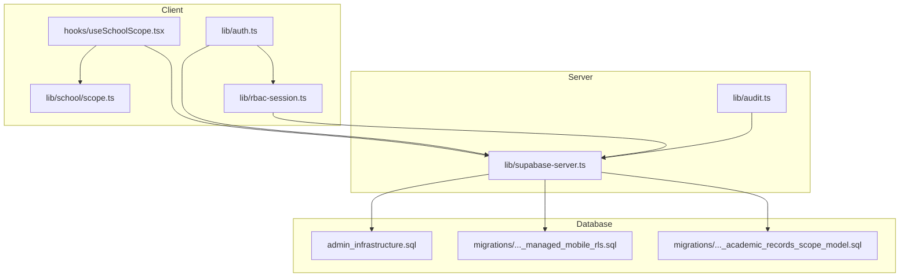

**Diagram sources**
- [hooks/useSchoolScope.tsx:1-167](file://hooks/useSchoolScope.tsx#L1-L167)
- [lib/school/scope.ts:1-50](file://lib/school/scope.ts#L1-L50)
- [lib/auth.ts:1-341](file://lib/auth.ts#L1-L341)
- [lib/rbac-session.ts:1-153](file://lib/rbac-session.ts#L1-L153)
- [lib/supabase-server.ts:1-75](file://lib/supabase-server.ts#L1-L75)
- [lib/audit.ts:1-63](file://lib/audit.ts#L1-L63)
- [admin_infrastructure.sql:1-156](file://admin_infrastructure.sql#L1-L156)
- [migrations/20260322_managed_mobile_rls.sql:1-580](file://migrations/20260322_managed_mobile_rls.sql#L1-L580)
- [migrations/20260324_010000_academic_records_scope_model.sql:1-529](file://migrations/20260324_010000_academic_records_scope_model.sql#L1-L529)

**Section sources**
- [lib/school/scope.ts:1-50](file://lib/school/scope.ts#L1-L50)
- [hooks/useSchoolScope.tsx:1-167](file://hooks/useSchoolScope.tsx#L1-L167)
- [lib/school/context.ts:1-74](file://lib/school/context.ts#L1-L74)
- [lib/auth.ts:1-341](file://lib/auth.ts#L1-L341)
- [lib/rbac-session.ts:1-153](file://lib/rbac-session.ts#L1-L153)
- [lib/audit.ts:1-63](file://lib/audit.ts#L1-L63)
- [lib/supabase.ts:1-22](file://lib/supabase.ts#L1-L22)
- [lib/supabase-server.ts:1-75](file://lib/supabase-server.ts#L1-L75)
- [admin_infrastructure.sql:1-156](file://admin_infrastructure.sql#L1-L156)
- [migrations/20260322_managed_mobile_rls.sql:1-580](file://migrations/20260322_managed_mobile_rls.sql#L1-L580)
- [migrations/20260324_010000_academic_records_scope_model.sql:1-529](file://migrations/20260324_010000_academic_records_scope_model.sql#L1-L529)
- [types/roles.ts:1-432](file://types/roles.ts#L1-L432)

## Core Components
- School scope utilities: define scoped paths, build localized scoped URLs, and read the current school selection from the window location.
- Client-side hook: manages Super Admin’s ability to switch schools, caches school lists, and blocks content until a valid scope is resolved.
- School context resolution: resolves school ID and branch ID for a given profile and caches branch IDs for performance.
- Authentication and access control: evaluates role-based access, permission checks, and subscription/school activation gating.
- RBAC session: signs and verifies a short-lived session cookie with role, permissions, and school context.
- Audit logging: records actions with actor identity, entity type/id, and metadata for compliance.
- Supabase clients: browser client for UI and server client for API routes and SSR.
- Database RLS and schema: per-table policies for super_admin/admin/student/teacher scopes; audit logs and soft-delete support; academic records schema with indexes and policies.

**Section sources**
- [lib/school/scope.ts:1-50](file://lib/school/scope.ts#L1-L50)
- [hooks/useSchoolScope.tsx:1-167](file://hooks/useSchoolScope.tsx#L1-L167)
- [lib/school/context.ts:1-74](file://lib/school/context.ts#L1-L74)
- [lib/auth.ts:106-145](file://lib/auth.ts#L106-L145)
- [lib/rbac-session.ts:1-153](file://lib/rbac-session.ts#L1-L153)
- [lib/audit.ts:1-63](file://lib/audit.ts#L1-L63)
- [lib/supabase.ts:1-22](file://lib/supabase.ts#L1-L22)
- [lib/supabase-server.ts:1-75](file://lib/supabase-server.ts#L1-L75)
- [admin_infrastructure.sql:9-40](file://admin_infrastructure.sql#L9-L40)
- [migrations/20260322_managed_mobile_rls.sql:315-346](file://migrations/20260322_managed_mobile_rls.sql#L315-L346)
- [migrations/20260324_010000_academic_records_scope_model.sql:432-524](file://migrations/20260324_010000_academic_records_scope_model.sql#L432-L524)

## Architecture Overview
The system enforces tenant isolation across three planes:
- UI scope plane: Super Admin selects a school; scoped paths are built and validated.
- Access control plane: Role and permission checks gate navigation and actions; subscription and school activation status are enforced.
- Database plane: RLS policies and indexes ensure data visibility and integrity at rest.

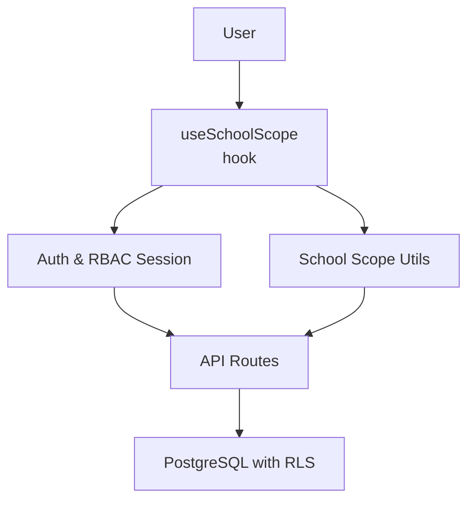

**Diagram sources**
- [hooks/useSchoolScope.tsx:64-167](file://hooks/useSchoolScope.tsx#L64-L167)
- [lib/school/scope.ts:19-50](file://lib/school/scope.ts#L19-L50)
- [lib/auth.ts:106-145](file://lib/auth.ts#L106-L145)
- [lib/rbac-session.ts:56-153](file://lib/rbac-session.ts#L56-L153)
- [lib/supabase-server.ts:52-75](file://lib/supabase-server.ts#L52-L75)
- [admin_infrastructure.sql:9-40](file://admin_infrastructure.sql#L9-L40)

## Detailed Component Analysis

### School Scope Management
- Scoped paths: Certain UI routes are marked as school-scoped and require a schoolId query parameter.
- Localized scoped paths: Builds locale-aware paths with the schoolId query param.
- Window-scoped selection: Reads the schoolId from the URL query parameter and dispatches a change event to synchronize navigation.

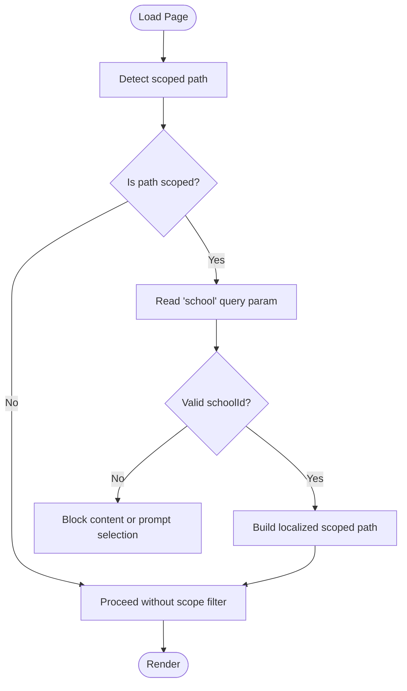

**Diagram sources**
- [lib/school/scope.ts:19-50](file://lib/school/scope.ts#L19-L50)
- [hooks/useSchoolScope.tsx:109-146](file://hooks/useSchoolScope.tsx#L109-L146)

**Section sources**
- [lib/school/scope.ts:1-50](file://lib/school/scope.ts#L1-L50)
- [hooks/useSchoolScope.tsx:64-167](file://hooks/useSchoolScope.tsx#L64-L167)

### Client-Side Scope Hook
- Fetches and caches school list for Super Admin.
- Synchronizes selected school from URL and events.
- Blocks rendering until a valid scope is determined.
- Provides utilities to update the school selection and build scoped paths.

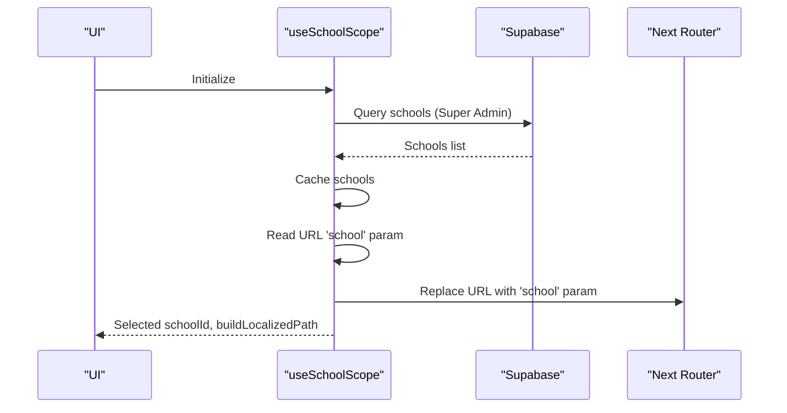

**Diagram sources**
- [hooks/useSchoolScope.tsx:72-107](file://hooks/useSchoolScope.tsx#L72-L107)
- [hooks/useSchoolScope.tsx:131-146](file://hooks/useSchoolScope.tsx#L131-L146)
- [lib/school/scope.ts:44-50](file://lib/school/scope.ts#L44-L50)

**Section sources**
- [hooks/useSchoolScope.tsx:64-167](file://hooks/useSchoolScope.tsx#L64-L167)

### School Context Resolution
- Resolves schoolId from profile or Super Admin selection.
- Resolves branchId for a school with caching and safe fallbacks for missing tables.

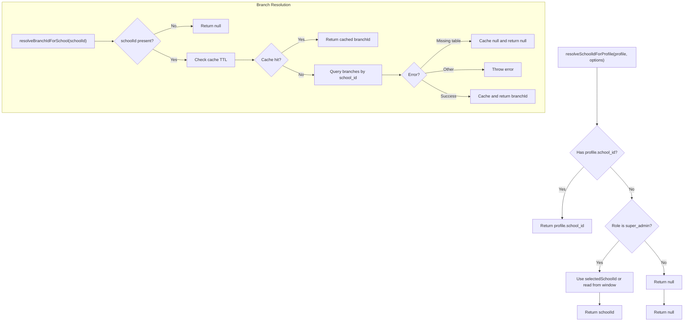

**Diagram sources**
- [lib/school/context.ts:14-74](file://lib/school/context.ts#L14-L74)

**Section sources**
- [lib/school/context.ts:1-74](file://lib/school/context.ts#L1-L74)

### Authentication, Access Control, and Permissions
- Access decision engine evaluates role, permissions, and subscription/school activation.
- Path rules and permission rules enforce granular access per route.
- Role and permission normalization supports custom permissions and “full_access”.

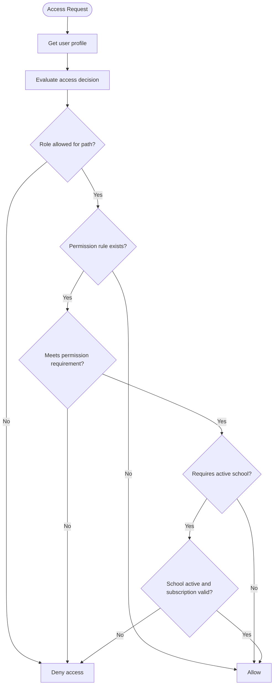

**Diagram sources**
- [lib/auth.ts:106-145](file://lib/auth.ts#L106-L145)
- [types/roles.ts:196-268](file://types/roles.ts#L196-L268)

**Section sources**
- [lib/auth.ts:106-145](file://lib/auth.ts#L106-L145)
- [types/roles.ts:1-432](file://types/roles.ts#L1-432)

### RBAC Session Cookie
- Generates a signed, short-lived cookie containing role, permissions, schoolId, and subscription status.
- Enforces dedicated secret key material and warns in development if fallback is used.

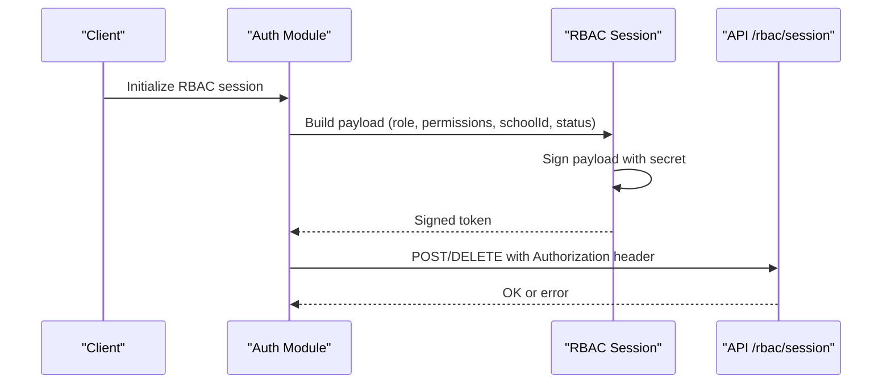

**Diagram sources**
- [lib/auth.ts:273-331](file://lib/auth.ts#L273-L331)
- [lib/rbac-session.ts:56-153](file://lib/rbac-session.ts#L56-L153)

**Section sources**
- [lib/rbac-session.ts:1-153](file://lib/rbac-session.ts#L1-L153)
- [lib/auth.ts:273-331](file://lib/auth.ts#L273-L331)

### Audit Logging
- Centralized logging function inserts audit entries with actor info, action, entity, and metadata.
- Gracefully handles missing audit_logs table errors.

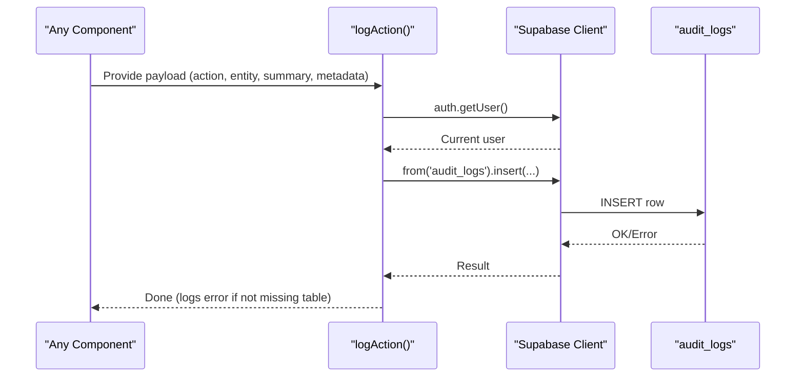

**Diagram sources**
- [lib/audit.ts:40-62](file://lib/audit.ts#L40-L62)
- [admin_infrastructure.sql:9-28](file://admin_infrastructure.sql#L9-L28)

**Section sources**
- [lib/audit.ts:1-63](file://lib/audit.ts#L1-L63)
- [admin_infrastructure.sql:9-40](file://admin_infrastructure.sql#L9-L40)

### Database-Level Security: RLS and Schema
- Audit logs RLS: Super Admin only.
- Academic records RLS: Admins manage within their school; Super Admin has full access.
- Managed user RLS: Student/Teacher can only access their own records or those permitted by class/section rules.
- Indexes: Optimized lookups by school_id/class_id/section_id/subject_id for performance and scoping.

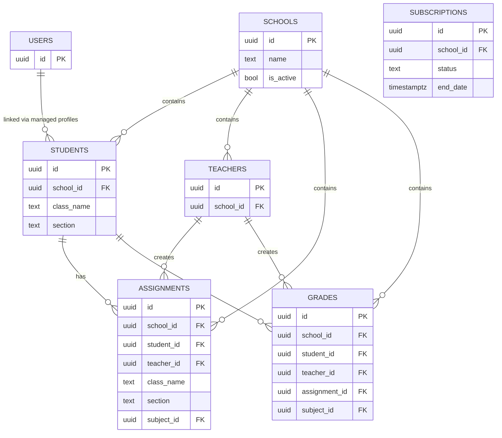

**Diagram sources**
- [migrations/20260324_010000_academic_records_scope_model.sql:24-331](file://migrations/20260324_010000_academic_records_scope_model.sql#L24-L331)
- [migrations/20260322_managed_mobile_rls.sql:315-577](file://migrations/20260322_managed_mobile_rls.sql#L315-L577)

**Section sources**
- [admin_infrastructure.sql:9-40](file://admin_infrastructure.sql#L9-L40)
- [migrations/20260322_managed_mobile_rls.sql:315-577](file://migrations/20260322_managed_mobile_rls.sql#L315-L577)
- [migrations/20260324_010000_academic_records_scope_model.sql:432-524](file://migrations/20260324_010000_academic_records_scope_model.sql#L432-L524)

### API Endpoint Security and Middleware Filtering
- Server client creation: Ensures correct environment variables and cookie handling for API routes.
- Bearer token extraction: Supports Authorization headers for programmatic access.
- Combined with RLS policies, this ensures that even if an API endpoint is reached, only rows matching the current role and school context are returned.

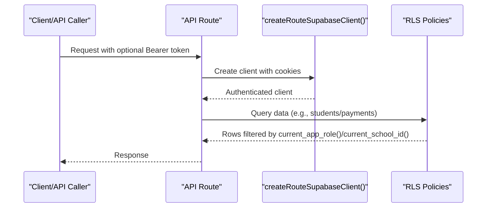

**Diagram sources**
- [lib/supabase-server.ts:5-75](file://lib/supabase-server.ts#L5-L75)
- [migrations/20260324_010000_academic_records_scope_model.sql:432-524](file://migrations/20260324_010000_academic_records_scope_model.sql#L432-L524)

**Section sources**
- [lib/supabase-server.ts:1-75](file://lib/supabase-server.ts#L1-L75)
- [lib/supabase.ts:1-22](file://lib/supabase.ts#L1-L22)

## Dependency Analysis
- Client scope depends on Supabase for fetching schools and on Next router for URL updates.
- Auth module depends on Supabase for user/session and on RBAC session for cookie lifecycle.
- Database policies depend on helper functions (e.g., current_app_role, current_school_id) and indexes for efficient filtering.

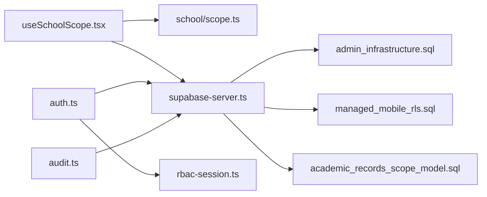

**Diagram sources**
- [hooks/useSchoolScope.tsx:1-167](file://hooks/useSchoolScope.tsx#L1-L167)
- [lib/school/scope.ts:1-50](file://lib/school/scope.ts#L1-L50)
- [lib/school/context.ts:1-74](file://lib/school/context.ts#L1-L74)
- [lib/auth.ts:1-341](file://lib/auth.ts#L1-L341)
- [lib/rbac-session.ts:1-153](file://lib/rbac-session.ts#L1-L153)
- [lib/audit.ts:1-63](file://lib/audit.ts#L1-L63)
- [lib/supabase-server.ts:1-75](file://lib/supabase-server.ts#L1-L75)
- [admin_infrastructure.sql:1-156](file://admin_infrastructure.sql#L1-L156)
- [migrations/20260322_managed_mobile_rls.sql:1-580](file://migrations/20260322_managed_mobile_rls.sql#L1-L580)
- [migrations/20260324_010000_academic_records_scope_model.sql:1-529](file://migrations/20260324_010000_academic_records_scope_model.sql#L1-L529)

**Section sources**
- [lib/school/scope.ts:1-50](file://lib/school/scope.ts#L1-L50)
- [hooks/useSchoolScope.tsx:1-167](file://hooks/useSchoolScope.tsx#L1-L167)
- [lib/school/context.ts:1-74](file://lib/school/context.ts#L1-L74)
- [lib/auth.ts:1-341](file://lib/auth.ts#L1-L341)
- [lib/rbac-session.ts:1-153](file://lib/rbac-session.ts#L1-L153)
- [lib/audit.ts:1-63](file://lib/audit.ts#L1-L63)
- [lib/supabase-server.ts:1-75](file://lib/supabase-server.ts#L1-L75)
- [admin_infrastructure.sql:1-156](file://admin_infrastructure.sql#L1-L156)
- [migrations/20260322_managed_mobile_rls.sql:1-580](file://migrations/20260322_managed_mobile_rls.sql#L1-L580)
- [migrations/20260324_010000_academic_records_scope_model.sql:1-529](file://migrations/20260324_010000_academic_records_scope_model.sql#L1-L529)

## Performance Considerations
- Client caching: School list is cached in sessionStorage for a short TTL to reduce network requests.
- Branch ID caching: Branch IDs are cached per school with a small TTL to avoid repeated lookups.
- Indexes: Strategic indexes on school_id/class_id/section_id/subject_id improve query performance for scoped reads.
- RLS evaluation: Policies rely on helper functions and indexes; keep these up to date with schema changes.

[No sources needed since this section provides general guidance]

## Troubleshooting Guide
- Missing environment variables for Supabase clients cause immediate errors during client or server initialization.
- RBAC cookie secret warnings indicate insecure fallbacks in development; configure a dedicated secret for production.
- Audit log insertion errors are logged and ignored if the table is missing; ensure admin infrastructure is applied.
- Subscription or school inactivation blocks access; verify profile.school and subscription status.

**Section sources**
- [lib/supabase.ts:8-19](file://lib/supabase.ts#L8-L19)
- [lib/supabase-server.ts:11-15](file://lib/supabase-server.ts#L11-L15)
- [lib/rbac-session.ts:19-50](file://lib/rbac-session.ts#L19-L50)
- [lib/audit.ts:56-62](file://lib/audit.ts#L56-L62)
- [lib/auth.ts:93-104](file://lib/auth.ts#L93-L104)

## Conclusion
The system achieves robust tenant isolation by combining:
- Clear school scoping in the UI and routing
- Strong RBAC session enforcement
- Comprehensive RLS policies and indexes
- Centralized audit logging for compliance
- Strict access control rules and subscription/school gating

Together, these layers prevent unauthorized cross-school access, support auditable operations, and maintain data sovereignty across tenants.

[No sources needed since this section summarizes without analyzing specific files]

## Appendices

### Practical Examples
- Scope validation workflow: Super Admin navigates to a scoped path; the hook reads the schoolId from the URL, validates it against the cached school list, and blocks content until resolved.
- Cross-school restriction: A teacher from School A cannot read/write assignments for a student in School B; RLS policies and helper functions enforce this boundary.
- Permission-based access: Viewing payments requires the “view_payments” permission; the access decision engine checks route permission rules and user permissions.
- Audit logging: Every create/update/delete/login/logout triggers an audit log insert with actor and metadata.

**Section sources**
- [hooks/useSchoolScope.tsx:109-146](file://hooks/useSchoolScope.tsx#L109-L146)
- [migrations/20260322_managed_mobile_rls.sql:315-577](file://migrations/20260322_managed_mobile_rls.sql#L315-L577)
- [types/roles.ts:259-268](file://types/roles.ts#L259-L268)
- [lib/audit.ts:40-62](file://lib/audit.ts#L40-L62)