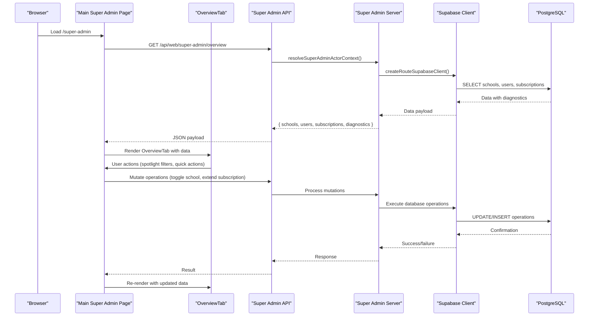
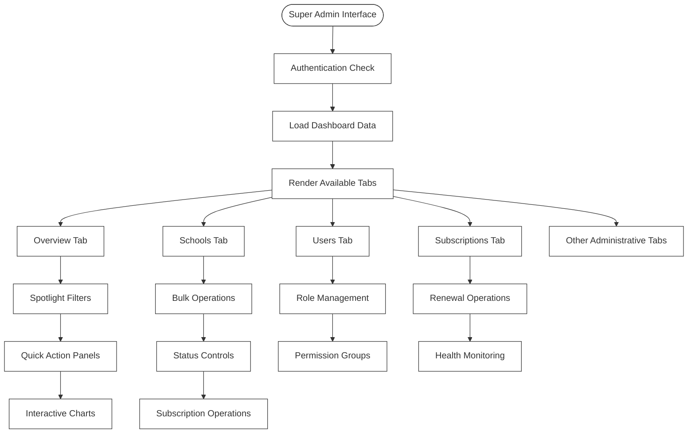
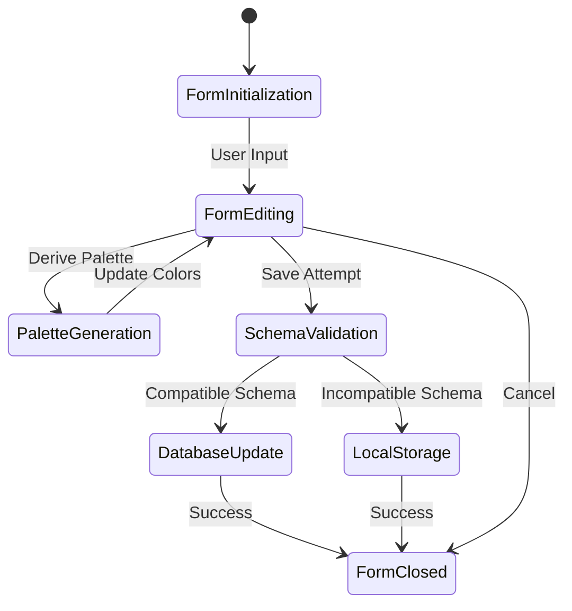
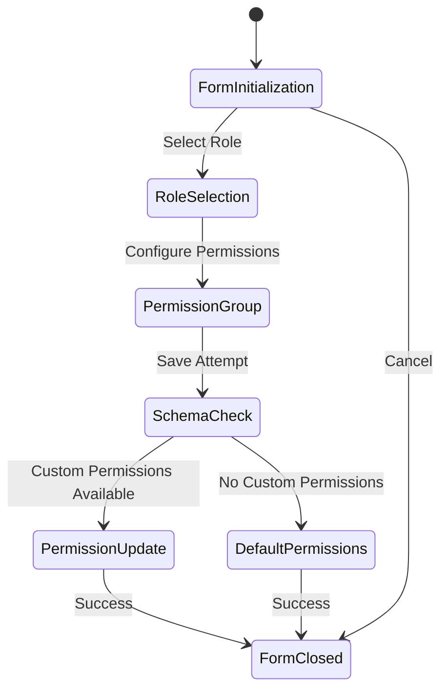
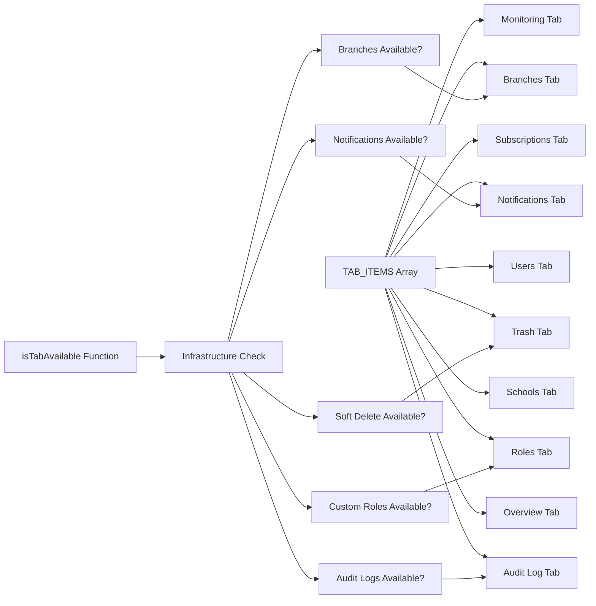
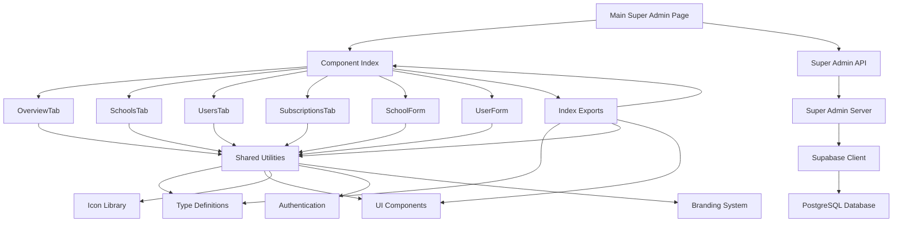
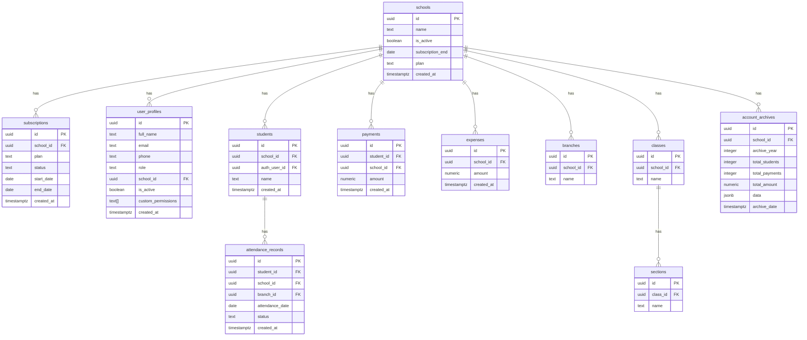

# Multi-Tenant Management

<cite>
**Referenced Files in This Document**
- [database_setup.sql](file://database_setup.sql)
- [admin_infrastructure.sql](file://admin_infrastructure.sql)
- [migrations/20260322_managed_mobile_rls.sql](file://migrations/20260322_managed_mobile_rls.sql)
- [lib/school/scope.ts](file://lib/school/scope.ts)
- [lib/school/context.ts](file://lib/school/context.ts)
- [lib/super-admin-server.ts](file://lib/super-admin-server.ts)
- [app/api/web/super-admin/schools/[schoolId]/route.ts](file://app/api/web/super-admin/schools/[schoolId]/route.ts)
- [app/api/web/super-admin/users/[userId]/route.ts](file://app/api/web/super-admin/users/[userId]/route.ts)
- [app/api/web/super-admin/subscriptions/[schoolId]/route.ts](file://app/api/web/super-admin/subscriptions/[schoolId]/route.ts)
- [app/schools/page.tsx](file://app/schools/page.tsx)
- [app/subscriptions/page.tsx](file://app/subscriptions/page.tsx)
- [lib/supabase-server.ts](file://lib/supabase-server.ts)
- [lib/supabase.ts](file://lib/supabase.ts)
- [app/[locale]/super-admin/page.tsx](file://app/[locale]/super-admin/page.tsx)
- [app/[locale]/super-admin/_components/index.ts](file://app/[locale]/super-admin/_components/index.ts)
- [app/[locale]/super-admin/_components/OverviewTab.tsx](file://app/[locale]/super-admin/_components/OverviewTab.tsx)
- [app/[locale]/super-admin/_components/SchoolsTab.tsx](file://app/[locale]/super-admin/_components/SchoolsTab.tsx)
- [app/[locale]/super-admin/_components/UsersTab.tsx](file://app/[locale]/super-admin/_components/UsersTab.tsx)
- [app/[locale]/super-admin/_components/SubscriptionsTab.tsx](file://app/[locale]/super-admin/_components/SubscriptionsTab.tsx)
- [app/[locale]/super-admin/_components/SchoolForm.tsx](file://app/[locale]/super-admin/_components/SchoolForm.tsx)
- [app/[locale]/super-admin/_components/UserForm.tsx](file://app/[locale]/super-admin/_components/UserForm.tsx)
</cite>

## Update Summary
**Changes Made**
- Updated super admin interface architecture to reflect modular component restructuring
- Added documentation for new tab-based interface with OverviewTab, SchoolsTab, UsersTab, and SubscriptionsTab components
- Documented new form components including SchoolForm and UserForm with enhanced functionality
- Updated component composition patterns and data flow between main page and modular components
- Added new UI patterns including spotlight filters, quick action panels, and responsive design

## Table of Contents
1. [Introduction](#introduction)
2. [Project Structure](#project-structure)
3. [Core Components](#core-components)
4. [Architecture Overview](#architecture-overview)
5. [Detailed Component Analysis](#detailed-component-analysis)
6. [Dependency Analysis](#dependency-analysis)
7. [Performance Considerations](#performance-considerations)
8. [Troubleshooting Guide](#troubleshooting-guide)
9. [Conclusion](#conclusion)
10. [Appendices](#appendices)

## Introduction
This document explains the multi-tenant management system for a hierarchical school and branch administration platform. The system has undergone a major interface restructuring, transforming from a monolithic 2841-line super admin page to a modular 669-line architecture with dedicated components for different administrative functions. It covers:
- School hierarchy and branch management
- Subscription-based access control
- Tenant isolation via school scope
- Super admin capabilities for managing multiple schools, users, and subscriptions
- Modular component architecture with tab-based navigation
- Enhanced form components with real-time branding preview
- School context switching, data filtering, and cross-school reporting
- Practical workflows and database design with Row Level Security (RLS)

## Project Structure
The system spans a Next.js frontend, API routes, and a Supabase-backed database with RLS policies. The super admin interface now follows a modular architecture with dedicated components for different administrative functions.

**Updated** The super admin page.tsx was transformed from 2841 lines to 669 lines with modular components including OverviewTab.tsx, SchoolForm.tsx, SchoolsTab.tsx, SubscriptionsTab.tsx, UserForm.tsx, and UsersTab.tsx.

```mermaid
graph TB
subgraph "Frontend - Modular Super Admin"
MAIN["Main Super Admin Page<br/>app/[locale]/super-admin/page.tsx"]
OVERVIEW["OverviewTab<br/>app/[locale]/super-admin/_components/OverviewTab.tsx"]
SCHOOLS["SchoolsTab<br/>app/[locale]/super-admin/_components/SchoolsTab.tsx"]
USERS["UsersTab<br/>app/[locale]/super-admin/_components/UsersTab.tsx"]
SUBS["SubscriptionsTab<br/>app/[locale]/super-admin/_components/SubscriptionsTab.tsx"]
SCHOOLFORM["SchoolForm<br/>app/[locale]/super-admin/_components/SchoolForm.tsx"]
USERFORM["UserForm<br/>app/[locale]/super-admin/_components/UserForm.tsx"]
ENDCOMP["Other Components<br/>AuditLogTab, RolesTab, TrashTab, etc."]
ENDINDEX["Component Index<br/>app/[locale]/super-admin/_components/index.ts"]
ENDCOMP --> ENDCOMP
ENDINDEX --> OVERVIEW
ENDINDEX --> SCHOOLS
ENDINDEX --> USERS
ENDINDEX --> SUBS
ENDINDEX --> SCHOOLFORM
ENDINDEX --> USERFORM
ENDINDEX --> ENDCOMP
MAIN --> OVERVIEW
MAIN --> SCHOOLS
MAIN --> USERS
MAIN --> SUBS
MAIN --> SCHOOLFORM
MAIN --> USERFORM
MAIN --> ENDCOMP
ENDCOMP --> MAIN
```

**Diagram sources**
- [app/[locale]/super-admin/page.tsx:117-1069](file://app/[locale]/super-admin/page.tsx#L117-L1069)
- [app/[locale]/super-admin/_components/OverviewTab.tsx:1-401](file://app/[locale]/super-admin/_components/OverviewTab.tsx#L1-L401)
- [app/[locale]/super-admin/_components/SchoolsTab.tsx:1-147](file://app/[locale]/super-admin/_components/SchoolsTab.tsx#L1-L147)
- [app/[locale]/super-admin/_components/UsersTab.tsx:1-152](file://app/[locale]/super-admin/_components/UsersTab.tsx#L1-L152)
- [app/[locale]/super-admin/_components/SubscriptionsTab.tsx:1-90](file://app/[locale]/super-admin/_components/SubscriptionsTab.tsx#L1-L90)
- [app/[locale]/super-admin/_components/SchoolForm.tsx:1-365](file://app/[locale]/super-admin/_components/SchoolForm.tsx#L1-L365)
- [app/[locale]/super-admin/_components/UserForm.tsx:1-220](file://app/[locale]/super-admin/_components/UserForm.tsx#L1-L220)
- [app/[locale]/super-admin/_components/index.ts:1-22](file://app/[locale]/super-admin/_components/index.ts#L1-L22)

**Section sources**
- [app/[locale]/super-admin/page.tsx:117-1069](file://app/[locale]/super-admin/page.tsx#L117-L1069)
- [app/[locale]/super-admin/_components/index.ts:1-22](file://app/[locale]/super-admin/_components/index.ts#L1-L22)

## Core Components
The super admin interface now consists of modular components that work together to provide a comprehensive administrative experience:

- **Main Super Admin Page**: Orchestrates data loading, state management, and component rendering with tab-based navigation
- **OverviewTab**: Provides dashboard statistics, quick actions, and health monitoring with spotlight filters
- **SchoolsTab**: Manages school listings with bulk operations, status controls, and subscription management
- **UsersTab**: Handles user management with role-based access and permission controls
- **SubscriptionsTab**: Centralizes subscription monitoring and renewal operations
- **SchoolForm**: Advanced form with real-time branding preview, color customization, and schema compatibility handling
- **UserForm**: Comprehensive user management form with permission groups and role assignment
- **API Integration**: Maintains backward compatibility with existing API endpoints while supporting new component interactions

**Section sources**
- [app/[locale]/super-admin/page.tsx:117-1069](file://app/[locale]/super-admin/page.tsx#L117-L1069)
- [app/[locale]/super-admin/_components/OverviewTab.tsx:68-401](file://app/[locale]/super-admin/_components/OverviewTab.tsx#L68-L401)
- [app/[locale]/super-admin/_components/SchoolsTab.tsx:22-147](file://app/[locale]/super-admin/_components/SchoolsTab.tsx#L22-L147)
- [app/[locale]/super-admin/_components/UsersTab.tsx:19-152](file://app/[locale]/super-admin/_components/UsersTab.tsx#L19-L152)
- [app/[locale]/super-admin/_components/SubscriptionsTab.tsx:15-90](file://app/[locale]/super-admin/_components/SubscriptionsTab.tsx#L15-L90)
- [app/[locale]/super-admin/_components/SchoolForm.tsx:70-365](file://app/[locale]/super-admin/_components/SchoolForm.tsx#L70-L365)
- [app/[locale]/super-admin/_components/UserForm.tsx:45-220](file://app/[locale]/super-admin/_components/UserForm.tsx#L45-L220)

## Architecture Overview
The modular architecture separates concerns into specialized components while maintaining centralized state management. The main page handles authentication, data fetching, and state coordination, while individual tabs focus on specific administrative domains.



**Diagram sources**
- [app/[locale]/super-admin/page.tsx:180-241](file://app/[locale]/super-admin/page.tsx#L180-L241)
- [app/[locale]/super-admin/page.tsx:264-294](file://app/[locale]/super-admin/page.tsx#L264-L294)
- [app/[locale]/super-admin/page.tsx:478-507](file://app/[locale]/super-admin/page.tsx#L478-L507)

## Detailed Component Analysis

### Modular Super Admin Interface
The main super admin page orchestrates multiple specialized components through a tab-based navigation system. Each tab focuses on specific administrative functions while sharing common data and state management.

**Updated** The interface now uses a responsive sidebar with collapsible navigation, spotlight filters for quick problem identification, and real-time data synchronization.



**Diagram sources**
- [app/[locale]/super-admin/page.tsx:78-94](file://app/[locale]/super-admin/page.tsx#L78-L94)
- [app/[locale]/super-admin/page.tsx:586-596](file://app/[locale]/super-admin/page.tsx#L586-L596)
- [app/[locale]/super-admin/page.tsx:636-646](file://app/[locale]/super-admin/page.tsx#L636-L646)

**Section sources**
- [app/[locale]/super-admin/page.tsx:117-1069](file://app/[locale]/super-admin/page.tsx#L117-L1069)
- [app/[locale]/super-admin/page.tsx:78-94](file://app/[locale]/super-admin/page.tsx#L78-L94)

### OverviewTab - Comprehensive Dashboard
The OverviewTab serves as the central dashboard, providing comprehensive analytics, quick actions, and problem identification through spotlight filters.

**Updated** Features include interactive charts, spotlight filters for immediate problem resolution, quick action panels, and real-time data visualization.

```mermaid
graph TB
Overview["OverviewTab"] --> Stats["Statistics Cards"]
Overview --> Spotlight["Spotlight Filters"]
Overview --> Charts["Interactive Charts"]
Overview --> RecentActivity["Recent Activity"]
Overview --> QuickActions["Quick Action Panels"]
Stats --> SchoolCount["School Count"]
Stats --> SubscriptionHealth["Subscription Health"]
Stats --> ExpiringSoon["Expiring Soon"]
Stats --> UserCount["User Count"]
Spotlight --> ExpiringSubs["Expiring Subscriptions"]
Spotlight --> InactiveSchools["Inactive Schools"]
Spotlight --> OrphanUsers["Orphan Users"]
Spotlight --> MissingBranding["Missing Branding"]
Charts --> PlanDistribution["Plan Distribution"]
Charts --> RoleDistribution["Role Distribution"]
Charts --> SubscriptionHealthChart["Subscription Health Pie Chart"]
RecentActivity --> RecentSchools["Recent Schools"]
RecentActivity --> RecentUsers["Recent Users"]
QuickActions --> CreateSchool["Create School"]
QuickActions --> CreateUser["Create User"]
QuickActions --> MonitorSubscriptions["Monitor Subscriptions"]
```



**Diagram sources**
- [app/[locale]/super-admin/_components/OverviewTab.tsx:68-401](file://app/[locale]/super-admin/_components/OverviewTab.tsx#L68-L401)

**Section sources**
- [app/[locale]/super-admin/_components/OverviewTab.tsx:68-401](file://app/[locale]/super-admin/_components/OverviewTab.tsx#L68-L401)

### Advanced Form Components
The new form components provide enhanced functionality with real-time previews, schema compatibility handling, and comprehensive validation.

**Updated** Both SchoolForm and UserForm include advanced features like real-time branding preview, schema compatibility detection, and enhanced user experience.

#### SchoolForm - Enhanced School Management
The SchoolForm provides comprehensive school management with real-time branding preview, color customization, and schema compatibility handling.



**Diagram sources**
- [app/[locale]/super-admin/_components/SchoolForm.tsx:70-365](file://app/[locale]/super-admin/_components/SchoolForm.tsx#L70-L365)

#### UserForm - Comprehensive User Management
The UserForm handles user management with role assignment, permission groups, and schema-aware permission handling.



**Diagram sources**
- [app/[locale]/super-admin/_components/UserForm.tsx:45-220](file://app/[locale]/super-admin/_components/UserForm.tsx#L45-L220)

**Section sources**
- [app/[locale]/super-admin/_components/SchoolForm.tsx:70-365](file://app/[locale]/super-admin/_components/SchoolForm.tsx#L70-L365)
- [app/[locale]/super-admin/_components/UserForm.tsx:45-220](file://app/[locale]/super-admin/_components/UserForm.tsx#L45-L220)

### Tab-Based Navigation System
The interface uses a sophisticated tab-based navigation system with availability checking based on admin infrastructure configuration.

**Updated** The navigation system dynamically adjusts available tabs based on infrastructure capabilities and includes responsive design for different screen sizes.



**Diagram sources**
- [app/[locale]/super-admin/page.tsx:78-115](file://app/[locale]/super-admin/page.tsx#L78-L115)
- [app/[locale]/super-admin/page.tsx:96-115](file://app/[locale]/super-admin/page.tsx#L96-L115)

**Section sources**
- [app/[locale]/super-admin/page.tsx:78-115](file://app/[locale]/super-admin/page.tsx#L78-L115)
- [app/[locale]/super-admin/page.tsx:96-115](file://app/[locale]/super-admin/page.tsx#L96-L115)

## Dependency Analysis
The modular architecture maintains clear dependency relationships while enabling component reusability and maintainability.

**Updated** Dependencies now flow from the main page to specialized components, with shared utilities and types distributed across the component ecosystem.



**Diagram sources**
- [app/[locale]/super-admin/_components/index.ts:1-22](file://app/[locale]/super-admin/_components/index.ts#L1-L22)
- [app/[locale]/super-admin/page.tsx:51-76](file://app/[locale]/super-admin/page.tsx#L51-L76)

**Section sources**
- [app/[locale]/super-admin/_components/index.ts:1-22](file://app/[locale]/super-admin/_components/index.ts#L1-L22)
- [app/[locale]/super-admin/page.tsx:51-76](file://app/[locale]/super-admin/page.tsx#L51-L76)

## Performance Considerations
The modular architecture improves performance through component lazy loading, optimized data fetching, and efficient state management.

**Updated** Performance improvements include reduced initial bundle size, selective component rendering, and optimized data caching strategies.

- **Bundle Size Optimization**: Components are loaded on-demand based on active tabs, reducing initial load time
- **State Management**: Centralized state in main page with local component state for forms and modals
- **Data Caching**: Efficient caching of filtered datasets and spotlight filter states
- **Responsive Design**: Optimized layouts for different screen sizes with progressive enhancement
- **Real-time Updates**: Efficient re-rendering of affected components after mutations

## Troubleshooting Guide
Common issues and solutions for the modular super admin interface:

**Updated** Troubleshooting focuses on component availability, data loading issues, and form validation problems.

- **Component Availability**: Check infrastructure configuration if certain tabs are not visible
- **Data Loading Issues**: Verify API connectivity and authentication status for dashboard data
- **Form Validation**: Review schema compatibility and required field validation in forms
- **Performance Issues**: Monitor component loading and consider disabling non-essential tabs
- **State Synchronization**: Ensure proper toast notifications and success/error messaging

**Section sources**
- [app/[locale]/super-admin/page.tsx:170-178](file://app/[locale]/super-admin/page.tsx#L170-L178)
- [app/[locale]/super-admin/page.tsx:231-237](file://app/[locale]/super-admin/page.tsx#L231-L237)
- [app/[locale]/super-admin/page.tsx:512-515](file://app/[locale]/super-admin/page.tsx#L512-L515)

## Conclusion
The modular super admin interface represents a significant architectural improvement, transforming from a monolithic 2841-line component to a maintainable 669-line structure with specialized components. The new architecture provides better separation of concerns, improved performance, enhanced user experience, and greater flexibility for future enhancements while maintaining full backward compatibility with existing API endpoints.

## Appendices

### Database Design for Multi-Tenancy
The database design remains unchanged, supporting the modular interface through comprehensive RLS policies and tenant isolation mechanisms.



**Diagram sources**
- [database_setup.sql:75-183](file://database_setup.sql#L75-L183)
- [database_setup.sql:214-299](file://database_setup.sql#L214-L299)
- [database_setup.sql:314-337](file://database_setup.sql#L314-L337)
- [database_setup.sql:419-614](file://database_setup.sql#L419-L614)

**Section sources**
- [database_setup.sql:75-183](file://database_setup.sql#L75-L183)
- [database_setup.sql:419-614](file://database_setup.sql#L419-L614)

### RLS Policies and Data Isolation Strategies
The RLS policies and data isolation strategies remain consistent with the previous architecture, ensuring tenant boundaries are maintained across all components.

**Section sources**
- [database_setup.sql:419-520](file://database_setup.sql#L419-L520)
- [database_setup.sql:524-614](file://database_setup.sql#L524-L614)
- [admin_infrastructure.sql:29-38](file://admin_infrastructure.sql#L29-L38)