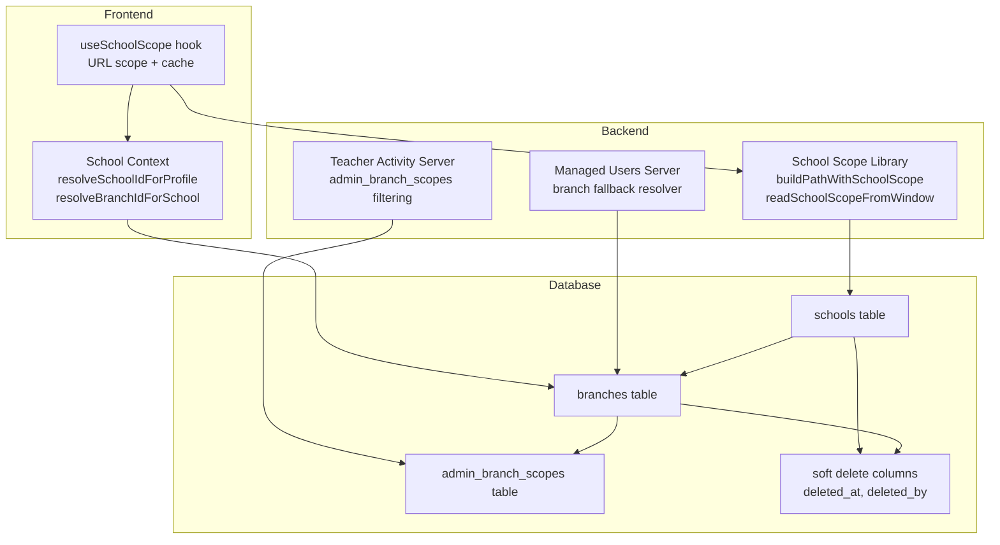
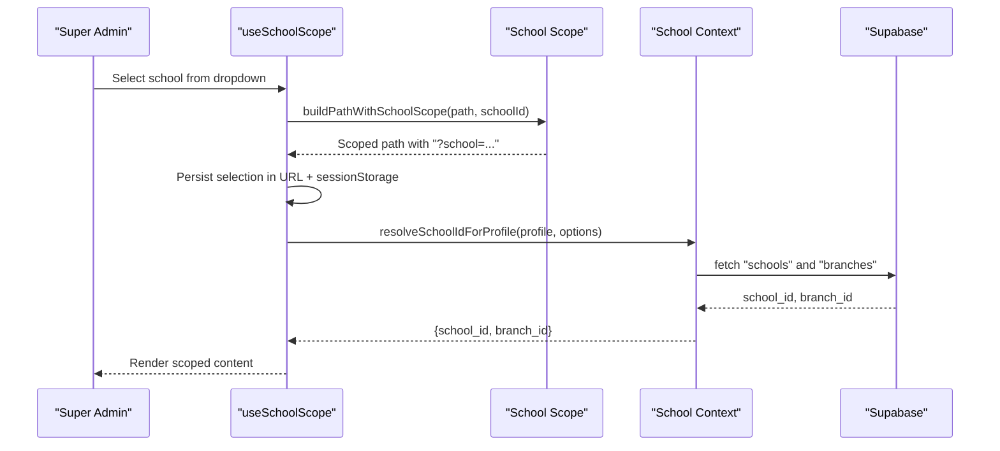
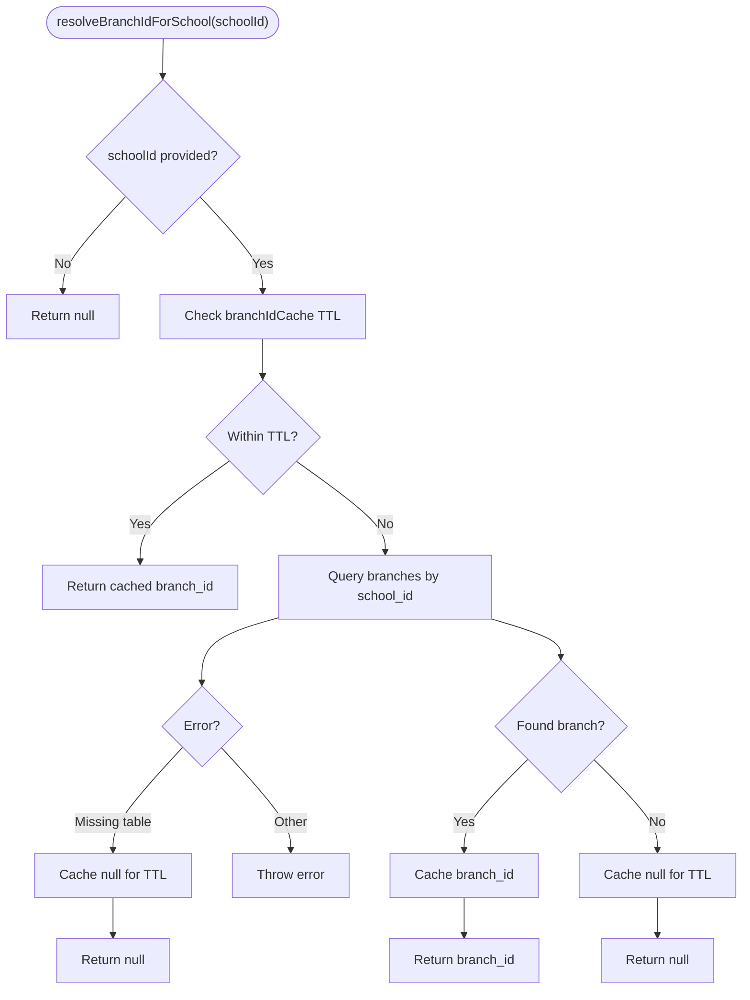
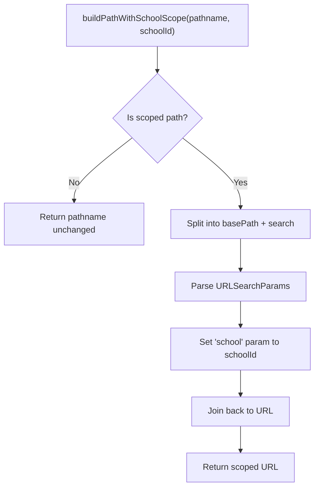
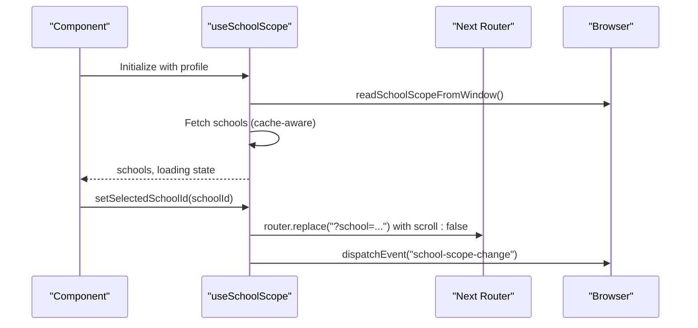
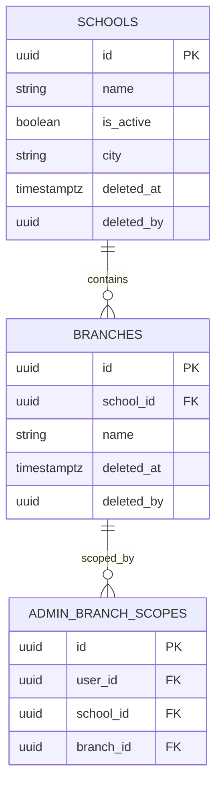
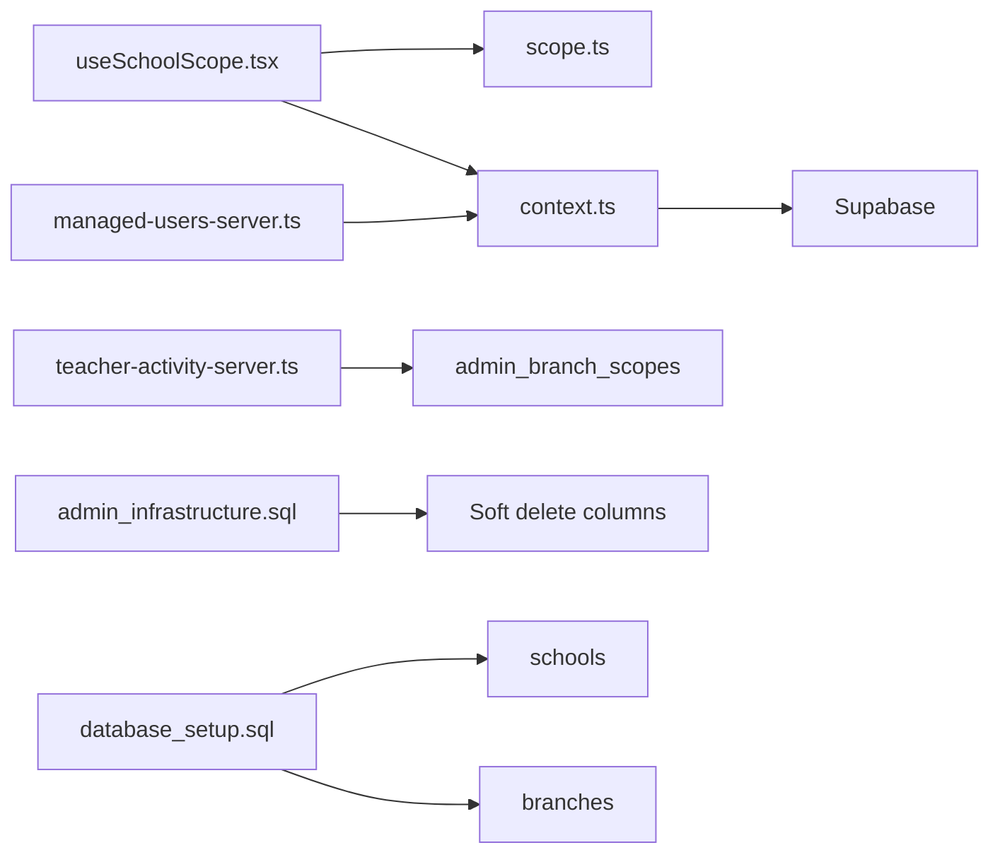

# School Hierarchy & Branch Management

<cite>
**Referenced Files in This Document**
- [context.ts](file://lib/school/context.ts)
- [scope.ts](file://lib/school/scope.ts)
- [index.ts](file://lib/school/index.ts)
- [useSchoolScope.tsx](file://hooks/useSchoolScope.tsx)
- [admin_infrastructure.sql](file://admin_infrastructure.sql)
- [database_setup.sql](file://database_setup.sql)
- [20260329_000000_teacher_activity_monitoring.sql](file://migrations/20260329_000000_teacher_activity_monitoring.sql)
- [roles.ts](file://types/roles.ts)
- [teacher-activity-server.ts](file://lib/teacher-activity-server.ts)
- [managed-users-server.ts](file://lib/managed-users-server.ts)
- [schema-compat.ts](file://lib/schema-compat.ts)
</cite>

## Table of Contents
1. [Introduction](#introduction)
2. [Project Structure](#project-structure)
3. [Core Components](#core-components)
4. [Architecture Overview](#architecture-overview)
5. [Detailed Component Analysis](#detailed-component-analysis)
6. [Dependency Analysis](#dependency-analysis)
7. [Performance Considerations](#performance-considerations)
8. [Troubleshooting Guide](#troubleshooting-guide)
9. [Conclusion](#conclusion)
10. [Appendices](#appendices)

## Introduction
This document explains the school hierarchy and branch management system, focusing on:
- Hierarchical structure of schools and branches and how parent-child relationships are modeled
- Organizational chart implementation via URL-scoped navigation for super admins
- Seamless switching between schools and branches with persistence and validation
- Branch management capabilities (creation, modification, deletion, and relationship mapping)
- School scope enforcement based on roles and permissions
- Practical workflows for navigating hierarchies, assigning branches, and switching contexts
- Database schema for hierarchical relationships, foreign keys, and tree-like structures
- Common scenarios, validation rules, and troubleshooting guidance

## Project Structure
The school hierarchy and branch management spans several layers:
- Frontend hooks for scope selection and persistence
- Backend libraries for context resolution and branch fallback
- Database schema supporting schools, branches, and admin scopes
- Migration files defining admin-specific branch scoping tables
- Role and permission types governing access

**Diagram sources**
- [useSchoolScope.tsx:64-166](file://hooks/useSchoolScope.tsx#L64-L166)
- [context.ts:14-73](file://lib/school/context.ts#L14-L73)
- [scope.ts:19-49](file://lib/school/scope.ts#L19-L49)
- [teacher-activity-server.ts:151-182](file://lib/teacher-activity-server.ts#L151-L182)
- [managed-users-server.ts:486-503](file://lib/managed-users-server.ts#L486-L503)
- [admin_infrastructure.sql:110-130](file://admin_infrastructure.sql#L110-L130)
- [20260329_000000_teacher_activity_monitoring.sql:341-360](file://migrations/20260329_000000_teacher_activity_monitoring.sql#L341-L360)

**Section sources**
- [index.ts:1-3](file://lib/school/index.ts#L1-L3)
- [scope.ts:19-49](file://lib/school/scope.ts#L19-L49)
- [useSchoolScope.tsx:64-166](file://hooks/useSchoolScope.tsx#L64-L166)

## Core Components
- School context resolution: resolves active school and branch for a given user profile and optional explicit selection.
- URL-based school scoping: builds localized scoped paths and reads current scope from URL for super admins.
- Super admin scope hook: manages school selection, caching, and navigation events.
- Branch fallback resolution: resolves a default branch per school when the branches table exists.
- Admin branch scopes: restricts admin access to specific branches within a school.
- Soft delete support: adds deleted_at/deleted_by columns to key entities for safe archival.

**Section sources**
- [context.ts:14-73](file://lib/school/context.ts#L14-L73)
- [scope.ts:19-49](file://lib/school/scope.ts#L19-L49)
- [useSchoolScope.tsx:64-166](file://hooks/useSchoolScope.tsx#L64-L166)
- [managed-users-server.ts:486-503](file://lib/managed-users-server.ts#L486-L503)
- [admin_infrastructure.sql:110-130](file://admin_infrastructure.sql#L110-L130)

## Architecture Overview
The system separates concerns across layers:
- UI layer: super admin selects a school via URL parameter; paths are localized and scoped.
- Context layer: resolves school and branch IDs for the current actor.
- Access control layer: admin branch scopes limit which branches an admin can operate on.
- Persistence layer: caches and soft deletes improve UX and data safety.

**Diagram sources**
- [useSchoolScope.tsx:131-146](file://hooks/useSchoolScope.tsx#L131-L146)
- [scope.ts:23-42](file://lib/school/scope.ts#L23-L42)
- [context.ts:14-54](file://lib/school/context.ts#L14-L54)

## Detailed Component Analysis

### School Context Resolution
- resolveSchoolIdForProfile: Returns profile’s school_id if present; for super_admin, falls back to selectedSchoolId or URL query param.
- resolveBranchIdForSchool: Returns a cached branch ID if recent; otherwise queries branches by school_id and caches the result.
- resetBranchIdCache: Clears cache selectively or globally.

**Diagram sources**
- [context.ts:27-54](file://lib/school/context.ts#L27-L54)

**Section sources**
- [context.ts:14-73](file://lib/school/context.ts#L14-L73)

### URL-Based School Scoping
- buildPathWithSchoolScope: Adds or updates the school query parameter for scoped paths.
- buildLocalizedScopedPath: Applies localization and then scoping.
- readSchoolScopeFromWindow: Reads the current school scope from URL.

**Diagram sources**
- [scope.ts:23-42](file://lib/school/scope.ts#L23-L42)

**Section sources**
- [scope.ts:19-49](file://lib/school/scope.ts#L19-L49)

### Super Admin School Scope Hook
- Fetches schools and caches them in sessionStorage for a short period.
- Syncs selection from URL and dispatches a custom event to keep state in sync.
- Provides helpers to build localized scoped paths and to change the selected school.

**Diagram sources**
- [useSchoolScope.tsx:64-166](file://hooks/useSchoolScope.tsx#L64-L166)

**Section sources**
- [useSchoolScope.tsx:64-166](file://hooks/useSchoolScope.tsx#L64-L166)

### Branch Fallback Resolution (Managed Users)
- resolveSchoolBranchId: Returns the first branch for a school if the branches table exists; otherwise returns null.
- Used to ensure downstream operations have a branch context even when branches are not enabled.

**Section sources**
- [managed-users-server.ts:486-503](file://lib/managed-users-server.ts#L486-L503)

### Admin Branch Scopes Filtering
- Teacher activity server filters branches for admins based on admin_branch_scopes, ensuring admins only see permitted branches within a selected school.

**Section sources**
- [teacher-activity-server.ts:151-182](file://lib/teacher-activity-server.ts#L151-L182)

### Database Schema and Tree-Based Structures
- schools table: Root nodes of the hierarchy.
- branches table: Children of schools; each branch belongs to a single school via school_id.
- admin_branch_scopes table: Maps admin users to allowed branch sets within a school.
- Soft delete columns: deleted_at and deleted_by added to schools, branches, students, payments, expenses, and user_profiles for safe archival.

**Diagram sources**
- [database_setup.sql:74-90](file://database_setup.sql#L74-L90)
- [admin_infrastructure.sql:110-130](file://admin_infrastructure.sql#L110-L130)
- [20260329_000000_teacher_activity_monitoring.sql:341-360](file://migrations/20260329_000000_teacher_activity_monitoring.sql#L341-L360)

**Section sources**
- [database_setup.sql:74-90](file://database_setup.sql#L74-L90)
- [admin_infrastructure.sql:110-130](file://admin_infrastructure.sql#L110-L130)
- [20260329_000000_teacher_activity_monitoring.sql:341-360](file://migrations/20260329_000000_teacher_activity_monitoring.sql#L341-L360)

## Dependency Analysis
- useSchoolScope depends on scope utilities and Next.js router to manage URL-based scoping.
- School context depends on Supabase to resolve school and branch IDs.
- Admin branch scopes depend on admin_branch_scopes to filter accessible branches.
- Soft delete infrastructure is applied across entities to support safe archival.

**Diagram sources**
- [useSchoolScope.tsx:64-166](file://hooks/useSchoolScope.tsx#L64-L166)
- [scope.ts:19-49](file://lib/school/scope.ts#L19-L49)
- [context.ts:14-73](file://lib/school/context.ts#L14-L73)
- [teacher-activity-server.ts:151-182](file://lib/teacher-activity-server.ts#L151-L182)
- [managed-users-server.ts:486-503](file://lib/managed-users-server.ts#L486-L503)
- [admin_infrastructure.sql:110-130](file://admin_infrastructure.sql#L110-L130)
- [database_setup.sql:74-90](file://database_setup.sql#L74-L90)

**Section sources**
- [index.ts:1-3](file://lib/school/index.ts#L1-L3)
- [scope.ts:19-49](file://lib/school/scope.ts#L19-L49)
- [context.ts:14-73](file://lib/school/context.ts#L14-L73)
- [teacher-activity-server.ts:151-182](file://lib/teacher-activity-server.ts#L151-L182)
- [managed-users-server.ts:486-503](file://lib/managed-users-server.ts#L486-L503)
- [admin_infrastructure.sql:110-130](file://admin_infrastructure.sql#L110-L130)
- [database_setup.sql:74-90](file://database_setup.sql#L74-L90)

## Performance Considerations
- Branch ID caching: A 30-second TTL reduces repeated queries to branches for the same school.
- Session storage caching: Schools are cached in sessionStorage for 60 seconds to minimize network requests.
- Indexes: Ensure indexes exist on foreign keys and frequently filtered columns (e.g., school_id, user_id) to optimize joins and lookups.
- Soft delete overhead: Adding deleted_at/deleted_by columns increases write cost slightly but improves safety and enables audits.

[No sources needed since this section provides general guidance]

## Troubleshooting Guide
Common issues and resolutions:
- Branch table missing: resolveBranchIdForSchool returns null after caching; downstream logic should handle absence of branch context gracefully.
- Admin cannot see branches: Verify admin_branch_scopes entries for the admin user and target school/branch.
- Invalid school selection: useSchoolScope flags invalid selections; ensure the selected school exists and is active.
- Scope not persisting: Confirm URL query param school is set and sessionStorage cache is fresh; check popstate and custom event listeners.
- Soft delete conflicts: When entities are marked deleted, ensure queries filter out deleted rows or use archived views.

**Section sources**
- [context.ts:42-53](file://lib/school/context.ts#L42-L53)
- [teacher-activity-server.ts:162-178](file://lib/teacher-activity-server.ts#L162-L178)
- [useSchoolScope.tsx:127-129](file://hooks/useSchoolScope.tsx#L127-L129)
- [admin_infrastructure.sql:110-130](file://admin_infrastructure.sql#L110-L130)

## Conclusion
The system provides a robust, layered approach to managing school hierarchies and branches:
- URL-based scoping for super admins ensures clear, persistent context switching.
- Context resolution and caching reduce database load while enabling graceful fallbacks.
- Admin branch scopes enforce fine-grained access control.
- Soft delete infrastructure supports safe archival and compliance.
Together, these components enable scalable, secure, and user-friendly school and branch management.

[No sources needed since this section summarizes without analyzing specific files]

## Appendices

### Practical Workflows

- Navigating the school hierarchy
  - Super admin selects a school from the dropdown; the URL updates with the school query parameter; localized scoped paths are generated for subsequent navigations.

- Assigning branches to admins
  - Add rows to admin_branch_scopes linking a user, school, and allowed branch; teacher activity server filters available branches accordingly.

- Switching context seamlessly
  - Use resolveSchoolBranchForProfile to compute {school_id, branch_id} for the current profile and selected school; branch fallback is resolved automatically when branches exist.

- Branch creation, modification, deletion, and relationship mapping
  - Create: Insert a row in branches with the appropriate school_id.
  - Modify: Update branch attributes; ensure soft delete columns are respected for archival.
  - Delete: Mark deleted_at/deleted_by on branches; downstream logic should exclude deleted rows.
  - Relationship mapping: Each branch belongs to one school via school_id; admin_branch_scopes maps admins to allowed branches within a school.

**Section sources**
- [scope.ts:23-42](file://lib/school/scope.ts#L23-L42)
- [teacher-activity-server.ts:151-182](file://lib/teacher-activity-server.ts#L151-L182)
- [context.ts:56-64](file://lib/school/context.ts#L56-L64)
- [admin_infrastructure.sql:110-130](file://admin_infrastructure.sql#L110-L130)
- [database_setup.sql:74-90](file://database_setup.sql#L74-L90)

### Data Validation Rules
- Required fields: school_id on branches; user_id, school_id, branch_id on admin_branch_scopes.
- Uniqueness: Unique constraint on (school_id, name) for custom roles; unique key on feature_flags.key.
- Permissions: Super admin role required for admin-only tables; RLS policies restrict access.

**Section sources**
- [admin_infrastructure.sql:136-145](file://admin_infrastructure.sql#L136-L145)
- [admin_infrastructure.sql:74-80](file://admin_infrastructure.sql#L74-L80)
- [roles.ts:179-196](file://types/roles.ts#L179-L196)