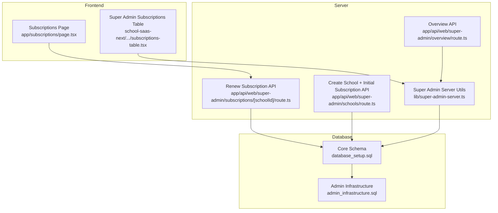
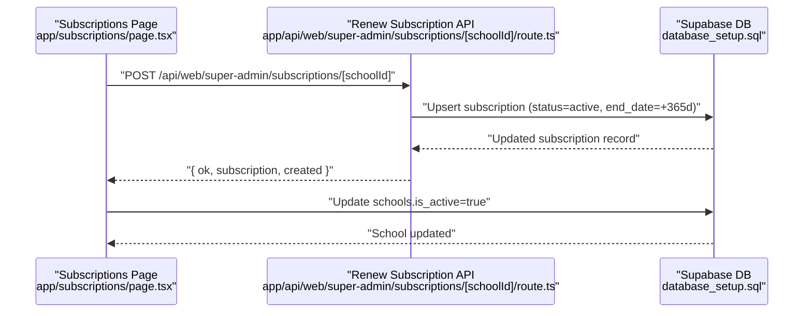
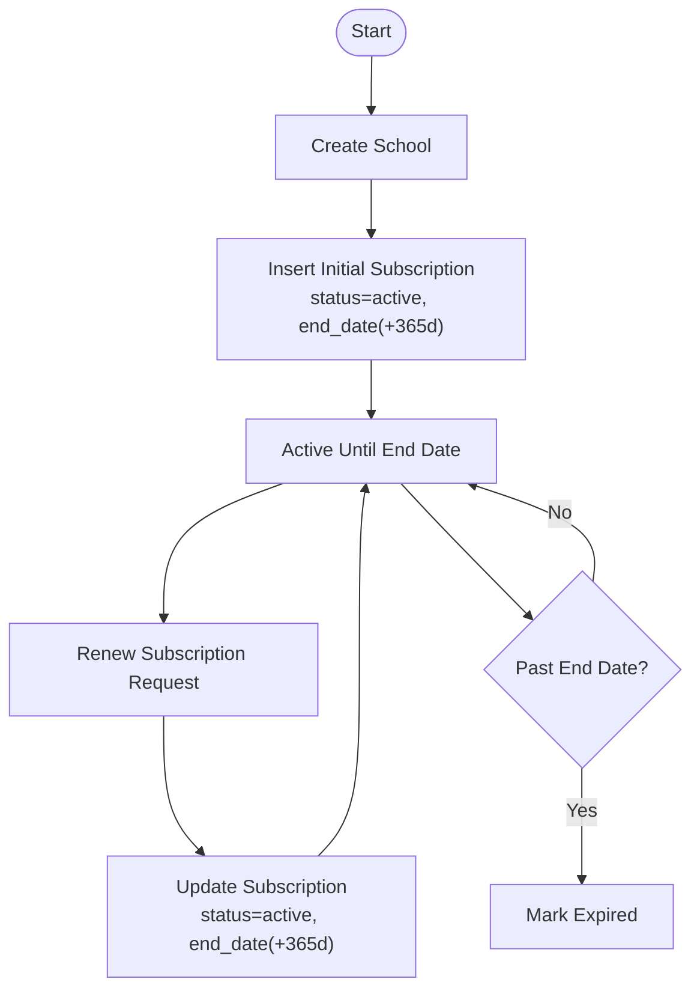
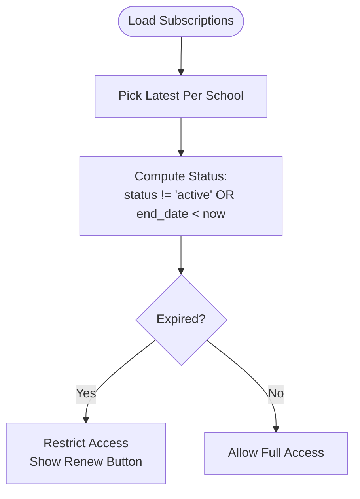
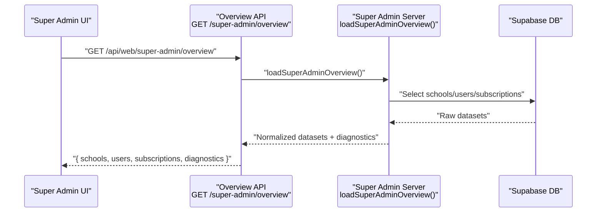
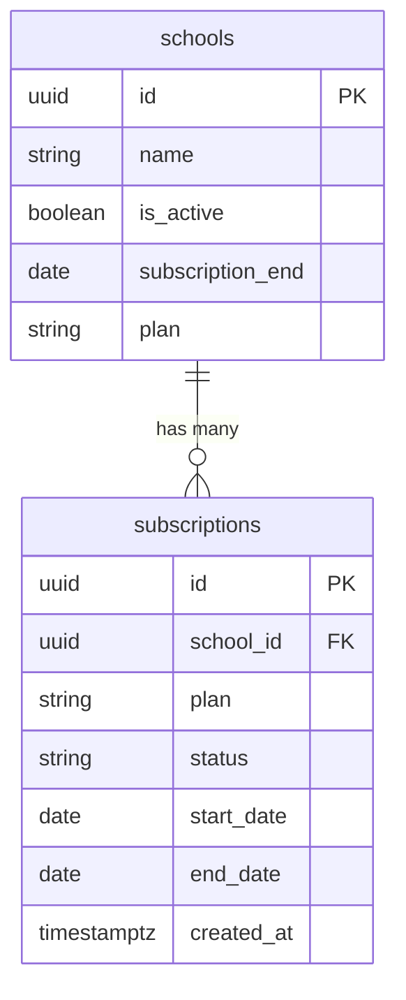
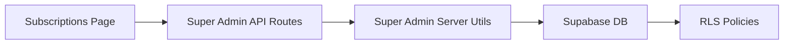

# Subscription Management

<cite>
**Referenced Files in This Document**
- [app/subscriptions/page.tsx](file://app/subscriptions/page.tsx)
- [school-saas-next/src/components/super-admin/subscriptions-table.tsx](file://school-saas-next/src/components/super-admin/subscriptions-table.tsx)
- [lib/super-admin-server.ts](file://lib/super-admin-server.ts)
- [app/api/web/super-admin/overview/route.ts](file://app/api/web/super-admin/overview/route.ts)
- [app/api/web/super-admin/schools/route.ts](file://app/api/web/super-admin/schools/route.ts)
- [app/api/web/super-admin/subscriptions/[schoolId]/route.ts](file://app/api/web/super-admin/subscriptions/[schoolId]/route.ts)
- [database_setup.sql](file://database_setup.sql)
- [admin_infrastructure.sql](file://admin_infrastructure.sql)
</cite>

## Table of Contents
1. [Introduction](#introduction)
2. [Project Structure](#project-structure)
3. [Core Components](#core-components)
4. [Architecture Overview](#architecture-overview)
5. [Detailed Component Analysis](#detailed-component-analysis)
6. [Dependency Analysis](#dependency-analysis)
7. [Performance Considerations](#performance-considerations)
8. [Troubleshooting Guide](#troubleshooting-guide)
9. [Conclusion](#conclusion)

## Introduction
This document describes the subscription management system that controls plan-based access and billing operations across multiple schools. It explains the plan architecture, lifecycle management (activation, renewal, cancellation), expiration handling (grace periods, access restrictions, notifications), and the super admin capabilities to manage subscriptions at scale. It also documents the database design for tracking subscriptions, payment history, and plan entitlements, and outlines business logic, validation rules, and integration points with the Supabase backend.

## Project Structure
The subscription management spans:
- Frontend pages for subscription monitoring and renewal actions
- Super admin server-side utilities for robust data loading and normalization
- API routes for creating schools with initial subscriptions, renewing subscriptions, and fetching overview data
- Database schema defining core entities, constraints, and row-level security policies

**Diagram sources**
- [app/subscriptions/page.tsx:1-201](file://app/subscriptions/page.tsx#L1-L201)
- [school-saas-next/src/components/super-admin/subscriptions-table.tsx:1-64](file://school-saas-next/src/components/super-admin/subscriptions-table.tsx#L1-L64)
- [lib/super-admin-server.ts:1-412](file://lib/super-admin-server.ts#L1-L412)
- [app/api/web/super-admin/overview/route.ts:1-28](file://app/api/web/super-admin/overview/route.ts#L1-L28)
- [app/api/web/super-admin/schools/route.ts:1-147](file://app/api/web/super-admin/schools/route.ts#L1-L147)
- [app/api/web/super-admin/subscriptions/[schoolId]/route.ts:1-84](file://app/api/web/super-admin/subscriptions/[schoolId]/route.ts#L1-L84)
- [database_setup.sql:1-614](file://database_setup.sql#L1-L614)
- [admin_infrastructure.sql:1-156](file://admin_infrastructure.sql#L1-L156)

**Section sources**
- [app/subscriptions/page.tsx:1-201](file://app/subscriptions/page.tsx#L1-L201)
- [school-saas-next/src/components/super-admin/subscriptions-table.tsx:1-64](file://school-saas-next/src/components/super-admin/subscriptions-table.tsx#L1-L64)
- [lib/super-admin-server.ts:1-412](file://lib/super-admin-server.ts#L1-L412)
- [app/api/web/super-admin/overview/route.ts:1-28](file://app/api/web/super-admin/overview/route.ts#L1-L28)
- [app/api/web/super-admin/schools/route.ts:1-147](file://app/api/web/super-admin/schools/route.ts#L1-L147)
- [app/api/web/super-admin/subscriptions/[schoolId]/route.ts:1-84](file://app/api/web/super-admin/subscriptions/[schoolId]/route.ts#L1-L84)
- [database_setup.sql:1-614](file://database_setup.sql#L1-L614)
- [admin_infrastructure.sql:1-156](file://admin_infrastructure.sql#L1-L156)

## Core Components
- Subscription lifecycle UI and actions:
  - Lists latest subscriptions per school, computes active/expired status, and supports renewal via a button.
  - Uses Supabase queries to fetch subscription data joined with school names.
- Super admin server utilities:
  - Normalizes subscription records, handles missing relations/columns gracefully, and builds robust overview datasets.
  - Provides typed records for schools, users, and subscriptions.
- API endpoints:
  - Create a school and immediately provision an initial subscription with a 1-year term.
  - Renew a school’s subscription (extend end date and mark active).
  - Fetch super admin overview data including diagnostics and dataset statuses.
- Database schema:
  - Defines schools, subscriptions, and supporting triggers/functions to keep school-level subscription end dates synchronized.
  - Enforces row-level security for multi-tenant access control.

**Section sources**
- [app/subscriptions/page.tsx:31-106](file://app/subscriptions/page.tsx#L31-L106)
- [lib/super-admin-server.ts:24-63](file://lib/super-admin-server.ts#L24-L63)
- [app/api/web/super-admin/schools/route.ts:46-147](file://app/api/web/super-admin/schools/route.ts#L46-L147)
- [app/api/web/super-admin/subscriptions/[schoolId]/route.ts:11-84](file://app/api/web/super-admin/subscriptions/[schoolId]/route.ts#L11-L84)
- [database_setup.sql:75-157](file://database_setup.sql#L75-L157)

## Architecture Overview
The system integrates frontend UI, server utilities, and backend APIs with Supabase. The database maintains plan tiers, status, and dates, while triggers keep derived fields up to date. Super admin endpoints enforce role-based access and return normalized datasets.

**Diagram sources**
- [app/subscriptions/page.tsx:60-87](file://app/subscriptions/page.tsx#L60-L87)
- [app/api/web/super-admin/subscriptions/[schoolId]/route.ts:11-84](file://app/api/web/super-admin/subscriptions/[schoolId]/route.ts#L11-L84)
- [database_setup.sql:89-139](file://database_setup.sql#L89-L139)

## Detailed Component Analysis

### Subscription Plan Architecture
- Plan tiers:
  - basic, premium, enterprise
  - Stored as text with defaults and constrained updates
- Pricing and feature limitations:
  - Not defined in the analyzed code; plan selection influences subscription status and derived school-level plan field during creation
- Entitlements:
  - Derived from plan stored on schools and enforced by UI logic and RLS policies

**Section sources**
- [app/api/web/super-admin/schools/route.ts:54](file://app/api/web/super-admin/schools/route.ts#L54)
- [database_setup.sql:89-97](file://database_setup.sql#L89-L97)

### Subscription Lifecycle Management
- Activation:
  - On school creation, an initial subscription is inserted with status active and a 1-year end date
- Renewal:
  - Endpoint updates the latest subscription to active and extends end date by 365 days
  - Frontend also toggles school is_active flag
- Cancellation:
  - Not implemented in the analyzed code; can be modeled by setting status to inactive/expired and updating end date accordingly

**Diagram sources**
- [app/api/web/super-admin/schools/route.ts:99-114](file://app/api/web/super-admin/schools/route.ts#L99-L114)
- [app/api/web/super-admin/subscriptions/[schoolId]/route.ts:54-72](file://app/api/web/super-admin/subscriptions/[schoolId]/route.ts#L54-L72)
- [database_setup.sql:102-139](file://database_setup.sql#L102-L139)

**Section sources**
- [app/api/web/super-admin/schools/route.ts:99-114](file://app/api/web/super-admin/schools/route.ts#L99-L114)
- [app/api/web/super-admin/subscriptions/[schoolId]/route.ts:54-72](file://app/api/web/super-admin/subscriptions/[schoolId]/route.ts#L54-L72)
- [app/subscriptions/page.tsx:60-87](file://app/subscriptions/page.tsx#L60-L87)

### Expiration Handling and Access Restrictions
- Expiration detection:
  - Latest subscription per school determines active/expired state
  - If status is not active or end_date is in the past, the subscription is considered expired
- Access restrictions:
  - RLS policies restrict access to subscriptions and schools based on current_app_role and current_school_id
- Notification system:
  - Notifications table exists for alerts; subscription expiring/expired notifications can be integrated via backend jobs or scheduled tasks

**Diagram sources**
- [app/subscriptions/page.tsx:90-106](file://app/subscriptions/page.tsx#L90-L106)
- [database_setup.sql:485-520](file://database_setup.sql#L485-L520)

**Section sources**
- [app/subscriptions/page.tsx:90-106](file://app/subscriptions/page.tsx#L90-L106)
- [database_setup.sql:485-520](file://database_setup.sql#L485-L520)

### Super Admin Functionality
- Overview dashboard:
  - Loads schools, users, and subscriptions with fallbacks for missing relations/columns
  - Returns diagnostics and dataset statuses
- Bulk operations:
  - Renew subscription per school via API endpoint
  - Create school with initial subscription and optional branch creation
- Plan modifications:
  - Subscription plan can be updated when renewing or creating; plan selection influences derived school plan

**Diagram sources**
- [app/api/web/super-admin/overview/route.ts:9-27](file://app/api/web/super-admin/overview/route.ts#L9-L27)
- [lib/super-admin-server.ts:170-354](file://lib/super-admin-server.ts#L170-L354)

**Section sources**
- [app/api/web/super-admin/overview/route.ts:9-27](file://app/api/web/super-admin/overview/route.ts#L9-L27)
- [lib/super-admin-server.ts:170-354](file://lib/super-admin-server.ts#L170-L354)
- [app/api/web/super-admin/schools/route.ts:46-147](file://app/api/web/super-admin/schools/route.ts#L46-L147)

### Practical Examples
- Renewal process:
  - User clicks Renew on the subscriptions page
  - Frontend calls the renew API, updates subscription end date, and re-enables school
- New school onboarding:
  - Super admin creates a school with a selected plan
  - Backend inserts a subscription with status active and 365-day term
- Expired account handling:
  - If end_date is in the past, UI marks as expired and shows renewal option

**Section sources**
- [app/subscriptions/page.tsx:60-87](file://app/subscriptions/page.tsx#L60-L87)
- [app/api/web/super-admin/schools/route.ts:99-114](file://app/api/web/super-admin/schools/route.ts#L99-L114)
- [app/api/web/super-admin/subscriptions/[schoolId]/route.ts:54-72](file://app/api/web/super-admin/subscriptions/[schoolId]/route.ts#L54-L72)

### Database Design for Subscription Tracking
- Core tables and relationships:
  - schools: id, name, is_active, subscription_end, plan
  - subscriptions: id, school_id (FK), plan, status, start_date, end_date, created_at
- Triggers and functions:
  - Trigger updates schools.subscription_end whenever subscriptions change
  - Function recomputes latest end_date per school
- Row-level security:
  - Policies for schools, subscriptions, and user_profiles enforce tenant isolation and role-based access

**Diagram sources**
- [database_setup.sql:75-97](file://database_setup.sql#L75-L97)
- [database_setup.sql:102-139](file://database_setup.sql#L102-L139)

**Section sources**
- [database_setup.sql:75-157](file://database_setup.sql#L75-L157)

### Business Logic and Validation Rules
- Plan normalization:
  - Non-premium/non-enterprise plans are treated as basic
- Status normalization:
  - Non-active or invalid statuses are treated as active unless expired
- Renewal logic:
  - Extend end_date by 365 days; ensure status remains active
- Creation logic:
  - Insert subscription with today as start_date and +365 days as end_date
- RLS constraints:
  - Super admins can manage subscriptions; regular users can only access their own school’s data

**Section sources**
- [lib/super-admin-server.ts:303-316](file://lib/super-admin-server.ts#L303-L316)
- [app/subscriptions/page.tsx:90-106](file://app/subscriptions/page.tsx#L90-L106)
- [app/api/web/super-admin/schools/route.ts:54](file://app/api/web/super-admin/schools/route.ts#L54)
- [app/api/web/super-admin/subscriptions/[schoolId]/route.ts:51-72](file://app/api/web/super-admin/subscriptions/[schoolId]/route.ts#L51-L72)
- [database_setup.sql:485-520](file://database_setup.sql#L485-L520)

### Integration with Payment Processing Systems
- Payment history:
  - No dedicated payments table found in the analyzed schema; accounting system schema exists but is separate
- Billing operations:
  - Renewal sets status active and extends end_date; no explicit payment capture recorded in the analyzed code
- Recommendations:
  - Introduce a payments table linked to subscriptions/invoices and integrate with external processors via webhooks and audit logs

[No sources needed since this section provides general guidance]

## Dependency Analysis
- Frontend depends on Supabase client for queries and mutations
- API routes depend on super admin server utilities for context resolution and data normalization
- Database depends on triggers/functions to maintain referential integrity and derived fields
- RLS policies depend on helper functions to resolve current role and school ID

**Diagram sources**
- [app/subscriptions/page.tsx:50-87](file://app/subscriptions/page.tsx#L50-L87)
- [app/api/web/super-admin/subscriptions/[schoolId]/route.ts:11-84](file://app/api/web/super-admin/subscriptions/[schoolId]/route.ts#L11-L84)
- [lib/super-admin-server.ts:122-168](file://lib/super-admin-server.ts#L122-L168)
- [database_setup.sql:419-446](file://database_setup.sql#L419-L446)

**Section sources**
- [app/subscriptions/page.tsx:50-87](file://app/subscriptions/page.tsx#L50-L87)
- [app/api/web/super-admin/subscriptions/[schoolId]/route.ts:11-84](file://app/api/web/super-admin/subscriptions/[schoolId]/route.ts#L11-L84)
- [lib/super-admin-server.ts:122-168](file://lib/super-admin-server.ts#L122-L168)
- [database_setup.sql:419-446](file://database_setup.sql#L419-L446)

## Performance Considerations
- Indexes on subscriptions (school_id, status) and schools (subscription_end) improve filtering and sorting
- Denormalized subscription_end reduces join overhead for UI calculations
- Batch operations for renewals should leverage upserts and avoid N+1 queries
- RLS checks add minimal overhead but ensure tenant isolation

[No sources needed since this section provides general guidance]

## Troubleshooting Guide
- Authentication/Authorization failures:
  - Verify super admin role and active status; ensure proper Authorization header is sent
- Missing relations/columns:
  - Server utilities include fallbacks for missing relations and columns; check diagnostics in overview response
- Subscription not renewed:
  - Confirm latest subscription exists; ensure school_id matches; verify date arithmetic and status updates
- Expiration not reflected:
  - Check trigger/function correctness and ensure schools.subscription_end is populated
- Notifications:
  - Notifications table exists; implement scheduled tasks to send expiring/expired alerts

**Section sources**
- [lib/super-admin-server.ts:216-231](file://lib/super-admin-server.ts#L216-L231)
- [lib/super-admin-server.ts:386-398](file://lib/super-admin-server.ts#L386-L398)
- [app/api/web/super-admin/subscriptions/[schoolId]/route.ts:43-49](file://app/api/web/super-admin/subscriptions/[schoolId]/route.ts#L43-L49)
- [database_setup.sql:102-139](file://database_setup.sql#L102-L139)
- [admin_infrastructure.sql:44-68](file://admin_infrastructure.sql#L44-L68)

## Conclusion
The subscription management system provides a clear lifecycle for plan-based access control across multiple schools. It leverages Supabase for data persistence, RLS for tenant isolation, and server utilities for robust data handling. While renewal and creation flows are implemented, integrating explicit payment capture and notifications would further strengthen the system. The database design supports efficient querying and maintains derived fields for fast UI rendering.