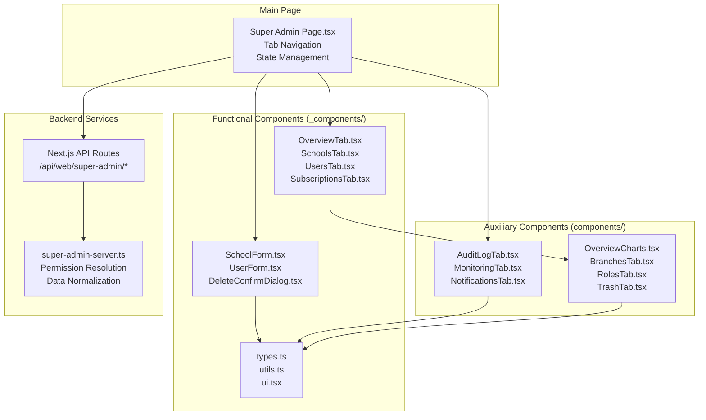
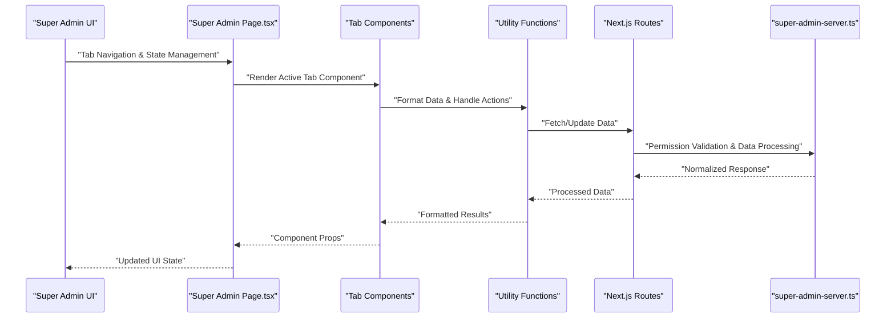
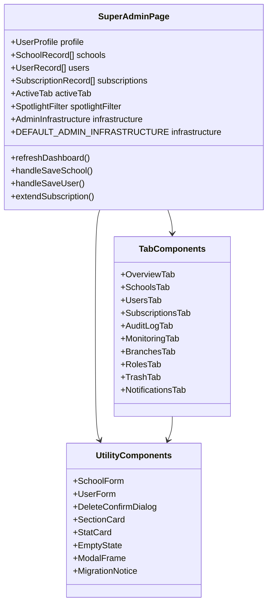
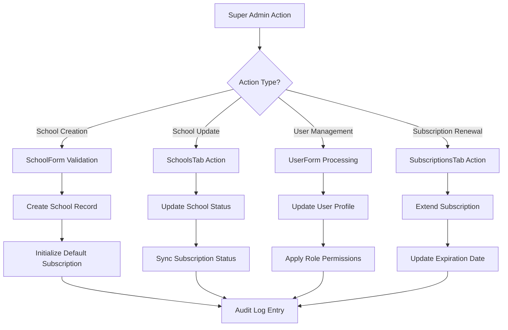
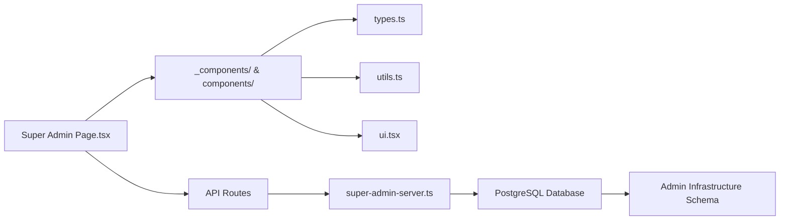

# Super Admin Functionality

<cite>
**Referenced Files in This Document**
- [page.tsx](file://app/[locale]/super-admin/page.tsx)
- [index.ts](file://app/[locale]/super-admin/_components/index.ts)
- [types.ts](file://app/[locale]/super-admin/_components/types.ts)
- [ui.tsx](file://app/[locale]/super-admin/_components/ui.tsx)
- [utils.ts](file://app/[locale]/super-admin/_components/utils.ts)
- [OverviewTab.tsx](file://app/[locale]/super-admin/_components/OverviewTab.tsx)
- [SchoolsTab.tsx](file://app/[locale]/super-admin/_components/SchoolsTab.tsx)
- [UsersTab.tsx](file://app/[locale]/super-admin/_components/UsersTab.tsx)
- [SubscriptionsTab.tsx](file://app/[locale]/super-admin/_components/SubscriptionsTab.tsx)
- [AuditLogTab.tsx](file://app/[locale]/super-admin/components/AuditLogTab.tsx)
- [BranchesTab.tsx](file://app/[locale]/super-admin/components/BranchesTab.tsx)
- [MonitoringTab.tsx](file://app/[locale]/super-admin/components/MonitoringTab.tsx)
- [NotificationsTab.tsx](file://app/[locale]/super-admin/components/NotificationsTab.tsx)
- [OverviewCharts.tsx](file://app/[locale]/super-admin/components/OverviewCharts.tsx)
- [RolesTab.tsx](file://app/[locale]/super-admin/components/RolesTab.tsx)
- [TrashTab.tsx](file://app/[locale]/super-admin/components/TrashTab.tsx)
- [UI.tsx](file://app/[locale]/super-admin/components/UI.tsx)
- [super-admin-server.ts](file://lib/super-admin-server.ts)
- [route.ts](file://app/api/web/super-admin/overview/route.ts)
- [route.ts](file://app/api/web/super-admin/schools/route.ts)
- [route.ts](file://app/api/web/super-admin/schools/[schoolId]/route.ts)
- [route.ts](file://app/api/web/super-admin/users/[userId]/route.ts)
- [route.ts](file://app/api/web/super-admin/subscriptions/[schoolId]/route.ts)
</cite>

## Update Summary
**Changes Made**
- Updated project structure to reflect modularized super-admin architecture with dedicated component directories
- Added documentation for new component separation between `_components` (functional) and `components` (auxiliary)
- Enhanced administrative workflows documentation with improved tab-based navigation
- Updated UI component documentation to include new modular structure
- Expanded coverage of cross-school reporting capabilities with enhanced filtering
- Added comprehensive documentation for new administrative operations and bulk workflows

## Table of Contents
1. [Introduction](#introduction)
2. [Project Structure](#project-structure)
3. [Core Components](#core-components)
4. [Architecture Overview](#architecture-overview)
5. [Detailed Component Analysis](#detailed-component-analysis)
6. [Dependency Analysis](#dependency-analysis)
7. [Performance Considerations](#performance-considerations)
8. [Troubleshooting Guide](#troubleshooting-guide)
9. [Conclusion](#conclusion)
10. [Appendices](#appendices)

## Introduction
This document explains the Super Admin functionality for multi-school administration and system-wide management. The system has been modularized into dedicated component groups for better maintainability and scalability. It covers the Super Admin role hierarchy, elevated permissions, dashboard components, administrative operations, cross-school reporting capabilities, workflows, bulk operations, system maintenance tasks, supporting APIs, backend services, and security considerations.

## Project Structure
The Super Admin feature has been modularized into two main component groups:
- Functional components (`_components/`): Core administrative functionality including tabs, forms, and utilities
- Auxiliary components (`components/`): Supporting panels and specialized views like audit logs, monitoring, and charts

**Diagram sources**
- [page.tsx:44-75](file://app/[locale]/super-admin/page.tsx#L44-L75)
- [index.ts:1-22](file://app/[locale]/super-admin/_components/index.ts#L1-L22)
- [types.ts:1-106](file://app/[locale]/super-admin/_components/types.ts#L1-L106)

**Section sources**
- [page.tsx:1-1069](file://app/[locale]/super-admin/page.tsx#L1-L1069)
- [index.ts:1-22](file://app/[locale]/super-admin/_components/index.ts#L1-L22)
- [types.ts:1-106](file://app/[locale]/super-admin/_components/types.ts#L1-L106)

## Core Components
The modularized architecture separates concerns into distinct component categories:

### Functional Components
- **Tab Components**: Dedicated tabs for overview, schools, users, and subscriptions management
- **Form Components**: Reusable forms for creating and editing schools and users
- **Utility Components**: Shared UI utilities, types, and helper functions

### Auxiliary Components  
- **Audit & Monitoring**: Comprehensive audit logging, system monitoring, and notification management
- **Specialized Views**: Advanced analytics charts, branch management, role administration, and trash management
- **Supporting UI**: Custom UI components and styling utilities

### Enhanced State Management
- Centralized tab navigation with availability-based visibility
- Advanced filtering system with spotlight filters
- Real-time infrastructure detection and feature availability
- Comprehensive error handling and user feedback systems

**Section sources**
- [page.tsx:78-115](file://app/[locale]/super-admin/page.tsx#L78-L115)
- [page.tsx:122-142](file://app/[locale]/super-admin/page.tsx#L122-L142)
- [index.ts:12-22](file://app/[locale]/super-admin/_components/index.ts#L12-L22)
- [ui.tsx:6-161](file://app/[locale]/super-admin/_components/ui.tsx#L6-L161)

## Architecture Overview
The modularized Super Admin architecture follows a component-based layered pattern:

**Diagram sources**
- [page.tsx:117-241](file://app/[locale]/super-admin/page.tsx#L117-L241)
- [OverviewTab.tsx:68-82](file://app/[locale]/super-admin/_components/OverviewTab.tsx#L68-L82)
- [utils.ts:17-22](file://app/[locale]/super-admin/_components/utils.ts#L17-L22)

**Section sources**
- [page.tsx:117-241](file://app/[locale]/super-admin/page.tsx#L117-L241)
- [OverviewTab.tsx:68-82](file://app/[locale]/super-admin/_components/OverviewTab.tsx#L68-L82)

## Detailed Component Analysis

### Modularized Tab System
The Super Admin now features a comprehensive tab-based navigation system with enhanced functionality:

#### Overview Tab
- **Enhanced Analytics**: Interactive charts for plan distribution, role distribution, and subscription health
- **Smart Insights**: Quick action cards for expiring subscriptions, inactive schools, orphan users, and missing branding
- **Recent Activity**: Dashboard of recent school and user additions
- **Dynamic Charts**: Server-side rendered charts with skeleton loading states

#### Schools Management Tab
- **Advanced Filtering**: Real-time search and filter by status, plan, and location
- **Bulk Operations**: One-click activation/deactivation, subscription renewal, and archiving
- **Visual Status Indicators**: Color-coded badges for subscription health and school status
- **Export Capabilities**: CSV export functionality for school data

#### Users Management Tab
- **Dual View Support**: Desktop table view and mobile card layout
- **Role Management**: Color-coded role indicators with custom permission support
- **School Association**: Clear visualization of user-school relationships
- **Bulk Actions**: Export and individual edit/delete operations

#### Subscriptions Management Tab
- **Centralized Renewal**: Direct renewal buttons from the subscription table
- **Health Visualization**: Color-coded status indicators for subscription expiration
- **School Mapping**: Clear association between subscriptions and schools

**Diagram sources**
- [page.tsx:117-169](file://app/[locale]/super-admin/page.tsx#L117-L169)
- [OverviewTab.tsx:52-66](file://app/[locale]/super-admin/_components/OverviewTab.tsx#L52-L66)
- [ui.tsx:6-161](file://app/[locale]/super-admin/_components/ui.tsx#L6-L161)

**Section sources**
- [page.tsx:117-169](file://app/[locale]/super-admin/page.tsx#L117-L169)
- [OverviewTab.tsx:52-66](file://app/[locale]/super-admin/_components/OverviewTab.tsx#L52-L66)
- [SchoolsTab.tsx:10-32](file://app/[locale]/super-admin/_components/SchoolsTab.tsx#L10-L32)
- [UsersTab.tsx:10-26](file://app/[locale]/super-admin/_components/UsersTab.tsx#L10-L26)
- [SubscriptionsTab.tsx:9-19](file://app/[locale]/super-admin/_components/SubscriptionsTab.tsx#L9-L19)

### Enhanced Administrative Workflows
The modularized system provides streamlined administrative workflows:

#### School Management Workflows
- **Creation Workflow**: Form validation, plan selection, subscription initialization, and branding setup
- **Update Workflow**: Toggle activation status, update attributes, and synchronize subscription status
- **Archival Workflow**: Soft-delete with proper audit trail and data preservation

#### User Management Workflows  
- **Provisioning Workflow**: Password requirement enforcement, role assignment, and school association
- **Modification Workflow**: Permission updates, role changes, and status management
- **Deletion Workflow**: Safe archiving with conflict prevention and audit logging

#### Subscription Management Workflows
- **Renewal Workflow**: Automatic extension of existing subscriptions or creation of new ones
- **Status Synchronization**: Real-time updates to reflect subscription changes across the system

**Diagram sources**
- [page.tsx:296-404](file://app/[locale]/super-admin/page.tsx#L296-L404)
- [page.tsx:406-476](file://app/[locale]/super-admin/page.tsx#L406-L476)
- [page.tsx:478-507](file://app/[locale]/super-admin/page.tsx#L478-L507)

**Section sources**
- [page.tsx:296-404](file://app/[locale]/super-admin/page.tsx#L296-L404)
- [page.tsx:406-476](file://app/[locale]/super-admin/page.tsx#L406-L476)
- [page.tsx:478-507](file://app/[locale]/super-admin/page.tsx#L478-L507)

### Cross-School Reporting Capabilities
Enhanced reporting features provide comprehensive system oversight:

#### Advanced Analytics
- **Interactive Charts**: Dynamic visualization of school plans, user roles, and subscription health
- **Real-time Updates**: Live data synchronization with automatic refresh capabilities
- **Export Functionality**: CSV export for all major datasets (schools, users, subscriptions)

#### Intelligent Filtering
- **Spotlight Filters**: Pre-defined filters for inactive schools, expiring subscriptions, orphan users, and missing branding
- **Search Integration**: Combined search across multiple fields with real-time filtering
- **Status-Based Sorting**: Priority sorting for urgent administrative actions

#### Infrastructure Awareness
- **Feature Detection**: Automatic detection of available admin infrastructure features
- **Conditional Rendering**: Tabs and actions appear only when supported by current infrastructure
- **Migration Guidance**: Clear messaging for required infrastructure upgrades

**Section sources**
- [OverviewTab.tsx:83-92](file://app/[locale]/super-admin/_components/OverviewTab.tsx#L83-L92)
- [page.tsx:586-634](file://app/[locale]/super-admin/page.tsx#L586-L634)
- [utils.ts:88-101](file://app/[locale]/super-admin/_components/utils.ts#L88-L101)

### Security and Access Control
Enhanced security measures protect system integrity:

#### Role-Based Access
- **Super Admin Only**: Exclusive access restricted to verified super admin users
- **Permission Validation**: Real-time permission checking for all administrative actions
- **Audit Trail**: Comprehensive logging of all administrative operations

#### Infrastructure Protection
- **Soft Delete Support**: Optional soft delete infrastructure for safe data archival
- **Conflict Prevention**: Automatic prevention of critical operation conflicts
- **Session Management**: Secure session handling with automatic logout on unauthorized access

**Section sources**
- [page.tsx:170-178](file://app/[locale]/super-admin/page.tsx#L170-L178)
- [page.tsx:509-543](file://app/[locale]/super-admin/page.tsx#L509-L543)
- [page.tsx:545-584](file://app/[locale]/super-admin/page.tsx#L545-L584)

## Dependency Analysis
The modularized architecture maintains clear dependency relationships:

**Diagram sources**
- [page.tsx:44-75](file://app/[locale]/super-admin/page.tsx#L44-L75)
- [index.ts:1-22](file://app/[locale]/super-admin/_components/index.ts#L1-L22)

**Section sources**
- [page.tsx:44-75](file://app/[locale]/super-admin/page.tsx#L44-L75)
- [index.ts:1-22](file://app/[locale]/super-admin/_components/index.ts#L1-L22)

## Performance Considerations
The modularized architecture improves performance through:

- **Component Separation**: Independent component loading reduces bundle size
- **Lazy Loading**: Dynamic imports for heavy components like charts
- **Efficient State Management**: Centralized state with selective re-rendering
- **Optimized Data Fetching**: Coordinated API calls with caching strategies

## Troubleshooting Guide
Common issues and resolutions:

### Component Loading Issues
- **Missing Components**: Ensure both `_components/` and `components/` directories are properly structured
- **Import Errors**: Verify correct import paths from the centralized index file
- **Type Definitions**: Check that TypeScript definitions are properly exported

### Infrastructure Requirements
- **Missing Features**: Install required admin infrastructure migrations for advanced features
- **Tab Visibility**: Some tabs may be hidden if infrastructure requirements are not met
- **Action Availability**: Certain actions may be disabled without proper permissions

### Data Synchronization
- **Outdated Data**: Use refresh buttons to update data from API endpoints
- **Cache Issues**: Clear browser cache if stale data appears
- **API Connectivity**: Verify API endpoints are accessible and responding correctly

**Section sources**
- [page.tsx:96-115](file://app/[locale]/super-admin/page.tsx#L96-L115)
- [page.tsx:200-237](file://app/[locale]/super-admin/page.tsx#L200-L237)

## Conclusion
The modularized Super Admin functionality provides a comprehensive, maintainable, and scalable solution for multi-school administration. The separation into functional and auxiliary components enhances code organization while maintaining full functionality. Enhanced workflows, improved reporting capabilities, and robust security measures ensure effective system oversight with minimal operational overhead.

## Appendices

### API Endpoints Summary
- **GET /api/web/super-admin/overview**: Loads system-wide overview data with diagnostics
- **POST /api/web/super-admin/schools**: Creates a new school with default subscription
- **PATCH /api/web/super-admin/schools/[schoolId]**: Updates school attributes or toggles activation
- **DELETE /api/web/super-admin/schools/[schoolId]**: Archives a school if soft-delete enabled
- **PATCH /api/web/super-admin/users/[userId]**: Updates user profile with role and permissions
- **DELETE /api/web/super-admin/users/[userId]**: Archives a user if soft-delete enabled
- **POST /api/web/super-admin/subscriptions/[schoolId]**: Renews or activates a subscription

### Component Directory Structure
- **_components/**: Core functional components (tabs, forms, utilities)
- **components/**: Auxiliary components (panels, charts, specialized views)
- **page.tsx**: Main Super Admin page with tab navigation and state management

**Section sources**
- [route.ts:1-28](file://app/api/web/super-admin/overview/route.ts#L1-L28)
- [route.ts:1-147](file://app/api/web/super-admin/schools/route.ts#L1-L147)
- [route.ts:1-190](file://app/api/web/super-admin/schools/[schoolId]/route.ts#L1-L190)
- [route.ts:1-139](file://app/api/web/super-admin/users/[userId]/route.ts#L1-L139)
- [route.ts:1-84](file://app/api/web/super-admin/subscriptions/[schoolId]/route.ts#L1-L84)