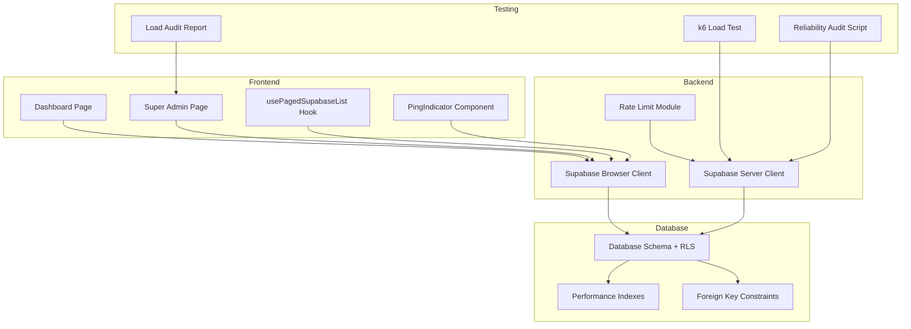
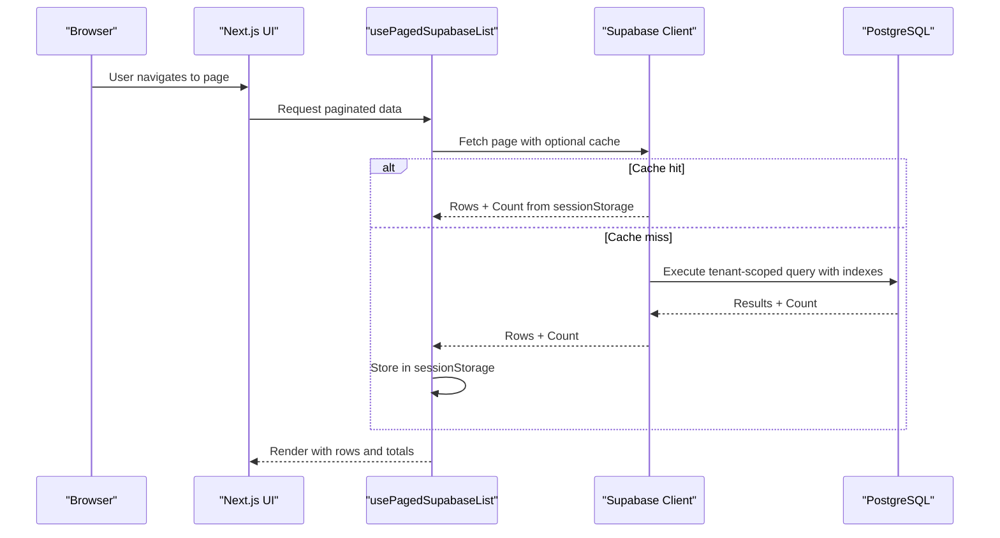
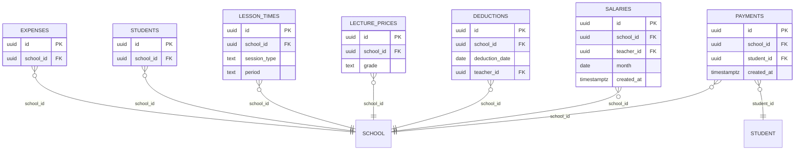
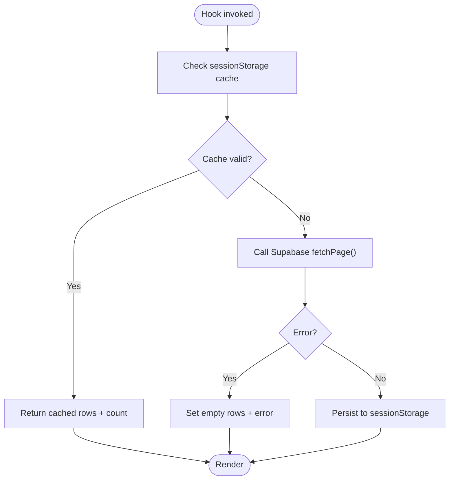
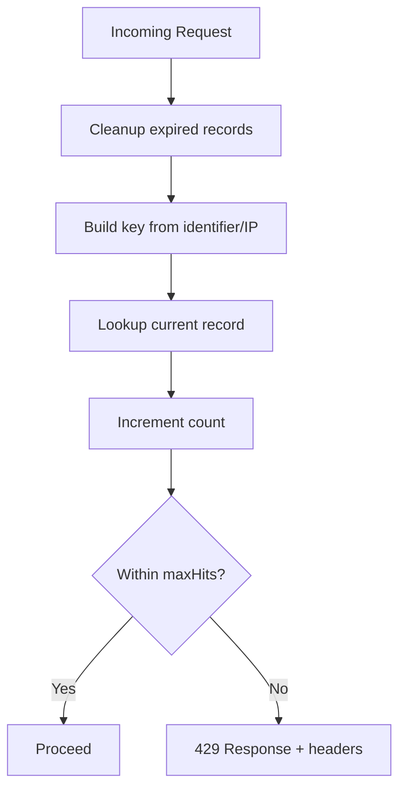
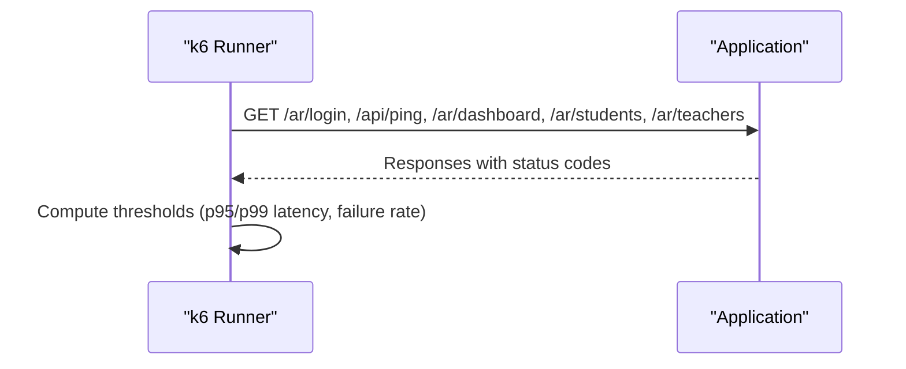
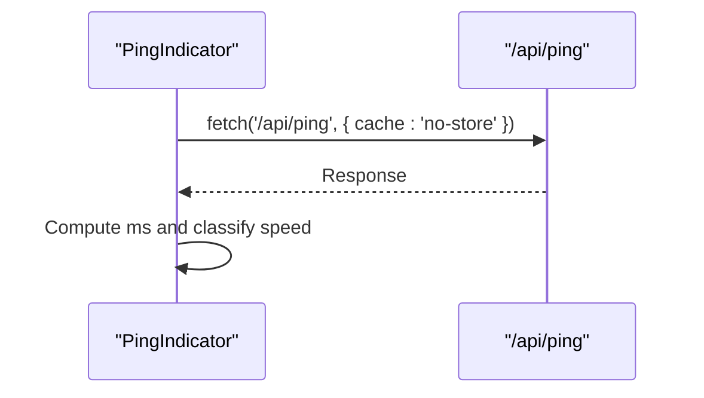
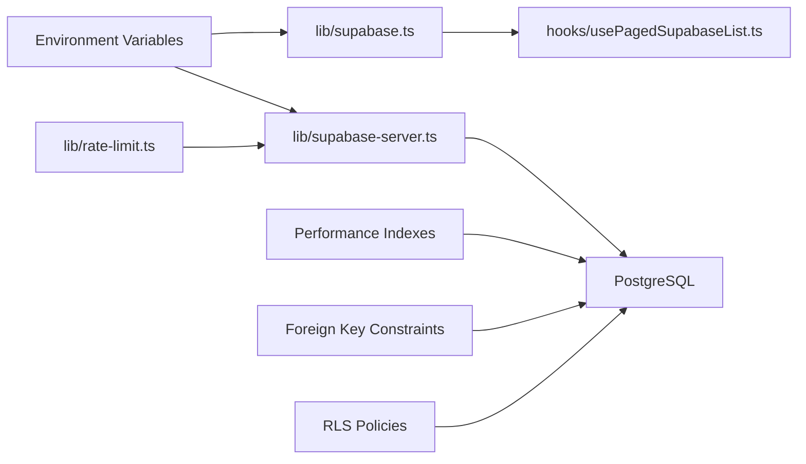

# Performance & Scalability

<cite>
**Referenced Files in This Document**
- [load-test.js](file://load-test.js)
- [artifacts/reliability-audit/load-audit.json](file://artifacts/reliability-audit/load-audit.json)
- [scripts/load-audit.mjs](file://scripts/load-audit.mjs)
- [lib/rate-limit.ts](file://lib/rate-limit.ts)
- [lib/supabase.ts](file://lib/supabase.ts)
- [lib/supabase-server.ts](file://lib/supabase-server.ts)
- [hooks/usePagedSupabaseList.ts](file://hooks/usePagedSupabaseList.ts)
- [migrations/20260324_000000_reliability_performance_indexes.sql](file://migrations/20260324_000000_reliability_performance_indexes.sql)
- [migrations/20260326_020000_account_archives_table.sql](file://migrations/20260326_020000_account_archives_table.sql)
- [migrations/20260330_000000_add_missing_indexes.sql](file://migrations/20260330_000000_add_missing_indexes.sql)
- [database_setup.sql](file://database_setup.sql)
- [admin_infrastructure.sql](file://admin_infrastructure.sql)
- [components/PingIndicator.tsx](file://components/PingIndicator.tsx)
- [app/monitoring/page.tsx](file://app/monitoring/page.tsx)
- [app/[locale]/super-admin/page.tsx](file://app/[locale]/super-admin/page.tsx)
- [app/[locale]/dashboard/page.tsx](file://app/[locale]/dashboard/page.tsx)
- [next.config.ts](file://next.config.ts)
- [package.json](file://package.json)
</cite>

## Update Summary
**Changes Made**
- Updated Database Indexing Strategy section to reflect newly added critical foreign key indexes
- Enhanced Database Constraints section to document standardized CASCADE consistency
- Added new subsection on Foreign Key Index Optimization
- Updated Performance Considerations section with specific index benefits
- Enhanced Troubleshooting Guide with index-related diagnostic guidance

## Table of Contents
1. [Introduction](#introduction)
2. [Project Structure](#project-structure)
3. [Core Components](#core-components)
4. [Architecture Overview](#architecture-overview)
5. [Detailed Component Analysis](#detailed-component-analysis)
6. [Dependency Analysis](#dependency-analysis)
7. [Performance Considerations](#performance-considerations)
8. [Troubleshooting Guide](#troubleshooting-guide)
9. [Conclusion](#conclusion)
10. [Appendices](#appendices)

## Introduction
This document focuses on performance optimization and scalability planning for the school application. It explains how metrics are collected, bottlenecks are identified, and strategies are applied to improve throughput and responsiveness. It documents database indexing and query optimization, caching mechanisms, rate limiting and throttling, load testing and benchmarking, and capacity planning. Practical examples demonstrate frontend and backend improvements, and guidance is provided for multi-tenant scaling and infrastructure needs.

## Project Structure
The performance and scalability surface spans:
- Frontend Next.js application with client-side caching hooks and runtime monitoring indicators
- Backend Supabase integration for SSR and client SDK usage
- Database schema with tenant-aware RLS and performance-focused indexes
- Load testing via k6 and reliability audits via a Node script
- Rate limiting implemented in-process for API protection

**Diagram sources**
- [lib/supabase.ts:1-22](file://lib/supabase.ts#L1-L22)
- [lib/supabase-server.ts:1-75](file://lib/supabase-server.ts#L1-L75)
- [hooks/usePagedSupabaseList.ts:50-121](file://hooks/usePagedSupabaseList.ts#L50-L121)
- [components/PingIndicator.tsx:1-54](file://components/PingIndicator.tsx#L1-L54)
- [lib/rate-limit.ts:1-102](file://lib/rate-limit.ts#L1-L102)
- [migrations/20260324_000000_reliability_performance_indexes.sql:1-24](file://migrations/20260324_000000_reliability_performance_indexes.sql#L1-L24)
- [migrations/20260330_000000_add_missing_indexes.sql:1-11](file://migrations/20260330_000000_add_missing_indexes.sql#L1-L11)
- [database_setup.sql:419-446](file://database_setup.sql#L419-L446)
- [load-test.js:1-45](file://load-test.js#L1-L45)
- [scripts/load-audit.mjs:1-399](file://scripts/load-audit.mjs#L1-L399)
- [artifacts/reliability-audit/load-audit.json:1-237](file://artifacts/reliability-audit/load-audit.json#L1-L237)

**Section sources**
- [lib/supabase.ts:1-22](file://lib/supabase.ts#L1-L22)
- [lib/supabase-server.ts:1-75](file://lib/supabase-server.ts#L1-L75)
- [hooks/usePagedSupabaseList.ts:50-121](file://hooks/usePagedSupabaseList.ts#L50-L121)
- [components/PingIndicator.tsx:1-54](file://components/PingIndicator.tsx#L1-L54)
- [lib/rate-limit.ts:1-102](file://lib/rate-limit.ts#L1-L102)
- [migrations/20260324_000000_reliability_performance_indexes.sql:1-24](file://migrations/20260324_000000_reliability_performance_indexes.sql#L1-L24)
- [migrations/20260330_000000_add_missing_indexes.sql:1-11](file://migrations/20260330_000000_add_missing_indexes.sql#L1-L11)
- [database_setup.sql:419-446](file://database_setup.sql#L419-L446)
- [load-test.js:1-45](file://load-test.js#L1-L45)
- [scripts/load-audit.mjs:1-399](file://scripts/load-audit.mjs#L1-L399)
- [artifacts/reliability-audit/load-audit.json:1-237](file://artifacts/reliability-audit/load-audit.json#L1-L237)

## Core Components
- Database schema and RLS policies enable multi-tenant isolation and efficient tenant-scoped queries.
- Performance indexes reduce scan costs for common filters and sorts, including newly added foreign key indexes.
- Database constraints ensure data integrity with standardized CASCADE behavior for tenant-scoped operations.
- Supabase clients (browser and server) encapsulate environment configuration and authentication flows.
- Client-side caching hook reduces redundant network requests for paginated lists.
- Rate limiting module protects APIs from abuse with sliding windows and cleanup.
- Load testing and reliability audit scripts quantify latency and failure rates under varying concurrency.

**Section sources**
- [database_setup.sql:524-614](file://database_setup.sql#L524-L614)
- [migrations/20260324_000000_reliability_performance_indexes.sql:1-24](file://migrations/20260324_000000_reliability_performance_indexes.sql#L1-L24)
- [migrations/20260330_000000_add_missing_indexes.sql:1-11](file://migrations/20260330_000000_add_missing_indexes.sql#L1-L11)
- [lib/supabase.ts:1-22](file://lib/supabase.ts#L1-L22)
- [lib/supabase-server.ts:1-75](file://lib/supabase-server.ts#L1-L75)
- [hooks/usePagedSupabaseList.ts:50-121](file://hooks/usePagedSupabaseList.ts#L50-L121)
- [lib/rate-limit.ts:1-102](file://lib/rate-limit.ts#L1-L102)
- [load-test.js:1-45](file://load-test.js#L1-L45)
- [scripts/load-audit.mjs:1-399](file://scripts/load-audit.mjs#L1-L399)

## Architecture Overview
The system integrates a Next.js frontend with Supabase for authentication and data persistence. Requests traverse the browser client to the Supabase edge/runtime, which executes tenant-aware queries against PostgreSQL with targeted indexes. Monitoring and load testing feed back insights to guide capacity planning and optimization.

**Diagram sources**
- [hooks/usePagedSupabaseList.ts:50-121](file://hooks/usePagedSupabaseList.ts#L50-L121)
- [lib/supabase.ts:1-22](file://lib/supabase.ts#L1-L22)
- [migrations/20260324_000000_reliability_performance_indexes.sql:1-24](file://migrations/20260324_000000_reliability_performance_indexes.sql#L1-L24)
- [migrations/20260330_000000_add_missing_indexes.sql:1-11](file://migrations/20260330_000000_add_missing_indexes.sql#L1-L11)

## Detailed Component Analysis

### Database Indexing Strategy
- Composite indexes optimize frequent tenant filters and time-based sorting:
  - Payments: school_id, student_id, created_at desc
  - Salaries: school_id, created_at desc; school_id, teacher_id, month
  - Deductions: school_id, deduction_date desc, teacher_id
  - Lecture prices: school_id, grade
  - Lesson times: school_id, session_type, period
- **Updated** Critical foreign key indexes added for improved query performance:
  - Students: school_id
  - Expenses: school_id  
  - Payments: student_id
- Additional indexes on foreign keys and unique constraints ensure fast joins and uniqueness checks.
- Tenant policies restrict access to data scoped by school_id, enforced by RLS.

**Diagram sources**
- [migrations/20260324_000000_reliability_performance_indexes.sql:1-24](file://migrations/20260324_000000_reliability_performance_indexes.sql#L1-L24)
- [migrations/20260330_000000_add_missing_indexes.sql:1-11](file://migrations/20260330_000000_add_missing_indexes.sql#L1-L11)
- [database_setup.sql:524-614](file://database_setup.sql#L524-L614)

**Section sources**
- [migrations/20260324_000000_reliability_performance_indexes.sql:1-24](file://migrations/20260324_000000_reliability_performance_indexes.sql#L1-L24)
- [migrations/20260330_000000_add_missing_indexes.sql:1-11](file://migrations/20260330_000000_add_missing_indexes.sql#L1-L11)
- [database_setup.sql:524-614](file://database_setup.sql#L524-L614)

### Database Constraints and Data Integrity
- **Updated** Standardized CASCADE consistency ensures referential integrity across tenant-scoped operations:
  - Attendance records now use ON DELETE CASCADE for school_id foreign key constraint
  - Matches the CASCADE behavior of other tenant-scoped tables (students, payments, expenses)
  - Prevents orphaned records and maintains data consistency
- RLS policies continue to enforce tenant boundaries and access controls
- Unique constraints and indexes maintain data quality and query performance

**Section sources**
- [migrations/20260330_000000_add_missing_indexes.sql:6-11](file://migrations/20260330_000000_add_missing_indexes.sql#L6-L11)
- [database_setup.sql:29-41](file://database_setup.sql#L29-L41)

### Query Optimization and Caching
- Client-side caching for paginated lists reduces repeated network calls and improves perceived performance.
- SessionStorage cache stores rows, total count, and timestamp; cache is validated by TTL and request sequence.
- Supabase browser client centralizes environment configuration and guards missing keys.

**Diagram sources**
- [hooks/usePagedSupabaseList.ts:50-121](file://hooks/usePagedSupabaseList.ts#L50-L121)
- [lib/supabase.ts:1-22](file://lib/supabase.ts#L1-L22)

**Section sources**
- [hooks/usePagedSupabaseList.ts:50-121](file://hooks/usePagedSupabaseList.ts#L50-L121)
- [lib/supabase.ts:1-22](file://lib/supabase.ts#L1-L22)

### Rate Limiting and Throttling
- In-process rate limiter tracks hits per IP or identifier within a sliding window.
- Cleanup removes expired records periodically to prevent memory growth.
- On exceeding limits, a 429 response is returned with headers indicating limit, remaining, and reset time.

**Diagram sources**
- [lib/rate-limit.ts:1-102](file://lib/rate-limit.ts#L1-L102)

**Section sources**
- [lib/rate-limit.ts:1-102](file://lib/rate-limit.ts#L1-L102)

### Load Testing and Benchmarking
- k6 script defines ramping VUs and thresholds for latency and failure rates across key routes.
- Reliability audit script runs staged tests against admin and super admin routes, capturing latency percentiles and failures.

**Diagram sources**
- [load-test.js:1-45](file://load-test.js#L1-L45)

**Section sources**
- [load-test.js:1-45](file://load-test.js#L1-L45)
- [scripts/load-audit.mjs:1-399](file://scripts/load-audit.mjs#L1-L399)
- [artifacts/reliability-audit/load-audit.json:1-237](file://artifacts/reliability-audit/load-audit.json#L1-L237)

### Monitoring and Diagnostics
- PingIndicator measures round-trip latency to a health endpoint and classifies speed.
- Super Admin page aggregates diagnostics and warnings to surface data load issues.
- Monitoring page redirects to localized monitoring content.

**Diagram sources**
- [components/PingIndicator.tsx:1-54](file://components/PingIndicator.tsx#L1-L54)
- [app/monitoring/page.tsx:1-5](file://app/monitoring/page.tsx#L1-L5)
- [app/[locale]/super-admin/page.tsx](file://app/[locale]/super-admin/page.tsx#L1460-L1484)

**Section sources**
- [components/PingIndicator.tsx:1-54](file://components/PingIndicator.tsx#L1-L54)
- [app/[locale]/super-admin/page.tsx](file://app/[locale]/super-admin/page.tsx#L1460-L1484)
- [app/monitoring/page.tsx:1-5](file://app/monitoring/page.tsx#L1-L5)

## Dependency Analysis
- Supabase clients depend on environment variables for URL and keys; missing keys cause early errors.
- Hooks depend on Supabase client availability and sessionStorage support.
- Rate limiting depends on request headers for IP resolution and uses a Map for in-memory storage.
- Database relies on RLS functions, indexes, and standardized constraints to enforce tenant boundaries and accelerate queries.

**Diagram sources**
- [lib/supabase.ts:1-22](file://lib/supabase.ts#L1-L22)
- [lib/supabase-server.ts:1-75](file://lib/supabase-server.ts#L1-L75)
- [hooks/usePagedSupabaseList.ts:50-121](file://hooks/usePagedSupabaseList.ts#L50-L121)
- [lib/rate-limit.ts:1-102](file://lib/rate-limit.ts#L1-L102)
- [migrations/20260324_000000_reliability_performance_indexes.sql:1-24](file://migrations/20260324_000000_reliability_performance_indexes.sql#L1-L24)
- [migrations/20260330_000000_add_missing_indexes.sql:1-11](file://migrations/20260330_000000_add_missing_indexes.sql#L1-L11)
- [database_setup.sql:419-446](file://database_setup.sql#L419-L446)

**Section sources**
- [lib/supabase.ts:1-22](file://lib/supabase.ts#L1-L22)
- [lib/supabase-server.ts:1-75](file://lib/supabase-server.ts#L1-L75)
- [hooks/usePagedSupabaseList.ts:50-121](file://hooks/usePagedSupabaseList.ts#L50-L121)
- [lib/rate-limit.ts:1-102](file://lib/rate-limit.ts#L1-L102)
- [migrations/20260324_000000_reliability_performance_indexes.sql:1-24](file://migrations/20260324_000000_reliability_performance_indexes.sql#L1-L24)
- [migrations/20260330_000000_add_missing_indexes.sql:1-11](file://migrations/20260330_000000_add_missing_indexes.sql#L1-L11)
- [database_setup.sql:419-446](file://database_setup.sql#L419-L446)

## Performance Considerations
- Database
  - Maintain composite indexes aligned with tenant filters and time-based sorts.
  - **Updated** Leverage newly added foreign key indexes for improved query performance:
    - Students: school_id index for tenant-scoped student queries
    - Expenses: school_id index for expense filtering by school
    - Payments: student_id index for payment history lookups
  - Use RLS functions to enforce tenant scoping and avoid scanning unrelated rows.
  - Monitor slow queries and add targeted indexes for hotspots.
  - **Updated** Ensure consistent CASCADE behavior across all tenant-scoped foreign key constraints.
- Application
  - Prefer client-side caching for paginated datasets to reduce backend load.
  - Minimize re-renders by leveraging cached data and stable references.
  - Use rate limiting to protect APIs during traffic spikes.
- Observability
  - Track latency percentiles and failure rates with k6 and reliability audits.
  - Surface diagnostics in the Super Admin UI to guide proactive tuning.
- Infrastructure
  - Configure Next.js headers for security and performance.
  - Scale horizontally by adding replicas and ensuring stateless server components.

**Section sources**
- [migrations/20260330_000000_add_missing_indexes.sql:1-11](file://migrations/20260330_000000_add_missing_indexes.sql#L1-L11)
- [migrations/20260324_000000_reliability_performance_indexes.sql:1-24](file://migrations/20260324_000000_reliability_performance_indexes.sql#L1-L24)

## Troubleshooting Guide
- Symptom: Elevated p95/p99 latencies under concurrency
  - Action: Review reliability audit stages and k6 thresholds; inspect failing samples and latency distributions.
  - Reference: [artifacts/reliability-audit/load-audit.json:1-237](file://artifacts/reliability-audit/load-audit.json#L1-L237), [load-test.js:1-45](file://load-test.js#L1-L45)
- Symptom: Frequent 401 responses on API routes
  - Action: Verify authentication cookies and session validity; ensure Supabase client initialization succeeds.
  - Reference: [scripts/load-audit.mjs:155-399](file://scripts/load-audit.mjs#L155-L399), [lib/supabase.ts:1-22](file://lib/supabase.ts#L1-L22)
- Symptom: UI feels sluggish during dashboard updates
  - Action: Confirm client caching is enabled and TTL is appropriate; verify index coverage for queries.
  - Reference: [hooks/usePagedSupabaseList.ts:50-121](file://hooks/usePagedSupabaseList.ts#L50-L121), [migrations/20260324_000000_reliability_performance_indexes.sql:1-24](file://migrations/20260324_000000_reliability_performance_indexes.sql#L1-L24)
- Symptom: Rate limit exceeded errors
  - Action: Adjust window and maxHits; ensure cleanup interval prevents memory leaks; inspect headers for diagnostics.
  - Reference: [lib/rate-limit.ts:1-102](file://lib/rate-limit.ts#L1-L102)
- **Updated** Symptom: Slow tenant-scoped queries for students, expenses, or payments
  - Action: Verify foreign key indexes exist and are being utilized; check query plans for proper index usage.
  - Reference: [migrations/20260330_000000_add_missing_indexes.sql:1-11](file://migrations/20260330_000000_add_missing_indexes.sql#L1-L11)
- **Updated** Symptom: Orphaned records after school deletion
  - Action: Verify CASCADE constraints are properly configured; check foreign key constraint definitions.
  - Reference: [migrations/20260330_000000_add_missing_indexes.sql:6-11](file://migrations/20260330_000000_add_missing_indexes.sql#L6-L11)

**Section sources**
- [artifacts/reliability-audit/load-audit.json:1-237](file://artifacts/reliability-audit/load-audit.json#L1-L237)
- [load-test.js:1-45](file://load-test.js#L1-L45)
- [scripts/load-audit.mjs:155-399](file://scripts/load-audit.mjs#L155-L399)
- [lib/supabase.ts:1-22](file://lib/supabase.ts#L1-L22)
- [hooks/usePagedSupabaseList.ts:50-121](file://hooks/usePagedSupabaseList.ts#L50-L121)
- [migrations/20260324_000000_reliability_performance_indexes.sql:1-24](file://migrations/20260324_000000_reliability_performance_indexes.sql#L1-L24)
- [migrations/20260330_000000_add_missing_indexes.sql:1-11](file://migrations/20260330_000000_add_missing_indexes.sql#L1-L11)
- [lib/rate-limit.ts:1-102](file://lib/rate-limit.ts#L1-L102)

## Conclusion
The system employs a layered approach to performance and scalability: robust database indexing and RLS for tenant isolation, client caching to reduce load, rate limiting to protect resources, and comprehensive load testing to quantify and track regressions. **Updated** Recent enhancements include critical foreign key indexes for improved query performance and standardized CASCADE consistency for data integrity. By continuing to monitor latency and failure rates, iteratively adding indexes for hot queries, and expanding caching coverage, the platform can sustain growth while maintaining responsiveness.

## Appendices

### Scaling Considerations for Multi-Tenant Architecture
- Horizontal scaling
  - Stateless server components behind load balancers; scale replicas based on CPU and connections.
  - Use CDN for static assets and consider Next.js output tracing for minimal deployments.
- Database scaling
  - Maintain tenant-focused indexes and RLS policies; partition or archive historical data to control growth.
  - Consider read replicas for reporting workloads; ensure queries leverage indexes.
  - **Updated** Monitor foreign key index performance for tenant-scoped operations.
- Caching
  - Extend client caching to more pages; introduce server-side caching for expensive computations.
- Observability
  - Centralize logs and metrics; instrument critical paths; alert on p95/p99 and error rates.

**Section sources**
- [next.config.ts:1-50](file://next.config.ts#L1-L50)
- [package.json:1-38](file://package.json#L1-L38)
- [migrations/20260326_020000_account_archives_table.sql:1-63](file://migrations/20260326_020000_account_archives_table.sql#L1-L63)
- [database_setup.sql:419-446](file://database_setup.sql#L419-L446)

### Foreign Key Index Optimization
**New Section**

The addition of critical foreign key indexes significantly improves query performance for tenant-scoped operations:

- **Students.school_id Index**: Optimizes queries filtering students by school, enabling fast tenant isolation
- **Expenses.school_id Index**: Accelerates expense queries by school, improving financial reporting performance  
- **Payments.student_id Index**: Enhances payment history lookups per student, reducing query times for payment records

These indexes work in conjunction with existing composite indexes to provide optimal performance for common multi-tenant query patterns.

**Section sources**
- [migrations/20260330_000000_add_missing_indexes.sql:1-11](file://migrations/20260330_000000_add_missing_indexes.sql#L1-L11)
- [database_setup.sql:411-413](file://database_setup.sql#L411-L413)