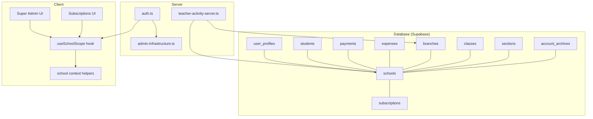
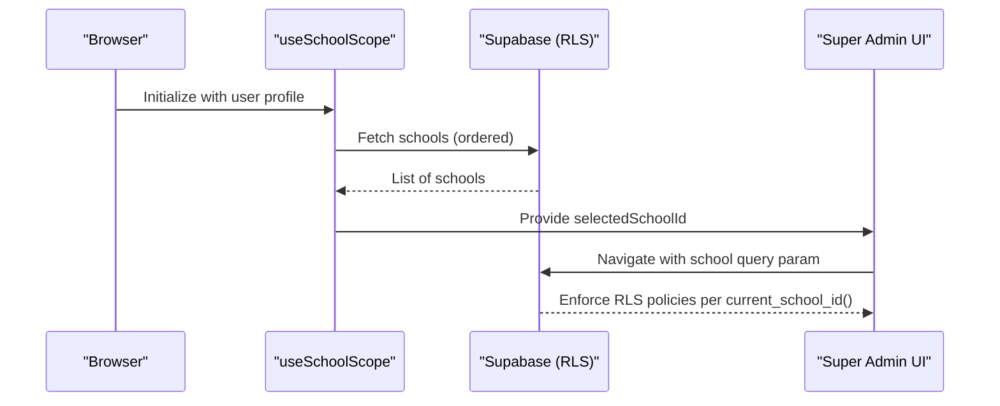
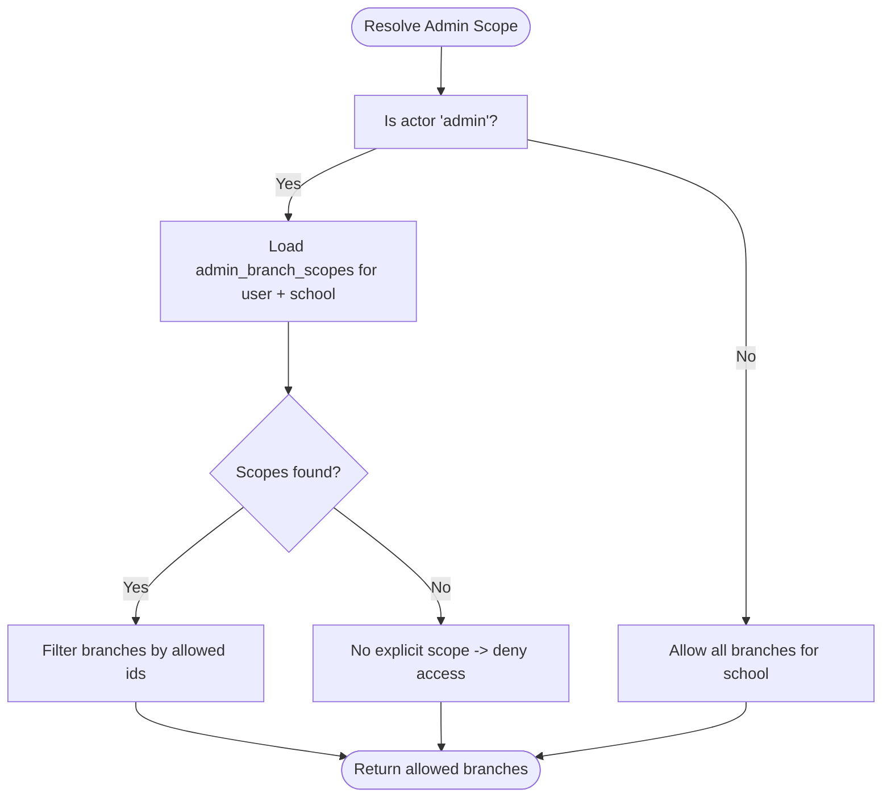
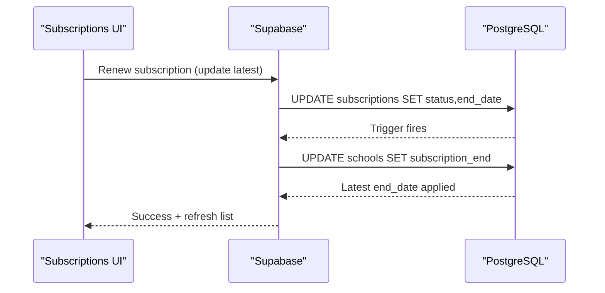
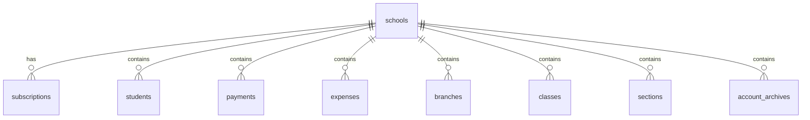
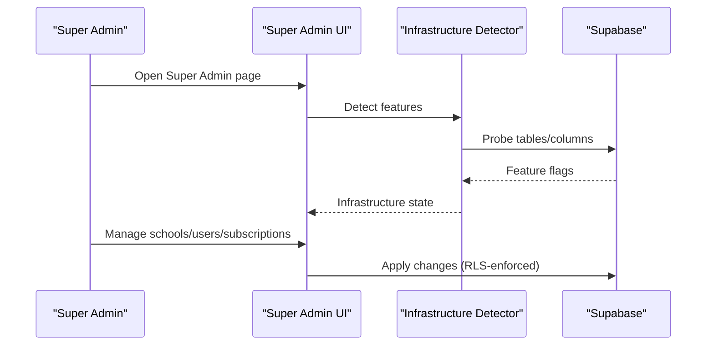
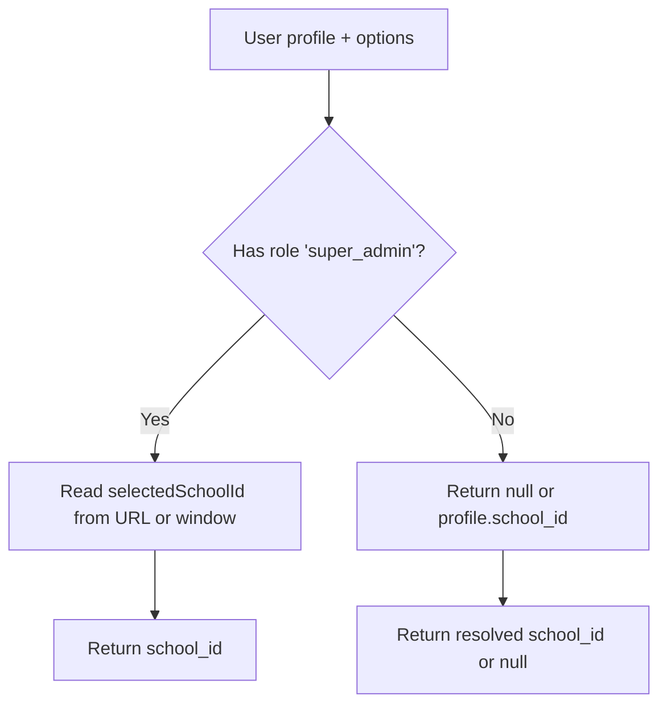
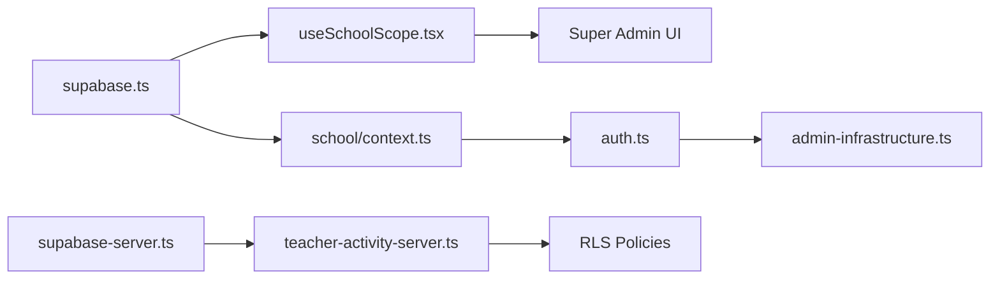

# Multi-Tenancy Model

<cite>
**Referenced Files in This Document**
- [database_setup.sql](file://database_setup.sql)
- [20260322_managed_mobile_rls.sql](file://migrations/20260322_managed_mobile_rls.sql)
- [20260324_010000_academic_records_scope_model.sql](file://migrations/20260324_010000_academic_records_scope_model.sql)
- [20260326_020000_account_archives_table.sql](file://migrations/20260326_020000_account_archives_table.sql)
- [context.ts](file://lib/school/context.ts)
- [scope.ts](file://lib/school/scope.ts)
- [useSchoolScope.tsx](file://hooks/useSchoolScope.tsx)
- [supabase.ts](file://lib/supabase.ts)
- [supabase-server.ts](file://lib/supabase-server.ts)
- [page.tsx (Super Admin)](file://app/[locale]/super-admin/page.tsx)
- [page.tsx (Subscriptions)](file://app/subscriptions/page.tsx)
- [admin-infrastructure.ts](file://lib/admin-infrastructure.ts)
- [auth.ts](file://lib/auth.ts)
- [roles.ts](file://types/roles.ts)
- [teacher-activity-server.ts](file://lib/teacher-activity-server.ts)
</cite>

## Table of Contents
1. [Introduction](#introduction)
2. [Project Structure](#project-structure)
3. [Core Components](#core-components)
4. [Architecture Overview](#architecture-overview)
5. [Detailed Component Analysis](#detailed-component-analysis)
6. [Dependency Analysis](#dependency-analysis)
7. [Performance Considerations](#performance-considerations)
8. [Troubleshooting Guide](#troubleshooting-guide)
9. [Conclusion](#conclusion)

## Introduction
This document explains the multi-tenancy model for the school management system, focusing on how a single application instance supports multiple educational institutions. It covers the school hierarchy and branch management, subscription-based access control, tenant-aware data models enforced via Supabase Row Level Security (RLS), administrative workflows for managing multiple schools, and practical examples of setup, user assignment, and data isolation.

## Project Structure
The multi-tenancy implementation spans database schema, server-side RLS policies, client-side scope resolution, and administrative UIs:
- Database schema defines tenants (schools), subscriptions, and tenant-aware tables with a school_id column.
- Supabase RLS policies enforce per-tenant access for most tables.
- Client-side hooks and utilities resolve the active school and branch for the current user.
- Administrative pages enable super admins to manage schools, users, and subscriptions.

**Diagram sources**
- [database_setup.sql:75-183](file://database_setup.sql#L75-L183)
- [useSchoolScope.tsx:64-166](file://hooks/useSchoolScope.tsx#L64-L166)
- [context.ts:14-73](file://lib/school/context.ts#L14-L73)
- [page.tsx (Super Admin):124-200](file://app/[locale]/super-admin/page.tsx#L124-L200)
- [page.tsx (Subscriptions):31-87](file://app/subscriptions/page.tsx#L31-L87)
- [auth.ts:166-206](file://lib/auth.ts#L166-L206)
- [admin-infrastructure.ts:131-208](file://lib/admin-infrastructure.ts#L131-L208)
- [teacher-activity-server.ts:151-182](file://lib/teacher-activity-server.ts#L151-L182)

**Section sources**
- [database_setup.sql:75-183](file://database_setup.sql#L75-L183)
- [useSchoolScope.tsx:64-166](file://hooks/useSchoolScope.tsx#L64-L166)
- [context.ts:14-73](file://lib/school/context.ts#L14-L73)
- [page.tsx (Super Admin):124-200](file://app/[locale]/super-admin/page.tsx#L124-L200)
- [page.tsx (Subscriptions):31-87](file://app/subscriptions/page.tsx#L31-L87)
- [auth.ts:166-206](file://lib/auth.ts#L166-L206)
- [admin-infrastructure.ts:131-208](file://lib/admin-infrastructure.ts#L131-L208)
- [teacher-activity-server.ts:151-182](file://lib/teacher-activity-server.ts#L151-L182)

## Core Components
- Tenant definition: schools represent tenants. Each tenant has associated subscriptions and child entities (students, payments, expenses, branches, classes, sections, etc.).
- Subscription management: subscriptions define licensing tiers and validity windows; triggers maintain a derived subscription_end on schools.
- RLS enforcement: helper functions expose current_app_role() and current_school_id(), and tenant policies restrict reads/writes to the authenticated user’s role and school.
- Scope resolution: client-side hooks resolve the active school and branch for the current user, with URL-scoped navigation for super admins.
- Administrative controls: super admin UIs manage schools, users, subscriptions, and optional branch soft-deletion infrastructure.

**Section sources**
- [database_setup.sql:75-183](file://database_setup.sql#L75-L183)
- [database_setup.sql:419-446](file://database_setup.sql#L419-L446)
- [database_setup.sql:521-614](file://database_setup.sql#L521-L614)
- [useSchoolScope.tsx:64-166](file://hooks/useSchoolScope.tsx#L64-L166)
- [context.ts:14-73](file://lib/school/context.ts#L14-L73)
- [page.tsx (Super Admin):124-200](file://app/[locale]/super-admin/page.tsx#L124-L200)
- [page.tsx (Subscriptions):31-87](file://app/subscriptions/page.tsx#L31-L87)

## Architecture Overview
The system enforces multi-tenancy through:
- Database-level tenant isolation using school_id on tenant-aware tables.
- Supabase RLS policies that gate access based on current_app_role() and current_school_id().
- Client-side scope selection for super admins and branch-aware queries for admins.
- Administrative workflows to manage schools, users, and subscriptions.

**Diagram sources**
- [useSchoolScope.tsx:64-166](file://hooks/useSchoolScope.tsx#L64-L166)
- [scope.ts:23-49](file://lib/school/scope.ts#L23-L49)
- [database_setup.sql:521-614](file://database_setup.sql#L521-L614)

**Section sources**
- [useSchoolScope.tsx:64-166](file://hooks/useSchoolScope.tsx#L64-L166)
- [scope.ts:23-49](file://lib/school/scope.ts#L23-L49)
- [database_setup.sql:521-614](file://database_setup.sql#L521-L614)

## Detailed Component Analysis

### School Hierarchy and Branch Management
- Schools are the top-level tenants. Optional branches table enables branch-level scoping for admins.
- Admins can be scoped to specific branches via admin_branch_scopes, limiting their visibility to permitted branches.
- Branch soft-delete infrastructure is optional; detection logic adapts UI behavior accordingly.

**Diagram sources**
- [teacher-activity-server.ts:161-182](file://lib/teacher-activity-server.ts#L161-L182)
- [admin-infrastructure.ts:131-208](file://lib/admin-infrastructure.ts#L131-L208)

**Section sources**
- [teacher-activity-server.ts:151-182](file://lib/teacher-activity-server.ts#L151-L182)
- [admin-infrastructure.ts:131-208](file://lib/admin-infrastructure.ts#L131-L208)

### Subscription-Based Access Control
- Subscriptions define licensing tiers and validity windows per school.
- A trigger maintains schools.subscription_end based on the latest subscription record.
- Access decisions consider user role, school activation, subscription status, and expiration.

**Diagram sources**
- [page.tsx (Subscriptions):60-87](file://app/subscriptions/page.tsx#L60-L87)
- [database_setup.sql:102-139](file://database_setup.sql#L102-L139)

**Section sources**
- [page.tsx (Subscriptions):31-106](file://app/subscriptions/page.tsx#L31-L106)
- [database_setup.sql:89-149](file://database_setup.sql#L89-L149)
- [auth.ts:93-104](file://lib/auth.ts#L93-L104)

### Tenant-Aware Data Models and RLS
- Tenant-aware tables include students, payments, expenses, branches, weekly_schedule, lesson_times, lecture_prices, deductions, account_archives, expense_types, classes, sections, class_fees, attendance_records, and others.
- RLS policies enforce:
  - Select/update/delete based on current_app_role() = 'super_admin' OR school_id = current_school_id()
  - Insert with similar checks
- Helper functions current_app_role() and current_school_id() are granted to authenticated users.

**Diagram sources**
- [database_setup.sql:75-183](file://database_setup.sql#L75-L183)
- [database_setup.sql:521-614](file://database_setup.sql#L521-L614)
- [database_setup.sql:419-446](file://database_setup.sql#L419-L446)

**Section sources**
- [database_setup.sql:521-614](file://database_setup.sql#L521-L614)
- [database_setup.sql:419-446](file://database_setup.sql#L419-L446)

### Administrative Workflows
- Super admin dashboard tabs include overview, schools, users, subscriptions, audit logs, roles, trash, notifications, monitoring, and branches.
- Infrastructure detection determines feature availability (e.g., branches, soft delete columns, custom roles, audit logs, notifications).
- Branches tab supports adding/editing branches and optional soft-delete behavior.

**Diagram sources**
- [page.tsx (Super Admin):124-200](file://app/[locale]/super-admin/page.tsx#L124-L200)
- [admin-infrastructure.ts:131-208](file://lib/admin-infrastructure.ts#L131-L208)

**Section sources**
- [page.tsx (Super Admin):85-122](file://app/[locale]/super-admin/page.tsx#L85-L122)
- [admin-infrastructure.ts:131-208](file://lib/admin-infrastructure.ts#L131-L208)

### Client-Side School Scope and Navigation
- useSchoolScope resolves available schools for super admins, caches them, and exposes setSelectedSchoolId to update URL scope.
- buildPathWithSchoolScope injects a school query parameter into localized paths for scoped navigation.
- resolveSchoolIdForProfile and resolveBranchIdForSchool provide server-side helpers to derive scope from user context.

**Diagram sources**
- [useSchoolScope.tsx:64-166](file://hooks/useSchoolScope.tsx#L64-L166)
- [scope.ts:23-49](file://lib/school/scope.ts#L23-L49)
- [context.ts:14-25](file://lib/school/context.ts#L14-L25)

**Section sources**
- [useSchoolScope.tsx:64-166](file://hooks/useSchoolScope.tsx#L64-L166)
- [scope.ts:23-49](file://lib/school/scope.ts#L23-L49)
- [context.ts:14-25](file://lib/school/context.ts#L14-L25)

### Practical Examples

#### Example: School Setup
- Create a school record and optionally add subscription metadata.
- Use the Super Admin UI to manage schools and subscriptions.

**Section sources**
- [database_setup.sql:75-183](file://database_setup.sql#L75-L183)
- [page.tsx (Super Admin):124-200](file://app/[locale]/super-admin/page.tsx#L124-L200)

#### Example: User Assignment Across Schools
- Assign user_profiles.school_id to place a user in a specific school.
- Super admin can create profiles; regular admin manages within their scope.

**Section sources**
- [database_setup.sql:173-183](file://database_setup.sql#L173-L183)
- [auth.ts:188-206](file://lib/auth.ts#L188-L206)

#### Example: Data Isolation Enforcement
- RLS policies ensure authenticated users only access data where current_app_role() = 'super_admin' OR school_id = current_school_id().
- Managed user RLS policies further constrain access for managed accounts.

**Section sources**
- [database_setup.sql:521-614](file://database_setup.sql#L521-L614)
- [20260322_managed_mobile_rls.sql:324-359](file://migrations/20260322_managed_mobile_rls.sql#L324-L359)

## Dependency Analysis
- Client-side scope depends on Supabase client initialization and URL query parameters.
- Server-side helpers depend on Supabase service client and RLS helper functions.
- Administrative UIs depend on infrastructure detection to adapt features.

**Diagram sources**
- [supabase.ts:1-22](file://lib/supabase.ts#L1-L22)
- [supabase-server.ts:1-75](file://lib/supabase-server.ts#L1-L75)
- [useSchoolScope.tsx:64-166](file://hooks/useSchoolScope.tsx#L64-L166)
- [context.ts:14-73](file://lib/school/context.ts#L14-L73)
- [auth.ts:166-206](file://lib/auth.ts#L166-L206)
- [admin-infrastructure.ts:131-208](file://lib/admin-infrastructure.ts#L131-L208)
- [teacher-activity-server.ts:151-182](file://lib/teacher-activity-server.ts#L151-L182)

**Section sources**
- [supabase.ts:1-22](file://lib/supabase.ts#L1-L22)
- [supabase-server.ts:1-75](file://lib/supabase-server.ts#L1-L75)
- [useSchoolScope.tsx:64-166](file://hooks/useSchoolScope.tsx#L64-L166)
- [context.ts:14-73](file://lib/school/context.ts#L14-L73)
- [auth.ts:166-206](file://lib/auth.ts#L166-L206)
- [admin-infrastructure.ts:131-208](file://lib/admin-infrastructure.ts#L131-L208)
- [teacher-activity-server.ts:151-182](file://lib/teacher-activity-server.ts#L151-L182)

## Performance Considerations
- Indexes on foreign keys (e.g., students.school_id, payments.student_id) improve query performance for tenant-scoped lists.
- Caching branch IDs reduces repeated lookups for branch-aware queries.
- Triggers maintain derived fields (e.g., schools.subscription_end) to avoid expensive joins during access checks.

**Section sources**
- [database_setup.sql:411-413](file://database_setup.sql#L411-L413)
- [database_setup.sql:117-139](file://database_setup.sql#L117-L139)
- [context.ts:11-12](file://lib/school/context.ts#L11-L12)

## Troubleshooting Guide
- Subscription status and expiration: Verify latest subscription end_date and status; ensure renewal updates both subscriptions and schools.subscription_end.
- Branch scoping for admins: If admin_branch_scopes is missing or incomplete, admins may not see expected branches; confirm infrastructure detection and table presence.
- Soft delete features: If soft delete columns (deleted_at/deleted_by) are missing, certain UI actions may be disabled; run admin infrastructure provisioning.
- Access denied errors: Confirm current_app_role() and current_school_id() are available and returning expected values; check RLS policy violations.

**Section sources**
- [page.tsx (Subscriptions):60-87](file://app/subscriptions/page.tsx#L60-L87)
- [admin-infrastructure.ts:131-208](file://lib/admin-infrastructure.ts#L131-L208)
- [teacher-activity-server.ts:161-182](file://lib/teacher-activity-server.ts#L161-L182)
- [database_setup.sql:419-446](file://database_setup.sql#L419-L446)

## Conclusion
The system achieves robust multi-tenancy by modeling schools as tenants, enforcing strict RLS policies, and providing clear administrative workflows. Subscription management ties access to licensing tiers, while client-side scope resolution ensures appropriate navigation and data visibility. Optional infrastructure features (branches, soft deletes, custom roles) are detected dynamically to adapt the UI and capabilities.