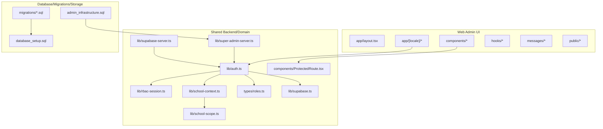
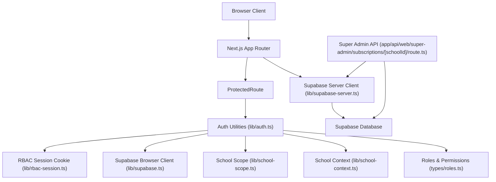
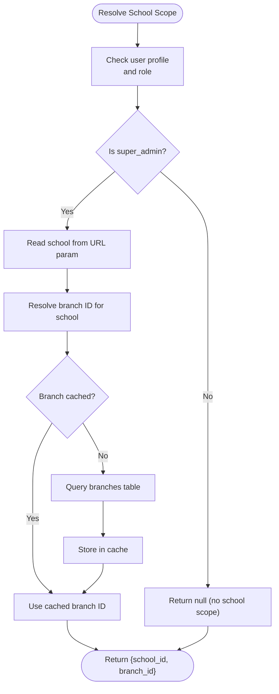
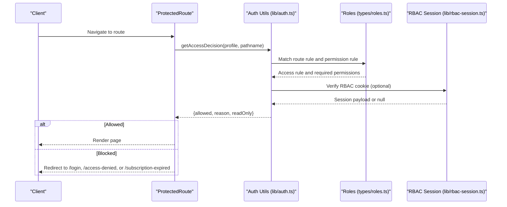
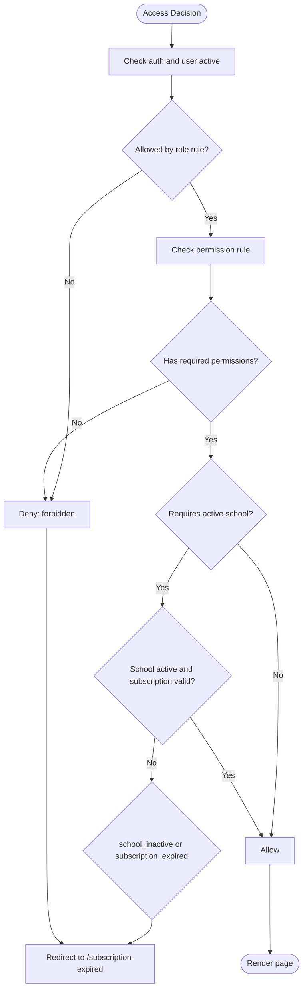
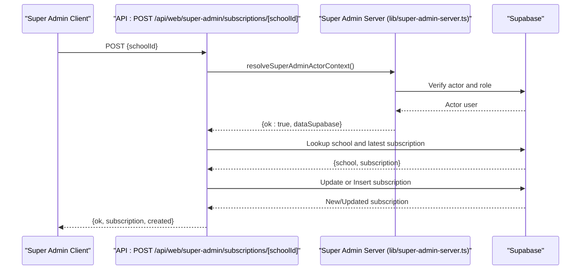
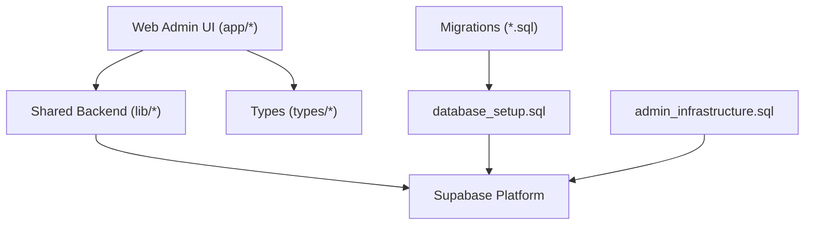
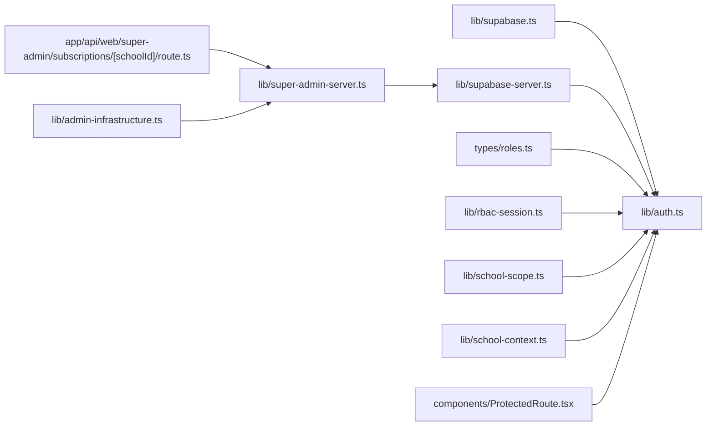

# Project Overview

<cite>
**Referenced Files in This Document**
- [README.md](file://README.md)
- [docs/repo-boundaries.md](file://docs/repo-boundaries.md)
- [migrations/README.md](file://migrations/README.md)
- [app/layout.tsx](file://app/layout.tsx)
- [lib/supabase.ts](file://lib/supabase.ts)
- [lib/supabase-server.ts](file://lib/supabase-server.ts)
- [lib/auth.ts](file://lib/auth.ts)
- [lib/rbac-session.ts](file://lib/rbac-session.ts)
- [lib/school-context.ts](file://lib/school-context.ts)
- [lib/school-scope.ts](file://lib/school-scope.ts)
- [types/roles.ts](file://types/roles.ts)
- [components/ProtectedRoute.tsx](file://components/ProtectedRoute.tsx)
- [lib/super-admin-server.ts](file://lib/super-admin-server.ts)
- [app/api/web/super-admin/subscriptions/[schoolId]/route.ts](file://app/api/web/super-admin/subscriptions/[schoolId]/route.ts)
- [lib/admin-infrastructure.ts](file://lib/admin-infrastructure.ts)
</cite>

## Table of Contents
1. [Introduction](#introduction)
2. [Project Structure](#project-structure)
3. [Core Components](#core-components)
4. [Architecture Overview](#architecture-overview)
5. [Detailed Component Analysis](#detailed-component-analysis)
6. [Dependency Analysis](#dependency-analysis)
7. [Performance Considerations](#performance-considerations)
8. [Troubleshooting Guide](#troubleshooting-guide)
9. [Conclusion](#conclusion)

## Introduction
This project is a Next.js web admin application designed to support educational institution operations. It implements a multi-tenant architecture with role-based access control (RBAC) and integrates tightly with Supabase for authentication, database operations, and row-level security (RLS). The system separates web admin UI concerns from shared backend services and database infrastructure, while maintaining a clear boundary from mobile application concerns. It supports managed accounts, school scope, and subscription-based access control to enable scalable administration across multiple institutions.

## Project Structure
The repository is organized around three primary boundaries:
- Web admin UI: Next.js app routes, components, hooks, and localization assets
- Shared backend/domain logic: Supabase clients, auth utilities, RBAC session management, and route-level access control
- Database, migrations, and storage: SQL migrations, RLS policies, and storage rules

**Diagram sources**
- [app/layout.tsx:1-32](file://app/layout.tsx#L1-L32)
- [lib/auth.ts:1-341](file://lib/auth.ts#L1-L341)
- [lib/rbac-session.ts:1-153](file://lib/rbac-session.ts#L1-L153)
- [lib/school-context.ts:1-74](file://lib/school-context.ts#L1-L74)
- [lib/school-scope.ts:1-50](file://lib/school-scope.ts#L1-L50)
- [types/roles.ts:1-432](file://types/roles.ts#L1-L432)
- [components/ProtectedRoute.tsx:1-72](file://components/ProtectedRoute.tsx#L1-L72)
- [lib/supabase.ts:1-22](file://lib/supabase.ts#L1-L22)
- [lib/supabase-server.ts:1-75](file://lib/supabase-server.ts#L1-L75)
- [lib/super-admin-server.ts:1-412](file://lib/super-admin-server.ts#L1-L412)
- [migrations/README.md:1-31](file://migrations/README.md#L1-L31)
- [docs/repo-boundaries.md:1-59](file://docs/repo-boundaries.md#L1-L59)

**Section sources**
- [README.md:18-29](file://README.md#L18-L29)
- [docs/repo-boundaries.md:1-59](file://docs/repo-boundaries.md#L1-L59)

## Core Components
- Supabase integration: Browser and server-side clients encapsulate environment validation and session handling for secure data access.
- Authentication and RBAC: Centralized user profile resolution, permission normalization, and access decision logic with route-level enforcement.
- School scope and managed accounts: Utilities to resolve active school and branch context, enabling multi-school management and scoped navigation.
- Protected routing: Client-side guard that enforces role and permission rules, redirecting unauthorized users appropriately.
- Super admin infrastructure: Server utilities to inspect admin capability, load overview datasets, and manage subscriptions with compatibility detection.

**Section sources**
- [lib/supabase.ts:1-22](file://lib/supabase.ts#L1-L22)
- [lib/supabase-server.ts:1-75](file://lib/supabase-server.ts#L1-L75)
- [lib/auth.ts:1-341](file://lib/auth.ts#L1-L341)
- [lib/rbac-session.ts:1-153](file://lib/rbac-session.ts#L1-L153)
- [lib/school-context.ts:1-74](file://lib/school-context.ts#L1-L74)
- [lib/school-scope.ts:1-50](file://lib/school-scope.ts#L1-L50)
- [components/ProtectedRoute.tsx:1-72](file://components/ProtectedRoute.tsx#L1-L72)
- [lib/super-admin-server.ts:1-412](file://lib/super-admin-server.ts#L1-L412)

## Architecture Overview
The system follows a layered architecture:
- Presentation layer: Next.js app with localized routes and UI components
- Access control layer: RBAC session, route rules, and protected routes
- Domain and backend layer: Supabase clients, auth utilities, and shared domain logic
- Data layer: Supabase database with RLS, migrations, and storage policies

**Diagram sources**
- [app/layout.tsx:1-32](file://app/layout.tsx#L1-L32)
- [components/ProtectedRoute.tsx:1-72](file://components/ProtectedRoute.tsx#L1-L72)
- [lib/auth.ts:1-341](file://lib/auth.ts#L1-L341)
- [lib/rbac-session.ts:1-153](file://lib/rbac-session.ts#L1-L153)
- [lib/school-scope.ts:1-50](file://lib/school-scope.ts#L1-L50)
- [lib/school-context.ts:1-74](file://lib/school-context.ts#L1-L74)
- [types/roles.ts:1-432](file://types/roles.ts#L1-L432)
- [lib/supabase.ts:1-22](file://lib/supabase.ts#L1-L22)
- [lib/supabase-server.ts:1-75](file://lib/supabase-server.ts#L1-L75)
- [app/api/web/super-admin/subscriptions/[schoolId]/route.ts:1-84](file://app/api/web/super-admin/subscriptions/[schoolId]/route.ts#L1-L84)

## Detailed Component Analysis

### Multi-Tenant Architecture and School Scope
The system enables multi-school management by resolving the active school and branch context per user profile. Super admins can switch scopes via query parameters, while regular users operate within their assigned school. Branch resolution is cached to reduce database queries.

**Diagram sources**
- [lib/school-context.ts:14-74](file://lib/school-context.ts#L14-L74)
- [lib/school-scope.ts:19-50](file://lib/school-scope.ts#L19-L50)

**Section sources**
- [lib/school-context.ts:1-74](file://lib/school-context.ts#L1-L74)
- [lib/school-scope.ts:1-50](file://lib/school-scope.ts#L1-L50)

### Role-Based Access Control (RBAC)
RBAC is enforced through route access rules, permission checks, and a signed RBAC session cookie. Access decisions consider user role, required permissions, active school, and subscription status.

**Diagram sources**
- [components/ProtectedRoute.tsx:18-72](file://components/ProtectedRoute.tsx#L18-L72)
- [lib/auth.ts:106-145](file://lib/auth.ts#L106-L145)
- [types/roles.ts:196-275](file://types/roles.ts#L196-L275)
- [lib/rbac-session.ts:112-153](file://lib/rbac-session.ts#L112-L153)

**Section sources**
- [lib/auth.ts:1-341](file://lib/auth.ts#L1-L341)
- [types/roles.ts:1-432](file://types/roles.ts#L1-L432)
- [lib/rbac-session.ts:1-153](file://lib/rbac-session.ts#L1-L153)
- [components/ProtectedRoute.tsx:1-72](file://components/ProtectedRoute.tsx#L1-L72)

### Subscription-Based Access Control
Subscription status and expiration are integrated into access decisions. For non-super admins, inactive schools or expired subscriptions block access and redirect to the subscription expired page.

**Diagram sources**
- [lib/auth.ts:106-145](file://lib/auth.ts#L106-L145)

**Section sources**
- [lib/auth.ts:71-104](file://lib/auth.ts#L71-L104)
- [lib/auth.ts:106-145](file://lib/auth.ts#L106-L145)

### Super Admin Subscriptions Management
Super admins can renew or activate subscriptions for schools via a dedicated API endpoint. The handler validates the actor’s permissions, resolves the school and latest subscription, and updates or inserts a new subscription record.

**Diagram sources**
- [app/api/web/super-admin/subscriptions/[schoolId]/route.ts:11-84](file://app/api/web/super-admin/subscriptions/[schoolId]/route.ts#L11-L84)
- [lib/super-admin-server.ts:122-168](file://lib/super-admin-server.ts#L122-L168)

**Section sources**
- [app/api/web/super-admin/subscriptions/[schoolId]/route.ts:1-84](file://app/api/web/super-admin/subscriptions/[schoolId]/route.ts#L1-L84)
- [lib/super-admin-server.ts:1-412](file://lib/super-admin-server.ts#L1-L412)

### Relationship to Shared Backend and Database Infrastructure
The system relies on Supabase for authentication and data access, with shared backend logic encapsulated in libraries. Migrations and RLS policies define the managed-user schema and access controls, while admin infrastructure adds advanced capabilities like audit logs and notifications.

**Diagram sources**
- [docs/repo-boundaries.md:1-59](file://docs/repo-boundaries.md#L1-L59)
- [migrations/README.md:1-31](file://migrations/README.md#L1-L31)
- [README.md:18-29](file://README.md#L18-L29)

**Section sources**
- [docs/repo-boundaries.md:1-59](file://docs/repo-boundaries.md#L1-L59)
- [migrations/README.md:1-31](file://migrations/README.md#L1-L31)
- [README.md:18-29](file://README.md#L18-L29)

## Dependency Analysis
- Supabase clients depend on environment variables for URLs and keys; validation ensures safe initialization.
- Auth utilities depend on roles and permissions types, RBAC session utilities, and school scope/resolution logic.
- ProtectedRoute depends on auth utilities and locale routing to compute redirects.
- Super admin APIs depend on admin infrastructure detection and Supabase service client for privileged operations.

**Diagram sources**
- [lib/supabase.ts:1-22](file://lib/supabase.ts#L1-L22)
- [lib/supabase-server.ts:1-75](file://lib/supabase-server.ts#L1-L75)
- [lib/auth.ts:1-341](file://lib/auth.ts#L1-L341)
- [types/roles.ts:1-432](file://types/roles.ts#L1-L432)
- [lib/rbac-session.ts:1-153](file://lib/rbac-session.ts#L1-L153)
- [lib/school-scope.ts:1-50](file://lib/school-scope.ts#L1-L50)
- [lib/school-context.ts:1-74](file://lib/school-context.ts#L1-L74)
- [components/ProtectedRoute.tsx:1-72](file://components/ProtectedRoute.tsx#L1-L72)
- [lib/super-admin-server.ts:1-412](file://lib/super-admin-server.ts#L1-L412)
- [app/api/web/super-admin/subscriptions/[schoolId]/route.ts:1-84](file://app/api/web/super-admin/subscriptions/[schoolId]/route.ts#L1-L84)
- [lib/admin-infrastructure.ts:1-209](file://lib/admin-infrastructure.ts#L1-L209)

**Section sources**
- [lib/supabase.ts:1-22](file://lib/supabase.ts#L1-L22)
- [lib/supabase-server.ts:1-75](file://lib/supabase-server.ts#L1-L75)
- [lib/auth.ts:1-341](file://lib/auth.ts#L1-L341)
- [types/roles.ts:1-432](file://types/roles.ts#L1-L432)
- [lib/rbac-session.ts:1-153](file://lib/rbac-session.ts#L1-L153)
- [lib/school-scope.ts:1-50](file://lib/school-scope.ts#L1-L50)
- [lib/school-context.ts:1-74](file://lib/school-context.ts#L1-L74)
- [components/ProtectedRoute.tsx:1-72](file://components/ProtectedRoute.tsx#L1-L72)
- [lib/super-admin-server.ts:1-412](file://lib/super-admin-server.ts#L1-L412)
- [app/api/web/super-admin/subscriptions/[schoolId]/route.ts:1-84](file://app/api/web/super-admin/subscriptions/[schoolId]/route.ts#L1-L84)
- [lib/admin-infrastructure.ts:1-209](file://lib/admin-infrastructure.ts#L1-L209)

## Performance Considerations
- Cache branch resolution for school-scoped paths to minimize database calls.
- Use lazy loading and route-based code splitting to optimize initial page loads.
- Keep RBAC cookie signing secrets strong and distinct from JWT secrets to avoid cross-service compromise.
- Monitor Supabase query patterns and leverage indexes defined in migrations for frequent joins and filters.

## Troubleshooting Guide
- Environment variables: Ensure Supabase URL and keys are configured; the browser client throws explicit errors if missing.
- RBAC session: Configure a dedicated RBAC cookie secret in production; fallbacks are supported but discouraged.
- Access denied: Review route access rules and permission groups; verify user role and custom permissions.
- Subscription expired: Confirm school subscription status and end date; redirect to subscription expired page when applicable.
- Admin infrastructure: Run admin infrastructure SQL to unlock advanced super admin features and remove compatibility warnings.

**Section sources**
- [lib/supabase.ts:8-19](file://lib/supabase.ts#L8-L19)
- [lib/rbac-session.ts:19-50](file://lib/rbac-session.ts#L19-L50)
- [lib/auth.ts:106-145](file://lib/auth.ts#L106-L145)
- [lib/admin-infrastructure.ts:112-118](file://lib/admin-infrastructure.ts#L112-L118)

## Conclusion
This Next.js web admin application provides a robust, multi-tenant foundation for managing educational institutions. By combining Supabase authentication and database services with a clear separation of concerns—web UI, shared backend logic, and database infrastructure—it delivers scalable RBAC, school scoping, and subscription-aware access control. The architecture supports both conceptual stakeholder understanding and developer-focused implementation details, ensuring maintainability and extensibility across the broader ecosystem.