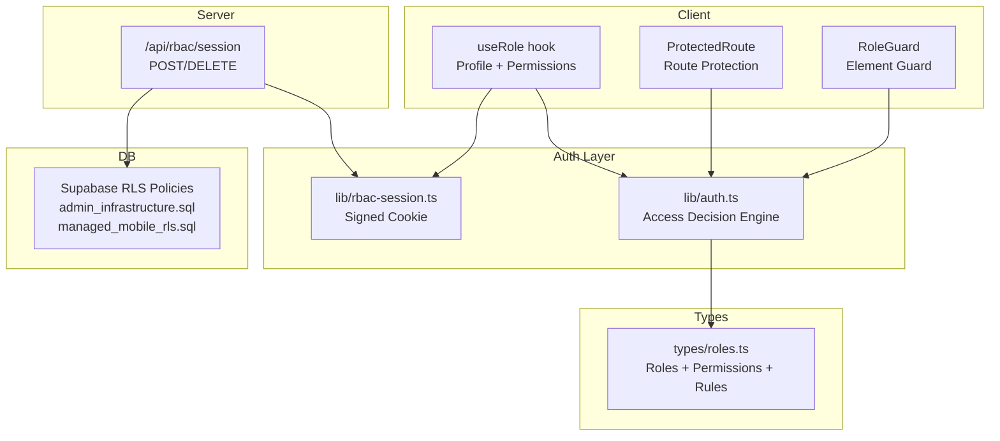
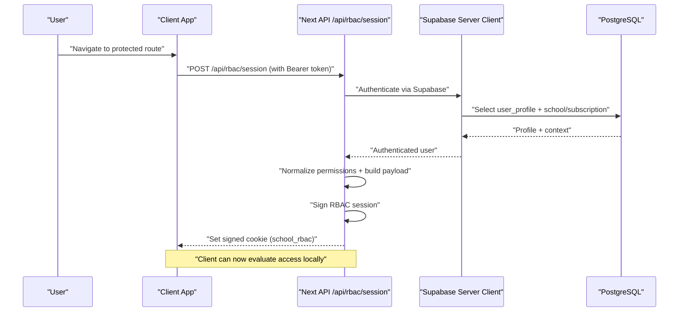
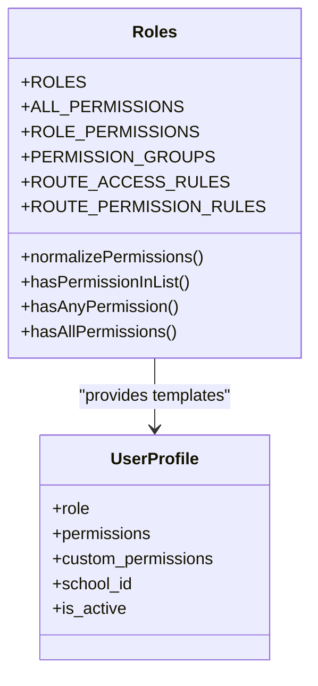
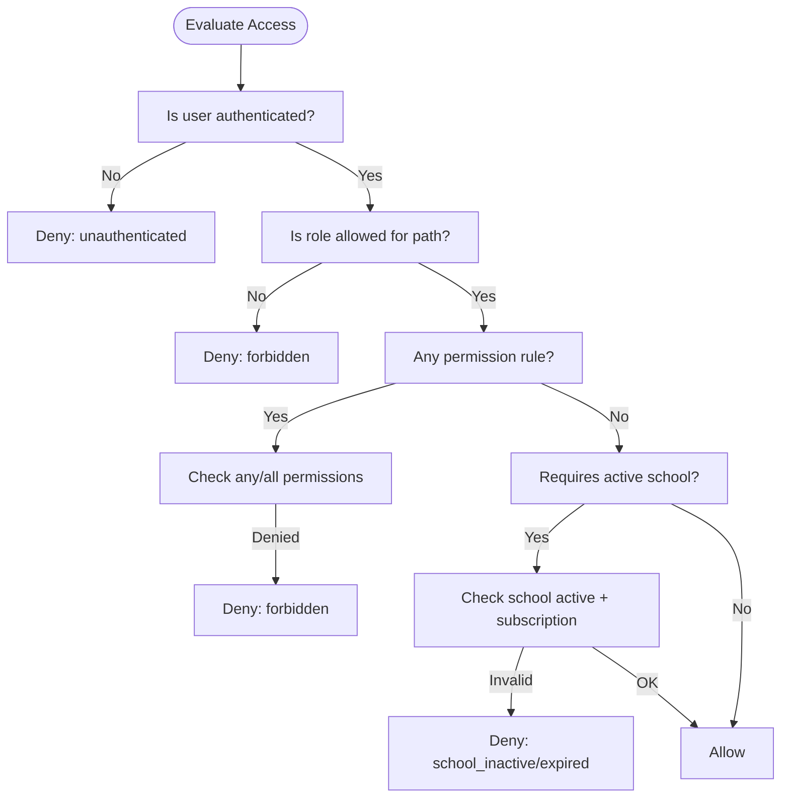
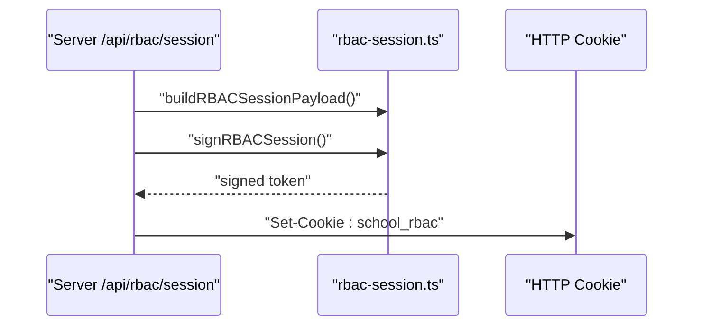
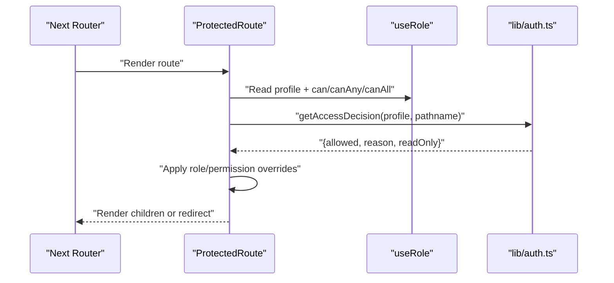
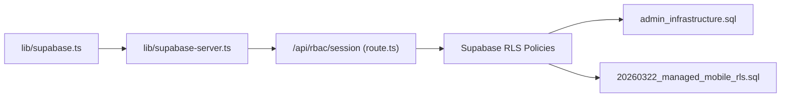
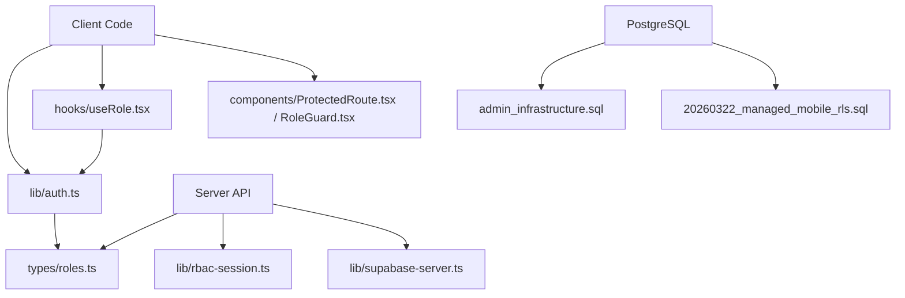

# Role-Based Access Control

<cite>
**Referenced Files in This Document**
- [roles.ts](file://types/roles.ts)
- [auth.ts](file://lib/auth.ts)
- [rbac-session.ts](file://lib/rbac-session.ts)
- [route-permissions.ts](file://lib/route-permissions.ts)
- [ProtectedRoute.tsx](file://components/ProtectedRoute.tsx)
- [RoleGuard.tsx](file://components/RoleGuard.tsx)
- [useRole.tsx](file://hooks/useRole.tsx)
- [session route.ts](file://app/api/rbac/session/route.ts)
- [supabase.ts](file://lib/supabase.ts)
- [supabase-server.ts](file://lib/supabase-server.ts)
- [admin_infrastructure.sql](file://admin_infrastructure.sql)
- [20260322_managed_mobile_rls.sql](file://migrations/20260322_managed_mobile_rls.sql)
</cite>

## Table of Contents
1. [Introduction](#introduction)
2. [Project Structure](#project-structure)
3. [Core Components](#core-components)
4. [Architecture Overview](#architecture-overview)
5. [Detailed Component Analysis](#detailed-component-analysis)
6. [Dependency Analysis](#dependency-analysis)
7. [Performance Considerations](#performance-considerations)
8. [Troubleshooting Guide](#troubleshooting-guide)
9. [Conclusion](#conclusion)

## Introduction
This document explains the role-based access control (RBAC) system that governs permission management and authorization across the application. It covers the hierarchical role structure, permission inheritance, session-based authorization, JWT-based client-side integration, route protection mechanisms, and dynamic permission checks. It also documents how client-side RBAC complements server-side Supabase Row Level Security (RLS) policies.

## Project Structure
The RBAC implementation spans TypeScript definitions, client-side hooks and guards, server-side API endpoints, and database RLS policies:
- Role and permission definitions live in a central type module.
- Client-side logic resolves user profiles, computes access decisions, and manages a signed session cookie.
- Server-side API initializes and clears the RBAC session using a signed cookie.
- Database RLS policies enforce row-level access based on current managed roles and scopes.

**Diagram sources**
- [useRole.tsx:1-177](file://hooks/useRole.tsx#L1-L177)
- [ProtectedRoute.tsx:1-72](file://components/ProtectedRoute.tsx#L1-L72)
- [RoleGuard.tsx:1-18](file://components/RoleGuard.tsx#L1-L18)
- [auth.ts:1-341](file://lib/auth.ts#L1-L341)
- [rbac-session.ts:1-153](file://lib/rbac-session.ts#L1-L153)
- [roles.ts:1-432](file://types/roles.ts#L1-L432)
- [session route.ts:1-155](file://app/api/rbac/session/route.ts#L1-L155)
- [admin_infrastructure.sql:1-156](file://admin_infrastructure.sql#L1-L156)
- [20260322_managed_mobile_rls.sql:1-580](file://migrations/20260322_managed_mobile_rls.sql#L1-L580)

**Section sources**
- [roles.ts:1-432](file://types/roles.ts#L1-L432)
- [auth.ts:1-341](file://lib/auth.ts#L1-L341)
- [rbac-session.ts:1-153](file://lib/rbac-session.ts#L1-L153)
- [session route.ts:1-155](file://app/api/rbac/session/route.ts#L1-L155)
- [ProtectedRoute.tsx:1-72](file://components/ProtectedRoute.tsx#L1-L72)
- [RoleGuard.tsx:1-18](file://components/RoleGuard.tsx#L1-L18)
- [useRole.tsx:1-177](file://hooks/useRole.tsx#L1-L177)
- [admin_infrastructure.sql:1-156](file://admin_infrastructure.sql#L1-L156)
- [20260322_managed_mobile_rls.sql:1-580](file://migrations/20260322_managed_mobile_rls.sql#L1-L580)

## Core Components
- Role and permission definitions: Centralized role hierarchy, permission sets, normalization, and route-level rules.
- Access decision engine: Computes allowed vs denied decisions based on role, permissions, and route rules.
- Signed RBAC session: A short-lived, server-signed cookie containing role, permissions, and subscription context.
- Route protection: Client-side guards and server-side API endpoint to initialize/clear the RBAC session.
- Dynamic permission checks: Utilities to check single/multiple permissions and path access.
- Supabase integration: Client SDK initialization and server-side Supabase clients for authenticated requests.

**Section sources**
- [roles.ts:1-432](file://types/roles.ts#L1-L432)
- [auth.ts:1-341](file://lib/auth.ts#L1-L341)
- [rbac-session.ts:1-153](file://lib/rbac-session.ts#L1-L153)
- [session route.ts:1-155](file://app/api/rbac/session/route.ts#L1-L155)
- [ProtectedRoute.tsx:1-72](file://components/ProtectedRoute.tsx#L1-L72)
- [RoleGuard.tsx:1-18](file://components/RoleGuard.tsx#L1-L18)
- [useRole.tsx:1-177](file://hooks/useRole.tsx#L1-L177)
- [supabase.ts:1-22](file://lib/supabase.ts#L1-L22)
- [supabase-server.ts:1-75](file://lib/supabase-server.ts#L1-L75)

## Architecture Overview
The RBAC architecture combines client-side role/permission resolution with a server-managed signed session cookie. The server validates the user’s session, loads their profile, normalizes permissions, and writes a signed cookie. The client reads this cookie to make fast, local decisions about route access and UI rendering.

**Diagram sources**
- [session route.ts:14-133](file://app/api/rbac/session/route.ts#L14-L133)
- [rbac-session.ts:112-139](file://lib/rbac-session.ts#L112-L139)
- [supabase-server.ts:60-74](file://lib/supabase-server.ts#L60-L74)

## Detailed Component Analysis

### Role and Permission Model
- Roles: super_admin, admin, employee.
- Permissions: granular capabilities grouped by domain (students, payments, salaries, branches, monitoring, subscriptions, etc.).
- Permission inheritance: super_admin inherits all permissions; admin and employee inherit subsets.
- Normalization: input permissions are validated against allowed set and normalized; full_access grants all.
- Route rules: path prefixes map to allowed roles and optional permission requirements.

**Diagram sources**
- [roles.ts:1-432](file://types/roles.ts#L1-L432)

**Section sources**
- [roles.ts:1-432](file://types/roles.ts#L1-L432)

### Access Decision Engine
- Determines whether a user can access a given path based on:
  - Role allowance per route.
  - Optional permission requirements (any/all).
  - Active school and subscription status for non-super-admins.
- Provides read-only hints per route.

**Diagram sources**
- [auth.ts:106-145](file://lib/auth.ts#L106-L145)
- [roles.ts:183-282](file://types/roles.ts#L183-L282)

**Section sources**
- [auth.ts:106-145](file://lib/auth.ts#L106-L145)
- [roles.ts:183-282](file://types/roles.ts#L183-L282)

### Session-Based Authorization (Signed Cookie)
- The server builds an RBAC payload with role, permissions, and subscription context, signs it, and stores it in a secure, HTTP-only cookie.
- The client verifies the cookie server-side and uses it for fast local checks.
- Secrets:
  - Dedicated RBAC_COOKIE_SECRET is preferred.
  - In production, fallback to SUPABASE_JWT_SECRET is discouraged; errors are thrown if not configured.
  - In development, warnings are logged if no secret is present.

**Diagram sources**
- [session route.ts:112-132](file://app/api/rbac/session/route.ts#L112-L132)
- [rbac-session.ts:56-119](file://lib/rbac-session.ts#L56-L119)

**Section sources**
- [rbac-session.ts:19-54](file://lib/rbac-session.ts#L19-L54)
- [rbac-session.ts:112-139](file://lib/rbac-session.ts#L112-L139)
- [session route.ts:112-132](file://app/api/rbac/session/route.ts#L112-L132)

### Route Protection with Guards
- ProtectedRoute: Client-side guard that redirects unauthorized users and enforces role/permission checks before rendering.
- RoleGuard: Conditional rendering wrapper based on user role.

**Diagram sources**
- [ProtectedRoute.tsx:33-71](file://components/ProtectedRoute.tsx#L33-L71)
- [useRole.tsx:119-131](file://hooks/useRole.tsx#L119-L131)
- [auth.ts:106-145](file://lib/auth.ts#L106-L145)

**Section sources**
- [ProtectedRoute.tsx:1-72](file://components/ProtectedRoute.tsx#L1-L72)
- [RoleGuard.tsx:1-18](file://components/RoleGuard.tsx#L1-L18)
- [useRole.tsx:119-131](file://hooks/useRole.tsx#L119-L131)

### Dynamic Permission Checking
- Single permission: hasPermission(profile, permission).
- Multiple permissions: canAny(can), canAll(can), or explicit requireAllPermissions flag in ProtectedRoute.
- Path-level checks: canAccessPath(pathname), isReadOnlyPath(pathname).

**Section sources**
- [auth.ts:79-87](file://lib/auth.ts#L79-L87)
- [useRole.tsx:88-109](file://hooks/useRole.tsx#L88-L109)
- [ProtectedRoute.tsx:47-52](file://components/ProtectedRoute.tsx#L47-L52)

### Supabase Integration and RLS
- Client SDK initialization ensures environment variables are present.
- Server-side Supabase clients:
  - createRouteSupabaseClient: for authenticated routes using cookies.
  - createServiceSupabaseClient: for service-role operations.
- RLS policies:
  - Admin infrastructure policies restrict sensitive tables to super_admin.
  - Managed user RLS functions and policies enforce fine-grained access for students, teachers, assignments, grades, attendance, and notifications.

**Diagram sources**
- [supabase.ts:1-22](file://lib/supabase.ts#L1-L22)
- [supabase-server.ts:5-74](file://lib/supabase-server.ts#L5-L74)
- [session route.ts:43-110](file://app/api/rbac/session/route.ts#L43-L110)
- [admin_infrastructure.sql:29-90](file://admin_infrastructure.sql#L29-L90)
- [20260322_managed_mobile_rls.sql:315-577](file://migrations/20260322_managed_mobile_rls.sql#L315-L577)

**Section sources**
- [supabase.ts:1-22](file://lib/supabase.ts#L1-L22)
- [supabase-server.ts:5-74](file://lib/supabase-server.ts#L5-L74)
- [admin_infrastructure.sql:29-90](file://admin_infrastructure.sql#L29-L90)
- [20260322_managed_mobile_rls.sql:315-577](file://migrations/20260322_managed_mobile_rls.sql#L315-L577)

## Dependency Analysis
- Client depends on:
  - lib/auth.ts for access decisions and profile retrieval.
  - hooks/useRole.tsx for reactive role/permission state.
  - components/ProtectedRoute.tsx and components/RoleGuard.tsx for UI protection.
- Server depends on:
  - types/roles.ts for permission normalization and route rules.
  - lib/rbac-session.ts for cookie signing/verification.
  - lib/supabase-server.ts for authenticated Supabase queries.
- Database depends on:
  - RLS policies to enforce row-level access.

**Diagram sources**
- [auth.ts:1-341](file://lib/auth.ts#L1-L341)
- [useRole.tsx:1-177](file://hooks/useRole.tsx#L1-L177)
- [ProtectedRoute.tsx:1-72](file://components/ProtectedRoute.tsx#L1-L72)
- [RoleGuard.tsx:1-18](file://components/RoleGuard.tsx#L1-L18)
- [roles.ts:1-432](file://types/roles.ts#L1-L432)
- [rbac-session.ts:1-153](file://lib/rbac-session.ts#L1-L153)
- [supabase-server.ts:1-75](file://lib/supabase-server.ts#L1-L75)
- [admin_infrastructure.sql:1-156](file://admin_infrastructure.sql#L1-L156)
- [20260322_managed_mobile_rls.sql:1-580](file://migrations/20260322_managed_mobile_rls.sql#L1-L580)

**Section sources**
- [auth.ts:1-341](file://lib/auth.ts#L1-L341)
- [useRole.tsx:1-177](file://hooks/useRole.tsx#L1-L177)
- [ProtectedRoute.tsx:1-72](file://components/ProtectedRoute.tsx#L1-L72)
- [RoleGuard.tsx:1-18](file://components/RoleGuard.tsx#L1-L18)
- [roles.ts:1-432](file://types/roles.ts#L1-L432)
- [rbac-session.ts:1-153](file://lib/rbac-session.ts#L1-L153)
- [supabase-server.ts:1-75](file://lib/supabase-server.ts#L1-L75)
- [admin_infrastructure.sql:1-156](file://admin_infrastructure.sql#L1-L156)
- [20260322_managed_mobile_rls.sql:1-580](file://migrations/20260322_managed_mobile_rls.sql#L1-L580)

## Performance Considerations
- Local evaluation: Access decisions are computed client-side after profile refresh, minimizing server round-trips.
- Cooldown synchronization: The role provider cools down RBAC session refreshes to reduce redundant cookie updates.
- Rate limits: The RBAC session endpoint applies rate limiting to prevent abuse.
- Efficient normalization: Permission lists are normalized once per session initialization.

**Section sources**
- [useRole.tsx:39](file://hooks/useRole.tsx#L39)
- [session route.ts:32-40](file://app/api/rbac/session/route.ts#L32-L40)
- [rbac-session.ts:112-139](file://lib/rbac-session.ts#L112-L139)

## Troubleshooting Guide
- RBAC secret not configured:
  - Symptom: Server returns 500 with a message indicating RBAC secret is not configured.
  - Resolution: Set RBAC_COOKIE_SECRET in production; in development, configure SUPABASE_JWT_SECRET only if necessary.
- Unauthorized or missing session:
  - Symptom: 401 Unauthorized on RBAC session endpoint.
  - Resolution: Ensure a valid Bearer token or active Supabase session is present.
- Profile not found:
  - Symptom: 404 Profile not found when initializing RBAC session.
  - Resolution: Verify user profile exists and is readable by the authenticated user.
- Forbidden access:
  - Symptom: Redirect to access-denied; reason indicates forbidden.
  - Resolution: Check role allowances and permission rules for the path; confirm user has required permissions.
- Subscription or school inactive:
  - Symptom: Redirect to subscription-expired; reason indicates school_inactive or subscription_expired.
  - Resolution: Activate school, renew subscription, or ensure user is super_admin.

**Section sources**
- [rbac-session.ts:19-54](file://lib/rbac-session.ts#L19-L54)
- [session route.ts:15-20](file://app/api/rbac/session/route.ts#L15-L20)
- [session route.ts:28-30](file://app/api/rbac/session/route.ts#L28-L30)
- [session route.ts:49-56](file://app/api/rbac/session/route.ts#L49-L56)
- [auth.ts:106-145](file://lib/auth.ts#L106-L145)

## Conclusion
The RBAC system combines a centralized role/permission model with a server-signed session cookie to enable efficient, client-side access control. It integrates tightly with Supabase for authentication and enforces robust row-level security policies at the database level. Together, these layers provide strong authorization guarantees across the application.