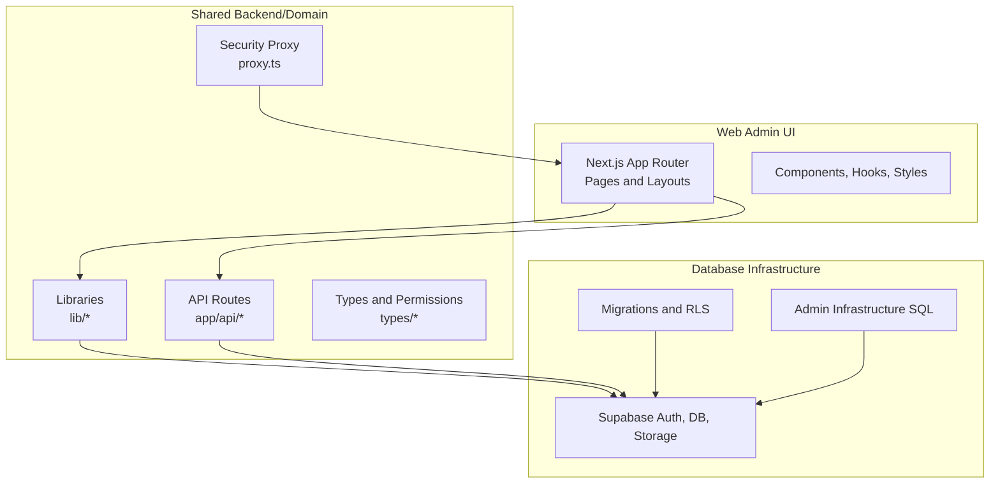
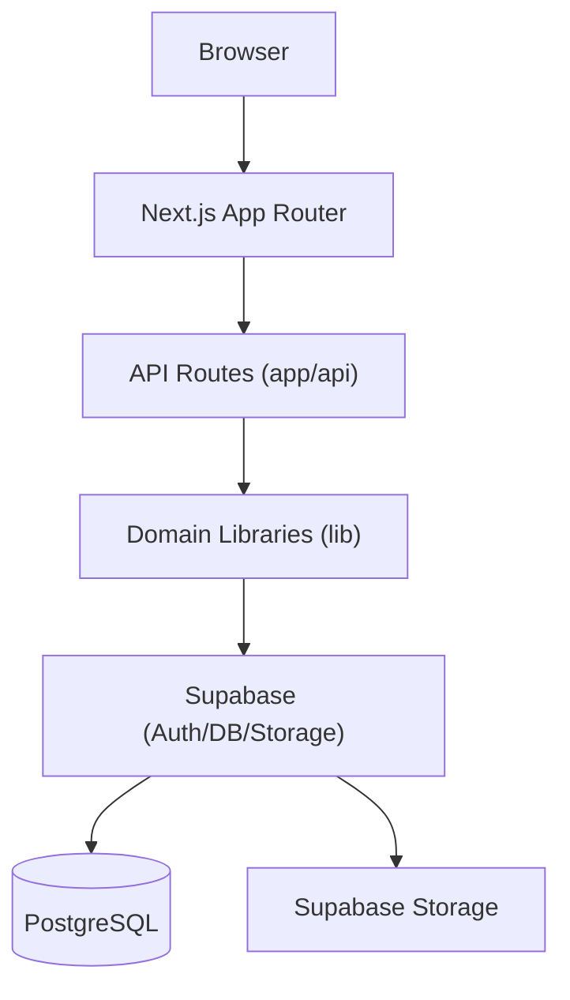
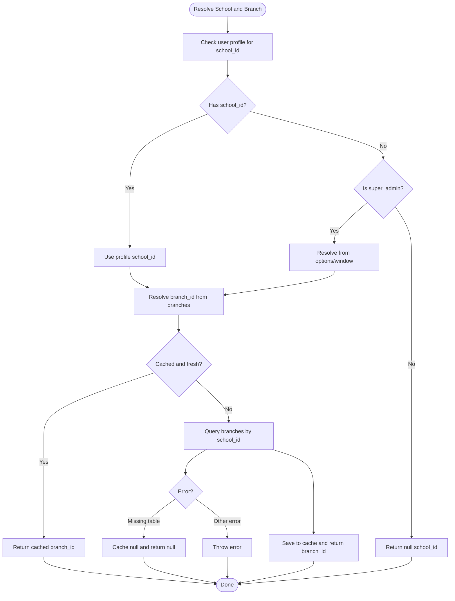
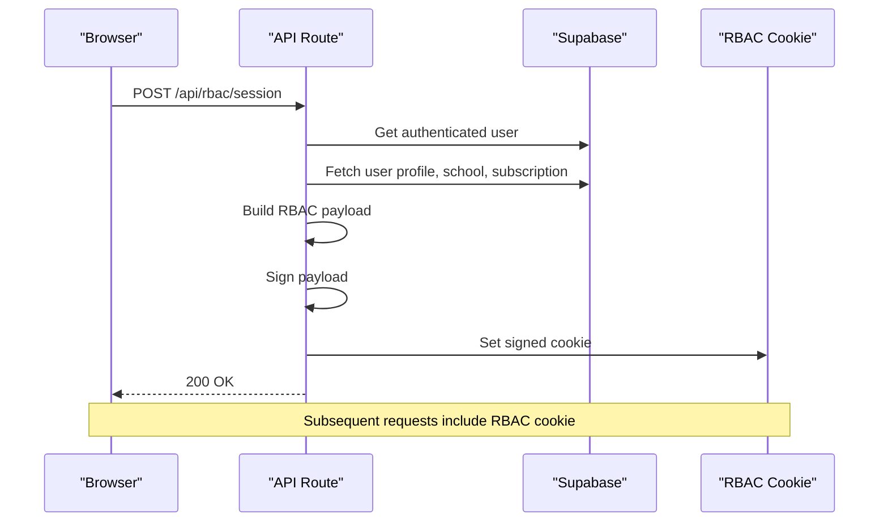
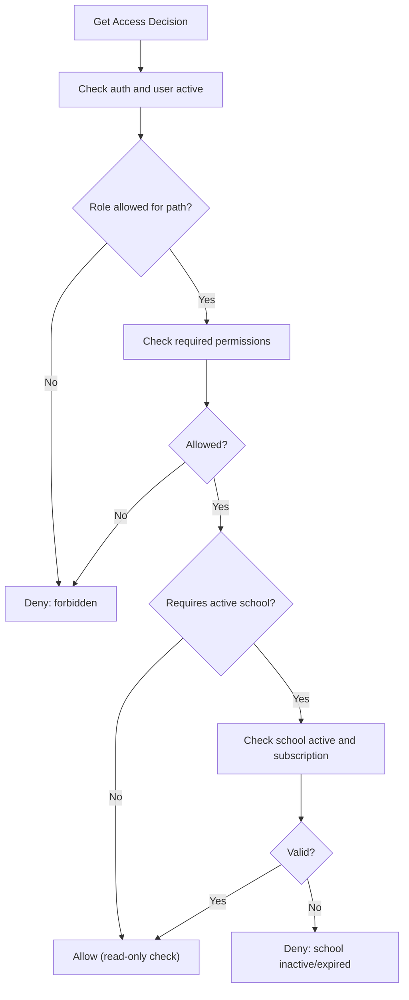
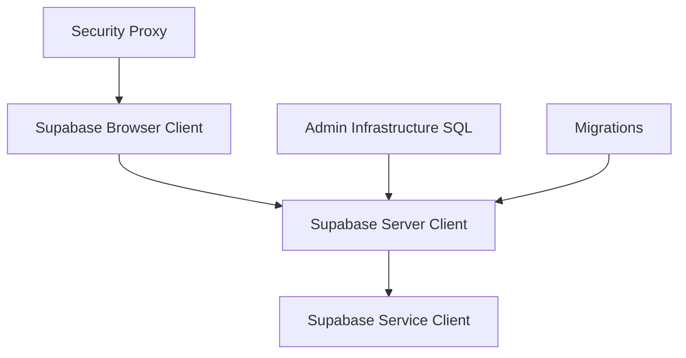
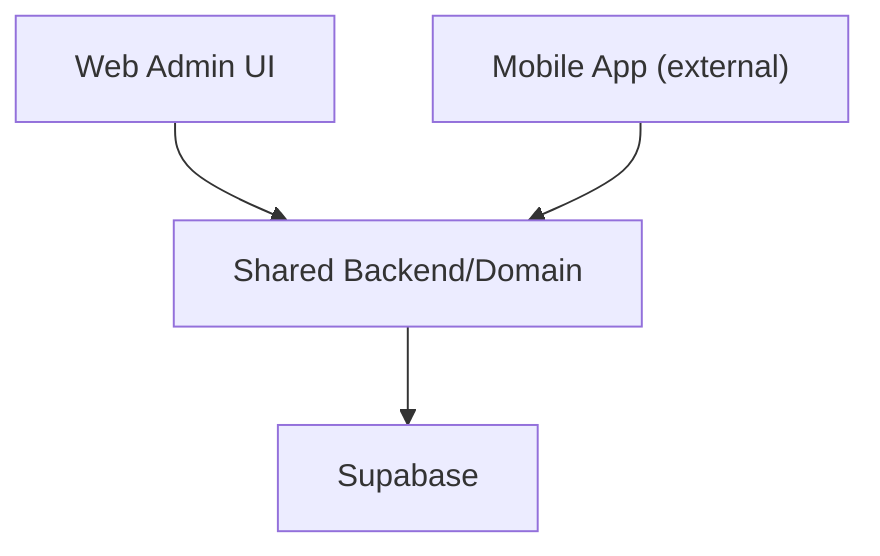
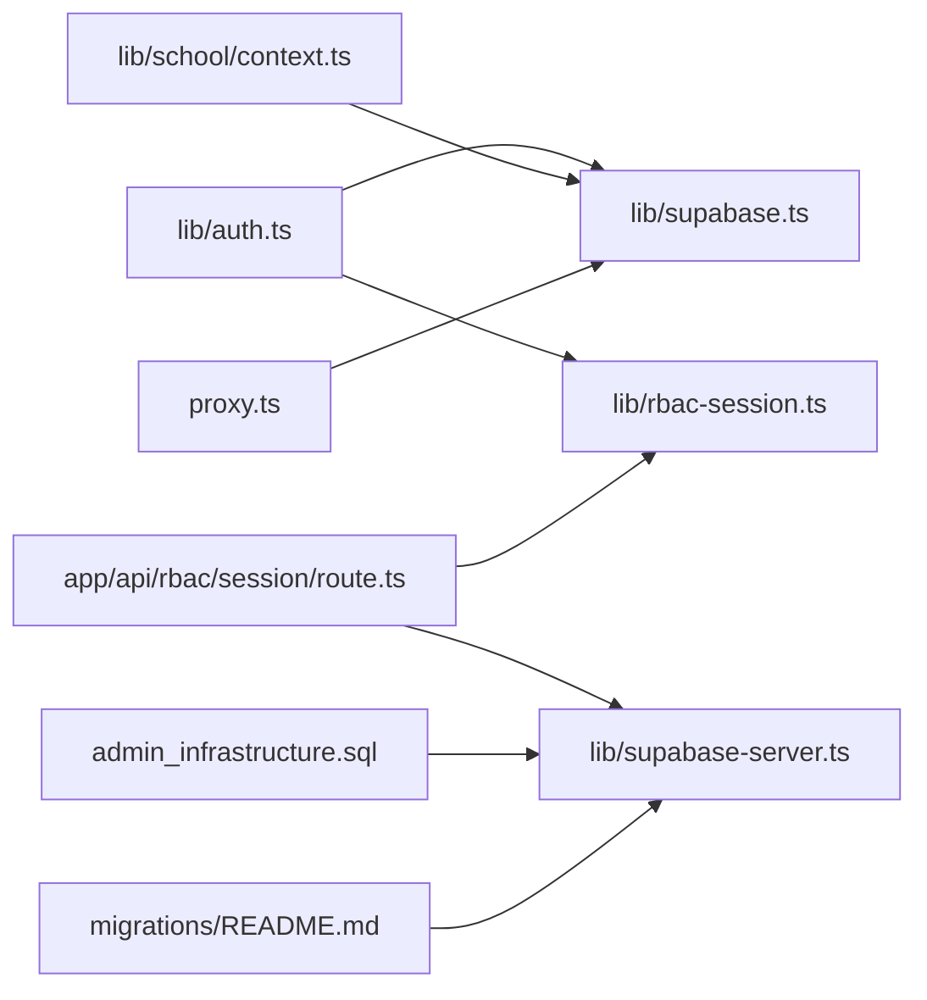

# System Architecture

<cite>
**Referenced Files in This Document**
- [README.md](file://README.md)
- [proxy.ts](file://proxy.ts)
- [lib/supabase.ts](file://lib/supabase.ts)
- [lib/supabase-server.ts](file://lib/supabase-server.ts)
- [lib/auth.ts](file://lib/auth.ts)
- [lib/rbac-session.ts](file://lib/rbac-session.ts)
- [lib/school/context.ts](file://lib/school/context.ts)
- [lib/school-scope.ts](file://lib/school-scope.ts)
- [lib/managed-user-app-context.ts](file://lib/managed-user-app-context.ts)
- [lib/authorized-api.ts](file://lib/authorized-api.ts)
- [app/api/rbac/session/route.ts](file://app/api/rbac/session/route.ts)
- [admin_infrastructure.sql](file://admin_infrastructure.sql)
- [migrations/README.md](file://migrations/README.md)
</cite>

## Table of Contents
1. [Introduction](#introduction)
2. [Project Structure](#project-structure)
3. [Core Components](#core-components)
4. [Architecture Overview](#architecture-overview)
5. [Detailed Component Analysis](#detailed-component-analysis)
6. [Dependency Analysis](#dependency-analysis)
7. [Performance Considerations](#performance-considerations)
8. [Troubleshooting Guide](#troubleshooting-guide)
9. [Conclusion](#conclusion)

## Introduction
This document describes the system architecture of a school management platform with a clear separation between:
- Web admin UI
- Shared backend and domain logic
- Database infrastructure (including Supabase integration)

It explains the multi-tenant architecture with school-scoped isolation, the provider pattern for centralized state management, role-based access control (RBAC), and how Supabase powers authentication, real-time capabilities, and storage policies. It also outlines design decisions that keep web admin concerns separate from mobile application concerns, while enabling shared backend services to serve multiple clients.

## Project Structure
The repository is organized into three primary layers:
- Web admin UI: Next.js application under app/[locale], components, hooks, messages, and public assets
- Shared backend/domain: API routes under app/api, libraries under lib, TypeScript types under types, proxy middleware, and scripts
- Database infrastructure: migrations, database setup SQL, and admin infrastructure SQL

Repo boundaries explicitly exclude mobile runtime concerns (Expo, React Native, iOS/Android projects) from this repository.

**Diagram sources**
- [README.md:18-24](file://README.md#L18-L24)
- [proxy.ts:91-123](file://proxy.ts#L91-L123)

**Section sources**
- [README.md:18-24](file://README.md#L18-L24)

## Core Components
- Supabase client initialization and server-side client creation for authenticated requests and service-level operations
- Centralized RBAC session management via signed cookies and server API
- Multi-tenant school scoping with caching and branch resolution
- Managed user app context building for student and teacher roles
- Authorized API utilities for client-side requests
- Security proxy for CSP and other hardening headers

**Section sources**
- [lib/supabase.ts:1-22](file://lib/supabase.ts#L1-L22)
- [lib/supabase-server.ts:1-75](file://lib/supabase-server.ts#L1-L75)
- [lib/rbac-session.ts:1-153](file://lib/rbac-session.ts#L1-L153)
- [app/api/rbac/session/route.ts:14-133](file://app/api/rbac/session/route.ts#L14-L133)
- [lib/school/context.ts:14-74](file://lib/school/context.ts#L14-L74)
- [lib/managed-user-app-context.ts:611-682](file://lib/managed-user-app-context.ts#L611-L682)
- [lib/authorized-api.ts:14-49](file://lib/authorized-api.ts#L14-L49)
- [proxy.ts:44-85](file://proxy.ts#L44-L85)

## Architecture Overview
The system follows a layered architecture:
- Presentation Layer: Next.js app rendering pages and components
- Application Layer: API routes implementing domain actions and enforcing access control
- Domain Services: Libraries encapsulating auth, RBAC, school scoping, and managed user contexts
- Data Access: Supabase client abstractions and server clients
- Data Layer: PostgreSQL with RLS, storage buckets, and administrative infrastructure

**Diagram sources**
- [lib/supabase.ts:1-22](file://lib/supabase.ts#L1-L22)
- [lib/supabase-server.ts:39-50](file://lib/supabase-server.ts#L39-L50)
- [app/api/rbac/session/route.ts:22-56](file://app/api/rbac/session/route.ts#L22-L56)

## Detailed Component Analysis

### Multi-Tenant Architecture and School Scope Isolation
- School ID resolution is derived from user profiles and super admin selection
- Branch ID resolution caches results for a short TTL and falls back gracefully when tables are missing
- School context is fetched concurrently for school and subscription status
- Access decisions consider school activity and subscription status

**Diagram sources**
- [lib/school/context.ts:14-74](file://lib/school/context.ts#L14-L74)

**Section sources**
- [lib/school/context.ts:14-74](file://lib/school/context.ts#L14-L74)
- [lib/auth.ts:166-186](file://lib/auth.ts#L166-L186)

### Provider Pattern for Centralized State Management
- RBAC session payload is built server-side from user profile, permissions, and school/subscription context
- Signed cookie is set with secure, httpOnly, and maxAge options
- Client utilities refresh and clear RBAC session cookie
- Managed user app context aggregates identity, linkage, access state, and role-specific data

**Diagram sources**
- [app/api/rbac/session/route.ts:14-133](file://app/api/rbac/session/route.ts#L14-L133)
- [lib/rbac-session.ts:56-152](file://lib/rbac-session.ts#L56-L152)

**Section sources**
- [app/api/rbac/session/route.ts:14-133](file://app/api/rbac/session/route.ts#L14-L133)
- [lib/rbac-session.ts:1-153](file://lib/rbac-session.ts#L1-L153)
- [lib/auth.ts:273-340](file://lib/auth.ts#L273-L340)
- [lib/managed-user-app-context.ts:611-682](file://lib/managed-user-app-context.ts#L611-L682)

### Role-Based Access Control (RBAC) Implementation
- Access decisions are computed from role, path permissions, and route rules
- Subscription expiration and school activity checks influence access
- Path read-only determination is role-aware
- RBAC cookie carries role, permissions, and scope flags

**Diagram sources**
- [lib/auth.ts:106-145](file://lib/auth.ts#L106-L145)

**Section sources**
- [lib/auth.ts:106-145](file://lib/auth.ts#L106-L145)
- [lib/rbac-session.ts:6-17](file://lib/rbac-session.ts#L6-L17)

### Supabase Integration: Authentication, Real-Time, and Storage Policies
- Client SDK initialization validates required environment variables
- Server client uses cookie store for session persistence and service role client for privileged operations
- Proxy sets CSP with nonce, HSTS in production, and other security headers
- Admin infrastructure SQL defines audit logs, notifications, feature flags, and soft-delete support
- Migrations document shared managed-user schema, storage, and RLS

**Diagram sources**
- [lib/supabase.ts:1-22](file://lib/supabase.ts#L1-L22)
- [lib/supabase-server.ts:5-75](file://lib/supabase-server.ts#L5-L75)
- [proxy.ts:44-123](file://proxy.ts#L44-L123)
- [admin_infrastructure.sql:9-156](file://admin_infrastructure.sql#L9-L156)
- [migrations/README.md:16-21](file://migrations/README.md#L16-L21)

**Section sources**
- [lib/supabase.ts:1-22](file://lib/supabase.ts#L1-L22)
- [lib/supabase-server.ts:1-75](file://lib/supabase-server.ts#L1-L75)
- [proxy.ts:44-123](file://proxy.ts#L44-L123)
- [admin_infrastructure.sql:9-156](file://admin_infrastructure.sql#L9-L156)
- [migrations/README.md:16-21](file://migrations/README.md#L16-L21)

### Separation Between Web Admin and Mobile Concerns
- Repository explicitly excludes mobile runtime concerns (Expo, RN, iOS/Android)
- Shared backend/domain logic is portable across web and mobile contexts
- Managed user app context supports both student and teacher roles with unified data fetching
- Migration naming includes “mobile” for historical reasons but does not imply mobile code belongs here

**Diagram sources**
- [README.md:11-16](file://README.md#L11-L16)
- [README.md:20-24](file://README.md#L20-L24)
- [migrations/README.md:12-23](file://migrations/README.md#L12-L23)

**Section sources**
- [README.md:11-16](file://README.md#L11-L16)
- [README.md:20-24](file://README.md#L20-L24)
- [migrations/README.md:12-23](file://migrations/README.md#L12-L23)

## Dependency Analysis
The following diagram shows key dependencies among components:

**Diagram sources**
- [lib/auth.ts:1-17](file://lib/auth.ts#L1-L17)
- [lib/rbac-session.ts:1-10](file://lib/rbac-session.ts#L1-L10)
- [app/api/rbac/session/route.ts:2-12](file://app/api/rbac/session/route.ts#L2-L12)
- [lib/school/context.ts:1-4](file://lib/school/context.ts#L1-L4)
- [lib/supabase.ts:1-7](file://lib/supabase.ts#L1-L7)
- [lib/supabase-server.ts:1-7](file://lib/supabase-server.ts#L1-L7)
- [proxy.ts:1-7](file://proxy.ts#L1-L7)
- [admin_infrastructure.sql:1-4](file://admin_infrastructure.sql#L1-L4)
- [migrations/README.md:1-3](file://migrations/README.md#L1-L3)

**Section sources**
- [lib/auth.ts:1-341](file://lib/auth.ts#L1-L341)
- [lib/rbac-session.ts:1-153](file://lib/rbac-session.ts#L1-L153)
- [app/api/rbac/session/route.ts:1-155](file://app/api/rbac/session/route.ts#L1-L155)
- [lib/school/context.ts:1-74](file://lib/school/context.ts#L1-L74)
- [lib/supabase.ts:1-22](file://lib/supabase.ts#L1-L22)
- [lib/supabase-server.ts:1-75](file://lib/supabase-server.ts#L1-L75)
- [proxy.ts:1-139](file://proxy.ts#L1-L139)
- [admin_infrastructure.sql:1-156](file://admin_infrastructure.sql#L1-L156)
- [migrations/README.md:1-31](file://migrations/README.md#L1-L31)

## Performance Considerations
- School branch ID caching reduces repeated queries to the branches table
- Concurrent fetching of school and subscription data minimizes round trips
- Column availability probing avoids errors when tables are not present, enabling graceful fallbacks
- Rate limiting on RBAC session endpoints prevents abuse
- Proxy CSP nonce improves security posture without sacrificing functionality

Recommendations:
- Monitor cache hit rates for branch ID resolution and adjust TTL as needed
- Use indexes on frequently queried columns (e.g., schools.is_active, subscriptions.status)
- Consider pagination and selective field retrieval for large datasets
- Keep Supabase environment variables validated at startup to avoid runtime failures

**Section sources**
- [lib/school/context.ts:11-12](file://lib/school/context.ts#L11-L12)
- [lib/school/context.ts:30-53](file://lib/school/context.ts#L30-L53)
- [lib/auth.ts:166-186](file://lib/auth.ts#L166-L186)
- [lib/managed-user-app-context.ts:221-251](file://lib/managed-user-app-context.ts#L221-L251)
- [app/api/rbac/session/route.ts:32-40](file://app/api/rbac/session/route.ts#L32-L40)
- [proxy.ts:44-85](file://proxy.ts#L44-L85)

## Troubleshooting Guide
Common issues and remedies:
- Missing Supabase environment variables cause initialization errors; ensure NEXT_PUBLIC_SUPABASE_URL and NEXT_PUBLIC_SUPABASE_ANON_KEY (or publishable key) are set
- RBAC cookie secret must be configured in production; otherwise session signing is disabled and access control is weakened
- Auth session missing errors indicate expired or invalid sessions; re-authenticate and refresh RBAC cookie
- Subscription expiration and school inactivity block access; verify subscription status and school activation
- Missing tables during managed user context building are handled gracefully; confirm schema migrations are applied

Operational checks:
- Verify RBAC session endpoint responds with 200 after successful login
- Confirm proxy CSP headers are present in responses
- Validate Supabase RLS policies and storage policies match expected access patterns

**Section sources**
- [lib/supabase.ts:8-19](file://lib/supabase.ts#L8-L19)
- [lib/rbac-session.ts:19-50](file://lib/rbac-session.ts#L19-L50)
- [lib/auth.ts:156-164](file://lib/auth.ts#L156-L164)
- [lib/auth.ts:93-104](file://lib/auth.ts#L93-L104)
- [lib/managed-user-app-context.ts:221-251](file://lib/managed-user-app-context.ts#L221-L251)
- [app/api/rbac/session/route.ts:14-20](file://app/api/rbac/session/route.ts#L14-L20)
- [proxy.ts:91-123](file://proxy.ts#L91-L123)

## Conclusion
The system employs a clean layered architecture separating the web admin UI from shared backend logic and database infrastructure. Supabase provides cohesive authentication, database, and storage services, while RLS and policy-driven access control ensure tenant isolation and security. The provider pattern centralizes RBAC session management, and the design keeps web admin concerns distinct from mobile concerns, enabling modular development and independent evolution of UI and backend components.