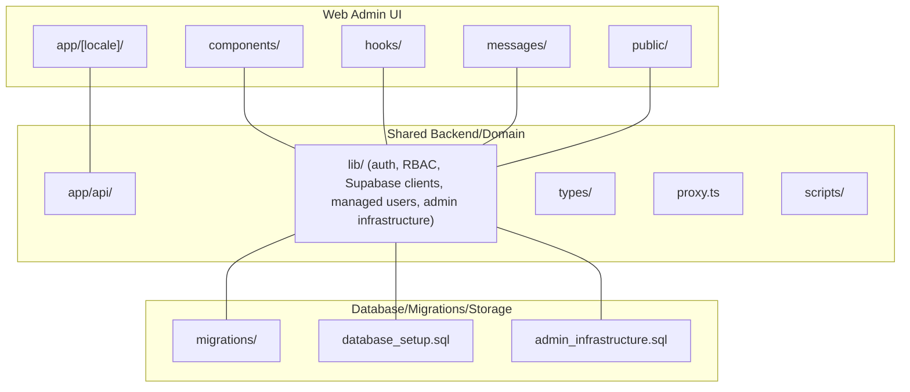
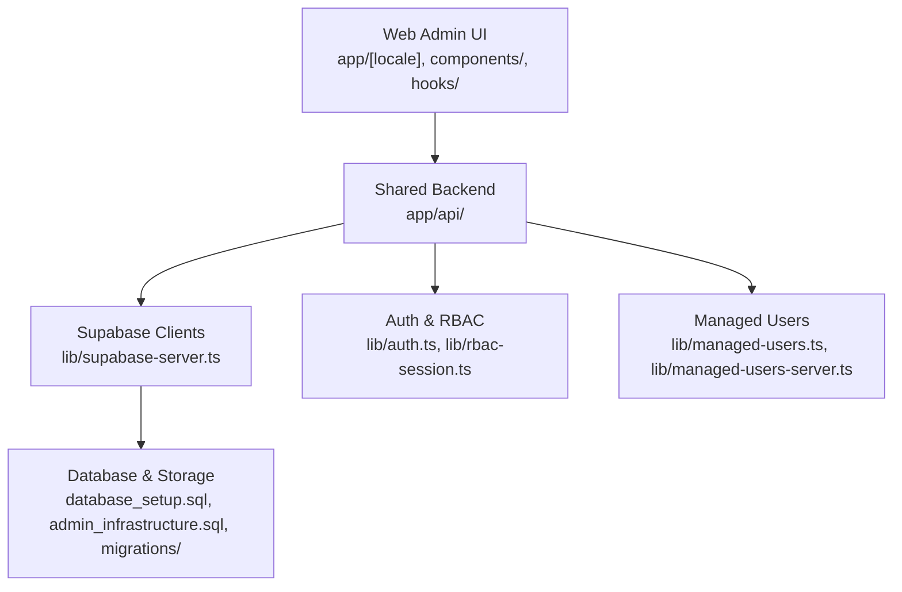
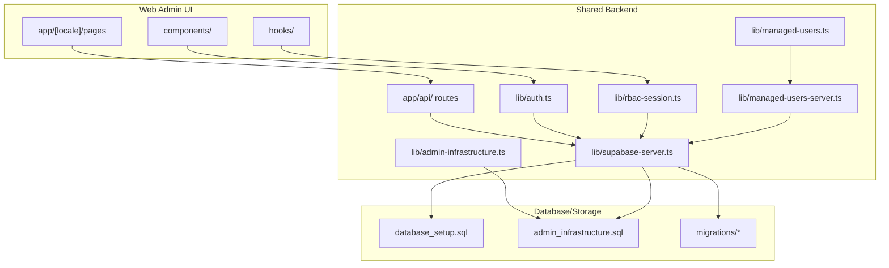

# System Boundaries

<cite>
**Referenced Files in This Document**
- [README.md](file://README.md)
- [repo-boundaries.md](file://docs/repo-boundaries.md)
- [migrations/README.md](file://migrations/README.md)
- [admin_infrastructure.sql](file://admin_infrastructure.sql)
- [database_setup.sql](file://database_setup.sql)
- [migrations/20260322_000000_mobile_core_tables.sql](file://migrations/20260322_000000_mobile_core_tables.sql)
- [migrations/20260322_managed_mobile_rls.sql](file://migrations/20260322_managed_mobile_rls.sql)
- [migrations/20260322_mobile_attachments_storage.sql](file://migrations/20260322_mobile_attachments_storage.sql)
- [lib/supabase-server.ts](file://lib/supabase-server.ts)
- [lib/auth.ts](file://lib/auth.ts)
- [lib/rbac-session.ts](file://lib/rbac-session.ts)
- [lib/admin-infrastructure.ts](file://lib/admin-infrastructure.ts)
- [lib/managed-users.ts](file://lib/managed-users.ts)
- [lib/managed-users-server.ts](file://lib/managed-users-server.ts)
</cite>

## Table of Contents
1. [Introduction](#introduction)
2. [Project Structure](#project-structure)
3. [Core Components](#core-components)
4. [Architecture Overview](#architecture-overview)
5. [Detailed Component Analysis](#detailed-component-analysis)
6. [Dependency Analysis](#dependency-analysis)
7. [Performance Considerations](#performance-considerations)
8. [Troubleshooting Guide](#troubleshooting-guide)
9. [Conclusion](#conclusion)

## Introduction
This document defines the system boundaries for the school management system, establishing three distinct architectural domains and clarifying what belongs where. It also explains the rationale for separating mobile runtime concerns from the web admin domain, outlines legacy migration naming conventions, and provides contribution guidelines to maintain clean separation of concerns.

## Project Structure
The repository is intentionally scoped to three boundary areas:

- Web admin UI: app/[locale], components/, hooks/, messages/, public/
- Shared backend/domain: app/api/, lib/, types/, proxy.ts, scripts/
- Database/migrations/storage: migrations/, database_setup.sql, admin_infrastructure.sql

Mobile runtime concerns (Expo, React Native, iOS/Android projects, and mobile screen implementations) are explicitly excluded from this repository.

**Diagram sources**
- [README.md:18-24](file://README.md#L18-L24)
- [repo-boundaries.md:9-47](file://docs/repo-boundaries.md#L9-L47)

**Section sources**
- [README.md:18-24](file://README.md#L18-L24)
- [repo-boundaries.md:9-47](file://docs/repo-boundaries.md#L9-L47)

## Core Components
This section summarizes the boundary areas and their responsibilities.

- Web Admin UI
  - Purpose: Browser-based administrative screens and UI components.
  - Scope: app/[locale]/ for routed pages, components/ for reusable UI, hooks/ for browser/UI state, messages/ for localization, public/ for static assets.
  - Example files: app/[locale]/layout.tsx, app/[locale]/page.tsx, components/ui/button.tsx, hooks/useAuth.ts.

- Shared Backend/Domain
  - Purpose: Business logic, Supabase access, RBAC, and route handlers shared by the deployed web app backend.
  - Scope: app/api/ HTTP route handlers, lib/ authentication/RBAC/SUPABASE clients, types/ role and model definitions, proxy.ts, scripts/.
  - Example files: lib/auth.ts, lib/supabase-server.ts, lib/rbac-session.ts, lib/managed-users.ts, lib/admin-infrastructure.ts.

- Database/Migrations/Storage
  - Purpose: Database schema, storage buckets, and Row Level Security (RLS) policies.
  - Scope: migrations/ SQL files, database_setup.sql bootstrap, admin_infrastructure.sql shared admin features.
  - Example files: migrations/20260322_000000_mobile_core_tables.sql, migrations/20260322_managed_mobile_rls.sql, migrations/20260322_mobile_attachments_storage.sql, admin_infrastructure.sql, database_setup.sql.

Rationale for separation:
- Mobile runtime concerns (Expo, React Native, iOS/Android, mobile screens) are intentionally outside this repository to avoid cross-project coupling and to enable independent evolution of the web admin and any future mobile apps.

**Section sources**
- [README.md:11-16](file://README.md#L11-L16)
- [README.md:20-22](file://README.md#L20-L22)
- [repo-boundaries.md:9-47](file://docs/repo-boundaries.md#L9-L47)

## Architecture Overview
The system enforces boundaries via layered responsibilities:
- Web Admin UI renders pages and interacts with shared backend APIs.
- Shared Backend/Domain encapsulates authentication, RBAC, Supabase client creation, and managed-user operations.
- Database/Migrations/Storage defines schema, storage policies, and RLS that back both web and any external consumers.

**Diagram sources**
- [lib/supabase-server.ts:1-75](file://lib/supabase-server.ts#L1-L75)
- [lib/auth.ts:1-341](file://lib/auth.ts#L1-L341)
- [lib/rbac-session.ts:1-153](file://lib/rbac-session.ts#L1-L153)
- [lib/managed-users.ts:1-375](file://lib/managed-users.ts#L1-L375)
- [lib/managed-users-server.ts:1-800](file://lib/managed-users-server.ts#L1-L800)
- [database_setup.sql:1-614](file://database_setup.sql#L1-L614)
- [admin_infrastructure.sql:1-156](file://admin_infrastructure.sql#L1-L156)

## Detailed Component Analysis

### Web Admin UI Boundary
- Responsibilities
  - Define routed pages under app/[locale]/.
  - Provide reusable UI components and hooks.
  - Manage localization and static assets.
- Examples
  - Layout and pages: app/[locale]/layout.tsx, app/[locale]/page.tsx.
  - UI components: components/ui/button.tsx.
  - Hooks: hooks/useAuth.ts, hooks/useRole.tsx.
  - Localization: messages/en.json.
  - Static assets: public/.

Guidelines
- Keep UI-only logic here; do not introduce backend-specific logic.
- Use app/api/ routes for data access, not direct database calls.

**Section sources**
- [repo-boundaries.md:9-18](file://docs/repo-boundaries.md#L9-L18)

### Shared Backend/Domain Boundary
- Responsibilities
  - HTTP route handlers under app/api/.
  - Authentication and RBAC logic.
  - Supabase client creation and session management.
  - Managed user operations and admin infrastructure detection.
- Examples
  - Auth and RBAC: lib/auth.ts, lib/rbac-session.ts.
  - Supabase clients: lib/supabase-server.ts.
  - Managed users: lib/managed-users.ts, lib/managed-users-server.ts.
  - Admin infrastructure: lib/admin-infrastructure.ts.
  - Types: types/roles.ts, types/student.ts.

Guidelines
- Centralize shared logic here to avoid duplication across routes.
- Use lib/ for reusable domain services; keep app/api/ thin and declarative.

**Section sources**
- [repo-boundaries.md:20-31](file://docs/repo-boundaries.md#L20-L31)
- [lib/supabase-server.ts:1-75](file://lib/supabase-server.ts#L1-L75)
- [lib/auth.ts:1-341](file://lib/auth.ts#L1-L341)
- [lib/rbac-session.ts:1-153](file://lib/rbac-session.ts#L1-L153)
- [lib/managed-users.ts:1-375](file://lib/managed-users.ts#L1-L375)
- [lib/managed-users-server.ts:1-800](file://lib/managed-users-server.ts#L1-L800)
- [lib/admin-infrastructure.ts:1-209](file://lib/admin-infrastructure.ts#L1-L209)

### Database/Migrations/Storage Boundary
- Responsibilities
  - Schema bootstrap and evolution via migrations.
  - Storage bucket setup and access policies.
  - Row Level Security (RLS) functions and policies.
- Examples
  - Bootstrap: database_setup.sql.
  - Admin features: admin_infrastructure.sql.
  - Migrations: migrations/20260322_000000_mobile_core_tables.sql, migrations/20260322_managed_mobile_rls.sql, migrations/20260322_mobile_attachments_storage.sql.
  - Migration guide: migrations/README.md.

Legacy migration naming
- Some migration filenames include “mobile” for historical reasons. These are backend/shared schema and policy migrations, not indicators of mobile UI code in this repository.

**Section sources**
- [repo-boundaries.md:33-47](file://docs/repo-boundaries.md#L33-L47)
- [migrations/README.md:12-23](file://migrations/README.md#L12-L23)
- [migrations/20260322_000000_mobile_core_tables.sql:1-4](file://migrations/20260322_000000_mobile_core_tables.sql#L1-L4)
- [migrations/20260322_managed_mobile_rls.sql:1-4](file://migrations/20260322_managed_mobile_rls.sql#L1-L4)
- [migrations/20260322_mobile_attachments_storage.sql:1-4](file://migrations/20260322_mobile_attachments_storage.sql#L1-L4)

### Contribution Patterns and Boundary Adherence
- Web Admin UI
  - Add new pages under app/[locale]/.
  - Place shared components in components/.
  - Place UI state hooks in hooks/.
  - Add translations in messages/.
  - Put static assets in public/.
- Shared Backend/Domain
  - Add new route handlers under app/api/.
  - Extend lib/ services for shared logic.
  - Add new types under types/.
  - Keep app/api/ handlers thin; delegate to lib/.
- Database/Migrations/Storage
  - Add new migrations under migrations/.
  - Extend database_setup.sql or admin_infrastructure.sql for bootstrap/admin features.
  - Do not add mobile UI code here.

Mobile separation rationale
- Prevents cross-project coupling and keeps the web admin focused on browser UX.
- Enables independent development of any future mobile apps consuming the shared Supabase schema and policies.

**Section sources**
- [repo-boundaries.md:9-47](file://docs/repo-boundaries.md#L9-L47)
- [README.md:11-16](file://README.md#L11-L16)

## Dependency Analysis
The following diagram shows how the boundary areas depend on each other and how data flows across boundaries.

**Diagram sources**
- [lib/supabase-server.ts:1-75](file://lib/supabase-server.ts#L1-L75)
- [lib/auth.ts:1-341](file://lib/auth.ts#L1-L341)
- [lib/rbac-session.ts:1-153](file://lib/rbac-session.ts#L1-L153)
- [lib/managed-users.ts:1-375](file://lib/managed-users.ts#L1-L375)
- [lib/managed-users-server.ts:1-800](file://lib/managed-users-server.ts#L1-L800)
- [lib/admin-infrastructure.ts:1-209](file://lib/admin-infrastructure.ts#L1-L209)
- [database_setup.sql:1-614](file://database_setup.sql#L1-L614)
- [admin_infrastructure.sql:1-156](file://admin_infrastructure.sql#L1-L156)

## Performance Considerations
- Keep app/api/ handlers small and delegate heavy logic to lib/ services to improve testability and reuse.
- Use Supabase client caching and session management to reduce repeated auth checks.
- Apply database indexes and RLS policies judiciously to balance security and query performance.
- Prefer batched queries and caching in lib/ services to minimize round-trips.

## Troubleshooting Guide
Common issues and where to look:

- Missing Supabase environment variables
  - Symptom: errors during Supabase client creation.
  - Action: verify NEXT_PUBLIC_SUPABASE_URL and NEXT_PUBLIC_SUPABASE_ANON_KEY/SUPABASE_SERVICE_ROLE_KEY.
  - Reference: [lib/supabase-server.ts:6-15](file://lib/supabase-server.ts#L6-L15), [lib/supabase-server.ts:40-45](file://lib/supabase-server.ts#L40-L45)

- RBAC session verification failures
  - Symptom: RBAC cookie validation errors.
  - Action: ensure RBAC_COOKIE_SECRET is configured in production; check token expiration and signing.
  - Reference: [lib/rbac-session.ts:19-50](file://lib/rbac-session.ts#L19-L50), [lib/rbac-session.ts:121-142](file://lib/rbac-session.ts#L121-L142)

- Admin infrastructure capability detection
  - Symptom: warnings about missing tables/columns for admin features.
  - Action: run admin_infrastructure.sql to add missing capabilities; confirm schema compatibility.
  - Reference: [lib/admin-infrastructure.ts:131-208](file://lib/admin-infrastructure.ts#L131-L208), [admin_infrastructure.sql:1-156](file://admin_infrastructure.sql#L1-L156)

- Managed user operations
  - Symptom: errors linking auth users to managed profiles or generating credentials.
  - Action: validate schema capabilities, check managed user inputs, and confirm Supabase auth metadata.
  - Reference: [lib/managed-users-server.ts:186-291](file://lib/managed-users-server.ts#L186-L291), [lib/managed-users.ts:220-375](file://lib/managed-users.ts#L220-L375)

**Section sources**
- [lib/supabase-server.ts:6-15](file://lib/supabase-server.ts#L6-L15)
- [lib/supabase-server.ts:40-45](file://lib/supabase-server.ts#L40-L45)
- [lib/rbac-session.ts:19-50](file://lib/rbac-session.ts#L19-L50)
- [lib/rbac-session.ts:121-142](file://lib/rbac-session.ts#L121-L142)
- [lib/admin-infrastructure.ts:131-208](file://lib/admin-infrastructure.ts#L131-L208)
- [admin_infrastructure.sql:1-156](file://admin_infrastructure.sql#L1-L156)
- [lib/managed-users-server.ts:186-291](file://lib/managed-users-server.ts#L186-L291)
- [lib/managed-users.ts:220-375](file://lib/managed-users.ts#L220-L375)

## Conclusion
The system boundaries cleanly separate the web admin UI, shared backend/domain logic, and database/storage concerns. Mobile runtime concerns are deliberately excluded to preserve architectural integrity and enable independent evolution. Following the guidelines and contribution patterns outlined here ensures consistent development workflows and predictable deployment strategies across the web admin and any future mobile applications that consume the shared Supabase schema and policies.