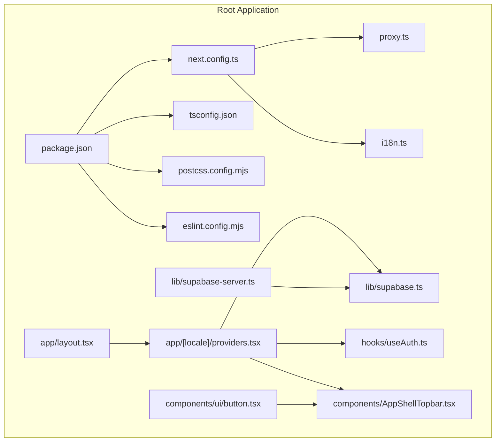
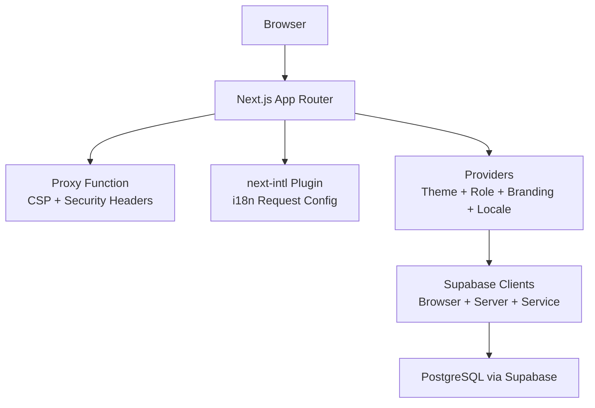
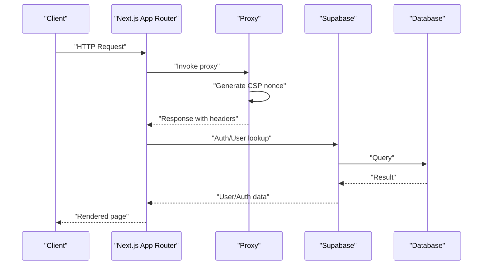
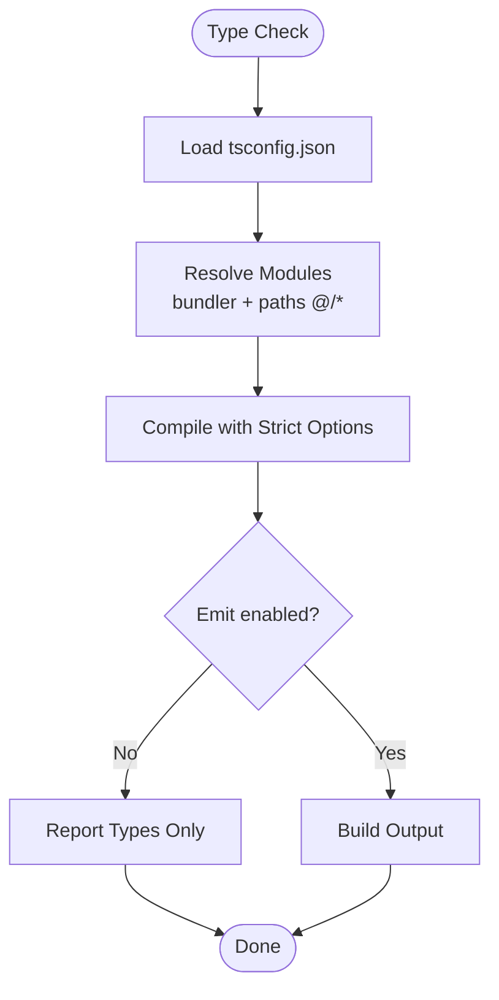
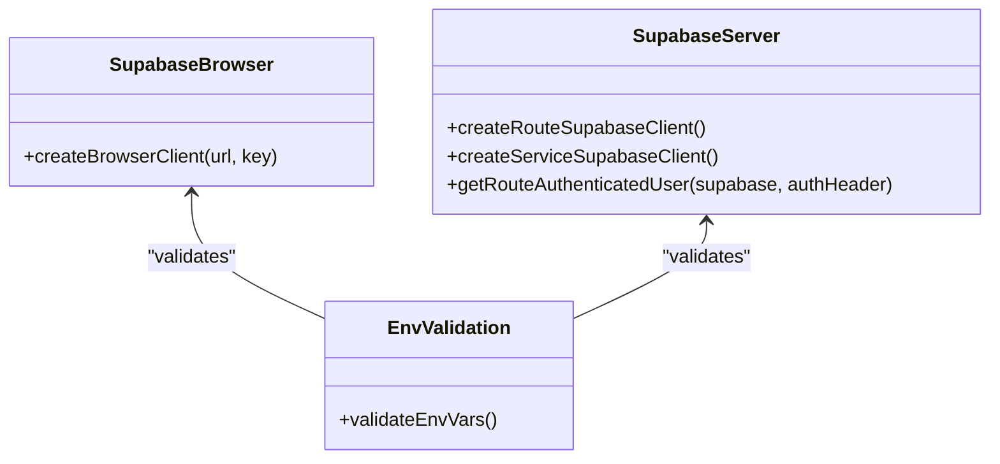
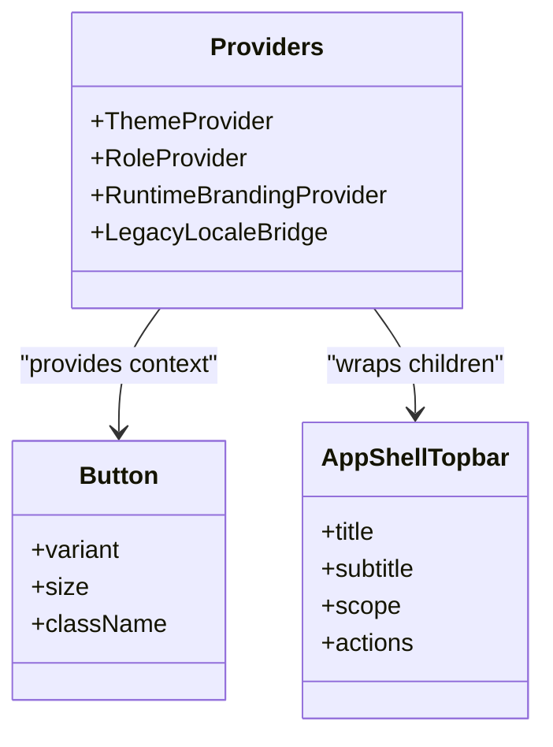
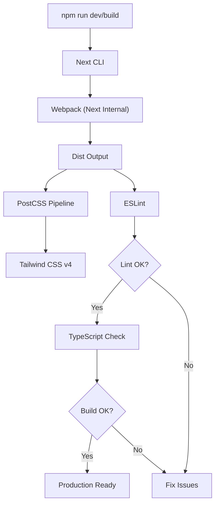
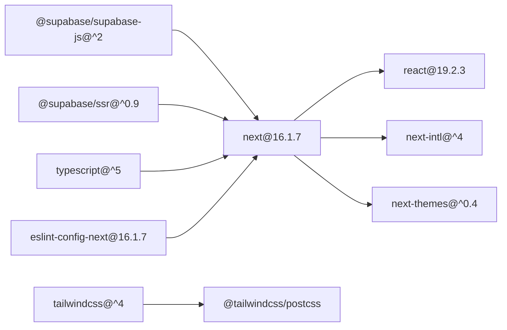

# Technology Stack

<cite>
**Referenced Files in This Document**
- [package.json](file://package.json)
- [next.config.ts](file://next.config.ts)
- [tsconfig.json](file://tsconfig.json)
- [postcss.config.mjs](file://postcss.config.mjs)
- [eslint.config.mjs](file://eslint.config.mjs)
- [proxy.ts](file://proxy.ts)
- [lib/supabase.ts](file://lib/supabase.ts)
- [lib/supabase-server.ts](file://lib/supabase-server.ts)
- [hooks/useAuth.ts](file://hooks/useAuth.ts)
- [app/[locale]/providers.tsx](file://app/[locale]/providers.tsx)
- [app/layout.tsx](file://app/layout.tsx)
- [components/ui/button.tsx](file://components/ui/button.tsx)
- [components/AppShellTopbar.tsx](file://components/AppShellTopbar.tsx)
- [i18n.ts](file://i18n.ts)
</cite>

## Table of Contents
1. [Introduction](#introduction)
2. [Project Structure](#project-structure)
3. [Core Components](#core-components)
4. [Architecture Overview](#architecture-overview)
5. [Detailed Component Analysis](#detailed-component-analysis)
6. [Dependency Analysis](#dependency-analysis)
7. [Performance Considerations](#performance-considerations)
8. [Troubleshooting Guide](#troubleshooting-guide)
9. [Conclusion](#conclusion)

## Introduction
This document details the technology stack powering the school management system. It focuses on Next.js 16.1.7 with App Router architecture, TypeScript for type safety, Supabase for authentication and database operations, and React 19.2.3 for UI components. It also covers build configuration including webpack integration, PostCSS processing, ESLint rules, and Tailwind CSS integration. The document explains rationale for technology choices, version compatibility, dependency management strategies, setup instructions, configuration options, development workflow best practices, and performance implications.

## Project Structure
The project is a monorepo-like structure with multiple apps and libraries:
- Root Next.js application under the repository root
- A dedicated SaaS-focused Next.js app under school-saas-next
- A separate accounting system under school-acc-system
- Shared libraries, hooks, components, and utilities under top-level directories

Key configuration files define the build pipeline and runtime behavior:
- Next.js configuration sets headers, internationalization plugin, and output tracing root
- TypeScript configuration enables strictness, JSX transform, bundler module resolution, and path aliases
- PostCSS configuration integrates Tailwind CSS v4
- ESLint configuration extends Next.js recommended rules and customizes ignores and rules
- Proxy function centralizes security headers and CSP generation with per-request nonces

**Diagram sources**
- [package.json](file://package.json)
- [next.config.ts](file://next.config.ts)
- [tsconfig.json](file://tsconfig.json)
- [postcss.config.mjs](file://postcss.config.mjs)
- [eslint.config.mjs](file://eslint.config.mjs)
- [proxy.ts](file://proxy.ts)
- [app/layout.tsx](file://app/layout.tsx)
- [app/[locale]/providers.tsx](file://app/[locale]/providers.tsx)
- [lib/supabase.ts](file://lib/supabase.ts)
- [lib/supabase-server.ts](file://lib/supabase-server.ts)
- [hooks/useAuth.ts](file://hooks/useAuth.ts)
- [components/ui/button.tsx](file://components/ui/button.tsx)
- [components/AppShellTopbar.tsx](file://components/AppShellTopbar.tsx)
- [i18n.ts](file://i18n.ts)

**Section sources**
- [package.json](file://package.json)
- [next.config.ts](file://next.config.ts)
- [tsconfig.json](file://tsconfig.json)
- [postcss.config.mjs](file://postcss.config.mjs)
- [eslint.config.mjs](file://eslint.config.mjs)
- [proxy.ts](file://proxy.ts)
- [app/layout.tsx](file://app/layout.tsx)
- [app/[locale]/providers.tsx](file://app/[locale]/providers.tsx)
- [lib/supabase.ts](file://lib/supabase.ts)
- [lib/supabase-server.ts](file://lib/supabase-server.ts)
- [hooks/useAuth.ts](file://hooks/useAuth.ts)
- [components/ui/button.tsx](file://components/ui/button.tsx)
- [components/AppShellTopbar.tsx](file://components/AppShellTopbar.tsx)
- [i18n.ts](file://i18n.ts)

## Core Components
- Next.js 16.1.7 with App Router
  - App Router pages and API routes under app/
  - Internationalization via next-intl plugin and request configuration
  - Security headers and CSP enforced centrally through a proxy function
  - Build-time headers configuration and output tracing root for optimized builds
- TypeScript for type safety
  - Strict compiler options, JSX transform, bundler module resolution, and path aliases
  - Path mapping @/* to repository root for concise imports
- Supabase for authentication and database operations
  - Browser client creation with environment validation
  - Server client creation for route handlers and SSR with cookie persistence
  - Service role client for privileged operations
  - Utility to extract bearer tokens and resolve authenticated user
- React 19.2.3 for UI components
  - Client components with providers for theme, roles, branding, and locale bridging
  - Reusable UI primitives and shell components for consistent UX

**Section sources**
- [next.config.ts](file://next.config.ts)
- [tsconfig.json](file://tsconfig.json)
- [lib/supabase.ts](file://lib/supabase.ts)
- [lib/supabase-server.ts](file://lib/supabase-server.ts)
- [app/[locale]/providers.tsx](file://app/[locale]/providers.tsx)
- [components/ui/button.tsx](file://components/ui/button.tsx)
- [components/AppShellTopbar.tsx](file://components/AppShellTopbar.tsx)

## Architecture Overview
The system follows a layered architecture:
- Presentation Layer: Next.js App Router pages and components
- Provider Layer: Theme, role, branding, and locale providers
- Services Layer: Supabase clients for browser and server
- Utilities Layer: Hooks, i18n, and shared UI components
- Security Layer: Centralized proxy for CSP and security headers

**Diagram sources**
- [proxy.ts](file://proxy.ts)
- [next.config.ts](file://next.config.ts)
- [i18n.ts](file://i18n.ts)
- [app/[locale]/providers.tsx](file://app/[locale]/providers.tsx)
- [lib/supabase.ts](file://lib/supabase.ts)
- [lib/supabase-server.ts](file://lib/supabase-server.ts)

**Section sources**
- [proxy.ts](file://proxy.ts)
- [next.config.ts](file://next.config.ts)
- [i18n.ts](file://i18n.ts)
- [app/[locale]/providers.tsx](file://app/[locale]/providers.tsx)
- [lib/supabase.ts](file://lib/supabase.ts)
- [lib/supabase-server.ts](file://lib/supabase-server.ts)

## Detailed Component Analysis

### Next.js 16.1.7 with App Router
- App Router pages and API routes are organized under app/, enabling file-system routing and modern React features
- Internationalization is integrated via next-intl plugin and request configuration for locale-specific messages
- Security headers and CSP are centralized in a proxy function to ensure consistent protection across dynamic routes
- Build headers configuration and output tracing root improve caching and deployment performance

**Diagram sources**
- [proxy.ts](file://proxy.ts)
- [lib/supabase.ts](file://lib/supabase.ts)
- [lib/supabase-server.ts](file://lib/supabase-server.ts)

**Section sources**
- [next.config.ts](file://next.config.ts)
- [i18n.ts](file://i18n.ts)
- [proxy.ts](file://proxy.ts)

### TypeScript Configuration
- Strict type checking, no implicit any, and no emit for faster local checks
- Bundler module resolution and isolated modules for compatibility with Next.js
- JSX transform set to react-jsx and path alias @/* mapped to repository root
- Exclusions for sibling projects and artifacts to keep type-checking scoped

**Diagram sources**
- [tsconfig.json](file://tsconfig.json)

**Section sources**
- [tsconfig.json](file://tsconfig.json)

### Supabase Authentication and Database
- Browser client validates environment variables and creates a client for frontend operations
- Server client manages cookies and supports both route handlers and SSR
- Service role client is used for privileged operations without session persistence
- Utility extracts bearer tokens and resolves authenticated users for API routes

**Diagram sources**
- [lib/supabase.ts](file://lib/supabase.ts)
- [lib/supabase-server.ts](file://lib/supabase-server.ts)

**Section sources**
- [lib/supabase.ts](file://lib/supabase.ts)
- [lib/supabase-server.ts](file://lib/supabase-server.ts)

### React 19.2.3 UI Components
- Providers encapsulate theme switching, role-based access, branding, and locale bridging
- UI primitives like Button demonstrate variant and size props with Tailwind-based styling
- Shell components like AppShellTopbar integrate navigation, branding, and user actions

**Diagram sources**
- [app/[locale]/providers.tsx](file://app/[locale]/providers.tsx)
- [components/ui/button.tsx](file://components/ui/button.tsx)
- [components/AppShellTopbar.tsx](file://components/AppShellTopbar.tsx)

**Section sources**
- [app/[locale]/providers.tsx](file://app/[locale]/providers.tsx)
- [components/ui/button.tsx](file://components/ui/button.tsx)
- [components/AppShellTopbar.tsx](file://components/AppShellTopbar.tsx)

### Build Configuration: Webpack, PostCSS, ESLint, Tailwind CSS
- Webpack: Next.js 16.1.7 uses its internal webpack; scripts invoke Next with --webpack for compatibility
- PostCSS: Tailwind CSS v4 plugin configured via @tailwindcss/postcss
- ESLint: Extends Next.js recommended rules and customizes ignores and rules for this workspace
- Tailwind CSS: Integrated through PostCSS; CSP considerations note unsafe-inline for style-src due to Tailwind’s inline styles

**Diagram sources**
- [package.json](file://package.json)
- [postcss.config.mjs](file://postcss.config.mjs)
- [eslint.config.mjs](file://eslint.config.mjs)
- [tsconfig.json](file://tsconfig.json)

**Section sources**
- [package.json](file://package.json)
- [postcss.config.mjs](file://postcss.config.mjs)
- [eslint.config.mjs](file://eslint.config.mjs)
- [tsconfig.json](file://tsconfig.json)

## Dependency Analysis
- Core runtime dependencies include Next.js, React 19.2.3, Supabase SDKs, next-intl, next-themes, lucide-react, recharts, exceljs
- Development dependencies include TypeScript, ESLint Next config, Tailwind CSS v4, and related type packages
- Version alignment ensures compatibility between Next.js, React, and related ecosystem packages

**Diagram sources**
- [package.json](file://package.json)

**Section sources**
- [package.json](file://package.json)

## Performance Considerations
- Next.js App Router improves data fetching and rendering performance with route-based code splitting
- Centralized CSP and security headers reduce per-route overhead and improve security posture
- Strict TypeScript configuration prevents runtime errors and improves developer productivity
- Tailwind CSS v4 with PostCSS enables efficient utility-first styling; note CSP requires unsafe-inline for styles due to generated inline styles
- Output tracing root and build headers configuration optimize caching and deployment

[No sources needed since this section provides general guidance]

## Troubleshooting Guide
- Missing Supabase environment variables
  - Symptom: Error thrown during client creation
  - Resolution: Ensure NEXT_PUBLIC_SUPABASE_URL and NEXT_PUBLIC_SUPABASE_ANON_KEY (or NEXT_PUBLIC_SUPABASE_PUBLISHABLE_KEY) are set in .env.local
- Authentication failures
  - Symptom: Unable to retrieve authenticated user
  - Resolution: Verify bearer token extraction and Supabase auth getUser call
- CSP violations
  - Symptom: Inline styles or scripts blocked
  - Resolution: Confirm CSP includes 'unsafe-inline' for style-src and nonce-based script-src; review proxy.ts configuration
- ESLint or TypeScript errors
  - Symptom: Lint/type check failures
  - Resolution: Review eslint.config.mjs overrides and tsconfig.json strict options; ensure sibling projects are ignored as configured

**Section sources**
- [lib/supabase.ts](file://lib/supabase.ts)
- [lib/supabase-server.ts](file://lib/supabase-server.ts)
- [proxy.ts](file://proxy.ts)
- [eslint.config.mjs](file://eslint.config.mjs)
- [tsconfig.json](file://tsconfig.json)

## Conclusion
The technology stack leverages Next.js 16.1.7 with App Router for modern routing and performance, TypeScript for robust type safety, Supabase for secure authentication and database operations, and React 19.2.3 for a component-driven UI. Build configuration integrates Tailwind CSS via PostCSS, enforces code quality with ESLint, and centralizes security through a proxy function. These choices align with maintainability, scalability, and security requirements for the school management system.