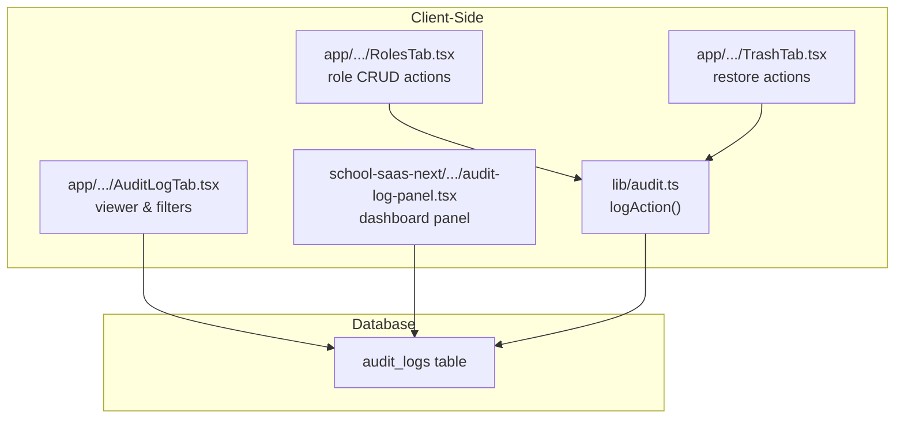
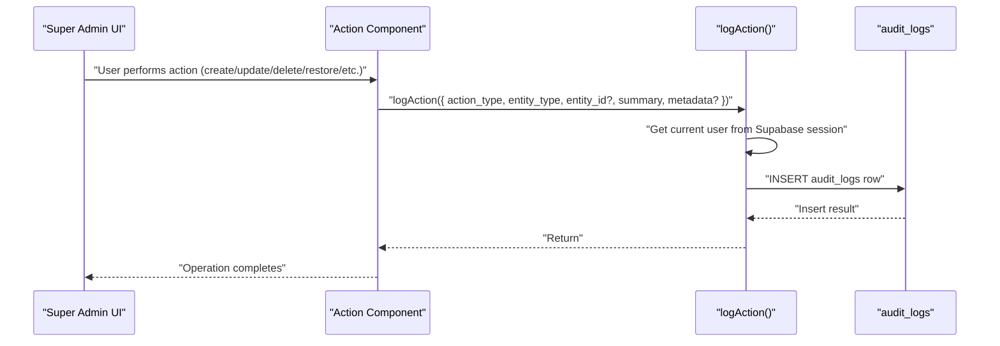
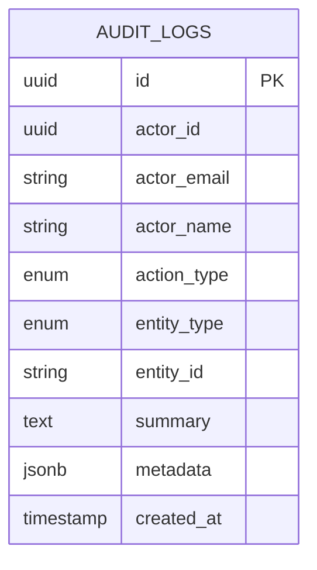
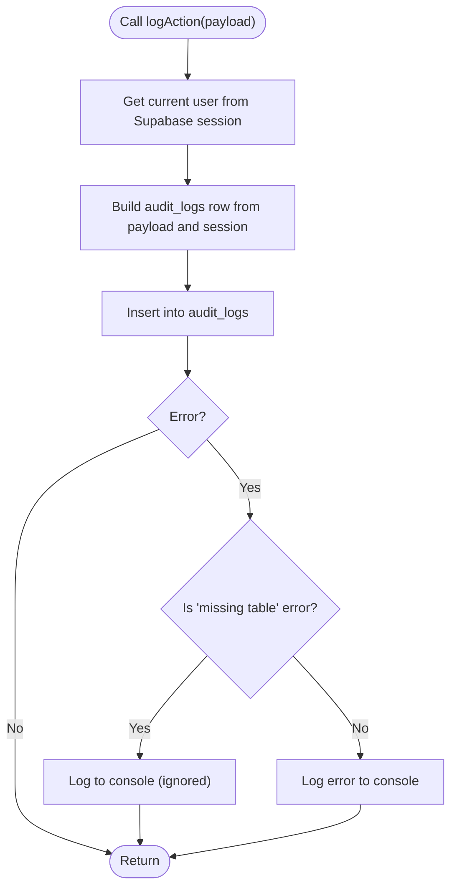
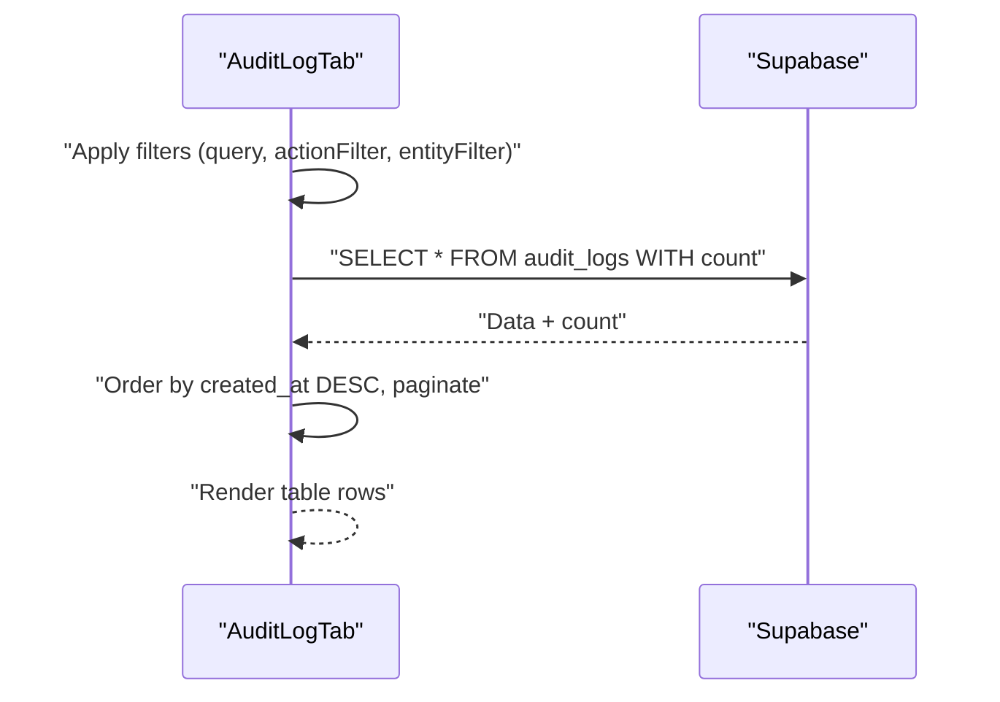
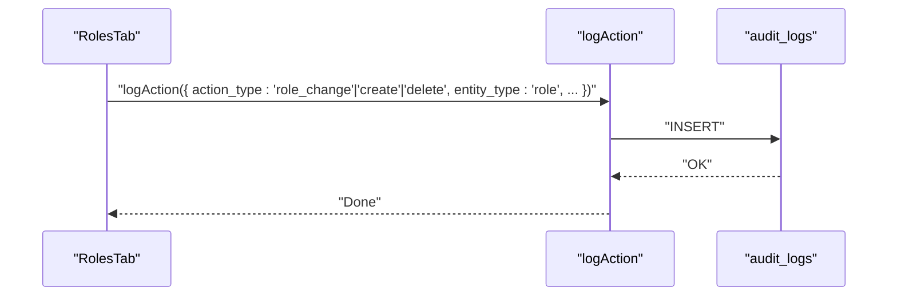
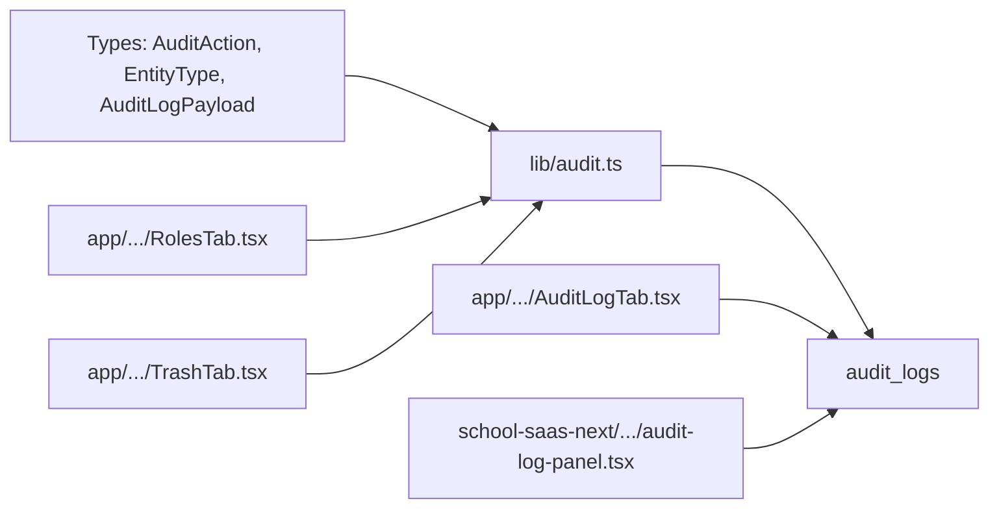

# Audit Logging System

<cite>
**Referenced Files in This Document**
- [audit.ts](file://lib/audit.ts)
- [AuditLogTab.tsx](file://app/[locale]/super-admin/components/AuditLogTab.tsx)
- [TrashTab.tsx](file://app/[locale]/super-admin/components/TrashTab.tsx)
- [RolesTab.tsx](file://app/[locale]/super-admin/components/RolesTab.tsx)
- [audit-log-panel.tsx](file://school-saas-next/src/components/super-admin/audit-log-panel.tsx)
- [admin-infrastructure.sql](file://admin_infrastructure.sql)
</cite>

## Table of Contents
1. [Introduction](#introduction)
2. [Project Structure](#project-structure)
3. [Core Components](#core-components)
4. [Architecture Overview](#architecture-overview)
5. [Detailed Component Analysis](#detailed-component-analysis)
6. [Dependency Analysis](#dependency-analysis)
7. [Performance Considerations](#performance-considerations)
8. [Troubleshooting Guide](#troubleshooting-guide)
9. [Conclusion](#conclusion)
10. [Appendices](#appendices)

## Introduction
This document describes the audit logging system that tracks administrative actions, system events, and security-relevant activities across the platform. It covers the audit log schema, supported action types and entity categories, the logAction function implementation, data capture mechanisms, storage strategies, and practical usage for compliance reporting, security monitoring, and incident investigation. It also includes examples of audit log queries, filtering capabilities, export procedures, retention policies, privacy considerations, and performance impact.

## Project Structure
The audit logging system spans client-side TypeScript utilities and Next.js components, with database-backed persistence via Supabase. Key locations:
- Central logging utility: lib/audit.ts
- Frontend audit log viewer: app/[locale]/super-admin/components/AuditLogTab.tsx
- Action-triggering components: app/[locale]/super-admin/components/RolesTab.tsx, app/[locale]/super-admin/components/TrashTab.tsx
- Secondary audit panel: school-saas-next/src/components/super-admin/audit-log-panel.tsx
- Database infrastructure: admin_infrastructure.sql

**Diagram sources**
- [audit.ts:40-62](file://lib/audit.ts#L40-L62)
- [RolesTab.tsx:190-238](file://app/[locale]/super-admin/components/RolesTab.tsx#L190-L238)
- [TrashTab.tsx:86-117](file://app/[locale]/super-admin/components/TrashTab.tsx#L86-L117)
- [AuditLogTab.tsx:43-74](file://app/[locale]/super-admin/components/AuditLogTab.tsx#L43-L74)
- [audit-log-panel.tsx:24-56](file://school-saas-next/src/components/super-admin/audit-log-panel.tsx#L24-L56)

**Section sources**
- [audit.ts:1-63](file://lib/audit.ts#L1-L63)
- [AuditLogTab.tsx:1-246](file://app/[locale]/super-admin/components/AuditLogTab.tsx#L1-L246)
- [TrashTab.tsx:1-258](file://app/[locale]/super-admin/components/TrashTab.tsx#L1-L258)
- [RolesTab.tsx:1-616](file://app/[locale]/super-admin/components/RolesTab.tsx#L1-L616)
- [audit-log-panel.tsx:24-56](file://school-saas-next/src/components/super-admin/audit-log-panel.tsx#L24-L56)

## Core Components
- Audit action types: create, update, delete, restore, login, logout, role_change, subscription_renew, export, import
- Entity types: school, user, subscription, student, payment, expense, branch, role
- Audit log payload fields: action_type, entity_type, entity_id, summary, metadata
- Central logging function: logAction(payload) inserts into the audit_logs table and captures actor identity from the current Supabase session

Key behaviors:
- Actor identification: actor_id, actor_email, actor_name are derived from the authenticated session
- Storage: writes to the audit_logs table via Supabase client
- Error handling: non-fatal errors are logged; missing table errors are tolerated to avoid blocking UI

**Section sources**
- [audit.ts:4-32](file://lib/audit.ts#L4-L32)
- [audit.ts:40-62](file://lib/audit.ts#L40-L62)

## Architecture Overview
The audit system follows a simple pipeline:
- Application components detect sensitive operations
- They call logAction with a structured payload
- logAction retrieves the current user and inserts a record into audit_logs
- UI components query and render audit logs with filters and pagination

**Diagram sources**
- [audit.ts:40-62](file://lib/audit.ts#L40-L62)
- [RolesTab.tsx:190-238](file://app/[locale]/super-admin/components/RolesTab.tsx#L190-L238)
- [TrashTab.tsx:86-117](file://app/[locale]/super-admin/components/TrashTab.tsx#L86-L117)

## Detailed Component Analysis

### Audit Log Schema and Storage
- Table: audit_logs
- Columns captured by logAction: actor_id, actor_email, actor_name, action_type, entity_type, entity_id, summary, metadata, created_at
- Additional columns observed in UI: id, actor_name, actor_email, action_type, entity_type, summary, created_at, metadata
- Filtering and ordering: UI queries support ilike filters on summary, actor_name, actor_email; equality filters on action_type and entity_type; order by created_at descending; pagination via range

**Diagram sources**
- [AuditLogTab.tsx:16-25](file://app/[locale]/super-admin/components/AuditLogTab.tsx#L16-L25)
- [audit.ts:45-54](file://lib/audit.ts#L45-L54)

**Section sources**
- [AuditLogTab.tsx:43-74](file://app/[locale]/super-admin/components/AuditLogTab.tsx#L43-L74)
- [audit.ts:45-54](file://lib/audit.ts#L45-L54)

### Supported Action Types and Entity Tracking
- Action types: create, update, delete, restore, login, logout, role_change, subscription_renew, export, import
- Entities: school, user, subscription, student, payment, expense, branch, role
- Examples of usage:
  - RolesTab triggers role_change, create, delete, clone actions
  - TrashTab triggers restore actions
  - Super Admin page triggers create/update/delete/subscription_renew actions

**Section sources**
- [audit.ts:4-24](file://lib/audit.ts#L4-L24)
- [RolesTab.tsx:190-265](file://app/[locale]/super-admin/components/RolesTab.tsx#L190-L265)
- [TrashTab.tsx:86-117](file://app/[locale]/super-admin/components/TrashTab.tsx#L86-L117)
- [AuditLogTab.tsx:115-134](file://app/[locale]/super-admin/components/AuditLogTab.tsx#L115-L134)

### logAction Implementation
- Retrieves current user via Supabase session
- Inserts a single row into audit_logs with actor_* fields populated from session
- Ignores missing table errors to prevent UI failures
- Non-fatal insert errors are logged to console

**Diagram sources**
- [audit.ts:40-62](file://lib/audit.ts#L40-L62)

**Section sources**
- [audit.ts:40-62](file://lib/audit.ts#L40-L62)

### Audit Trail Viewer and Filters
- Provides search across summary, actor_name, actor_email
- Action and entity type dropdown filters
- Pagination with page size and total count
- Displays actor, action, entity, summary, and timestamp
- Handles migration notices when audit_logs table is missing

**Diagram sources**
- [AuditLogTab.tsx:43-74](file://app/[locale]/super-admin/components/AuditLogTab.tsx#L43-L74)

**Section sources**
- [AuditLogTab.tsx:34-86](file://app/[locale]/super-admin/components/AuditLogTab.tsx#L34-L86)
- [AuditLogTab.tsx:43-74](file://app/[locale]/super-admin/components/AuditLogTab.tsx#L43-L74)

### Action Triggering Components
- RolesTab: role CRUD operations emit role_change, create, delete, clone actions
- TrashTab: restore operations emit restore actions
- Super Admin page: create/update/delete/subscription_renew actions emitted across various workflows

**Diagram sources**
- [RolesTab.tsx:190-238](file://app/[locale]/super-admin/components/RolesTab.tsx#L190-L238)

**Section sources**
- [RolesTab.tsx:190-265](file://app/[locale]/super-admin/components/RolesTab.tsx#L190-L265)
- [TrashTab.tsx:86-117](file://app/[locale]/super-admin/components/TrashTab.tsx#L86-L117)

### Secondary Audit Panel
- Displays recent audit entries in a compact table with actor, action, entity, and timestamp
- Uses localized labels and UTC date formatting utilities

**Section sources**
- [audit-log-panel.tsx:24-56](file://school-saas-next/src/components/super-admin/audit-log-panel.tsx#L24-L56)

## Dependency Analysis
- logAction depends on Supabase client for user retrieval and database insertion
- AuditLogTab depends on Supabase client for querying audit_logs
- Components depend on centralized types (AuditAction, EntityType) and payloads (AuditLogPayload)
- Infrastructure readiness: UI components check for audit_logs existence and soft-delete columns via admin infrastructure flags

**Diagram sources**
- [audit.ts:4-32](file://lib/audit.ts#L4-L32)
- [AuditLogTab.tsx:43-74](file://app/[locale]/super-admin/components/AuditLogTab.tsx#L43-L74)
- [RolesTab.tsx:190-238](file://app/[locale]/super-admin/components/RolesTab.tsx#L190-L238)
- [TrashTab.tsx:86-117](file://app/[locale]/super-admin/components/TrashTab.tsx#L86-L117)
- [audit-log-panel.tsx:24-56](file://school-saas-next/src/components/super-admin/audit-log-panel.tsx#L24-L56)

**Section sources**
- [audit.ts:1-63](file://lib/audit.ts#L1-L63)
- [AuditLogTab.tsx:1-246](file://app/[locale]/super-admin/components/AuditLogTab.tsx#L1-L246)
- [RolesTab.tsx:1-616](file://app/[locale]/super-admin/components/RolesTab.tsx#L1-L616)
- [TrashTab.tsx:1-258](file://app/[locale]/super-admin/components/TrashTab.tsx#L1-L258)
- [audit-log-panel.tsx:24-56](file://school-saas-next/src/components/super-admin/audit-log-panel.tsx#L24-L56)

## Performance Considerations
- Logging overhead: Each action triggers a database write; batching is not implemented
- Indexing recommendations:
  - created_at DESC for efficient sorting and pagination
  - action_type and entity_type for filter performance
  - composite indexes on (action_type, created_at), (entity_type, created_at), (actor_id, created_at) for frequent queries
- Pagination: UI uses range-based pagination; ensure appropriate limits and counts
- Network latency: Supabase inserts occur synchronously in some flows; consider offloading to background jobs for high-volume scenarios
- Data volume: Implement retention policies to cap table size and archive older entries

[No sources needed since this section provides general guidance]

## Troubleshooting Guide
Common issues and resolutions:
- Missing audit_logs table
  - Symptom: Migration notice in the audit log tab
  - Resolution: Run admin infrastructure SQL to create audit_logs and related columns
- Missing soft-delete columns for restore operations
  - Symptom: Migration notice indicating missing deleted_at/deleted_by
  - Resolution: Apply admin infrastructure updates for supported entities
- Insert errors
  - Symptom: Console errors during logAction
  - Resolution: Check Supabase connection, table schema, and RBAC policies
- No logs visible
  - Symptom: Empty audit log table
  - Resolution: Verify that logAction is called from components and that the user is authenticated

**Section sources**
- [AuditLogTab.tsx:82-86](file://app/[locale]/super-admin/components/AuditLogTab.tsx#L82-L86)
- [TrashTab.tsx:119-123](file://app/[locale]/super-admin/components/TrashTab.tsx#L119-L123)
- [audit.ts:56-61](file://lib/audit.ts#L56-L61)

## Conclusion
The audit logging system provides a straightforward mechanism to track administrative actions and system events. It centralizes logging via a typed utility, supports flexible filtering and pagination in the UI, and integrates with Supabase for reliable persistence. To maximize effectiveness, deploy the required database infrastructure, apply indexing strategies, and adopt retention and privacy policies aligned with compliance requirements.

[No sources needed since this section summarizes without analyzing specific files]

## Appendices

### Audit Log Queries and Filtering Examples
- Basic listing with pagination and ordering
  - SELECT * FROM audit_logs ORDER BY created_at DESC LIMIT N OFFSET M
- Full-text-like search across actor and summary fields
  - SELECT * FROM audit_logs WHERE summary ILIKE '%...%' OR actor_name ILIKE '%...%' OR actor_email ILIKE '%...%'
- Filter by action type
  - SELECT * FROM audit_logs WHERE action_type = 'create'
- Filter by entity type
  - SELECT * FROM audit_logs WHERE entity_type = 'school'
- Combined filters
  - SELECT * FROM audit_logs WHERE action_type = 'update' AND entity_type = 'user' ORDER BY created_at DESC

[No sources needed since this section provides general guidance]

### Export Procedures
- Use the audit log viewer’s built-in filters to narrow results
- Export via database client or Supabase SQL editor to CSV/JSON
- Consider scheduled exports for compliance reporting

[No sources needed since this section provides general guidance]

### Retention Policies and Privacy
- Retention: Define a policy to automatically archive or delete old audit records (e.g., keep 2 years)
- Privacy: Avoid storing sensitive personal data in summary or metadata; mask or exclude PII where possible
- Access control: Restrict audit log access to authorized administrators only

[No sources needed since this section provides general guidance]

### Database Infrastructure
- Ensure audit_logs table exists and includes required columns
- Enable soft-delete columns (deleted_at, deleted_by) on supported entities for restore tracking

**Section sources**
- [admin-infrastructure.sql](file://admin_infrastructure.sql)