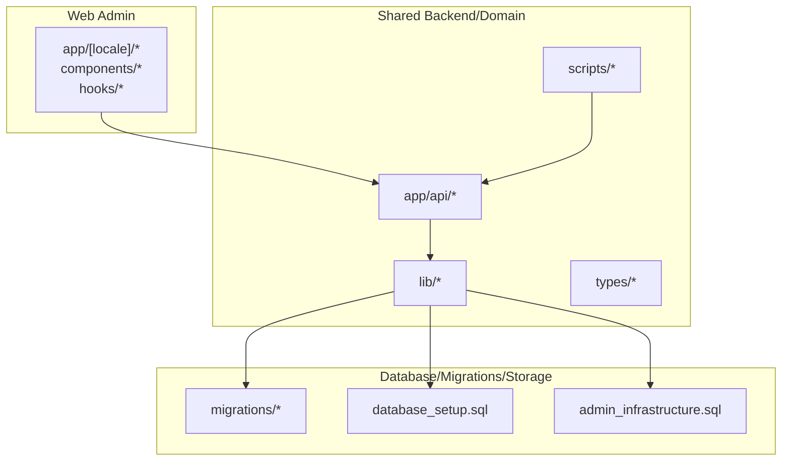
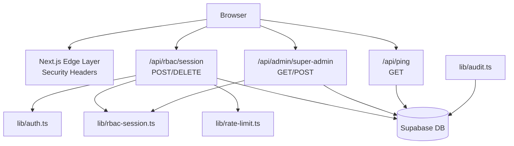
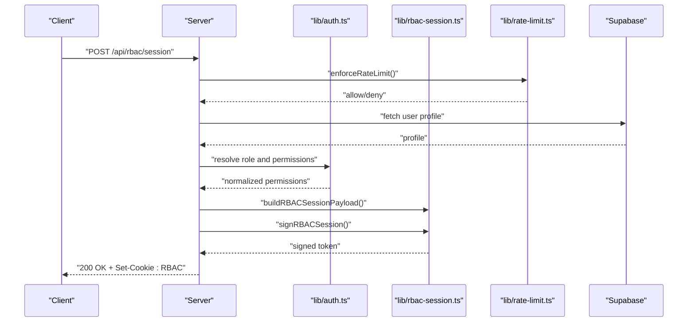
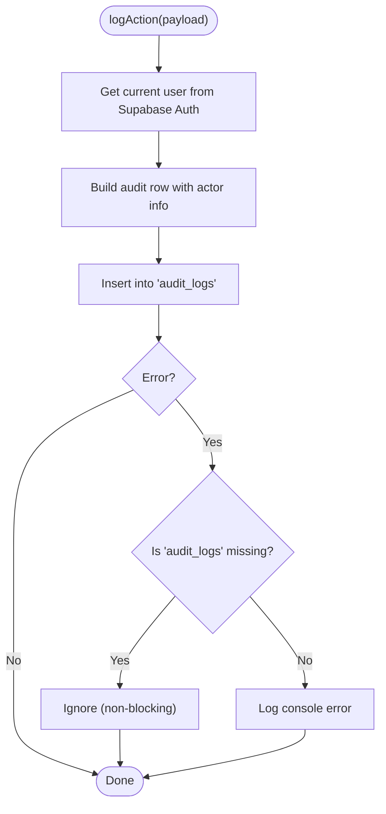
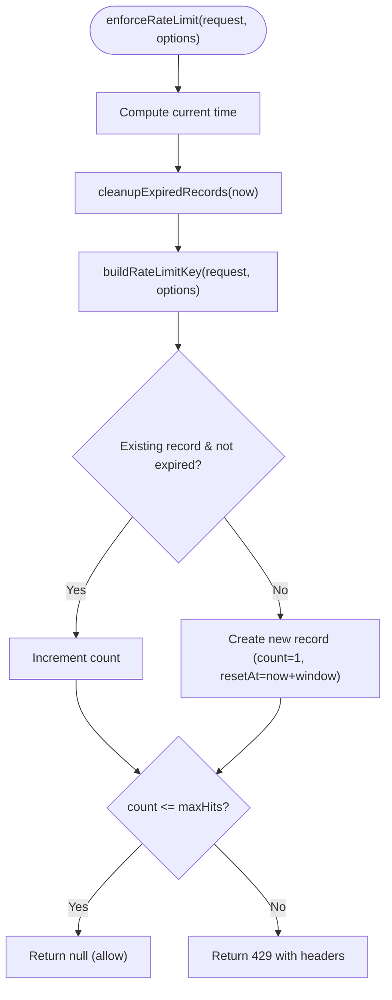
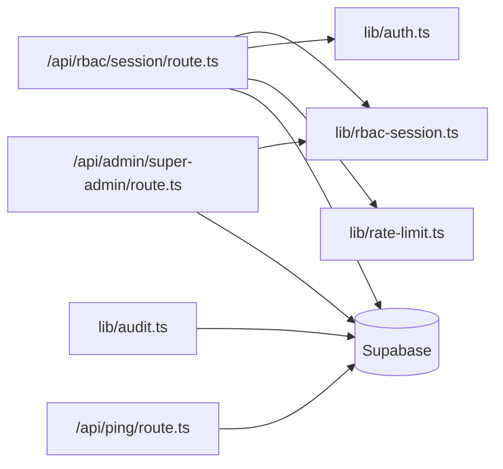

# Compliance and Monitoring

<cite>
**Referenced Files in This Document**
- [SECURITY.md](file://SECURITY.md)
- [README.md](file://README.md)
- [lib/audit.ts](file://lib/audit.ts)
- [lib/rate-limit.ts](file://lib/rate-limit.ts)
- [lib/auth.ts](file://lib/auth.ts)
- [lib/rbac-session.ts](file://lib/rbac-session.ts)
- [app/api/rbac/session/route.ts](file://app/api/rbac/session/route.ts)
- [app/api/ping/route.ts](file://app/api/ping/route.ts)
- [migrations/README.md](file://migrations/README.md)
- [school-saas-next/src/app/api/admin/super-admin/route.ts](file://school-saas-next/src/app/api/admin/super-admin/route.ts)
- [school-saas-next/src/components/super-admin/audit-log-panel.tsx](file://school-saas-next/src/components/super-admin/audit-log-panel.tsx)
</cite>

## Table of Contents
1. [Introduction](#introduction)
2. [Project Structure](#project-structure)
3. [Core Components](#core-components)
4. [Architecture Overview](#architecture-overview)
5. [Detailed Component Analysis](#detailed-component-analysis)
6. [Dependency Analysis](#dependency-analysis)
7. [Performance Considerations](#performance-considerations)
8. [Troubleshooting Guide](#troubleshooting-guide)
9. [Conclusion](#conclusion)
10. [Appendices](#appendices)

## Introduction
This document provides comprehensive guidance for security compliance and monitoring within the school platform. It consolidates the current security controls, outlines access control and audit trail requirements, and describes operational expectations for maintaining a secure environment. It also explains how to prepare for compliance reporting, collect security metrics, and maintain robust monitoring and incident response processes.

The repository defines a web admin application and shared backend/domain layer with Supabase-backed authentication, row-level security (RLS), signed RBAC session cookies, and rate limiting. These capabilities form the foundation for data protection, access governance, and operational observability.

## Project Structure
The repository is organized into:
- Web admin UI under app/[locale], components/, hooks/, messages/, public/
- Shared backend/domain under app/api/, lib/, types/, proxy.ts, scripts/
- Database/migrations/storage under migrations/, database_setup.sql, admin_infrastructure.sql

These boundaries help separate concerns and ensure that security-sensitive logic resides in the shared backend and database layers.

**Diagram sources**
- [README.md:18-31](file://README.md#L18-L31)

**Section sources**
- [README.md:18-31](file://README.md#L18-L31)

## Core Components
This section summarizes the core security and monitoring components and how they contribute to compliance and observability.

- Authentication and Access Control
  - Supabase Auth for authenticated identities and session management.
  - RBAC session cookies signed by a dedicated secret for web access control.
  - Server-side role and school-scope checks on management APIs.
  - Role-based access decisions and read-only enforcement per path.

- Audit Trail
  - Centralized audit logging via a dedicated table with structured actions and metadata.
  - Client- and server-side logging capability with graceful degradation on missing tables.

- Rate Limiting
  - In-process rate limiter keyed by IP or identifier with sliding windows and cleanup.
  - Enforced on sensitive admin and session routes.

- Database Security
  - RLS helper functions and access policies defined in migrations and admin infrastructure.
  - Shared managed-user schema and storage policies.

- Health Monitoring
  - Public health-check endpoint probing server timestamp and Supabase connectivity.

**Section sources**
- [SECURITY.md:8-16](file://SECURITY.md#L8-L16)
- [lib/auth.ts:106-145](file://lib/auth.ts#L106-L145)
- [lib/rbac-session.ts:19-50](file://lib/rbac-session.ts#L19-L50)
- [app/api/rbac/session/route.ts:14-133](file://app/api/rbac/session/route.ts#L14-L133)
- [lib/audit.ts:40-62](file://lib/audit.ts#L40-L62)
- [lib/rate-limit.ts:65-101](file://lib/rate-limit.ts#L65-L101)
- [migrations/README.md:5-11](file://migrations/README.md#L5-L11)
- [app/api/ping/route.ts:10-50](file://app/api/ping/route.ts#L10-L50)

## Architecture Overview
The security architecture integrates client-side RBAC sessions, server-side access checks, and centralized audit logging. The following diagram maps the primary components and their interactions.

**Diagram sources**
- [app/api/rbac/session/route.ts:14-133](file://app/api/rbac/session/route.ts#L14-L133)
- [school-saas-next/src/app/api/admin/super-admin/route.ts:25-35](file://school-saas-next/src/app/api/admin/super-admin/route.ts#L25-L35)
- [app/api/ping/route.ts:10-50](file://app/api/ping/route.ts#L10-L50)
- [lib/auth.ts:106-145](file://lib/auth.ts#L106-L145)
- [lib/rbac-session.ts:112-142](file://lib/rbac-session.ts#L112-L142)
- [lib/rate-limit.ts:65-101](file://lib/rate-limit.ts#L65-L101)
- [lib/audit.ts:40-62](file://lib/audit.ts#L40-L62)

## Detailed Component Analysis

### Access Control and RBAC Session Management
- RBAC Cookie Signing
  - Dedicated secret is required in production; fallback to JWT secret is discouraged and flagged with warnings.
  - Payload includes role, permissions, school scope, and subscription status with expiration.
  - Cookie options enforce HttpOnly, SameSite, and Secure flags based on environment.

- Session Initialization and Cleanup
  - Endpoint POST initializes a signed RBAC session after validating user profile and permissions.
  - Endpoint DELETE clears the RBAC cookie with immediate expiry.
  - Rate limiting protects both endpoints from abuse.

- Access Decisions
  - Server-side logic resolves role, checks permissions, and enforces school/subscriptions constraints.
  - Read-only access is determined per path and role.

**Diagram sources**
- [app/api/rbac/session/route.ts:14-133](file://app/api/rbac/session/route.ts#L14-L133)
- [lib/rbac-session.ts:56-119](file://lib/rbac-session.ts#L56-L119)
- [lib/auth.ts:106-145](file://lib/auth.ts#L106-L145)
- [lib/rate-limit.ts:65-101](file://lib/rate-limit.ts#L65-L101)

**Section sources**
- [lib/rbac-session.ts:19-50](file://lib/rbac-session.ts#L19-L50)
- [lib/rbac-session.ts:112-142](file://lib/rbac-session.ts#L112-L142)
- [app/api/rbac/session/route.ts:14-133](file://app/api/rbac/session/route.ts#L14-L133)
- [lib/auth.ts:106-145](file://lib/auth.ts#L106-L145)

### Audit Logging
- Audit Log Schema and Actions
  - Structured actions and entity types capture administrative and operational events.
  - Payload supports optional metadata for richer context.

- Logging Mechanism
  - Client- and server-side logging inserts into the audit_logs table.
  - Graceful handling when the audit table is missing (non-blocking).

- Super Admin Audit Panel
  - UI displays recent audit entries with actor, action, entity, and timestamp.

**Diagram sources**
- [lib/audit.ts:40-62](file://lib/audit.ts#L40-L62)

**Section sources**
- [lib/audit.ts:4-32](file://lib/audit.ts#L4-L32)
- [lib/audit.ts:40-62](file://lib/audit.ts#L40-L62)
- [school-saas-next/src/components/super-admin/audit-log-panel.tsx:14-56](file://school-saas-next/src/components/super-admin/audit-log-panel.tsx#L14-L56)

### Rate Limiting
- Implementation
  - Sliding window with per-identifier counters stored in memory.
  - Automatic cleanup of expired records.
  - Standardized headers expose limits and reset times.

- Enforcement
  - Applied to RBAC session endpoints to mitigate brute-force and abuse.

**Diagram sources**
- [lib/rate-limit.ts:34-101](file://lib/rate-limit.ts#L34-L101)

**Section sources**
- [lib/rate-limit.ts:65-101](file://lib/rate-limit.ts#L65-L101)
- [app/api/rbac/session/route.ts:32-40](file://app/api/rbac/session/route.ts#L32-L40)

### Database Security and RLS
- Scope
  - Migrations and admin infrastructure define shared managed-user schema, storage policies, and RLS helper functions.

- Guidance
  - Keep migration filenames stable and document intent clearly.
  - Apply migrations before deploying application code that depends on new RLS or schema behavior.

**Section sources**
- [migrations/README.md:5-11](file://migrations/README.md#L5-L11)
- [migrations/README.md:25-31](file://migrations/README.md#L25-L31)
- [SECURITY.md:33](file://SECURITY.md#L33)

### Health Monitoring
- Endpoint
  - Public GET /api/ping returns server timestamp and a lightweight Supabase connectivity probe with no-store caching.

- Use Cases
  - Load balancer health checks, synthetic monitoring, and basic uptime verification.

**Section sources**
- [app/api/ping/route.ts:10-50](file://app/api/ping/route.ts#L10-L50)

## Dependency Analysis
The following diagram shows key dependencies among security and monitoring components.

**Diagram sources**
- [app/api/rbac/session/route.ts:14-133](file://app/api/rbac/session/route.ts#L14-L133)
- [school-saas-next/src/app/api/admin/super-admin/route.ts:25-35](file://school-saas-next/src/app/api/admin/super-admin/route.ts#L25-L35)
- [lib/rbac-session.ts:112-142](file://lib/rbac-session.ts#L112-L142)
- [lib/auth.ts:106-145](file://lib/auth.ts#L106-L145)
- [lib/rate-limit.ts:65-101](file://lib/rate-limit.ts#L65-L101)
- [lib/audit.ts:40-62](file://lib/audit.ts#L40-L62)
- [app/api/ping/route.ts:10-50](file://app/api/ping/route.ts#L10-L50)

**Section sources**
- [app/api/rbac/session/route.ts:14-133](file://app/api/rbac/session/route.ts#L14-L133)
- [school-saas-next/src/app/api/admin/super-admin/route.ts:25-35](file://school-saas-next/src/app/api/admin/super-admin/route.ts#L25-L35)
- [lib/audit.ts:40-62](file://lib/audit.ts#L40-L62)

## Performance Considerations
- RBAC Session Signing
  - Uses HMAC-SHA256 with base64url encoding; signing cost scales linearly with payload size.
  - Dedicated secret avoids unnecessary cross-service dependencies.

- Rate Limiting
  - In-process map storage is efficient for moderate concurrency; consider external caching for distributed deployments.

- Audit Logging
  - Inserts are asynchronous and non-blocking; ensure database write performance aligns with expected audit volume.

[No sources needed since this section provides general guidance]

## Troubleshooting Guide
- RBAC Cookie Secret Not Configured
  - Symptom: Server returns 500 indicating RBAC secret is not configured.
  - Resolution: Set a dedicated RBAC_COOKIE_SECRET; avoid fallback to JWT secret in production.

- Unauthorized or Forbidden Access
  - Symptom: 401 or 403 responses from RBAC session or admin endpoints.
  - Resolution: Verify user session, role resolution, and school/subscription status.

- Rate Limit Exceeded
  - Symptom: 429 responses with Retry-After and X-RateLimit headers.
  - Resolution: Reduce client-side retry frequency or increase maxHits/windowMs.

- Audit Log Insertion Fails
  - Symptom: Console errors during audit logging.
  - Resolution: Ensure audit_logs table exists; the system ignores missing table errors gracefully.

- Supabase Connectivity Probe Failure
  - Symptom: /api/ping indicates "error" for Supabase.
  - Resolution: Verify Supabase URL and API key environment variables; check network and timeouts.

**Section sources**
- [lib/rbac-session.ts:19-50](file://lib/rbac-session.ts#L19-L50)
- [app/api/rbac/session/route.ts:14-72](file://app/api/rbac/session/route.ts#L14-L72)
- [lib/rate-limit.ts:86-101](file://lib/rate-limit.ts#L86-L101)
- [lib/audit.ts:56-62](file://lib/audit.ts#L56-L62)
- [app/api/ping/route.ts:14-34](file://app/api/ping/route.ts#L14-L34)

## Conclusion
The platform implements a layered security model centered on Supabase Auth, signed RBAC session cookies, server-side access checks, and comprehensive audit logging. Database security is enforced through RLS and shared schema policies. Operational monitoring is supported by a public health-check endpoint and built-in rate limiting. Together, these controls provide a strong foundation for data protection, access governance, and compliance readiness.

[No sources needed since this section summarizes without analyzing specific files]

## Appendices

### Compliance Requirements and Controls Mapping
- Data Protection Regulations
  - Access control aligned with least privilege and role-based permissions.
  - Signed RBAC sessions protect session integrity and prevent tampering.
  - RLS ensures tenant isolation and data access scoping.

- Access Control Policies
  - Role-based access decisions and read-only enforcement per path.
  - School and subscription status checks prevent unauthorized access.

- Audit Trail Requirements
  - Structured audit logs with actor, action, entity, and metadata.
  - UI panel for recent audit entries to support internal oversight.

- Security Monitoring Setup
  - Health-check endpoint for uptime and connectivity.
  - Rate limiting to mitigate abuse and protect sensitive endpoints.

- Incident Response and Recovery
  - Rotate secrets immediately upon suspected exposure.
  - Apply migrations before deploying dependent application code.
  - Review audit logs and access patterns during investigations.

- Compliance Reporting and Metrics
  - Use audit logs to generate activity reports and demonstrate adherence to policies.
  - Track rate limit triggers and health-check outcomes as operational metrics.

- Regulatory Audit Preparation
  - Maintain documentation of security controls and operational expectations.
  - Demonstrate RLS policies and session management configurations.

**Section sources**
- [SECURITY.md:8-16](file://SECURITY.md#L8-L16)
- [SECURITY.md:30-36](file://SECURITY.md#L30-L36)
- [lib/auth.ts:106-145](file://lib/auth.ts#L106-L145)
- [lib/audit.ts:4-32](file://lib/audit.ts#L4-L32)
- [app/api/ping/route.ts:10-50](file://app/api/ping/route.ts#L10-L50)
- [lib/rate-limit.ts:65-101](file://lib/rate-limit.ts#L65-L101)

### Data Retention and Privacy
- Data Retention
  - Define retention periods for audit logs and related operational data in alignment with policy.
  - Configure database archival and cleanup jobs accordingly.

- Privacy Impact Assessments
  - Document how personal data is processed, stored, and protected.
  - Assess risks associated with session cookies, audit logs, and third-party integrations.

- Maintenance Procedures
  - Regularly review and update access policies and RLS rules.
  - Rotate secrets and re-key RBAC sessions periodically.

[No sources needed since this section provides general guidance]

### Security Testing and Continuous Improvement
- Security Testing
  - Penetration testing: Focus on session management, RBAC endpoints, and database access vectors.
  - Automated scanning: Integrate npm audit and linters into CI/CD pipelines.
  - Load and reliability testing: Use provided scripts to validate resilience under stress.

- Continuous Improvement
  - Monitor rate limit and audit metrics to identify anomalies.
  - Conduct periodic reviews of access controls and RLS policies.
  - Update incident response playbooks based on lessons learned.

**Section sources**
- [SECURITY.md:34-36](file://SECURITY.md#L34-L36)
- [README.md:32-44](file://README.md#L32-L44)