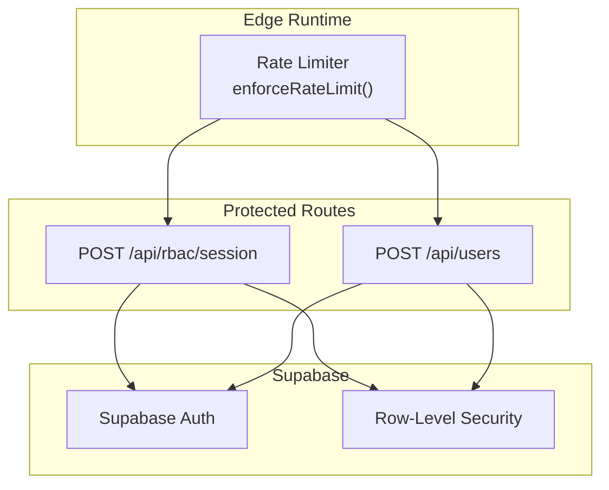
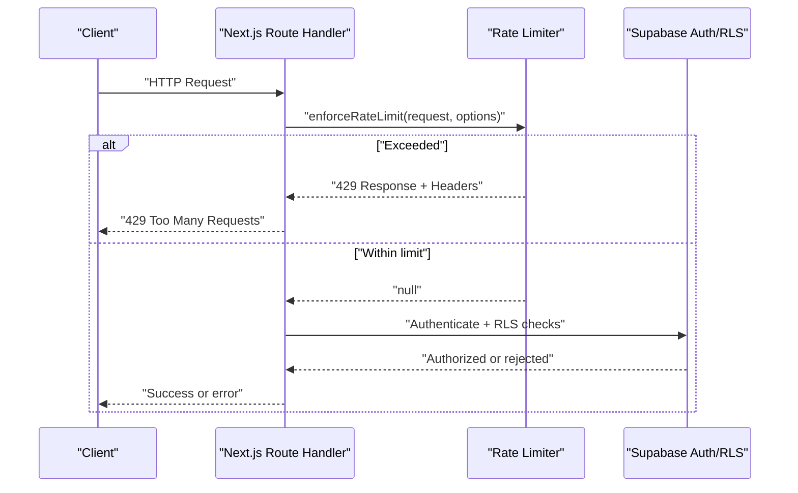
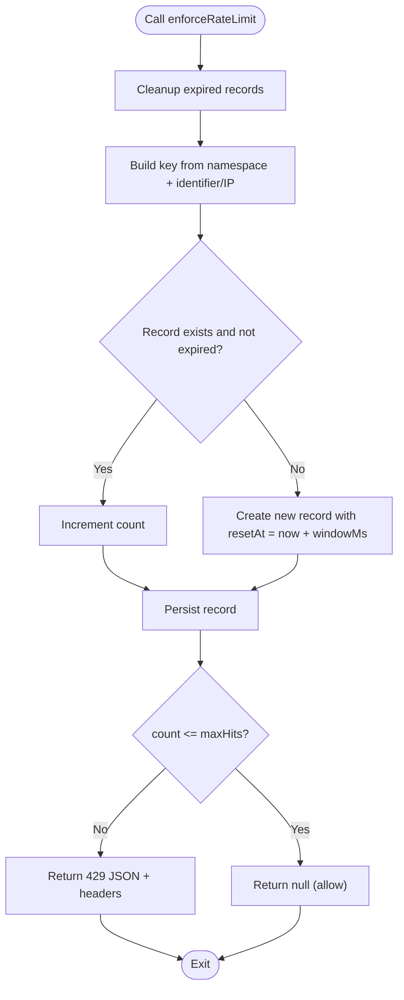
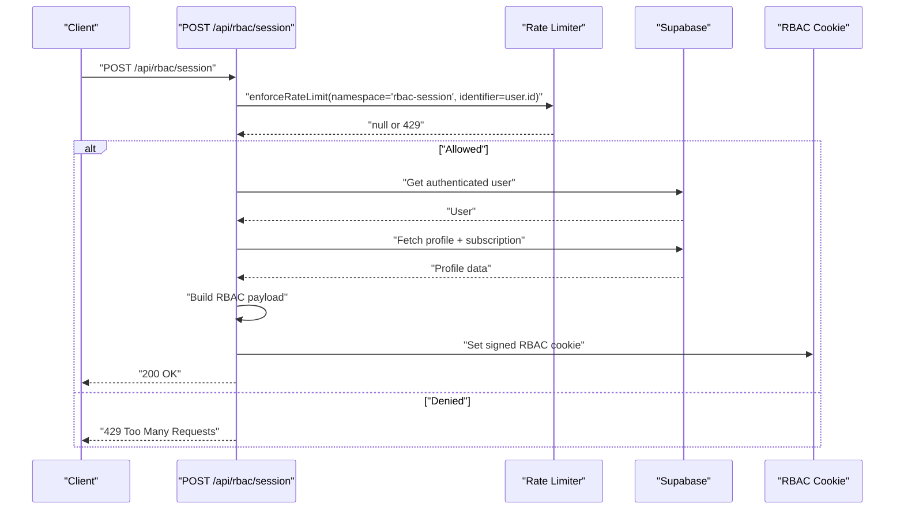
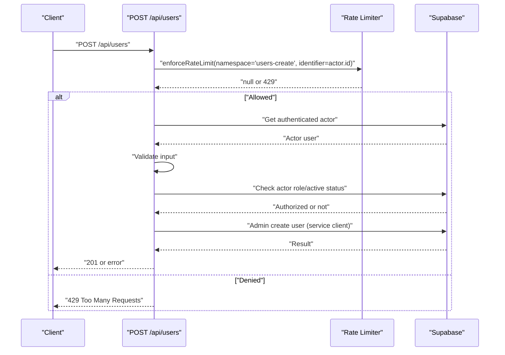
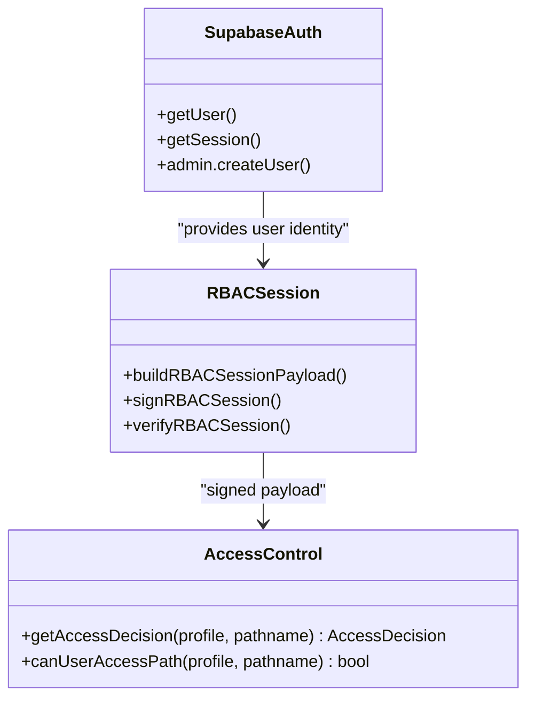
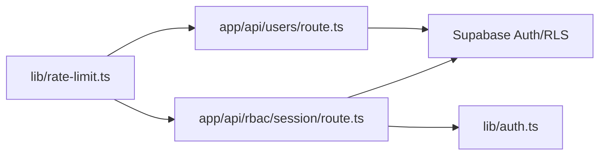

# Rate Limiting and Protection

<cite>
**Referenced Files in This Document**
- [rate-limit.ts](file://lib/rate-limit.ts)
- [route.ts](file://app/api/rbac/session/route.ts)
- [route.ts](file://app/api/users/route.ts)
- [SECURITY.md](file://SECURITY.md)
- [auth.ts](file://lib/auth.ts)
- [load-audit.json](file://artifacts/reliability-audit/load-audit.json)
</cite>

## Table of Contents
1. [Introduction](#introduction)
2. [Project Structure](#project-structure)
3. [Core Components](#core-components)
4. [Architecture Overview](#architecture-overview)
5. [Detailed Component Analysis](#detailed-component-analysis)
6. [Dependency Analysis](#dependency-analysis)
7. [Performance Considerations](#performance-considerations)
8. [Troubleshooting Guide](#troubleshooting-guide)
9. [Conclusion](#conclusion)
10. [Appendices](#appendices)

## Introduction
This document explains the rate limiting and security protection mechanisms implemented in the project. It covers request throttling, IP-based restrictions, user session limits, and protections against brute force login attempts, API abuse, and denial-of-service scenarios. It also documents the integration with Supabase authentication and row-level security (RLS), custom protection logic, configuration options for different tiers, exception handling, alerting mechanisms, monitoring of suspicious activities, handling of legitimate high-volume requests, and performance/scaling implications.

## Project Structure
The rate limiting logic is centralized in a reusable library module and integrated into selected Next.js routes that handle sensitive operations. Security controls are documented in the repository’s security policy and enforced via Supabase Auth, RLS, and RBAC session cookies.

**Diagram sources**
- [rate-limit.ts:65-101](file://lib/rate-limit.ts#L65-L101)
- [route.ts:14-40](file://app/api/rbac/session/route.ts#L14-L40)
- [route.ts:77-111](file://app/api/users/route.ts#L77-L111)

**Section sources**
- [SECURITY.md:8-16](file://SECURITY.md#L8-L16)

## Core Components
- Centralized rate limiter: Implements sliding-window counting with an in-memory store and periodic cleanup.
- Route integrations: Sensitive routes apply rate limits keyed by user ID or IP, returning standardized headers and 429 responses when exceeded.
- Supabase integration: Authentication and RLS guard access; RBAC session cookies enforce role-based access control server-side.
- Security posture: Signed RBAC cookies, Supabase Auth, RLS, and tenant scoping; documented operational expectations and vulnerability reporting.

**Section sources**
- [rate-limit.ts:1-102](file://lib/rate-limit.ts#L1-L102)
- [route.ts:14-40](file://app/api/rbac/session/route.ts#L14-L40)
- [route.ts:77-111](file://app/api/users/route.ts#L77-L111)
- [SECURITY.md:8-16](file://SECURITY.md#L8-L16)

## Architecture Overview
The rate limiter is invoked at the beginning of sensitive routes. If a limit is exceeded, the route returns a 429 with standard rate limit headers. Otherwise, the route proceeds to authenticate the caller via Supabase, enforce RLS, and perform the operation.

**Diagram sources**
- [rate-limit.ts:65-101](file://lib/rate-limit.ts#L65-L101)
- [route.ts:14-40](file://app/api/rbac/session/route.ts#L14-L40)
- [route.ts:77-111](file://app/api/users/route.ts#L77-L111)

## Detailed Component Analysis

### Rate Limiter Implementation
- Sliding window: Tracks hits per window and resets the window upon expiry.
- Identifier selection: Defaults to client IP (via forwarded headers) but supports explicit identifiers (e.g., user ID).
- Cleanup: Periodic removal of expired records to prevent unbounded memory growth.
- Response: Returns null when under limit; otherwise constructs a JSON 429 response with standard headers for Retry-After and X-RateLimit-* metrics.

**Diagram sources**
- [rate-limit.ts:34-45](file://lib/rate-limit.ts#L34-L45)
- [rate-limit.ts:47-51](file://lib/rate-limit.ts#L47-L51)
- [rate-limit.ts:65-101](file://lib/rate-limit.ts#L65-L101)

**Section sources**
- [rate-limit.ts:16-18](file://lib/rate-limit.ts#L16-L18)
- [rate-limit.ts:20-32](file://lib/rate-limit.ts#L20-L32)
- [rate-limit.ts:53-63](file://lib/rate-limit.ts#L53-L63)
- [rate-limit.ts:65-101](file://lib/rate-limit.ts#L65-L101)

### RBAC Session Route Protection
- Enforces rate limiting keyed by authenticated user ID for session initialization and deletion endpoints.
- After passing rate limits, authenticates the user, validates profile and subscription state, builds an RBAC payload, signs it, and sets a secure cookie.

**Diagram sources**
- [route.ts:14-40](file://app/api/rbac/session/route.ts#L14-L40)
- [route.ts:42-132](file://app/api/rbac/session/route.ts#L42-L132)
- [rate-limit.ts:65-101](file://lib/rate-limit.ts#L65-L101)

**Section sources**
- [route.ts:14-40](file://app/api/rbac/session/route.ts#L14-L40)
- [route.ts:135-154](file://app/api/rbac/session/route.ts#L135-L154)

### Users Management Route Protection
- Enforces rate limiting keyed by authenticated user ID for user creation requests.
- Validates inputs, checks actor permissions via Supabase, and performs admin user creation through the service client.

**Diagram sources**
- [route.ts:77-111](file://app/api/users/route.ts#L77-L111)
- [route.ts:113-130](file://app/api/users/route.ts#L113-L130)
- [rate-limit.ts:65-101](file://lib/rate-limit.ts#L65-L101)

**Section sources**
- [route.ts:77-111](file://app/api/users/route.ts#L77-L111)

### Supabase Authentication and RBAC Integration
- Supabase Auth verifies identities; RLS ensures tenant scoping and data isolation.
- RBAC session cookies are signed and validated server-side to enforce role-based access control for the web admin surface.
- Access decisions incorporate role, permissions, school activity, and subscription status.

**Diagram sources**
- [auth.ts:239-267](file://lib/auth.ts#L239-L267)
- [auth.ts:106-144](file://lib/auth.ts#L106-L144)
- [route.ts:112-131](file://app/api/rbac/session/route.ts#L112-L131)

**Section sources**
- [auth.ts:106-144](file://lib/auth.ts#L106-L144)
- [auth.ts:239-267](file://lib/auth.ts#L239-L267)
- [SECURITY.md:10-15](file://SECURITY.md#L10-L15)

## Dependency Analysis
- The rate limiter depends on Next.js runtime primitives for request headers and response construction.
- Sensitive routes depend on the rate limiter and Supabase for authentication and authorization.
- RBAC session signing/verification depends on a server-side secret and cryptographic primitives.

**Diagram sources**
- [rate-limit.ts:1-2](file://lib/rate-limit.ts#L1-L2)
- [route.ts:1-12](file://app/api/rbac/session/route.ts#L1-L12)
- [route.ts:1-9](file://app/api/users/route.ts#L1-L9)
- [auth.ts:1-15](file://lib/auth.ts#L1-L15)

**Section sources**
- [rate-limit.ts:1-2](file://lib/rate-limit.ts#L1-L2)
- [route.ts:1-12](file://app/api/rbac/session/route.ts#L1-L12)
- [route.ts:1-9](file://app/api/users/route.ts#L1-L9)
- [auth.ts:1-15](file://lib/auth.ts#L1-L15)

## Performance Considerations
- Memory footprint: The in-memory store grows with unique identifiers and windows. Cleanup runs periodically to remove expired entries.
- Scaling: The current implementation is local to a single runtime instance. For multi-instance deployments, external storage (e.g., Redis) would be required to share state across instances.
- Latency: Rate limiting adds minimal overhead; the primary cost is header parsing and map operations.
- Burst handling: Short bursts within the window are permitted; long-term abuse is mitigated by repeated 429 responses and headers enabling clients to retry later.

[No sources needed since this section provides general guidance]

## Troubleshooting Guide
- 429 responses: Inspect standard headers (Retry-After, X-RateLimit-Limit, X-RateLimit-Remaining, X-RateLimit-Reset) to diagnose throttling behavior.
- Excessive 429s: Review route-specific configurations (namespace, windowMs, maxHits) and adjust for legitimate workloads.
- RBAC session failures: Ensure the RBAC secret is configured and that the signed cookie is present and valid.
- Load test anomalies: The reliability audit indicates that some tests triggered 401 responses, which may be due to session or rate limit interactions; review route order and headers.

**Section sources**
- [rate-limit.ts:53-63](file://lib/rate-limit.ts#L53-L63)
- [route.ts:15-20](file://app/api/rbac/session/route.ts#L15-L20)
- [load-audit.json:194-236](file://artifacts/reliability-audit/load-audit.json#L194-L236)

## Conclusion
The project implements a practical, in-process rate limiter integrated into sensitive routes, complemented by robust Supabase authentication, RLS, and RBAC session cookies. The approach balances simplicity with strong protections against abuse while providing observability via standard headers. For production-scale deployments, consider migrating the rate limiter store to a distributed cache and adding centralized alerting for repeated 429s and unusual spikes.

[No sources needed since this section summarizes without analyzing specific files]

## Appendices

### Configuration Options and Examples
- Rate limiting options:
  - namespace: Logical grouping for keys (e.g., "rbac-session", "users-create").
  - windowMs: Time window in milliseconds for counting hits.
  - maxHits: Maximum allowed requests per window.
  - identifier: Optional explicit key (e.g., user ID) to throttle per user; defaults to client IP derived from headers.
- Example configurations observed in routes:
  - RBAC session init: window of 60 seconds with 30 hits per user.
  - RBAC session delete: window of 60 seconds with 60 hits (less restrictive).
  - Users create: window of 10 minutes with 10 hits per user.

**Section sources**
- [rate-limit.ts:9-14](file://lib/rate-limit.ts#L9-L14)
- [route.ts:32-37](file://app/api/rbac/session/route.ts#L32-L37)
- [route.ts:136-140](file://app/api/rbac/session/route.ts#L136-L140)
- [route.ts:103-108](file://app/api/users/route.ts#L103-L108)

### Monitoring Suspicious Activities
- Standard headers returned on 429 enable clients and infrastructure to track retry timing and remaining quota.
- Combine with logs and edge/cloud monitoring to detect coordinated bursts or persistent abuse patterns.
- Consider correlating rate limit events with Supabase analytics and RBAC session creation/deletion.

**Section sources**
- [rate-limit.ts:53-63](file://lib/rate-limit.ts#L53-L63)

### Handling Legitimate High-Volume Requests
- Increase maxHits and/or windowMs for known bulk operations.
- Use identifier-based throttling (user ID) to isolate noisy users while allowing others to proceed.
- Offload heavy tasks to background jobs and batch endpoints to reduce peak load.

[No sources needed since this section provides general guidance]

### Supabase Integration Notes
- Authentication: Verified via Supabase Auth; unauthorized requests are rejected early.
- Authorization: Enforced via RLS and role checks; RBAC session cookies provide server-side enforcement.
- Security controls: Signed RBAC cookies, Supabase Auth, RLS, tenant scoping, and documented operational expectations.

**Section sources**
- [SECURITY.md:8-16](file://SECURITY.md#L8-L16)
- [auth.ts:106-144](file://lib/auth.ts#L106-L144)