# Academic Records & Performance

<cite>
**Referenced Files in This Document**
- [academic-year.ts](file://lib/academic-year.ts)
- [academic-records-server.ts](file://lib/academic-records-server.ts)
- [20260324_010000_academic_records_scope_model.sql](file://migrations/20260324_010000_academic_records_scope_model.sql)
- [20260322_managed_mobile_rls.sql](file://migrations/20260322_managed_mobile_rls.sql)
- [20260322_010000_teacher_assignment_accounts.sql](file://migrations/20260322_010000_teacher_assignment_accounts.sql)
- [academic-records-server.ts](file://lib/academic-records-server.ts)
- [mobile.student.grades.route.ts](file://app/api/mobile/student/grades/route.ts)
- [mobile.student.assignments.route.ts](file://app/api/mobile/student/assignments/route.ts)
- [web.students.list.route.ts](file://app/api/web/students/list/route.ts)
- [academic-records-server.ts](file://lib/academic-records-server.ts)
- [academic-records-server.ts](file://lib/academic-records-server.ts)
</cite>

## Table of Contents
1. [Introduction](#introduction)
2. [Project Structure](#project-structure)
3. [Core Components](#core-components)
4. [Architecture Overview](#architecture-overview)
5. [Detailed Component Analysis](#detailed-component-analysis)
6. [Dependency Analysis](#dependency-analysis)
7. [Performance Considerations](#performance-considerations)
8. [Troubleshooting Guide](#troubleshooting-guide)
9. [Conclusion](#conclusion)
10. [Appendices](#appendices)

## Introduction
This document describes the academic records system, focusing on academic year management, term scheduling, calendar integration, grade tracking, subject enrollment, transcript generation, performance analytics (GPA, distributions, progress monitoring), integration with class management, assignment tracking, and exam scheduling. It also covers policy enforcement, appeals, and academic standing calculations.

## Project Structure
The academic records system spans:
- Migrations defining the schema for subjects, teacher assignments, assignments, and grades, including indexes and row-level security policies.
- Server-side utilities that validate scopes, normalize inputs, resolve identifiers, and enforce feature gates.
- API routes for mobile and web clients to query assignments and grades, and to list students.

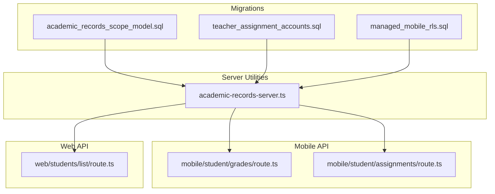

**Diagram sources**
- [20260324_010000_academic_records_scope_model.sql:1-529](file://migrations/20260324_010000_academic_records_scope_model.sql#L1-L529)
- [20260322_010000_teacher_assignment_accounts.sql:464-573](file://migrations/20260322_010000_teacher_assignment_accounts.sql#L464-L573)
- [20260322_managed_mobile_rls.sql:434-551](file://migrations/20260322_managed_mobile_rls.sql#L434-L551)
- [academic-records-server.ts:1-941](file://lib/academic-records-server.ts#L1-L941)
- [mobile.student.grades.route.ts:1-22](file://app/api/mobile/student/grades/route.ts#L1-L22)
- [mobile.student.assignments.route.ts:1-22](file://app/api/mobile/student/assignments/route.ts#L1-L22)
- [web.students.list.route.ts:1-55](file://app/api/web/students/list/route.ts#L1-L55)

**Section sources**
- [academic-year.ts:1-7](file://lib/academic-year.ts#L1-L7)
- [academic-records-server.ts:1-941](file://lib/academic-records-server.ts#L1-L941)
- [20260324_010000_academic_records_scope_model.sql:1-529](file://migrations/20260324_010000_academic_records_scope_model.sql#L1-L529)
- [20260322_010000_teacher_assignment_accounts.sql:464-573](file://migrations/20260322_010000_teacher_assignment_accounts.sql#L464-L573)
- [20260322_managed_mobile_rls.sql:434-551](file://migrations/20260322_managed_mobile_rls.sql#L434-L551)
- [mobile.student.grades.route.ts:1-22](file://app/api/mobile/student/grades/route.ts#L1-L22)
- [mobile.student.assignments.route.ts:1-22](file://app/api/mobile/student/assignments/route.ts#L1-L22)
- [web.students.list.route.ts:1-55](file://app/api/web/students/list/route.ts#L1-L55)

## Core Components
- Academic year label generator: Computes academic year boundaries based on month and locale.
- Academic records utilities: Normalize inputs, resolve subjects and class scope, enforce teacher scope, and gate features based on table/column availability and permissions.
- Schema model: Defines subjects, teacher assignments, assignments, and grades with scoping and indexing.
- API routes: Mobile endpoints for fetching assignments and grades; web endpoint for listing students.

**Section sources**
- [academic-year.ts:1-7](file://lib/academic-year.ts#L1-L7)
- [academic-records-server.ts:1-941](file://lib/academic-records-server.ts#L1-L941)
- [20260324_010000_academic_records_scope_model.sql:24-331](file://migrations/20260324_010000_academic_records_scope_model.sql#L24-L331)
- [mobile.student.grades.route.ts:1-22](file://app/api/mobile/student/grades/route.ts#L1-L22)
- [mobile.student.assignments.route.ts:1-22](file://app/api/mobile/student/assignments/route.ts#L1-L22)
- [web.students.list.route.ts:1-55](file://app/api/web/students/list/route.ts#L1-L55)

## Architecture Overview
The system separates concerns across schema, utilities, and routes:
- Schema defines entities and constraints.
- Utilities encapsulate validation, scoping, and feature gating.
- Routes expose read/write operations with role-based access and rate limiting.

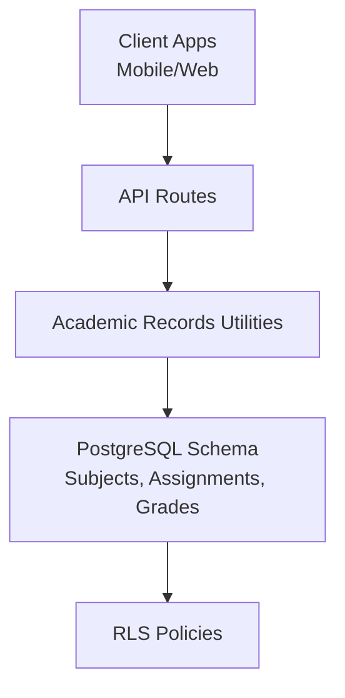

**Diagram sources**
- [academic-records-server.ts:1-941](file://lib/academic-records-server.ts#L1-L941)
- [20260324_010000_academic_records_scope_model.sql:426-528](file://migrations/20260324_010000_academic_records_scope_model.sql#L426-L528)
- [20260322_managed_mobile_rls.sql:434-551](file://migrations/20260322_managed_mobile_rls.sql#L434-L551)

## Detailed Component Analysis

### Academic Year Management
- Purpose: Compute academic year labels aligned to school calendars.
- Behavior: Uses month thresholds to determine start/end years and formats according to locale.
- Integration: Supports Arabic and English locales.

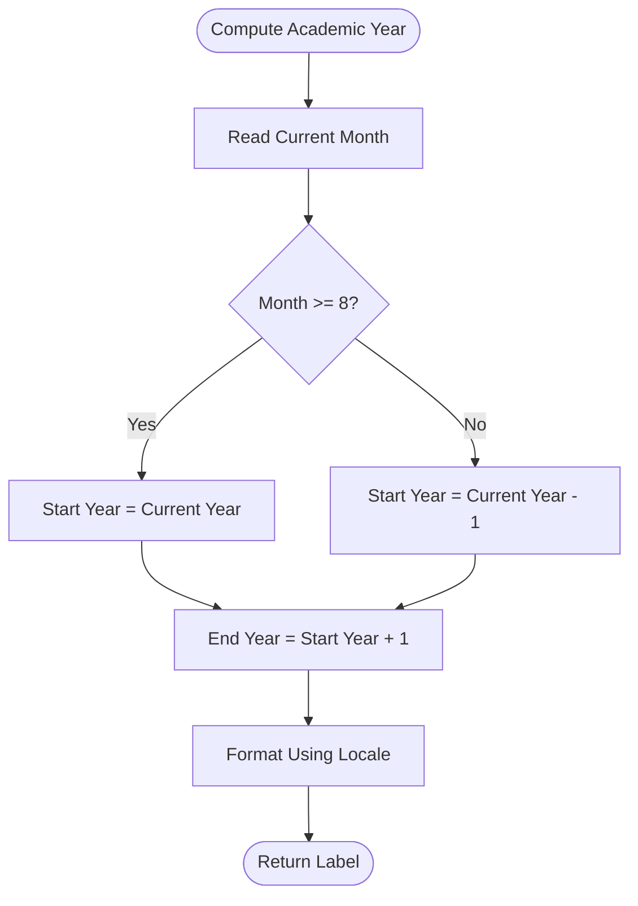

**Diagram sources**
- [academic-year.ts:1-7](file://lib/academic-year.ts#L1-L7)

**Section sources**
- [academic-year.ts:1-7](file://lib/academic-year.ts#L1-L7)

### Grade Tracking Mechanisms
- Inputs: Student ID, subject, exam type, score, max score, note.
- Validation: Ensures numeric scores, positive max score, valid student and subject resolution, and teacher scope alignment.
- Scoping: Resolves subject and class/section IDs; inserts grade with timestamps and optional assignment linkage.
- Feature gating: Checks table/column existence and permissions; returns structured results.

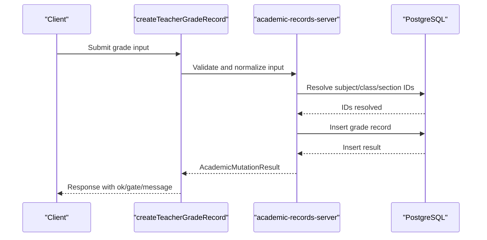

**Diagram sources**
- [academic-records-server.ts:686-824](file://lib/academic-records-server.ts#L686-L824)
- [20260324_010000_academic_records_scope_model.sql:224-241](file://migrations/20260324_010000_academic_records_scope_model.sql#L224-L241)

**Section sources**
- [academic-records-server.ts:686-824](file://lib/academic-records-server.ts#L686-L824)
- [20260324_010000_academic_records_scope_model.sql:224-241](file://migrations/20260324_010000_academic_records_scope_model.sql#L224-L241)

### Subject Enrollment Processes
- Resolution: Subjects are looked up by name; if missing, they are created per school and active by default.
- Class/Section scoping: Resolves class and section IDs based on configurable class naming and section presence.
- Metadata: Stores content kind, target mode, and attachment metadata when applicable.

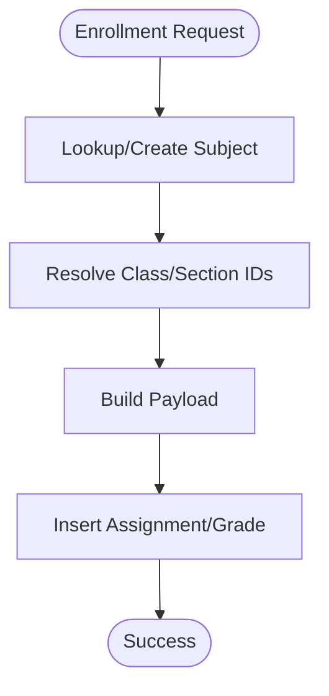

**Diagram sources**
- [academic-records-server.ts:272-348](file://lib/academic-records-server.ts#L272-L348)
- [academic-records-server.ts:350-443](file://lib/academic-records-server.ts#L350-L443)
- [20260324_010000_academic_records_scope_model.sql:24-31](file://migrations/20260324_010000_academic_records_scope_model.sql#L24-L31)

**Section sources**
- [academic-records-server.ts:272-348](file://lib/academic-records-server.ts#L272-L348)
- [academic-records-server.ts:350-443](file://lib/academic-records-server.ts#L350-L443)
- [20260324_010000_academic_records_scope_model.sql:24-31](file://migrations/20260324_010000_academic_records_scope_model.sql#L24-L31)

### Transcript Generation
- Scope: Transcripts can be generated per student using grade history and scoping fields.
- Data sources: Grades table with subject, class, section, and timestamps; assignments metadata for context.
- Access: Enforced via RLS policies ensuring only authorized users can access student records.

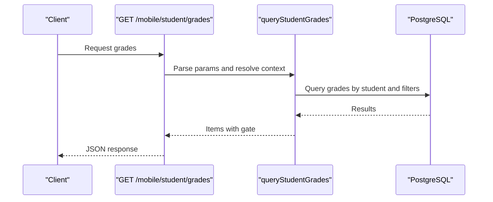

**Diagram sources**
- [mobile.student.grades.route.ts:1-22](file://app/api/mobile/student/grades/route.ts#L1-L22)
- [academic-records-server.ts:686-824](file://lib/academic-records-server.ts#L686-L824)

**Section sources**
- [mobile.student.grades.route.ts:1-22](file://app/api/mobile/student/grades/route.ts#L1-L22)
- [academic-records-server.ts:686-824](file://lib/academic-records-server.ts#L686-L824)

### Performance Analytics: GPA, Distributions, Progress Monitoring
- GPA calculation: Can be computed client-side or server-side using aggregated scores and max scores from the grades table.
- Grade distributions: Group by subject, class, or section using indexed lookups.
- Progress monitoring: Track rolling averages per student over time using graded_at timestamps.

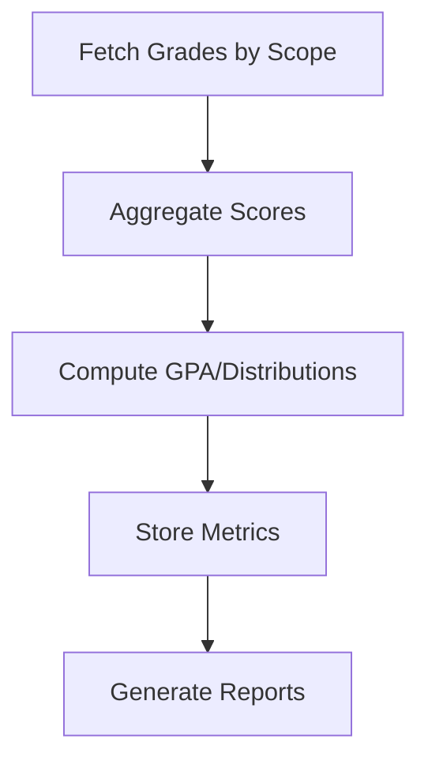

[No sources needed since this diagram shows conceptual workflow, not actual code structure]

**Section sources**
- [20260324_010000_academic_records_scope_model.sql:294-307](file://migrations/20260324_010000_academic_records_scope_model.sql#L294-L307)

### Integration with Class Management Systems
- Class and section resolution supports flexible naming and optional sections.
- Teacher assignment scope ensures educators can only manage designated subjects/classes/sections.

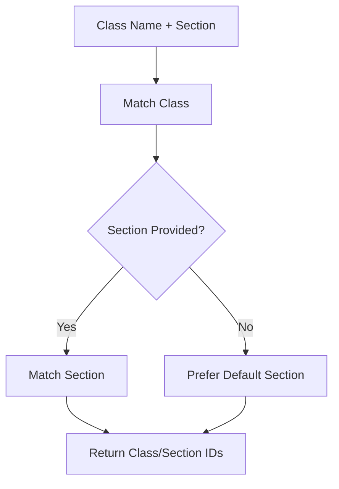

**Diagram sources**
- [academic-records-server.ts:350-443](file://lib/academic-records-server.ts#L350-L443)

**Section sources**
- [academic-records-server.ts:350-443](file://lib/academic-records-server.ts#L350-L443)

### Assignment Tracking and Exam Scheduling
- Assignments support content kinds (homework/exam material), due dates, and attachments.
- Indexes optimize queries by school, teacher, student, and due date.

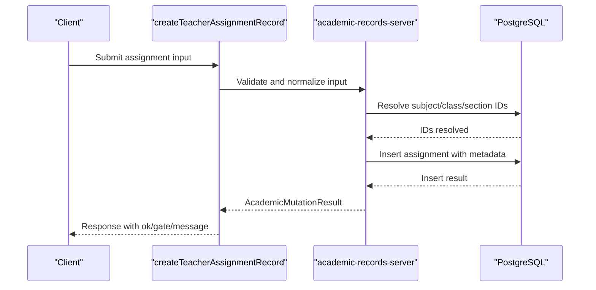

**Diagram sources**
- [academic-records-server.ts:509-684](file://lib/academic-records-server.ts#L509-L684)
- [20260324_010000_academic_records_scope_model.sql:111-135](file://migrations/20260324_010000_academic_records_scope_model.sql#L111-L135)

**Section sources**
- [academic-records-server.ts:509-684](file://lib/academic-records-server.ts#L509-L684)
- [20260324_010000_academic_records_scope_model.sql:111-135](file://migrations/20260324_010000_academic_records_scope_model.sql#L111-L135)

### Academic Policy Enforcement, Appeals, and Standing
- Policy enforcement: Row-level security policies restrict access to subjects, teacher assignments, assignments, and grades based on roles and school scope.
- Appeals: Can be modeled by adding an appeals table and linking to grades; RLS policies applied similarly.
- Standing: Computed by aggregating grades per student and applying thresholds (e.g., minimum GPA, credit hours).

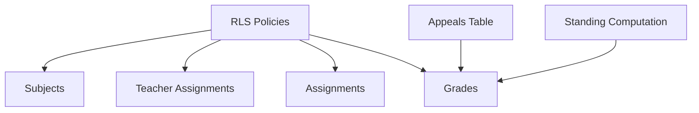

**Diagram sources**
- [20260324_010000_academic_records_scope_model.sql:426-528](file://migrations/20260324_010000_academic_records_scope_model.sql#L426-L528)
- [20260322_managed_mobile_rls.sql:434-551](file://migrations/20260322_managed_mobile_rls.sql#L434-L551)
- [20260322_010000_teacher_assignment_accounts.sql:464-573](file://migrations/20260322_010000_teacher_assignment_accounts.sql#L464-L573)

**Section sources**
- [20260324_010000_academic_records_scope_model.sql:426-528](file://migrations/20260324_010000_academic_records_scope_model.sql#L426-L528)
- [20260322_managed_mobile_rls.sql:434-551](file://migrations/20260322_managed_mobile_rls.sql#L434-L551)
- [20260322_010000_teacher_assignment_accounts.sql:464-573](file://migrations/20260322_010000_teacher_assignment_accounts.sql#L464-L573)

## Dependency Analysis
- Schema dependencies: Assignments and grades depend on subjects, classes, sections, and schools; teacher assignments define scope.
- Utility dependencies: Utilities depend on Supabase client and helper functions for column detection and normalization.
- Route dependencies: Routes depend on utilities for query building and on RLS for access control.

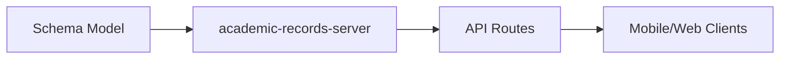

**Diagram sources**
- [20260324_010000_academic_records_scope_model.sql:1-529](file://migrations/20260324_010000_academic_records_scope_model.sql#L1-L529)
- [academic-records-server.ts:1-941](file://lib/academic-records-server.ts#L1-L941)
- [mobile.student.grades.route.ts:1-22](file://app/api/mobile/student/grades/route.ts#L1-L22)
- [mobile.student.assignments.route.ts:1-22](file://app/api/mobile/student/assignments/route.ts#L1-L22)
- [web.students.list.route.ts:1-55](file://app/api/web/students/list/route.ts#L1-L55)

**Section sources**
- [20260324_010000_academic_records_scope_model.sql:1-529](file://migrations/20260324_010000_academic_records_scope_model.sql#L1-L529)
- [academic-records-server.ts:1-941](file://lib/academic-records-server.ts#L1-L941)
- [mobile.student.grades.route.ts:1-22](file://app/api/mobile/student/grades/route.ts#L1-L22)
- [mobile.student.assignments.route.ts:1-22](file://app/api/mobile/student/assignments/route.ts#L1-L22)
- [web.students.list.route.ts:1-55](file://app/api/web/students/list/route.ts#L1-L55)

## Performance Considerations
- Indexes: Dedicated indexes on school_id, teacher_id, student_id, and scoping fields accelerate queries.
- Triggers: Automatic updated_at timestamps reduce manual maintenance overhead.
- Pagination: Mobile routes support paginated queries to limit payload sizes.
- RLS: Enforces access control close to data, minimizing unnecessary data transfer.

[No sources needed since this section provides general guidance]

## Troubleshooting Guide
- Missing tables/columns: Feature gates detect missing schema elements and return structured errors.
- Permission denied: RLS policies guard access; ensure roles and school scopes are set correctly.
- Input validation: Utilities normalize and validate inputs; errors are surfaced with actionable messages.

**Section sources**
- [academic-records-server.ts:84-108](file://lib/academic-records-server.ts#L84-L108)
- [20260322_managed_mobile_rls.sql:434-551](file://migrations/20260322_managed_mobile_rls.sql#L434-L551)
- [20260324_010000_academic_records_scope_model.sql:294-307](file://migrations/20260324_010000_academic_records_scope_model.sql#L294-L307)

## Conclusion
The academic records system provides a robust foundation for managing academic year boundaries, class enrollment, assignments, grades, and performance analytics. Its schema-driven design, strict scoping, and RLS policies ensure secure and scalable operations across mobile and web clients.

## Appendices

### Examples and Workflows

- Academic record updates (grade entry):
  - Input includes student_id, subject, exam_type, score, max_score, note.
  - Validation ensures numeric scores and teacher scope alignment.
  - On success, returns mutation result with affected count.

- Transcript printing:
  - Mobile route fetches student’s grades with pagination.
  - Results include items and feature gate status.

- Student list access:
  - Web route lists students with filters and rate limiting.

**Section sources**
- [academic-records-server.ts:686-824](file://lib/academic-records-server.ts#L686-L824)
- [mobile.student.grades.route.ts:1-22](file://app/api/mobile/student/grades/route.ts#L1-L22)
- [web.students.list.route.ts:1-55](file://app/api/web/students/list/route.ts#L1-L55)