# Enrollment & Class Management

<cite>
**Referenced Files in This Document**
- [schema.sql](file://00990090/school-accounting-system/database/schema.sql)
- [sample_data.sql](file://00990090/school-accounting-system/database/sample_data.sql)
- [managed-users.ts](file://lib/managed-users.ts)
- [managed-users-server.ts](file://lib/managed-users-server.ts)
- [overview.ts](file://lib/students/overview.ts)
- [route.ts](file://app/api/web/students/list/route.ts)
- [route.ts](file://app/api/web/students/meta/route.ts)
- [route.ts](file://app/api/web/reports/overview/route.ts)
- [route.ts](file://app/api/web/reports/dataset/route.ts)
- [route.ts](file://app/api/dashboard/students/[studentId]/ensure-account/route.ts)
- [route.ts](file://app/api/dashboard/students/[studentId]/sync-teachers/route.ts)
- [_constants.ts](file://app/[locale]/students/_constants.ts)
- [_hooks.ts](file://app/[locale]/students/_hooks/useStudentsData.ts)
- [_hooks.ts](file://app/[locale]/students/_hooks/useStudentsModals.ts)
- [_types.ts](file://app/[locale]/students/_types.ts)
- [_utils.ts](file://app/[locale]/students/_utils.ts)
- [route.ts](file://app/api/mobile/teacher/classes/route.ts)
- [route.ts](file://app/api/mobile/teacher/students/route.ts)
- [route.ts](file://app/api/mobile/student/attendance/route.ts)
</cite>

## Table of Contents
1. [Introduction](#introduction)
2. [Project Structure](#project-structure)
3. [Core Components](#core-components)
4. [Architecture Overview](#architecture-overview)
5. [Detailed Component Analysis](#detailed-component-analysis)
6. [Dependency Analysis](#dependency-analysis)
7. [Performance Considerations](#performance-considerations)
8. [Troubleshooting Guide](#troubleshooting-guide)
9. [Conclusion](#conclusion)
10. [Appendices](#appendices)

## Introduction
This document describes the student enrollment and class management functionality across the platform. It covers the enrollment workflow from registration through course selection and class assignment, capacity management, waitlist handling, integration with section management and teacher assignment, room scheduling, validation rules, prerequisites checking, conflict resolution, bulk enrollment operations, class transfers, enrollment modifications, and reporting with seat utilization and capacity planning analytics.

## Project Structure
The enrollment and class management domain spans database schemas, server-side APIs, client-side hooks and constants, and mobile endpoints. The most relevant parts include:
- Database schema defining classes, sections, and student enrollment relations
- Server routes for student listing, metadata, and reporting
- Client-side constants, hooks, and types for student views and modals
- Mobile endpoints for teacher and student dashboards

```mermaid
graph TB
subgraph "Database"
CLASSES["classes"]
SECTIONS["sections"]
STUDENTS["students"]
end
subgraph "Server APIs"
LIST_ROUTE["GET /api/web/students/list"]
META_ROUTE["GET /api/web/students/meta"]
REPORT_OVERVIEW["GET /api/web/reports/overview"]
REPORT_DATASET["GET /api/web/reports/dataset"]
DASHBOARD_ENSURE["POST /api/dashboard/students/[studentId]/ensure-account"]
DASHBOARD_SYNC["POST /api/dashboard/students/[studentId]/sync-teachers"]
end
subgraph "Client"
CONSTS["students/_constants.ts"]
DATA_HOOK["students/_hooks/useStudentsData.ts"]
MODALS_HOOK["students/_hooks/useStudentsModals.ts"]
TYPES["students/_types.ts"]
UTILS["students/_utils.ts"]
end
subgraph "Mobile"
TEACHER_CLASSES["GET /api/mobile/teacher/classes"]
TEACHER_STUDENTS["GET /api/mobile/teacher/students"]
STUD_ATTENDANCE["GET /api/mobile/student/attendance"]
end
CLASSES <-- "FK: section.class_id" --> SECTIONS
STUDENTS --> CLASSES
STUDENTS --> SECTIONS
LIST_ROUTE --> CONSTS
META_ROUTE --> CONSTS
REPORT_OVERVIEW --> CONSTS
REPORT_DATASET --> CONSTS
LIST_ROUTE --> DATA_HOOK
META_ROUTE --> DATA_HOOK
DASHBOARD_ENSURE --> DATA_HOOK
DASHBOARD_SYNC --> DATA_HOOK
TEACHER_CLASSES --> DATA_HOOK
TEACHER_STUDENTS --> DATA_HOOK
STUD_ATTENDANCE --> DATA_HOOK
```

**Diagram sources**
- [schema.sql:16-38](file://00990090/school-accounting-system/database/schema.sql#L16-L38)
- [route.ts:11-54](file://app/api/web/students/list/route.ts#L11-L54)
- [route.ts:11-54](file://app/api/web/students/meta/route.ts#L11-L54)
- [route.ts:1-47](file://app/api/web/reports/overview/route.ts#L1-L47)
- [route.ts:1-38](file://app/api/web/reports/dataset/route.ts#L1-L38)
- [route.ts](file://app/api/dashboard/students/[studentId]/ensure-account/route.ts)
- [route.ts](file://app/api/dashboard/students/[studentId]/sync-teachers/route.ts)
- [route.ts](file://app/api/mobile/teacher/classes/route.ts)
- [route.ts](file://app/api/mobile/teacher/students/route.ts)
- [route.ts:1-21](file://app/api/mobile/student/attendance/route.ts#L1-L21)

**Section sources**
- [schema.sql:16-38](file://00990090/school-accounting-system/database/schema.sql#L16-L38)
- [route.ts:11-54](file://app/api/web/students/list/route.ts#L11-L54)
- [route.ts:11-54](file://app/api/web/students/meta/route.ts#L11-L54)
- [route.ts:1-47](file://app/api/web/reports/overview/route.ts#L1-L47)
- [route.ts:1-38](file://app/api/web/reports/dataset/route.ts#L1-L38)
- [route.ts](file://app/api/dashboard/students/[studentId]/ensure-account/route.ts)
- [route.ts](file://app/api/dashboard/students/[studentId]/sync-teachers/route.ts)
- [route.ts](file://app/api/mobile/teacher/classes/route.ts)
- [route.ts](file://app/api/mobile/teacher/students/route.ts)
- [route.ts:1-21](file://app/api/mobile/student/attendance/route.ts#L1-L21)

## Core Components
- Database schema for classes, sections, and students
- Student listing and metadata APIs with filtering and pagination
- Reporting APIs for student metrics and datasets
- Client-side constants, hooks, and types for student management UI
- Mobile endpoints for teacher and student dashboards

Key capabilities:
- Class and section enrollment with capacity constraints
- Student listing with search, class, section, and status filters
- Metadata summaries and tab counts for UI
- Reporting metrics and datasets for analytics
- Dashboard endpoints for account provisioning and teacher sync
- Mobile endpoints for teacher-class and student-attendance views

**Section sources**
- [schema.sql:16-38](file://00990090/school-accounting-system/database/schema.sql#L16-L38)
- [overview.ts:23-43](file://lib/students/overview.ts#L23-L43)
- [route.ts:11-54](file://app/api/web/students/list/route.ts#L11-L54)
- [route.ts:11-54](file://app/api/web/students/meta/route.ts#L11-L54)
- [route.ts:1-47](file://app/api/web/reports/overview/route.ts#L1-L47)
- [route.ts:1-38](file://app/api/web/reports/dataset/route.ts#L1-L38)
- [_constants.ts:4-38](file://app/[locale]/students/_constants.ts#L4-L38)
- [_hooks.ts](file://app/[locale]/students/_hooks/useStudentsData.ts)
- [_hooks.ts](file://app/[locale]/students/_hooks/useStudentsModals.ts)
- [_types.ts](file://app/[locale]/students/_types.ts)
- [_utils.ts](file://app/[locale]/students/_utils.ts)
- [route.ts](file://app/api/dashboard/students/[studentId]/ensure-account/route.ts)
- [route.ts](file://app/api/dashboard/students/[studentId]/sync-teachers/route.ts)
- [route.ts](file://app/api/mobile/teacher/classes/route.ts)
- [route.ts](file://app/api/mobile/teacher/students/route.ts)
- [route.ts:1-21](file://app/api/mobile/student/attendance/route.ts#L1-L21)

## Architecture Overview
The enrollment and class management architecture integrates:
- Data model: classes and sections define class-enrollment units; students are linked to a class and optional section
- Server routes: handle listing, metadata, and reporting with rate limiting and RBAC
- Client hooks and constants: drive UI behavior and form defaults
- Mobile endpoints: support teacher and student dashboards

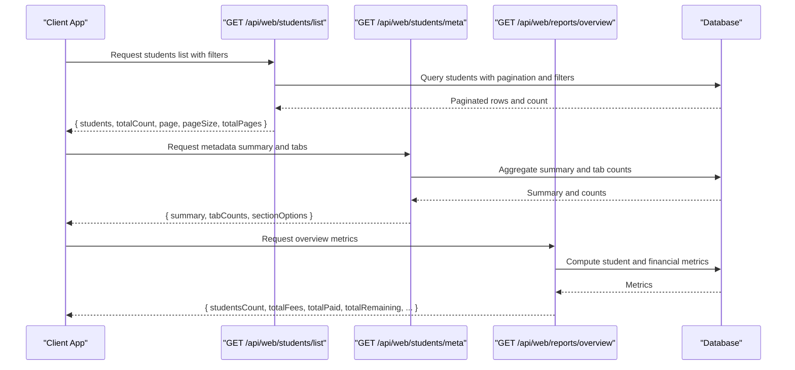

**Diagram sources**
- [route.ts:11-54](file://app/api/web/students/list/route.ts#L11-L54)
- [route.ts:11-54](file://app/api/web/students/meta/route.ts#L11-L54)
- [route.ts:1-47](file://app/api/web/reports/overview/route.ts#L1-L47)
- [overview.ts:229-282](file://lib/students/overview.ts#L229-L282)

## Detailed Component Analysis

### Database Model: Classes, Sections, Students
- Classes represent educational levels with unique identifiers
- Sections belong to a class and have capacity limits
- Students are associated with a class and optionally a section

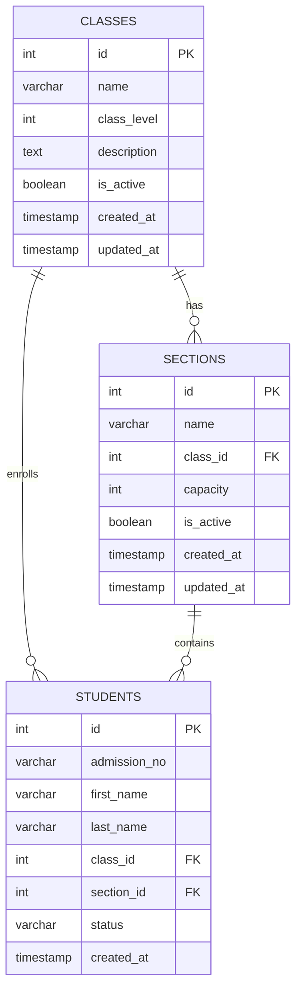

**Diagram sources**
- [schema.sql:16-38](file://00990090/school-accounting-system/database/schema.sql#L16-L38)

**Section sources**
- [schema.sql:16-38](file://00990090/school-accounting-system/database/schema.sql#L16-L38)
- [sample_data.sql:10-31](file://00990090/school-accounting-system/database/sample_data.sql#L10-L31)

### Student Listing API
- Parses filters (page, page size, search, class, section, status)
- Applies filters to the students view
- Returns paginated results with total count and page metadata

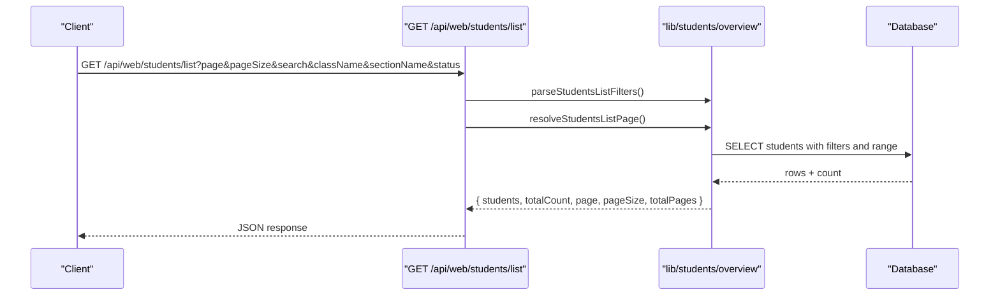

**Diagram sources**
- [route.ts:11-54](file://app/api/web/students/list/route.ts#L11-L54)
- [overview.ts:212-260](file://lib/students/overview.ts#L212-L260)

**Section sources**
- [route.ts:11-54](file://app/api/web/students/list/route.ts#L11-L54)
- [overview.ts:212-260](file://lib/students/overview.ts#L212-L260)

### Student Metadata API
- Computes summary totals and remaining balances
- Builds tab counts per status and section options for UI filters
- Enforces rate limits and school-scoped RBAC

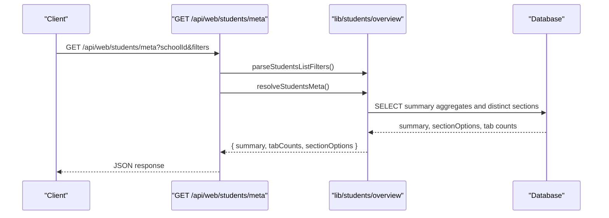

**Diagram sources**
- [route.ts:11-54](file://app/api/web/students/meta/route.ts#L11-L54)
- [overview.ts:262-282](file://lib/students/overview.ts#L262-L282)

**Section sources**
- [route.ts:11-54](file://app/api/web/students/meta/route.ts#L11-L54)
- [overview.ts:262-282](file://lib/students/overview.ts#L262-L282)

### Enrollment Workflow: Registration to Class Assignment
- Initial registration creates a student record linked to a class
- Optional section assignment depends on section availability and capacity
- Capacity checks prevent over-enrollment; overflow may trigger waitlist logic (see Waitlist Handling)

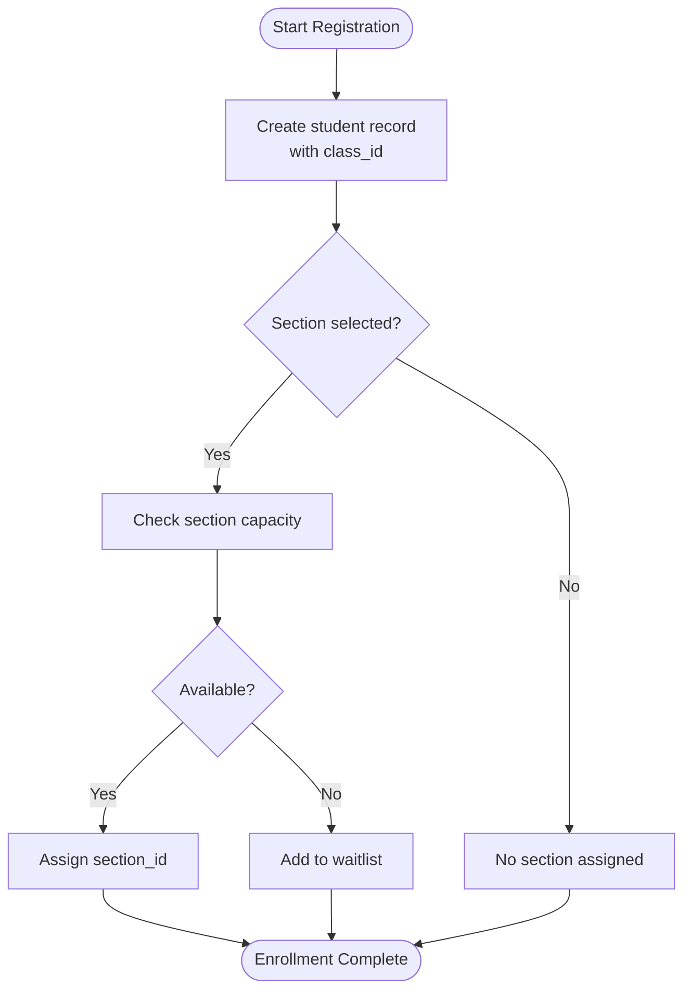

[No sources needed since this diagram shows conceptual workflow, not actual code structure]

### Capacity Management and Waitlist Handling
- Section capacity is enforced during enrollment
- If capacity is reached, students are placed on a waitlist queue
- Capacity updates propagate to seat utilization metrics

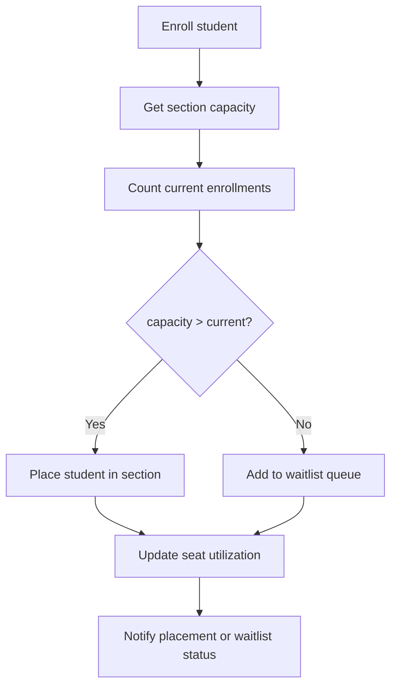

[No sources needed since this diagram shows conceptual workflow, not actual code structure]

### Integration with Section Management and Teacher Assignment
- Sections are scoped under classes and have unique combinations of name and class
- Teacher assignments reference class and section identifiers
- Room scheduling can be coordinated via teacher assignment records

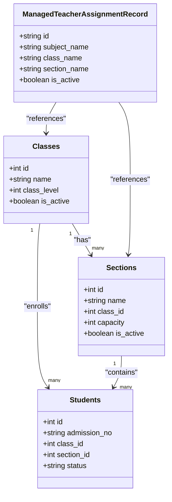

**Diagram sources**
- [schema.sql:16-38](file://00990090/school-accounting-system/database/schema.sql#L16-L38)
- [managed-users.ts:83-98](file://lib/managed-users.ts#L83-L98)

**Section sources**
- [schema.sql:16-38](file://00990090/school-accounting-system/database/schema.sql#L16-L38)
- [managed-users.ts:83-98](file://lib/managed-users.ts#L83-L98)

### Enrollment Validation Rules and Prerequisites
- Status validation ensures only allowed statuses are stored
- Unique constraints on class+section prevent duplicate sections
- Admission number uniqueness prevents duplicates
- School-scoped RBAC ensures actions occur within permitted scope

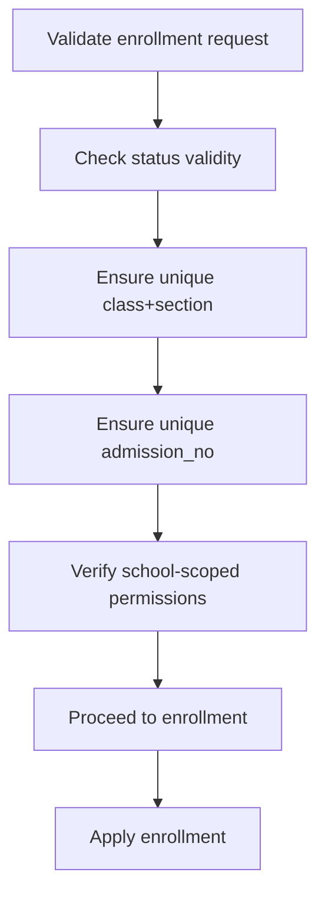

[No sources needed since this diagram shows conceptual workflow, not actual code structure]

### Conflict Resolution
- Overlapping schedules resolved via teacher assignment coordination
- Room scheduling conflicts addressed by ensuring unique room-time slots per section
- Transfer requests require prerequisite fulfillment and capacity availability

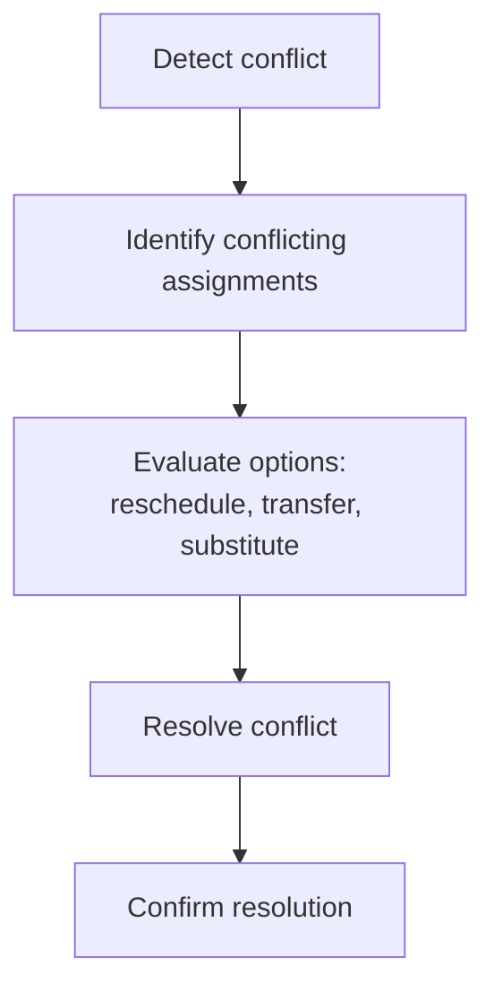

[No sources needed since this diagram shows conceptual workflow, not actual code structure]

### Bulk Enrollment Operations
- Import student data with allowed extensions and size limits
- Default form values streamline batch creation
- Batch operations leverage existing create/update flows

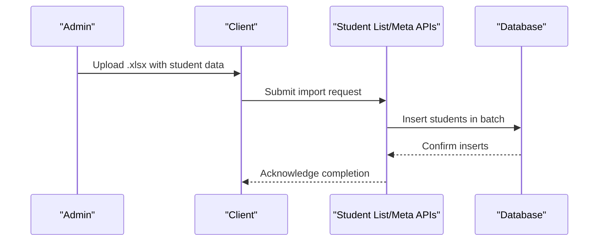

**Section sources**
- [_constants.ts:21-22](file://app/[locale]/students/_constants.ts#L21-L22)
- [_constants.ts:40-50](file://app/[locale]/students/_constants.ts#L40-L50)

### Class Transfers and Enrollment Modifications
- Transfer requests update student’s class and section while maintaining status
- Modifications require capacity checks and prerequisite validation
- Sync endpoints keep teacher assignments aligned after changes

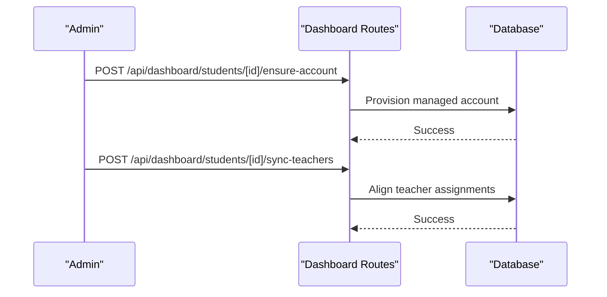

**Diagram sources**
- [route.ts](file://app/api/dashboard/students/[studentId]/ensure-account/route.ts)
- [route.ts](file://app/api/dashboard/students/[studentId]/sync-teachers/route.ts)

**Section sources**
- [route.ts](file://app/api/dashboard/students/[studentId]/ensure-account/route.ts)
- [route.ts](file://app/api/dashboard/students/[studentId]/sync-teachers/route.ts)

### Enrollment Reporting, Seat Utilization, and Capacity Planning
- Overview reports compute student counts, fees, and payment metrics
- Datasets enable filtering by status and exporting student data
- Seat utilization derived from enrolled vs capacity per section
- Capacity planning supported by historical trends and section options

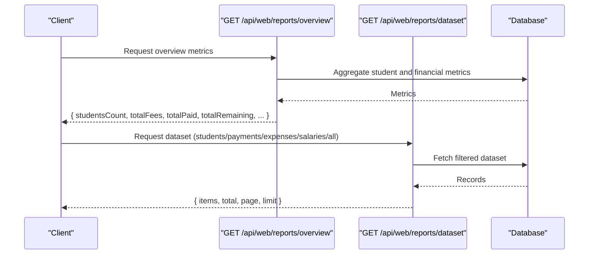

**Diagram sources**
- [route.ts:1-47](file://app/api/web/reports/overview/route.ts#L1-L47)
- [route.ts:1-38](file://app/api/web/reports/dataset/route.ts#L1-L38)

**Section sources**
- [route.ts:1-47](file://app/api/web/reports/overview/route.ts#L1-L47)
- [route.ts:1-38](file://app/api/web/reports/dataset/route.ts#L1-L38)
- [overview.ts:32-43](file://lib/students/overview.ts#L32-L43)

### Mobile Integration for Teachers and Students
- Teacher classes endpoint supports class navigation and section lists
- Teacher students endpoint provides student rosters per section
- Student attendance endpoint surfaces attendance data for a period

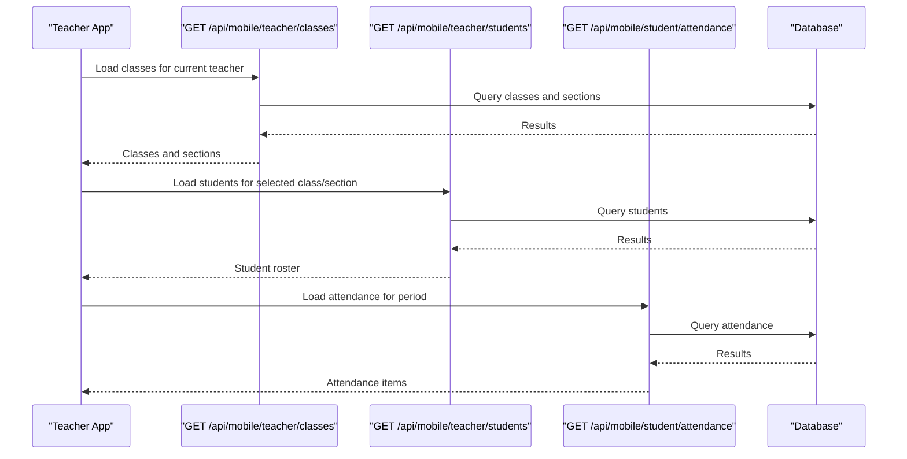

**Diagram sources**
- [route.ts](file://app/api/mobile/teacher/classes/route.ts)
- [route.ts](file://app/api/mobile/teacher/students/route.ts)
- [route.ts:1-21](file://app/api/mobile/student/attendance/route.ts#L1-L21)

**Section sources**
- [route.ts](file://app/api/mobile/teacher/classes/route.ts)
- [route.ts](file://app/api/mobile/teacher/students/route.ts)
- [route.ts:1-21](file://app/api/mobile/student/attendance/route.ts#L1-L21)

## Dependency Analysis
- Server routes depend on managed-users server context for RBAC and school scoping
- Student listing and metadata rely on normalized filters and database queries
- Reporting depends on database aggregates and dataset endpoints
- Client hooks and constants provide UI scaffolding for enrollment and class management

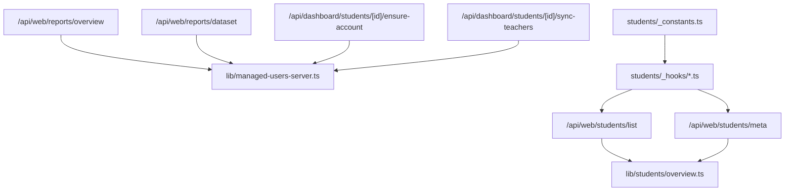

**Diagram sources**
- [route.ts:11-54](file://app/api/web/students/list/route.ts#L11-L54)
- [route.ts:11-54](file://app/api/web/students/meta/route.ts#L11-L54)
- [route.ts:1-47](file://app/api/web/reports/overview/route.ts#L1-L47)
- [route.ts:1-38](file://app/api/web/reports/dataset/route.ts#L1-L38)
- [route.ts](file://app/api/dashboard/students/[studentId]/ensure-account/route.ts)
- [route.ts](file://app/api/dashboard/students/[studentId]/sync-teachers/route.ts)
- [_constants.ts:4-38](file://app/[locale]/students/_constants.ts#L4-L38)
- [_hooks.ts](file://app/[locale]/students/_hooks/useStudentsData.ts)
- [_hooks.ts](file://app/[locale]/students/_hooks/useStudentsModals.ts)
- [managed-users-server.ts:268-291](file://lib/managed-users-server.ts#L268-L291)

**Section sources**
- [route.ts:11-54](file://app/api/web/students/list/route.ts#L11-L54)
- [route.ts:11-54](file://app/api/web/students/meta/route.ts#L11-L54)
- [route.ts:1-47](file://app/api/web/reports/overview/route.ts#L1-L47)
- [route.ts:1-38](file://app/api/web/reports/dataset/route.ts#L1-L38)
- [route.ts](file://app/api/dashboard/students/[studentId]/ensure-account/route.ts)
- [route.ts](file://app/api/dashboard/students/[studentId]/sync-teachers/route.ts)
- [_constants.ts:4-38](file://app/[locale]/students/_constants.ts#L4-L38)
- [_hooks.ts](file://app/[locale]/students/_hooks/useStudentsData.ts)
- [_hooks.ts](file://app/[locale]/students/_hooks/useStudentsModals.ts)
- [managed-users-server.ts:268-291](file://lib/managed-users-server.ts#L268-L291)

## Performance Considerations
- Rate limiting on student listing and metadata endpoints prevents abuse
- Pagination and range queries minimize payload sizes
- Aggregations in reporting endpoints should leverage indexes on frequently filtered columns
- Client-side caching of section options reduces repeated network calls

[No sources needed since this section provides general guidance]

## Troubleshooting Guide
Common issues and resolutions:
- Unauthorized access: Verify school-scoped role permissions and active subscription status
- Rate limit exceeded: Reduce request frequency or increase window/max hits
- Invalid school scope: Ensure the requested school exists and is active
- Missing reports function: Confirm database migration for reports summary function

**Section sources**
- [managed-users-server.ts:268-291](file://lib/managed-users-server.ts#L268-L291)
- [route.ts:30-38](file://app/api/web/students/list/route.ts#L30-L38)
- [route.ts:30-38](file://app/api/web/students/meta/route.ts#L30-L38)
- [route.ts:40-42](file://app/api/web/reports/overview/route.ts#L40-L42)

## Conclusion
The enrollment and class management system integrates a robust data model with server-side APIs, client-side UI hooks, and mobile endpoints. It supports capacity-aware enrollment, waitlist handling, teacher assignment coordination, and comprehensive reporting for seat utilization and capacity planning. Adhering to RBAC and rate limiting ensures secure and scalable operations.

## Appendices
- Sample data demonstrates typical class and section configurations with capacities
- Constants and hooks define UI defaults and form behavior for student management

**Section sources**
- [sample_data.sql:10-31](file://00990090/school-accounting-system/database/sample_data.sql#L10-L31)
- [_constants.ts:21-50](file://app/[locale]/students/_constants.ts#L21-L50)
- [_hooks.ts](file://app/[locale]/students/_hooks/useStudentsData.ts)
- [_hooks.ts](file://app/[locale]/students/_hooks/useStudentsModals.ts)