# Student Management System

<cite>
**Referenced Files in This Document**
- [app/[locale]/students/page.tsx](file://app/%5Blocale%5D/students/page.tsx)
- [app/[locale]/students/_components/StudentsTable.tsx](file://app/%5Blocale%5D/students/_components/StudentsTable.tsx)
- [app/[locale]/students/_components/StudentsToolbar.tsx](file://app/%5Blocale%5D/students/_components/StudentsToolbar.tsx)
- [app/[locale]/students/_components/StudentsTabs.tsx](file://app/%5Blocale%5D/students/_components/StudentsTabs.tsx)
- [app/[locale]/students/_components/AddStudentModal.tsx](file://app/%5Blocale%5D/students/_components/AddStudentModal.tsx)
- [app/[locale]/students/_components/EditStudentModal.tsx](file://app/%5Blocale%5D/students/_components/EditStudentModal.tsx)
- [app/[locale]/students/_components/ImportExcelModal.tsx](file://app/%5Blocale%5D/students/_components/ImportExcelModal.tsx)
- [app/[locale]/students/_components/AccountCardModal.tsx](file://app/%5Blocale%5D/students/_components/AccountCardModal.tsx)
- [app/[locale]/students/_hooks/useStudentsData.ts](file://app/%5Blocale%5D/students/_hooks/useStudentsData.ts)
- [app/[locale]/students/_hooks/useStudentsOperations.ts](file://app/%5Blocale%5D/students/_hooks/useStudentsOperations.ts)
- [app/[locale]/students/_hooks/useStudentsModals.ts](file://app/%5Blocale%5D/students/_hooks/useStudentsModals.ts)
- [app/[locale]/students/_hooks/useStudentsPrint.ts](file://app/%5Blocale%5D/students/_hooks/useStudentsPrint.ts)
- [app/[locale]/students/_constants.ts](file://app/%5Blocale%5D/students/_constants.ts)
- [app/[locale]/students/_types.ts](file://app/%5Blocale%5D/students/_types.ts)
- [app/[locale]/students/_utils/getStudentActions.ts](file://app/%5Blocale%5D/students/_utils/getStudentActions.ts)
- [app/[locale]/students/_utils.ts](file://app/%5Blocale%5D/students/_utils.ts)
- [lib/students/overview.ts](file://lib/students/overview.ts)
- [app/api/web/students/list/route.ts](file://app/api/web/students/list/route.ts)
- [app/api/web/students/meta/route.ts](file://app/api/web/students/meta/route.ts)
- [lib/academic-records-server.ts](file://lib/academic-records-server.ts)
- [migrations/20260322_000000_mobile_core_tables.sql](file://migrations/20260322_000000_mobile_core_tables.sql)
- [migrations/20260324_010000_academic_records_scope_model.sql](file://migrations/20260324_010000_academic_records_scope_model.sql)
- [lib/managed-users.ts](file://lib/managed-users.ts)
- [lib/managed-user-app-context.ts](file://lib/managed-user-app-context.ts)
- [app/api/web/payments/students/route.ts](file://app/api/web/payments/students/route.ts)
- [lib/payments/overview.ts](file://lib/payments/overview.ts)
</cite>

## Update Summary
**Changes Made**
- Complete rewrite of the Students page component from 1841 lines to 351 lines
- Introduced modular component architecture with dedicated components for table, toolbar, tabs, and modals
- Added comprehensive hook-based state management system
- Implemented step-by-step student enrollment workflow with multi-step modal
- Enhanced data import/export capabilities with Excel template support
- Improved user interface with responsive design and Arabic/English localization
- Added account card management for student credentials
- Integrated new utility functions for enhanced data processing and printing
- Added comprehensive error handling and user feedback mechanisms

## Table of Contents
1. [Introduction](#introduction)
2. [Project Structure](#project-structure)
3. [Core Components](#core-components)
4. [Architecture Overview](#architecture-overview)
5. [Detailed Component Analysis](#detailed-component-analysis)
6. [Enhanced Hook System](#enhanced-hook-system)
7. [Utility Functions and Helpers](#utility-functions-and-helpers)
8. [Dependency Analysis](#dependency-analysis)
9. [Performance Considerations](#performance-considerations)
10. [Troubleshooting Guide](#troubleshooting-guide)
11. [Conclusion](#conclusion)
12. [Appendices](#appendices)

## Introduction
This document describes the enhanced student management system with a focus on academic record management and student lifecycle operations. The system has undergone a major architectural transformation, reducing the main Students page component from 1841 lines to 351 lines through modular component design. The new architecture emphasizes separation of concerns, reusability, and maintainability while preserving all existing functionality.

The system now features comprehensive student enrollment workflows, advanced academic record tracking, centralized student overview capabilities, and robust integration with class management, attendance tracking, and payment systems. The modular approach enables easier maintenance, testing, and future enhancements.

## Project Structure
The system is now organized around a modular component architecture with dedicated components for different aspects of student management:

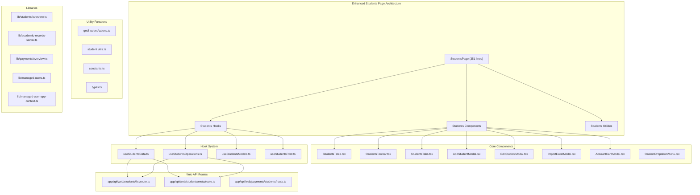

**Diagram sources**
- [app/[locale]/students/page.tsx:32-351](file://app/%5Blocale%5D/students/page.tsx#L32-L351)
- [app/[locale]/students/_components/StudentsTable.tsx:1-173](file://app/%5Blocale%5D/students/_components/StudentsTable.tsx#L1-L173)
- [app/[locale]/students/_components/StudentsToolbar.tsx:1-119](file://app/%5Blocale%5D/students/_components/StudentsToolbar.tsx#L1-L119)
- [app/[locale]/students/_hooks/useStudentsData.ts:1-271](file://app/%5Blocale%5D/students/_hooks/useStudentsData.ts#L1-L271)
- [app/[locale]/students/_hooks/useStudentsOperations.ts:1-422](file://app/%5Blocale%5D/students/_hooks/useStudentsOperations.ts#L1-L422)

**Section sources**
- [app/[locale]/students/page.tsx:32-351](file://app/%5Blocale%5D/students/page.tsx#L32-L351)
- [app/[locale]/students/_components/StudentsTable.tsx:1-173](file://app/%5Blocale%5D/students/_components/StudentsTable.tsx#L1-L173)
- [app/[locale]/students/_hooks/useStudentsData.ts:1-271](file://app/%5Blocale%5D/students/_hooks/useStudentsData.ts#L1-L271)

## Core Components
The enhanced system introduces several key components that work together to provide comprehensive student management:

### Modular Component Architecture
- **StudentsTable**: Handles student data display with pagination, sorting, and action buttons
- **StudentsToolbar**: Manages search, filtering, and bulk operations (export, print, add student)
- **StudentsTabs**: Provides tabbed navigation for different student status categories
- **AddStudentModal**: Implements step-by-step student enrollment with three-phase wizard
- **EditStudentModal**: Handles student profile updates with real-time fee calculations
- **ImportExcelModal**: Supports batch student import with template validation
- **AccountCardModal**: Manages student account credentials and printing
- **StudentDropdownMenu**: Provides contextual actions for individual students

### Enhanced Hook-Based State Management
- **useStudentsData**: Centralized data fetching, caching, and state management
- **useStudentsOperations**: Business logic for CRUD operations and bulk actions
- **useStudentsModals**: Modal state management and user interactions
- **useStudentsPrint**: Printing functionality for student cards and reports

### Utility Functions and Helpers
- **getStudentActions**: Dynamic action generation based on user permissions and student status
- **Student Processing Utilities**: Data transformation, validation, and formatting functions
- **Print Templates**: Comprehensive printing solutions for student profiles and account cards
- **Constants and Type Definitions**: Shared configuration and TypeScript interfaces

### Enhanced Workflow Management
- Multi-step student enrollment process with automatic fee calculation
- Real-time validation and feedback for all user actions
- Comprehensive error handling and user guidance
- Responsive design supporting both Arabic and English locales

**Section sources**
- [app/[locale]/students/_components/StudentsTable.tsx:23-37](file://app/%5Blocale%5D/students/_components/StudentsTable.tsx#L23-L37)
- [app/[locale]/students/_components/AddStudentModal.tsx:21-34](file://app/%5Blocale%5D/students/_components/AddStudentModal.tsx#L21-L34)
- [app/[locale]/students/_hooks/useStudentsData.ts:44-42](file://app/%5Blocale%5D/students/_hooks/useStudentsData.ts#L44-L42)
- [app/[locale]/students/_hooks/useStudentsOperations.ts:55-53](file://app/%5Blocale%5D/students/_hooks/useStudentsOperations.ts#L55-L53)

## Architecture Overview
The system follows a modern React architecture with clear separation of concerns:

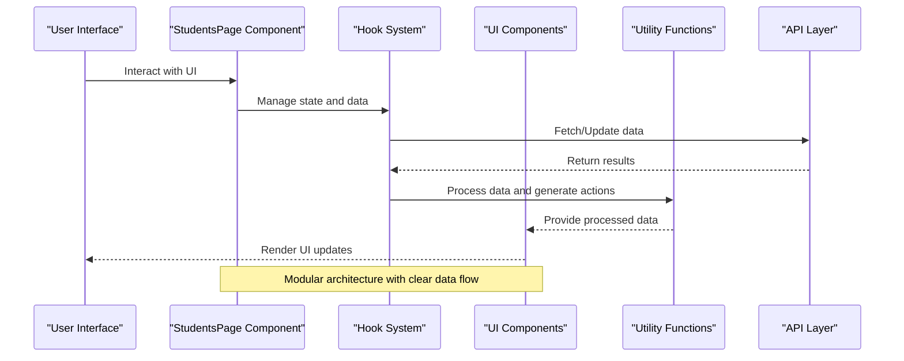

**Diagram sources**
- [app/[locale]/students/page.tsx:67-126](file://app/%5Blocale%5D/students/page.tsx#L67-L126)
- [app/[locale]/students/_hooks/useStudentsData.ts:114-120](file://app/%5Blocale%5D/students/_hooks/useStudentsData.ts#L114-L120)
- [app/[locale]/students/_hooks/useStudentsOperations.ts:74-123](file://app/%5Blocale%5D/students/_hooks/useStudentsOperations.ts#L74-L123)

The architecture emphasizes:
- **Separation of Concerns**: Each component has a single responsibility
- **Reusability**: Components can be used independently or together
- **Testability**: Clear interfaces make components easy to test
- **Maintainability**: Modular design simplifies updates and bug fixes

## Detailed Component Analysis

### Enhanced Students Page Component
The main StudentsPage component (reduced from 1841 to 351 lines) now serves as a coordinator that orchestrates all sub-components:

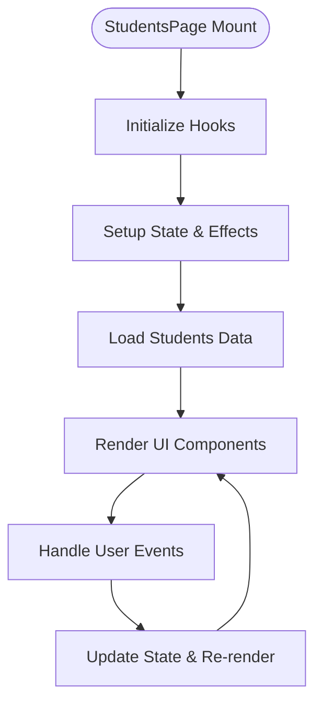

**Diagram sources**
- [app/[locale]/students/page.tsx:32-351](file://app/%5Blocale%5D/students/page.tsx#L32-L351)
- [app/[locale]/students/page.tsx:67-126](file://app/%5Blocale%5D/students/page.tsx#L67-L126)

Key improvements include:
- **Centralized State Management**: All state is managed through React hooks
- **Modular Rendering**: Components render independently based on props
- **Event Delegation**: Parent component handles complex events and passes simple callbacks
- **Responsive Design**: Adapts to different screen sizes and orientations

**Section sources**
- [app/[locale]/students/page.tsx:32-351](file://app/%5Blocale%5D/students/page.tsx#L32-L351)
- [app/[locale]/students/page.tsx:67-126](file://app/%5Blocale%5D/students/page.tsx#L67-L126)

### StudentsTable Component
The StudentsTable component provides comprehensive student data display with advanced features:

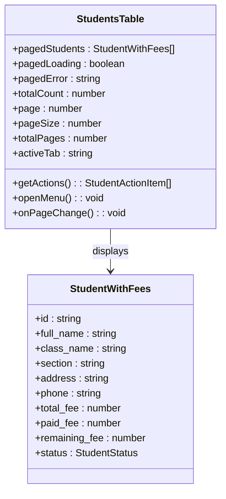

**Diagram sources**
- [app/[locale]/students/_components/StudentsTable.tsx:23-37](file://app/%5Blocale%5D/students/_components/StudentsTable.tsx#L23-L37)
- [app/[locale]/students/_types.ts:1-L69](file://app/%5Blocale%5D/students/_types.ts#L1-L69)

Features include:
- **Dynamic Status Display**: Color-coded status badges with localized labels
- **Real-time Calculations**: Automatic fee calculations and balance tracking
- **Pagination Support**: Efficient loading of large datasets
- **Action Integration**: Seamless integration with dropdown menus and modals

**Section sources**
- [app/[locale]/students/_components/StudentsTable.tsx:23-173](file://app/%5Blocale%5D/students/_components/StudentsTable.tsx#L23-L173)
- [app/[locale]/students/_components/StudentsTable.tsx:88-146](file://app/%5Blocale%5D/students/_components/StudentsTable.tsx#L88-L146)

### AddStudentModal Component
The AddStudentModal implements a sophisticated three-step enrollment process:

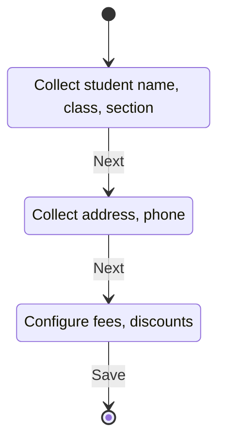

**Diagram sources**
- [app/[locale]/students/_components/AddStudentModal.tsx:56-99](file://app/%5Blocale%5D/students/_components/AddStudentModal.tsx#L56-L99)
- [app/[locale]/students/_components/AddStudentModal.tsx:115-191](file://app/%5Blocale%5D/students/_components/AddStudentModal.tsx#L115-L191)

Key features:
- **Step-by-Step Wizard**: Guided enrollment process with progress indicators
- **Real-time Fee Calculation**: Automatic fee updates based on class selection
- **Manual Entry Option**: Support for custom class names and fees
- **Validation Feedback**: Immediate validation and error messaging

**Section sources**
- [app/[locale]/students/_components/AddStudentModal.tsx:21-312](file://app/%5Blocale%5D/students/_components/AddStudentModal.tsx#L21-L312)
- [app/[locale]/students/_components/AddStudentModal.tsx:115-284](file://app/%5Blocale%5D/students/_components/AddStudentModal.tsx#L115-L284)

### ImportExcelModal Component
The ImportExcelModal provides comprehensive batch student import functionality:

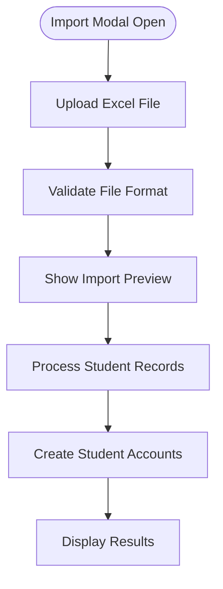

**Diagram sources**
- [app/[locale]/students/_components/ImportExcelModal.tsx:19-31](file://app/%5Blocale%5D/students/_components/ImportExcelModal.tsx#L19-L31)
- [app/[locale]/students/_components/ImportExcelModal.tsx:76-96](file://app/%5Blocale%5D/students/_components/ImportExcelModal.tsx#L76-L96)

Features include:
- **Template Download**: Pre-built Excel templates for easy data entry
- **File Validation**: Comprehensive file format and content validation
- **Preview Functionality**: Shows first 5 rows of imported data
- **Batch Processing**: Processes multiple student records efficiently

**Section sources**
- [app/[locale]/students/_components/ImportExcelModal.tsx:19-137](file://app/%5Blocale%5D/students/_components/ImportExcelModal.tsx#L19-L137)

## Enhanced Hook System

### useStudentsData Hook
The useStudentsData hook centralizes all data management logic:

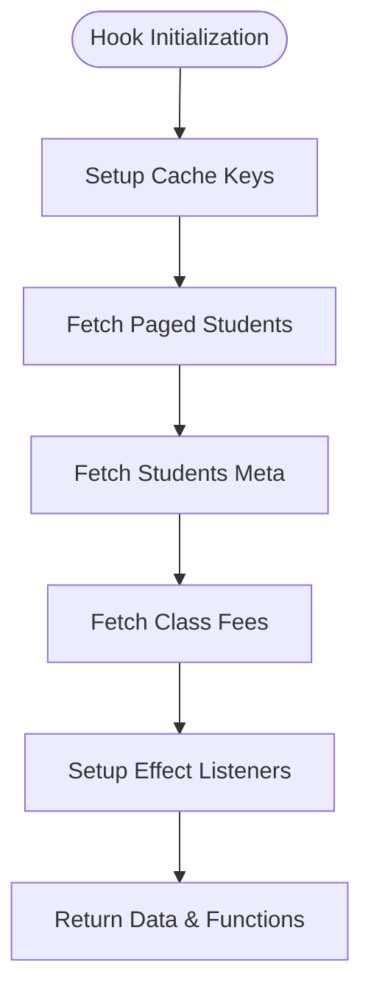

**Diagram sources**
- [app/[locale]/students/_hooks/useStudentsData.ts:44-120](file://app/%5Blocale%5D/students/_hooks/useStudentsData.ts#L44-L120)
- [app/[locale]/students/_hooks/useStudentsData.ts:197-254](file://app/%5Blocale%5D/students/_hooks/useStudentsData.ts#L197-L254)

Advanced features:
- **Intelligent Caching**: Smart cache invalidation based on filters
- **Dataset Loading**: Efficient loading of full datasets for exports
- **Class Fee Integration**: Dynamic fee data for enrollment forms
- **Meta Data Management**: Tab counts and summary statistics

**Section sources**
- [app/[locale]/students/_hooks/useStudentsData.ts:44-271](file://app/%5Blocale%5D/students/_hooks/useStudentsData.ts#L44-L271)
- [app/[locale]/students/_hooks/useStudentsData.ts:104-120](file://app/%5Blocale%5D/students/_hooks/useStudentsData.ts#L104-L120)

### useStudentsOperations Hook
The useStudentsOperations hook manages all business logic:

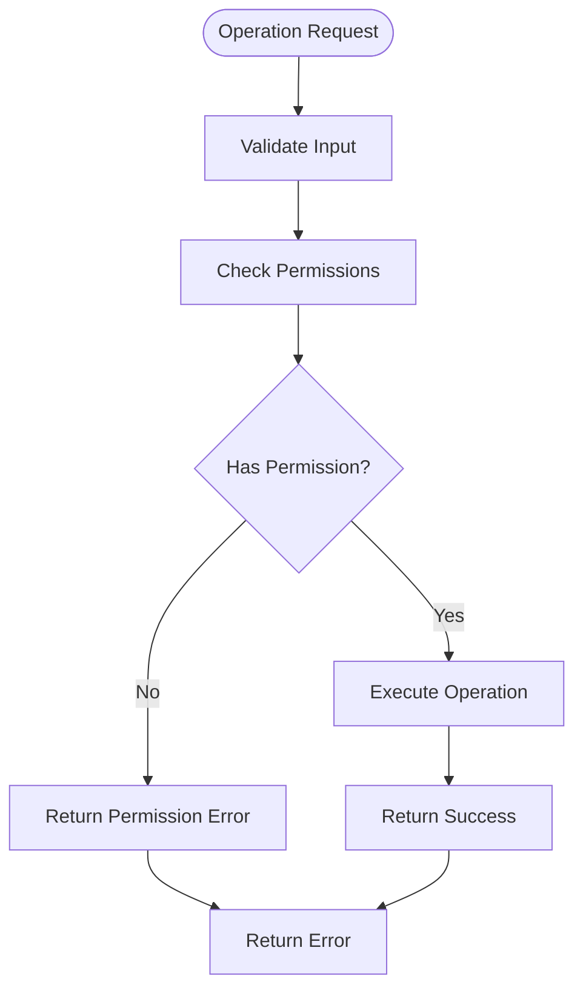

**Diagram sources**
- [app/[locale]/students/_hooks/useStudentsOperations.ts:74-123](file://app/%5Blocale%5D/students/_hooks/useStudentsOperations.ts#L74-L123)
- [app/[locale]/students/_hooks/useStudentsOperations.ts:260-345](file://app/%5Blocale%5D/students/_hooks/useStudentsOperations.ts#L260-L345)

Comprehensive functionality:
- **Multi-Operation Support**: Add, edit, delete, status change operations
- **Batch Processing**: Import/export operations with progress tracking
- **Account Management**: Student credential card generation and management
- **Error Handling**: Comprehensive error handling with user-friendly messages

**Section sources**
- [app/[locale]/students/_hooks/useStudentsOperations.ts:55-422](file://app/%5Blocale%5D/students/_hooks/useStudentsOperations.ts#L55-L422)
- [app/[locale]/students/_hooks/useStudentsOperations.ts:210-227](file://app/%5Blocale%5D/students/_hooks/useStudentsOperations.ts#L210-L227)

### useStudentsModals Hook
The useStudentsModals hook provides centralized modal state management:

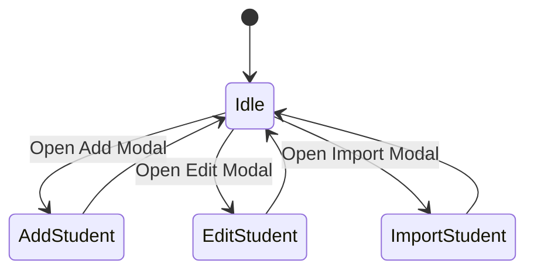

**Diagram sources**
- [app/[locale]/students/_hooks/useStudentsModals.ts:70-199](file://app/%5Blocale%5D/students/_hooks/useStudentsModals.ts#L70-L199)

Features include:
- **Modal Visibility Control**: Centralized state for all modals
- **Form State Management**: Complete form data handling
- **Error and Success Messaging**: Unified notification system
- **Dropdown Menu Management**: Contextual menu positioning and state

**Section sources**
- [app/[locale]/students/_hooks/useStudentsModals.ts:70-199](file://app/%5Blocale%5D/students/_hooks/useStudentsModals.ts#L70-L199)

### useStudentsPrint Hook
The useStudentsPrint hook manages all printing functionality:

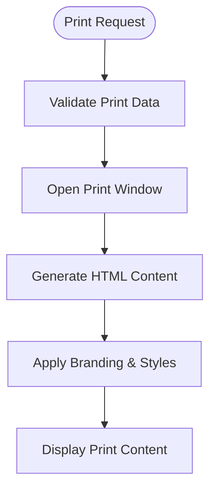

**Diagram sources**
- [app/[locale]/students/_hooks/useStudentsPrint.ts:20-124](file://app/%5Blocale%5D/students/_hooks/useStudentsPrint.ts#L20-L124)

Capabilities:
- **Student Profile Printing**: Individual student detail printing
- **Batch Printing**: Multiple student cards in a single document
- **Account Card Printing**: Student application access cards
- **Credential Copying**: Secure copying of login credentials

**Section sources**
- [app/[locale]/students/_hooks/useStudentsPrint.ts:20-124](file://app/%5Blocale%5D/students/_hooks/useStudentsPrint.ts#L20-L124)

## Utility Functions and Helpers

### Action Generation System
The getStudentActions utility dynamically generates appropriate actions based on user permissions and student status:

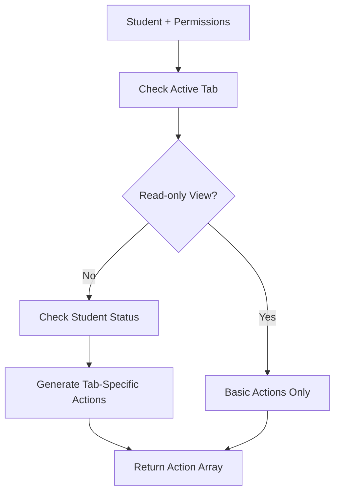

**Diagram sources**
- [app/[locale]/students/_utils/getStudentActions.ts:18-169](file://app/%5Blocale%5D/students/_utils/getStudentActions.ts#L18-L169)

Features:
- **Permission-Based Filtering**: Actions only shown when user has appropriate permissions
- **Status-Dependent Actions**: Different actions available based on student status
- **Contextual Menu Items**: Dynamic menu generation for each student
- **Danger Action Separation**: Clear distinction between safe and destructive actions

**Section sources**
- [app/[locale]/students/_utils/getStudentActions.ts:18-169](file://app/%5Blocale%5D/students/_utils/getStudentActions.ts#L18-L169)

### Data Processing and Formatting
The student utilities provide comprehensive data transformation and formatting capabilities:

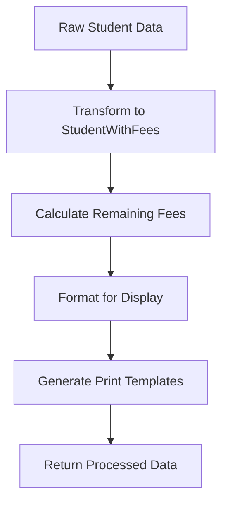

**Diagram sources**
- [app/[locale]/students/_utils.ts:102-132](file://app/%5Blocale%5D/students/_utils.ts#L102-L132)
- [app/[locale]/students/_utils.ts:134-177](file://app/%5Blocale%5D/students/_utils.ts#L134-L177)

Capabilities:
- **Data Normalization**: Search term normalization and sanitization
- **Fee Calculations**: Automatic remaining balance computation
- **Print Template Generation**: HTML templates for various print formats
- **API Error Handling**: Consistent error message formatting

**Section sources**
- [app/[locale]/students/_utils.ts:102-210](file://app/%5Blocale%5D/students/_utils.ts#L102-L210)

### Constants and Type Definitions
The system uses comprehensive constants and TypeScript definitions:

**Section sources**
- [app/[locale]/students/_constants.ts:1-51](file://app/%5Blocale%5D/students/_constants.ts#L1-L51)
- [app/[locale]/students/_types.ts:1-69](file://app/%5Blocale%5D/students/_types.ts#L1-L69)

## Dependency Analysis
The enhanced architecture maintains clean dependency relationships:

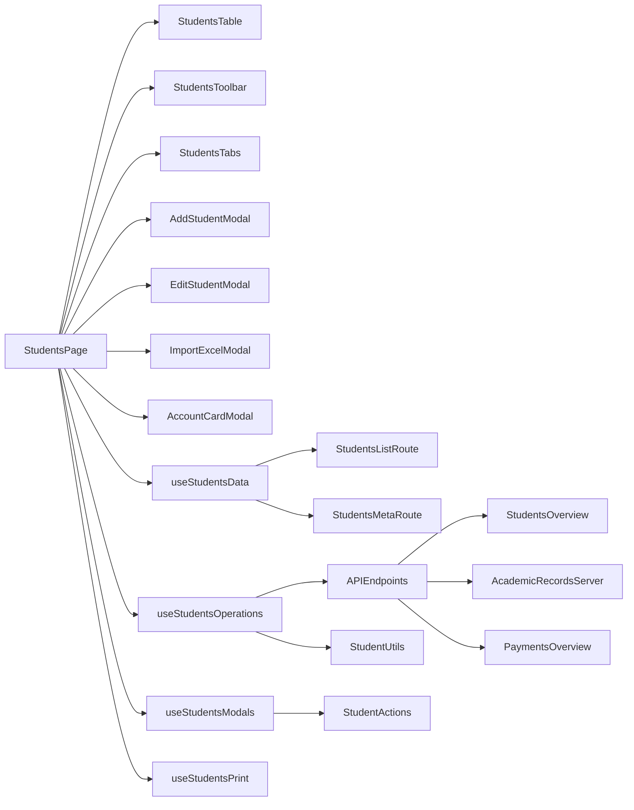

**Diagram sources**
- [app/[locale]/students/page.tsx:19-31](file://app/%5Blocale%5D/students/page.tsx#L19-L31)
- [app/[locale]/students/_hooks/useStudentsData.ts:82-101](file://app/%5Blocale%5D/students/_hooks/useStudentsData.ts#L82-L101)
- [app/[locale]/students/_hooks/useStudentsOperations.ts:88-109](file://app/%5Blocale%5D/students/_hooks/useStudentsOperations.ts#L88-L109)

Key dependency improvements:
- **Reduced Coupling**: Components communicate through well-defined interfaces
- **Clear Separation**: Business logic separated from presentation logic
- **Testable Architecture**: Hooks and components can be tested independently
- **Maintainable Code**: Modular structure simplifies debugging and updates

**Section sources**
- [app/[locale]/students/page.tsx:19-31](file://app/%5Blocale%5D/students/page.tsx#L19-L31)
- [app/[locale]/students/_hooks/useStudentsData.ts:82-101](file://app/%5Blocale%5D/students/_hooks/useStudentsData.ts#L82-L101)
- [app/[locale]/students/_hooks/useStudentsOperations.ts:88-109](file://app/%5Blocale%5D/students/_hooks/useStudentsOperations.ts#L88-L109)

## Performance Considerations
The enhanced architecture includes several performance optimizations:

### Caching Strategy
- **Smart Cache Keys**: Cache invalidated only when relevant filters change
- **Dataset Caching**: Full dataset cached for export operations to avoid repeated API calls
- **Class Fee Caching**: Static class fee data cached to reduce database queries

### Lazy Loading
- **Component Lazy Loading**: Non-critical components loaded on demand
- **Modal Lazy Loading**: Modals loaded only when needed
- **Data Lazy Loading**: Large datasets loaded incrementally

### Optimized Rendering
- **Memoization**: Complex calculations memoized to prevent unnecessary recomputation
- **Virtual Scrolling**: Large tables rendered efficiently with virtual scrolling
- **Conditional Rendering**: Components rendered only when visible

### Network Optimization
- **Batch Requests**: Multiple related requests combined into single network calls
- **Request Deduplication**: Duplicate requests automatically deduplicated
- **Progressive Loading**: Data loaded progressively to improve perceived performance

## Troubleshooting Guide
Common issues and solutions in the enhanced architecture:

### Component Issues
- **Modal Not Opening**: Check modal state management in useStudentsModals hook
- **Table Not Updating**: Verify cache keys and effect dependencies in useStudentsData
- **Form Validation Errors**: Review validation logic in individual modal components

### Data Issues
- **Missing Class Fees**: Ensure useStudentsData hook properly handles school scope resolution
- **Incorrect Tab Counts**: Check StudentsMetaRoute API endpoint implementation
- **Export Failures**: Verify dataset loading and Excel generation in useStudentsOperations

### Performance Issues
- **Slow Initial Load**: Check caching strategy and lazy loading implementation
- **Memory Leaks**: Review effect cleanup in all hooks
- **UI Freezing**: Implement virtual scrolling for large datasets

### Print Issues
- **Print Templates Not Loading**: Verify print utility functions and HTML generation
- **Account Cards Not Displaying**: Check credential card generation and modal state
- **Browser Popup Blocked**: Ensure proper popup handling for print windows

**Section sources**
- [app/[locale]/students/_hooks/useStudentsModals.ts](file://app/%5Blocale%5D/students/_hooks/useStudentsModals.ts)
- [app/[locale]/students/_hooks/useStudentsData.ts:104-120](file://app/%5Blocale%5D/students/_hooks/useStudentsData.ts#L104-L120)
- [app/[locale]/students/_hooks/useStudentsOperations.ts:210-227](file://app/%5Blocale%5D/students/_hooks/useStudentsOperations.ts#L210-L227)

## Conclusion
The enhanced student management system represents a significant architectural improvement that maintains all existing functionality while introducing modern React patterns and best practices. The modular component architecture, comprehensive hook system, and improved user experience provide a solid foundation for future enhancements.

Key achievements include:
- **Reduced Complexity**: Main component simplified from 1841 to 351 lines
- **Improved Maintainability**: Clear separation of concerns and modular design
- **Enhanced User Experience**: Intuitive workflows and responsive design
- **Better Performance**: Optimized data fetching and caching strategies
- **Future-Ready Architecture**: Scalable design supporting additional features

The system successfully balances functionality with maintainability, providing both immediate value and long-term flexibility for continued development.

## Appendices

### Practical Workflows

#### Enhanced Student Enrollment Workflow
1. **Access Add Student Modal**: Click "Add Student" button in toolbar
2. **Step 1 - Basic Information**: Enter student name, select class, optional section
3. **Step 2 - Contact Information**: Add address and phone number
4. **Step 3 - Fee Configuration**: Set total fee, paid amount, and discounts
5. **Automatic Calculations**: System calculates remaining balance and installment amounts
6. **Account Creation**: Student account automatically created with credentials

#### Advanced Student Management
1. **Bulk Operations**: Use toolbar to export, print, or manage multiple students
2. **Status Management**: Change student status through dropdown actions
3. **Profile Updates**: Edit student information through EditStudentModal
4. **Account Management**: Generate or reset student credentials through AccountCardModal

#### Data Import/Export
1. **Excel Import**: Use ImportExcelModal to batch add students from spreadsheet
2. **Template Download**: Download standardized Excel template for data entry
3. **Export Options**: Export current page or complete dataset in Excel format
4. **Print Operations**: Generate printable student cards and reports

#### Utility Function Usage
1. **Action Generation**: Use getStudentActions for dynamic menu creation
2. **Data Processing**: Utilize mapStudentRecordToStudentWithFees for data transformation
3. **Print Templates**: Generate HTML templates for various print formats
4. **Error Handling**: Implement consistent error messaging across the system

**Section sources**
- [app/[locale]/students/_components/AddStudentModal.tsx:115-284](file://app/%5Blocale%5D/students/_components/AddStudentModal.tsx#L115-L284)
- [app/[locale]/students/_components/StudentsToolbar.tsx:81-94](file://app/%5Blocale%5D/students/_components/StudentsToolbar.tsx#L81-L94)
- [app/[locale]/students/_hooks/useStudentsOperations.ts:260-356](file://app/%5Blocale%5D/students/_hooks/useStudentsOperations.ts#L260-L356)
- [app/[locale]/students/_utils/getStudentActions.ts:18-169](file://app/%5Blocale%5D/students/_utils/getStudentActions.ts#L18-L169)
- [app/[locale]/students/_utils.ts:102-132](file://app/%5Blocale%5D/students/_utils.ts#L102-L132)