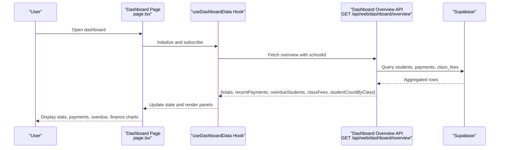
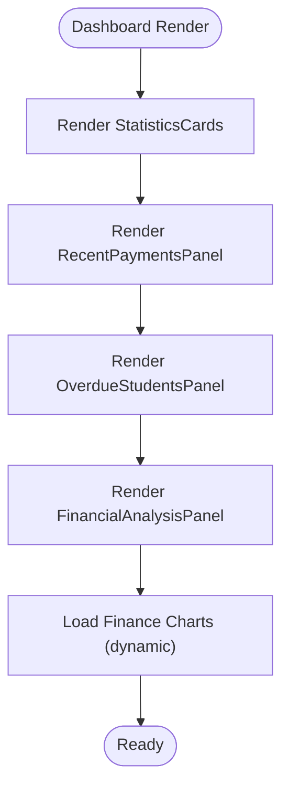
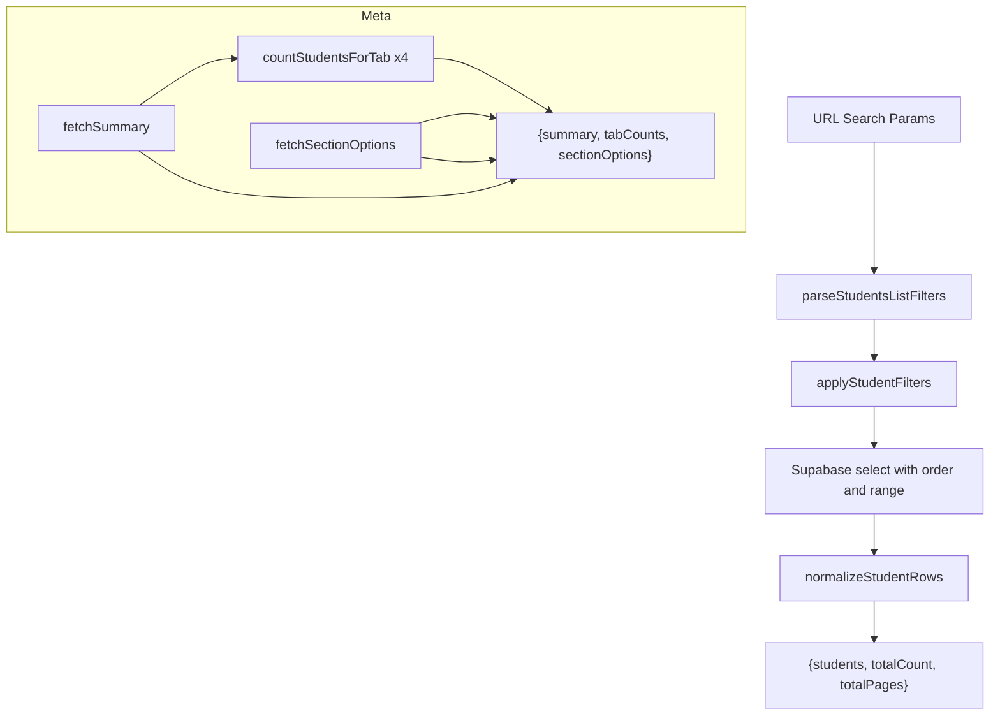
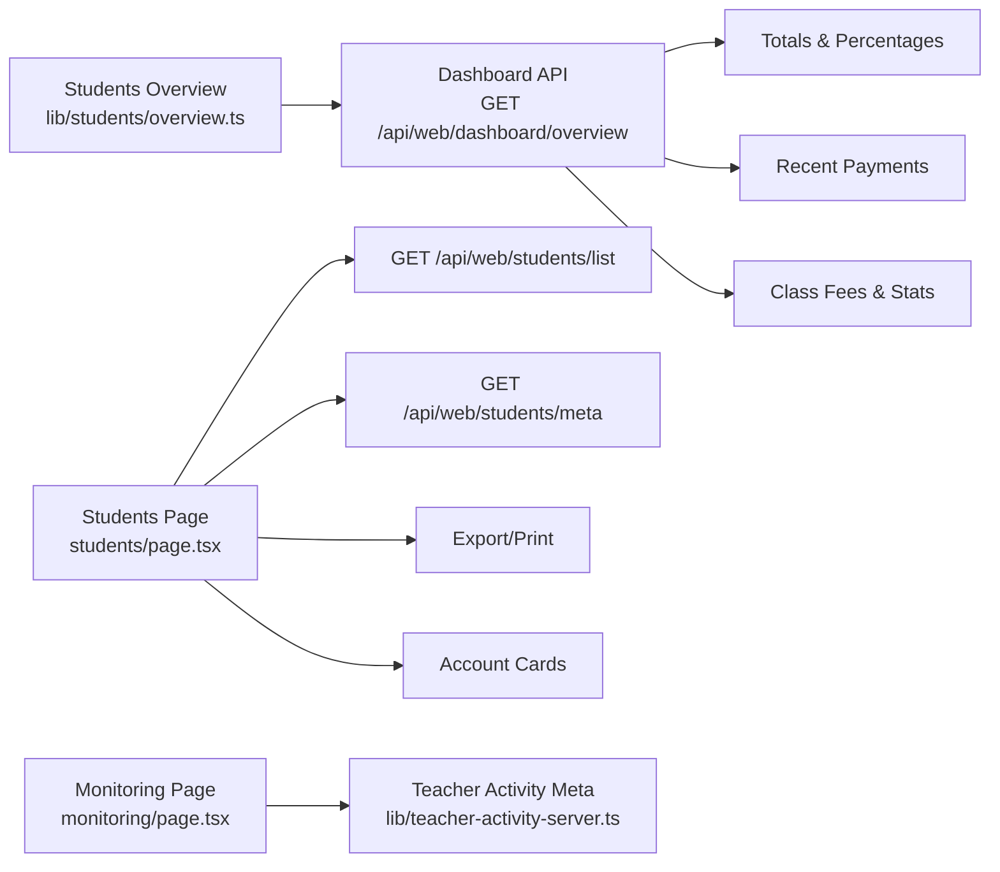
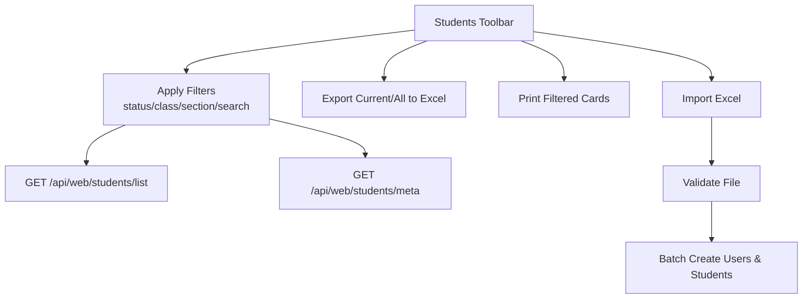
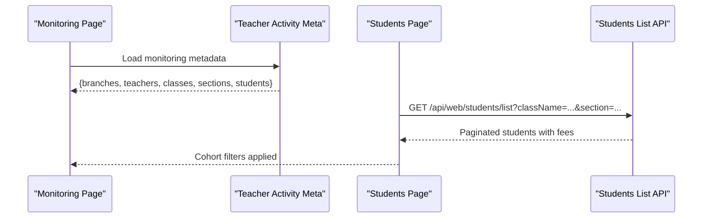
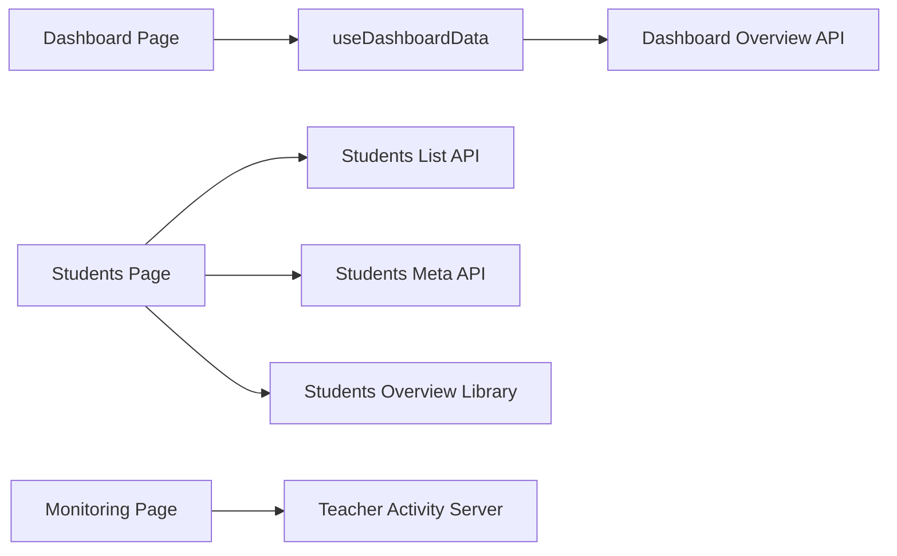

# Student Overview & Analytics

<cite>
**Referenced Files in This Document**
- [app/[locale]/dashboard/page.tsx](file://app/[locale]/dashboard/page.tsx)
- [app/[locale]/dashboard/_hooks/useDashboardData.ts](file://app/[locale]/dashboard/_hooks/useDashboardData.ts)
- [app/[locale]/dashboard/_components/StatisticsCards.tsx](file://app/[locale]/dashboard/_components/StatisticsCards.tsx)
- [app/[locale]/dashboard/_components/RecentPaymentsPanel.tsx](file://app/[locale]/dashboard/_components/RecentPaymentsPanel.tsx)
- [app/[locale]/dashboard/_components/OverdueStudentsPanel.tsx](file://app/[locale]/dashboard/_components/OverdueStudentsPanel.tsx)
- [app/[locale]/dashboard/_components/FinancialAnalysisPanel.tsx](file://app/[locale]/dashboard/_components/FinancialAnalysisPanel.tsx)
- [app/api/web/dashboard/overview/route.ts](file://app/api/web/dashboard/overview/route.ts)
- [app/[locale]/students/page.tsx](file://app/[locale]/students/page.tsx)
- [lib/students/overview.ts](file://lib/students/overview.ts)
- [app/api/web/students/list/route.ts](file://app/api/web/students/list/route.ts)
- [app/api/web/students/meta/route.ts](file://app/api/web/students/meta/route.ts)
- [app/[locale]/students/_components/StudentsStats.tsx](file://app/[locale]/students/_components/StudentsStats.tsx)
- [app/[locale]/monitoring/page.tsx](file://app/[locale]/monitoring/page.tsx)
- [lib/teacher-activity-server.ts](file://lib/teacher-activity-server.ts)
- [lib/teacher-activity.ts](file://lib/teacher-activity.ts)
- [app/[locale]/reports/page.tsx](file://app/[locale]/reports/page.tsx)
</cite>

## Table of Contents
1. [Introduction](#introduction)
2. [Project Structure](#project-structure)
3. [Core Components](#core-components)
4. [Architecture Overview](#architecture-overview)
5. [Detailed Component Analysis](#detailed-component-analysis)
6. [Dependency Analysis](#dependency-analysis)
7. [Performance Considerations](#performance-considerations)
8. [Troubleshooting Guide](#troubleshooting-guide)
9. [Conclusion](#conclusion)
10. [Appendices](#appendices)

## Introduction
This document describes the centralized student overview dashboard and analytics system. It covers:
- Centralized student information display: recent activities, status indicators, and quick-access links
- Student overview metrics: enrollment statistics, financial summaries, and payment status
- Integrations with payments, attendance, and academic records
- Customizable dashboard panels, filtering, and export capabilities
- Example workflows: student monitoring, at-risk identification, and cohort analysis
- Performance optimization and real-time synchronization strategies

## Project Structure
The system spans a Next.js app with TypeScript/React frontends, shared libraries for domain logic, and API routes that query Supabase. Key areas:
- Dashboard page orchestrates data fetching and renders panels
- Shared library encapsulates student list filters, normalization, and aggregation
- API routes expose school-scoped endpoints for dashboard and student lists
- Monitoring and reporting pages integrate with analytics and teacher activity

```mermaid
graph TB
subgraph "Frontend"
DPage["Dashboard Page<br/>app/[locale]/dashboard/page.tsx"]
SDHook["useDashboardData Hook<br/>app/[locale]/dashboard/_hooks/useDashboardData.ts"]
Stats["StatisticsCards<br/>.../StatisticsCards.tsx"]
RecPay["RecentPaymentsPanel<br/>.../RecentPaymentsPanel.tsx"]
Overdue["OverdueStudentsPanel<br/>.../OverdueStudentsPanel.tsx"]
FinPanel["FinancialAnalysisPanel<br/>.../FinancialAnalysisPanel.tsx"]
StudentsPage["Students Page<br/>app/[locale]/students/page.tsx"]
StudentsStats["StudentsStats<br/>.../StudentsStats.tsx"]
MonitoringPage["Monitoring Page<br/>app/[locale]/monitoring/page.tsx"]
ReportsPage["Reports Page<br/>app/[locale]/reports/page.tsx"]
end
subgraph "Shared Library"
StudentsLib["Students Overview<br/>lib/students/overview.ts"]
end
subgraph "API Routes"
DashAPI["GET /api/web/dashboard/overview<br/>app/api/web/dashboard/overview/route.ts"]
StudentsListAPI["GET /api/web/students/list<br/>app/api/web/students/list/route.ts"]
StudentsMetaAPI["GET /api/web/students/meta<br/>app/api/web/students/meta/route.ts"]
TA["Teacher Activity Meta<br/>lib/teacher-activity-server.ts"]
end
DPage --> SDHook
SDHook --> DashAPI
DPage --> Stats
DPage --> RecPay
DPage --> Overdue
DPage --> FinPanel
StudentsPage --> StudentsStats
StudentsPage --> StudentsListAPI
StudentsPage --> StudentsMetaAPI
StudentsPage --> StudentsLib
MonitoringPage --> TA
ReportsPage --> DashAPI
```

**Diagram sources**
- [app/[locale]/dashboard/page.tsx:1-185](file://app/[locale]/dashboard/page.tsx#L1-L185)
- [app/[locale]/dashboard/_hooks/useDashboardData.ts:1-92](file://app/[locale]/dashboard/_hooks/useDashboardData.ts#L1-L92)
- [app/[locale]/dashboard/_components/StatisticsCards.tsx:1-62](file://app/[locale]/dashboard/_components/StatisticsCards.tsx#L1-L62)
- [app/[locale]/dashboard/_components/RecentPaymentsPanel.tsx:1-44](file://app/[locale]/dashboard/_components/RecentPaymentsPanel.tsx#L1-L44)
- [app/[locale]/dashboard/_components/OverdueStudentsPanel.tsx:1-42](file://app/[locale]/dashboard/_components/OverdueStudentsPanel.tsx#L1-L42)
- [app/[locale]/dashboard/_components/FinancialAnalysisPanel.tsx:1-87](file://app/[locale]/dashboard/_components/FinancialAnalysisPanel.tsx#L1-L87)
- [app/api/web/dashboard/overview/route.ts:1-179](file://app/api/web/dashboard/overview/route.ts#L1-L179)
- [app/[locale]/students/page.tsx:1-449](file://app/[locale]/students/page.tsx#L1-L449)
- [lib/students/overview.ts:1-283](file://lib/students/overview.ts#L1-L283)
- [app/api/web/students/list/route.ts:1-55](file://app/api/web/students/list/route.ts#L1-L55)
- [app/api/web/students/meta/route.ts:1-55](file://app/api/web/students/meta/route.ts#L1-L55)
- [app/[locale]/monitoring/page.tsx:541-567](file://app/[locale]/monitoring/page.tsx#L541-L567)
- [lib/teacher-activity-server.ts:40-449](file://lib/teacher-activity-server.ts#L40-L449)
- [app/[locale]/reports/page.tsx:140-175](file://app/[locale]/reports/page.tsx#L140-L175)

**Section sources**
- [app/[locale]/dashboard/page.tsx:1-185](file://app/[locale]/dashboard/page.tsx#L1-L185)
- [app/[locale]/dashboard/_hooks/useDashboardData.ts:1-92](file://app/[locale]/dashboard/_hooks/useDashboardData.ts#L1-L92)
- [lib/students/overview.ts:1-283](file://lib/students/overview.ts#L1-L283)

## Core Components
- Dashboard page composes panels for totals, recent payments, overdue students, and financial analysis.
- useDashboardData hook centralizes fetching dashboard metrics via an API endpoint.
- Students overview library defines filters, normalization, and aggregation for student datasets.
- API routes provide school-scoped endpoints for dashboard totals, recent payments, class fees, and student list/meta.

Key responsibilities:
- Dashboard rendering and user interactions
- Fetching and caching dashboard metrics
- Normalizing and aggregating student data
- Exposing paginated student list and metadata

**Section sources**
- [app/[locale]/dashboard/page.tsx:30-151](file://app/[locale]/dashboard/page.tsx#L30-L151)
- [app/[locale]/dashboard/_hooks/useDashboardData.ts:30-91](file://app/[locale]/dashboard/_hooks/useDashboardData.ts#L30-L91)
- [lib/students/overview.ts:23-282](file://lib/students/overview.ts#L23-L282)
- [app/api/web/dashboard/overview/route.ts:20-178](file://app/api/web/dashboard/overview/route.ts#L20-L178)

## Architecture Overview
The dashboard integrates multiple data sources:
- Students table for enrollment and financial totals
- Payments table for recent transactions
- Class fees table for class-level expectations and progress
- Students list and meta endpoints for filtering and pagination

**Diagram sources**
- [app/[locale]/dashboard/page.tsx:37-41](file://app/[locale]/dashboard/page.tsx#L37-L41)
- [app/[locale]/dashboard/_hooks/useDashboardData.ts:38-74](file://app/[locale]/dashboard/_hooks/useDashboardData.ts#L38-L74)
- [app/api/web/dashboard/overview/route.ts:20-178](file://app/api/web/dashboard/overview/route.ts#L20-L178)

## Detailed Component Analysis

### Dashboard Overview Panels
- StatisticsCards: Displays primary KPIs (student counts, fees, paid amounts).
- RecentPaymentsPanel: Shows latest payments with student/class and amount.
- OverdueStudentsPanel: Highlights students with outstanding balances.
- FinancialAnalysisPanel: Renders financial summaries, charts, and progress bars.

**Diagram sources**
- [app/[locale]/dashboard/_components/StatisticsCards.tsx:10-61](file://app/[locale]/dashboard/_components/StatisticsCards.tsx#L10-L61)
- [app/[locale]/dashboard/_components/RecentPaymentsPanel.tsx:13-43](file://app/[locale]/dashboard/_components/RecentPaymentsPanel.tsx#L13-L43)
- [app/[locale]/dashboard/_components/OverdueStudentsPanel.tsx:13-41](file://app/[locale]/dashboard/_components/OverdueStudentsPanel.tsx#L13-L41)
- [app/[locale]/dashboard/_components/FinancialAnalysisPanel.tsx:21-86](file://app/[locale]/dashboard/_components/FinancialAnalysisPanel.tsx#L21-L86)

**Section sources**
- [app/[locale]/dashboard/_components/StatisticsCards.tsx:10-61](file://app/[locale]/dashboard/_components/StatisticsCards.tsx#L10-L61)
- [app/[locale]/dashboard/_components/RecentPaymentsPanel.tsx:13-43](file://app/[locale]/dashboard/_components/RecentPaymentsPanel.tsx#L13-L43)
- [app/[locale]/dashboard/_components/OverdueStudentsPanel.tsx:13-41](file://app/[locale]/dashboard/_components/OverdueStudentsPanel.tsx#L13-L41)
- [app/[locale]/dashboard/_components/FinancialAnalysisPanel.tsx:21-86](file://app/[locale]/dashboard/_components/FinancialAnalysisPanel.tsx#L21-L86)

### Student Overview Metrics and Filters
- Students overview library normalizes rows, computes derived fields, and aggregates counts per status and section.
- Filters support pagination, search, class, section, and status selection.
- API routes expose list and meta endpoints with rate limits and school scoping.

**Diagram sources**
- [lib/students/overview.ts:212-260](file://lib/students/overview.ts#L212-L260)
- [lib/students/overview.ts:87-113](file://lib/students/overview.ts#L87-L113)
- [lib/students/overview.ts:115-144](file://lib/students/overview.ts#L115-L144)
- [lib/students/overview.ts:160-190](file://lib/students/overview.ts#L160-L190)
- [lib/students/overview.ts:146-158](file://lib/students/overview.ts#L146-L158)
- [lib/students/overview.ts:192-210](file://lib/students/overview.ts#L192-L210)
- [app/api/web/students/list/route.ts:40-50](file://app/api/web/students/list/route.ts#L40-L50)
- [app/api/web/students/meta/route.ts:40-50](file://app/api/web/students/meta/route.ts#L40-L50)

**Section sources**
- [lib/students/overview.ts:23-282](file://lib/students/overview.ts#L23-L282)
- [app/api/web/students/list/route.ts:11-54](file://app/api/web/students/list/route.ts#L11-L54)
- [app/api/web/students/meta/route.ts:11-54](file://app/api/web/students/meta/route.ts#L11-L54)

### Integration with Payments, Attendance, and Academic Records
- Dashboard overview aggregates recent payments and class fees to compute class-level stats and paid percentages.
- Students page integrates with payments and class fees to compute remaining balances and export/print capabilities.
- Monitoring and teacher activity APIs provide metadata for teacher-student monitoring and cohort-level insights.

**Diagram sources**
- [app/api/web/dashboard/overview/route.ts:41-140](file://app/api/web/dashboard/overview/route.ts#L41-L140)
- [app/[locale]/students/page.tsx:226-286](file://app/[locale]/students/page.tsx#L226-L286)
- [app/[locale]/monitoring/page.tsx:541-567](file://app/[locale]/monitoring/page.tsx#L541-L567)
- [lib/teacher-activity-server.ts:414-449](file://lib/teacher-activity-server.ts#L414-L449)

**Section sources**
- [app/api/web/dashboard/overview/route.ts:41-140](file://app/api/web/dashboard/overview/route.ts#L41-L140)
- [app/[locale]/students/page.tsx:226-286](file://app/[locale]/students/page.tsx#L226-L286)
- [lib/teacher-activity-server.ts:40-449](file://lib/teacher-activity-server.ts#L40-L449)

### Customizable Dashboard Widgets, Filtering, and Export
- Dashboard panels are modular and rendered conditionally based on permissions and scope.
- Students page supports:
  - Filtering by status, class, section, and search
  - Export to Excel and print student cards
  - Import students from Excel with validation and batch creation
  - Account card generation/reset and credential copying

**Diagram sources**
- [app/[locale]/students/page.tsx:61-94](file://app/[locale]/students/page.tsx#L61-L94)
- [app/[locale]/students/page.tsx:226-286](file://app/[locale]/students/page.tsx#L226-L286)
- [app/[locale]/students/page.tsx:320-381](file://app/[locale]/students/page.tsx#L320-L381)
- [app/api/web/students/list/route.ts:40-50](file://app/api/web/students/list/route.ts#L40-L50)
- [app/api/web/students/meta/route.ts:40-50](file://app/api/web/students/meta/route.ts#L40-L50)

**Section sources**
- [app/[locale]/students/page.tsx:61-94](file://app/[locale]/students/page.tsx#L61-L94)
- [app/[locale]/students/page.tsx:226-286](file://app/[locale]/students/page.tsx#L226-L286)
- [app/[locale]/students/page.tsx:320-381](file://app/[locale]/students/page.tsx#L320-L381)

### Examples: Workflows and Cohort Analysis
- Student monitoring workflow:
  - Use monitoring page to view teacher activity metadata and summary cards.
  - Combine with student list filters to isolate cohorts by class/section.
- At-risk student identification:
  - Use dashboard “overdue students” panel and student list remaining-fee sorting to identify students with high arrearages.
- Cohort analysis:
  - Filter by class and section in the students page to compare counts, totals, and remaining balances across cohorts.

**Diagram sources**
- [app/[locale]/monitoring/page.tsx:541-567](file://app/[locale]/monitoring/page.tsx#L541-L567)
- [lib/teacher-activity-server.ts:414-449](file://lib/teacher-activity-server.ts#L414-L449)
- [app/[locale]/students/page.tsx:84-94](file://app/[locale]/students/page.tsx#L84-L94)
- [app/api/web/students/list/route.ts:40-50](file://app/api/web/students/list/route.ts#L40-L50)

**Section sources**
- [app/[locale]/monitoring/page.tsx:541-567](file://app/[locale]/monitoring/page.tsx#L541-L567)
- [lib/teacher-activity.ts:136-155](file://lib/teacher-activity.ts#L136-L155)
- [app/[locale]/students/page.tsx:84-94](file://app/[locale]/students/page.tsx#L84-L94)

## Dependency Analysis
- Dashboard page depends on useDashboardData hook and several panel components.
- useDashboardData depends on the dashboard overview API route.
- Students page depends on list and meta APIs and the shared students overview library.
- Monitoring page depends on teacher activity server utilities for metadata building.

**Diagram sources**
- [app/[locale]/dashboard/page.tsx:37-41](file://app/[locale]/dashboard/page.tsx#L37-L41)
- [app/[locale]/dashboard/_hooks/useDashboardData.ts:38-74](file://app/[locale]/dashboard/_hooks/useDashboardData.ts#L38-L74)
- [app/api/web/dashboard/overview/route.ts:20-178](file://app/api/web/dashboard/overview/route.ts#L20-L178)
- [app/[locale]/students/page.tsx:84-94](file://app/[locale]/students/page.tsx#L84-L94)
- [app/api/web/students/list/route.ts:40-50](file://app/api/web/students/list/route.ts#L40-L50)
- [app/api/web/students/meta/route.ts:40-50](file://app/api/web/students/meta/route.ts#L40-L50)
- [lib/students/overview.ts:212-260](file://lib/students/overview.ts#L212-L260)
- [app/[locale]/monitoring/page.tsx:541-567](file://app/[locale]/monitoring/page.tsx#L541-L567)
- [lib/teacher-activity-server.ts:414-449](file://lib/teacher-activity-server.ts#L414-L449)

**Section sources**
- [app/[locale]/dashboard/page.tsx:37-41](file://app/[locale]/dashboard/page.tsx#L37-L41)
- [app/[locale]/dashboard/_hooks/useDashboardData.ts:38-74](file://app/[locale]/dashboard/_hooks/useDashboardData.ts#L38-L74)
- [app/[locale]/students/page.tsx:84-94](file://app/[locale]/students/page.tsx#L84-L94)
- [lib/students/overview.ts:212-260](file://lib/students/overview.ts#L212-L260)

## Performance Considerations
- Rate limiting on student list and meta endpoints prevents abuse and stabilizes throughput.
- School-scoped queries ensure bounded datasets and reduce cross-school joins.
- Dashboard overview aggregates data server-side to minimize client computation.
- Dynamic imports defer heavy chart components to improve initial load times.
- Pagination and normalized filters limit payload sizes for large datasets.

Recommendations:
- Index Supabase columns used in filters (class_name, section, status).
- Cache infrequent dashboard snapshots with appropriate invalidation.
- Use debounced search inputs to reduce API churn.
- Consider background jobs for heavy exports and cohort analytics.

**Section sources**
- [app/api/web/students/list/route.ts:30-38](file://app/api/web/students/list/route.ts#L30-L38)
- [app/api/web/students/meta/route.ts:30-38](file://app/api/web/students/meta/route.ts#L30-L38)
- [app/[locale]/dashboard/_components/FinancialAnalysisPanel.tsx:9-15](file://app/[locale]/dashboard/_components/FinancialAnalysisPanel.tsx#L9-L15)
- [lib/students/overview.ts:212-227](file://lib/students/overview.ts#L212-L227)

## Troubleshooting Guide
Common issues and resolutions:
- School scope not selected:
  - Dashboard and student pages block content until a school is chosen; ensure school scope banner is visible and selector is enabled.
- API errors:
  - Dashboard overview and student endpoints return structured errors; check network tab for 5xx responses and error messages.
- Rate limiting:
  - If requests fail with rate limit errors, reduce frequency or increase thresholds for the given namespace.
- Missing data:
  - Verify school_id is present and class_fees table includes school_id column for accurate class-level stats.

**Section sources**
- [app/[locale]/dashboard/page.tsx:88-94](file://app/[locale]/dashboard/page.tsx#L88-L94)
- [app/[locale]/students/page.tsx:404-406](file://app/[locale]/students/page.tsx#L404-L406)
- [app/api/web/dashboard/overview/route.ts:31-36](file://app/api/web/dashboard/overview/route.ts#L31-L36)
- [app/api/web/students/list/route.ts:36-38](file://app/api/web/students/list/route.ts#L36-L38)
- [app/api/web/students/meta/route.ts:36-38](file://app/api/web/students/meta/route.ts#L36-L38)

## Conclusion
The student overview and analytics system provides a cohesive, school-scoped view integrating enrollment, payments, and class-level insights. Its modular components, shared library, and API routes enable customization, filtering, and export while maintaining performance and scalability. The monitoring and reporting pages further enrich the ecosystem with teacher activity and consolidated metrics.

## Appendices

### API Definitions
- GET /api/web/dashboard/overview?schoolId={id}
  - Returns totals, recentPayments, overdueStudents, classFees, studentCountByClass
  - Requires roles: super_admin, admin, employee
- GET /api/web/students/list?schoolId={id}&page=&pageSize=&search=&className=&sectionName=&status=
  - Returns paginated students, totalCount, totalPages
  - Rate-limited
- GET /api/web/students/meta?schoolId={id}&page=&pageSize=&search=&className=&sectionName=&status=
  - Returns summary, tabCounts, sectionOptions
  - Rate-limited

**Section sources**
- [app/api/web/dashboard/overview/route.ts:20-178](file://app/api/web/dashboard/overview/route.ts#L20-L178)
- [app/api/web/students/list/route.ts:11-54](file://app/api/web/students/list/route.ts#L11-L54)
- [app/api/web/students/meta/route.ts:11-54](file://app/api/web/students/meta/route.ts#L11-L54)