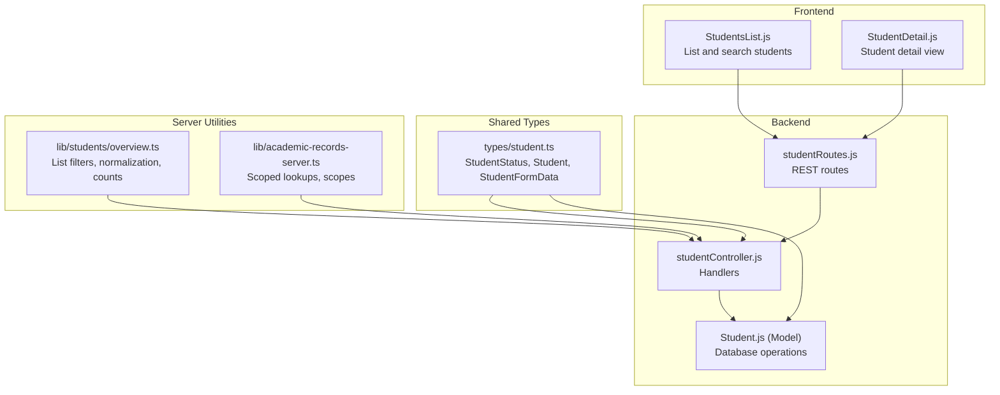
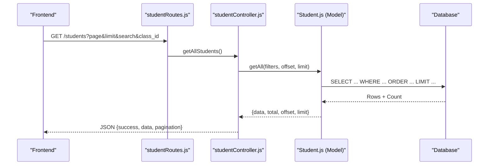
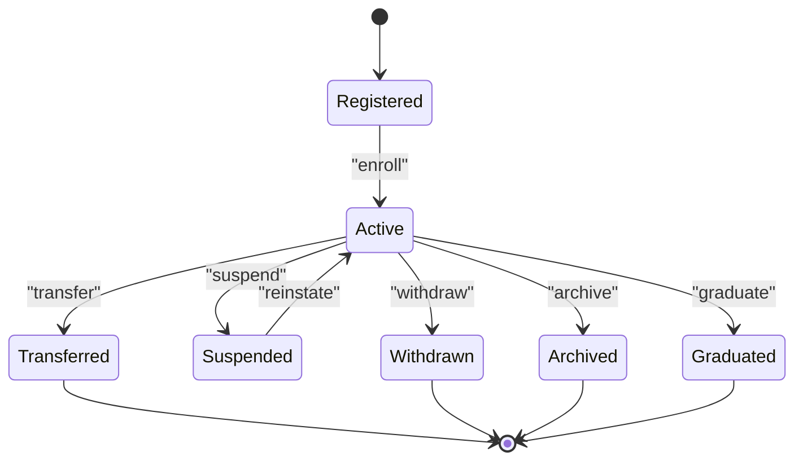
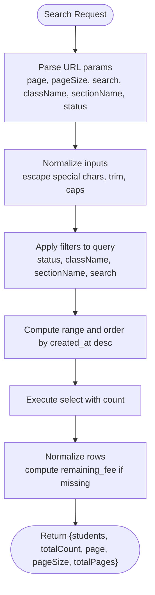
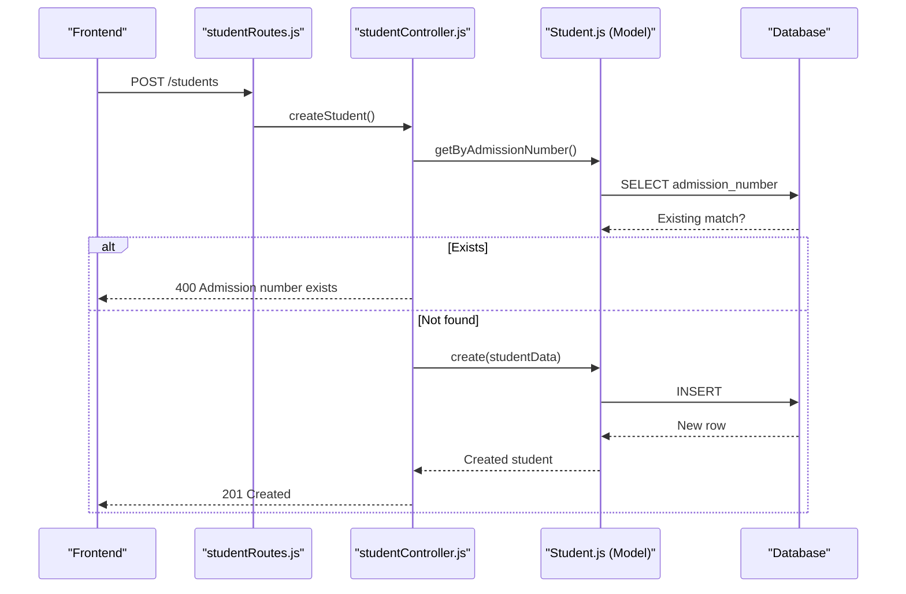
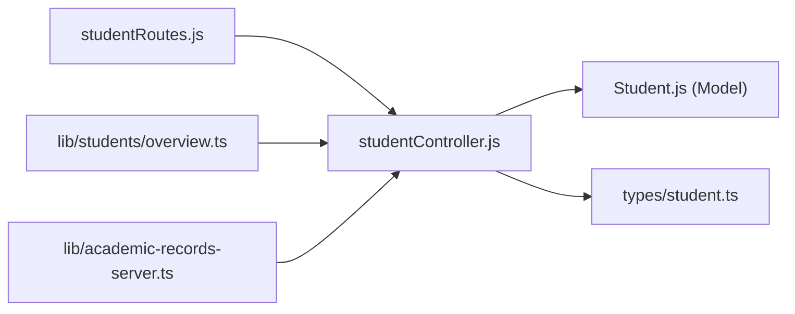

# Student Records Management

<cite>
**Referenced Files in This Document**
- [types/student.ts](file://types/student.ts)
- [lib/students/overview.ts](file://lib/students/overview.ts)
- [lib/academic-records-server.ts](file://lib/academic-records-server.ts)
- [00990090/school-accounting-system/backend/src/models/Student.js](file://00990090/school-accounting-system/backend/src/models/Student.js)
- [00990090/school-accounting-system/backend/src/controllers/studentController.js](file://00990090/school-accounting-system/backend/src/controllers/studentController.js)
- [00990090/school-accounting-system/backend/src/routes/studentRoutes.js](file://00990090/school-accounting-system/backend/src/routes/studentRoutes.js)
- [00990090/school-accounting-system/frontend/src/pages/StudentsList.js](file://00990090/school-accounting-system/frontend/src/pages/StudentsList.js)
- [00990090/school-accounting-system/frontend/src/pages/StudentDetail.js](file://00990090/school-accounting-system/frontend/src/pages/StudentDetail.js)
</cite>

## Table of Contents
1. [Introduction](#introduction)
2. [Project Structure](#project-structure)
3. [Core Components](#core-components)
4. [Architecture Overview](#architecture-overview)
5. [Detailed Component Analysis](#detailed-component-analysis)
6. [Dependency Analysis](#dependency-analysis)
7. [Performance Considerations](#performance-considerations)
8. [Troubleshooting Guide](#troubleshooting-guide)
9. [Conclusion](#conclusion)
10. [Appendices](#appendices)

## Introduction
This document describes the student records management system with emphasis on the data model, lifecycle, search and filtering, bulk operations, and operational practices. It consolidates backend and frontend components to present a unified view of how student records are created, queried, filtered, updated, archived, and searched across the platform.

## Project Structure
The system spans a dual-layer architecture:
- Backend REST API (Express) with routes, controllers, and a model for student operations.
- Frontend React application for listing and basic CRUD actions.
- Shared TypeScript types for student status and form data.
- Supabase-based server utilities for scoped lookups and academic features.

**Diagram sources**
- [00990090/school-accounting-system/backend/src/routes/studentRoutes.js:1-32](file://00990090/school-accounting-system/backend/src/routes/studentRoutes.js#L1-L32)
- [00990090/school-accounting-system/backend/src/controllers/studentController.js:1-235](file://00990090/school-accounting-system/backend/src/controllers/studentController.js#L1-L235)
- [00990090/school-accounting-system/backend/src/models/Student.js:1-183](file://00990090/school-accounting-system/backend/src/models/Student.js#L1-L183)
- [types/student.ts:1-32](file://types/student.ts#L1-L32)
- [lib/students/overview.ts:1-283](file://lib/students/overview.ts#L1-L283)
- [lib/academic-records-server.ts:1-941](file://lib/academic-records-server.ts#L1-L941)
- [00990090/school-accounting-system/frontend/src/pages/StudentsList.js:1-215](file://00990090/school-accounting-system/frontend/src/pages/StudentsList.js#L1-L215)
- [00990090/school-accounting-system/frontend/src/pages/StudentDetail.js:1-14](file://00990090/school-accounting-system/frontend/src/pages/StudentDetail.js#L1-L14)

**Section sources**
- [00990090/school-accounting-system/backend/src/routes/studentRoutes.js:1-32](file://00990090/school-accounting-system/backend/src/routes/studentRoutes.js#L1-L32)
- [00990090/school-accounting-system/backend/src/controllers/studentController.js:1-235](file://00990090/school-accounting-system/backend/src/controllers/studentController.js#L1-L235)
- [00990090/school-accounting-system/backend/src/models/Student.js:1-183](file://00990090/school-accounting-system/backend/src/models/Student.js#L1-L183)
- [types/student.ts:1-32](file://types/student.ts#L1-L32)
- [lib/students/overview.ts:1-283](file://lib/students/overview.ts#L1-L283)
- [lib/academic-records-server.ts:1-941](file://lib/academic-records-server.ts#L1-L941)
- [00990090/school-accounting-system/frontend/src/pages/StudentsList.js:1-215](file://00990090/school-accounting-system/frontend/src/pages/StudentsList.js#L1-L215)
- [00990090/school-accounting-system/frontend/src/pages/StudentDetail.js:1-14](file://00990090/school-accounting-system/frontend/src/pages/StudentDetail.js#L1-L14)

## Core Components
- Student data model and status:
  - Status values include active, transferred, suspended, deleted, graduated, withdrawn, archived.
  - Core fields include identifiers, personal info, contact details, class and section, fee-related fields, and timestamps.
- Shared TypeScript types define the canonical shape for UI and server-side processing.
- Students overview utilities provide filtering, normalization, pagination, and counts for UI tabs.

**Section sources**
- [types/student.ts:1-32](file://types/student.ts#L1-L32)
- [lib/students/overview.ts:1-283](file://lib/students/overview.ts#L1-L283)

## Architecture Overview
The system follows a layered REST architecture:
- Routes define endpoints and apply authentication and role-based authorization.
- Controllers implement request handling, validation, and orchestration.
- Models encapsulate database queries and return normalized results.
- Frontend pages consume the API for listing, searching, and basic edits.

**Diagram sources**
- [00990090/school-accounting-system/backend/src/routes/studentRoutes.js:10-11](file://00990090/school-accounting-system/backend/src/routes/studentRoutes.js#L10-L11)
- [00990090/school-accounting-system/backend/src/controllers/studentController.js:12-40](file://00990090/school-accounting-system/backend/src/controllers/studentController.js#L12-L40)
- [00990090/school-accounting-system/backend/src/models/Student.js:13-65](file://00990090/school-accounting-system/backend/src/models/Student.js#L13-L65)

## Detailed Component Analysis

### Data Model and Lifecycle
- Data model fields:
  - Identity: id, school_id, auth_user_id
  - Personal: full_name
  - Classing: class_name, section
  - Contact: phone, address
  - Fees: total_fee, paid_fee, discount_value, remaining_fee
  - Status: status with enumerated values
  - Timestamps: created_at, updated_at
- Lifecycle stages:
  - Registration: create student via POST endpoint with admission number uniqueness check.
  - Active enrollment: maintained with status transitions to active, graduated, withdrawn, archived.
  - Suspension/Transfer/Withdrawal/Deletion: handled via status updates and soft deletion semantics.
  - Graduation: represented by status graduated; remaining fee computed as total minus paid and discount.

**Section sources**
- [types/student.ts:10-25](file://types/student.ts#L10-L25)
- [00990090/school-accounting-system/backend/src/controllers/studentController.js:75-102](file://00990090/school-accounting-system/backend/src/controllers/studentController.js#L75-L102)
- [00990090/school-accounting-system/backend/src/models/Student.js:100-121](file://00990090/school-accounting-system/backend/src/models/Student.js#L100-L121)

### Search and Filtering
- Backend search:
  - Endpoint supports name or admission number search with ILIKE pattern matching.
  - Minimum query length enforced server-side.
- Frontend search:
  - Controlled by URL parameters; triggers list reload and resets pagination.
- Advanced filtering:
  - Students overview utilities support:
    - Tab-based status filtering (active vs others).
    - Class and section filters.
    - Full-text search across name and class.
    - Pagination normalization and bounds.

**Diagram sources**
- [lib/students/overview.ts:212-260](file://lib/students/overview.ts#L212-L260)
- [lib/students/overview.ts:87-113](file://lib/students/overview.ts#L87-L113)
- [lib/students/overview.ts:115-144](file://lib/students/overview.ts#L115-L144)

**Section sources**
- [00990090/school-accounting-system/backend/src/controllers/studentController.js:191-224](file://00990090/school-accounting-system/backend/src/controllers/studentController.js#L191-L224)
- [00990090/school-accounting-system/frontend/src/pages/StudentsList.js:24-27](file://00990090/school-accounting-system/frontend/src/pages/StudentsList.js#L24-L27)
- [lib/students/overview.ts:212-227](file://lib/students/overview.ts#L212-L227)

### Bulk Operations
- Import/export:
  - No explicit import/export endpoints were identified in the reviewed backend routes.
- Batch updates:
  - No dedicated batch update endpoints were identified in the reviewed backend routes.
- Practical guidance:
  - Use the list endpoint with filters and pagination to drive external scripts.
  - Apply status updates via the update endpoint per record.
  - Archive/delete via soft deletion semantics.

**Section sources**
- [00990090/school-accounting-system/backend/src/routes/studentRoutes.js:22-29](file://00990090/school-accounting-system/backend/src/routes/studentRoutes.js#L22-L29)
- [00990090/school-accounting-system/backend/src/models/Student.js:153-159](file://00990090/school-accounting-system/backend/src/models/Student.js#L153-L159)

### Access Controls and Authorization
- Role-based access:
  - Create, update student requires roles admin or accountant.
  - Delete student requires role admin.
- Authentication:
  - All student routes are protected by authentication middleware.

**Section sources**
- [00990090/school-accounting-system/backend/src/routes/studentRoutes.js:8-29](file://00990090/school-accounting-system/backend/src/routes/studentRoutes.js#L8-L29)

### Data Privacy and Audit Trails
- Privacy considerations:
  - Admission number uniqueness is enforced at the server level.
  - Soft deletion preserves historical auditability.
- Audit trail:
  - Updated timestamps are maintained on updates.
  - Soft delete toggles activity flag and updates timestamp.

**Section sources**
- [00990090/school-accounting-system/backend/src/controllers/studentController.js:79-86](file://00990090/school-accounting-system/backend/src/controllers/studentController.js#L79-L86)
- [00990090/school-accounting-system/backend/src/models/Student.js:153-159](file://00990090/school-accounting-system/backend/src/models/Student.js#L153-L159)

### Practical Examples

- Create a student record:
  - Use POST /students with required fields; admission number must be unique.
  - On success, returns the created record.
- Modify a student record:
  - Use PUT /students/:id to update personal and contact details, class/section, and activity flag.
- Archive/Soft delete a student:
  - Use DELETE /students/:id; the record remains in DB but marked inactive.

**Diagram sources**
- [00990090/school-accounting-system/backend/src/routes/studentRoutes.js:23-23](file://00990090/school-accounting-system/backend/src/routes/studentRoutes.js#L23-L23)
- [00990090/school-accounting-system/backend/src/controllers/studentController.js:75-102](file://00990090/school-accounting-system/backend/src/controllers/studentController.js#L75-L102)
- [00990090/school-accounting-system/backend/src/models/Student.js:100-121](file://00990090/school-accounting-system/backend/src/models/Student.js#L100-L121)

**Section sources**
- [00990090/school-accounting-system/backend/src/controllers/studentController.js:75-102](file://00990090/school-accounting-system/backend/src/controllers/studentController.js#L75-L102)
- [00990090/school-accounting-system/backend/src/models/Student.js:100-121](file://00990090/school-accounting-system/backend/src/models/Student.js#L100-L121)

## Dependency Analysis
- Route-to-controller mapping defines the API surface.
- Controller-to-model coupling centralizes DB logic.
- Shared types unify client and server expectations.
- Students overview utilities depend on Supabase client for scoped queries.

**Diagram sources**
- [00990090/school-accounting-system/backend/src/routes/studentRoutes.js:1-32](file://00990090/school-accounting-system/backend/src/routes/studentRoutes.js#L1-L32)
- [00990090/school-accounting-system/backend/src/controllers/studentController.js:1-235](file://00990090/school-accounting-system/backend/src/controllers/studentController.js#L1-L235)
- [00990090/school-accounting-system/backend/src/models/Student.js:1-183](file://00990090/school-accounting-system/backend/src/models/Student.js#L1-L183)
- [types/student.ts:1-32](file://types/student.ts#L1-L32)
- [lib/students/overview.ts:1-283](file://lib/students/overview.ts#L1-L283)
- [lib/academic-records-server.ts:1-941](file://lib/academic-records-server.ts#L1-L941)

**Section sources**
- [00990090/school-accounting-system/backend/src/routes/studentRoutes.js:1-32](file://00990090/school-accounting-system/backend/src/routes/studentRoutes.js#L1-L32)
- [00990090/school-accounting-system/backend/src/controllers/studentController.js:1-235](file://00990090/school-accounting-system/backend/src/controllers/studentController.js#L1-L235)
- [00990090/school-accounting-system/backend/src/models/Student.js:1-183](file://00990090/school-accounting-system/backend/src/models/Student.js#L1-L183)
- [types/student.ts:1-32](file://types/student.ts#L1-L32)
- [lib/students/overview.ts:1-283](file://lib/students/overview.ts#L1-L283)
- [lib/academic-records-server.ts:1-941](file://lib/academic-records-server.ts#L1-L941)

## Performance Considerations
- Pagination and ordering:
  - Results are ordered by created_at descending and paginated; ensure appropriate indexing on these columns.
- Filtering:
  - Use status and class filters to reduce result sets; avoid overly broad ILIKE patterns.
- Normalization:
  - Clients should normalize inputs (trim, escape) to minimize invalid queries.

[No sources needed since this section provides general guidance]

## Troubleshooting Guide
- Admission number conflict:
  - Creation fails if admission number already exists; change the number and retry.
- Search query too short:
  - Search requires at least two characters; adjust query length.
- Not found errors:
  - Retrieve by ID or admission number returns not found when records are missing or soft-deleted.
- Permission denied:
  - Create/update/delete require admin or accountant roles; verify user credentials.

**Section sources**
- [00990090/school-accounting-system/backend/src/controllers/studentController.js:79-86](file://00990090/school-accounting-system/backend/src/controllers/studentController.js#L79-L86)
- [00990090/school-accounting-system/backend/src/controllers/studentController.js:195-200](file://00990090/school-accounting-system/backend/src/controllers/studentController.js#L195-L200)
- [00990090/school-accounting-system/backend/src/controllers/studentController.js:51-56](file://00990090/school-accounting-system/backend/src/controllers/studentController.js#L51-L56)
- [00990090/school-accounting-system/backend/src/routes/studentRoutes.js:22-29](file://00990090/school-accounting-system/backend/src/routes/studentRoutes.js#L22-L29)

## Conclusion
The student records management system provides a robust foundation for maintaining student data, enforcing status-driven lifecycle transitions, and enabling efficient search and filtering. While explicit import/export and batch update endpoints are not present, the list and filter utilities, combined with role-based access and soft deletion, support scalable operational workflows. Extending the system with dedicated bulk endpoints and audit logging would further strengthen compliance and performance.

## Appendices

### API Surface Summary
- GET /students
  - Query parameters: page, limit, search, class_id
  - Returns paginated list with total and pages
- GET /students/search
  - Query parameter: query (min length 2)
  - Returns matching student summaries
- GET /students/:id
  - Returns full student record with class/section names
- GET /students/:id/payment-summary
  - Returns fee totals and balances
- POST /students
  - Requires admin or accountant role; admission number must be unique
- PUT /students/:id
  - Update personal/contact/class/section/activity
- DELETE /students/:id
  - Requires admin role; soft deletes

**Section sources**
- [00990090/school-accounting-system/backend/src/routes/studentRoutes.js:10-29](file://00990090/school-accounting-system/backend/src/routes/studentRoutes.js#L10-L29)
- [00990090/school-accounting-system/backend/src/controllers/studentController.js:12-224](file://00990090/school-accounting-system/backend/src/controllers/studentController.js#L12-L224)